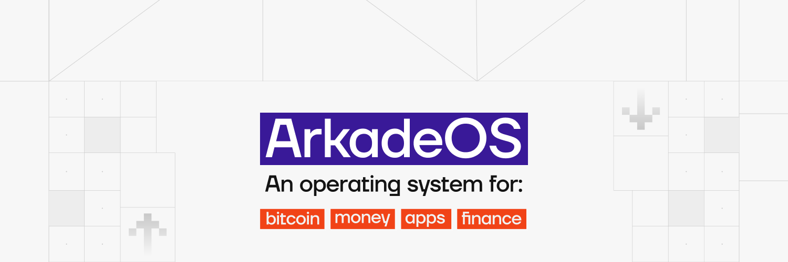

Jaringan Bitcoin menghadapi tantangan besar: skalabilitas. Meskipun lapisan utama (lapisan 1) menawarkan keamanan dan desentralisasi yang tak tertandingi, lapisan ini hanya mampu menangani sejumlah transaksi per detik. Lightning Network hadir sebagai solusi lapisan kedua (lapisan 2) yang menjanjikan, memungkinkan pembayaran yang cepat dan murah. Namun, Lightning juga memiliki kendala tersendiri: manajemen channel, kebutuhan likuiditas masuk, dan kerumitan teknis yang sering kali menghambat pengguna baru.

Di sinilah **Ark** hadir. Ark adalah protokol layer 2 baru yang dirancang untuk memberikan pengalaman pengguna yang lebih sederhana tanpa mengorbankan kedaulatan. **ArkadeOS** atau Arkade adalah implementasi besar pertama dari protokol ini, yang menawarkan dompet Bitcoin generasi berikutnya.

Tutorial ini akan memandu kamu memasuki dunia Arkade. Kita akan menjelajahi cara kerja protokol Ark, cara menginstal dan mengonfigurasi wallet Arkade, serta cara menggunakannya untuk mengirim dan menerima bitcoin secara instan, privat, dan tanpa gesekan yang biasanya ditemui di Lightning

## Memahami protokol Ark

Sebelum kita mendalami penggunaan Arkade, penting untuk memahami konsep utama protokol Ark yang menjadi penggeraknya. Ark bukanlah sebuah blockchain terpisah, melainkan sebuah mekanisme koordinasi cerdas yang berjalan di atas Bitcoin.

### Konsep VTXO

Inti dari Ark adalah **VTXO** (Virtual UTXO). VTXO adalah UTXO yang belum dipublikasikan di blockchain Bitcoin: ia berada di luar rantai utama (off-chain), tetapi tetap didukung oleh transaksi yang sudah ditandatangani sebelumnya di blockchain.

Tidak seperti saldo di bursa terpusat, VTXO benar-benar milik kamu. Kamu memegang bukti kriptografi yang memungkinkan kamu, kapan saja, untuk mengklaim bitcoin asli yang sesuai di blockchain, bahkan jika server Ark menghilang. VTXO memungkinkan kamu mentransfer nilai secara instan antar pengguna tanpa perlu menunggu konfirmasi blok.

### Peran ASP (Penyedia Layanan Bahtera)

Protokol Ark beroperasi pada model klien-server. Server disebut **ASP** (Penyedia Layanan Ark). ASP berperan sebagai konduktor:

- Ini menyediakan likuiditas yang diperlukan untuk jaringan.
- Ini mengoordinasikan transaksi antar pengguna.
- Ini mengatur "putaran" penyelesaian pada blockchain.

Sangat penting untuk dicatat bahwa ASP bersifat **non-kustodian**. ASP tidak pernah menyimpan private key kamu dan juga tidak dapat mencuri dana kamu. Perannya murni bersifat teknis dan logistik. Jika ASP menyensor transaksi kamu atau mengalami kegagalan, kamu selalu dapat memulihkan dana kamu melalui prosedur keluar sepihak.

### Putaran dan privasi

Transaksi di Ark diselesaikan dalam batch yang disebut **Rounds**. Secara berkala, misalnya setiap beberapa detik, ASP mengumpulkan semua transaksi yang tertunda dan menambatkannya ke blockchain Bitcoin dalam satu transaksi yang dioptimalkan.

Mekanisme ini menawarkan dua keuntungan utama:

- **Skalabilitas**: Satu transaksi on-chain dapat memvalidasi ribuan pembayaran off-chain, sehingga secara drastis mengurangi biaya bagi pengguna.
- **Kerahasiaan**: Setiap round bertindak sebagai **CoinJoin**. Dana dari semua peserta dicampur ke dalam satu kumpulan umum sebelum didistribusikan kembali dalam bentuk VTXO baru. Hal ini memutus hubungan antara pengirim dan penerima, sehingga sangat sulit, bahkan nyaris mustahil, bagi pengamat luar untuk melacak pembayaran.
.

## Presentasi ArkadeOS

ArkadeOS adalah aplikasi konkret yang membuat protokol Ark tersedia bagi masyarakat umum. Dikembangkan oleh Ark Labs, ini adalah ekosistem lengkap yang terdiri dari wallet, server (operator), dan alat pengembang.

Bagi pengguna akhir, Arkade hadir dalam bentuk web wallet yang elegan dan intuitif (PWA, Progressive Web App). Arkade menyembunyikan kompleksitas kriptografi VTXO dan mekanisme round di balik antarmuka yang sudah familiar. Dengan Arkade, kamu memiliki alamat untuk menerima, tombol untuk mengirim, dan riwayat transaksi, layaknya wallet klasik, tetapi dengan kekuatan kesegeraan dan kerahasiaan dari Ark.

## Instalasi dan konfigurasi

Karena Arkade adalah Aplikasi Web Progresif, aplikasi ini sangat mudah dipasang, dan tidak harus melibatkan toko aplikasi tradisional.

### Akses dan pemasangan

Kamu bisa mengakses Arkade secara langsung dari web browser modern apa pun (Chrome, Safari, Brave) di komputer atau ponsel.

- Kunjungi situs web resmi aplikasi ini: **[arkade.money](https://arkade.money)**.

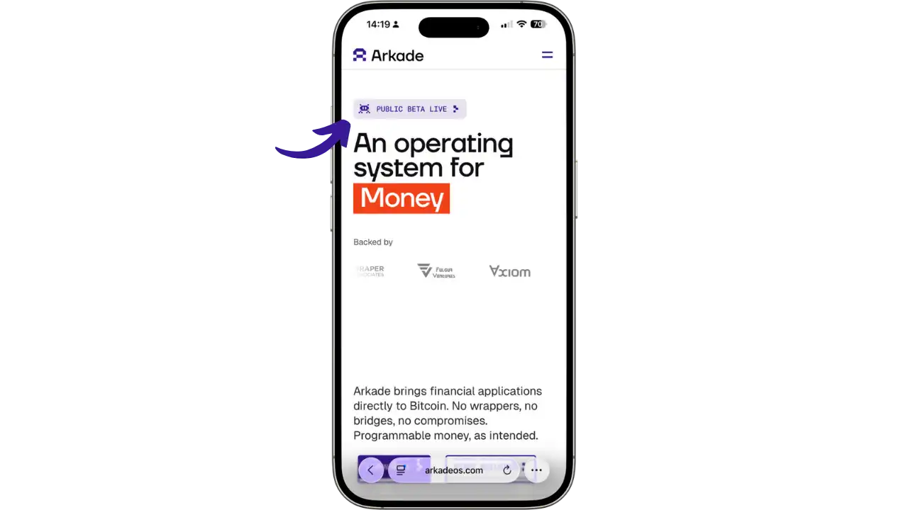

Kamu akan disambut oleh serangkaian layar pengantar yang memperkenalkan kamu pada konsep utama Arkade: ekosistem baru untuk Bitcoin, pentingnya self-custody, dan manfaat transaksi batch.

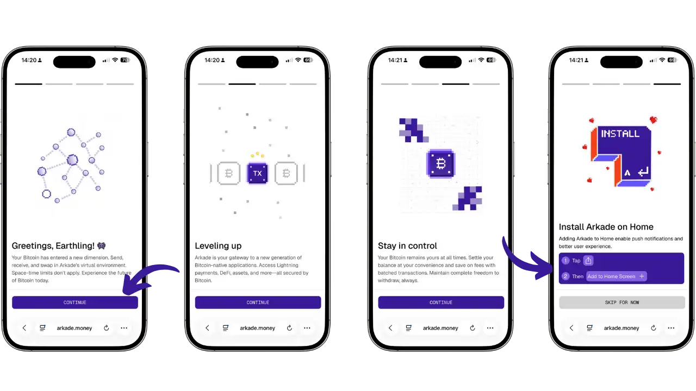

- Di Android (Chrome/Brave)** : Tekan menu browser (tiga titik) dan pilih "Instal aplikasi" atau "Tambahkan ke layar beranda".
- Pada iOS (Safari)**: Tekan tombol berbagi (kotak dengan panah ke atas) dan pilih "Di layar beranda".

Setelah terinstal, Arkade akan diluncurkan seperti aplikasi native, tampil layar penuh tanpa bilah alamat.

### Pembuatan portofolio

Saat pertama kali diluncurkan, kamu akan diminta untuk mengonfigurasi portofolio milikmu.

- Klik **"Buat Wallet Baru "**.

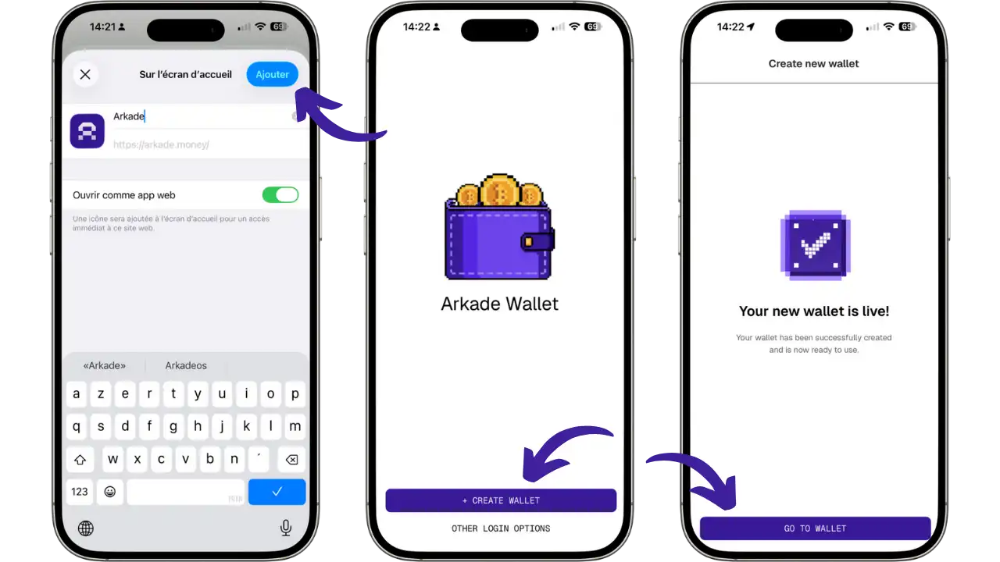

- Wallet dibuat secara instan. Tidak seperti wallet Bitcoin tradisional, **Arkade tidak menggunakan seedphrase 12 atau 24 kata**. Sebagai gantinya, Arkade secara otomatis membuat **private key** dalam format Nostr (nsec), yang digunakan untuk mencadangkan dan memulihkan wallet kamu. Pastikan kamu segera menyimpan kunci ini dengan aman (lihat bagian selanjutnya).

- Kamu akan melihat layar "Your new wallet is live!", yang mengonfirmasi bahwa wallet kamu sudah siap digunakan. Klik **"GO TO WALLET"** untuk mengakses antarmuka utama.

Begitu masuk ke wallet, kamu akan langsung dibawa ke antarmuka utama Arkade. Di sini kamu dapat melihat saldo, tombol untuk mengirim dan menerima dana, serta tab "Applications" yang memberi akses ke aplikasi terintegrasi seperti Boltz (exchange Lightning), LendaSat dan LendaSwap (layanan pinjaman), serta Fuji Money (aset sintetis).

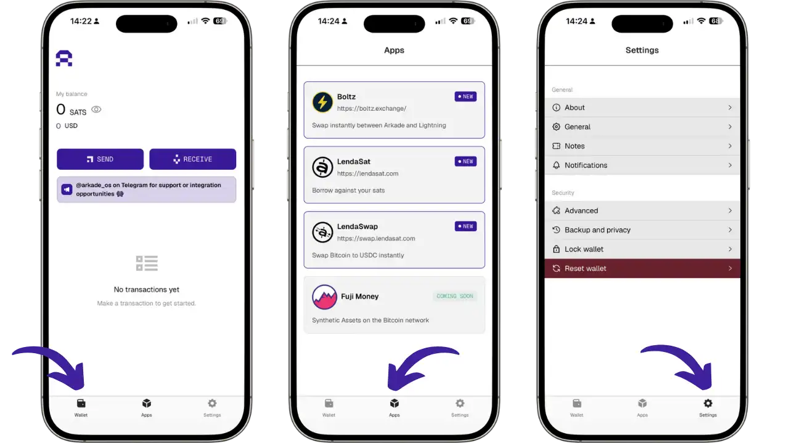

### Koneksi ke ASP

Secara default, wallet akan otomatis dikonfigurasikan untuk terhubung ke ASP resmi Arkade Labs. Kamu dapat memeriksa server yang sedang terhubung dengan membuka **Settings** > **About**, di mana kamu akan melihat alamat server yang digunakan (saat ini `https://arkade.computer`).

Pada versi Arkade saat ini (Beta), belum dimungkinkan untuk mengubah server ASP secara manual. Aplikasi ini akan selalu terhubung secara otomatis ke ASP resmi Arkade Labs. Ke depannya, pengguna mungkin dapat memilih di antara beberapa ASP yang berbeda sesuai preferensi masing-masing, tetapi fitur ini masih belum tersedia.

### Mencadangkan kunci pribadi kamu

**Arkade menggunakan kunci pribadi dalam format Nostr (nsec) sebagai metode pencadangan dan pemulihan. Untuk mencadangkan kunci pribadi Anda:

- Buka **Pengaturan** dari layar utama.
- Pilih **"Pencadangan dan privasi "**.
- Kamu akan melihat **kunci pribadi** ditampilkan dalam format `nsec...`. Rangkaian karakter yang panjang ini adalah satu-satunya cara untuk memulihkan wallet milikmu.
- Tekan **"COPY NSEC TO CLIPBOARD "** untuk menyalin kunci pribadi kamu.
- Simpan kunci ini di tempat yang aman**: tulis di kertas, simpan di pengelola kata sandi yang aman, atau gunakan metode pencadangan lain yang sesuai untukmu.
- Arkade juga menawarkan opsi **"Aktifkan cadangan Nostr "**. Fitur ini menggunakan protokol Nostr (jaringan terdesentralisasi) untuk secara otomatis mencadangkan data tertentu dari wallet kamu dalam bentuk terenkripsi ke relay Nostr. Hal ini memfasilitasi sinkronisasi antara beberapa perangkat dan menawarkan pemulihan status wallet Anda yang lebih sederhana.

**Penting**: Cadangan nostr adalah fitur **kenyamanan** saja. Relai Nostr tidak menggantikan cadangan kunci nsec kamu. Relai Nostr tidak menjamin penyimpanan data secara permanen. Private key nsec kamu tetap menjadi satu-satunya cara yang benar-benar dijamin untuk memulihkan dana kamu.

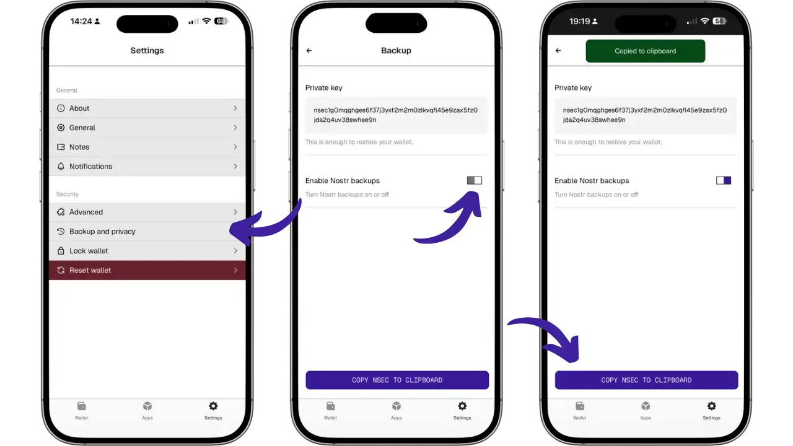

## Menggunakan Arkade

Setelah kamu menyiapkan wallet, kamu siap untuk menjelajahi kemampuan Arkade. Antarmukanya dirancang untuk menyatukan berbagai jenis pembayaran Bitcoin, on-chain, Lightning, dan Ark, secara mulus.

### Menerima dana

Untuk mendanai portofolio kamu, tekan **"Terima "**. Arkade menawarkan tiga metode penerimaan:

- **Pembayaran Ark**: Jika pengirim juga menggunakan Arkade, bagikan alamat Ark kamu untuk transfer yang instan, privat, dan nyaris gratis.
- **Setoran on-chain (boarding)**: Gunakan alamat Bitcoin (`bc1p...`) untuk menerima dana dari wallet klasik atau bursa. Tunggu konfirmasi sekitar 10 menit sebelum dana dikonversi menjadi VTXO.
- **Pertukaran Lightning**: Buat invoice Lightning lalu bayar dari wallet Lightning eksternal. Dana akan tiba seketika melalui mekanisme swap otomatis.

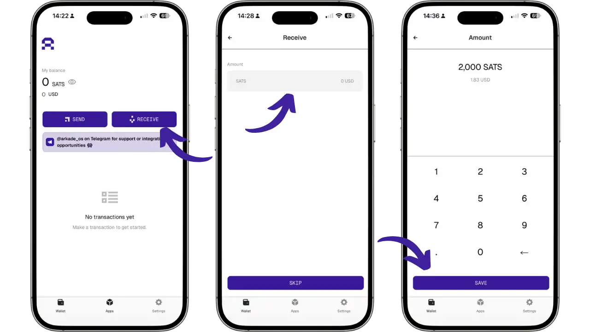

Layar penerimaan menampilkan semua opsi yang tersedia: kode QR, alamat Ark, alamat Bitcoin (BIP21), dan invoice Lightning. Untuk pembayaran Lightning, pastikan aplikasi tetap terbuka selama transaksi berlangsung.

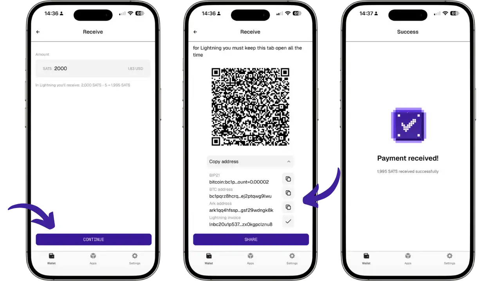

### Mengirim dana

Untuk mengirim dana, tekan **"Kirim "** dan tempelkan alamat penerima atau pindai kode QR. Arkade secara otomatis mendeteksi jenis pembayaran yang diperlukan:

- **Pembayaran Ark**: Ke alamat Ark, transfer bersifat instan, privat, dan nyaris gratis tanpa biaya sats. Penerima tidak perlu online.
- **Pembayaran Lightning**: Pindai invoice Lightning (`lnbc...`) dan Arkade akan secara otomatis melakukan swap. ASP membayar invoice untuk kamu lalu mendebit saldo Arkade kamu.
- **Pembayaran on-chain**: Kirim ke alamat Bitcoin klasik (`bc1q...` atau `bc1p...`). Arkade akan memulai mekanisme *Collaborative Output* yang akan disertakan dalam round on-chain berikutnya.

Periksa detail pada layar "Tanda tangani transaksi", lalu konfirmasikan dengan **"TAP TO SIGN "**.

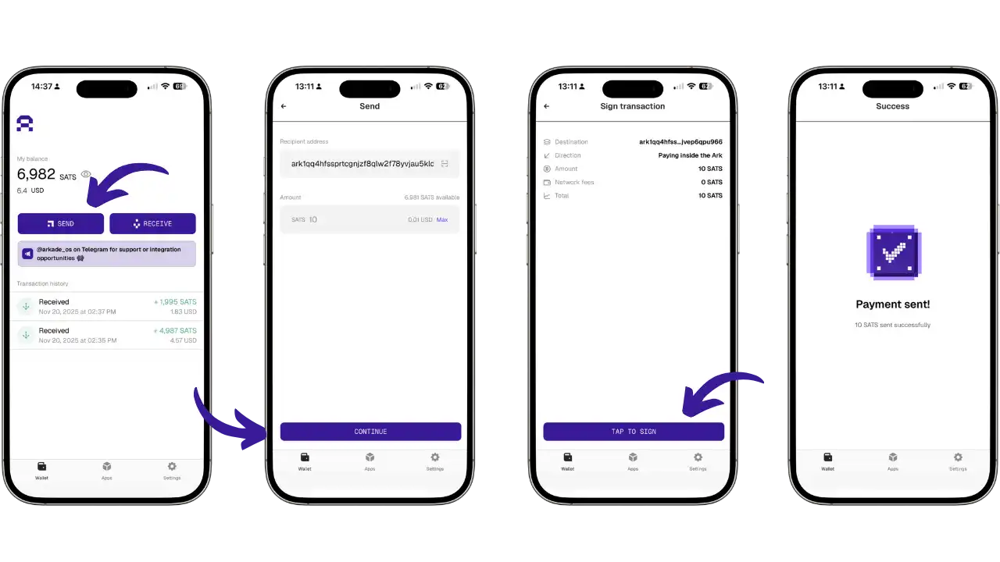

**Batasan saat ini (Beta) **: VTXO yang dibuat kurang dari 24 jam yang lalu tidak dapat digunakan untuk output on-chain. Jika kamu mengalami kesalahan, harap tunggu sampai VTXO Anda "matang".

*kerahasiaan keluaran *on-chain**: Contoh di bawah ini menunjukkan sebuah [transaksi keluaran Ark di mempool.space](https://mempool.space/fr/tx/153a70384d1c8a183c0e408e29b0a11820fd71a8bd5b4b00b12bc9b7f9decacb). Kami mengamati sebuah input terdistribusi ke 4 output yang berbeda, seperti CoinJoin. Untuk pengamat eksternal, tidak mungkin untuk menentukan jumlah yang mana milik pengguna yang mana.

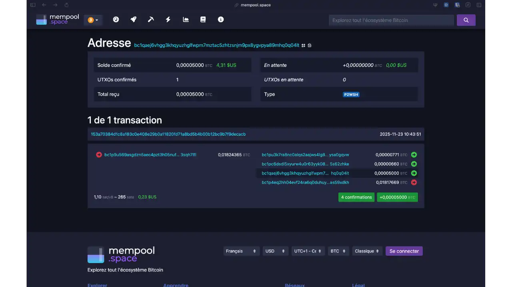

## Fitur lanjutan

### Manajemen kedaluwarsa VTXO

Fitur teknis dari protokol Ark adalah bahwa VTXO memiliki masa berlaku terbatas. Batasan waktu ini melekat pada desain protokol. Waktu kedaluwarsa dapat dikonfigurasi oleh setiap server ASP. Pada ASP resmi Arkade Labs, periode ini sekitar **4 minggu (≈30 hari)**.

**Batasan ini memungkinkan server Ark mengelola likuiditas secara efisien dan membersihkan VTXO milik pengguna yang tidak aktif. Setelah kedaluwarsa, server Ark secara teknis dapat mengklaim dana yang tersisa di pohon VTXO.**

**Agar VTXO kamu tetap aktif, VTXO harus “disegarkan” sebelum masa berlakunya habis. Penyegaran dilakukan dengan berpartisipasi dalam round baru, di mana VTXO yang hampir kedaluwarsa ditukar dengan VTXO baru dengan masa berlaku penuh (≈30 hari di ASP Arkade Labs).**

Wallet Arkade mengelola proses ini secara otomatis. Aplikasi akan terus memantau status VTXO kamu dan secara otomatis menyegarkannya beberapa hari sebelum masa berlakunya habis. Selama kamu membuka aplikasi secara rutin, setidaknya seminggu sekali, VTXO kamu akan tetap aktif secara otomatis.

**Jika kamu tidak membuka wallet selama lebih dari 4 minggu, VTXO kamu akan kedaluwarsa. Namun, kamu tidak kehilangan dana. Kamu tetap memiliki opsi untuk memulihkannya melalui **keluar sepihak** (lihat bagian selanjutnya). Prosedur ini memang lebih mahal dan lebih lambat, tetapi memastikan bahwa dana kamu tetap dapat dipulihkan.**

Kebutuhan untuk membuka aplikasi secara rutin menjadikan Arkade sebagai **hot wallet** yang dirancang untuk penggunaan sehari-hari, bukan sebagai brankas penyimpanan jangka panjang. Untuk menyimpan bitcoin tanpa digunakan dalam waktu lama, sebaiknya gunakan hardware wallet yang bersifat cold.

**Memeriksa status VTXO kamu**: Kamu dapat memantau status VTXO di **Settings** > **Advanced**. Lihat bagian “Next Extension” untuk mengetahui kapan penyegaran otomatis berikutnya akan dilakukan, dan “Virtual Coins” untuk melihat daftar lengkap semua VTXO kamu beserta tanggal kedaluwarsanya.

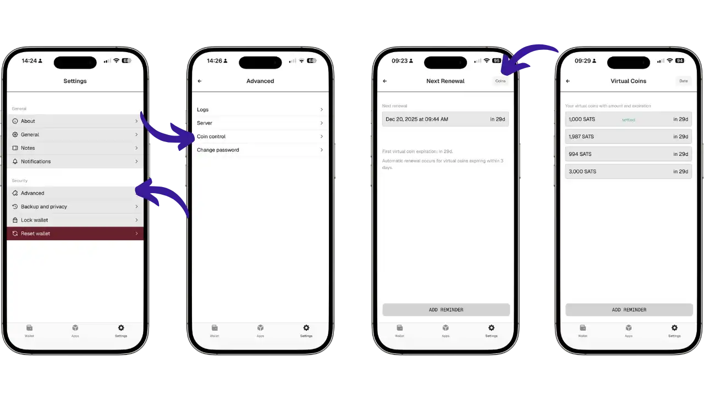

### Sortie Unilatérale (Keluar Sepihak)

Keluar sepihak adalah **jaminan kriptografi fundamental** dari protokol Ark yang memastikan kamu tetap bisa mendapatkan dana kamu kembali, bahkan jika ASP menghilang, menyensor transaksi kamu, atau menolak untuk bekerja sama. Secara teknis, VTXO kamu adalah **transaksi Bitcoin yang sudah ditandatangani sebelumnya** dan sepenuhnya kamu miliki. Dalam kondisi darurat, kamu dapat menyiarkan transaksi ini langsung ke blockchain Bitcoin untuk memulihkan dana tanpa memerlukan izin siapa pun.

**Bagaimana cara kerjanya?** Proses ini berlangsung dalam dua tahap. Pertama adalah **pembukaan**: kamu menyiarkan secara berurutan transaksi yang sudah ditandatangani sebelumnya dan membentuk VTXO kamu di dalam pohon transaksi. Kedua adalah **finalisasi**: setelah penguncian waktu berakhir, biasanya sekitar 24 jam, kamu dapat mengklaim bitcoin kamu ke alamat Bitcoin standar.

**Status saat ini di Arkade**: Pada versi Beta, belum tersedia tombol atau antarmuka pengguna yang sederhana untuk melakukan keluar sepihak. Fungsionalitas ini saat ini memerlukan penggunaan Arkade SDK serta pengetahuan teknis dalam pemrograman TypeScript.

**Meskipun prosedur ini belum dapat diakses dengan satu sentuhan tombol, jaminan kriptografinya tetap ada.** VTXO kamu sudah berisi transaksi yang ditandatangani sebelumnya dan secara sah menjadi milik kamu. Jaminan teknis inilah yang menjadikan Ark sebagai protokol **non-kustodian**. Bahkan dalam skenario terburuk sekalipun, dana kamu tetap dapat dipulihkan secara teknis. Antarmuka yang lebih sederhana kemungkinan akan ditambahkan pada versi Arkade mendatang.

## Keuntungan dan keterbatasan

Untuk menempatkan Arkade dalam konteks yang tepat, mari kita rangkum kekuatan dan kelemahannya saat ini.

### Sorotan

- Pengalaman Pengguna (UX)**: Tidak ada manajemen saluran, kapasitas yang masuk atau cadangan saluran yang rumit seperti pada Lightning. Cukup instal dan gunakan.
- Privasi**: Arsitektur CoinJoin standar menawarkan tingkat anonimitas yang jauh lebih tinggi daripada transaksi on-chain atau Lightning standar.
- Interoperabilitas**: Bayar kode QR Bitcoin apa pun (On-chain atau Lightning) dari satu antarmuka.

### Kendala

- Protokol muda**: Ark adalah teknologi yang sangat baru. Bug mungkin saja ada. Disarankan untuk tidak menggunakan Ark untuk menyimpan sejumlah uang yang kehilangannya akan sangat penting.
- Ketergantungan ASP**: Meskipun non-kustodian, sistem ini bergantung pada ketersediaan ASP untuk kelancarannya. Jika ASP offline, Anda tidak dapat lagi bertransaksi secara instan (hanya mengeluarkan dana on-chain Anda).
- Hanya Hot Wallet saja**: Kebutuhan untuk membuka aplikasi secara teratur untuk menyegarkan VTXO tidak cocok untuk penyimpanan dingin (Cold Storage).

## Perbandingan: Arkade vs Lightning vs Cashu

Untuk lebih memahami posisi Arkade, mari kita bandingkan dengan dua solusi skalabilitas utama lainnya.

| Kriteria | Arkade (Ark) | Lightning Network | Cashu (E-cash) |
| :--- | :--- | :--- | :--- |
| **Model** | UTXO bersama dikoordinasikan oleh server (ASP) | Jaringan P2P saluran pembayaran | Token buta yang diterbitkan oleh bank (Mint) |
| **Kustodi** | **Non-custodial** (kamu memegang kunci) | **Non-custodial** (kamu memegang kunci) | **Custodial** (Mint memegang dana) |
| **Privasi** | **Tinggi** (CoinJoin asli, buta bagi publik) | **Sedang** (Onion routing, tapi saluran terlihat) | **Sangat Tinggi** (Buta bahkan bagi Mint) |
| **Skalabilitas** | Luar Biasa (Batching masif on-chain) | Luar Biasa (Transaksi tanpa batas off-chain) | Luar Biasa (Tanda tangan server sederhana) |
| **Pengalaman** | Sederhana (mirip wallet on-chain) | Kompleks (manajemen saluran, likuiditas) | Sangat sederhana (seperti uang tunai digital) |
| **Risiko utama** | Ketersediaan ASP & Kedaluwarsa | Manajemen saluran & Backup | Kepercayaan pada Mint (risiko pencurian) |

**Arkade** adalah kompromi yang ideal: kesederhanaan dan kerahasiaan Cashu, tetapi dengan kedaulatan (non-kustodian) Lightning.

## Dukungan & Bantuan

Jika kamu mengalami masalah atau memiliki pertanyaan saat menggunakan Arkade, aplikasi ini menawarkan beberapa opsi dukungan:

- Buka **Pengaturan** > **Dukungan**.
- Kamu akan menemukan beberapa opsi:
  - **Dukungan pelanggan**: Dapatkan bantuan untuk wallet kamu, laporkan bug, atau ajukan pertanyaan.
  - **Obrolan aman**: Percakapan kamu bersifat aman dan privat, dengan riwayat yang tetap tersimpan antar sesi.
  - **Laporan bug**: Laporkan masalah yang kamu temui, termasuk langkah-langkah untuk mereproduksinya.
  - **Lacak kemajuan**: Pantau tiket dan percakapan dukungan kamu kapan saja.

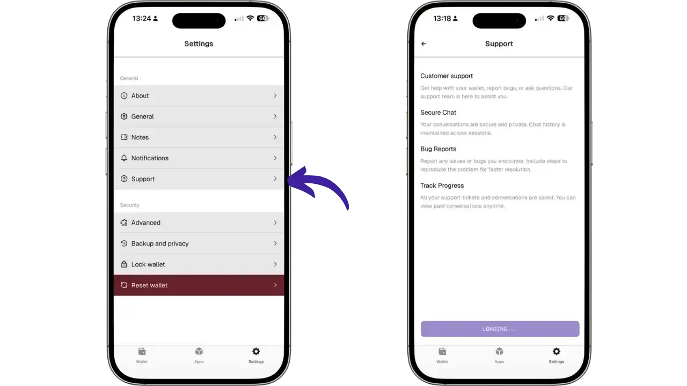

Tim Arkade juga aktif di Telegram melalui saluran @arkade_os untuk mendapatkan dukungan dan peluang integrasi.

## Catatan penting: Aplikasi dalam versi Beta

**⚠️ Arkade saat ini dalam versi Beta Publik pada mainnet Bitcoin**. Meskipun aplikasi ini berfungsi dengan bitcoin asli, penting untuk mengambil tindakan pencegahan tertentu.

### Rekomendasi untuk digunakan

- **Gunakan dalam jumlah kecil**: Hindari menyimpan dana dalam jumlah besar di Arkade. Gunakan wallet ini untuk pengeluaran sehari-hari dan simpan tabungan kamu di hardware wallet yang bersifat cold.
- **Kemungkinan adanya bug dan keterbatasan**: Seperti aplikasi lain yang masih dalam tahap pengembangan aktif, Arkade mungkin memiliki bug atau perilaku yang tidak terduga. Laporkan setiap masalah melalui fitur dukungan terintegrasi.
- **Evolusi yang cepat**: Aplikasi dan protokol terus berkembang. Beberapa fitur dapat berubah atau ditambahkan pada versi mendatang.

### Keterbatasan yang diketahui saat ini

- penundaan 24 jam pada VTXO**: VTXO yang baru dibuat tidak dapat langsung digunakan untuk output on-chain.
- ASP yang unik**: Belum memungkinkan untuk mengubah server ASP dalam aplikasi.
- **Keluar sepihak teknis**: Saat ini belum tersedia antarmuka yang disederhanakan untuk keluar sepihak dan masih memerlukan penggunaan SDK.

Tim Arkade Labs secara aktif bekerja untuk melonggarkan batasan ini di versi mendatang.

## Kesimpulan

ArkadeOS merupakan terobosan besar dalam ekosistem Bitcoin. Dengan mengimplementasikan protokol Ark, Arkade membuktikan bahwa kemudahan penggunaan dapat berjalan selaras dengan prinsip dasar Bitcoin: jangan percaya, verifikasi.

Meskipun masih berada pada tahap awal, Arkade memberikan gambaran yang menarik tentang masa depan pembayaran Bitcoin yang instan, privat, dan dapat diakses oleh siapa pun tanpa prasyarat teknis. Arkade adalah alat yang ideal untuk pengeluaran harian, sekaligus melengkapi solusi penyimpanan tabungan yang aman menggunakan cold wallet.

Kami mendorong kamu untuk mencoba Arkade dengan jumlah kecil agar bisa merasakan sendiri bagaimana protokol baru ini bekerja. Ekosistemnya berkembang dengan cepat, dan Arkade berada di garis depan inovasi terse

## Sumber 

Untuk mengetahui lebih lanjut, bacalah sumber daya resmi:

- Situs web Arkade**: [arkadeos.com](https://arkadeos.com)
- Dokumentasi**: [docs.arkadeos.com](https://docs.arkadeos.com)
- Protokol Ark**: [ark-protocol.org](https://ark-protocol.org)
- Kode Sumber** : [GitHub Arkade](https://github.com/arkade-os)
