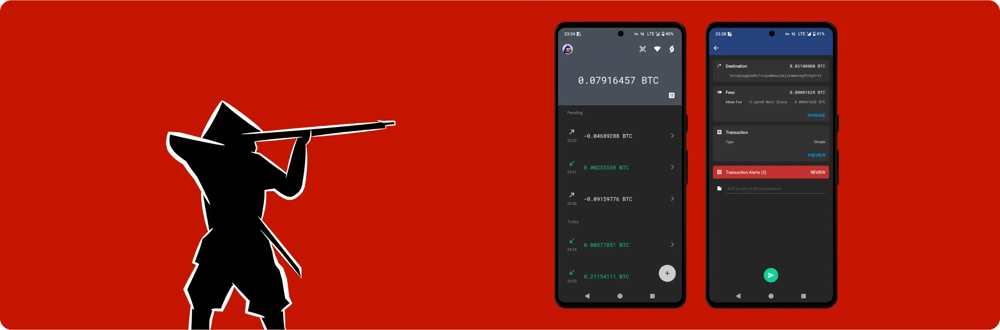

Ashigaru est une application mobile de portefeuille Bitcoin qui s’inscrit dans la continuité du projet Samourai Wallet, mais sous une nouvelle forme. Ce logiciel est né dans un contexte assez particulier : en avril 2024, les fondateurs de Samourai Wallet ont été arrêtés par les autorités américaines, et leurs serveurs ont été saisis. Bien que l’application Samourai elle-même soit restée utilisable, elle n'est actuellement plus maintenue. Ashigaru est un fork libre de Samourai Wallet, maintenu par une équipe anonyme, pour garantir la pérennité des fonctionnalités de Samourai et la sauvegarde de sa philosophie initiale : défendre la confidentialité et la souveraineté des utilisateurs de Bitcoin.

Ashigaru reprend l’essentiel de l’ADN de Samourai : une interface similaire, une approche évidemment self-custodial, open source et axée sur la protection de la vie privée. Le code est distribué sous licence GNU GPLv3, ce qui assure à chacun la possibilité d’auditer, de modifier ou de redistribuer le logiciel.

L’application Ashigaru intègre un ensemble d’outils avancés pour la confidentialité et la gestion de vos UTXOs :
- **Whirlpool**, un protocole de coinjoin basé sur Zerolink, permettant de rompre les liens déterministes entre entrées et sorties de transactions, sans perte de souveraineté sur ses fonds.
- **PayNym**, qui implémente des codes de paiement réutilisables (BIP47), désormais représentés via un système d’avatars "Pepehash".
- **Ricochet**, une fonctionnalité ajoutant des sauts intermédiaires aux transactions pour compliquer leur traçage.
- Évidemment du ***Coin Control*** pour sélectionner, geler et étiqueter précisément ses UTXOs.
- Du ***Batch Spending***, permettant de réduire les frais en regroupant plusieurs paiements dans une seule transaction.
- Le **Stealth Mode**, qui cache l’application sur votre mobile derrière un lanceur factice pour passer inaperçue lors d’une inspection physique de votre téléphone.
- Des outils de dépense avancés pour optimiser votre confidentialité (payjoin, stonewall...).
- Un système de récupération optimisé avec l'utilisation de Passphrase BIP39.
- Un système d'optimisation automatique du choix des frais de transaction.

01

Ashigaru s’adresse donc aux utilisateurs exigeants, conscients des enjeux liés à la traçabilité des transactions sur Bitcoin. Que vous soyez un utilisateur soucieux de préserver sa confidentialité, un bitcoiner aguerri attaché à la self-custody, ou encore un individu exposé à des risques de surveillance accrue, cette application de portefeuille vous fournit les outils nécessaires pour reprendre la main sur votre activité sur Bitcoin.

Ashigaru est disponible en version mobile via son application, que nous allons explorer dans ce tutoriel. Mais il peut également être utilisé sur ordinateur grâce à ***Ashigaru Terminal***, que nous présenterons dans un prochain tutoriel.

02

Je vous propose que, dans ce tutoriel, nous découvrions ensemble l’utilisation de base d’Ashigaru : installation, connexion au Dojo, sauvegarde, réception et envoi de bitcoins. Les outils avancés seront présentés dans d’autres tutoriels dédiés.

## 1. Prérequis

L'application a besoin de quelques prérequis pour foncitonner. Tout d'abord, ce n'est pas une applicaiton que vous retrouverez sur les stores comme le Google Play ou l'App Store. Elle s'installe manuellement sur votre téléphone avec son fichier `.apk` qui se télécharge via Tor. Donc évidemment, si vous avez un iphone, ça ne fonctionnera pas. Il faut obligatoirement avoir un appareil Android.

Pour télécharger cette `.apk` via Tor, vous aurez besoin d'un navigateur capable de se connecter à des sites en `.onion`. Pour ce faire, le plus simple est d'installer l'applciation Tor Browser disponible sur le [Google Play Store](https://play.google.com/store/apps/details?id=org.torproject.torbrowser) ou [via son `.apk`](https://www.torproject.org/download/#android).

03

En général, les smartphones récents bloquent l'instalation de fichiers `.apk` depuis une source inconnue. Vous devrez donc activer le temps de l'instaltion cette foncitonnalité depuis les paramètres. Sur mon smartphone,

Une fois l'installation terminée, pensez à désactiver cette foncitonnalité pour plus de sécurité.

Un autre prérequis obligatoire pour faire tourner Ashigaru est d'avoir un noeud Bitcoin Dojo. Pour limiter les risques, les équipes d'Ashigaru ne maintiennent pas de serveur permettant  connecter votre applcition. Vous devez donc obligatoierment faire tourner votre propre Dojo, ou bien vous connecter au Dojo d'une autre personne que vous connaissez, afin que votre Ashigaru puisse consulter les informations de la blockchain, savoir combien de sats sont sécurisés sur vos adresses, et diffuser vos transactions sur le réseau Bitcoin. Pour en savoir plus sur Dojo et découvrir comment l'installer, je vous recommande de suivre cet autre tutoriel :

https://planb.network/tutorials/node/bitcoin/dojo-aa818a21-e701-48a2-8421-63c6186ed23f

Ashigaru est un projet open-source. Si vous souhaitez faire un don pour aider au développement de l'application, vous pouvez le faire dans l'app PayNym.