Ashigaru 是一款比特币移动钱包应用程序，它是 Samourai Wallet 项目的后续，但采用了新的形式。该软件是在一个特殊的背景下诞生的：2024 年 4 月，Samourai Wallet 的创始人被美国当局逮捕，他们的服务器也被查封。虽然 Samurai 应用程序本身仍可使用，但目前已不再维护。Ashigaru 是 Samourai Wallet 的免费分叉版本，由一个匿名团队维护，以保证 Samourai 功能的连续性，并维护其最初的理念：捍卫比特币用户的隐私和主权。

Ashigaru 继承了 Samourai 的大部分“基因”：类似的界面、明显的自我监护方式、开放源代码以及对隐私的关注。代码以 GNU GPLv3 许可发布，确保任何人都可以审核、修改或重新发布软件。

Ashigaru 应用程序集成了一套先进的 UTXO 保密和管理工具：

- **Whirlpool** 是一种基于 Zerolink 的混币协议，它使您能够打破交易输入和输出之间的确定性联系，而不会失去对资金的主权。
- **PayNym** 实现了可重用的支付代码（BIP47），现在通过 "*Pepehash*"头像系统来表示。
- **Ricochet** 是一种在交易中添加中间跳转的功能，使交易更难被追踪。
- 当然，***Coin Control***（币控制）还能精确选择、冻结和标记您的 UTXO。
- **Batch Spending**（批量支出），通过将几笔付款合并为一笔交易来降低成本。
- **Stealth Mode**（隐身模式），可将手机上的应用程序隐藏在假启动器后面，以便在实际检查手机时不被发现。
- 先进的支出工具可优化您的保密性（payjoin、stonewall 等）。
- 使用密语 BIP39 的优化恢复系统。
- 自动优化交易费用选择的系统。

因此，Ashigaru 的目标用户是那些意识到比特币上交易可追踪性问题的用户。无论您是注重隐私的用户，还是致力于自我保管的经验丰富的比特币使用者，抑或是面临监控增加风险的个人，这款钱包应用程序都能为您提供重新控制比特币上的活动所需的工具。

我们将在本教程中探讨 Ashigaru 的移动版应用程序。但它也可以通过***Ashigaru Terminal***在电脑上使用，我们将在以后的教程中介绍。

在本教程中，我将向您介绍 Ashigaru 的基本使用方法：安装、连接到 Dojo、备份、接收和发送比特币。高级工具将在其他专门教程中介绍。

## 1.Ashigaru 的先决条件

该应用程序需要一些先决条件才能正常运行。首先，它不是谷歌应用商店（Google Play Store）或应用程序商店（App Store）等经典商店中的应用程序。它只能通过 Tor 网络下载的 `.apk` 文件手动安装到手机上。因此，如果您使用 iPhone，这种方法就行不通了：您需要使用安卓设备。

为了通过 Tor 下载 `.apk` 文件，您需要一个能访问 `.onion` 网站的浏览器。最简单的方法是在手机上安装 Tor 浏览器应用程序，可以从 [Google Play 商店](https://play.google.com/store/apps/details?id=org.torproject.torbrowser) 或直接 [通过其`.apk`](https://www.torproject.org/download/#android) 下载。

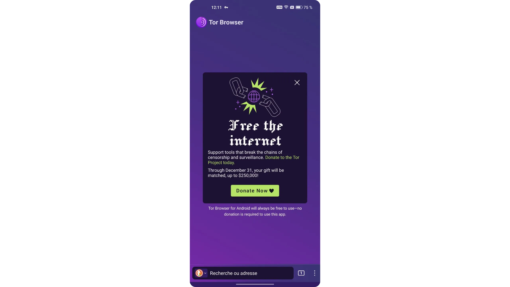

大多数新款智能手机默认情况下都会阻止安装未知来源的应用程序。您需要在设备设置中暂时激活 Tor 浏览器的这一选项，以允许安装。安装应用程序后，请记得停用此功能，以加强手机的安全性。

使用 Ashigaru 的另一个必要前提是 Bitcoin Dojo 节点。出于安全和主权方面的考虑，Ashigaru 团队并不维护用于连接应用程序的集中服务器。因此，您需要运行自己的 Dojo 实例，或连接到一个受信任的实例。

通过 Dojo，您的 Ashigaru 应用程序可以查询区块链信息，查看地址余额，并在比特币网络上广播您的交易。

如需了解有关 Dojo 的更多信息并学习如何安装，请参阅本专门教程：

https://planb.academy/tutorials/node/bitcoin/dojo-aa818a21-e701-48a2-8421-63c6186ed23f

如果您实在无力运行自己的 Dojo，您可以在 [dojobay.pw](https://www.dojobay.pw/mainnet/) 上找到愿意免费共享实例的人。这可能是一个临时解决方案，但从长远来看，我建议您使用自己的 Dojo，以确保您的主权和保密性。

## 2.检查并安装 Ashigaru 应用程序

### 2.1.下载 Ashigaru 应用程序

在手机上打开 Tor 浏览器，前往 [Ashigaru 官方网站](https://ashigaru.rs/download/)，在 `Download` 部分。然后点击 `Download for Android` 按钮下载安装文件。

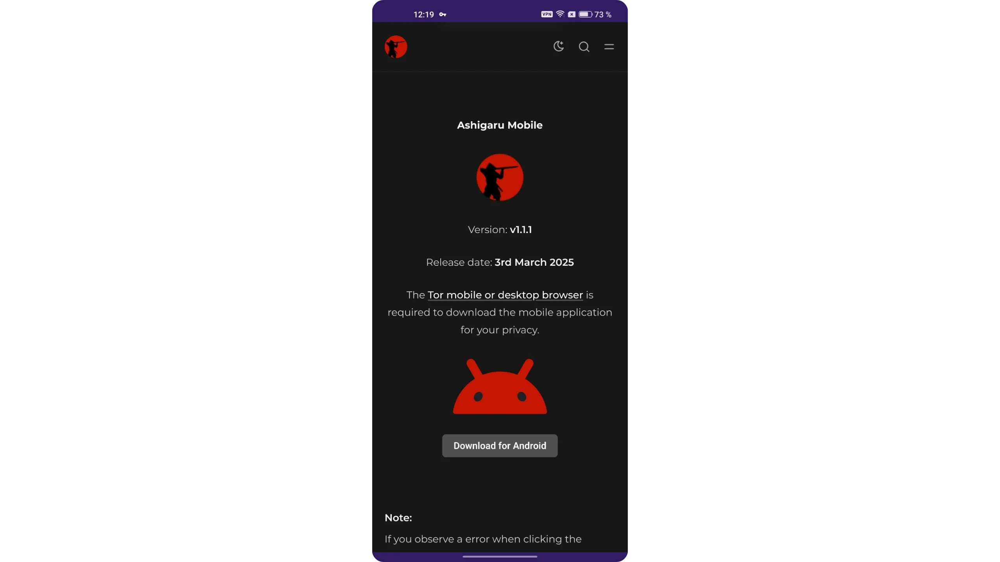

在设备上安装应用程序之前，我们将检查其真实性和完整性。这是非常重要的一步，尤其是如果您直接从 `.apk` 文件安装应用程序。

### 2.2.检查 Ashigaru 应用程序

返回 [Ashigaru 官方网站](https://ashigaru.rs/download/) 的 `Download` 部分，然后复制标题为 `SHA-256 Hash of the APK file` 下显示的信息。复制从 `BEGIN PGP SIGNED MESSAGE` 到 `END PGP SIGNATURE` 的所有内容。

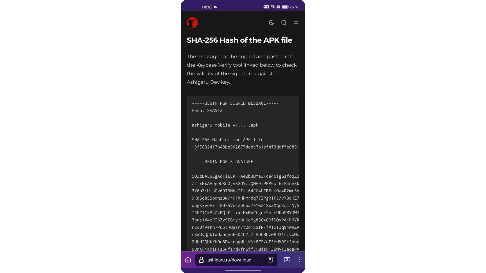

在您的手机上，在 Tor 浏览器中打开一个新标签页，然后转到 [Keybase 验证工具](https://keybase.io/verify)。将刚才复制的信息粘贴到提供的字段中，然后点击 `Verify` 按钮。

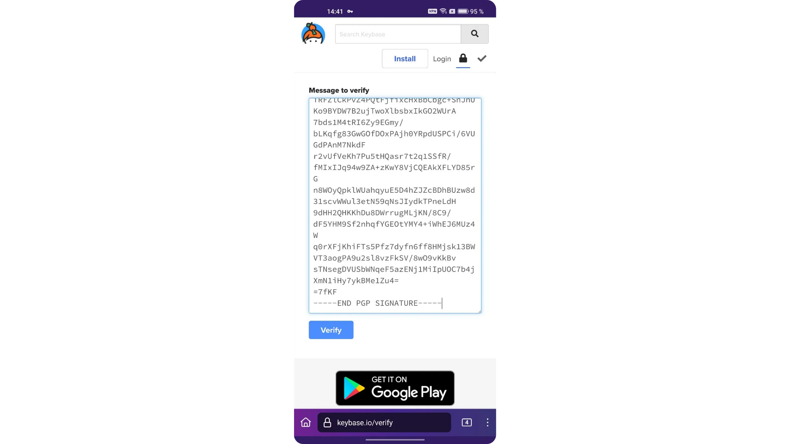

如果签名是真实的，Keybase 会显示一条信息，确认文件已由 Ashigaru 开发者签名。您还可以点击 Keybase 显示的 `ashigarudev` 配置文件，检查其密钥指纹是否与这个代码完全一致：`A138 06B1 FA2A 676B`。

但是，如果在此阶段出现错误，则表示签名无效。在这种情况下，**不要安装 APK**。请您重新从头开始，或向社区寻求帮助。

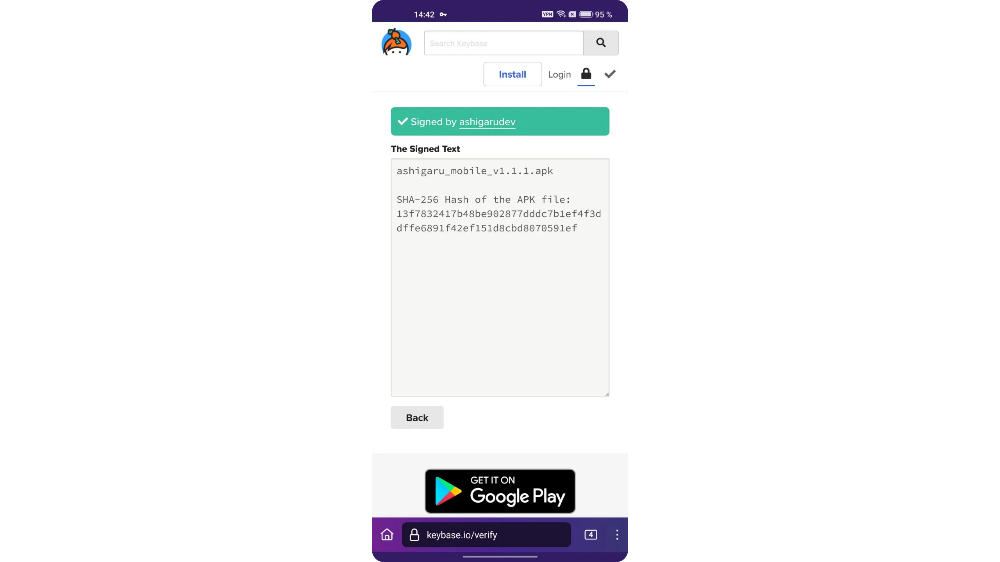

Keybase 已为您提供了应用程序的哈希值。现在我们要检查您下载的 `.apk` 文件的哈希值是否与 Keybase 上验证的一致。为此，请访问 [HASH FILE ONLINE](https://hash-file.online/)。

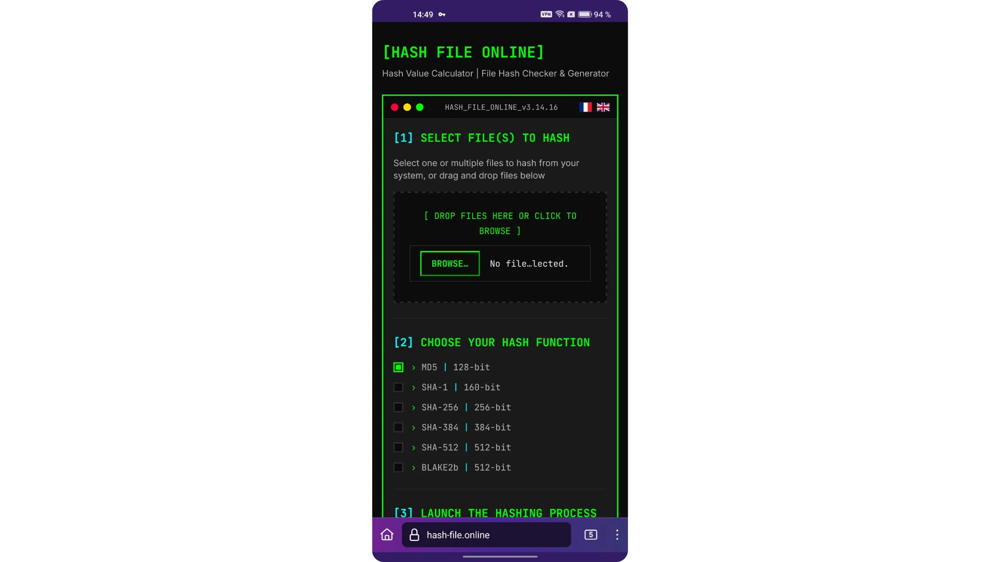

点击 `BROWSE...` 按钮，选择在步骤 2.1 中下载的 `.apk` 文件。

然后选择 `SHA-256` 哈希函数，点击 `CALCULATE HASH` 计算文件的哈希值。

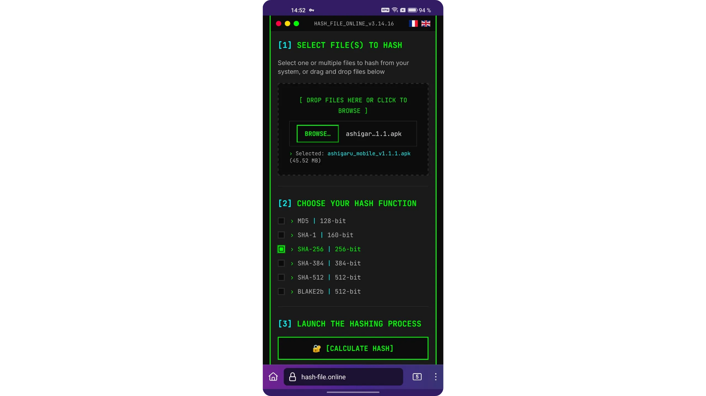

网站会显示您的 `.apk` 文件的哈希值。请将其与您在 Keybase.io 上验证的哈希值进行比较。如果两个哈希值相同，则真实性和完整性检查成功。现在就可以继续安装应用程序了。

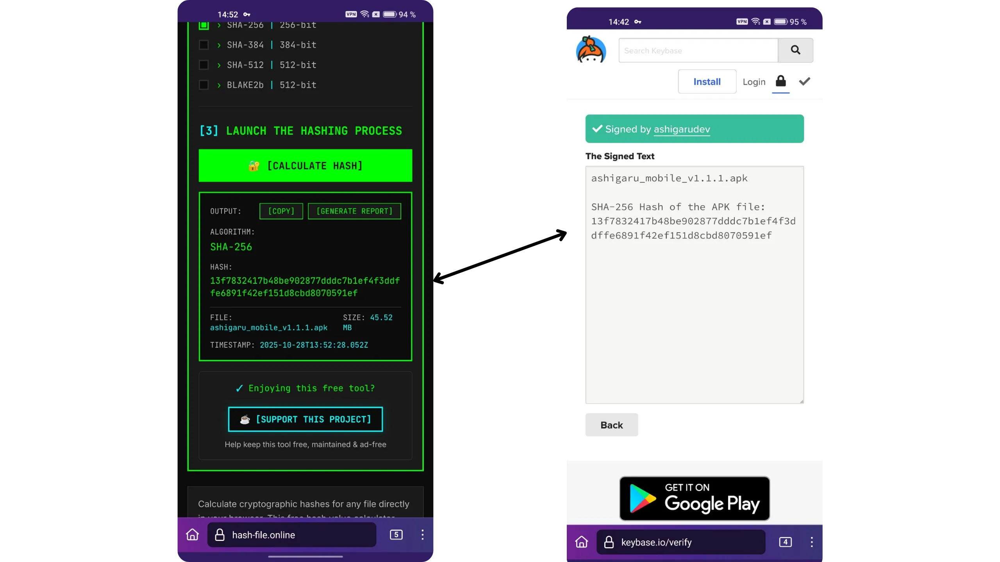

### 2.3. 安装 Ashigaru 应用程序

为了安装应用程序，请打开手机的文件管理器，进入下载文件夹。然后点击刚才选中的 `.apk` 文件，并在出现提示时确认安装。

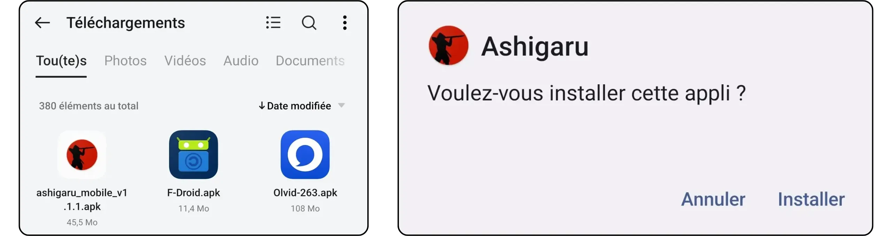

Ashigaru 已安装在您的手机上。

## 3.应用程序初始化和比特币钱包创建

首次启动应用程序时，请选择 `MAINNET`。

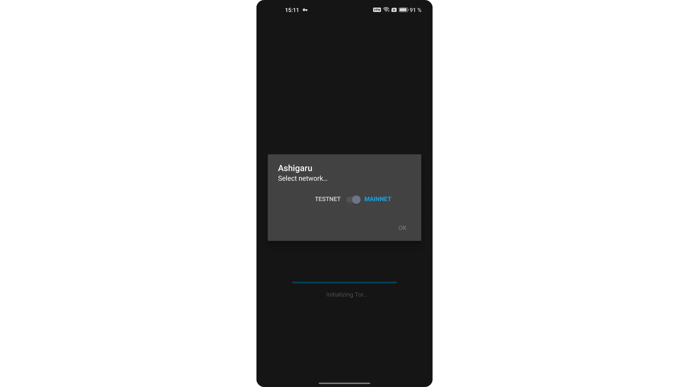

然后点击 `Get Started`。

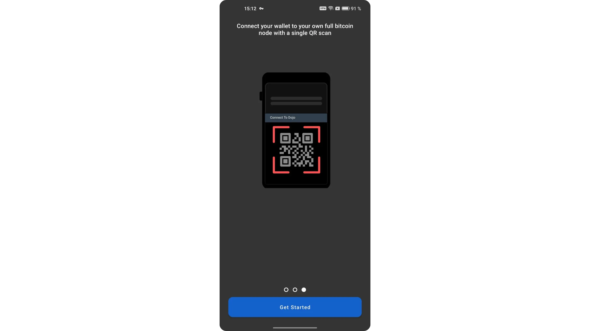

现在我们将创建一个新的 Bitcoin 产品组合。按下 `Create a new wallet` 按钮。

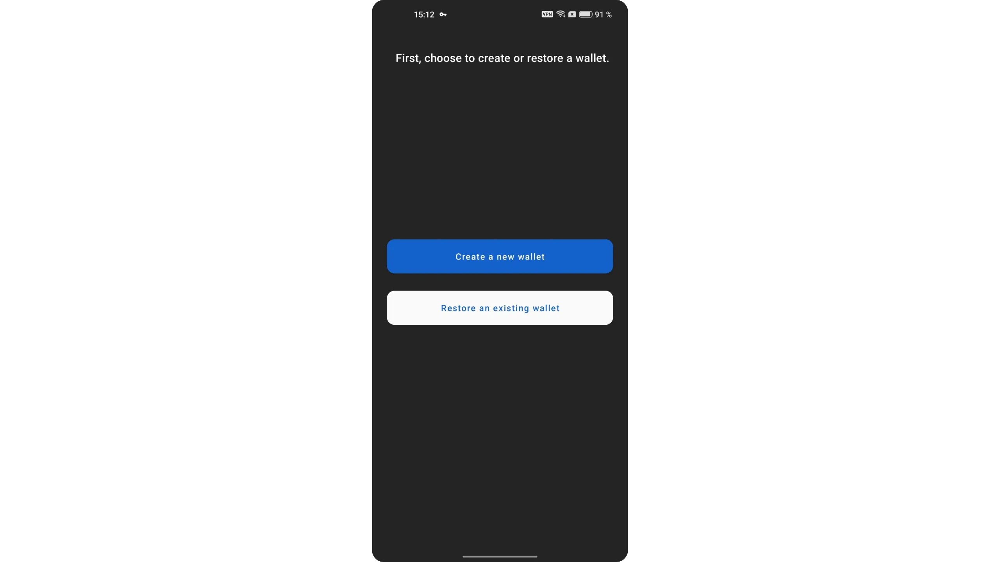

### 3.1. 创建比特币钱包

Ashigaru 需要 BIP39 密语。选择您的密语，并将其输入相应的字段。它必须尽可能长且随机，以抵御暴力搜索攻击。

立即对密语进行物理备份。这是非常重要的一步：如果您丢失了手机，**如果您不拥有此密语，您将无法访问 Ashigaru 钱包中存储的比特币**。同样的密语也用于加密钱包恢复文件。

如果您不知道密语是什么，或者不完全了解它的工作原理，我强烈建议您阅读本附加教程。这一点非常重要，因为密语是您安全的关键因素：误解它的使用可能会导致您的资金永久损失。

https://planb.academy/tutorials/wallet/backup/passphrase-a26a0220-806c-44b4-af14-bafdeb1adce7

输入密语后，点击 `NEXT`。

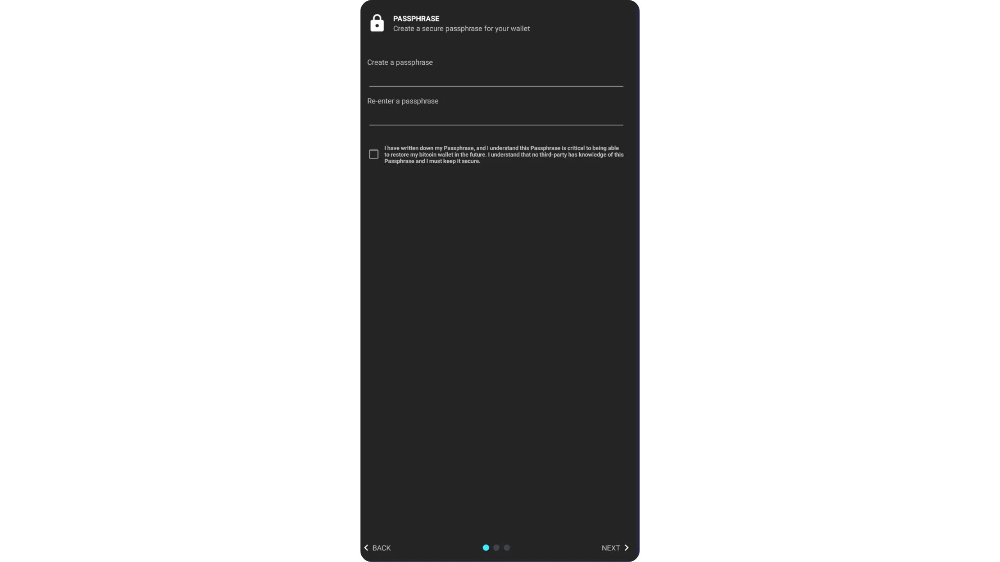

然后选择一个 PIN 码。该密码用于解锁 Ashigaru 钱包，防止未经授权的物理访问。它与钱包密钥的加密推导无关。这意味着，即使有人不知道 PIN 码，任何人只要有您的助记词和密语就能重新获取您的比特币。

选择较长的随机 PIN 码。切记在手机之外的其他地方保存一份备份，以防它们同时被泄露。

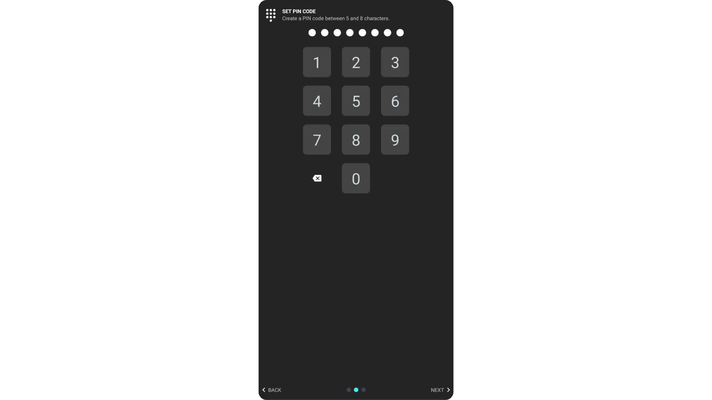

一旦创建了 PIN 码，Ashigaru 就会显示钱包的助记词。警告：该短语与密语结合使用，可以完全访问您的比特币。任何持有它的人都可以占有您的资金，即使他们无法访问您的手机。如果您的手机丢失、被盗或损坏，可以使用这 12 个单词序列来恢复您的钱包。因此，请务必将其小心保存在物理介质（纸张或金属）上。

切勿以数字形式保存此助记词，否则您的资金有可能被盗。根据您的安全策略，您可以制作几份实物副本，但千万不要分割。保持字词的顺序，并确保它们有编号。

最后，切勿将助记符和密语存放在同一个地方。如果两者同时泄露，攻击者就有可能访问您的钱包。

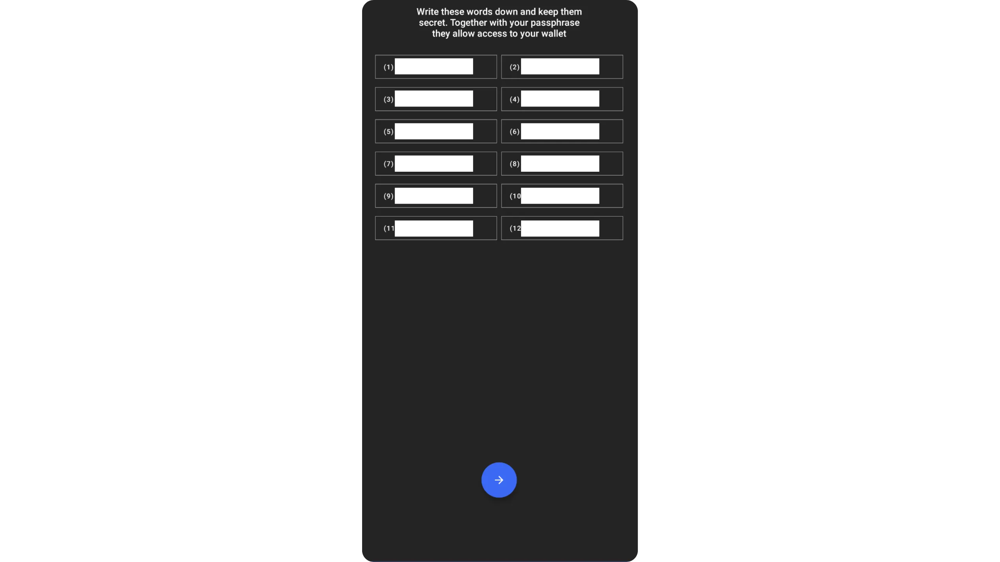

为了进一步了解如何确保记忆短语的安全，请参阅本补充教程 ：

https://planb.academy/tutorials/wallet/backup/backup-mnemonic-22c0ddfa-fb9f-4e3a-96f9-46e2a7954270

然后，Ashigaru 会要求您重新确认密语。请借此机会检查您的物理备份是否正确。

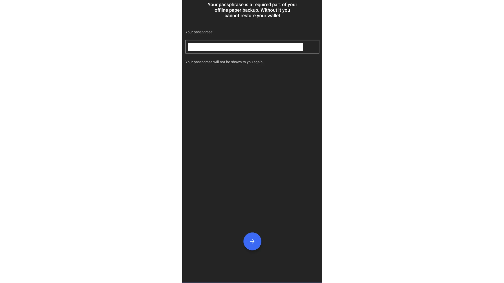

### 3.2. 连接到一个 dojo

接下来是连接 Dojo 的步骤。正如介绍中所述，Ashigaru 必须连接到 Dojo 才能与比特币网络互动。

登录 Dojo 的 "Maintenance Tool"，打开 `PAIRING` 选单。

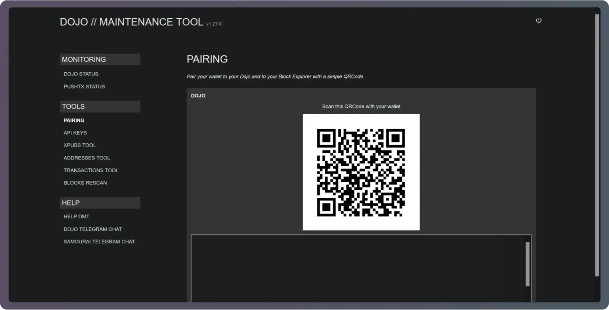

在 Ashigaru 上，按 `Scan QR` 按钮，然后扫描 DMT 显示的连接二维码。然后点击 `Continue` 确认。

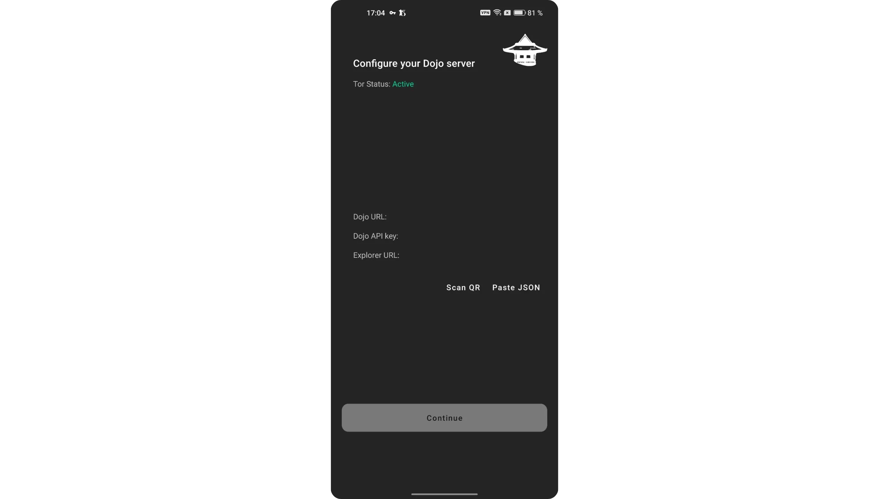

输入 PIN 码解锁钱包。这将带您进入同步页面。由于钱包是新创建的，在此阶段出现 *PayNym* 错误是正常的。只需点击 `Continue`。

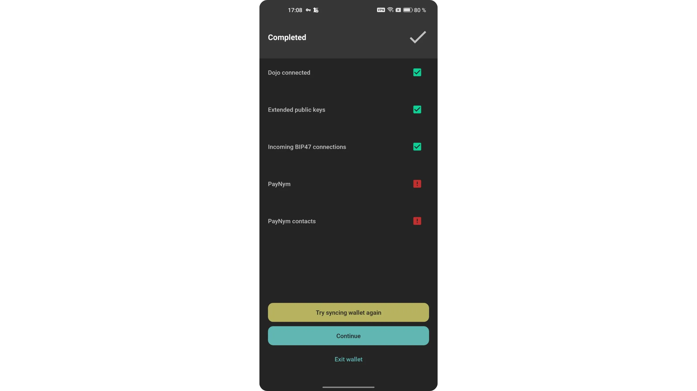

然后，您将进入钱包的主页。

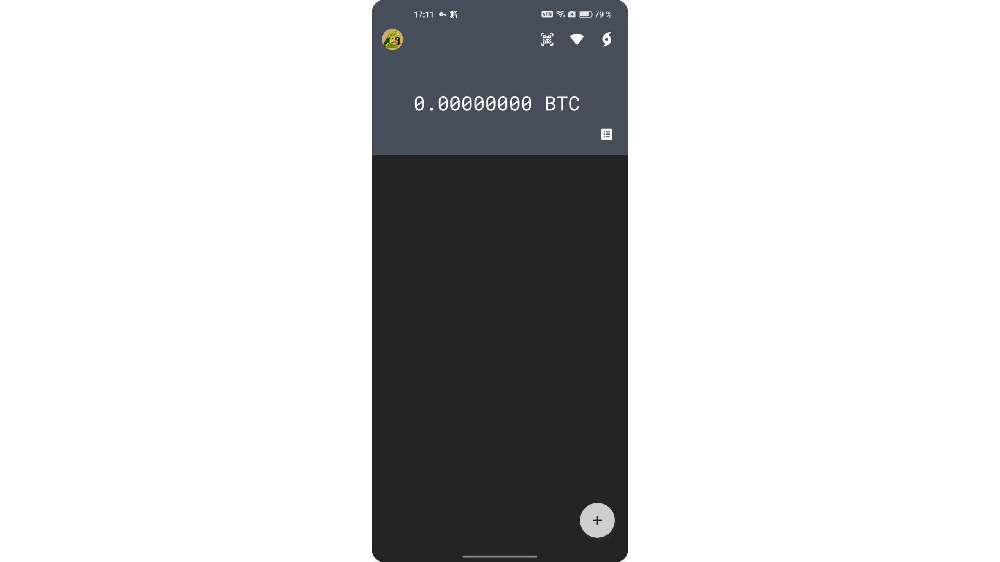

进一步操作之前，我建议您在钱包中仍然没有比特币的情况下进行一次恢复测试。这可以检查纸质备份是否正常。为了了解具体方法，请参阅本教程：

https://planb.academy/tutorials/wallet/backup/recovery-test-5a75db51-a6a1-4338-a02a-164a8d91b895

## 4.设置 Ashigaru 应用程序

为了访问应用程序设置，请单击左上角的 *PayNym* 图像，然后选择 `Settings`。

在此，您可以找到多个选项，根据自己的需要调整 Ashigaru 的操作。不过，我强烈建议您从一开始就激活两个重要参数。

首先，打开 `Security > Stealth mode` 选单，然后根据需要激活该功能。它将 Ashigaru 应用程序隐藏在手机上安装的普通应用程序的名称、徽标和界面后面。其目的是防止任何人在对您的手机进行物理检查时识别出 Ashigaru。

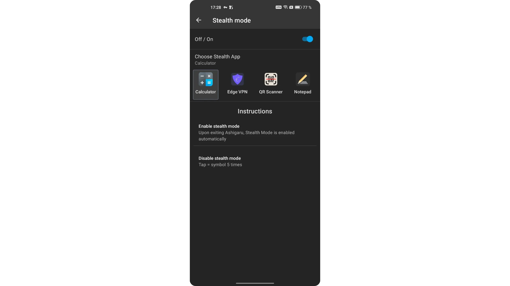

提供的每个假冒应用程序都有特定的方法来解锁真正的 Ashigaru 界面。例如，如果您选择了计算器，Ashigaru 应用程序就会从您的主屏幕上消失，取而代之的是一个假冒的计算器。打开后，您会看到一个经典的计算器界面，但为了打开 Ashigaru，您只需快速点击五次 `=` 符号。

第二个需要激活的重要参数是 [**RBF** (*Replace-by-Fee*，即手续费替换)](https://planb.academy/resources/glossary/rbf-replacebyfee) 。如果交易因费用过低而卡在内存池中，该选项可以增加交易费用。可以通过 `Transactions > Spend using RBF` 选单激活该选项。

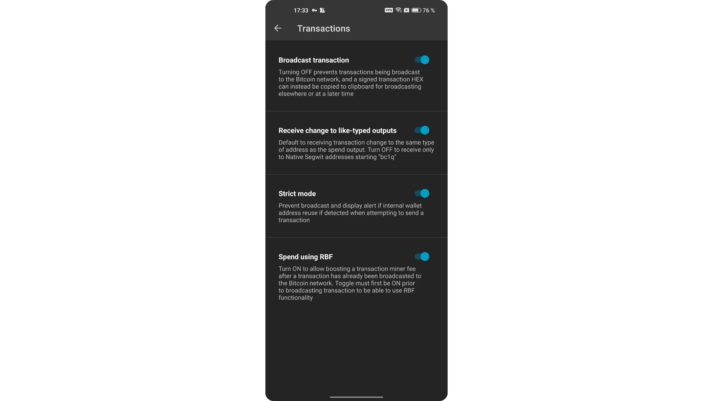

提示：只需点击主页上显示的总余额，即可将钱包的显示单位从 `BTC` 更改为 `sat`。

## 5.在 Ashigaru 上接收比特币

现在，您的钱包已经开始运行，您可以接收统计信息了。为此，请按下界面右下方的 `+` 按钮，然后按绿色的 `Receive` 按钮。

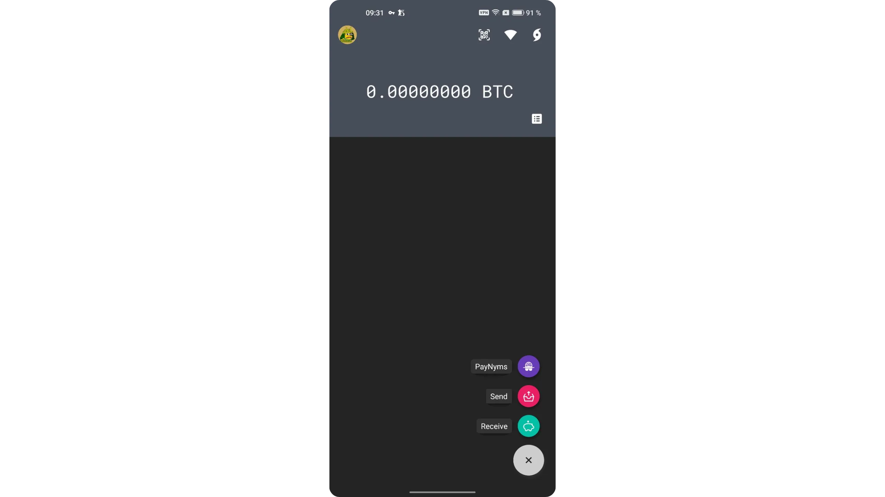

然后，Ashigaru 会向您显示钱包中第一个未使用的接收地址，以防止地址重用（地址重复使用对您的隐私非常不利）。然后，您就可以将此地址转发给需要向您发送比特币的个人或服务。

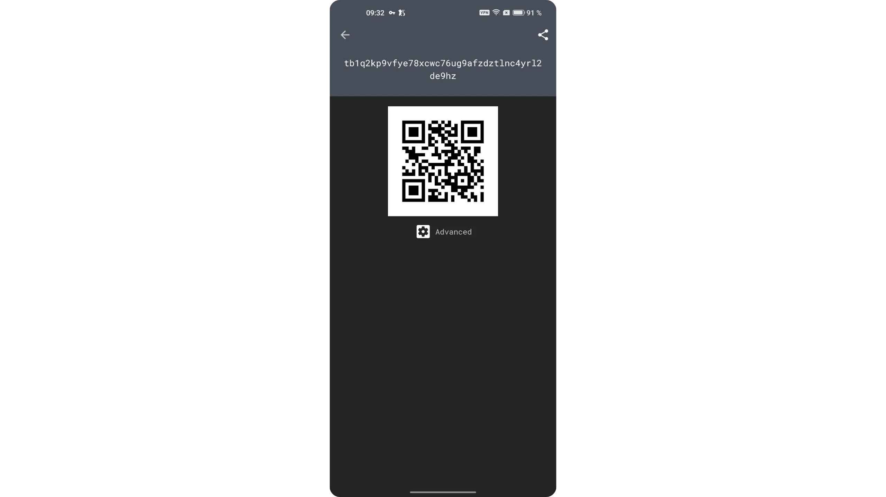

交易一旦在网络上广播，就会自动出现在应用程序的主页上。

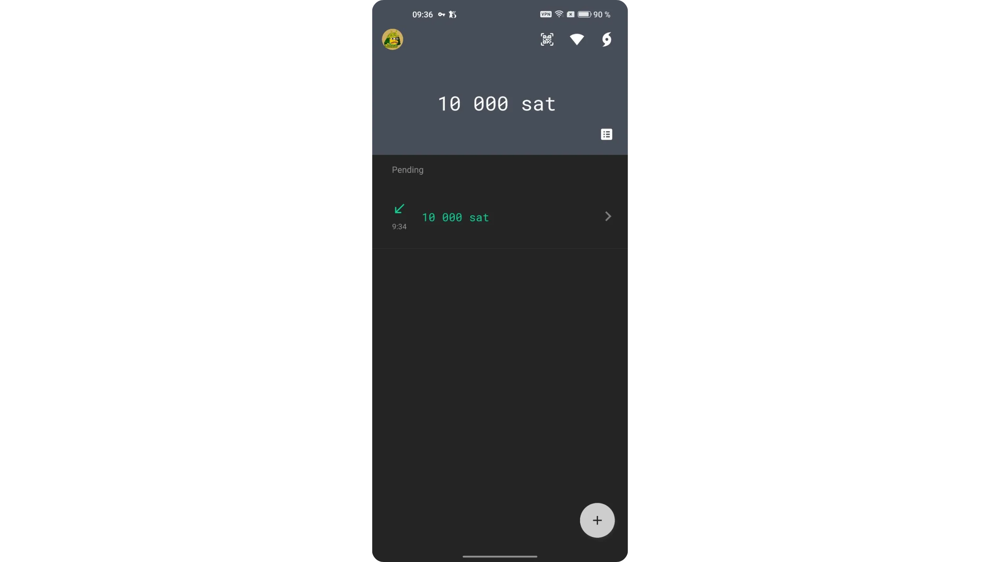

## 6.使用 Ashigaru 发送比特币

现在您的 Ashigaru 钱包中已经有了比特币，您也可以发送它。为此，请按右下角的 `+` 按钮，然后选择红色的 `Send` 按钮。

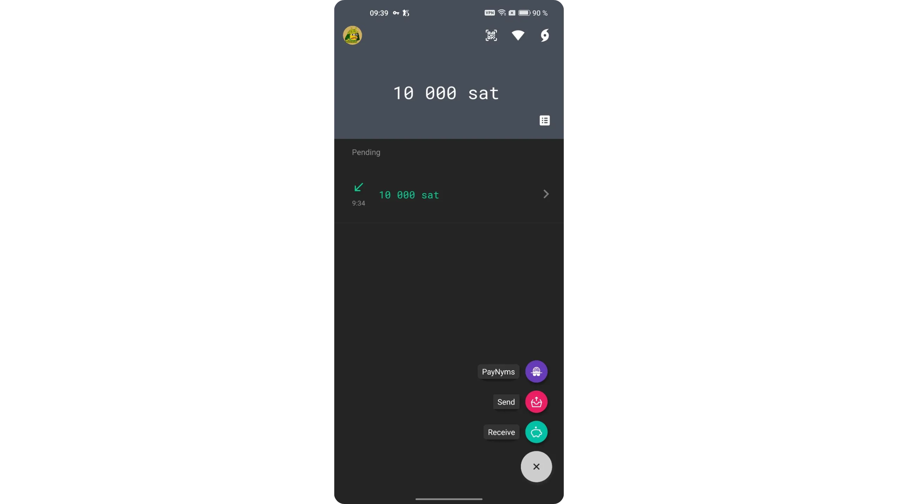

然后选择您要支出的账户。目前，我们还没有使用 `Postmix`（混币后）账户，该账户是为混币交易预留的，我们将在稍后的教程中学习。因此，我们将从主存款账户发送资金。

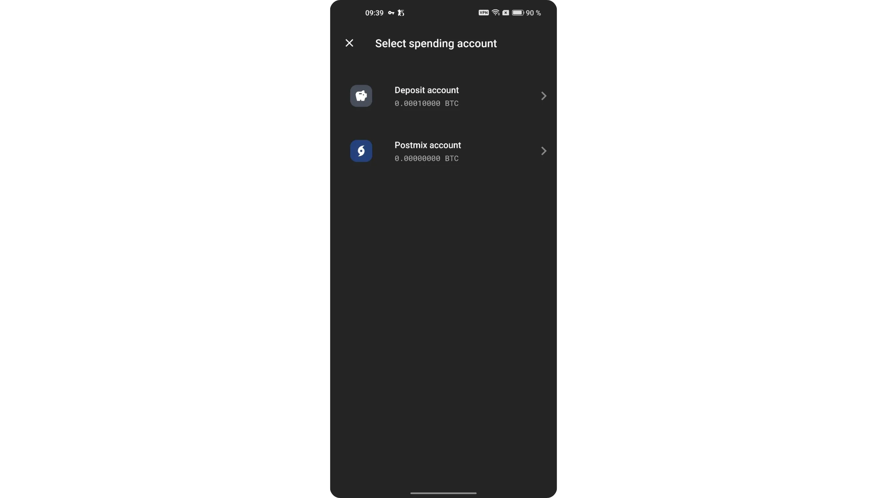

输入交易详情：要发送的金额和接收者的比特币地址。

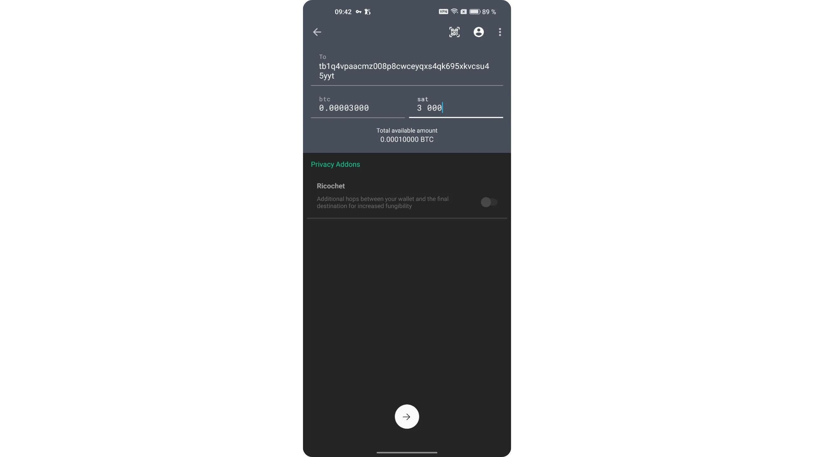

点击右上角的三个小圆点，然后点击 `Show unspent outputs`（显示未使用的输出），您还可以精确地选择您希望使用的 UTXO，以加强您的隐私保护。

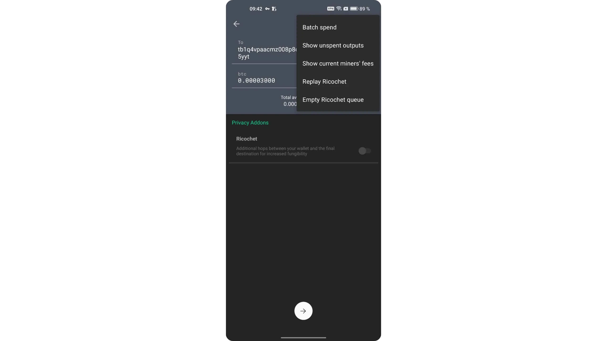

填写完所有详细信息后，点击界面底部的白色箭头继续。

然后，您将进入一个摘要页面，显示交易的所有细节。其中显示了几个重要元素：

- 在 `Destination` 区块中，最后一次检查接收者地址和发送金额是否正确；
- 在 `Fees` 区块中，您可以查看 Ashigaru 自动选择的收费标准，请在必要时点击`MANAGE` 进行修改；
- `Transaction` 区块表示您将要执行的交易类型。这里我们讨论的是简单交易，但 Ashigaru 还支持其他类型的隐私优化交易，我们将在以后的教程中详细介绍；
- 如果您的交易显示出链分析工具可识别的模式，并可能危及您的隐私，则红色 `Transaction Alert` 区块会向您发出警告。点击后，您可以查看详细信息。例如，在我的案例中，Ashigaru 告诉我发送的金额是整数（`3000 sats`），这样我就可以推断出哪个输出对应的支出和找零。为了了解关于这些链分析启发式方法的更多信息，我邀请您关注我在 Plan ₿ Academy 上的 BTC 204 培训；
- 最后，您可以为交易添加标签，以记录其目的或来源。

https://planb.academy/courses/65c138b0-4161-4958-bbe3-c12916bc959c

检查完所有信息后，请使用绿色箭头发送比特币。按住箭头，然后向右拖动，以确认上传。

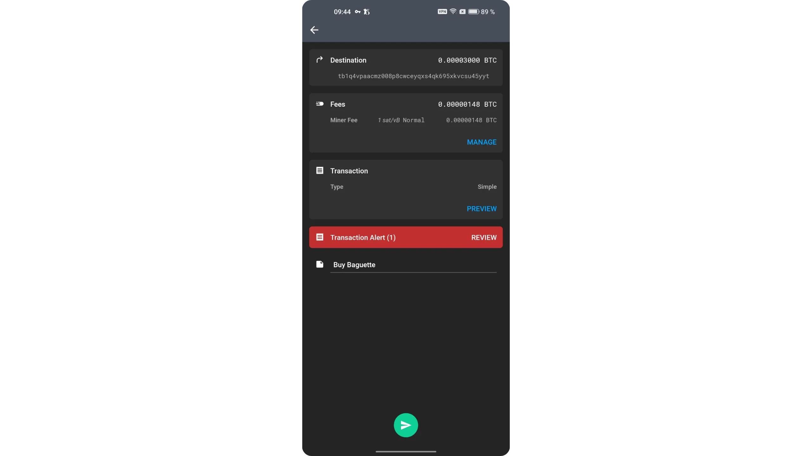

您的交易已在比特币网络上广播。

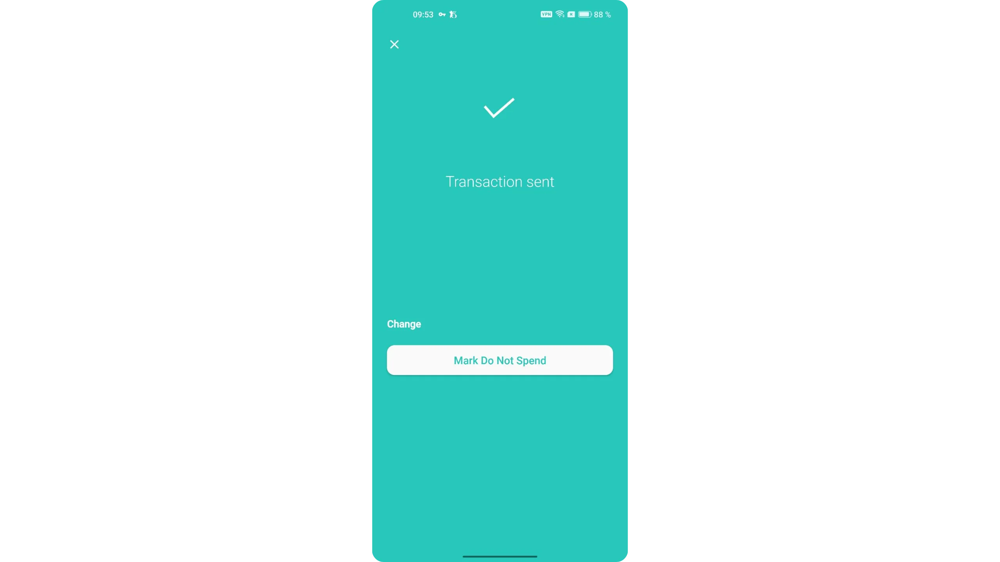

## 7. 找回您的 Ashigaru 钱包

Ashigaru 钱包的恢复与经典比特币钱包的恢复略有不同，因为该应用程序使用与 Samourai Wallet 相同的方法。如果您丢失了钱包的访问权限（无论是因为忘记密码、卸载了钱包应用程序，还是丢失了手机），有几种方法可以找回您的比特币。

如果您还能使用手机，或者您已经备份了该文件，最简单的方法就是使用备份文件 `ashigaru.txt` 。该文件包含在新的 Ashigaru 实例（或 Sparrow Wallet）上恢复钱包所需的所有信息，但它是用本教程步骤 3.1 中定义的密语加密的。因此，您必须同时拥有 `ashigaru.txt` 文件和密语才能使用此方法。

例如，有了这两个元素，您就可以恢复 Sparrow Wallet 上的钱包。

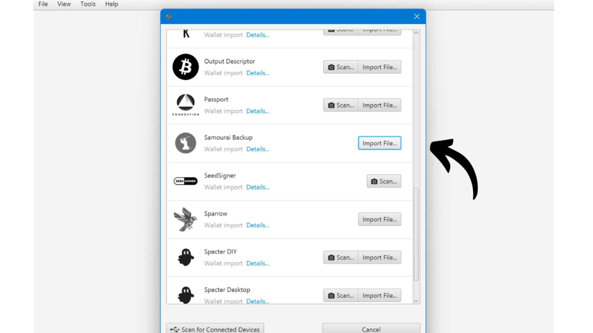

如果您无法访问 `ashigaru.txt` 文件，您仍可使用密语重新访问您的资金，就像访问其他比特币钱包一样。我建议您在新的 Ashigaru 实例上或直接在 Sparrow Wallet 上执行此还原操作，以便在使用 Whirlpool 时轻松恢复旁路路径。或者，您也可以通过手动输入派生路径，将此信息导入任何其他兼容 BIP39 的软件。

如果您想了解关于此过程的详细信息，请参阅我撰写的关于恢复 Samourai Wallet 钱包的完整教程。由于 Ashigaru 是一个分叉，该过程完全相同：

https://planb.academy/tutorials/wallet/backup/samourai-recover-23bb6221-ea3e-42e6-a5b7-e6dbef5073c3

正如您所看到的，无论您使用哪种修复方法，密语都是不可或缺的。因此一定要仔细备份。您还可以根据自己的安全策略制作多份副本。

## 8.更新应用程序

为了更新 Ashigaru 应用程序，由于您是从 `.apk` 文件安装的，而不是像普通应用程序那样通过 Play Store 安装的，因此您需要下载与更新版本相对应的新 `.apk` 文件，然后手动安装。

重复进行本教程第 2 部分所述步骤，但在点击 `.apk` 文件启动安装时，您的安卓手机应显示 `Update`（更新）选项，而不是 `Install`（安装）选项。

这一点非常重要：如果 Android 显示的是 "安装 "而不是 "更新"，则很可能安装的是欺诈版本。在这种情况下，请立即中断安装程序。

与首次安装一样，在进行更新之前，请检查`.apk`文件的真实性和完整性。

要了解新版本何时推出，请不时访问 Ashigaru 官方网站。请放心，Ashigaru 是一款稳定、成熟的应用程序，继承自 Samourai Wallet，更新频率相对较低。

## 9.为 Ashigaru 项目捐款

Ashigaru 是一个开源项目。如果您想支持它的开发，可以通过 PayNym 直接从应用程序中捐款。

为此，请单击界面右上方的 PayNym，然后选择以 `PM...` 为开头的付款代码。

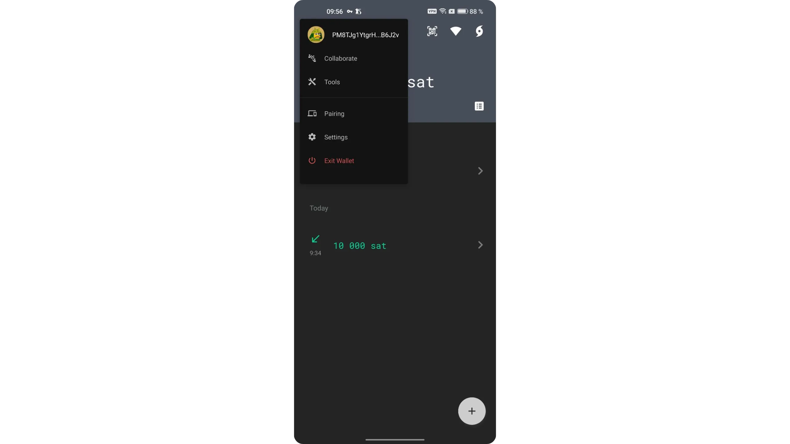

然后按屏幕右下方的 `+` 按钮。

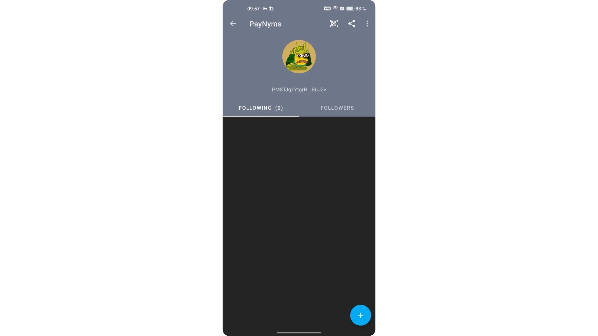

选择 `Ashigaru Open Source Project` 作为接收者。

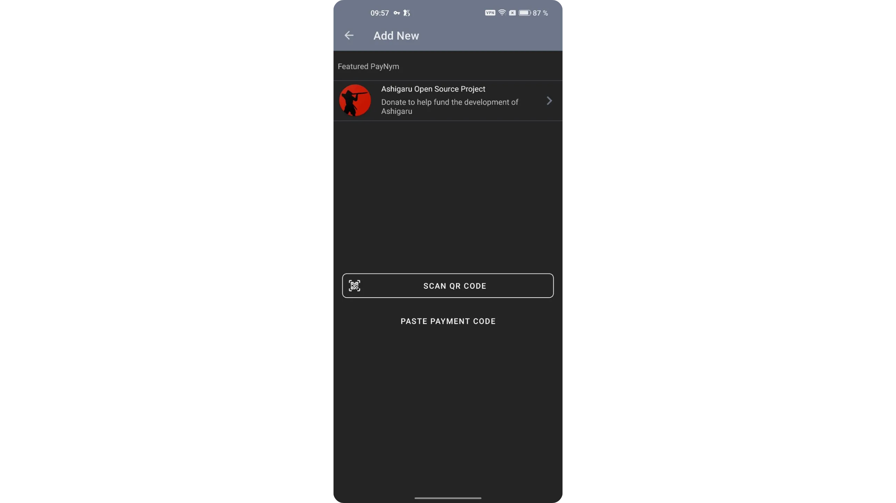

点击 `CONNECT`（连接）按钮，建立 BIP47 通信通道（有关该协议的更多信息，请参阅下面的教程）。

https://planb.academy/tutorials/privacy/on-chain/paynym-bip47-a492a70b-50eb-4f95-a766-bae2c5535093

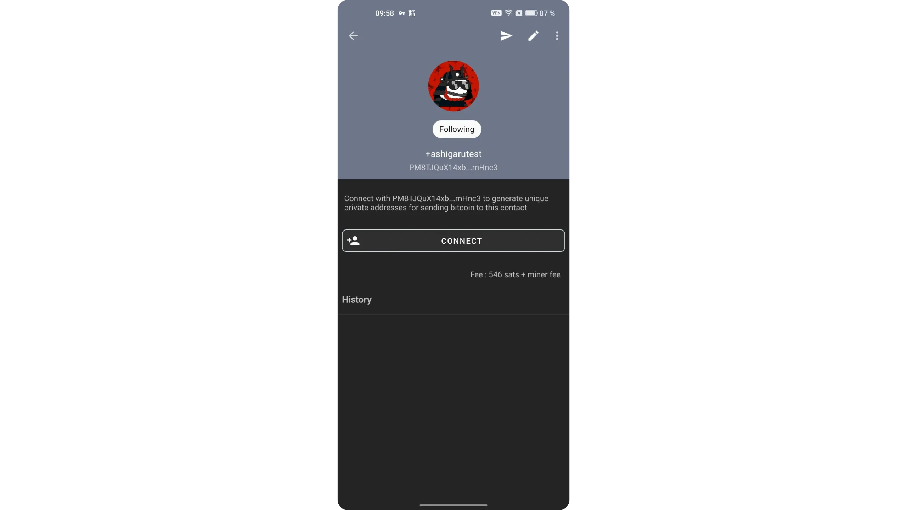

通知交易确认后，点击界面右上角的白色小箭头，即可向项目发送捐款。

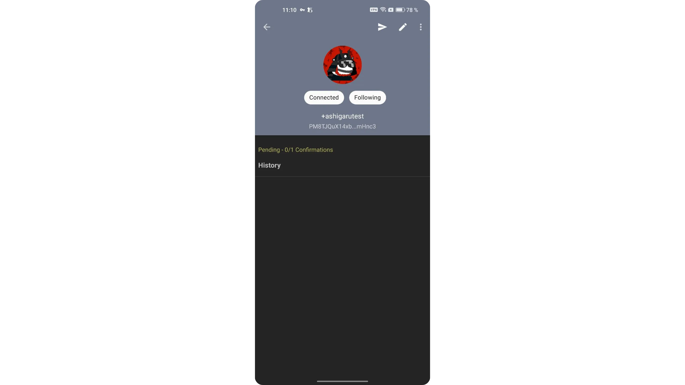

现在您已经知道如何使用 Ashigaru 应用程序的基本功能。在接下来的教程中，我们将介绍如何利用高级消费交易，以及从 Samourai Wallet 继承而来的 Whirlpool（混币的一种实现）。
https://planb.academy/tutorials/privacy/on-chain/ashigaru-terminal-9a0d46d3-33b9-4c64-84c5-bfa25b3a0add
