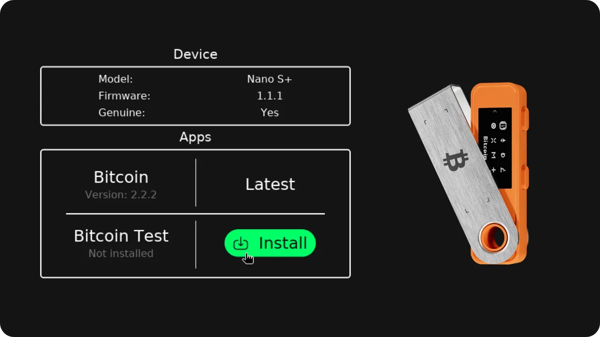

Jika kamu menggunakan Ledger, kamu mungkin menemukan bahwa kamu harus melalui perangkat lunak Ledger Live, setidaknya untuk konfigurasi awal perangkat, untuk memeriksa keasliannya dan menginstal aplikasi Bitcoin di dalamnya. Namun, setelah konfigurasi ini, banyak pengguna Bitcoin lebih memilih menggunakan perangkat lunak manajemen dompet Bitcoin khusus seperti Sparrow atau Liana daripada Ledger Live. Meskipun Ledger memproduksi dompet perangkat keras yang sangat baik dengan cepat menyertakan fitur-fitur Bitcoin terbaru, perangkat lunak mereka belum tentu disesuaikan dengan kebutuhan spesifik para bitcoiners. Memang, Ledger Live menyertakan banyak fitur untuk altcoin, sementara opsi yang didedikasikan untuk manajemen dompet Bitcoin terbatas. Tapi masalah dengan Sparrow dan Liana (untuk saat ini) adalah mereka tidak mengizinkan kamu untuk menginstal aplikasi Bitcoin di Ledger.

Untuk melewati kebutuhan menggunakan Ledger Live selama konfigurasi awal Ledger kamu, kamu bisa memakai alat Bacca (atau "Penginstal Ledger"). Perangkat lunak ini memungkinkan kamu menginstal dan memperbarui aplikasi Bitcoin, memverifikasi keaslian Ledger kamu, dan bahkan memperbarui firmware perangkat. Bacca dibuat oleh Antoine Poinsot (Darosior), pengembang Bitcoin Core di Chaincode Labs, salah satu pendiri Revault dan Liana (https://wizardsardine.com/), serta Pythcoiner.

Dalam tutorial ini, aku akan menunjukkan cara menggunakan alat ini, sehingga kamu bisa melakukannya tanpa perangkat lunak Ledger Live untuk selamanya, dan tetap menikmati perangkat Ledger kamu. Alat ini bisa digunakan di semua perangkat: Nano S Classic, Nano S Plus, Nano X, Flex, dan St

---
*Harap diperhatikan bahwa alat ini cukup baru, dan pengembangnya menyatakan bahwa alat ini masih **dalam tahap pengujian**. Mereka merekomendasikan untuk menggunakannya hanya untuk tujuan pengujian, dan bukan untuk perangkat yang dimaksudkan menampung dompet Bitcoin yang sebenarnya, meskipun hal itu memungkinkan dilakukan. Dalam hal ini, aku sarankan kamu mengikuti rekomendasi dari pengembang alat ini, yang ditentukan [pada README repositori GitHub mereka](https://github.com/darosior/ledger_installer).*

---
## Prasyarat

Di komputermu, kamu akan membutuhkan dua alat untuk menggunakan Bacca:


- Git ;
- Karat.

Kalau kamu sudah menginstalnya, kamu dapat melewati langkah ini.

**Linux:**

Pada distribusi Linux, Git umumnya sudah terinstal. Untuk memeriksa apakah Git telah terinstal pada sistem kamu, kamu dapat mengetikkan perintah berikut di terminal :

```bash
git --version
```

Jika kamu belum menginstal Git di sistem kamu, berikut adalah perintah untuk menginstalnya di Debian :

```bash
sudo apt install git
```

Terakhir, untuk menginstal lingkungan pengembangan Rust, gunakan perintah :

```bash
curl --proto '=https' --tlsv1.2 -sSf https://sh.rustup.rs | sh
```

**Jendela:**

Untuk menginstal Git, kunjungi [situs web resmi proyek](https://git-scm.com/). Unduh perangkat lunak dan ikuti petunjuk pemasangan.

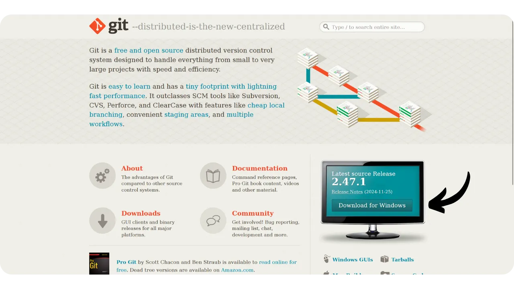

Lanjutkan dengan cara yang sama untuk menginstal Rust dari [situs web resmi](https://www.rust-lang.org/tools/install).

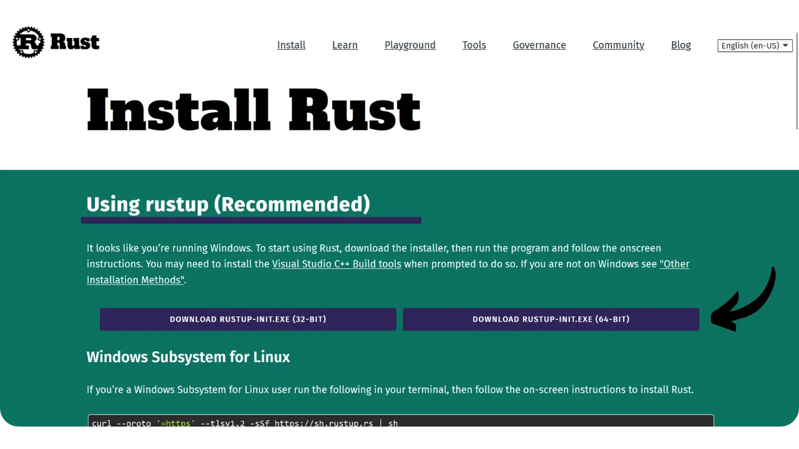

**MacOS:**

Jika Git belum terinstal di sistem, buka terminal dan jalankan perintah berikut untuk menginstalnya:

```bash
git --version
```

Jika Git tidak terinstal di sistem kamu, sebuah jendela akan terbuka dan menawarkan Anda untuk menginstal Xcode, yang di dalamnya termasuk Git. Cukup ikuti petunjuk di layar untuk melanjutkan penginstalan.

Untuk menginstal Rust, jalankan perintah berikut:

```bash
curl --proto '=https' --tlsv1.2 -sSf https://sh.rustup.rs | sh
```

## Instalasi Bacca

Buka terminal dan buka folder tempat Anda ingin menyimpan perangkat lunak, lalu jalankan perintah berikut:

```bash
git clone https://github.com/darosior/ledger_installer.git
```

Navigasikan ke direktori perangkat lunak:

```bash
cd ledger_installer
```

Kemudian gunakan Cargo untuk mengkompilasi proyek dan menjalankan GUI Bacca:

```bash
cargo run -p ledger_manager_gui
```

Sekarang kamu memiliki akses ke antarmuka perangkat lunak.

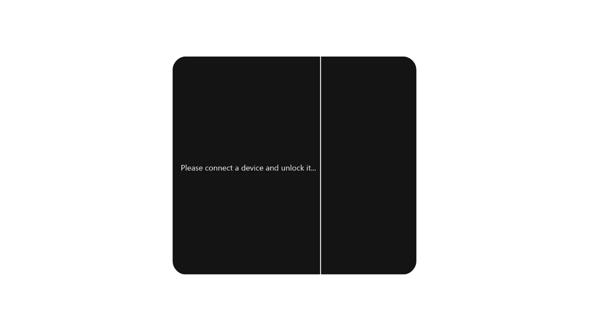

## Mengkonfigurasi Buku Besar

Sebelum memulai, jika Ledger kamu masih baru, pastikan kamu sudah mengatur kode PIN dan menyimpan seedphrase. Kamu tidak memerlukan Ledger Live untuk langkah awal ini. Cukup sambungkan Ledger kamu melalui kabel USB untuk menyalakannya. Jika kamu tidak yakin bagaimana cara melanjutkan kedua langkah ini, kamu bisa merujuk ke awal tutorial khusus untuk model kamu:


https://planb.academy/tutorials/wallet/hardware/ledger-nano-s-plus-75043cb3-2e8e-43e8-862d-ca243b8215a4

https://planb.academy/tutorials/wallet/hardware/ledger-flex-3728773e-74d4-4177-b39f-bd923700c76a

## Menggunakan Bacca

Hubungkan Ledger kamu ke komputer dan buka kuncinya menggunakan kode PIN yang sudah kamu tetapkan. Bacca akan secara otomatis mendeteksi Ledger kamu.

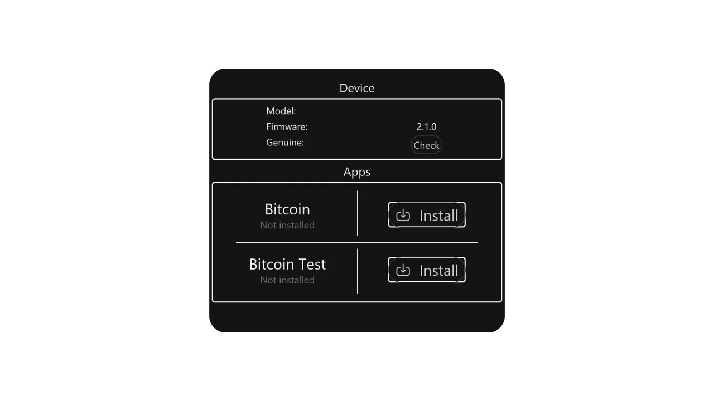

Untuk mengonfirmasi keaslian Ledger, klik tombol "*Cek*". kamu perlu memastikan koneksi pada perangkat Ledger kamu untuk melanjutkan.

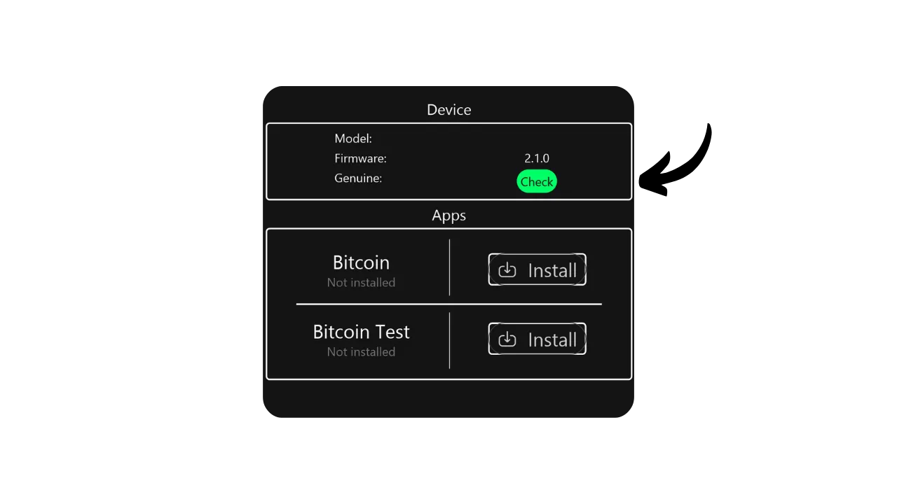

Bacca kemudian akan memberi tahu jika Ledger Anda asli. Jika tidak, ini mengindikasikan bahwa perangkat telah disusupi, atau perangkat tersebut palsu. Dalam hal ini, segera hentikan penggunaannya.

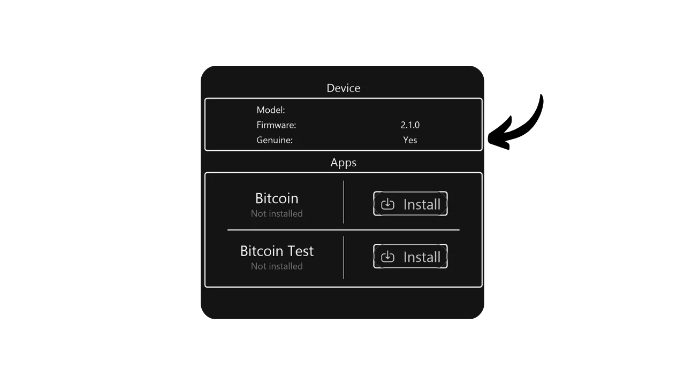

Pada menu "*Apps*", kamu dapat melihat daftar aplikasi yang telah terinstal pada Ledger Anda.

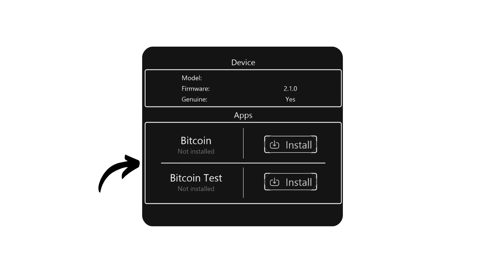

Untuk menginstal aplikasi Bitcoin, klik "*Instal*", kemudian otorisasi instalasi pada Ledger kamu.

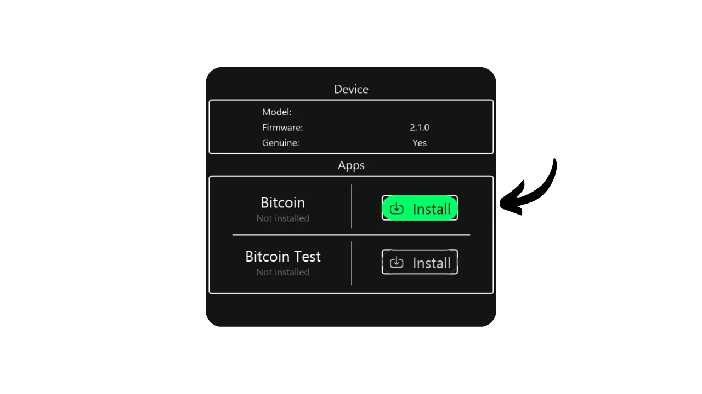

Aplikasi sudah terinstal dengan baik.

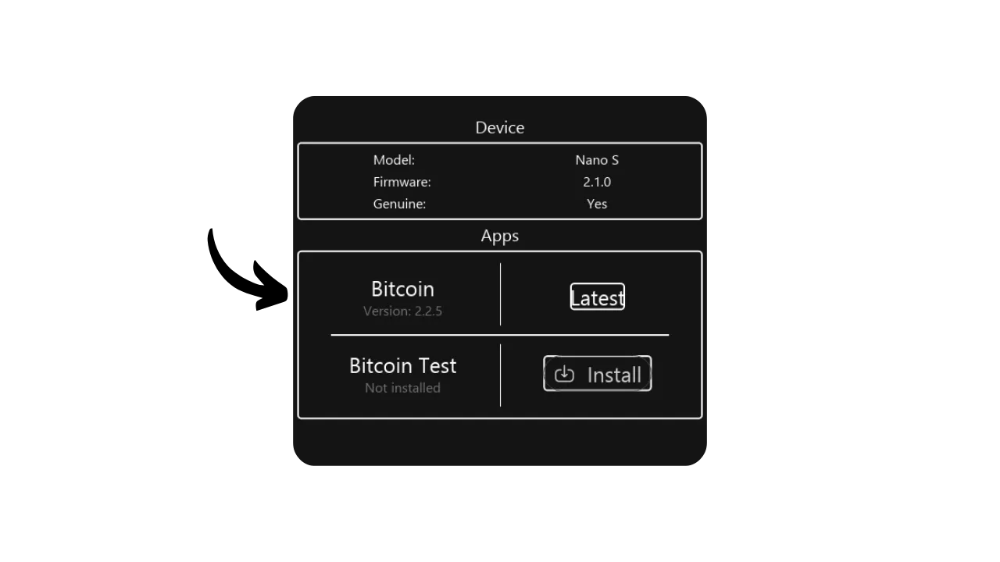

Jika kamu belum menginstal aplikasi Bitcoin versi terbaru, Bacca akan menampilkan tombol "*Update*" dan bukannya "*Latest*". Cukup klik tombol ini untuk memperbarui aplikasi.

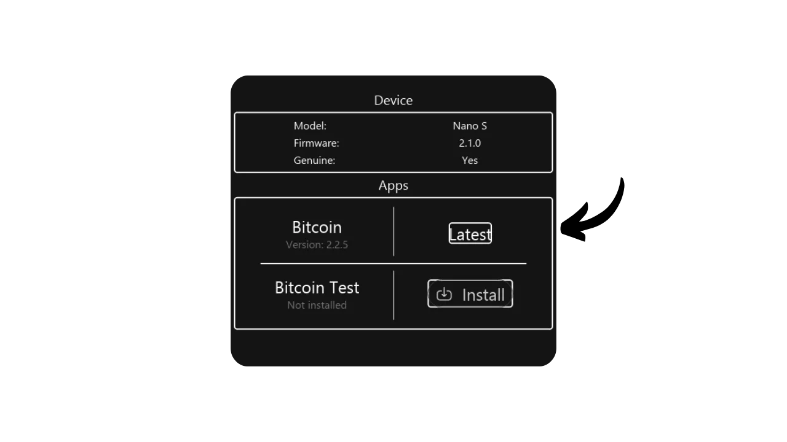

Setelah Ledger kamu dikonfigurasi dengan benar dengan versi terbaru aplikasi Bitcoin, kamu siap untuk mengimpor dan menggunakan dompet kamu pada perangkat lunak manajemen seperti Sparrow atau Liana, tanpa harus melalui Ledger Live!

Jika kamu merasa tutorial ini bermanfaat, aku akan sangat berterima kasih jika kamu memberikan jempol hijau di bawah ini. Jangan ragu untuk membagikan artikel ini di jejaring sosial kamu. Terima kasih banyak!

Aku juga menyarankan kamu melihat tutorial tentang GnuPG ini, yang menjelaskan cara memeriksa integritas dan keaslian perangkat lunak sebelum menginstalnya. Ini adalah praktik penting, terutama ketika menginstal perangkat lunak manajemen portofolio seperti Liana atau Sparrow :


https://planb.academy/tutorials/computer-security/data/integrity-authenticity-21d0420a-be02-4663-94a3-8d487f23becc

