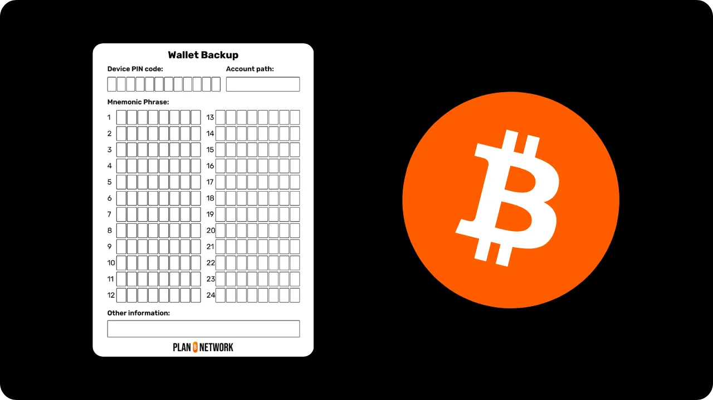
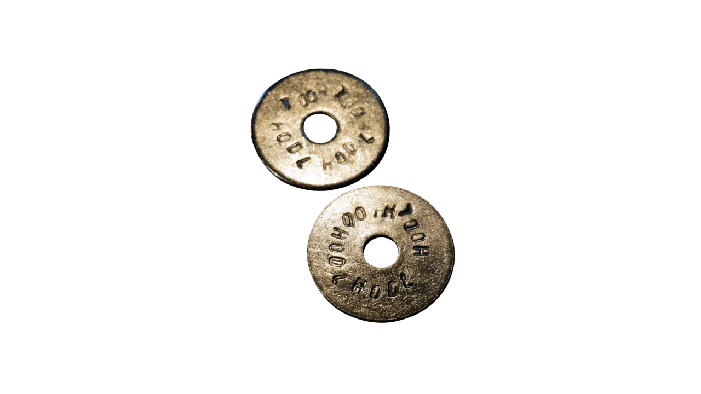
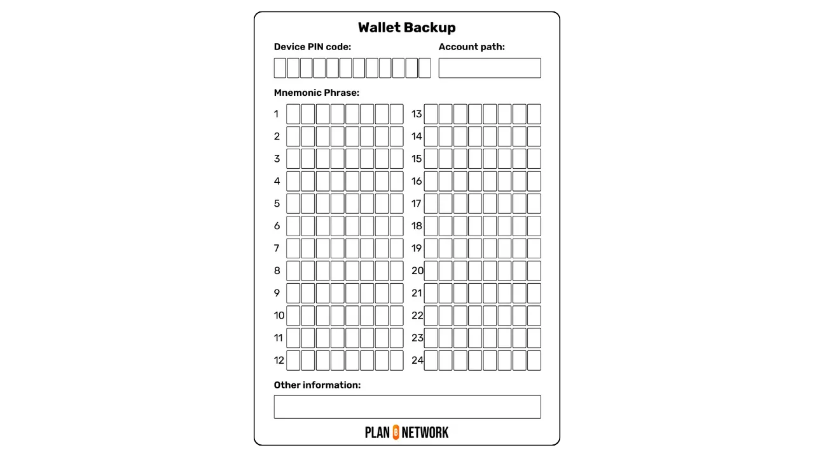
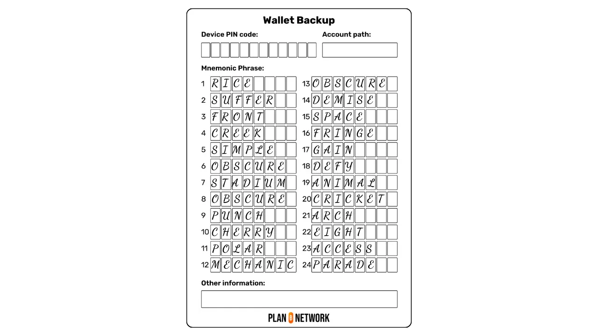
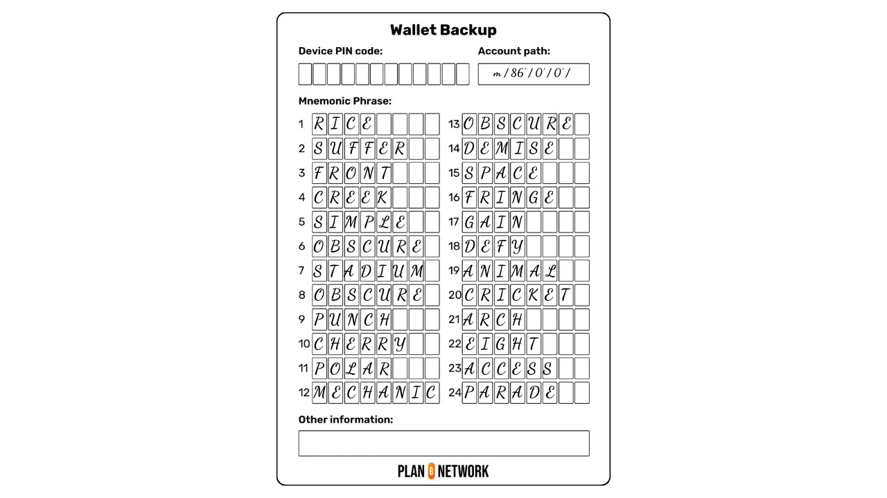
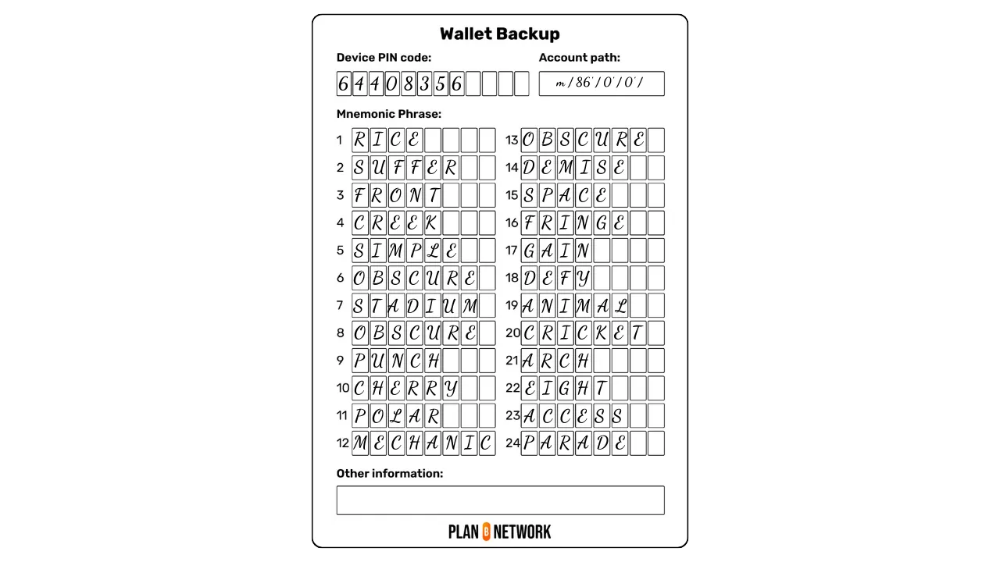
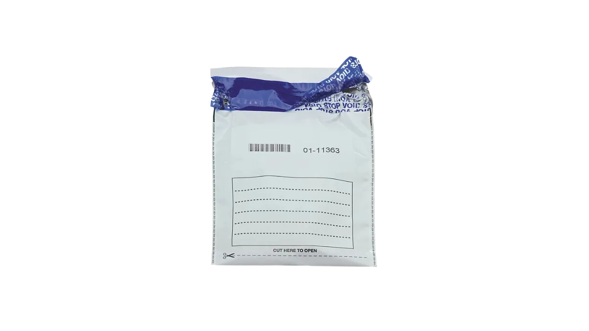

Ketika kamu membuat dompet Bitcoin baru, baik lewat dompet perangkat lunak maupun perangkat keras, kamu akan menerima *mnemonic phrase* yang terdiri dari 12 atau 24 kata. Frasa ini sangat penting, karena ini adalah sumber dari semua kunci pribadi yang mengamankan Bitcoin kamu. Oleh karena itu, frasa ini harus dijaga dengan baik agar kamu bisa memulihkan dana jika terjadi kerusakan, pencurian, atau kehilangan media dompet kamu.

Di tutorial ini, kita akan membahas praktik terbaik untuk menyimpan *mnemonic phrase* dengan aman, supaya kamu tidak kehilangan akses ke Bitcoin kamu.

## Kesadaran akan risiko

Kata kunci ini memberi kamu akses penuh dan tidak terbatas ke semua Bitcoin kamu. Siapa pun yang memiliki frasa ini bisa mencuri dana kamu, bahkan tanpa akses fisik ke media yang menyimpan dompet kamu.

Artinya, misalnya, jika kamu menggunakan dompet Bitcoin di Ledger, siapa pun yang punya akses ke *mnemonic phrase* kamu bisa mencuri seluruh Bitcoin kamu, meski tanpa memegang Ledger itu sendiri. Inilah mengapa **kamu tidak boleh membagikan *mnemonic phrase* kamu**, dalam kondisi apa pun.

Oleh karena itu, frasa ini adalah informasi unik yang memungkinkan kamu memulihkan akses ke Bitcoin kamu jika terjadi kehilangan, pencurian, atau kerusakan pada media dompet. Contohnya lagi dengan Ledger: jika perangkatmu hilang, kamu bisa memulihkan dana dengan memasukkan *mnemonic phrase* kamu di Ledger baru atau dompet lain yang kompatibel, baik perangkat lunak maupun perangkat keras.

Jadi, penting untuk menyimpan frasa ini dengan sangat hati-hati dan di tempat yang aman, seperti yang akan kita bahas di bagian berikut.

**Frasa mnemonik Anda dengan demikian terpapar pada dua risiko utama: pencurian dan kehilangan**

Pencurian dapat terjadi dalam dua cara utama:


- Seseorang mendapatkan akses fisik ke cadangan kamu, misalnya saat terjadi perampokan atau lewat orang terdekat;
- Kamu secara sukarela atau tidak sengaja telah membagikan frasa kamu kepada orang lain.

Untuk menghindari pencurian cadangan *mnemonic phrase* secara fisik, penting untuk menyimpannya di tempat yang aman. Hal ini akan kita bahas lebih detail di bagian berikutnya.

Untuk upaya pencurian jarak jauh, selalu ingat untuk tidak pernah membagikan *mnemonic phrase* kamu, apa pun situasinya. Upaya phishing sangat umum terjadi: email palsu, situs web yang meniru dompet resmi, atau permintaan langsung lewat berbagai saluran komunikasi. Jika seseorang meminta frasa kamu, itu adalah penipuan, bahkan dalam situasi darurat sekalipun. Biasanya, pencuri menyamar sebagai karyawan produsen dompet perangkat keras, padahal perusahaan-perusahaan ini tidak akan pernah meminta *mnemonic phrase* kamu dalam kondisi apa pun. Jadi, berhati-hatilah terhadap semua komunikasi yang kamu terima, baik lewat email, telepon, pos, jejaring sosial, atau bahkan secara langsung.

Saat kamu perlu memasukkan frasa ke dalam dompet perangkat keras atau perangkat lunak untuk memulihkan akses ke dompet setelah terjadi masalah pada media awal, luangkan waktu untuk memeriksa keaslian dan integritas perangkat keras atau perangkat lunak yang kamu gunakan. Jangan panik, lakukan semuanya secara tenang dan metodis.

Selain itu, berhati-hatilah saat menangani *mnemonic phrase* kamu. Pastikan tidak ada orang lain atau kamera yang bisa melihatnya.

Terkait risiko kehilangan, hal ini bisa terjadi karena tiga alasan utama: hilangnya media cadangan, degradasi, atau kesalahan dalam penyimpanan. Kita akan membahas lebih lanjut cara menghindari atau meminimalkan ketiga risiko ini di bagian berikut.


## Dukungan

Untuk menyimpan frasa pemulihan kamu, tulislah pada media fisik, seperti kertas atau logam. Jangan pernah menggunakan media digital: jangan menyimpannya dalam berkas teks, memotretnya, atau menaruhnya di pengelola kata sandi. Metode digital ini meningkatkan risiko dibandingkan dengan media fisik. Jadi, aturannya jelas: gunakan kertas, karton, atau logam untuk menyimpan frasa kamu.

Meski menuliskan frasa pada selembar kertas sudah termasuk praktik yang baik, memilih media logam, seperti baja tahan karat, menawarkan keamanan tambahan. Media ini melindungi *mnemonic phrase* kamu dari risiko kebakaran, banjir, atau kerusakan lain yang bisa terjadi pada lokasi penyimpanan.


Bagi mereka yang mencari opsi ekonomis untuk mencadangkan frasa mereka pada logam, [metode DIY "*SAFU Ninja*"](https://jlopp.github.io/metal-bitcoin-storage-reviews/reviews/safu-ninja/) adalah solusi yang sangat baik. Yang perlu kamu lakukan hanyalah membeli mesin cuci logam, sekrup, dan mur di toko. Lalu, ukirlah kata-kata dari frasa kamu pada masing-masing mesin cuci, beri nomor pada mereka, dan pasang di sekrup dengan mur. Metode berbiaya rendah ini sudah memberikan ketahanan yang cukup baik.




Kredit gambar: [*SAFU Ninja Review*, Jameson Lopp](https://jlopp.github.io/metal-bitcoin-storage-reviews/reviews/safu-ninja/).

Jika kamu lebih suka berinvestasi dalam perangkat cadangan logam yang lengkap, aku menyarankamu melihat [tes ketahanan Jameson Lopp](https://jlopp.github.io/metal-bitcoin-storage-reviews/), yang mengevaluasi sebagian besar solusi yang tersedia di pasar. Aku menyarankamu untuk memilih braket satu bagian, seperti pelat logam untuk mengukir, mencap atau melubangi. Perangkat ini umumnya menawarkan ketahanan yang jauh lebih besar daripada sistem yang menggunakan huruf terpisah untuk dirakit.

Jika kamu memilih dompet kertas, kamu memiliki beberapa pilihan: selembar kertas kosong sederhana, dompet karton yang sering disertakan dengan dompet perangkat keras kamu, atau templat yang dapat diunduh yang dapat kamu cetak [dengan mengeklik di sini](https://github.com/PlanB-Network/bitcoin-educational-content/blob/dev/resources/bet/wallet-backup-sheet/assets/mnemonic-sheet.pdf).



## Cadangan

Sekarang setelah kamu memilih media fisik, saatnya menuliskan frasa pemulihan kamu! Untuk menghindari kehilangan Bitcoin, ikuti praktik-praktik terbaik berikut.

Pertama, pastikan tidak ada orang lain atau kamera yang mengawasi saat kamu menuliskan frasa kamu.

Kemudian, luangkan waktu untuk menulis setiap kata dengan jelas dan terbaca. Kamu mungkin perlu membacanya kembali bertahun-tahun dari sekarang, atau orang lain mungkin perlu melakukannya sebagai bagian dari warisan. Oleh karena itu, tulisan tangan yang rapi sangat penting.

Secara teori, kamu bisa menulis hanya 4 huruf pertama dari setiap kata, karena dalam daftar 2048 kata di BIP39, tidak ada dua kata yang memiliki 4 huruf pertama sama dalam urutan yang sama. Namun, jika media kamu memiliki ruang cukup, disarankan menulis setiap kata secara lengkap. Ini berguna jika terjadi degradasi sebagian media. Misalnya, jika kamu hanya menulis `accu` untuk kata `accuse` dan huruf `u` hilang, kamu bisa bingung antara `accuse`, `access`, `accident`, atau `account`. Dengan menulis kata secara lengkap, meski satu huruf hilang, masih mudah mengenali kata yang benar.

Penting juga menulis kata-kata sesuai urutan yang benar. Jika kamu punya 24 kata tapi tidak tahu urutannya, akan mustahil memulihkan dompet. Penomoran kata juga penting: jika media rusak atau kata-kata tidak teratur, penomoran membantu mengembalikannya ke urutan yang benar.



Selain itu, penting dipahami bahwa, secara teori, *mnemonic phrase* saja tidak selalu cukup untuk memulihkan akses ke Bitcoin kamu. Kamu juga perlu mengetahui jalur derivasi yang digunakan untuk menghasilkan kunci. Jika kamu menggunakan dompet SingleSig dengan jalur standar, proses pemulihan biasanya jauh lebih mudah. Namun, jika menggunakan jalur non-standar, pemulihan bisa menjadi tidak mungkin, meskipun kamu memiliki *mnemonic phrase* yang benar. Untuk menghindari masalah ini, sangat disarankan agar kamu mencatat jalur derivasi akun yang kamu gunakan pada media cadangan kamu. Informasi ini bisa ditemukan di pengaturan perangkat lunak dompet yang kamu pakai. Sebagai contoh, untuk dompet Taproot standar, jalur derivasi default adalah:


```txt
m / 86' / 0' / 0' /
```



Jika kamu menggunakan dompet multisig atau dompet dengan skrip yang kompleks, termasuk kunci pemulihan seperti yang ditawarkan oleh perangkat lunak Liana, sangat penting untuk menyimpan **Output Script Descriptor**. Deskriptor ini berisi semua informasi yang kamu perlukan, selain frasa pemulihan, untuk mendapatkan kembali akses ke Bitcoin kamu.

Kamu juga bisa memperkaya cadangan kamu dengan informasi tambahan yang berkaitan dengan dukungan dompet yang kamu gunakan. Misalnya, catat kode PIN untuk membuka dompet perangkat keras kamu, atau kata-kata anti-phishing jika kamu menggunakan COLDCARD.



Di sisi lain, jika kamu menggunakan *passphrase*, pastikan kamu tidak menuliskannya di media yang sama dengan *mnemonic phrase* kamu. Tujuan *passphrase* adalah untuk melindungi dompet kamu jika terjadi pencurian. Untuk mempelajari lebih lanjut tentang cara menggunakan *passphrase*, lihat tutorial pelengkap ini:

https://planb.academy/tutorials/wallet/backup/passphrase-a26a0220-806c-44b4-af14-bafdeb1adce7

Setelah kamu menyimpan *mnemonic phrase* di media fisik, sangat disarankan untuk melakukan tes pemulihan ketika dompet baru masih kosong. Tes ini melibatkan menuliskan contoh informasi, sengaja menghapus dompet kosong, lalu mencoba memulihkannya hanya dengan cadangan fisik dari *mnemonic phrase*. Tes ini memungkinkan kamu memeriksa apakah cadangan sudah lengkap dan bebas dari kesalahan input. Selain itu, kamu akan terbiasa dengan proses pemulihan, sehingga jika suatu saat perlu memulihkan dompet, kamu akan lebih siap dan tidak stres saat pertama kali melakukannya dalam situasi nyata. Untuk mempelajari lebih lanjut tentang cara melaksanakan tes ini, lihat tutorial lainnya:


https://planb.academy/tutorials/wallet/backup/recovery-test-5a75db51-a6a1-4338-a02a-164a8d91b895

Terakhir, ada pertanyaan tentang jumlah cadangan. Pilihan ini sepenuhnya tergantung pada situasi pribadi Anda. Membatasi jumlah salinan, misalnya dengan menulis frasa mnemonik kamu hanya sekali pada sebuah media, akan mengurangi risiko pencurian, tetapi meningkatkan risiko kehilangan. Sebaliknya, membuat beberapa salinan akan mengurangi risiko kehilangan, tetapi meningkatkan risiko pencurian. Jadi, terserah kamu untuk menemukan keseimbangan yang tepat untuk kebutuhanmu, dan menentukan jumlah salinan yang menurut Anda paling tepat.

## Penyimpanan

Setelah kamu mencadangkan *mnemonic phrase* dengan hati-hati, sekarang saatnya memilih lokasi penyimpanan yang tepat. Pilihan ini tergantung pada strategi keamanan kamu. Dalam hal apa pun, pilih tempat yang tersembunyi, kecil kemungkinan ditemukan orang lain, namun tetap mudah diakses untuk pemeriksaan berkala. Pastikan juga lokasi tersebut terlindung dari berbagai elemen agar media tidak rusak.

Saya juga menyarankan agar kamu tidak menyimpan *mnemonic phrase* di tempat yang bukan milikmu, seperti brankas di kantor notaris atau bank. Opsi ini mungkin terlihat aman, tetapi berarti kamu bergantung pada pihak ketiga untuk mengakses cadangan, yang bertentangan dengan prinsip dasar Bitcoin.

Untuk keamanan tambahan, gunakan kantong plastik anti-rusak atau sistem penyegelan serupa. Ini memungkinkan kamu memeriksa bahwa tidak ada orang yang bisa mengakses frasa kamu. Misalnya, jika kamu menyimpan frasa di rumah dan menerima tamu, sulit mengetahui apakah seseorang sempat melihat, mengingat, atau memotret frasa kamu. Kantong anti-rusak mempermudah verifikasi ini: jika kantong masih utuh, kamu bisa yakin frasa tetap rahasia. Kantong buram sepenuhnya seperti ini tersedia secara online atau di toko-toko khusus Bitcoin.



Terakhir, ketika frasa Anda disimpan dalam amplop anti rusak, jangan lupa untuk mencatat pengenal unik amplop tersebut. Hal ini akan memudahkan kamu untuk memverifikasi keasliannya saat melakukan pemeriksaan.

## Manajemen waktu

Sekarang, setelah frasa kamu disimpan dengan hati-hati, penting untuk menyiapkan pemantauan rutin. Secara berkala, periksa apakah frasa kamu masih ada di lokasi penyimpanan dan kantong buramnya belum dibuka.

Saat pemeriksaan ini, kamu juga bisa membuka kantong untuk mengecek kondisi media. Pastikan tidak ada kerusakan dan frasa masih terbaca dengan jelas. Jika ada tanda-tanda kerusakan, sebaiknya buat salinan baru dari dompet perangkat keras kamu. Pastikan salinan baru berfungsi, lalu hancurkan cadangan lama yang rusak dengan aman untuk menghindari risiko kebocoran.

Terakhir, manajemen *mnemonic phrase* juga berkaitan dengan warisan. Topik ini akan dibahas lebih rinci dalam tutorial berikutnya.


## Melangkah lebih jauh

Untuk memperkuat strategi keamanan kamu, saya menyarankan agar kamu mempelajari cara kerja teknis dompet Bitcoin kamu. Dengan memahami bagaimana berbagai elemen berinteraksi, serta pentingnya dan implikasinya, kamu bisa menyempurnakan strategi keamanan dengan kesadaran penuh terhadap risiko yang ada. Terutama, jika kamu memahami secara teknis apa yang dimungkinkan oleh *mnemonic phrase*, kamu bisa menyesuaikan cara mencatat, menyimpan, dan mengelolanya seiring waktu.

Itulah mengapa saya mengundang kamu mengikuti kursus pelatihan CYP201 gratis yang ditawarkan oleh Plan ₿ Academy. Kursus ini menjelaskan secara rinci semua cara kerja dompet Bitcoin, sehingga kamu bisa menguasai aspek teknis yang penting untuk mengamankan dana secara efektif:

https://planb.academy/courses/46b0ced2-9028-4a61-8fbc-3b005ee8d70f

Jika kamu merasa tutorial ini bermanfaat, saya akan sangat berterima kasih jika kamu memberikan jempol hijau di bawah ini. Jangan ragu untuk membagikan artikel ini di jejaring sosial kamu. Terima kasih banyak!
