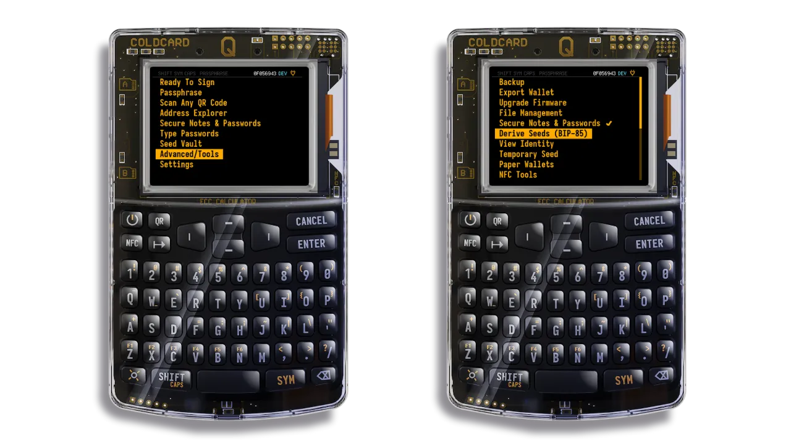
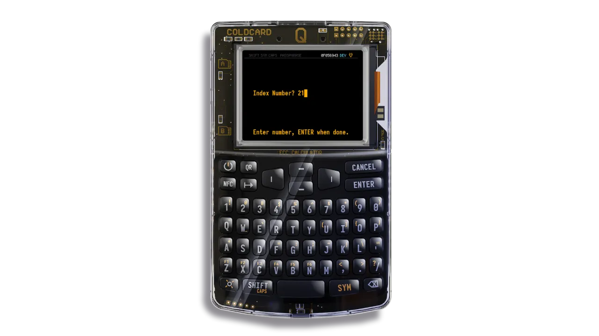

## 1.了解 BIP-85

### 1.1 何为 BIP-85？

BIP-85 是一项高级功能，可让您从一个**主助记词**创建多个**子助记词**。

每个种子二级句子可用于创建一个完全独立的比特币钱包。这些钱包有多种用途：手机上的热钱包、亲戚的钱包、独立的储蓄钱包等。

所有种子子短语都是通过数学方式推导出来的，但无法从任意子短语反推回主种子短语。这种设计确保了每个钱包之间的完全隔离。

只要您能访问您的种子主助记词（以及相关的密语），您就可以生成与其相关的任何种子子助记词，而无需单独保存。

### 1.2 为什么要使用 BIP-85？

BIP-85 在以下情况有助：

- 创建多个独立的比特币钱包，无需多重备份
- 根据不同用途（储蓄、支出、家庭、项目）管理资金
- 为亲属提供保障（"Uncle Jim" 功能）
- 删除钱包时不会丢失资金访问权限
- 简化安全模式：只需保护一个种子的关键助记词

### 1.3 与 BIP-32 相比的优势

对于 BIP-32 来说，单个种子就可以用来生成账户和地址的完整层次结构派生路径（例如：`m/44'/0'/0'/0/0`）。每个路径可以代表一个单独的账户，但这些账户和地址**都与同一个种子相关联**。因此，如果这个种子被发现，**所有由此派生的账户都可以被访问**。

通过 BIP-85，一个主种子可用于生成多个完全独立的子助记词： **如果这些子种子中的一个被发现，攻击者将永远无法猜出主种子或访问其他钱包**。

这使得风险分隔化变得简单：

- 您可以将次级种子用于热钱包或临时使用，可接受更高的曝光。
- 即使这个热钱包的种子被发现，您的其他资金受到其他次级种子的保护或保持离线状态，**仍然安全**。

另一方面，对于 BIP-32 和 BIP-85，如果主种子被发现，**所有资金都会受到危害**。因此，以最高级别的安全措施保护主种子至关重要。

## 2.BIP-85 的实用案例

BIP-85 允许您从单个种子创建多个比特币钱包，每个钱包都有自己的次级种子助记词。以下是组织和保护比特币资金的五个实用案例。每个案例都解释了为什么使用 BIP-85 比通过 BIP-32 用单个主助记词管理多个账户更实用。

### 2.1 限制安全性较低的钱包的风险

- **情景**：您使用**热钱包**（在与互联网连接的设备上安装）进行日常交易。
- **BIP-85 作为解决方案**：创建一个次级种子助记词，专门用于该钱包。
- **与 BIP-32 相比的优势**：您无需将主种子助记词导入手机，从而降低了黑客攻击的风险。只有子种子助记词会被泄露，而您的其他钱包不会受到影响。使用 BIP-32，您需要使用主种子助记词和旁路路径，从而暴露您的所有资金。

### 2.2 为家庭创建钱包

- **情景**：您为亲近的人（例如您的母亲）设置了一个比特币钱包，如果他们丢失了，您还可以恢复它。
- **BIP-85 作为解决方案**：您创建了一个专门的次级种子助记词，并只共享这一个助记词。
- **与 BIP-32 相比的优势**：使用 BIP-32，为亲人创建一个账户需要共享您的主种子助记词，这将使您的所有资金面临风险，并使您亲人的管理更加复杂（管理分支路径），或者在您的主种子助记词之外创建一个新的助记词，并将它保存好。

### 2.3 简化独立钱包的管理

- **情景**：您将比特币用于不同用途（例如，长期储蓄、无需 KYC 的资金）。
- **BIP-85 作为解决方案**：您可以为每个用途创建专用的助记词。
- **与 BIP-32 相比的优势**：BIP-32 中所有账户共享同一个助记词，这会使第三方钱包的管理变得复杂，因为需要管理诸如 `m/44'/0'/0'` 等派生路径。此外，无法为每个设备分配单独的账户（例如，“Coldcard 储蓄账户”、“手机日常账户”、“Trezor 度假账户”）。BIP-85 为每个用途分配独特的助记词，便于识别并分别导入到每个设备上。

### 2.4 使用临时钱包进行交易

- **情景**：您需要一个临时钱包来进行一次性交易或保护机密性（例如：资金混合、与交易所进行 KYC 验证等）。
- **BIP-85 作为解决方案**：您创建一个次级种子助记词，将其用于交易，然后在必要时将其删除，因为助记词可重新生成。
- **与 BIP-32 相比的优势**：使用 BIP-32，临时账户依赖于主种子的助记词，如果账户被盗用，您的所有资金都将面临风险。

## 3.动手之前

### 3.1 硬件（可选）
 - Coldcard Mk4 或 Q1
 - MicroSD 卡

### 3.2 基础知识
 - 理解助记词 (BIP-39)：包含 12 至 24 个单词的列表，用于保存钱包。
 - 了解比特币钱包：管理比特币的软件或设备，以及如何用助记词回复您的比特币。
 - 其他资源（请见附录）。

### 3.3 相兼容软件
 - Sparrow Wallet（计算机，用于仅观察或高级管理）
 - Nunchuk Wallet（手机，用于多重签名）
 - Blue Wallet（手机），等等

### 3.4 Coldcard 配置
 - 在 Coldcard 上初始化一个包含 24 个单词的助记词
 - 可选：添加一个密语，以确保 BIP-85 分支的访问安全。
 - 启用实用选项：NFC（用于导出）、电池供电时禁用 USB（安全）。

## 4.分步教程

请按照以下步骤在 Coldcard 上使用 BIP-85 创建和使用次级种子助记词。

### 4.1 生成一个次级种子助记词

您将根据主种子助记词语创建一个次级种子助记词。

- 打开 Coldcard，输入密码。
  - 如果您使用了密语：
    - 从主屏幕进入 `passphrase`。
    - 选择 `Add Word` 并输入密码。
    - 按住 `Apply`。
    - 检查钱包指纹：前往 `Advanced > View Identity`，记录钱包的指纹。
  - 前往 **BIP-85** 选单
   - 从主屏幕，前往 `Advanced > Derive seed B85`
   - 阅读警告信息并确认。
- ColdCard 会告知您，生成的种子在是从您的主种子派生出来的，但在加密方面上是完全独立的。

  - 选择格式
    - 选择助记词格式：12、18 或 24 个单词。检查您要导入 seed 短语的 Wallet 可接受的字数。
      

  - 选择索引
    - 输入 0 到 9999 之间的数字作为索引。该索引对于日后再生二级 seed 至关重要。请小心保存，并贴上标签，如 "索引 1 = 移动钱包"、"索引 2 = 家庭项目钱包"、"索引 4 = 混币测试"。如果丢失，您不会失去资金的使用权限，但您必须测试从 0 到 9999 的可能性才能恢复资金。

  - 记录或导出次级种子助记词

ColdCard 现在会显示新的次级种子助记词。您可以 ：
 - 手动**记录**。
 - 按住以下按钮：
     - `1`：保存在 SD 卡上
     - `2`："在冷卡上**进入 "使用此种子"** 模式（对导出或签署交易有用）
     - `3` 显示**二维码**（可使用 Blue Wallet 或 Nunchuk 等移动应用程序扫描）。
     - `4` 通过**NFC**发送

💡至此，您就拥有了一个独立的助记词，可用于任何 BIP39 钱包（Trezor、Ledger、BlueWallet、Nunchuk等）。

### 4.2 使用次级种子助记词

现在，您可以使用所派生的种子在以下平台上创建一个新的钱包：

- 移动应用
- 另一个硬件钱包
- 一个多签名钱包

### 4.3 恢复丢失的次级种子助记词

如需随时恢复次级种子，请重复此过程：

1.重新启动 ColdCard
2.输入密码
3.输入您的密语（如有密语）
4.前往 `Advanced > Derive seed B85`
5.选择格式（12/18/24 单词）
6.输入相同的索引（例如：`1`）。
7.您将获得完全相同的次级种子

## 5.缺点、风险和最佳做法

### 5.1 依靠主种子助记词和密语

BIP85 的使用完全依赖于 24 个字的主种子助记词和所使用的密语（如有密语）。

- 所有次级助记词都可以基于这两个要素重新生成。
- 缺少其中任何一个要素，您将无法访问所有由此派生钱包。

### 5.2 多重签名配置中的风险

我们强烈建议不要在多重签名配置中使用由同一主种子助记词生成的次级种子助记词：如果设备或主种子助记词被攻破，攻击者可以重新生成所有多重签名密钥。

### 5.3 软件兼容性

并非所有应用程序都直接支持 BIP85 种子派生。但是，通过 BIP85 生成的种子是标准的 BIP39 种子（12、18 或 24 个单词），因此可以在任何兼容 BIP39 的钱包中使用。

### 5.4 BIP85 账户记录

建议您拥有一份最新的助记词个人记录簿。

- 这样，您无需保存助记词辅助短语，即可快速找到对应的 BIP85 索引。
- 此记录簿应保持简洁，不要明确提及比特币，并应与主助记词分开存放。请务必在您的继承计划中提及此记录簿。

记录簿可以包含：

- 使用的 BIP85 索引（0 到 9999 之间的数字）
- 用途或参考名称（例如：热钱包、个人储蓄、妈妈的钱包）
- 如有必要，可在 ColdCard 中验证钱包指纹。

### 5.5 备份

备份必须包含：

- 主种子
- gW-76（如果使用）

切勿将以下内容存储在一起：

- 主种子和密语
- 主种子和 BIP85 账户记录簿

附录中有更多的资源。

## 附录

## A.1 术语表

- [BEEP](https://planb.academy/resources/glossary/bip)
- [BIP-32](https://planb.academy/resources/glossary/bip0032)
- [BIP-39](https://planb.academy/resources/glossary/bip0039)
- [BIP-85](https://planb.academy/resources/glossary/bip0085)
- [助记词](https://planb.academy/resources/glossary/recovery-phrase)
- [密语](https://planb.academy/resources/glossary/passphrase-bip39)
- [多签名](https://planb.academy/resources/glossary/multisig)

### A.2 保存您的助记词

https://planb.academy/tutorials/wallet/backup/backup-mnemonic-22c0ddfa-fb9f-4e3a-96f9-46e2a7954270

### A.3 了解 BIP39 密语

https://planb.academy/tutorials/wallet/backup/passphrase-a26a0220-806c-44b4-af14-bafdeb1adce7

### A.4 比特币钱包如何运作

https://planb.academy/courses/46b0ced2-9028-4a61-8fbc-3b005ee8d70f
