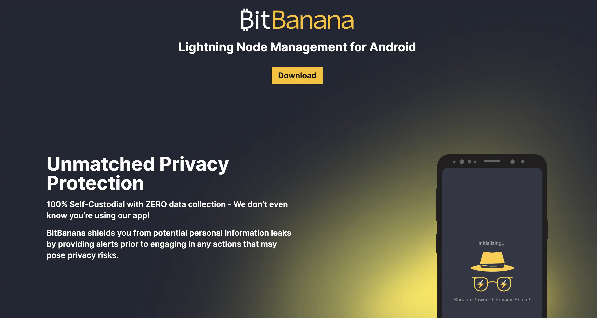

在本教程中，您将学习如何在安卓系统上安装和配置 BitBanana，以便通过智能手机控制您的闪电节点。我们将了解如何将应用程序连接到您现有的基础设施（Umbrel、RaspiBlitz、myNode 或任何 LND/Core Lightning 节点），进行闪电支付，远程管理您的通道，查看您的路由收入，以及备份您的配置。您还将了解到保护节点访问的最佳安全实践，以及它与常用替代方案 Zeus 的比较。

## BitBanana 简介

BitBanana 是一款开源安卓手机应用程序，它能将智能手机变成一个完整的仪表盘，用于远程控制您的闪电节点。与在手机上嵌入本地节点的闪电钱包不同，BitBanana 采用的是 100% 远程控制理念：该应用不持有任何比特币，并且仅连接到您现有的基础设施。

该应用程序由 Michael Wünsch 开发，采用 MIT 许可证，保证完全透明，不收集任何个人数据，并提供可复现的构建版本。BitBanana 通过标准 URI（"lndconnect://"和 "clngrpc://"）原生支持 LND 和 Core Lightning，大大简化了初始配置。该应用程序还能识别 LndHub 和 Nostr Wallet Connect，供没有个人节点的用户使用，不过这些模式只能托管运行，功能有限。

该界面提供对节点所有关键功能的全面访问权限：发送和接收付款（BOLT11、Lightning Address、LNURL、BOLT12、Keysend）、闪电通道管理（打开、关闭、费用调整、再平衡）、高级币控制和瞭望塔管理（watchtower control）。BitBanana 还实现了多个强大的安全层：生物识别锁定、隐身模式、紧急 PIN 码和用于匿名连接的本地 Tor 支持。

## 支持的平台和安装

### 安装

BitBanana 仅适用于 Android 8.0 或更高版本。该应用目前没有 iOS 版本，也没有开发 iOS 版本的计划。该项目的历史可以解释这一限制：BitBanana 是 Zap Android 的直接继承者，最初由 Michael Wünsch 开发，他后来决定以自己的品牌继续开发。Zap 是一个包含多个独立应用（Zap Android、Zap iOS 和 Zap Desktop）的系列，由不同的贡献者以独立的代码库开发。BitBanana 目前只开发 Android 分支。

此外，iOS 生态系统对非托管闪电应用程序造成了重大的监管和技术限制。2023 年，苹果公司以 “违反许可协议” 为由拒绝了 Zeus 更新；2024 年，由于 Lightning 服务提供商的监管政策存在不确定性，Phoenix Wallet 从美国 App Store 下架。正因如此，很多闪电开发者选择在安卓上进行开发，因为它对非托管应用的政策相对宽松。

安卓平台提供三种安装方式：Google Play 商店（安装量超过 5000 次，支持自动更新）、F-Droid（提供可复现的构建版本，支持源代码验证），以及从 GitHub 手动下载 APK 文件。

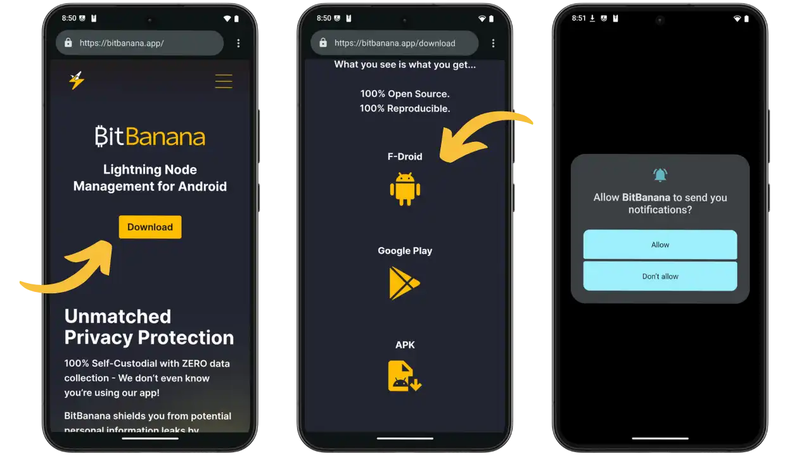

bitbanana.app 官方网站（左侧）宣称“100% 自主管理，零数据收集”。中间屏幕显示三个下载选项：F-Droid（推荐）、Google Play 和 APK。右侧屏幕显示支付提醒的通知权限。

该应用请求的权限包括：网络（节点连接）、摄像头（二维码）、NFC（LNURL）、后台服务（通知）、生物识别（安全）和 WireGuard VPN。无追踪器，零数据收集。启用密码或生物识别锁定以确保访问安全。

## 初始配置

### 连接到 LND 节点

要将 BitBanana 连接到您的 LND 节点（Umbrel、RaspiBlitz、myNode），请获取包含地址、TLS 证书和身份验证 macaroon 的 `lndconnect` URI 或二维码。

在本教程中，我们将使用 Umbrel 连接 LND 节点。请参阅我们的专用教程以理解更多详情：

https://planb.academy/tutorials/node/lightning-network/umbrel-lnd-b12e0b5b-12ff-45f1-978e-62f4b4a8ba16

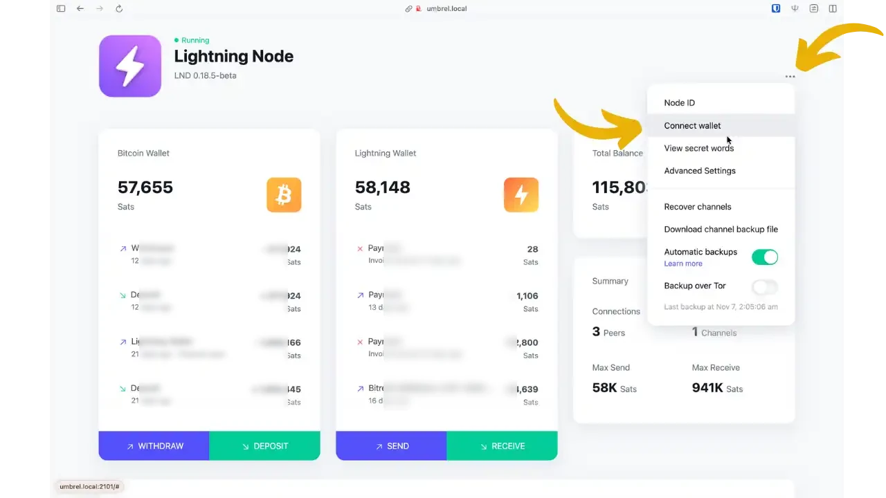

在闪电网络应用程序中，访问右上角的选单并选择 "Connect wallet"。

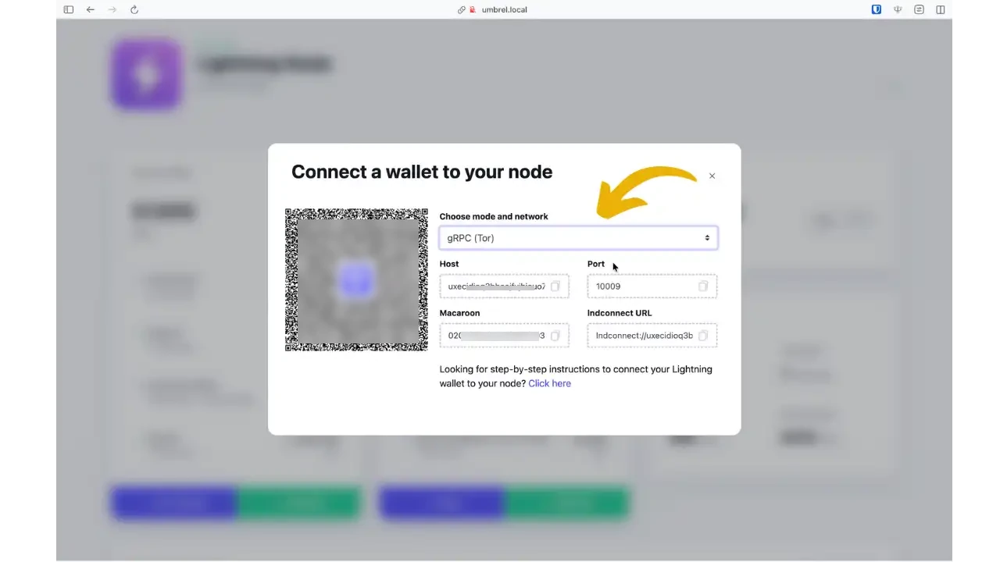

选择 **gRPC (Tor)** 以通过 Tor 进行连接（推荐）。此时会显示二维码和详细信息（主机 .onion、端口 10009、Macaroon）。

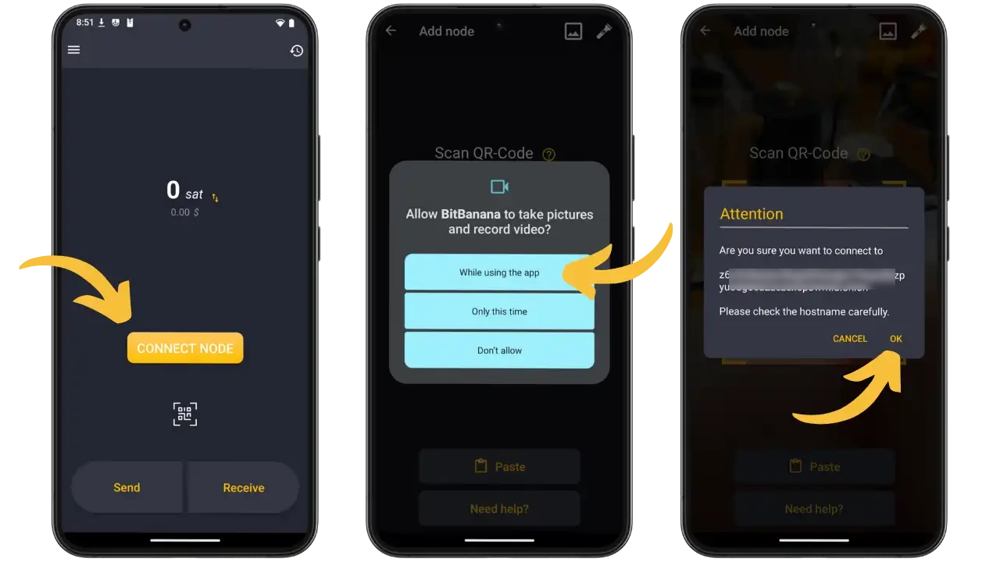

在 BitBanana 中，点击 "CONNECT NODE"（连接节点），扫描二维码或粘贴 URI。授权摄像头访问，然后在确认前检查显示的 .onion 地址。

**Core Lightning**连接

如果您使用 Core Lightning (CLN) 而不是 LND，流程完全相同，URI `clngrpc://` 中包含相互的 TLS 证书。Core Lightning 原生支持 BOLT12（优惠），从而实现 LND 所不具备的可重复使用发票和定期付款功能。

**无个人节点连接（LNbits/托管）**

如果您没有闪电节点，BitBanana 可以通过 LndHub（BlueWallet 和 LNbits 使用的协议）或 Nostr Wallet Connect (NWC) 连接到托管服务。请注意：这些模式以托管模式运行（服务提供商托管您的资金），功能有限。您将无法管理通道或配置路由费用，并且只能发送和接收闪电支付。

如果您想了解关于 LNbits 或 Nostr Wallet Connect 的更多详细信息，请参阅我们的各种教程：

https://planb.academy/tutorials/business/others/lnbits-cdfe1e38-069a-4df9-a86b-ce01ef28f4c2

https://planb.academy/tutorials/node/others/umbrel-nostr-7ae147e8-f5cd-46e1-861b-17c2ea1e08fd

## 日常使用

### 主界面

主屏幕显示 "闪电 "余额，左上角的菜单可进入以下部分：频道、路由、签名/验证、节点、联系人、设置、备份。时钟图标（右上角）打开交易历史记录。底部的 "发送 "和 "接收 "按钮允许您发送和接收您的卫星币。

主屏幕显示您的闪电网络余额，左上角的菜单可访问以下部分：Channels（通道）、路由（Routing）、签名/验证（Sign/Verify）、节点（Nodes）、联系人（Contacts）、设置（Settings）、备份（Backup）。右上角的时钟图标可打开交易历史记录。底部的 “Send” 和 “Recieve” 按钮可用于发送和接收比特币（聪）。

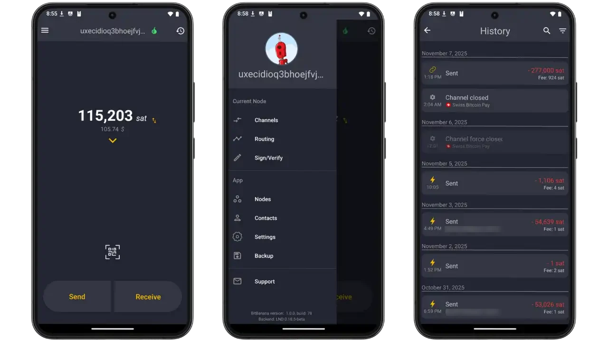

### 闪电和链上付款

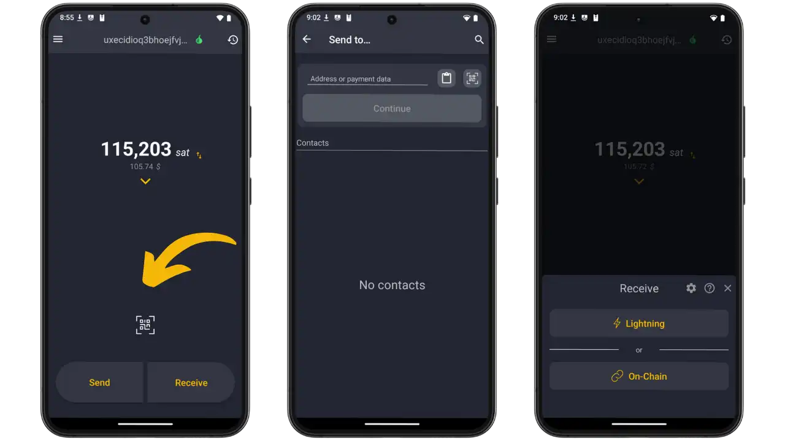

**发送付款：** 在主屏幕上点击 "Send" 按钮。在付款界面（左侧），您可以将地址或付款数据粘贴到 "Address or payment data" 字段中，右上角有一个二维码扫描器用于扫描二维码。您也可以选择 “Contacts” 部分保存的联系人，这样就无需每次都扫描二维码。

BitBanana 可智能识别所有付款格式：经典闪电发票（以 `lnbc` 开头的字符串）、闪电地址（电子邮件格式，如 `utilisateur@domaine.com`）、用于动态支付的 LNURL-pay 代码、用于提取资金的 LNURL-withdraw，甚至直接向闪电公钥支付的 Keysend 而无需事先开具发票。应用程序会在后台自动执行必要的 LNURL 解析。

发票加载完成后，BitBanana 会显示完整详情：确切金额、预估路由费用、付款说明（如果收款人提供）以及发票到期日。确认后，付款将通过您的闪电通道进行路由。然后，您可以查看交易路径的逐跳记录以及交易详情中实际支付的费用。

**接收付款：** 点击 "Receive" 按钮。侧屏幕的选择器可让您选择闪电支付（通过您的通道即时付款）或链上支付。对于闪电支付收款，请输入所需的金额（以聪为单位）（或留空以创建一张金额不固定的发票，供付款人填写），并添加可选的发票描述。BitBanana 会立即生成一张带有二维码的闪电支付发票，供您扫描。您也可以将发票复制为文本并通过电子邮件发送。收到付款后，您会收到推送通知，并且交易及其所有详情会立即显示在交易记录中。

### 通道和路由

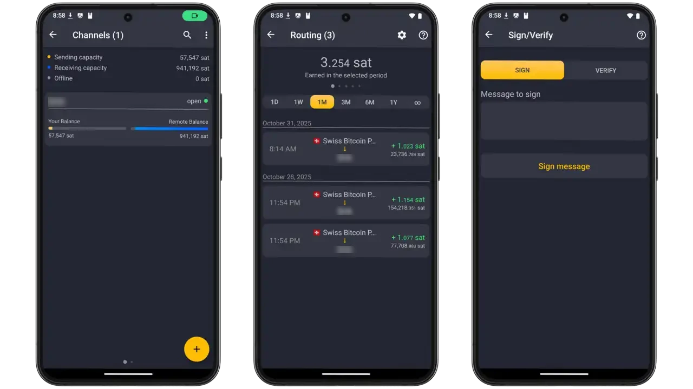

通道 "部分显示您的发送/接收功能，并列出带有独特头像的通道。每个通道都显示本地和远程余额之间的流动性分配。触摸通道可查看全部详情和操作（关闭、更改路由费用）。右上方的三个点可进入 "重新平衡 "选项，重新平衡您的通道流动性。+"按钮可打开一个新通道。

路由部分（中央屏幕）显示按时期（1D、1W、1M、3M、6M、1Y）划分的转发收入，并提供详细的转发历史记录，以优化您的策略。

签名/验证（右屏）允许您对信息进行加密签名/验证，以证明节点控制。

### 多节点和参数

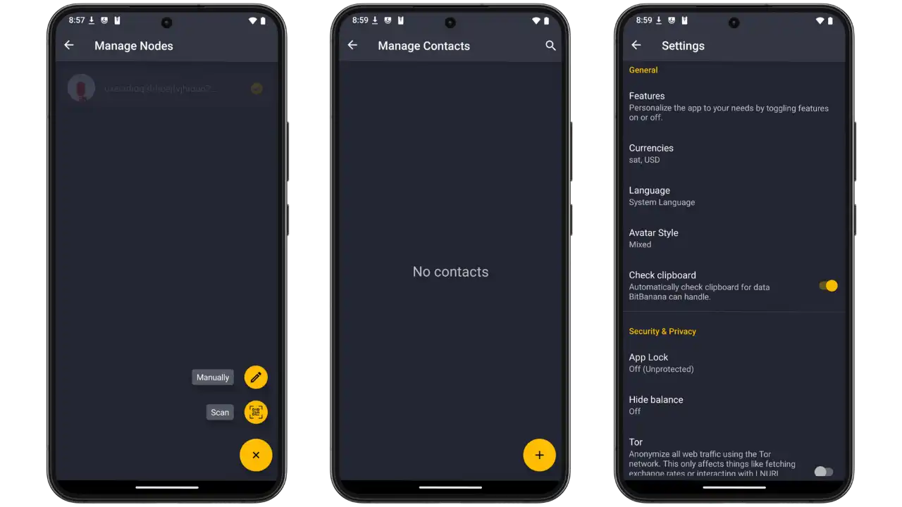

**管理节点（Manage Nodes）**：列出您的节点，并提供手动添加、扫描二维码或切换节点的按钮。您可以设置与同一节点的不同连接方式：局域网 (LAN)、VPN 或 Tor。

**管理联系人**：存储您的闪电网络联系人，方便快速付款。

**设置**：自定义货币、语言和头像。安全与隐私部分：应用程序锁定（PIN/生物识别）、隐藏余额（隐身模式）、Tor（IP 匿名化）。配置价格计算器、区块浏览器、自定义费用估算器。

## 优势和局限性

**优点：**

- 完全移动性：随时随地控制您的 "闪电 "节点
- 完整功能：支付（LNURL、Lightning 地址、BOLT 12）、通道管理、币控制、瞭望塔、多节点
- 安全性PIN 码/生物识别、隐身模式、紧急 PIN 码、本地 Tor、屏幕截图拦截
- 免费、开源（MIT）、零佣金、零数据收集

**限制：**

- 需要一个激活的闪电节点（或托管模式下的 LNbits）
- 暂无 iOS 版本计划
- 确保手机访问权限至关重要（macaroon 管理器 = 节点的全部访问权限）

## 最佳做法

**安全：**

- 启用密码/生物识别锁（防止未经授权访问节点）
- 设置紧急 PIN 码（在胁迫情况下删除敏感数据）
- 切勿共享您的登录 URI 或 macaroon
- 在不安全环境下的隐身模式

**登录：**

- VPN 网状网络（Tailscale、ZeroTier）：速度与安全性的最佳平衡安全性
- Tor：最高级别的保密性，但延迟较高
- Clearnet：除非必要，否则避免使用（IP 暴露、开放端口）

### 备份和恢复

最后，还有 “Backup” 选项，您可以保存配置以进行电话迁移或重新安装。

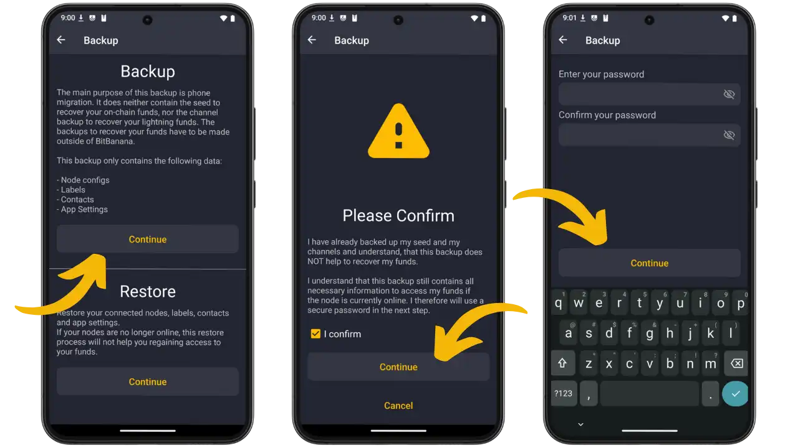

**重要提示**：备份不包含种子或通道备份（需要在节点上进行备份）。备份包含：节点配置（地址、证书、macaroon）、标签、联系人、参数。“Restore” 按钮允许您导入现有备份。保存前需要确认。

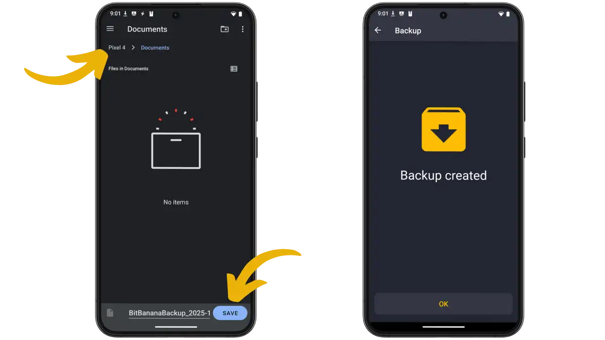

输入加密密码（右侧屏幕）。系统会打开文件选择器（左侧屏幕）以保存 `BitBananaBackup_2025-XX-XX.dat`。确认 "Backup created"。

**安全性：** 将备份加密存储（个人云、USB、NAS）。切勿共享文件或密码。定期测试恢复功能。备份恢复的是连接，而不是资金。

## BitBanana vs Zeus：有什么区别？

如果您正在寻找用于管理闪电节点的移动应用，您很可能会遇到 Zeus，它是 BitBanana 的一个热门替代方案。与 BitBanana 专注于远程控制现有节点不同，Zeus 采用了更全面的方法，提供两种操作模式：一种是将闪电节点直接嵌入到应用中（嵌入式模式，集成 LND），另一种是像 BitBanana 一样远程连接到外部节点。

这种双重功能使 Zeus 对希望在没有任何基础架构的情况下尝试使用闪电网络的初学者特别有吸引力。嵌入式模式可以立即启动一个完整的移动节点，而高级用户则可以在配置好个人节点后切换到远程连接。Zeus 也像 BitBanana 一样支持 LND 和 Core Lightning 进行远程连接。

Zeus 的另一大优势在于其跨平台可用性（iOS 和安卓），而 BitBanana 则仅限于 Android 平台。Zeus 还整合了 Olympus LSP 基础设施，以促进通过即时通道接收闪电支付、面向商家的销售点系统以及管理流动性的集成交换功能。

然而，BitBanana 也拥有其独特的优势：更简洁流畅的界面，更佳的用户体验（UX），这得益于其专注于远程控制的特性，以及带有上下文说明的教学式设计。Zeus 提供了更多功能，但代价是界面更加复杂。该应用程序仍然特别适合希望远距离控制节点而不需要监护功能的用户。

如果您想要了解关于 Zeus 的更多信息，请参阅以下教程：

https://planb.academy/tutorials/wallet/mobile/zeus-embedded-c67fa8bb-9ff5-430d-beee-80919cac96b9

https://planb.academy/tutorials/wallet/mobile/zeus-embedded-advanced-3e89603c-501d-439c-8691-d4a0d0de459b

## 结论

BitBanana 可将您的安卓智能手机变成一个完整的闪电面板，让运行节点的用户能够轻松进行远程管理。该应用程序涵盖所有功能：支付（所有格式）、通道管理、币控制、瞭望塔、多节点模式，并增强了安全性（PIN/生物识别、Tor、紧急 PIN）。

BitBanana 完全自主，不收集任何数据，也不会损害您的资金的机密性和控制权。开源代码（MIT）保证了其透明度。

## 资源

### 正式文件

- [BitBanana网站](https://bitbanana.app)
- [完整文档](https://docs.bitbanana.app)
- [GitHub源代码](https://github.com/michaelWuensch/BitBanana)

### 安装平台

- [Google Play 商店](https://play.google.com/store/apps/details?id=app.michaelwuensch.bitbanana)
- [F-Cold](https://f-droid.org/packages/app.michaelwuensch.bitbanana)
