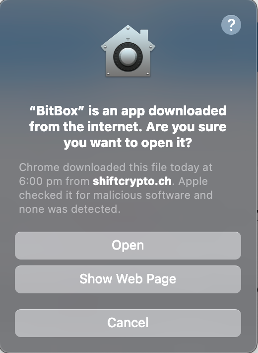
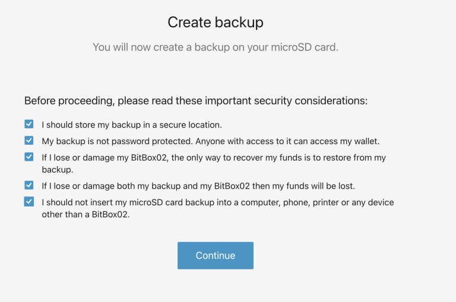
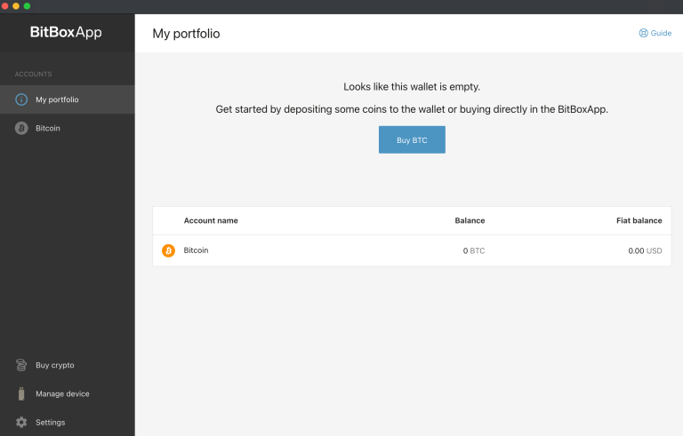
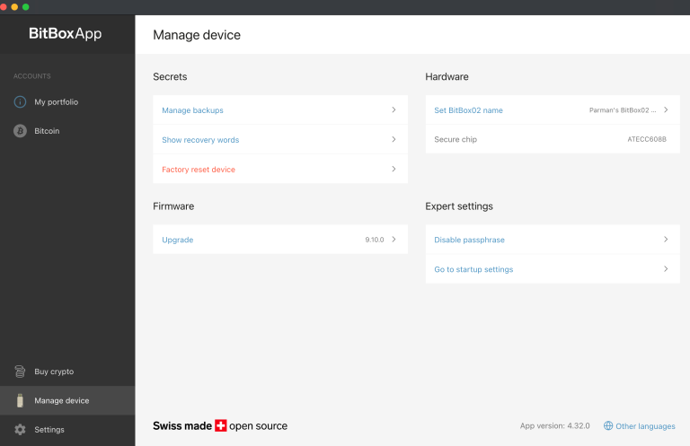
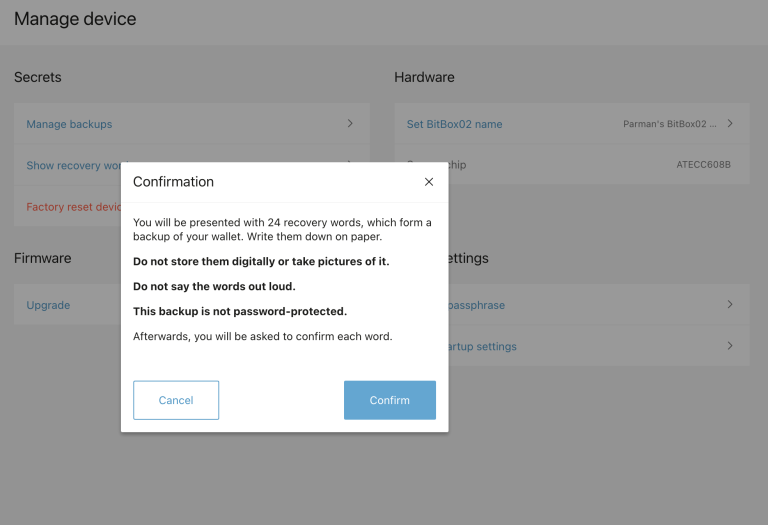
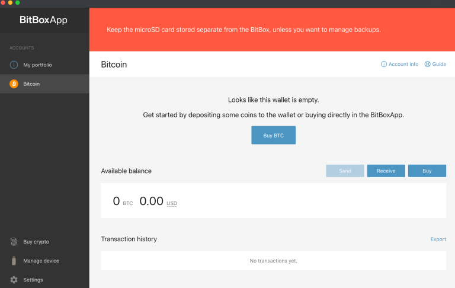
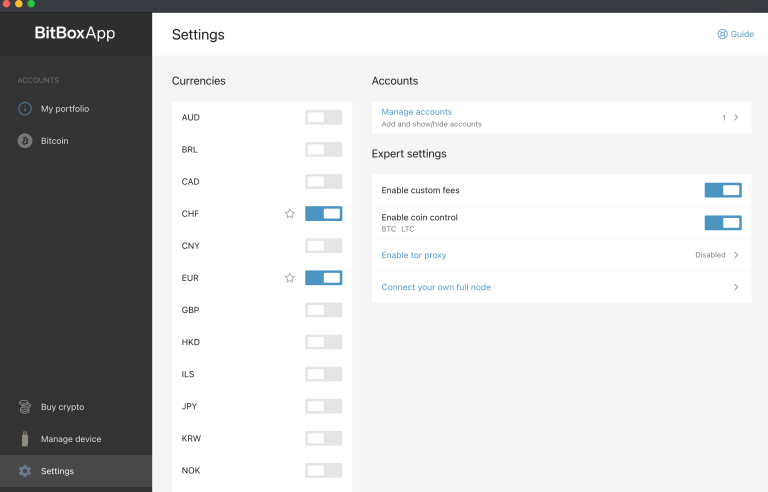
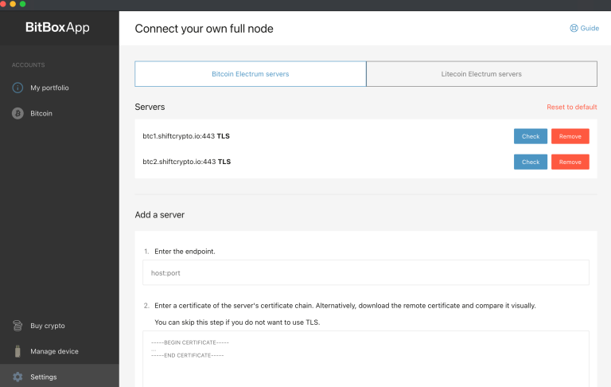
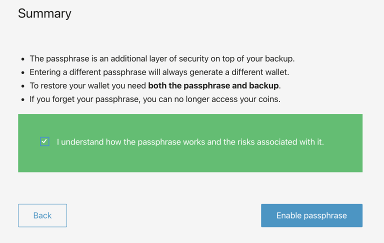

El BitBox02 (https://bitbox.swiss/) es una billetera física fabricada en Suiza diseñada específicamente para asegurar tus Bitcoins. Algunas de sus características clave incluyen una fácil copia de seguridad y restauración utilizando una tarjeta microSD, un diseño minimalista y discreto, y un soporte completo para Bitcoin.

Ofrece una seguridad de vanguardia diseñada por expertos, con un diseño de doble chip que incluye un chip seguro. Su código fuente ha sido completamente auditado por investigadores de seguridad y es completamente de código abierto. El BitBox02 viene con una aplicación BitBoxApp simple pero potente, que proporciona una gestión segura de tus Bitcoins. Admite un nodo completo para Bitcoin y garantiza una comunicación cifrada de extremo a extremo entre la aplicación y el dispositivo. Fabricado en Suiza, el BitBox02 ha ganado una reputación positiva entre sus usuarios.

> Especificaciones
>
> - Conectividad: USB-C
> - Compatibilidad: Windows 7 y versiones posteriores, macOS 10.13 y versiones posteriores, Linux, Android
> - Entrada: Sensores táctiles capacitivos
> - Microcontrolador: ATSAMD51J20A; 120 Mhz Cortex-M4F de 32 bits; Generador de números aleatorios verdaderos
> - Chip seguro: ATECC608B; Generador de números aleatorios verdaderos (NIST SP 800-90A/B/C)
> - Pantalla: OLED blanca de 128 x 64 px
> - Material: Policarbonato
> - Tamaño: 54.5 x 25.4 x 9.6 mm incluyendo el conector USB-C
> - Peso: Dispositivo 12g; con embalaje y accesorios 160g

Descarga las hojas de datos en su sitio web https://bitbox.swiss/bitbox02/

## Cómo usar la billetera de hardware BitBox02

### Configuración del BitBox02

El BitBox02 tiene una conexión USB-C adjunta a la carcasa. Si tu computadora utiliza el puerto USB regular, deberás utilizar el adaptador que viene con el dispositivo.

Conéctalo a tu computadora y el dispositivo se encenderá (no lo hagas aún).

Tiene sensores arriba y abajo, y te pedirá que toques la parte superior o inferior para orientar la pantalla de la forma que desees.

### Descarga la aplicación BitBox02

Visita https://shiftcrypto.ch/ y haz clic en el enlace "App" en la parte superior para acceder a la página de descarga:

Haz clic en el botón azul de Descargar:

Para verificar la descarga (esto agrega complejidad, pero se recomienda, especialmente si almacenas muchos bitcoins), consulta el Apéndice A.

Después de la descarga, puedes descomprimir el archivo. En una Mac, simplemente haz doble clic en el archivo descargado y aparecerá un icono de BitBox App en tu directorio de descargas. Puedes arrastrarlo a tu escritorio (o a cualquier lugar) para acceder fácilmente.

Haz doble clic en la aplicación para ejecutarla (no se "instala").

En Mac, tu computadora te mostrará una advertencia. Simplemente ignórala y haz clic en "Abrir":

Luego verás esto:

Continúa y conecta el dispositivo a la computadora.
A continuación se muestra el texto traducido al español:

'Te mostrará un código de emparejamiento. Verifica que coincidan y luego toca el sensor para seleccionar la marca de verificación. Luego regresa a la pantalla, el botón de continuar estará disponible para ti.

Luego tendrás la opción de crear una nueva semilla o restaurar una semilla. Voy a demostrar cómo crear una nueva semilla (también es importante restaurar la semilla que creaste para probar la calidad de tu respaldo antes de cargar cualquier bitcoin en la billetera).

El dispositivo viene con una tarjeta microSD. Adelante, insértala si no lo has hecho.

Nombra tu dispositivo y haz clic en continuar, luego confirma en el dispositivo.

Luego se te pedirá que establezcas una contraseña para el dispositivo. Esto no forma parte de tu semilla. Tampoco es una frase de contraseña (eso forma parte de tu semilla). Es simplemente una contraseña para bloquear el dispositivo. Cuando enciendas el dispositivo, se te pedirá que ingreses esta contraseña cada vez. Tienes permitidos 10 intentos fallidos consecutivos antes de que el dispositivo se borre de toda la memoria, así que ten cuidado. La animación en la pantalla te enseñará cómo usar los controles del dispositivo para establecer la contraseña.

Lee la siguiente pantalla y marca cada casilla, luego continúa.

Y así es como se ve la billetera una vez que está lista para usar.

### ¡¡NO TAN RÁPIDO!!

Es bastante extraño, pero el BitBox02 nos está diciendo que estamos listos para usar el dispositivo, ¡pero no nos ha pedido que anotemos las palabras de la semilla! El ÚNICO respaldo que tenemos es el archivo guardado en la tarjeta microSD. Esto es insuficiente. Estos dispositivos de almacenamiento no duran para siempre (debido a la "descomposición de bits"). Necesitamos un respaldo en papel y duplicados, guardados en cajas fuertes (como se explica en la guía general sobre cómo usar billeteras de hardware).

Para obtener nuestra frase de la semilla y anotarla, ve a la pestaña "administrar dispositivo" a la izquierda y luego haz clic en "mostrar palabras de recuperación".

Luego puedes pasar por la confirmación y el dispositivo te mostrará las palabras. Escríbelas de manera ordenada y nunca dejes que nadie vea las palabras.

Después de eso, puedes hacer clic en la pestaña de Bitcoin a la izquierda para obtener tus direcciones de recepción.

Muestra una dirección a la vez, pero al menos te permite elegir qué dirección usar de las primeras 20:

Al hacer clic en el botón azul se mostrará la dirección completa y se te pedirá que verifiques que la dirección coincida con la que se muestra en la pantalla. Esta es una buena práctica para confirmar que ningún malware en tu computadora te esté engañando para enviar bitcoin a la dirección de un atacante.

Para enviar bitcoin a esta billetera, puedes copiar la dirección y pegarla en la página de retiro del exchange donde se encuentren tus monedas. Te recomiendo que envíes primero una pequeña cantidad de prueba y luego practiques gastándola ya sea de regreso al exchange o a la segunda dirección de tu billetera.

Para cantidades más grandes, te sugiero que crees una frase de contraseña (ver más abajo). La billetera original (sin frase de contraseña) se puede utilizar como tu billetera señuelo (deberá tener una cantidad razonable allí para que sea creíble como señuelo).

### Conéctate a un nodo'

El BitBox02 se conectará automáticamente a un nodo. Veamos a dónde se está conectando. Haz clic en la pestaña de configuración a la izquierda y luego en "conectar tu propio nodo completo".

Y aquí podemos ver que se está conectando al nodo de shiftcrypto. No es ideal. Les hemos traicionado todas nuestras direcciones de bitcoin y nuestra dirección IP (no la semilla, por supuesto; ellos pueden ver nuestras direcciones/saldos, pero no pueden gastarlos). Podemos ingresar los detalles de nuestro propio nodo en esta página (más allá del alcance de esta guía en particular), o podemos usar un software mejor como Sparrow Bitcoin Wallet, Electrum Desktop Wallet o Specter Desktop. Más adelante en la guía, demostraré Sparrow Bitcoin Wallet.

Agregar una frase de contraseña

Ahora que hemos configurado el dispositivo con la aplicación BitBox02 (y hemos revelado nuestras direcciones, lo cual es inevitable con esta billetera de hardware en particular), podemos agregar una frase de contraseña a nuestra frase de semilla. Esto nos permitirá crear una nueva billetera utilizando la misma semilla, y ShiftCrypto nunca verá nuestras nuevas direcciones. Conectaremos esta billetera solo a nuestro propio software.

### Habilitar frase de contraseña

Ahora ve y "habilita" la función de frase de contraseña (pero aún no establecemos una frase de contraseña). Ve a la pestaña "administrar dispositivo" y haz clic en "habilitar frase de contraseña" (círculo rojo a continuación).

Lee los pasos detenidamente...

Ahora desconecta el dispositivo y cierra la aplicación BitBox02.

FIN de la sección de bitbox02 por Parman.

Tu dispositivo ahora está completamente operativo para ser utilizado en cualquier solución de escritorio como Specter, Sparrow y utilizando la interfaz de BitBox.
