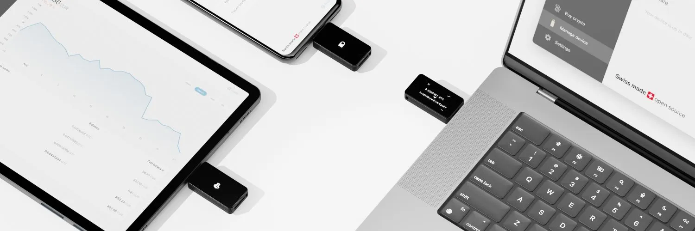

BitBox02 (https://bitbox.swiss/) on Šveitsis valmistatud füüsiline rahakott, mis on spetsiaalselt ette nähtud teie Bitcoinide turvamiseks. Mõned selle peamised omadused hõlmavad lihtsat varundamist ja taastamist microSD-kaardi abil, minimalistlikku ja diskreetset disaini ning laiaulatuslikku tuge Bitcoinile.

See pakub tipptasemel turvalisust, mille on välja töötanud eksperdid, sisaldades topeltkiibi disaini, mis hõlmab turvakiipi. Selle lähtekood on täielikult auditeeritud turvaekspertide poolt ja on täiesti avatud lähtekoodiga. BitBox02-ga on kaasas lihtne, kuid võimas BitBoxApp, mis tagab teie Bitcoinide turvalise haldamise. See toetab täisnoodi Bitcoinile ja tagab rakenduse ning seadme vahelise lõpuni krüpteeritud suhtluse. Šveitsis valmistatud BitBox02 on kasutajate seas saavutanud positiivse maine.

> Tehnilised andmed
>
> - Ühenduvus: USB-C
> - Ühilduvus: Windows 7 ja hilisemad, macOS 10.13 ja hilisemad, Linux, Android
> - Sisend: Mahtuvuslikud puuteandurid
> - Mikrokontroller: ATSAMD51J20A; 120 MHz 32-bitine Cortex-M4F; Tõeline juhuslike numbrite generaator
> - Turvakiip: ATECC608B; Tõeline juhuslike numbrite generaator (NIST SP 800-90A/B/C)
> - Ekraan: 128 x 64 px valge OLED
> - Materjal: Polükarbonaat
> - Suurus: 54,5 x 25,4 x 9,6 mm, kaasa arvatud USB-C pistik
> - Kaal: Seade 12g; pakendiga ja lisatarvikutega 160g

Laadige alla andmelehed nende veebisaidilt https://bitbox.swiss/bitbox02/

## Kuidas kasutada BitBox02 riistvara rahakotti

### BitBox02 seadistamine

BitBox02-l on korpuse külge kinnitatud USB-C ühendus. Kui teie arvutil on tavaline USB port, peate kasutama seadmega kaasas olevat adapterit.

Ühendage see oma arvutiga ja seade lülitub sisse (ärge tehke seda veel).

Sellel on andurid ülal ja all ning see palub teil puudutada ülemist või alumist osa, et ekraani soovitud suunas orienteerida.

### Laadige alla BitBox02 rakendus

Külastage https://shiftcrypto.ch/ ja klõpsake ülaosas lingil „App“, et jõuda allalaadimislehele:

Klõpsake sinist Laadi alla nuppu:

Allalaadimise kontrollimiseks (see lisab keerukust, kuid on soovitatav, eriti kui hoiate palju bitcoine), vaadake Lisa A.

Pärast allalaadimist saate faili lahti pakkida. Macis topeltklõpsake lihtsalt allalaaditud failil ja teie allalaadimiskaustas ilmub BitBox App ikoon. Saate selle lohistada oma töölauale (või kuhu iganes) lihtsaks juurdepääsuks.

Topeltklõpsake rakendusel, et seda käivitada (see ei „installeeru“).

Macis annab teie arvuti hoidja teile hoiatuse. Lihtsalt ignoreerige seda ja klõpsake „ava“:

Seejärel näete seda:

Jätkake ja ühendage seade arvutiga.

See näitab teile sidumiskoodi. Kontrollige, kas need kattuvad, ja seejärel puudutage andurit, et valida linnuke. Seejärel tagasi ekraanile, jätkamise nupp muutub teile kättesaadavaks.

Teil on seejärel võimalus luua uus seeme või taastada olemasolev seeme. Ma demonstreerin uue seemne loomist (on oluline ka loodud seemet testida, taastades selle, et kontrollida oma varukoopia kvaliteeti, enne kui laete rahakotti mingeid bitcoine).

Seadmega tuli kaasa microSD kaart. Asetage see sisse, kui te pole seda veel teinud.

Pange oma seadmele nimi ja klõpsake jätkamiseks, seejärel kinnitage seadmes.

Seejärel palutakse teil seadmele parool määrata. See ei ole osa teie seemnest. See ei ole ka paroolilause (see on osa teie seemnest). See on lihtsalt parool seadme lukustamiseks. Seadme sisselülitamisel palutakse teil seda parooli iga kord sisestada. Teil on lubatud 10 järjestikust ebaõnnestumist enne, kui seade kustutab endast kõik mälud, nii et olge ettevaatlik. Ekraanil olev animatsioon õpetab teile, kuidas seadme juhtelemente kasutades parooli seada.

Lugege järgmine ekraan läbi ja märkige kõik kastid, seejärel jätkake.

Ja nii näeb rahakott välja, kui see on kasutusvalmis.

### MITTE NII KIIRE!!

See on üsna kummaline, aga BitBox02 teatab meile, et seade on kasutusvalmis, kuid see pole meid palunud seemnesõnu üles kirjutada! AINUS varukoopia, mis meil on, on microSD kaardile salvestatud fail. See ei ole piisav. Need salvestusseadmed ei kesta igavesti (seoses "biti mädanemisega"). Meil on vaja paberil varukoopiat ja duplikaate, mis tuleks hoida seifides (nagu selgitatud üldises juhendis riistvararahakottide kasutamise kohta).

Et saada oma seemnefraas ja see üles kirjutada, minge vasakul asuvasse vahekaarti "manage device" ja seejärel klõpsake "show recover words".

Seejärel saate kinnituse läbi teha ja seade esitab teile sõnad. Kirjutage need korralikult üles ja ärge laske kellelgi neid sõnu näha.

Pärast seda saate vasakul asuvalt Bitcoin vahekaardilt oma vastuvõtu aadressid.

See näitab korraga ühte, kuid vähemalt võimaldab teil valida, millist aadressi esimesest 20-st kasutada:

Sinist nuppu klõpsates kuvatakse täielik aadress ja teilt palutakse kontrollida, kas aadress kattub ekraanil kuvatavaga. See on hea tava kinnitamaks, et teie arvutis olev pahavara ei peta teid saatma bitcoine ründaja aadressile.

Bitcoine sellesse rahakotti saatmiseks saate aadressi kopeerida ja kleepida vahetuse väljamakselehele, kus teie mündid asuvad. Soovitan saata esmalt väikese testsumma, seejärel harjutada selle kulutamist kas tagasi vahetusse või oma rahakoti teisele aadressile.

Suuremate summade puhul soovitan luua paroolilause (vt allpool). Algset rahakotti (ilma paroolilausega) saab kasutada teie petterahakotina (selles peab olema mõistlik summa, et see oleks usutav petterahakott).

### Ühendu sõlmega

BitBox02 ühendub automaatselt sõlmega. Vaatame, kuhu see ühendub. Klõpsake vasakul asuval seadete vahekaardil ja seejärel "connect your own full node".

Ja siin me näeme, et see ühendub shiftcrypto sõlmega. Pole just parim. Oleme reetnud kõik oma bitcoinide aadressid neile ja ka oma IP aadressi (muidugi mitte seemet; nad näevad meie aadresse/saldoesid, kuid ei saa neid kulutada). Sellel lehel saame sisestada oma sõlme andmed (mis on väljaspool selle konkreetse juhendi ulatust) või me võime kasutada paremat tarkvara nagu Sparrow Bitcoin Wallet, Electrum Desktop Wallet või Specter Desktop. Ma demonstreerin Sparrow Bitcoin Wallet'i hiljem juhendis.

Lisa paroolilause

Nüüd, kui oleme seadistanud seadme BitBox02 rakendusega (ja paljastanud meie aadressid, mis on selle konkreetse riistvara rahakoti puhul vältimatu), saame lisada paroolilause meie seemnefraasile. See võimaldab meil luua uue rahakoti kasutades sama seemet ja ShiftCrypto ei näe meie uusi aadresse. Me ühendame selle rahakoti ainult oma tarkvaraga.

### Luba Paroolilause

Mine nüüd edasi ja "luba" paroolilause funktsioon (aga me ei sea veel paroolilauset). Mine "manage device" vahekaardile ja klõpsa "enable passphrase" peal (allpool punane ring).

Loe läbi sammud...

Nüüd ühenda seade lahti ja sulge BitBox02 rakendus

Bitbox02 jaotise lõpp Parmani poolt.

Sinu seade on nüüd täielikult valmis kasutamiseks igal lauaarvuti lahendusel nagu specter, sparrow ja kasutades bitbox liidest.