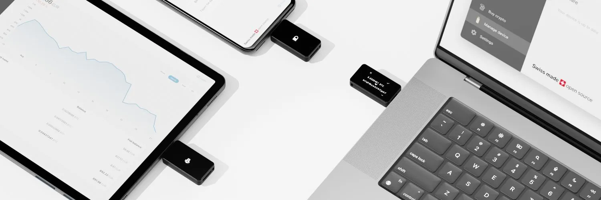

BitBox02 (https://bitbox.swiss/) adalah dompet fisik buatan Swiss yang dirancang khusus untuk mengamankan Bitcoin kamu. Beberapa fitur utamanya mencakup cadangan dan pemulihan yang mudah menggunakan kartu microSD, desain minimalis dan diskrit, serta dukungan yang komprehensif untuk Bitcoin.

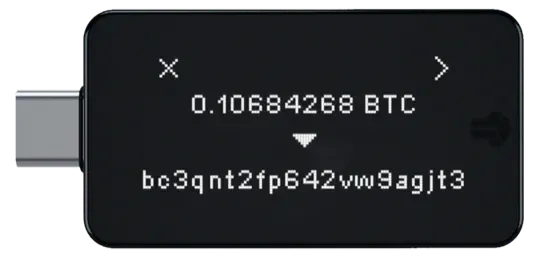

Dompet ini menawarkan keamanan terdepan yang dirancang oleh para ahli, dengan desain chip ganda yang mencakup secure element. Kode sumbernya telah diaudit sepenuhnya oleh para peneliti keamanan dan bersifat open-source sepenuhnya. BitBox02 dilengkapi dengan BitBoxApp yang sederhana namun andal, yang menyediakan manajemen Bitcoin yang aman. Dompet ini mendukung node penuh Bitcoin dan memastikan komunikasi terenkripsi dari ujung ke ujung antara aplikasi dan perangkat. Diproduksi di Swiss, BitBox02 telah membangun reputasi yang sangat baik di kalangan penggunanya.

> Spesifikasi
>
> - Konektivitas: USB-C
> - Kompatibilitas: Windows 7 dan lebih baru, macOS 10.13 dan lebih baru, Linux, Android
> - Input: Sensor sentuh kapasitif
> - Mikrokontroler: ATSAMD51J20A; 120 Mhz 32-bit Cortex-M4F; Generator nomor acak sejati
> - Chip aman: ATECC608B; Generator nomor acak sejati (NIST SP 800-90A/B/C)
> - Tampilan: OLED putih 128 x 64 px
> - Material: Polikarbonat
> - Ukuran: 54.5 x 25.4 x 9.6 mm termasuk colokan USB-C
> - Berat: Perangkat 12g; dengan kemasan dan aksesori 160g

Unduh lembar data di situs web mereka https://bitbox.swiss/bitbox02/

## Cara Menggunakan Dompet Perangkat Keras BitBox02

### Mengatur BitBox02

BitBox02 memiliki koneksi USB-C yang terpasang langsung pada casing. Jika komputer kamu menggunakan port USB standar, kamu perlu menggunakan adaptor yang disertakan bersama perangkat.

Sambungkan ke komputer kamu dan perangkat akan menyala (jangan lakukan ini sekarang).

Perangkat ini memiliki sensor di bagian atas dan bawah, dan akan meminta kamu untuk menyentuh bagian atas atau bawah guna mengatur orientasi layar sesuai keinginanmu.

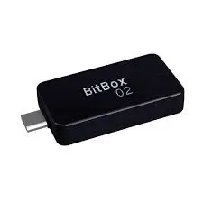

### Unduh Aplikasi BitBox02

Kunjungi https://shiftcrypto.ch/ dan klik pada tautan "App" di bagian atas untuk menuju ke halaman unduhan:

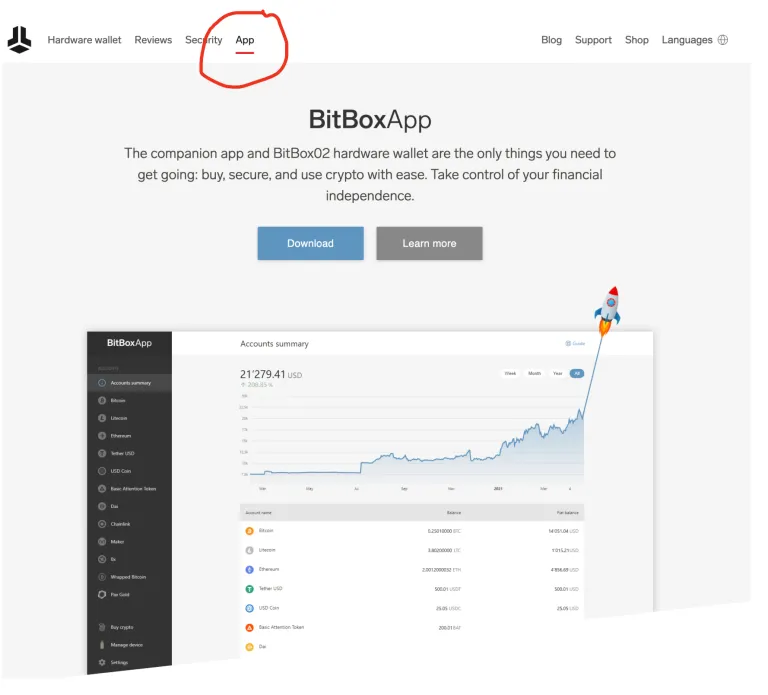

Klik tombol Unduh biru:

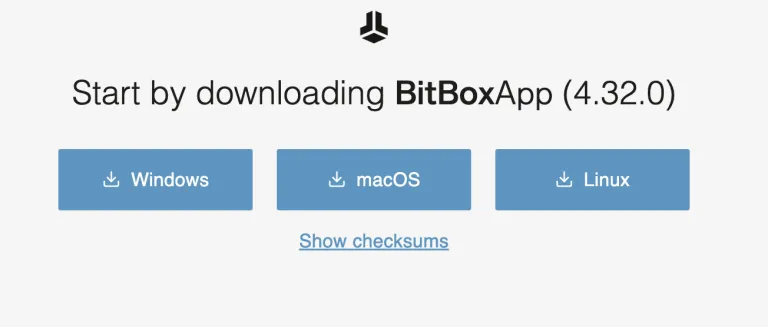

Untuk memverifikasi unduhan (ini menambah sedikit kompleksitas, tetapi sangat disarankan, terutama jika kamu menyimpan banyak bitcoin), lihat Lampiran A.

Setelah unduhan selesai, kamu dapat mengekstrak file tersebut. Di Mac, cukup klik ganda file yang diunduh, dan ikon Aplikasi BitBox akan muncul di direktori unduhan kamu. Kamu dapat menyeretnya ke desktop (atau ke lokasi lain) agar mudah diakses.

Klik ganda aplikasi untuk menjalankannya (tidak perlu melakukan proses "instal").

Di Mac, sistem keamanan komputer kamu akan menampilkan peringatan. Abaikan saja dan klik "buka":

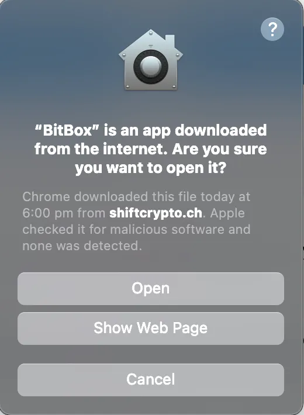

Kemudian kamu akan melihat ini:

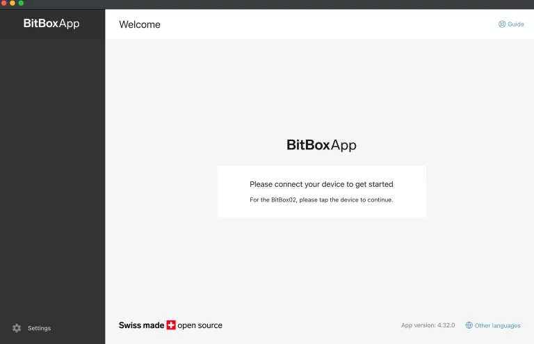

Lanjutkan dan sambungkan perangkat ke komputer.

Perangkat akan menampilkan kode pasangan. Pastikan kodenya cocok, lalu sentuh sensor untuk memilih tanda centang. Setelah itu, kembali ke layar dan tombol lanjutkan akan tersedia untuk kamu.

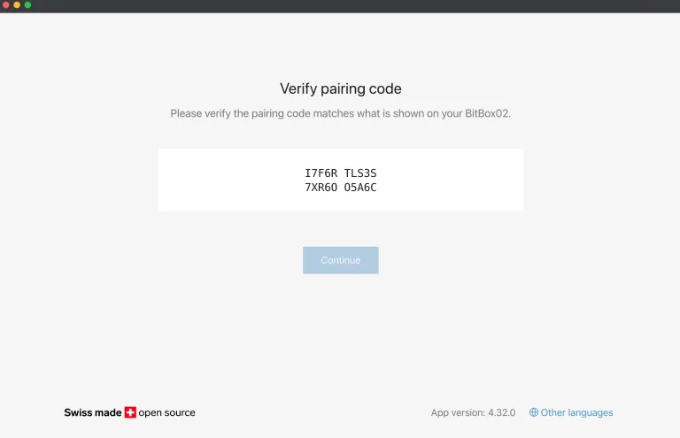
Kamu kemudian akan memiliki opsi untuk membuat seed baru atau memulihkan seed yang sudah ada. Aku akan menunjukkan cara membuat seed baru (penting juga untuk memulihkan seed yang kamu buat guna menguji kualitas cadangan kamu, sebelum kamu memuat bitcoin apa pun ke dalam dompet).

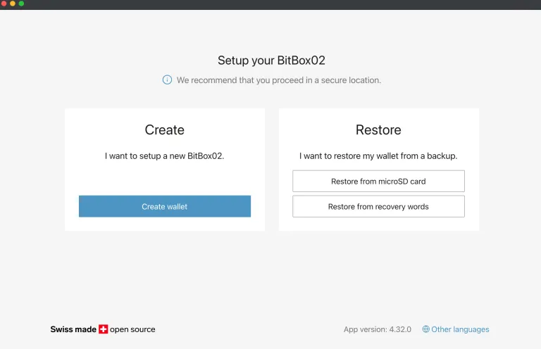

Perangkat ini dilengkapi dengan kartu microSD. Silakan masukkan jika kamu belum melakukannya.

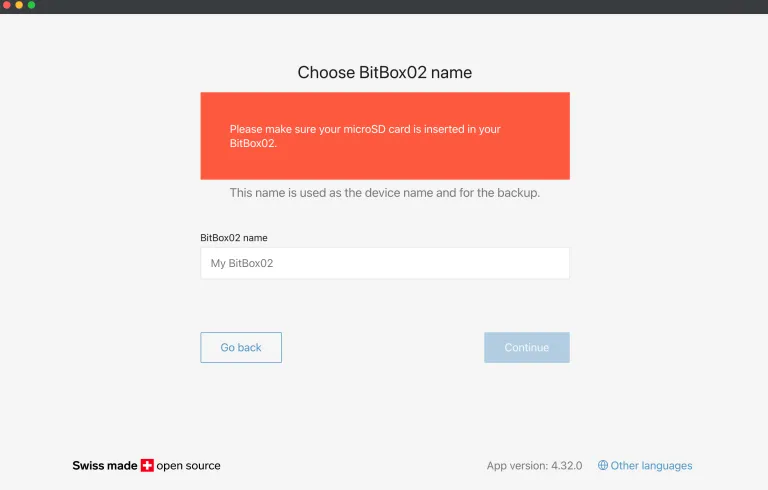

Namai perangkat kamu dan klik lanjutkan, kemudian konfirmasi di perangkat.

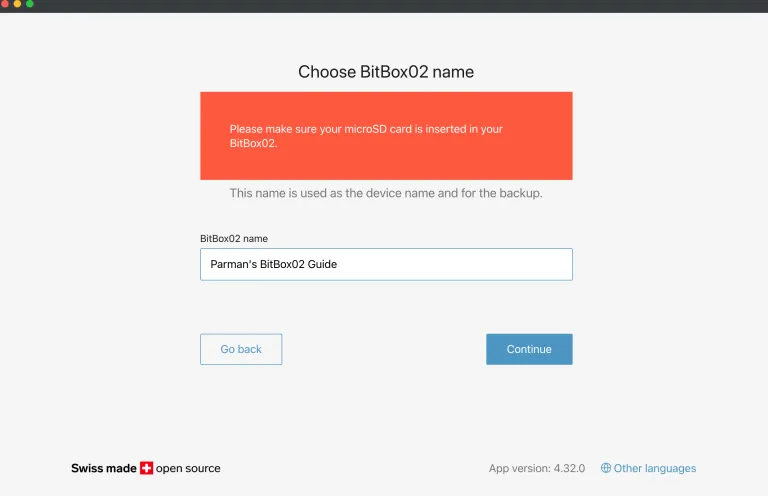

Kamu kemudian akan diminta untuk menetapkan kata sandi untuk perangkat. Ini bukan bagian dari seed kamu. Ini juga bukan passphrase, karena passphrase merupakan bagian dari seed. Ini hanyalah kata sandi untuk mengunci perangkat. Setiap kali kamu menyalakan perangkat, kamu akan diminta untuk memasukkan kata sandi ini. Tersedia 10 kali kegagalan berturut-turut sebelum perangkat akan menghapus seluruh memorinya, jadi lakukan dengan hati-hati. Animasi di layar akan memandu kamu tentang cara menggunakan kontrol perangkat untuk menetapkan kata sandi.

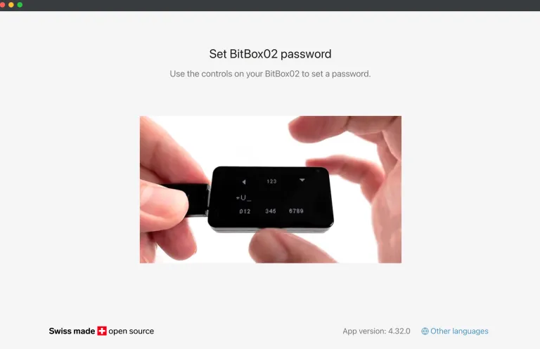

Baca layar berikutnya, dan centang setiap kotak, lalu lanjutkan.

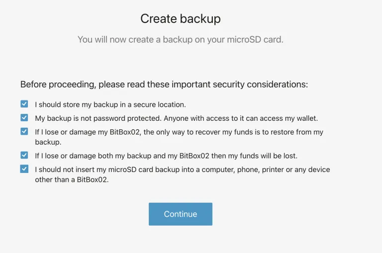
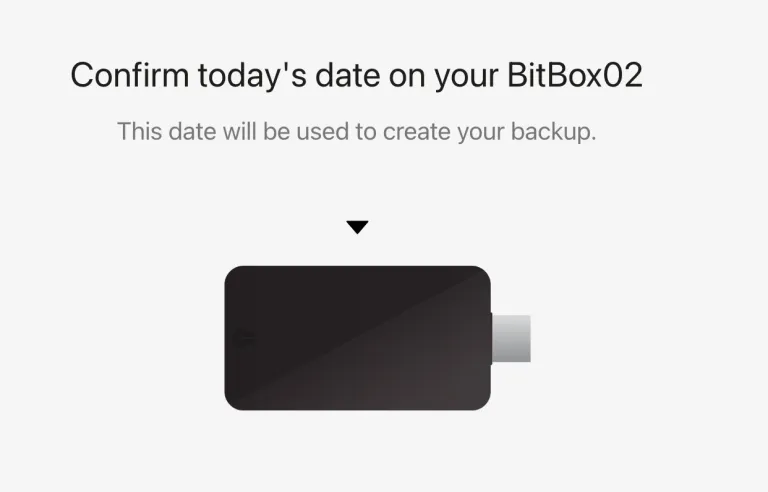
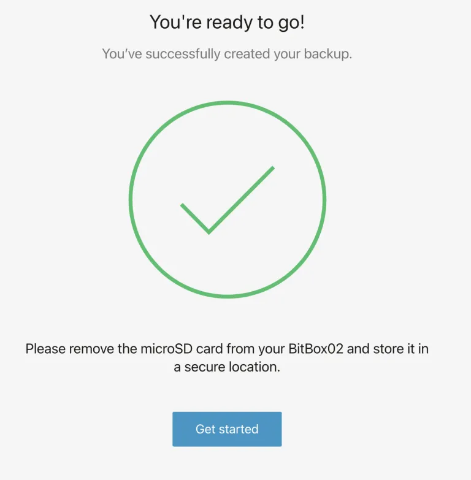

Dan inilah tampilan dompet setelah siap digunakan.

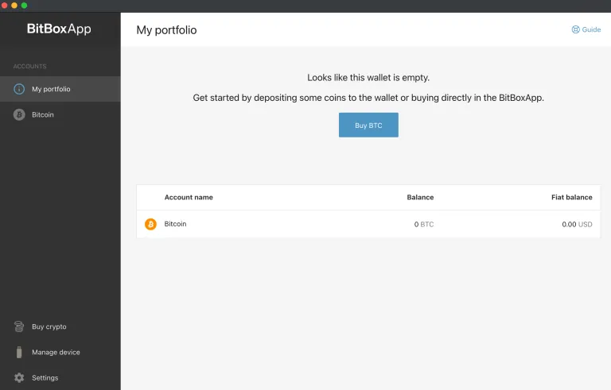

### TUNGGU DULU!!

Agak aneh, tetapi BitBox02 memberi tahu kami bahwa perangkat sudah siap digunakan tanpa meminta kami untuk menuliskan seedphrase. SATU-SATUNYA cadangan yang kami miliki adalah file yang disimpan di kartu microSD. Ini tidak cukup. Media penyimpanan seperti ini tidak bertahan selamanya karena adanya bit rot. Kami memerlukan cadangan kertas, beserta duplikatnya, yang disimpan di brankas, seperti yang dijelaskan dalam panduan umum penggunaan dompet perangkat keras.

Untuk mendapatkan seedphrase kamu dan menuliskannya, buka tab "manage device" di sisi kiri, lalu klik "show recover

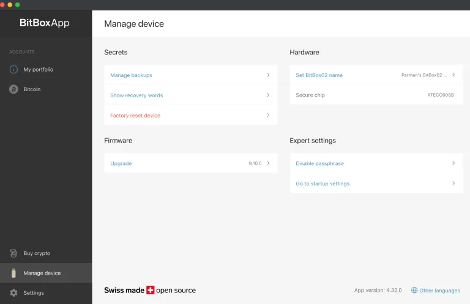

Kemudian kamu dapat melalui konfirmasi, dan perangkat akan menampilkan kata-katanya. Tulislah dengan rapi, dan jangan biarkan siapa pun melihat kata-katanya.

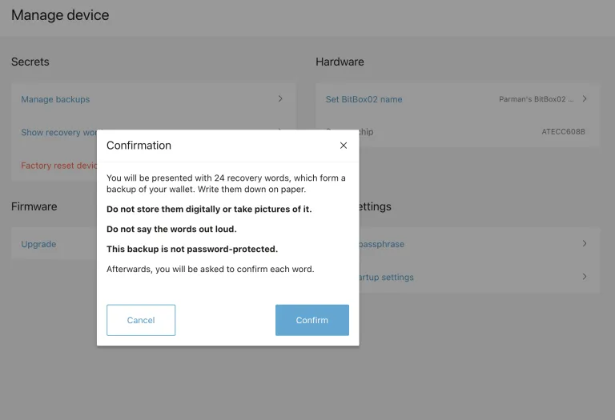

Setelah itu, kamu dapat mengklik tab Bitcoin di sebelah kiri untuk mendapatkan alamat penerimaan.

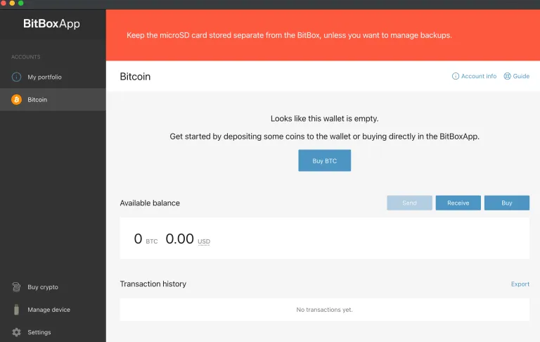

Ini menampilkan satu per satu, tetapi setidaknya memungkinkanmu memilih alamat mana yang akan digunakan dari 20 pertama:

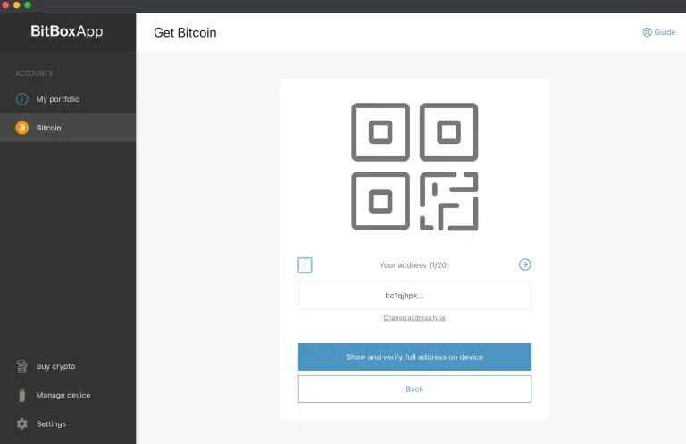

Mengklik tombol biru akan menampilkan alamat lengkap, dan kamu akan diminta untuk memeriksa apakah alamat tersebut cocok dengan yang ditampilkan di layar perangkat. Ini merupakan praktik yang baik untuk memastikan tidak ada malware di komputer kamu yang mencoba menipu dengan mengarahkan pengiriman bitcoin ke alamat milik penyerang.

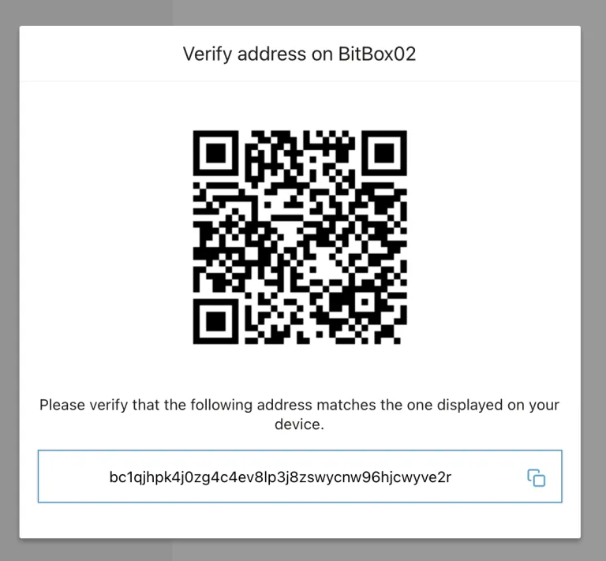

Untuk mengirim bitcoin ke dompet ini, kamu dapat menyalin alamat tersebut dan menempelkannya ke halaman penarikan dari bursa tempat koin kamu berada. Aku menyarankan kamu untuk mengirim jumlah kecil terlebih dahulu, lalu berlatih menghabiskannya kembali ke bursa atau ke alamat kedua di dompet kamu.

Untuk jumlah yang lebih besar, aku menyarankan kamu membuat passphrase (lihat di bawah). Dompet utama tanpa passphrase dapat digunakan sebagai dompet umpan, dan sebaiknya berisi jumlah yang masuk akal agar terlihat sebagai umpan yang meyakinkan.

### Terhubung ke node

BitBox02 akan secara otomatis terhubung ke sebuah node. Mari kita lihat ke mana ia terhubung. Klik pada tab pengaturan di sebelah kiri, lalu "connect your own full node".

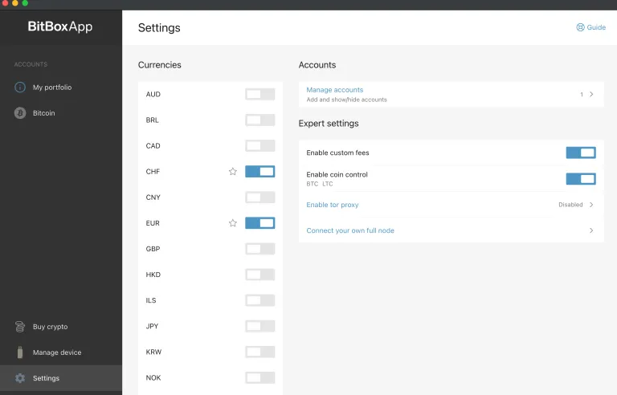
Di sini kita dapat melihat bahwa dompet ini terhubung ke node milik Shift Crypto. Ini kurang ideal. Kita telah membocorkan semua alamat bitcoin kita kepada mereka, termasuk alamat IP kita. Tentu saja bukan seed; mereka dapat melihat alamat dan saldo kita, tetapi tidak dapat menggunakannya. Kita bisa memasukkan detail node milik kita sendiri di halaman ini, meskipun hal tersebut berada di luar cakupan panduan ini, atau kita bisa menggunakan perangkat lunak yang lebih baik seperti Sparrow Bitcoin Wallet, Electrum Desktop Wallet, atau Specter Desktop. Aku akan mendemonstrasikan Sparrow Bitcoin Wallet nanti dalam panduan ini.

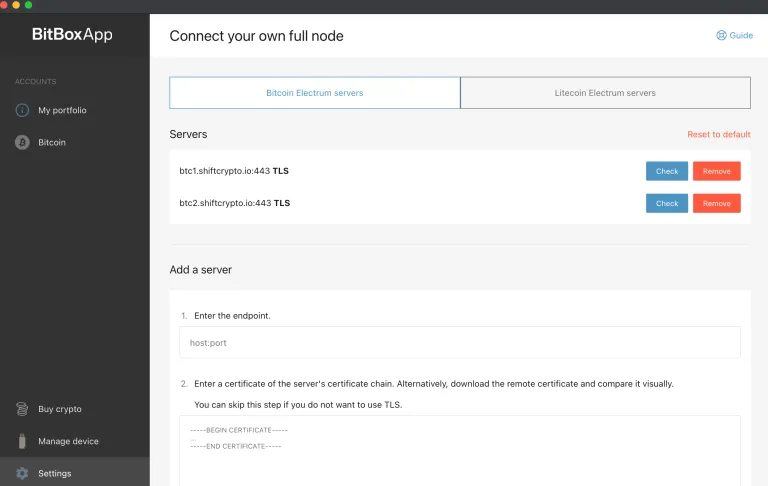

Tambahkan passphrase

Sekarang setelah kita mengatur perangkat dengan Aplikasi BitBox02 dan mengungkapkan alamat kita, yang memang tidak dapat dihindari dengan dompet perangkat keras khusus ini, kita dapat menambahkan passphrase ke seedphrase kita. Ini memungkinkan kita membuat dompet baru menggunakan seed yang sama, dan Shift Crypto tidak akan pernah melihat alamat baru kita. Dompet ini hanya akan kita hubungkan ke perangkat lunak milik kita sendiri.

### Aktifkan Passphrase

Lanjutkan sekarang dan "aktifkan" fitur passphrase (tetapi kita belum menyetel passphrase). Pergi ke tab "manage device", dan klik pada "enable passphrase" (lingkaran merah di bawah).

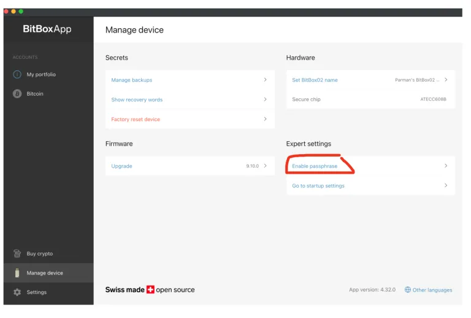

Baca melalui langkah-langkahnya...

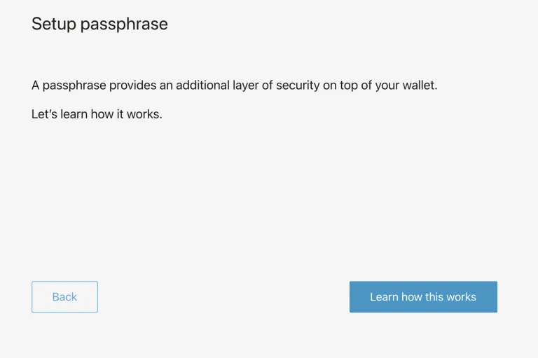
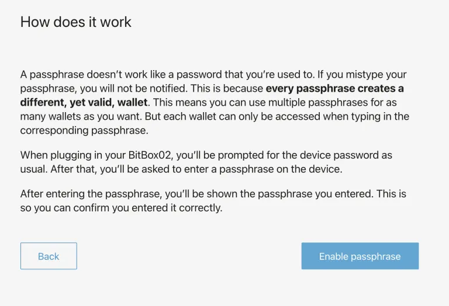
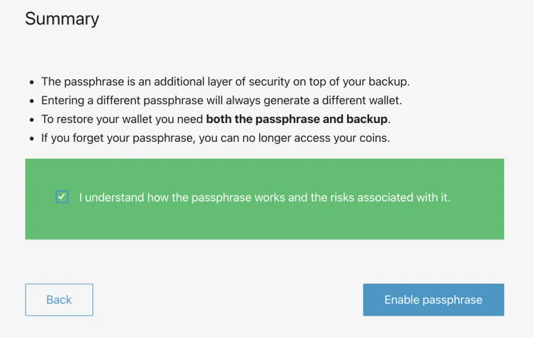

Sekarang lepaskan perangkat, lalu tutup Aplikasi BitBox02.

AKHIR dari bagian BitBox02 oleh Parman.

Perangkat kamu sekarang sepenuhnya siap digunakan dengan berbagai solusi desktop seperti Specter, Sparrow, maupun menggunakan antarmuka BitBox.
