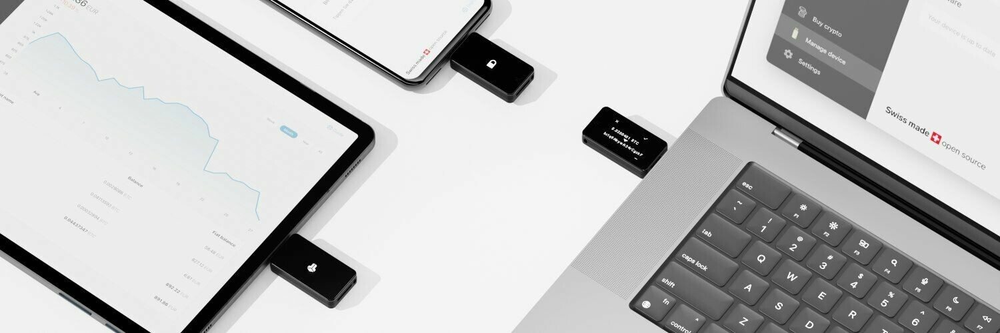

BitBox02 (https://bitbox.swiss/) は、ビットコインを安全に保管するために特別に設計されたスイス製の物理ウォレットです。主な特徴には、マイクロSDカードを使用した簡単なバックアップと復元、ミニマリストで目立たないデザイン、そしてビットコインに対する包括的なサポートが含まれます。

専門家によって設計された最先端のセキュリティを提供し、セキュアチップを含むデュアルチップ設計が特徴です。そのソースコードはセキュリティ研究者によって完全に監査され、完全にオープンソースです。BitBox02には、ビットコインの安全な管理を提供するシンプルでありながら強力なBitBoxAppが付属しています。ビットコインのフルノードをサポートし、アプリとデバイス間のエンドツーエンドの暗号化通信を保証します。スイス製のBitBox02は、ユーザーから高い評価を得ています。

> 仕様
>
> - 接続性: USB-C
> - 互換性: Windows 7以降、macOS 10.13以降、Linux、Android
> - 入力: 容量性タッチセンサー
> - マイクロコントローラ: ATSAMD51J20A; 120 Mhz 32ビット Cortex-M4F; 真の乱数生成器
> - セキュアチップ: ATECC608B; 真の乱数生成器 (NIST SP 800-90A/B/C)
> - ディスプレイ: 128 x 64 px 白色OLED
> - 素材: ポリカーボネート
> - サイズ: USB-Cプラグを含む54.5 x 25.4 x 9.6 mm
> - 重量: デバイス12g; パッケージとアクセサリーを含む160g

ウェブサイト https://bitbox.swiss/bitbox02/ でデータシートをダウンロードしてください。

## BitBox02 ハードウェアウォレットの使用方法

### BitBox02のセットアップ

BitBox02には、シェルに接続されたUSB-C接続があります。通常のUSBポートを使用するコンピューターの場合は、デバイスに付属のアダプターを使用する必要があります。

それをコンピューターに接続すると、デバイスが電源を入れます（まだ行わないでください）。

上下にセンサーがあり、画面を好みの向きにするために上または下に触れるように促されます。

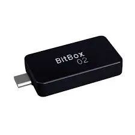

### BitBox02アプリのダウンロード

https://shiftcrypto.ch/ を訪れて、ページ上部の「App」リンクをクリックしてダウンロードページに進みます：

青いダウンロードボタンをクリックします：

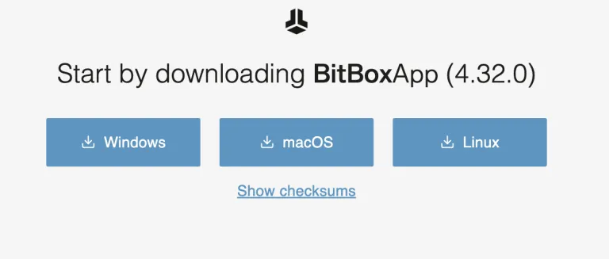

ダウンロードを検証します（複雑さが増しますが、特に多くのビットコインを保管している場合は推奨されます）。詳細は付録Aを参照してください。

ダウンロード後、ファイルを解凍できます。Macでは、ダウンロードしたファイルをダブルクリックするだけで、ダウンロードディレクトリにBitBoxアプリのアイコンが表示されます。アクセスしやすいようにデスクトップ（または任意の場所）にドラッグできます。

アプリをダブルクリックして実行します（「インストール」されません）。

Macでは、コンピューターの保護機能が警告を出します。それを無視して「開く」をクリックします：

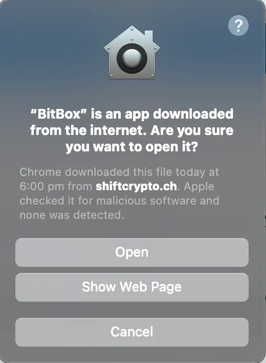

次にこれが表示されます：

デバイスをコンピューターに接続してください。

ペアリングコードが表示されます。それらが一致していることを確認し、チェックマークを選択するためにセンサーに触れてください。その後、画面に戻ると、続行ボタンが利用可能になります。

その後、新しいシードを作成するか、既存のシードを復元するオプションが表示されます。新しいシードの作成をデモンストレーションします（ウォレットにビットコインをロードする前に、バックアップの品質をテストするために作成したシードを復元することも重要です）。
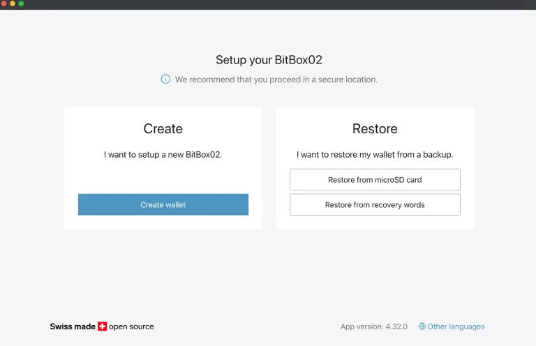

デバイスにはmicroSDカードが付属しています。まだの場合は、挿入してください。

デバイスに名前を付けて「続ける」をクリックし、デバイス上で確認してください。

その後、デバイスのパスワードを設定するよう求められます。これはシードの一部ではありません。パスフレーズでもありません（それはシードの一部です）。これは単にデバイスをロックするためのパスワードです。デバイスを起動すると、このパスワードの入力が毎回求められます。連続して10回失敗すると、デバイスはすべてのメモリを消去するので、注意してください。画面上のアニメーションが、パスワードの設定方法を教えてくれます。
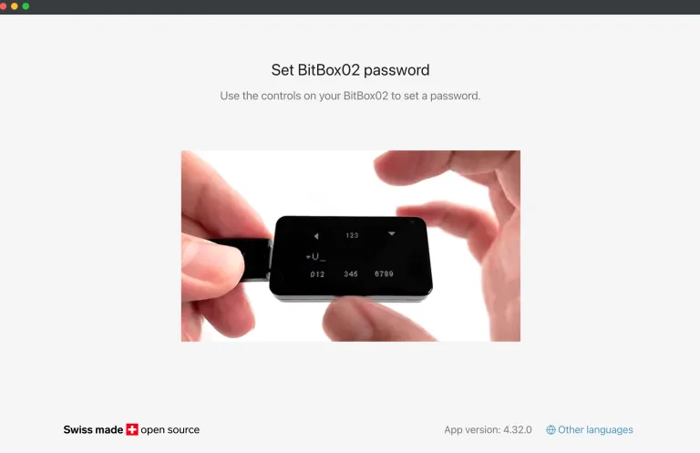

次の画面を読み、各ボックスをチェックしてから続けてください。
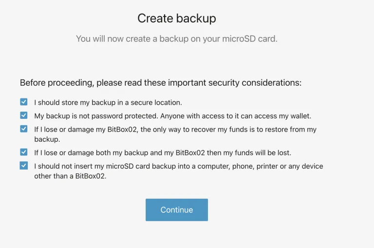

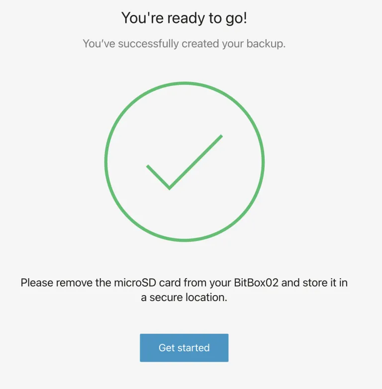

そして、これがウォレットが使用準備が整った際の見た目です。

### ちょっと待って！！

少し奇妙ですが、BitBox02はデバイスの使用準備が整ったと告げていますが、シードワードを書き留めるよう促されていません！唯一のバックアップはmicroSDカードに保存されたファイルです。これは不十分です。これらの記憶装置は永遠に持続するわけではありません（「ビットロット」のため）。紙のバックアップと、セーフに保管された複製が必要です（ハードウェアウォレットの使用方法の一般的なガイドで説明されているように）。

シードフレーズを取得して書き留めるには、左側の「デバイスの管理」タブに移動し、「回復ワードを表示」をクリックします。
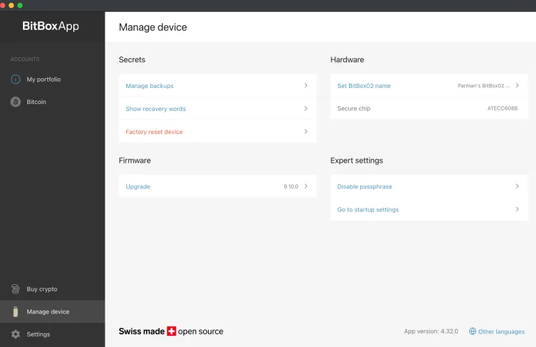

その後、確認を進めると、デバイスがワードを表示します。それらをきちんと書き留め、誰にもそのワードを見せないでください。
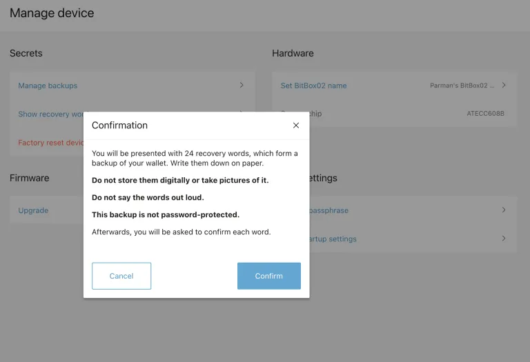

その後、左側のBitcoinタブをクリックして、受信アドレスを取得できます。
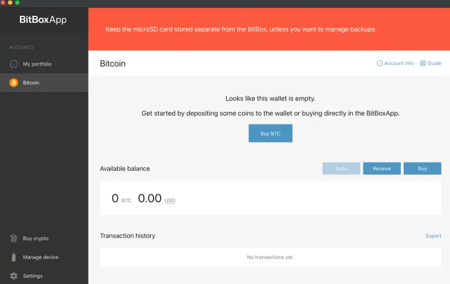

一度に1つしか表示されませんが、最初の20個のアドレスから選択できます。
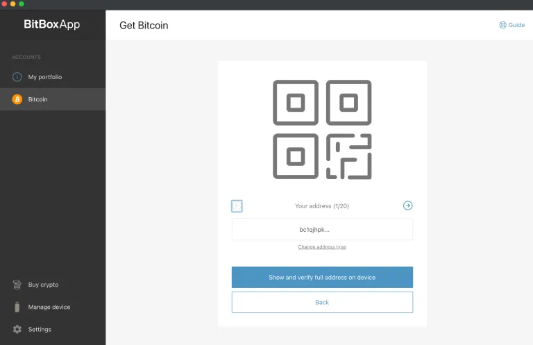

青いボタンをクリックすると、完全なアドレスが表示され、画面の表示とアドレスが一致するか確認するよう促されます。これは、コンピューターのマルウェアが攻撃者のアドレスにビットコインを送信するように騙すことがないように、確認する良い習慣です。
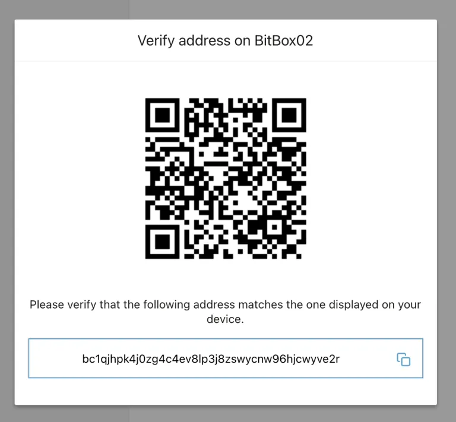

このウォレットにビットコインを送るには、アドレスをコピーして、コインがある取引所の出金ページに貼り付けます。まずは少額を送金してテストし、それを取引所に戻すか、ウォレットの2番目のアドレスに送金する練習をお勧めします。

大きな金額の場合は、パスフレーズの作成をお勧めします（下記参照）。オリジナルのウォレット（パスフレーズなし）は、あなたのデコイウォレットとして使用できます（それが信じられるデコイであるためには、そこに合理的な金額が必要です）。

### ノードに接続する

BitBox02は自動的にノードに接続します。どこに接続しているか見てみましょう。左側の設定タブをクリックし、「独自のフルノードに接続する」を選択します。
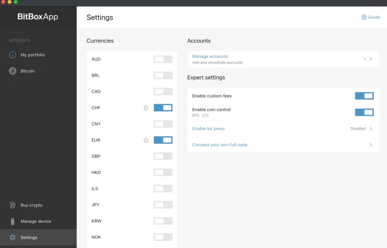
ここでは、shiftcryptoのノードに接続しているのが見えます。あまり良くありません。私たちは、すべてのビットコインアドレスとIPアドレスを彼らに明かしてしまいました（もちろん、シードは除く；彼らは私たちのアドレスや残高を見ることができますが、それらを使うことはできません）。このページで自分のノードの詳細を入力することができます（この特定のガイドの範囲を超えます）、またはSparrow Bitcoin Wallet、Electrum Desktop Wallet、またはSpecter Desktopのようなより良いソフトウェアを使用することができます。後ほどガイドでSparrow Bitcoin Walletのデモンストレーションを行います。
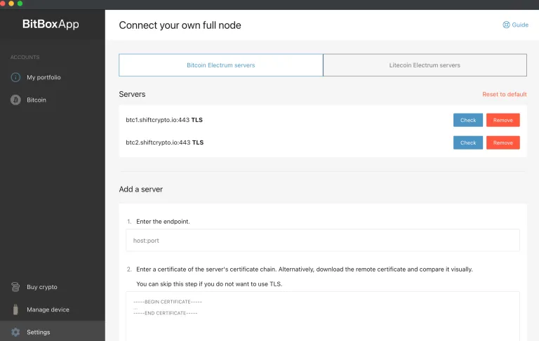

パスフレーズを追加

BitBox02アプリでデバイスを設定し（この特定のハードウェアウォレットでは避けられないことですが、アドレスを公開しました）、シードフレーズにパスフレーズを追加することができます。これにより、同じシードを使用して新しいウォレットを作成し、ShiftCryptoは私たちの新しいアドレスを決して見ることがありません。このウォレットを自分のソフトウェアにのみ接続します。

### パスフレーズを有効にする

さあ、今すぐにパスフレーズ機能を「有効に」しましょう（ただし、まだパスフレーズを設定するわけではありません）。"manage device"タブに進み、"enable passphrase"をクリックしてください（下の赤い円）。

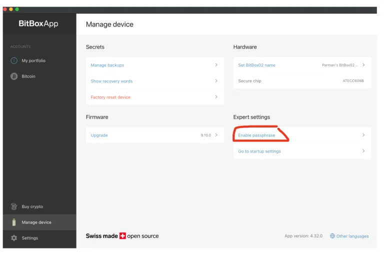

手順を読み進めてください…

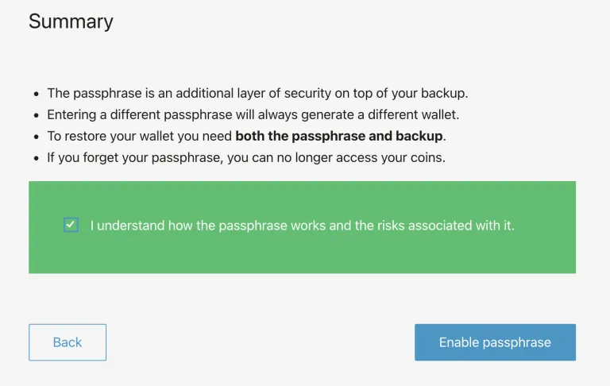

デバイスの接続を切り、BitBox02アプリをシャットダウンしてください

Parmanによるbitbox02セクションの終わり。

あなたのデバイスは、specter、sparrow、bitboxインターフェースを使用する任意のデスクトップソリューションで完全に操作可能です。