O BitBox02 (https://bitbox.swiss/) é uma carteira física fabricada na Suíça, projetada especificamente para proteger seus Bitcoins. Algumas de suas principais características incluem backup e restauração fáceis usando um cartão microSD, design minimalista e discreto e suporte abrangente para Bitcoin.

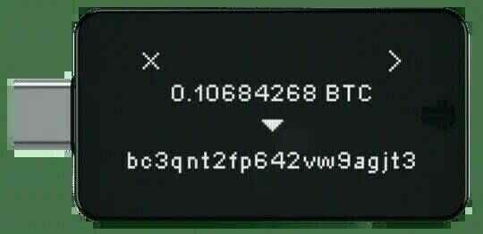

Ele oferece segurança de ponta projetada por especialistas, apresentando um design de chip duplo que inclui um chip seguro. Seu código-fonte foi totalmente auditado por pesquisadores de segurança e é totalmente de código aberto. O BitBox02 vem com um aplicativo BitBoxApp simples, porém poderoso, que oferece gerenciamento seguro de seus Bitcoins. Ele suporta um nó completo para Bitcoin e garante comunicação criptografada de ponta a ponta entre o aplicativo e o dispositivo. Fabricado na Suíça, o BitBox02 conquistou uma reputação positiva entre seus usuários.

> Especificações
>
> - Conectividade: USB-C
> - Compatibilidade: Windows 7 e posterior, macOS 10.13 e posterior, Linux, Android
> - Entrada: Sensores de toque capacitivos
> - Microcontrolador: ATSAMD51J20A; 120 Mhz Cortex-M4F de 32 bits; Gerador de números aleatórios verdadeiros
> - Chip seguro: ATECC608B; Gerador de números aleatórios verdadeiros (NIST SP 800-90A/B/C)
> - Tela: OLED branca de 128 x 64 px
> - Material: Policarbonato
> - Tamanho: 54,5 x 25,4 x 9,6 mm, incluindo o plug USB-C
> - Peso: Dispositivo 12g; com embalagem e acessórios 160g

Baixe as fichas técnicas em seu site https://bitbox.swiss/bitbox02/

## Como usar a carteira de hardware BitBox02

### Configurando o BitBox02

O BitBox02 possui uma conexão USB-C conectada à carcaça. Se o seu computador usa a porta USB regular, você precisará usar o adaptador que vem com o dispositivo.

Conecte-o ao seu computador e o dispositivo será ligado (ainda não faça isso).

Ele possui sensores acima e abaixo, e solicitará que você toque na parte superior ou inferior para orientar a tela da maneira desejada.

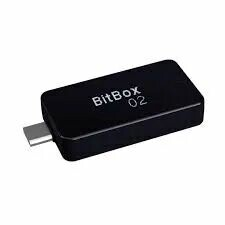

### Baixe o aplicativo BitBox02

Visite https://shiftcrypto.ch/ e clique no link "App" no topo para acessar a página de download:

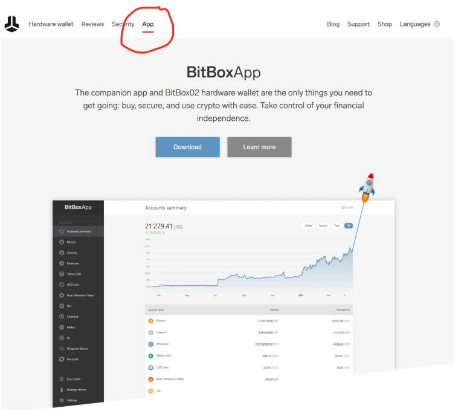

Clique no botão azul "Download":

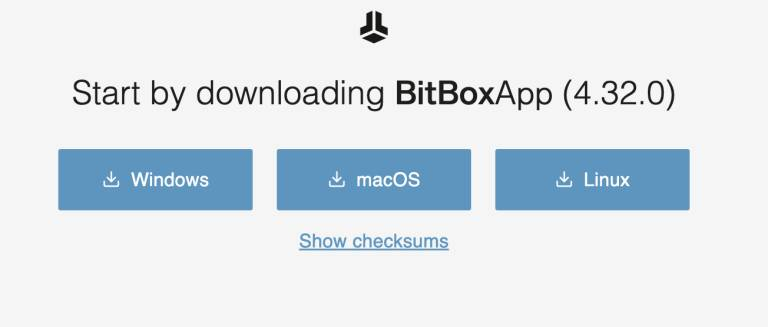

Para verificar o download (isso adiciona complexidade, mas é recomendado, especialmente se você armazena muitos bitcoins), consulte o Apêndice A.

Após o download, você pode descompactar o arquivo. No Mac, basta clicar duas vezes no arquivo baixado e um ícone do BitBox App aparecerá no diretório de downloads. Você pode arrastá-lo para a área de trabalho (ou qualquer outro lugar) para facilitar o acesso.

Clique duas vezes no aplicativo para executá-lo (ele não é "instalado").

No Mac, o sistema de segurança do seu computador exibirá um aviso. Basta ignorá-lo e clicar em "Abrir":

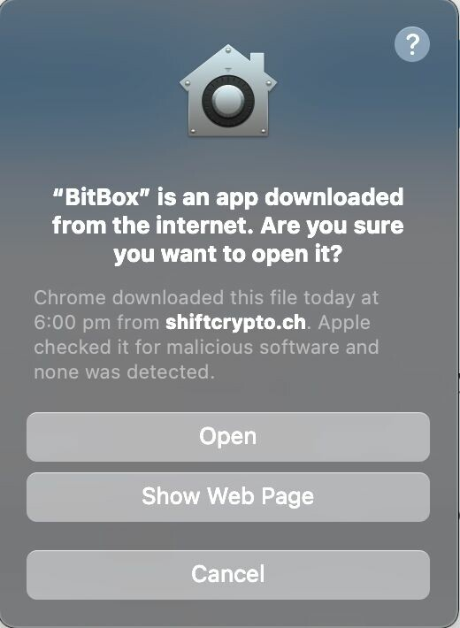

Você verá então isso:

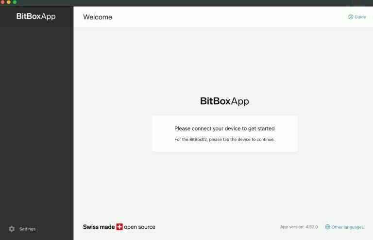

Conecte o dispositivo ao computador.
Ele mostrará um código de emparelhamento. Verifique se eles correspondem e, em seguida, toque no sensor para selecionar a marca de seleção. Em seguida, volte para a tela e o botão continuar estará disponível para você.
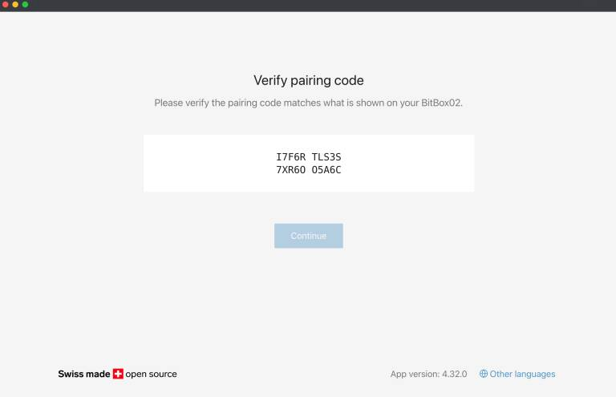

Em seguida, você terá a opção de criar uma nova semente ou restaurar uma semente. Vou demonstrar a criação de uma nova semente (também é importante restaurar a semente que você criou para testar a qualidade do seu backup antes de carregar qualquer bitcoin na carteira).

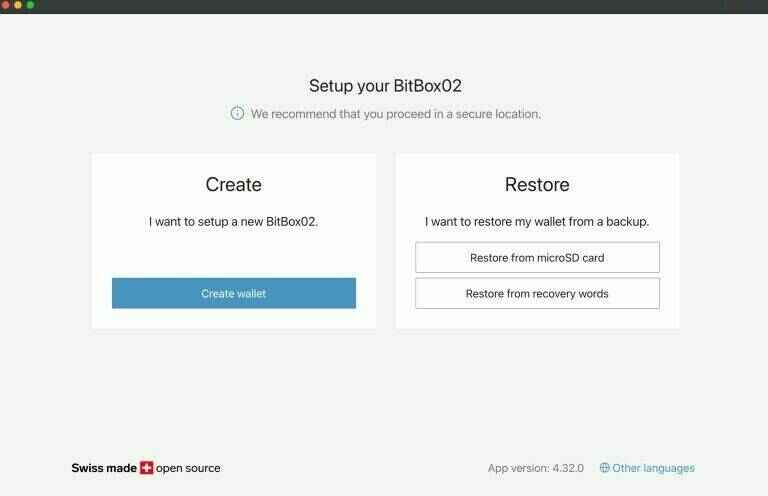

O dispositivo veio com um cartão microSD. Insira-o, se ainda não o fez.

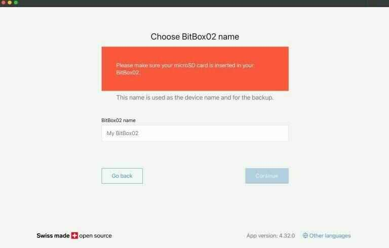

Nomeie seu dispositivo e clique em continuar, depois confirme no dispositivo.

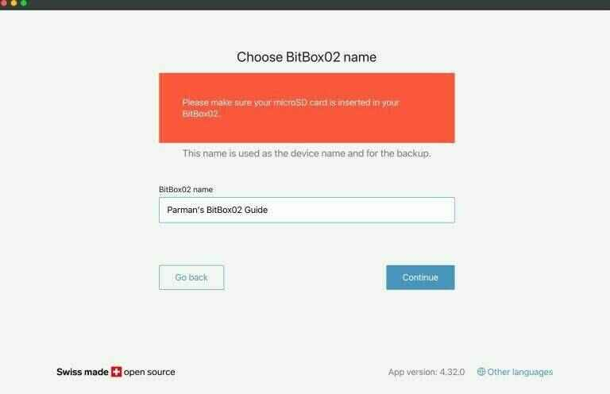

Em seguida, você será solicitado a definir uma senha para o dispositivo. Isso não faz parte da sua semente. Também não é uma frase de acesso (isso faz parte da sua semente). É simplesmente uma senha para bloquear o dispositivo. Quando você ligar o dispositivo, será solicitado que você digite essa senha toda vez. Você tem permissão para 10 falhas consecutivas antes que o dispositivo apague toda a memória, então tenha cuidado. A animação na tela irá ensiná-lo a usar os controles do dispositivo para definir a senha.

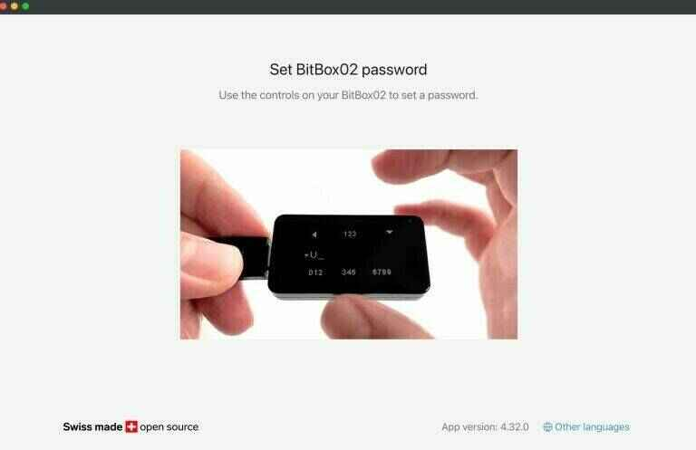

Leia a próxima tela e marque cada caixa, depois continue.

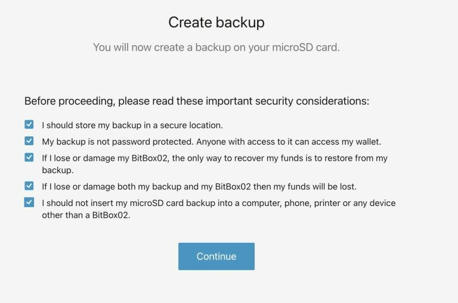
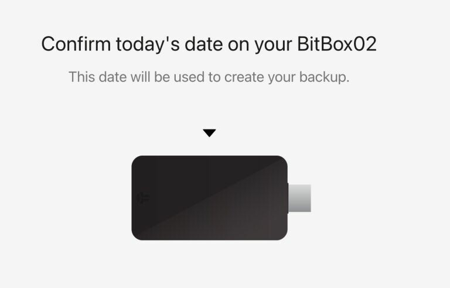
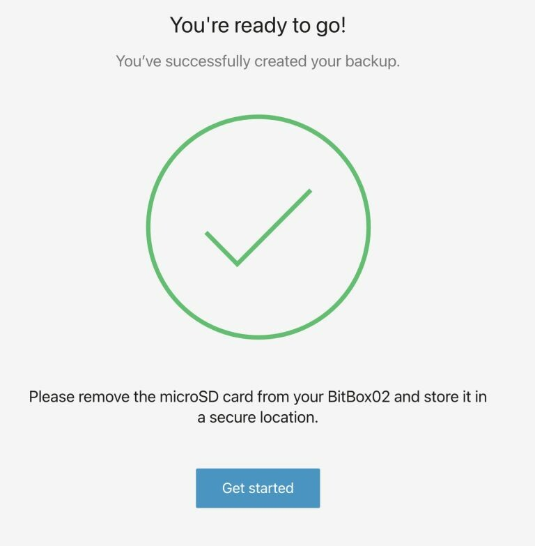

E assim é como a carteira fica pronta para uso.

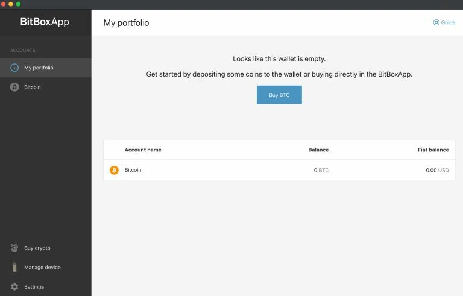

### NÃO TÃO RÁPIDO!!

É bastante estranho, mas o BitBox02 está nos dizendo que estamos prontos para usar o dispositivo, mas não nos pediu para anotar as palavras da semente! O ÚNICO backup que temos é o arquivo salvo no cartão microSD. Isso é inadequado. Esses dispositivos de armazenamento não duram para sempre (devido à "degradação de bits"). Precisamos de um backup em papel e duplicatas, guardados em cofres (conforme explicado no guia geral de como usar carteiras de hardware)

Para obter nossa frase de semente e anotá-la, vá para a guia "gerenciar dispositivo" à esquerda e clique em "mostrar palavras de recuperação"

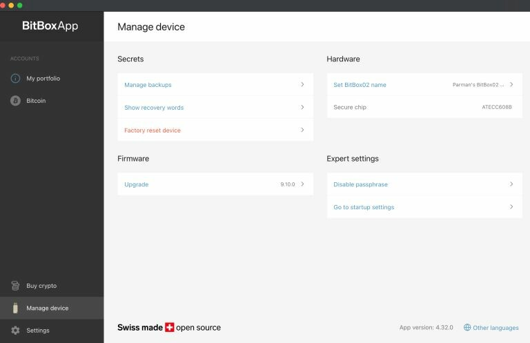

Você pode então passar pela confirmação e o dispositivo apresentará as palavras. Anote-as com cuidado e nunca deixe ninguém ver as palavras.

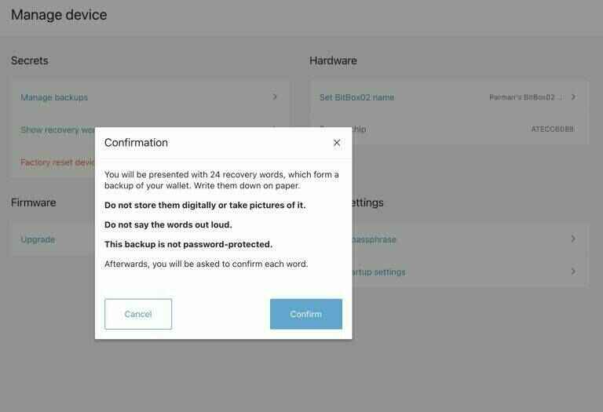

Depois disso, você pode clicar na guia Bitcoin à esquerda para obter seus endereços de recebimento.

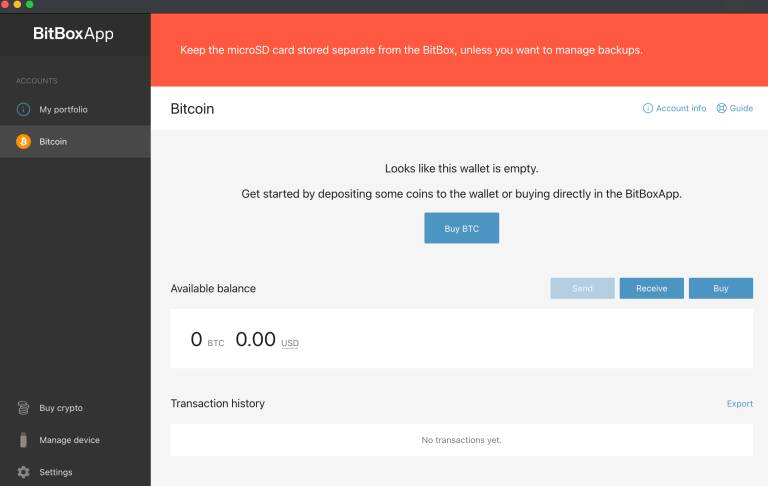

Ele mostra um de cada vez, mas pelo menos permite que você escolha qual endereço usar dos primeiros 20:

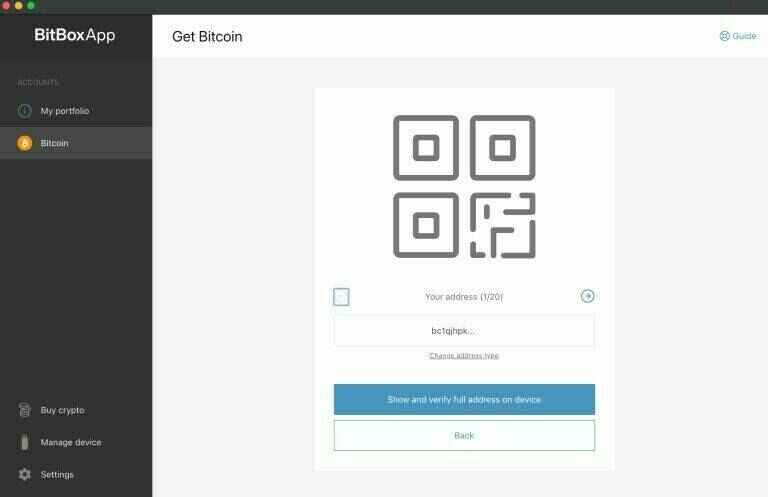

Clicar no botão azul mostrará o endereço completo e você será solicitado a verificar se o endereço corresponde à exibição na tela. Isso é uma boa prática para confirmar que nenhum malware em seu computador está tentando enganá-lo para enviar bitcoin para o endereço de um atacante.

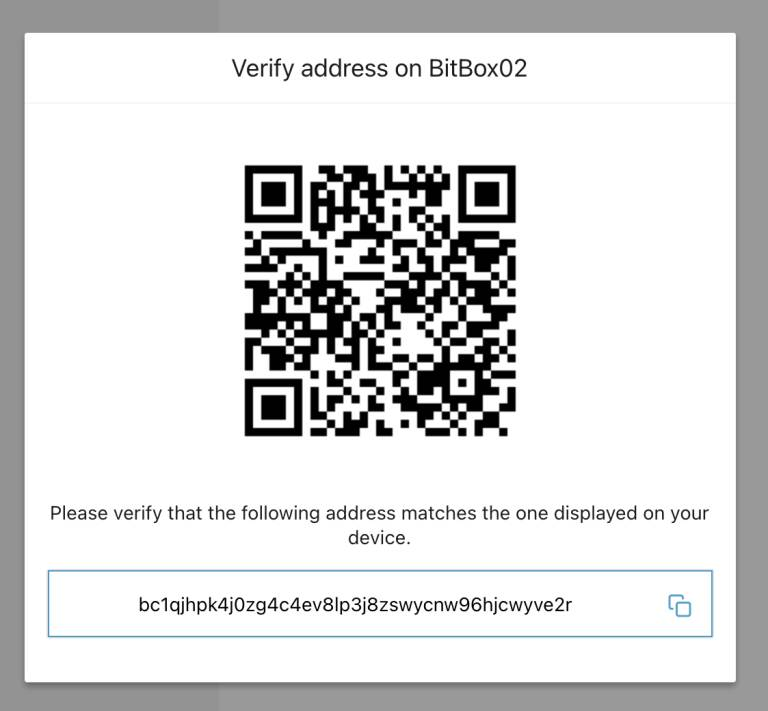

Para enviar bitcoin para esta carteira, você pode copiar o endereço e colá-lo na página de saque da exchange onde estão suas moedas. Eu recomendo que você envie primeiro uma pequena quantidade de teste e depois pratique gastando-a de volta para a exchange ou para o segundo endereço em sua carteira.

Para quantias maiores, sugiro que você crie uma frase de acesso (veja abaixo). A carteira original (sem frase de acesso) pode ser usada como sua carteira de disfarce (ela precisará ter uma quantia razoável lá para ser uma carteira de disfarce plausível).

### Conectar-se a um nó

A BitBox02 irá se conectar automaticamente a um nó. Vamos ver onde ela está se conectando. Clique na guia de configurações à esquerda e depois em "conectar seu próprio nó completo".

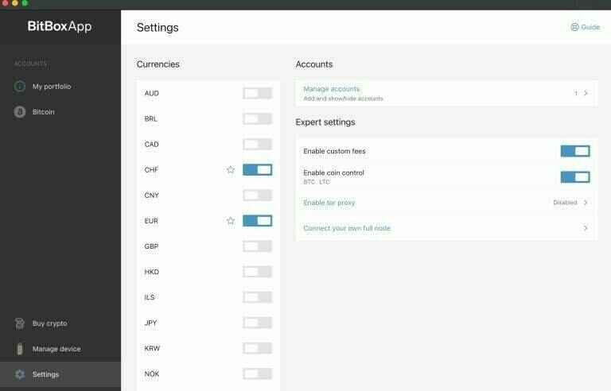

E aqui podemos ver que está se conectando ao nó da shiftcrypto. Não é ótimo. Traímos todos os nossos endereços de bitcoin para eles e nosso endereço IP (não a semente, é claro; eles podem ver nossos endereços/saldos, mas não podem gastá-los). Podemos inserir os detalhes do nosso próprio nó nesta página (fora do escopo deste guia específico) ou podemos usar um software melhor como Sparrow Bitcoin Wallet, Electrum Desktop Wallet ou Specter Desktop. Demonstrarei o Sparrow Bitcoin Wallet mais tarde no guia.

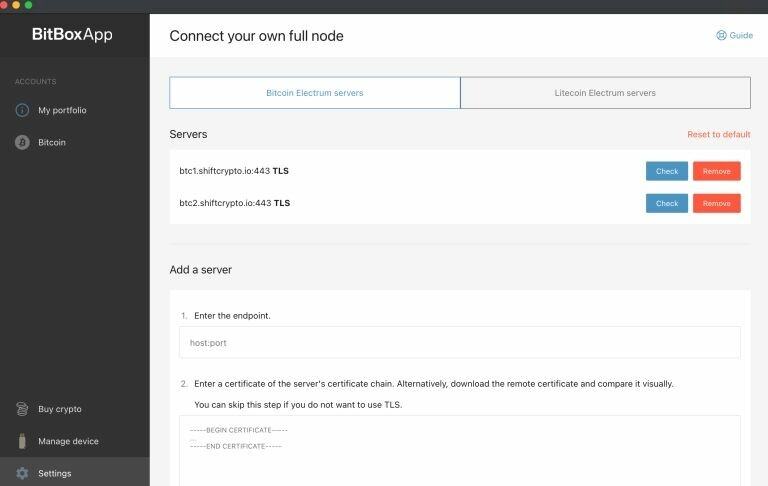

Adicione uma frase secreta

Agora que configuramos o dispositivo com o aplicativo BitBox02 (e revelamos nossos endereços, o que é inevitável com esta carteira de hardware específica), podemos adicionar uma frase secreta à nossa frase-semente. Isso nos permitirá criar uma nova carteira usando a mesma semente e a ShiftCrypto nunca verá nossos novos endereços. Vamos conectar esta carteira apenas ao nosso próprio software.

### Habilitar Frase Secreta

Vá em frente agora e "habilite" a função de frase secreta (mas ainda não estamos definindo uma frase secreta). Vá para a guia "gerenciar dispositivo" e clique em "habilitar frase secreta" (círculo vermelho abaixo).

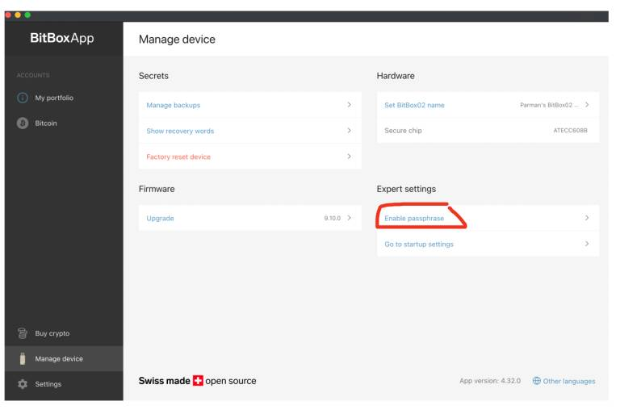

Leia os passos...

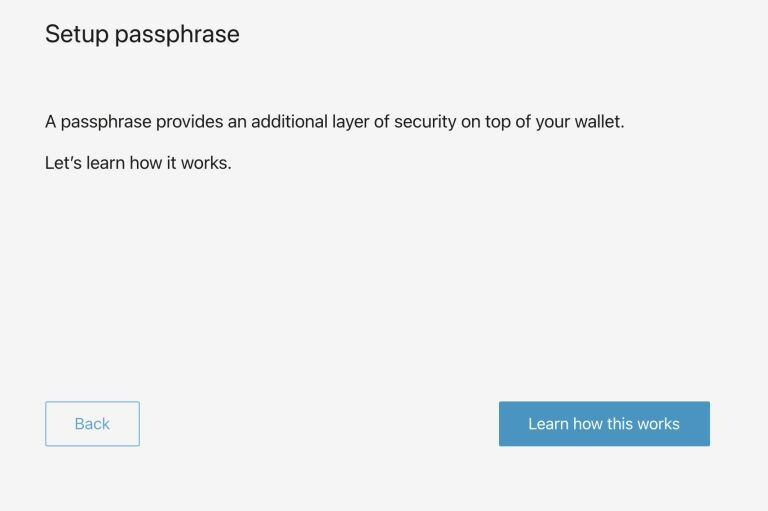
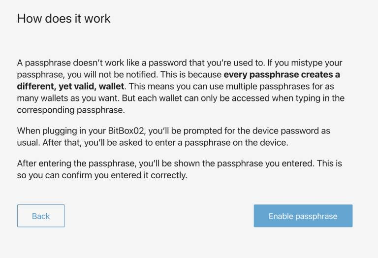
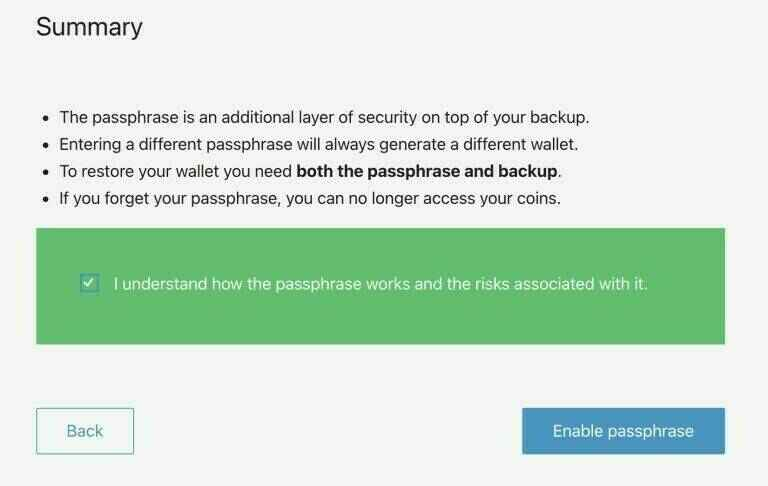

Agora desconecte o dispositivo e feche o aplicativo BitBox02.

FIM da seção bitbox02 por Parman.

Seu dispositivo agora está totalmente operacional para ser usado em qualquer solução de desktop, como specter, sparrow e usando a interface bitbox.
