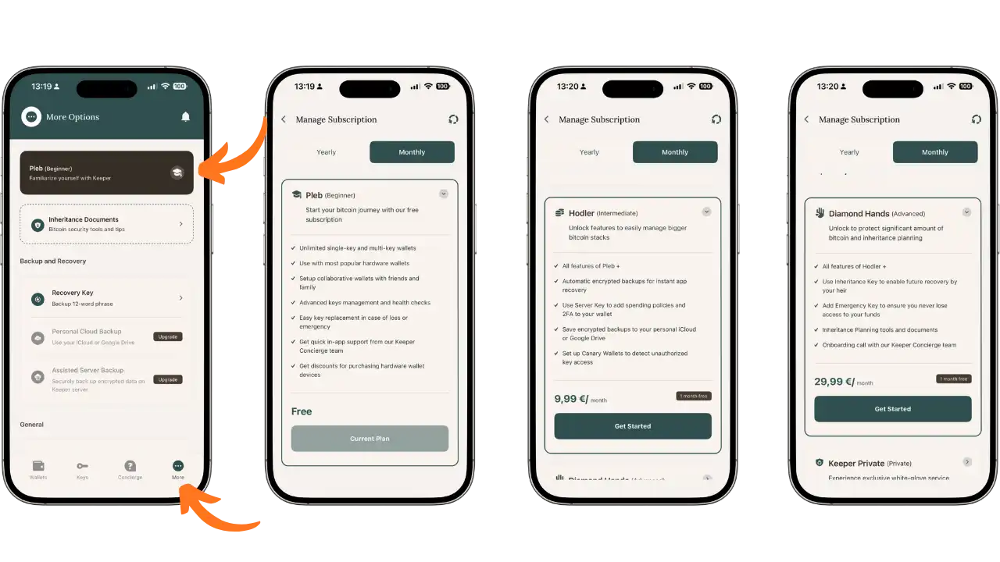
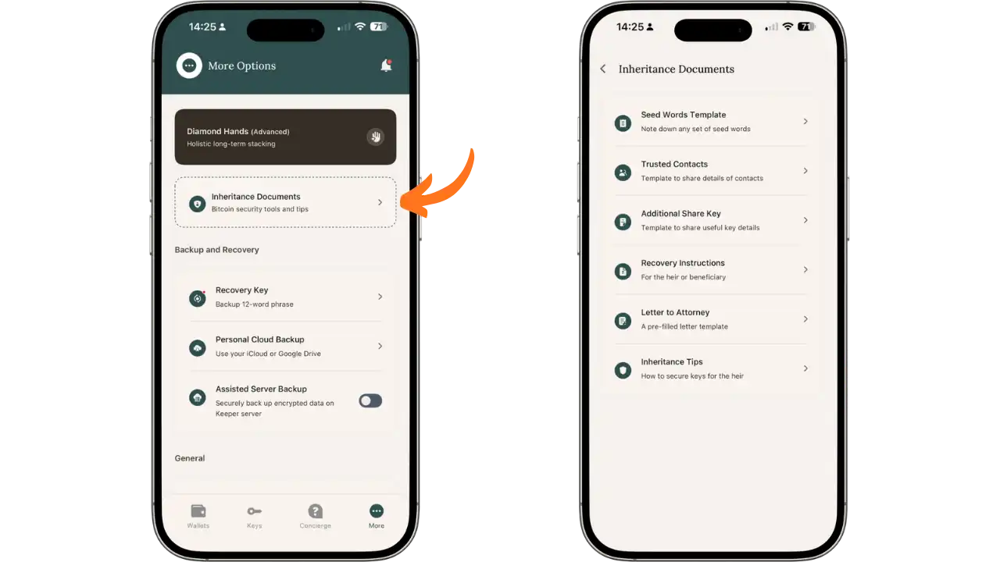
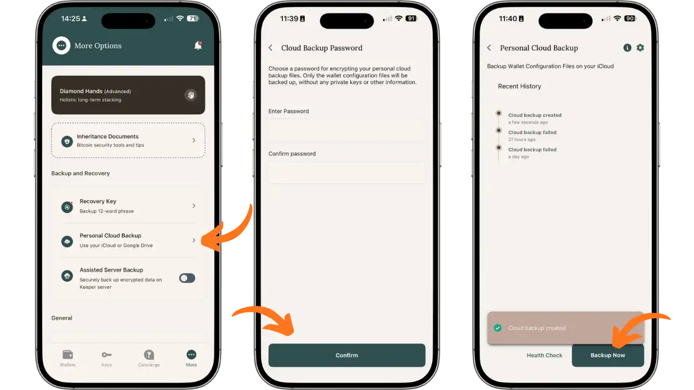
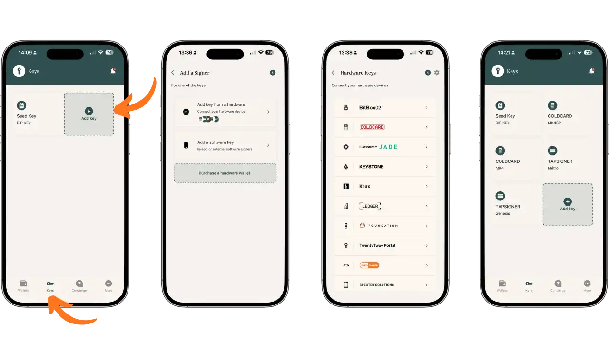
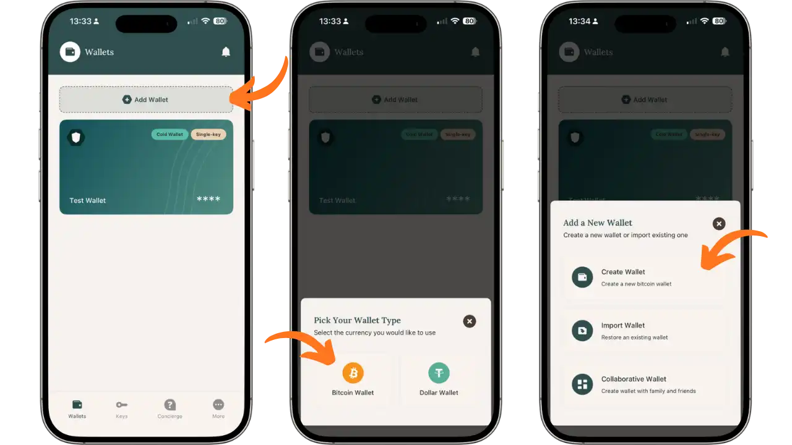
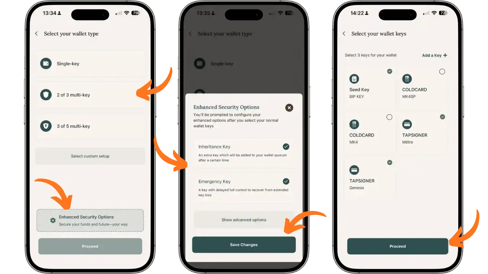
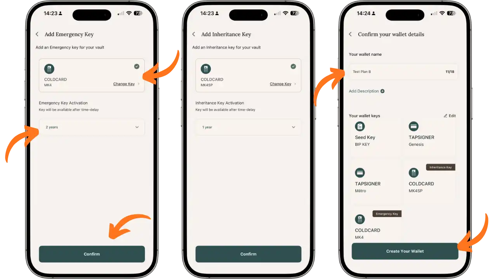
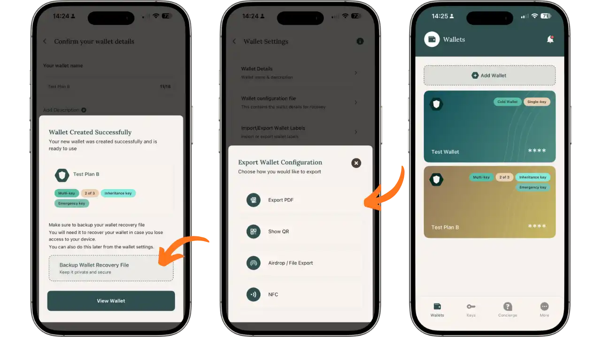
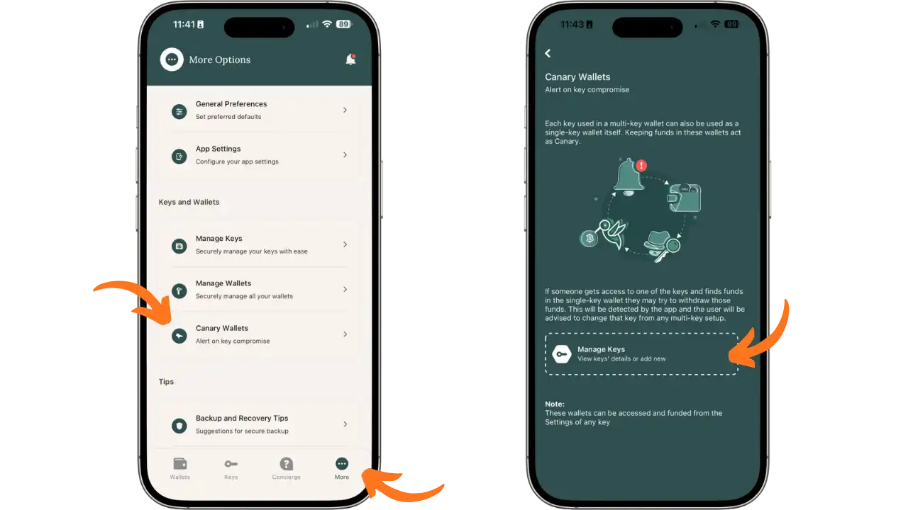
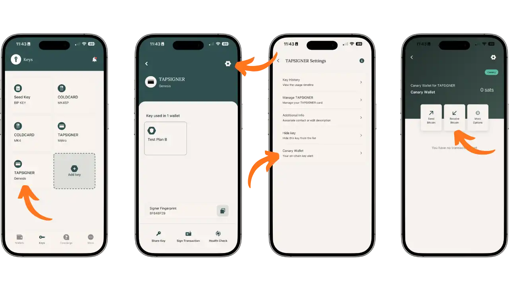

比特币资产的转移是持有者最容易低估的挑战之一。与银行账户不同，银行账户中的资金可以由金融机构直接转交给合法继承人，而比特币完全依赖于私钥所有者。没有这些私钥，即使是完全合法的继承人也无法访问获取资金，而掌握私钥的恶意人士则可以随意挥霍。

在本篇 Bitcoin Keeper 教程的第二部分中，我们将探索专为继承计划而设计的高级功能。该应用程序提供创建增强型保险库的高级工具，借助 Miniscript 技术实现定时保护机制，并提供相关文档来指导您的亲人。

本指南假定您已经掌握了 Bitcoin Keeper 的基础知识（创建钱包、经典多签名钱包、添加硬件密钥），如我们的第一篇教程所述：

https://planb.academy/tutorials/wallet/mobile/bitcoin-keeper-7f2a160b-10b6-4cc5-8820-514ee2eb1599

## Bitcoin Keeper 订阅计划

Bitcoin Keeper 采用免费增值模式，提供三个订阅级别，每个级别对应不同的功能。要查看订阅计划，请前往 **More** 选项卡，然后点击您当前的订阅计划（默认为 “Pleb”），即可打开 **Manage Subscription** 页面。

**Pleb 计划**（免费）提供基本访问权限：无限制创建单密钥和多密钥钱包、与所有主要硬件钱包兼容（Coldcard、Trezor、Ledger、Jade、Tapsigner......）、币控制、标签以及与个人 Electrum 服务器的连接。该计划足以满足标准使用甚至经典多签名配置的需要。

**Hodler 计划**（9.99 欧元/月，按年付费可免费获得 1 个月）包含 Pleb 的所有功能，并增加了加密备份到云端（iCloud 或 Google Drive）以在任何设备上还原保险箱、服务器密钥（Server Key）以添加自动支出策略和超过一定阈值的 2FA，以及金 Canary 钱包（Canary Wallets）以检测对密钥的未经授权访问。

**Diamond Hands 计划**（29.99 欧元/月，如按年支付，可免费获得 1 个月）是继承规划的完整套餐。它包括整个 Hodler 计划的功能，并解锁继承密钥（延迟激活）、应急密钥（丢失时用于恢复的应急密钥）、继承规划工具和文件，以及与专属客服团队的通话，以验证您的配置。这是为希望将遗产传承给几代人的比特币持有者而设计。

重要提示：即使您切换回免费计划，您创建的保险库仍然可以访问。您的配置基于开放标准（BSMS、Miniscript），并且独立于您的订阅运行。

## 继承文件

激活 Diamond Hands 订阅计划后，从 “More” 选项卡访问 **Inheritance Documents** 部分。Bitcoin Keeper 提供五份样本文件来构建您的遗产计划，还有一个提示部分：

- **Seed Words Template（种子助记词模板）**：一个模板，用于有条理地记下您的助记词
- **Trusted Contacts（可信联系人）**：用于列出与计划有关的可信人员（公证人、律师、继承人、钥匙保管人）详细联系信息的模板
- **Additional Share Key（附加共享密钥）**：详细说明每个密钥技术信息的文件：PIN 码、派生路径、物理位置、设备类型以及任何其他有助于识别和使用密钥的信息
- **Recovery Instructions（回复说明）**：继承人或受益人追回资金的分步说明
- **Letter to Attorney（致律师函）**：可为您的律师或公证人修改的预填信函

**Inheritance Tips** 部分提供了关于为继承人确保钥匙安全和优化继承计划的实用建议。

根据自己的情况定制这些文件，并将它们与钥匙本身分开，放在安全的地方。

## 配置云备份

创建传统保管库之前，请激活云备份以保护您的配置文件。在 “More” 选项卡中，点击**Personal Cloud Backup**。

选择一个强大的密码来加密备份。该密码只保护钱包配置文件（不保护您的私钥）。确认密码并点击**Confirm**。您的备份将根据设备存储在 iCloud 或 Google Drive 上。点击**Backup Now**启动第一次备份。

## 导入硬件密钥

在本示例中，我们将创建一个 2/3 保险库，并添加两把额外的密钥（继承密钥和应急密钥）。首先，将所有必要的密钥导入到 **Keys** 选项卡中。

按**Add key**，然后选择**Add key from a hardware**连接硬件钱包。Bitcoin Keeper 支持多种设备：BitBox02、Coldcard、Blockstream Jade、Keystone、Krux、Ledger、Foundation Passport、TwentyTwo Portal、Seedsigner 和 Specter Solutions。

在我们的配置中，我们将导入：

- 2 个 **Coldcard** 密钥（MK4SP 和 MK4）
- 2 个 **Tapsigner** 密钥（Metro 和 Genesis）

为了添加 Coldcard 密钥，请从列表中选择 Coldcard，然后按照屏幕上的说明通过二维码、文件、USB 或 NFC 导出公钥。如果您想要了解如何使用 Coldcard 或 Tapsigner 的更多详情，请参阅我们的专门教程：

https://planb.academy/tutorials/wallet/hardware/tapsigner-ab2bcdf9-9509-4908-9a4a-2f2be1e7d5d2

https://planb.academy/tutorials/wallet/hardware/coldcard-q-73e86d1a-6fe6-4d8b-bb15-8690298020e3

https://planb.academy/tutorials/wallet/hardware/coldcard-mk4-5d44dd94-423d-4e37-9a8c-3fc38b45ce59

导入所有密钥后，您可以在 "Keys" 选项卡中找到它们的自定义名称。

## 创建钱包

让我们继续创建钱包。在 **Wallets** 标签页，按 **Add Wallet**，选择 **Bitcoin Wallet** ，然后按 **Create Wallet**。

选择钱包类型。对于我们的传统计划，请选择 **2 of 3 multi-key**。在屏幕底部，激活 **Enhanced Security Options（增强安全选项）**，然后点击 **Proceed**。

在弹出的 "Enhanced Security Options" 中，选中 ：

- **Inheritance Key（继承密钥）**：一个额外的密钥，将在设定时间后添加到法定人数中
- **Emergency Key（紧急密钥）**：在钥匙丢失的情况下，可恢复资金的延迟完全控制密钥

按 **Save Changes**。然后从导入的密钥中选择组成钱包的 3 个密钥（例如Seed Key、Coldcard MK4SP 和 Tapsigner Metro）。

## 设定特定的关键期限

下一个界面可让您配置紧急密钥和继承密钥。在这里您可以定义启动这些特殊密钥的延迟时间。

对于 **紧急密钥**，请选择作为最终备份的硬件密钥（此处为 Coldcard MK4），并选择激活延迟时间（在我们的示例中为 2 年）。与继承密钥不同，紧急密钥不会增加法定人数：它允许您完全绕过多重登录，并在时限到期后完全控制资金。它是您最后的解决方案：如果多把密钥丢失或损毁，只需一把密钥就可以恢复所有资金。因此，必须对它进行最严格的保护。

对**继承密钥**而言，选择用于继承人的密钥（此处为冷卡 MK4SP）并选择延迟时间（例如：1 年）。一年后，如果没有任何变动，这把密钥**将被添加到签名法定人数**中。实际上，一旦过了这个期限，您的 wallet 2-of-3 将变成 wallet 2-of-4，使继承人能够与现有密钥一起参与签名。

### 时间锁如何工作？

Bitcoin Keeper 使用由 Miniscript 实现的**绝对时间锁**（CLTV - CheckLockTimeVerify）。与在收到每个 UTXO 时开始的相对时间锁 (CSV) 不同，绝对时间锁使用创建钱包时定义的**固定到期日期**。

具体而言，如果您今天创建了一个带有 1 年继承密钥的钱包，则激活日期为 "今天 + 1 年"。存入该钱包的所有资金，无论其存入日期如何，都可以在同一天通过继承密钥使用。

绝对时间锁的优点是它们允许超过 15 个月的交付时间（相对 CSV 时间锁的限制），这是为何 Bitcoin Keeper 可以提供诸如 2 年之类的选项。

### 刷新机制

为防止特殊密钥在您的有生之年被激活，您必须定期 "刷新" 您的钱包。使用绝对时间锁，这涉及**重新创建具有新的到期日期**的钱包，并将其推到未来，然后将您的资金转移到这个新钱包。

Bitcoin Keeper 通过集成的刷新功能简化了这一过程。该应用程序会自动处理后台的复杂性：您只需按照指导步骤操作，无需手动创建新钱包或自行转移资金。在配置的最短时间范围到期之前定期计划此操作。例如，对于 1 年期的继承密钥，每 9-10 个月刷新一次以保持安全裕度。

## 保存和导出配置

创建钱包后，应用程序会提醒您保存配置文件。 **这一步至关重要**：如果没有该文件，您的继承人将无法重新配置钱包多重 ID。

按 **Backup Wallet Recovery File**。有多个导出选项可供选择：

- **PDF export**：生成包含所有钱包信息的完整文档
- **Show QR**：显示二维码，以便在其他设备上导入配置
- **Airdrop / File Export**：通过共享选项导出文件
- **NFC**：通过 NFC 与兼容设备共享

复制一份：一份放在公证处，一份放在银行保险箱，一份加密数字版。新的钱包现在会出现在 "Wallets" 选项卡中，标记为 "Multi-key"、"2 of 3"，"Inheritance Key" 和 "Emergency Key"。

## 创建 Canary Wallet 

Canary Wallet 是一种预警系统。其原理是：钱包多密钥中使用的每个密钥都可以在单独的单密钥钱包。通过在该钱包存放少量比特币（Canary），任何未经授权的移动都预示着密钥已被破坏。

配置 Wallet Canary 有两种方法。在**More**标签页，点击 “Keys and Wallets” 部分的 **Keys and Wallets**。屏幕会解释其原理：如果有人访问您的某个密钥，并在相关的钱包单密钥中发现钱包中有资金，他们会试图将其取出，从而向您发出警报。

您也可以直接通过密钥配置 Canary。在 **Keys** 选项卡中，选择一个密钥（如 Tapsigner Genesis），按**Settings**（齿轮）图标，然后按**Canary Wallet**。相关的 Canary Wallet 就会打开，准备接收用来“监视”的聪/比特币。

在每个 Carry Wallet 上存入一小笔钱（几千聪）。如果这些资金在未经您同意的情况下被转移，请立即从您的多重签名保险箱中删除受损的密钥。

## 最佳做法

**在投入大笔资金之前先用少量资金测试您的配置**。发送几千聪到金库，然后尝试支出以检查您是否掌握了每台设备的签名过程。还要测试在另一部手机上导入配置文件以确保备份有效。

**明智地分配密钥**。对于 Tapsigners，请将其放入密封信封中并单独传达 PIN（例如，在存储在其他地方的恢复说明信中）。对于经典的硬件钱包，请将设备存放在受信任的第三方处，并将种子信息保存在纸质或金属上，由您或其他第三方保管。请记下配置文件中每个密钥的指纹及其名称，以避免混淆。

**计划定期测试**（消防演习）。每年检查一下您是否可以通过空白手机上的备份重建保险箱。通过检查余额来测试金丝雀警报。模拟丢失场景（“如果我丢失了 Coldcard 怎么办？”）以确认剩余的按键组合是否足够。

**不要忘记刷新**。如果您将继承密钥设置为 1 年，请每 9-10 个月刷新一次。这是您在没有第三方干预的情况下购买自动变速箱所付出的代价。

**及时更新计划**。任何更改（更换密钥、修改继承人、更改截止日期）都必须反映在所有备份和文件中。每次修改后重新生成 PDF 文件，并重新分发新版本。

## 限制和注意事项

尽管这些工具功能强大，但重要的是要认识到它们的局限性，以便尽可能有效地管理它们。

带时间锁的多重签名保险箱的**复杂性**本身就可能是一种风险：配置错误、继承人的误解、众多组件中关键元素的丢失。 Bitcoin Keeper 尽可能简化了体验，但它仍然是一个技术操作。仅当要保护的金额证明合理时才部署此计划。对于小额金额，更简单的计划可能就足够了。

**应用程序依赖性**值得考虑。尽管代码是开源的并且基于开放标准（Miniscript、BSMS），但某些功能依赖于 Keeper 生态系统。保留应用程序（Android APK 或 iOS IPA）的副本，并在给继承人的信件中记录使用其他 Miniscript 兼容钱包（例如 Liana）恢复资金的可能性。

**值得信赖的经纪人**带来了人为风险。如果有恶意的亲戚在截止日期之前使用了委托给他/她的密钥，会发生什么？或者如果律师丢失了您的文件？仔细选择这些人，清楚地解释他们的职责，并制定备用计划。Canary Wallet、冗余备份和多重签名的结构仍然是抵御这些危险的最佳保护。

## 结论

Bitcoin Keeper 的 Diamond Hands 计划为遗产规划提供了一个完整的工具箱：带定时密钥的增强型保险库、随附文件、Canary Wallet 和个性化支持。

这不仅仅是一个技术问题：这是一个设计遗产结构、明智地分配密钥和知识以及定期测试系统的问题。精心设计的比特币继承计划可以将您的聪转变为真正的、可转让的遗产。
