Pengelolaan Bitcoin yang aman adalah tantangan besar bagi setiap pemegang yang memahami taruhan di balik kedaulatan finansial. Di antara kesederhanaan wallet mobile dan ketangguhan solusi multisig, kesenjangan teknis sering kali terasa menakutkan bagi banyak pengguna. Bitcoin Keeper diposisikan tepat di persimpangan ini, dengan menawarkan pendekatan keamanan yang progresif dan menemani pengguna seiring berkembangnya kebutuhan mereka.

Bitcoin Keeper adalah aplikasi mobile open source yang didedikasikan secara eksklusif untuk Bitcoin, dan dikembangkan oleh tim BitHyve. Ambisinya adalah membuat manajemen portofolio tingkat lanjut, khususnya konfigurasi multisig, menjadi mudah diakses tanpa mengorbankan antarmuka yang intuitif bagi pemula. Aplikasi ini mengusung slogan "Secure today, Plan tomorrow", yang mencerminkan filosofi pendampingan jangka panjang.

Berbeda dengan wallet generalis yang mengelola banyak cryptocurrency, Bitcoin Keeper mempertahankan fokus yang ketat pada Bitcoin. Pendekatan Bitcoin-only ini mengurangi permukaan serangan dan sangat menyederhanakan pengalaman pengguna. Aplikasi ini juga menonjol berkat integrasi native dengan berbagai hardware wallet terluas di ekosistem, serta fitur manajemen UTXO yang canggih.

## Apa itu Bitcoin Keeper?

### Filosofi dan tujuan

Bitcoin Keeper dirancang untuk memenuhi kebutuhan spesifik para bitcoiner yang ingin mempertahankan kontrol penuh atas private key mereka. Proyek ini sepenuhnya merangkul prinsip-prinsip dasar Bitcoin: kode sumber yang open source dan dapat diaudit, penghormatan terhadap privasi, serta kedaulatan pengguna. Tidak ada registrasi atau data pribadi yang diperlukan untuk menggunakan aplikasi ini, dan aplikasi ini bahkan bisa berjalan secara offline untuk operasi penandatanganan.

Tujuan utamanya adalah menyediakan alat yang fleksibel dan future-proof untuk menyimpan BTC selama bertahun-tahun, bahkan lintas generasi, berkat fitur perencanaan warisan. Aplikasi ini memungkinkan kamu untuk memulai dengan mudah menggunakan wallet mobile, lalu secara bertahap berevolusi menuju solusi multisig yang lebih aman seiring meningkatnya kebutuhan keamanan kamu.

### Arsitektur aplikasi

Bitcoin Keeper mengatur pengelolaan dana dengan dua konsep yang berbeda. Hot Wallet** adalah wallet satu kunci sederhana yang disimpan di ponsel, dirancang untuk pengeluaran sehari-hari dan jumlah yang tidak terlalu besar. Vaults** adalah brankas multisig (multi-key) yang membutuhkan beberapa kunci untuk mengesahkan pengeluaran, dan ditujukan untuk penyimpanan jangka panjang yang aman.

### Fitur utama

Bitcoin Keeper mendukung hampir semua hardware wallet yang tersedia di pasaran: Coldcard, Trezor, Ledger, Keystone, BitBox02, Jade, Seedsigner, Passport, dan Tapsigner dari Coinkite. Integrasi dilakukan melalui berbagai metode, tergantung pada perangkatnya, seperti pemindaian QR code, koneksi NFC, atau impor file.

Aplikasi ini juga menawarkan manajemen UTXO tingkat lanjut dengan fitur pelabelan transaksi, coin control untuk memilih input secara manual saat mengirim, serta dukungan format PSBT untuk transaksi yang ditandatangani sebagian.

## Instalasi dan konfigurasi awal

Bitcoin Keeper tersedia gratis di Android melalui Google Play Store dan di iOS melalui App Store. Penerbit yang terdaftar adalah BitHyve. Sebelum menginstal, pastikan perangkat kamu bebas dari malware, sudah diperbarui, dan tidak di-root atau di-jailbreak.

Saat pertama kali dijalankan, aplikasi akan meminta kamu untuk membuat kode PIN keamanan. Kode ini melindungi akses ke wallet kamu dan mengenkripsi data sensitif secara lokal. Pilih kode yang kuat dan pastikan kamu menghafalnya. Setelah itu, kamu dapat mengaktifkan autentikasi biometrik seperti sidik jari atau Face ID untuk proses buka kunci yang lebih cepat.

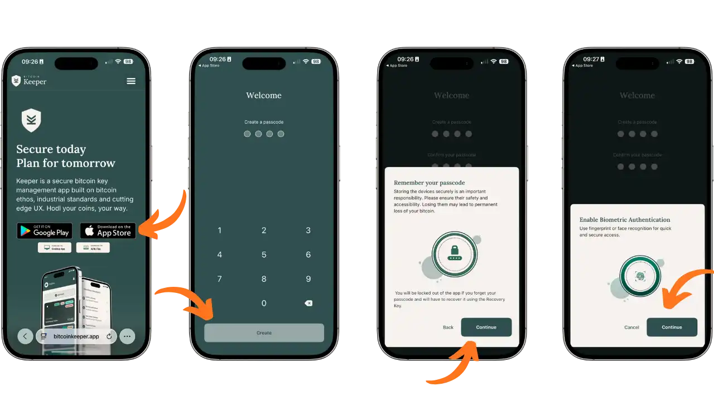

Aplikasi ini kemudian menampilkan beberapa layar pengantar yang menjelaskan tiga pilar utamanya: pembuatan wallet untuk mengirim dan menerima bitcoin, manajemen kunci dengan kompatibilitas hardware wallet, serta perencanaan warisan untuk mewariskan bitcoin. Tekan "Mulai", lalu pilih "Mulai Baru" untuk membuat konfigurasi baru.

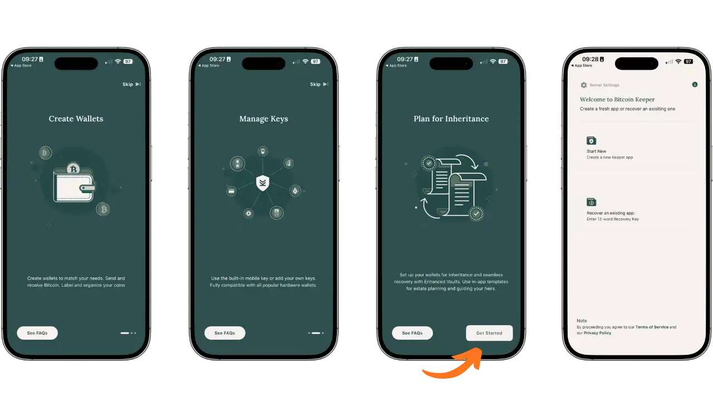

## Menemukan antarmuka

Antarmuka Bitcoin Keeper diatur di sekitar empat tab utama yang dapat diakses dari bilah navigasi bawah:

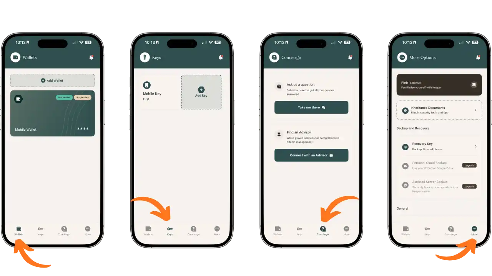

Tab **Dompet** menampilkan wallet kamu beserta saldonya. Di sinilah kamu mengakses wallet untuk mengirim dan menerima bitcoin. Label "Hot Wallet" serta "Single-Key" atau "Multi-Key" memudahkan kamu untuk dengan cepat mengidentifikasi jenis setiap wallet.

Tab **Keys** memusatkan pengelolaan signing key kamu. Di sini kamu akan menemukan Mobile Key yang dihasilkan oleh aplikasi, serta semua key yang diimpor dari hardware wallet. Dari tab ini juga kamu dapat menambahkan perangkat penandatangan baru.

Tab **Concierge** menawarkan layanan dukungan. Kamu bisa mengirim pertanyaan ke tim support dan terhubung dengan penasihat Bitcoin untuk mendapatkan bantuan yang disesuaikan dengan kebutuhan kamu.

Tab **Lebih Banyak** (Opsi Lainnya) memberikan akses ke berbagai pengaturan, seperti koneksi ke server pribadi, backup key, dokumen warisan, preferensi tampilan, serta manajemen wallet.

## Koneksi ke server sendiri

Untuk meningkatkan privasi kamu, Bitcoin Keeper memungkinkan kamu menghubungkan aplikasi ke server Electrum milik kamu sendiri, alih-alih menggunakan server publik bawaan.

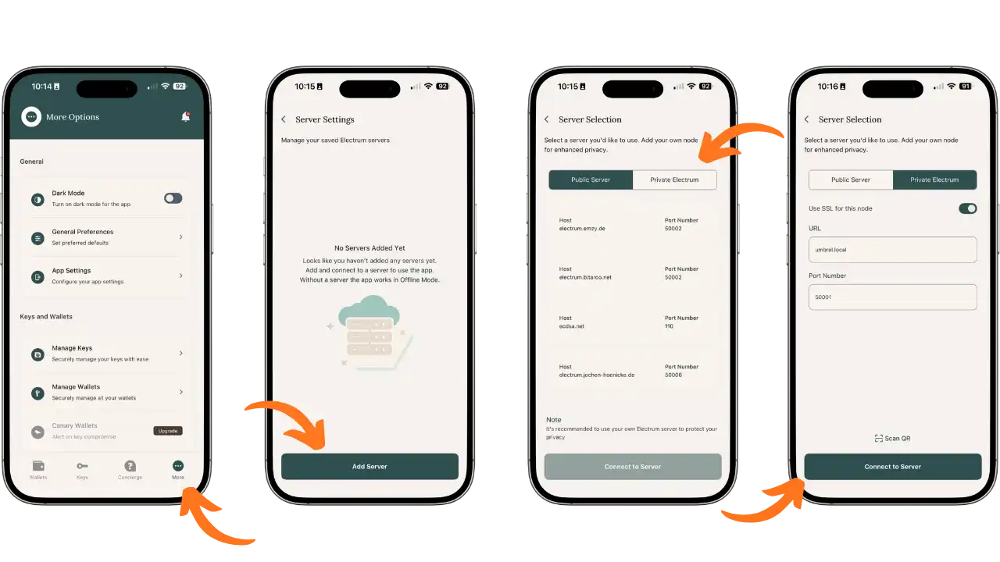

Dari tab **Lainnya**, gulir ke bawah untuk menemukan pengaturan server. Tekan "Add Server" untuk mengonfigurasi koneksi baru. Kamu dapat memilih antara "Public Server" (server publik yang sudah dikonfigurasi sebelumnya) dan "Private Electrum" (server milik kamu sendiri).

Untuk server pribadi, masukkan URL, misalnya umbrel.local untuk node Umbrel, serta nomor port, biasanya 50001. Aktifkan SSL jika server kamu mendukungnya. Kamu juga dapat memindai QR code konfigurasi. Setelah semua parameter dimasukkan, tekan "Hubungkan ke Server".

Jika kamu belum memiliki node Bitcoin sendiri, lihat tutorial kami tentang Umbrel, solusi yang sederhana dan terjangkau untuk menjalankan node kamu sendiri:

https://planb.academy/tutorials/node/bitcoin/umbrel-8b0e3b5b-d3cf-4a1e-8bb8-1ad2db4dd848

## Menerima bitcoin

Dari tab Dompet, pilih wallet tempat kamu ingin menerima dana dengan menekannya. Layar wallet akan menampilkan saldo serta tiga tombol aksi: Kirim Bitcoin, Terima Bitcoin, dan Lihat Semua Koin.

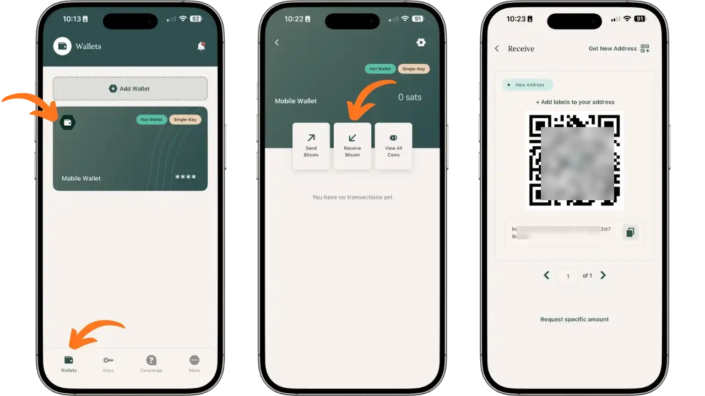

Tekan "Terima Bitcoin". Bitcoin Keeper akan menghasilkan alamat penerimaan baru dalam format Bech32, yang dimulai dengan bc1, beserta QR code-nya. Kamu dapat menambahkan label pada alamat ini untuk mengidentifikasi sumber dana. Bagikan alamat tersebut kepada pengirim dengan menampilkan QR code atau menyalin alamat teksnya.

Aplikasi ini secara otomatis membuat alamat baru untuk setiap penerimaan guna menjaga privasi kamu. Gunakan "Dapatkan Address Baru" jika kamu perlu menghasilkan alamat kosong tambahan.

## Manajemen UTXO

Bitcoin Keeper menawarkan visibilitas lengkap dari UTXO (Hasil Transaksi yang Tidak Digunakan) yang membentuk saldo kamu. Dari layar wallet, tekan "Lihat Semua Koin" untuk mengakses manajer sudut.

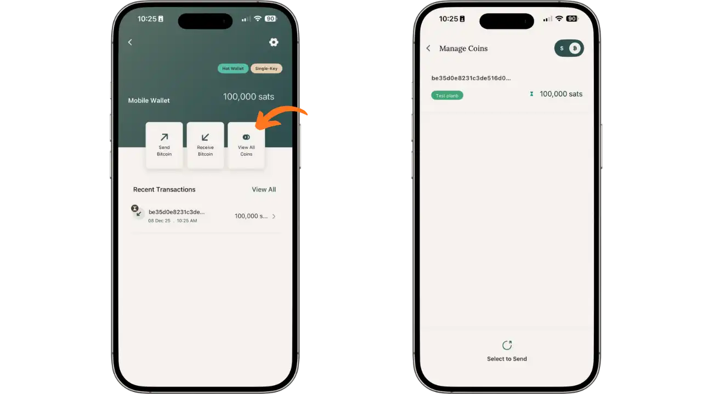

Layar "Kelola Koin" menampilkan setiap UTXO satu per satu beserta jumlah dan labelnya. Tampilan ini memungkinkan kamu melacak asal-usul koin dan mengelolanya dengan lebih baik. Kamu dapat memilih UTXO tertentu melalui opsi "Pilih untuk Dikirim" untuk menggunakan coin control saat mengirim, sehingga menghindari pencampuran koin dari sumber yang berbeda.

## Kirim bitcoin

Untuk mengirim, pilih portofolio sumber dan tekan "Kirim Bitcoin". Masukkan alamat tujuan (ditempelkan atau dipindai melalui kode QR) dan secara opsional tambahkan label untuk mengidentifikasi penerima.

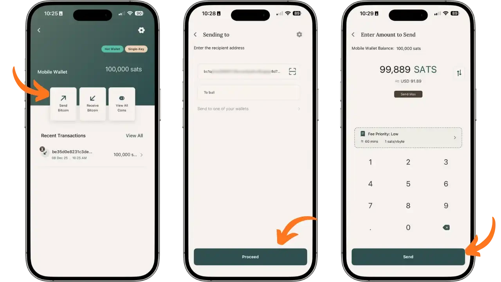

Layar berikutnya memungkinkan kamu memasukkan jumlah yang akan dikirim. Antarmuka menampilkan saldo yang tersedia serta konversi ke mata uang fiat. Pilih prioritas biaya: Rendah (ekonomis, sekitar 60 menit), Sedang, atau Tinggi (prioritas). Perkiraan biaya dalam sats/vbyte ditampilkan secara real time. Tekan "Kirim" untuk melanjutkan.

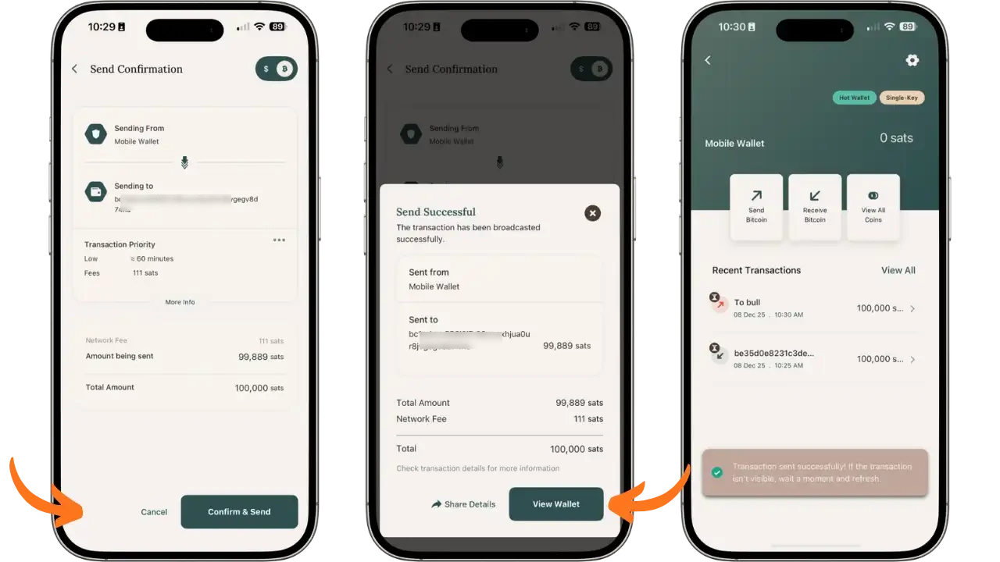

Layar ringkasan menampilkan semua detail transaksi: wallet sumber, alamat tujuan, prioritas transaksi, biaya jaringan, jumlah yang dikirim, dan totalnya. Pastikan kamu memeriksa semua informasi ini dengan cermat, karena transaksi Bitcoin tidak dapat dibatalkan. Tekan "Konfirmasi & Kirim" untuk mengirim transaksi.

Konfirmasi "Kirim Berhasil" akan muncul dengan ringkasan lengkap. Transaksi dapat dilihat di riwayat "Transaksi Terakhir" dengan labelnya.

## Simpan kunci Anda

Mencadangkan Kunci Pemulihan adalah langkah penting. Dari tab Lainnya, buka bagian "Pencadangan dan Pemulihan" dan klik "Kunci Pemulihan".

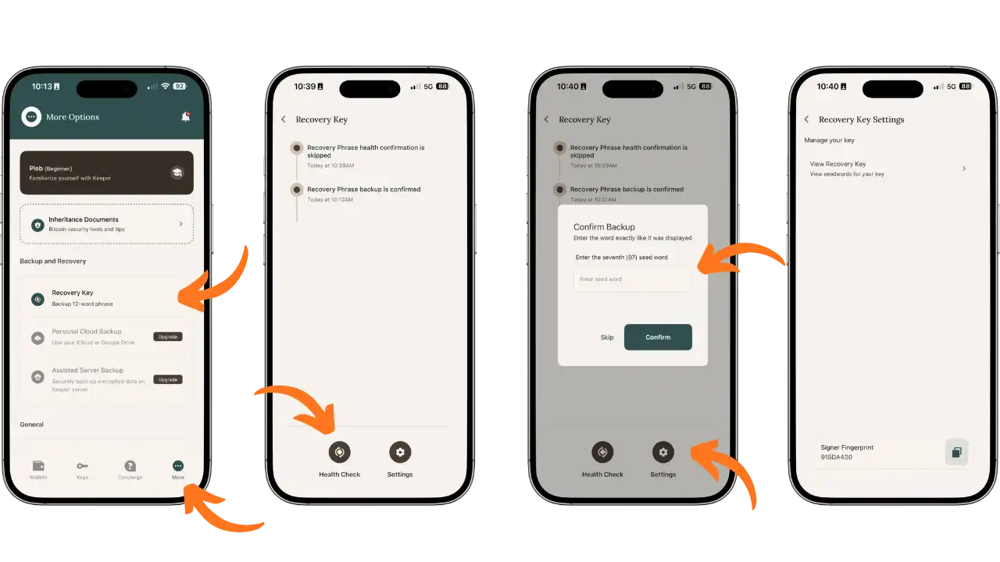

Layar ini menampilkan status cadangan kamu. Untuk memverifikasi cadangan tersebut, aplikasi akan meminta kamu mengonfirmasi kata tertentu dalam seedphrase kamu, misalnya kata ke-7. Verifikasi ini memastikan bahwa kamu telah mencatat seedphrase dengan benar.

Dari menu "Pengaturan Kunci Pemulihan", kamu dapat melihat seedphrase lengkap melalui opsi "Lihat Kunci Pemulihan", serta melihat fingerprint signing key kamu. Simpan seedphrase 12 kata kamu di atas kertas, di tempat yang aman, jauh dari kelembapan dan api. Jangan pernah menyimpannya di perangkat yang terhubung ke internet.
``

## Menambahkan kunci eksternal (perangkat keras wallet)

Salah satu aset utama Bitcoin Keeper adalah integrasi dompet perangkat keras. Dari tab Kunci, tekan "Tambah kunci" untuk menambahkan perangkat tanda tangan baru.

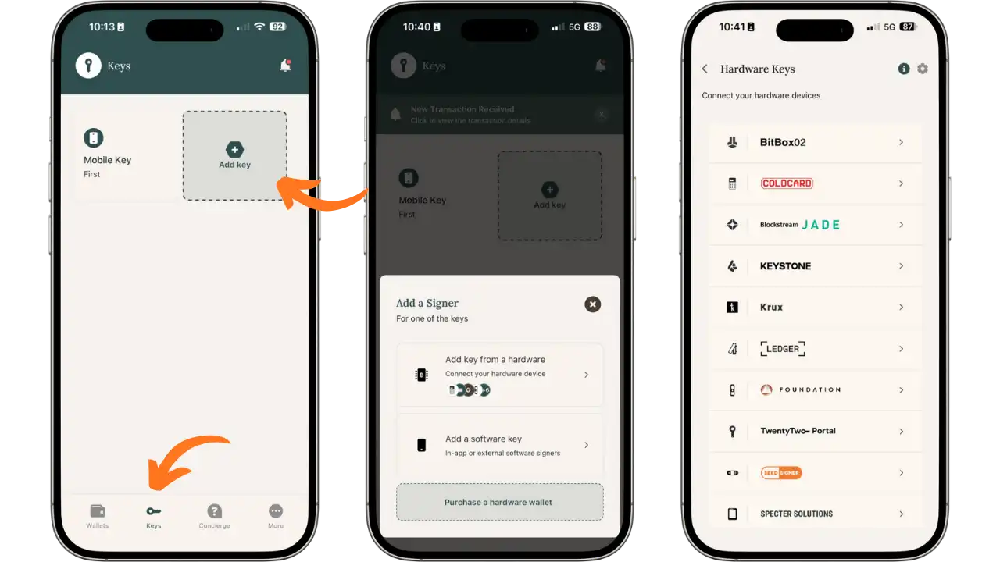

Pilih "Tambahkan kunci dari perangkat keras" untuk menghubungkan perangkat keras wallet. Aplikasi ini mendukung berbagai macam perangkat: BitBox02, Coldcard, Blockstream Jade, Keystone, Krux, Ledger, Foundation Passport, TwentyTwo Portal, Seedsigner, dan Specter Solutions.

### Konfigurasi Tapsigner

Tapsigner adalah kartu NFC dari Coinkite yang sangat cocok untuk penggunaan seluler. Jika kamu ingin mempelajari lebih lanjut, kami memiliki tutorial khusus:

https://planb.academy/tutorials/wallet/hardware/tapsigner-ab2bcdf9-9509-4908-9a4a-2f2be1e7d5d2

Untuk menambahkan Tapsigner, pilih dari daftar dompet perangkat keras.

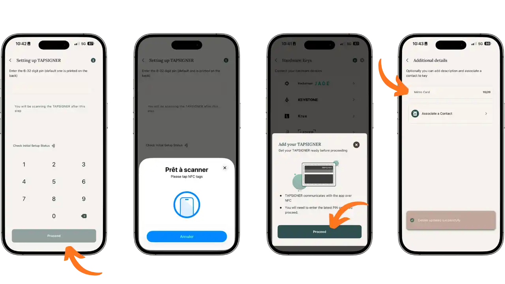

Pertama, masukkan PIN 6 hingga 32 digit yang tercetak di bagian belakang kartu kamu, ini adalah standar pada kartu baru, atau PIN kamu jika sudah dikonfigurasi sebelumnya. Tekan "Lanjutkan", lalu dekatkan Tapsigner ke bagian belakang ponsel kamu saat pesan "Siap untuk memindai" ditampilkan. Komunikasi NFC akan secara otomatis mengimpor public key. Setelah itu, kamu dapat menambahkan deskripsi, misalnya "Kartu Metro", untuk memudahkan identifikasi kunci ini.

## Membuat portofolio multisig

Setelah kamu mengatur key-key yang diperlukan, kamu bisa membuat wallet multisig yang menggabungkan beberapa perangkat. Dari tab **Dompet**, ketuk "Tambahkan Wallet".

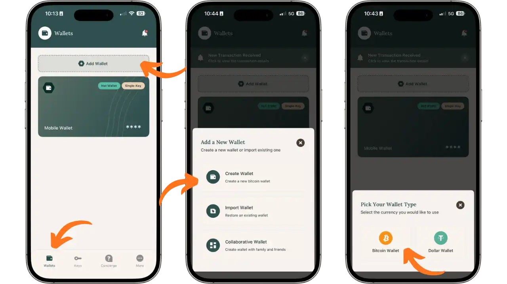

Kamu memiliki tiga opsi: "Buat Wallet" untuk portofolio baru, "Impor Wallet" untuk memulihkan wallet yang sudah ada, atau "Wallet Kolaboratif" untuk brankas bersama. Pilih "Buat Wallet", lalu "Bitcoin Wallet".

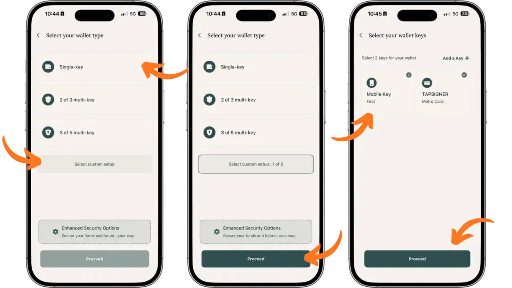

Layar berikutnya menawarkan beberapa konfigurasi: "Single-Key", "2-of-3 Multi-Key", atau "3-of-5 Multi-Key". Untuk multisig yang disesuaikan, tekan "Pilih pengaturan khusus". Sebagai contoh, pilih "1-of-2", artinya satu tanda tangan diperlukan dari dua key yang tersedia.

Selanjutnya, pilih key yang akan membentuk Vault kamu. Dalam contoh ini, kita menggabungkan "Mobile Key" (software key di ponsel) dengan "TAPSIGNER" (Kartu Metro). Konfigurasi ini memberikan redundansi: jika salah satu key tidak dapat diakses, kamu tetap bisa membelanjakan dana menggunakan key yang lainnya.

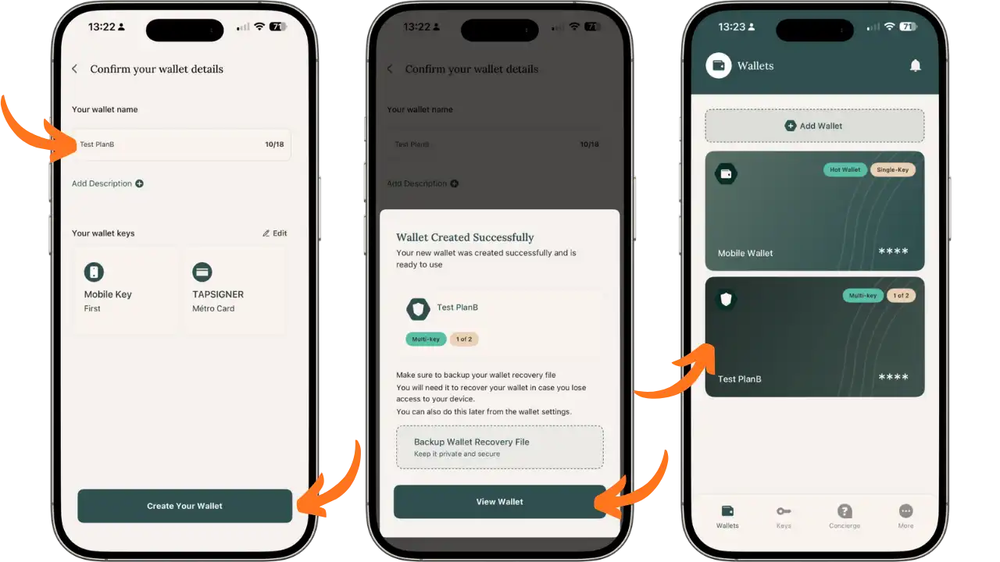

Beri nama wallet kamu, misalnya "Test PlanB", tambahkan deskripsi jika perlu, lalu centang key yang dipilih. Tekan "Buat Wallet Kamu". Pesan konfirmasi "Wallet Berhasil Dibuat" akan muncul dan mengingatkan kamu untuk menyimpan file pemulihan wallet.

Wallet multisig baru kamu sekarang akan muncul di tab **Dompet** dengan label "Multi-Key" dan indikasi "1-of-2".
``

### Menyimpan file konfigurasi

**Tidak seperti wallet sederhana, di mana seedphrase saja sudah cukup untuk memulihkan akses, wallet multisig juga membutuhkan file konfigurasi yang menjelaskan struktur brankas, seperti key mana saja yang terlibat dan berapa banyak tanda tangan yang diperlukan. Tanpa file ini, bahkan jika kamu memiliki semua seedphrase, kamu tetap tidak akan bisa membangun kembali wallet kamu.

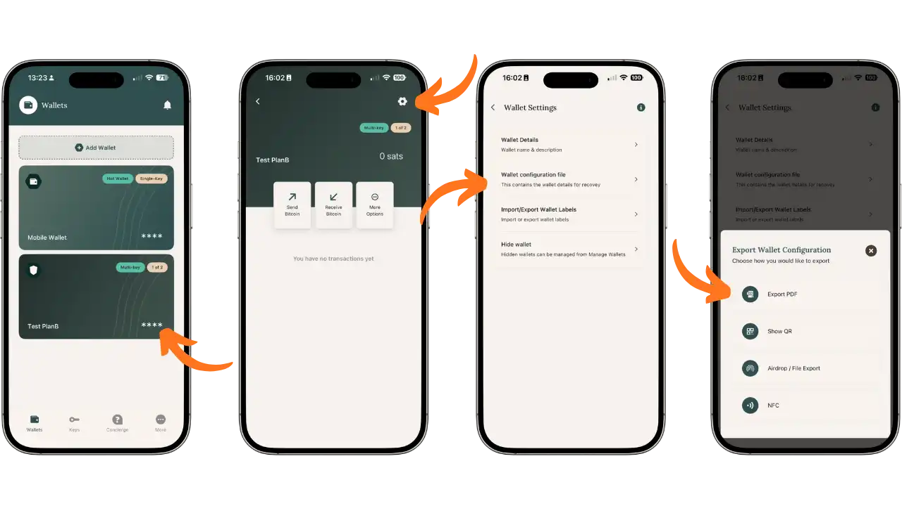

Untuk mengekspor file ini, pilih wallet multisig kamu di tab **Dompet**, lalu tekan ikon Pengaturan berbentuk roda gigi di sudut kanan atas. Di menu "Pengaturan Wallet", ketuk "File Konfigurasi Wallet". Beberapa opsi ekspor tersedia:

- Ekspor PDF**: menghasilkan dokumen PDF yang berisi semua informasi wallet
- Tampilkan QR**: menampilkan kode QR yang dapat dipindai untuk mengimpor konfigurasi ke perangkat lain
- Airdrop / Ekspor File**: mengekspor file melalui opsi berbagi di ponsel kamu
- NFC**: berbagi melalui NFC dengan perangkat yang kompatibel

Simpan file konfigurasi ini terpisah dari seedphrase kamu, idealnya di media yang terenkripsi atau dalam bentuk cetak. Jika kamu kehilangan ponsel, file ini, jika digabungkan dengan seedphrase dari setiap key yang berpartisipasi, akan memungkinkan kamu membangun kembali wallet multisig kamu di Bitcoin Keeper atau di software lain yang kompatibel.

## Praktik terbaik

### Organisasi dana

Susun bitcoin kamu sesuai dengan peruntukannya: gunakan wallet Single-Key untuk pengeluaran harian dengan jumlah terbatas, dan satu atau beberapa Vault Multi-Key untuk penyimpanan jangka panjang. Pelabelan UTXO yang konsisten akan membantu kamu melacak asal dana, yang sangat berguna untuk menjaga privasi dan menghindari pencampuran koin dari sumber yang berbeda.

Jaga keamanan ponsel kamu dengan serius: aktifkan kunci biometrik, lakukan pembaruan sistem secara rutin, dan tetap waspada terhadap aplikasi yang terpasang. Pastikan juga Bitcoin Keeper selalu diperbarui dengan patch keamanan terbaru.

### Keamanan cadangan

Simpan setidaknya dua salinan dari setiap seedphrase di atas kertas dan letakkan di lokasi yang terpisah secara geografis. Untuk jumlah yang besar, pertimbangkan untuk mengukirnya pada media logam yang tahan terhadap bencana. Jangan pernah menyimpan seedphrase di perangkat yang terhubung ke internet, dan jangan pernah memotretnya.

Untuk Vault multisig, simpan juga file konfigurasi, yaitu Wallet Recovery File, yang berisi public key yang berpartisipasi dan struktur vault. File ini, jika digabungkan dengan seedphrase dari setiap key, memungkinkan wallet dibangun kembali di software yang kompatibel seperti Sparrow atau Specter.
`

## Keuntungan dan keterbatasan

### Sorotan

- Aplikasi khusus Bitcoin mengurangi kompleksitas dan risiko
- Integrasi asli Vaults multisig dengan panduan langkah demi langkah
- Dukungan perangkat keras wallet yang diperluas (Tapsigner, Coldcard, Ledger, Jade, dll.)
- Manajemen lanjutan UTXO dan kontrol koin
- Dapat dihubungkan ke server Electrum pribadi
- Kode open-source dan dapat diaudit

### Kendala yang perlu dipertimbangkan

- Interface terutama dalam bahasa Inggris
- Beberapa fitur premium (Cloud Backup, Assisted Server) memerlukan peningkatan
- Konfigurasi Multisig memerlukan pelatihan awal

## Kesimpulan

Bitcoin Keeper menonjol sebagai solusi yang skalabel untuk mengelola bitcoin kamu. Pendekatannya yang progresif, dari wallet sederhana hingga Vault multisig, memungkinkan tingkat keamanan ditingkatkan seiring perubahan kebutuhan. Kemampuan untuk mengintegrasikan hardware wallet dengan mudah, seperti Tapsigner, membuka jalan bagi konfigurasi yang kuat tanpa kompleksitas berlebihan.

Fokus khusus pada Bitcoin, kode sumber yang open source, serta penghormatan terhadap privasi menjadikannya pilihan yang selaras dengan nilai-nilai inti ekosistem Bitcoin.

Tutorial ini mencakup fitur-fitur utama Bitcoin Keeper dalam versi gratisnya. Aplikasi ini juga menawarkan fitur premium seperti Cloud Backup, Assisted Server Backup, dan Canary Wallet, yang akan dibahas dalam tutorial terpisah. Dalam panduan selanjutnya, kita juga akan membahas fitur Perencanaan Warisan, yang memungkinkan kamu mempersiapkan pengalihan bitcoin kepada orang-orang yang kamu cintai melalui Brankas yang Disempurnakan dan dokumen pendukung yang terintegrasi langsung di dalam ap

## Sumber referensi

- Situs web resmi: [bitcoinkeeper.app](https://bitcoinkeeper.app)
- Pusat Bantuan: [help.bitcoinkeeper.app](https://help.bitcoinkeeper.app)
- Kode sumber: [github.com/bithyve/bitcoin-keeper](https://github.com/bithyve/bitcoin-keeper)
- Telegram : [t.me/BitcoinKeeper](https://t.me/BitcoinKeeper)
- Twitter/X: [@bitcoinkeeper_](https://x.com/bitcoinkeeper_)
