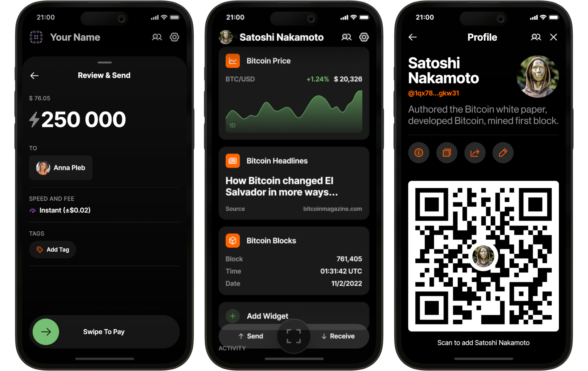

Bitkit (https://www.bitkit.to) 是一款简单但功能强大的自托管钱包。随时随地向任何人付款。

Bitkit 是一款自托管式移动钱包，让您真正掌控自己的比特币，并可随心所欲地支配。Bitkit 拥有卓越的功能和简洁的设计，让您随时随地向任何人进行即时支付。同时，它完全开源，任何人都可以进行审计。

上面的视频教程是比特基特钱包的 20 分钟综合指南.

## 指南

Bitkit 真的非常易用。

作为一款功能齐全的比特币钱包，Bitkit 包含了您所需的所有功能：

即时支付：无需再在链上交易和闪电网络交易之间来回切换钱包。Bitkit 将两者无缝融合。

余额管理：轻松在您的储蓄账户和消费账户之间转移资金，确保您始终有足够的余额进行即时支付。

助记词：在任何支持 BIP 39 的钱包中恢复您的储蓄账户余额。

自动备份：钱包中的非敏感数据会自动备份，以便您随时恢复消费余额。

详细的交易记录：添加联系人并标记您的交易，让它们井然有序。

Bitkit 还拥有一些独特的功能，使其脱颖而出：

可付款联系人：没有索要地址或发票的麻烦。只需将好友添加到联系人列表即可付款。

动态小部件：使用趣味十足的小部件，为您的钱包主屏幕增添一丝乐趣和实用性。

社交资料：掌控您的公开资料和链接，让您的联系人可以随时联系您并付款。

无密码账户：登录支持 Slashtags 或 Lightning 身份验证的网站。

快速支付：为低于 50 美元的 Lightning 付款设置自定义限额，任何低于此限额的发票都将立即支付——无需刷卡，无需等待。非常适合买咖啡或分摊账单。

购物：直接在 Bitkit 中使用比特币支付 Netflix、Airbnb、杂货、移动数据等费用。

没有银行。没有摩擦。

## BitKit 入门指南：分步教程

### 1.安装 BitKit

- 打开 App Store（iOS）或 Google Play（安卓）。
- 搜索 "BitKit"，确认看到官方橙色品牌图标。
- 点 "Get" 或 "Install"，下载完成后点打开应用程序。

提示：如果您发现任何冒牌应用程序，请仔细检查其发布者。BitKit 由 Synonym Software Ltd. 发布。

### 2.首次启动和条款

- 启动 BitKit，同意使用条款，然后点击 ”Continue“。
- 点击 "Get Started" 开始学习如何使用 

暂时忽略 Restore Wallet；我们将创建一个新的钱包。

### 3.备份您的钱包助记词

- BitKit 是自我保管的，所以这十二个字的种子助记词是您唯一的恢复钱包方法。
- 出现提示时点按 ”Back Up Now“。
- 将这十二个单词写在纸上，离线保存在安全的地方。
- 按要求确认文字，然后点 “Save”。

警告：如果您丢失该种子助记词，就会失去比特币。没有 ”重置“ 按钮。

### 4.储蓄账户与支出账户

BitKit 会自动创建两个账户：
- 储蓄账户：比特币基准层面，容量更大、更慢、更安全的转账。
- 支出：闪电网络，适合小额、即时的日常支付

您可以使用主屏幕顶部的选项卡切换。

### 5.接收链上比特币（储蓄）

- 选择 “Savings”
- 点 “Receive” 以生成新的比特币地址。
- 分享二维码或复制地址并发给发送者。

资金将在一个确认后出现（彩纸会出现）。

### 6.接收闪电信号（支出）

选择 "Spending"，然后点击 "Receive"。

- 输入金额（例如 10 000 聪），然后点击 “Continue”。
- BitKit 将估算打开通道的费用（流动性要求）。
- 点击 “Continue” 以生成闪电发票。

让发送者扫描或粘贴发票。资金结算只需几秒钟。

### 7.发送闪电付款

- 点击扫描图标，扫描闪电发票或粘贴。
- 如需，请输入金额，然后点击 Continue。
- 检查手续费，并添加一个可选的记账标签。
- 拖动以支付，输入密码，然后支付就完成了。

交易详情（包括费用和时间锁）将显示在 Activity 中。

### 8.创建个人资料和联系人

- 点击左上角的头像。
- 输入显示名称并选择个人照片。
- BitKit 会显示您的个人二维码。朋友可以扫描它来添加您。
- 接受或拒绝联系人向您付款的请求。

添加联系人后，只需在 Contacts 中轻点其姓名，即可发送或请求聪/比特币。

### 9.探索小工具（Widgets）

从主屏幕上前往 Widgets 部分。轻按齿轮图标以添加或编辑以下工具：

- Bitcoin Price Ticker - 最多可选择四种法定货币，并设置时间范围（日、周、月、年）。
- News Feed - 来自权威比特币媒体的头条新闻。
- Bitcoin Facts - 为初学者提供的简明易懂的比特币知识。
- Calculator - 即时转换比特币和法币。
- Weather Widget – 显示网络费用“天气”，指示链上交易的良好时机（晴天表示网络拥堵程度低）。

### 10.使用比特币购物

BitKit 与 Bitrefill 集成，可用于购买礼品卡、充值话费等。

- 点击底部导航栏中的 “Shop”。
- 选择“Gift Cards”，然后选择商家（例如 Bitrefill）。
- 选择金额（最低 1 美元），添加收件邮箱，然后点击 “Checkout”。
- 滑动支付。礼品卡代码将在几秒钟内通过电子邮件发送给您。

### 11.快速支付

快速支付自动确认低于自定义限额（默认为 50 美元）的闪电发票。

- 前往 Settings → General → Quick Pay。
- 设置阈值并启用开关。
- 咖啡等小额消费不再需要滑动支付。

### 12.安全与隐私

- PIN Code（PIN 码）- 在 "Settings" → "Security & Privacy" 下启用，并设置一个六位数的密码。
- Biometrics（生物识别） - 切换 Face ID 或指纹解锁。
- Auto-Lock（自动锁定）- 选择超时时间（例如，90 秒无操作）。

支付时需要输入 PIN 码——让您更加安心。

### 13.管理闪电通道

通道是什么？

通道是持有流动性的双方“隧道”，分为

- 支付额度（Outbound Liqudity）- 您的比特币，用于发送。
- 收款额度（Inbound Liquidity）- 交易对手的比特币，用于接收。

从 Savings 账户转账到 Spending 账户：

- 打开 “Savings”，轻点 “Transfer to Spending”。
- 输入金额（例如 25 000 ₿，₿ 为聪），然后点击 “Continue”。
- 确认费用并等待链上交易确认。

一旦打开，支出余额和接收容量就会更新。

查看或关闭通道：
- 前往 Settings → Advanced → Lightning Connections
- 轻点连接即可查看状态、余额和费用。
- 如果要关闭连接并将资金返回到 Savings 账户中，请滚动到 Close Connection。

注意：出于监管原因，BitKit 的总流动性仅限于价值约 990 欧元的比特币。

### 14.高级功能

Coin Selection - 选择特定的 UTXO 输入进行隐私或费用控制（Settings → Advanced → Coin Selection）。

Transaction Speed（交易速度） - 选择慢速、正常或快速链上手续费。

Local Currency（本地货币） - 在 "Settings”→ "General" 从美元切换到任何主要法定货币。

## 结论

您已安装 BitKit，保存了助记词，掌握了闪电支付，甚至购买了第一张礼品卡。BitKit 的设计让强大的比特币工具操作起来非常直观，同时您始终掌握着密钥。立即下载 BitKit，真正持有您的比特币。如有任何疑问或反馈，请通过社交媒体或应用内支持链接联系 BitKit 团队。

关于比特币买卖的说明：BitKit 不支持比特币的买卖。如需买卖比特币，请使用 Bitfinex 等交易所，然后通过 Bitkit 进行收付款。
