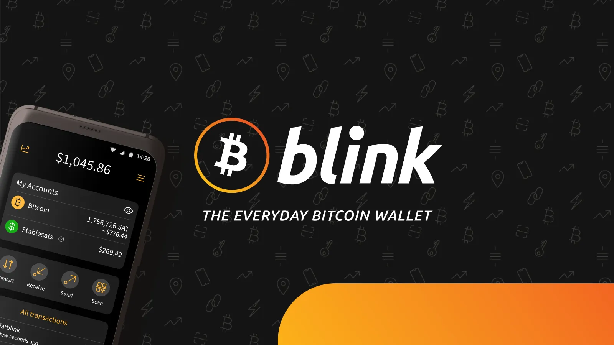
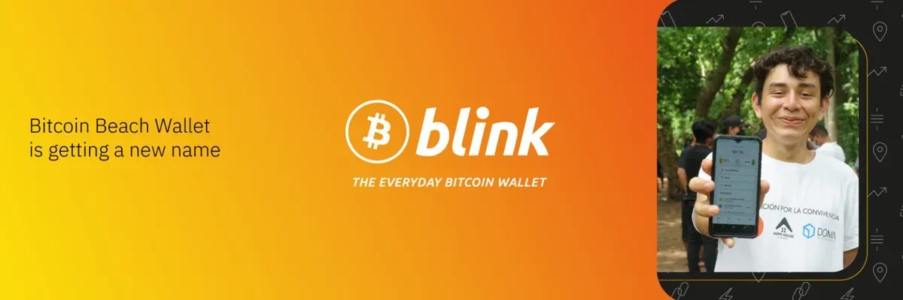
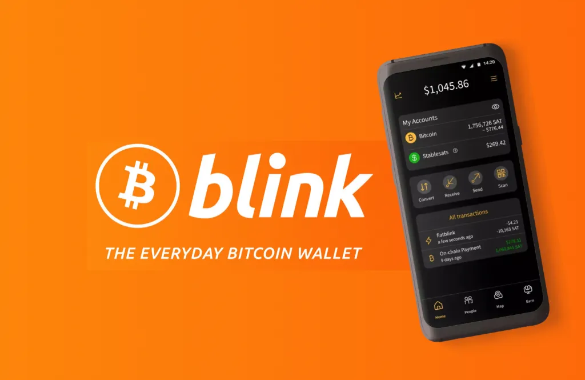
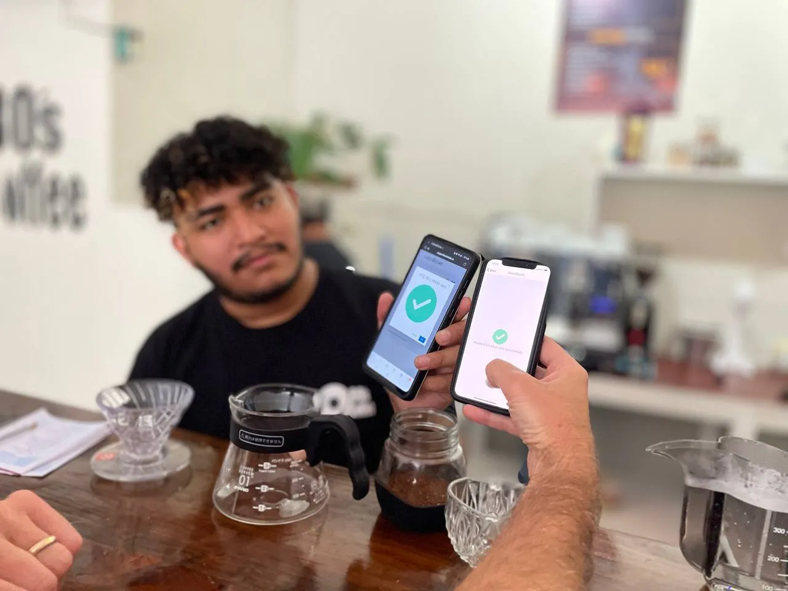

## Apa itu Blink Wallet?

Lupakan semua yang kamu pikir kamu tahu tentang dompet Bitcoin yang rumit. Blink adalah iPhone-nya dompet Bitcoin.

Sebelumnya dikenal sebagai Bitcoin Beach Wallet, Blink adalah aplikasi seluler yang mudah digunakan yang membawa Bitcoin ke semua orang, di mana pun di dunia. Aplikasi ini awalnya dibuat untuk komunitas Bitcoin Beach (https://bitcoinmagazine.com/business/Bitcoin-beach-Wallet-renamed-to-blink) di El Salvador, dan sekarang membantu orang di seluruh dunia untuk mengirim, menerima, dan menggunakan Bitcoin dengan mudah.

Baik kamu baru mengenal Bitcoin atau pengguna berpengalaman, panduan ini akan membimbingmu melalui semua hal yang perlu kamu ketahui untuk memulai.

### Fitur Utama:

- Dukungan Mata Uang Ganda: Memegang Bitcoin (BTC) dan Stablesats (setara USD) dengan mudah  
- Lightning Network: Transaksi Bitcoin yang cepat dan murah  
- Kurs yang stabil: Jaga kestabilan nilai kamu dalam USD saat menggunakan jaringan pembayaran Bitcoin  
- Penyiapan Sederhana: Hanya perlu nomor teleponmu  
- Peta Pedagang Global: Temukan bisnis yang menerima Bitcoin  

Bagian yang paling seru? Kamu bisa beralih antara "Aku ingin memegang Bitcoin karena aku pikir harganya akan naik" dan "Aku hanya ingin dolar yang stabil untuk uang kopi-ku" hanya dengan satu ketukan.

## Prasyarat

Sebelum memulai, kamu perlu:

- Smartphone (iOS atau Android)
- Nomor telepon (untuk verifikasi)
- Akses internet

## Pengaturan Awal

Inilah yang mengejutkan banyak pengguna: Menyiapkan Blink lebih cepat daripada membuat akun media sosial karena tidak ada dokumen, tidak ada unggahan identitas, dan tidak perlu menunggu. Hanya cepat dan mudah.

**Seluruh proses:**

- Unduh Blink Wallet
 - Cari "Blink Wallet" di [App Store](https://apps.apple.com/ng/app/Bitcoin-beach-Wallet/id1531383905) (iOS), [Google Play](https://play.google.com/store/apps/details?id=com.galoyapp) (Android) atau [App Gallery](https://appgallery.huawei.com/app/C105387593) (Huawei), tergantung perangkat kamu.
 - Kamu juga dapat mengunduhnya secara langsung dari [situs web Blink Wallet](https://blink.sv).
- Membuat Wallet
 - Ketuk "Buat Wallet Baru"
 - Menyetujui syarat dan ketentuan
 - Masukkan nomor telepon kamu
 - Verifikasi menggunakan SMS atau WhatsApp untuk menerima kode kamu
 - Masukkan kode untuk memverifikasi
- Selesai, itu saja.
 - Nomor telepon menjadi login kamu. Selesai.

## Memahami Wallet Interface kamu

Ketika kamu membuka [Blink Wallet](https://blink.sv/) untuk pertama kalinya, kamu akan melihat sesuatu yang bersih dan menyegarkan. Tidak ada grafik yang meneriaki kamu, tidak ada angka yang berkedip, hanya saldo dan beberapa tombol sederhana.

### Ikhtisar Layar Utama

- Saldo Total: Menunjukkan nilai gabungan dari saldo Bitcoin dan USD
- Saldo Rekening:
 - Bitcoin: Ditampilkan dalam Sats (unit Bitcoin terkecil)
 - Dolar:  Nilai Anda stabil dalam USD

- Tombol Aksi: Empat tombol yang perlu Anda ketahui.
 - Mengonversi
 - Menerima
 - Kirim
 - Pindai QR
- Riwayat Transaksi: Semua transaksi Anda sebelumnya
- Grafik Harga: Pelacakan harga Bitcoin (ketuk ikon grafik)

### Pengaturan Penting & Cara Mengatur Lightning Address Anda

#### Menyiapkan Lightning Address Anda

- Buka Pengaturan → Lightning Address kamu
- Pilih Address khusus kamu (misalnya, "yourname@pay.blink.sv")
- Ini menjadi Bitcoin Address permanen kamu yang dapat digunakan siapa saja untuk mengirimi kamu uang

#### Pengaturan Lain untuk Dikonfigurasi:

- Mata Uang Default: Memilih bagaimana saldo ditampilkan
- Akun Default: Pilih ke mana dana yang masuk masuk
- Atur Email kamu: Menambahkan email untuk pemulihan masuk
- Keamanan Pada Perangkat: Mengaktifkan PIN atau biometrik
- Batas Transaksi:
 - Menerima: Tidak terbatas
 - Penarikan: $2.000/hari
 - Transfer Wallet ke Wallet: $4.000/hari

## Cara Menerima Bitcoin Menggunakan Blink Wallet

### Metode 1: Kode QR (Paling Umum)

- Ketuk "Terima" pada layar beranda Blink Wallet.
- Pilih mata uang yang ingin diterima:
 - Bitcoin (BTC), atau
 - USD (Stablesats)
- Untuk meminta jumlah tertentu:
 - Ketuk "Tetapkan Jumlah"
 - Masukkan jumlah yang ingin kamu terima
 - Bagikan kode QR atau tautan pembayaran yang dihasilkan dengan pengirim
- Untuk memungkinkan jumlah yang fleksibel (tidak ada nilai yang ditetapkan):
 - Lewati langkah "Tetapkan Jumlah"
 - Cukup bagikan kode QR
 - Pengirim memutuskan berapa banyak yang akan dikirim
 - Pengirim memutuskan berapa banyak yang akan dikirim

### Metode 2: Petir Address

- Bagikan Lightning Address (yourname@pay.blink.sv) kamu dengan siapa pun
- Mereka dapat mengirim Bitcoin secara langsung hanya dengan menggunakan Address ini
- Tidak perlu kode QR atau faktur
- Dapat digunakan dengan Wallet yang kompatibel dengan Lightning

### Metode 3: On-Chain Bitcoin (Tradisional)

- Di layar penerimaan, ketuk "Onchain"
- Gunakan ini untuk transaksi Bitcoin tradisional
- Catatan: Biaya lebih tinggi dan waktu konfirmasi lebih lambat
- Terbaik untuk jumlah yang lebih besar atau ketika Lightning tidak tersedia

## Cara Mengirim Bitcoin Menggunakan Blink Wallet

### Mengirim dengan Kode QR

- Ketuk "Kirim" pada layar utama
- Ketuk ikon kamera untuk memindai kode QR
- Pilih akun mana yang akan digunakan untuk mengirim (Bitcoin atau USD)
- Tinjau jumlah dan biaya
- Konfirmasikan pembayaran

### Mengirim dengan Permintaan Pembayaran/Faktur

- Ketuk "Kirim"
- Menempelkan permintaan pembayaran (disalin dari teks/email)
- Ikuti langkah-langkah yang sama seperti pengiriman kode QR

### Mengirim ke Alamat Lightning

- Ketuk "Kirim"
- Ketik atau tempelkan petir Address (terlihat seperti email)
- Masukkan jumlah yang ingin kamu kirim
- Pilih akun pengirim kamu dan konfirmasikan

### Mengirim ke Pengguna Blink Lainnya

- Tidak ada biaya saat mengirim ke pengguna Blink Wallet lainnya
- Penerima secara otomatis menjadi kontak untuk memudahkan transaksi di masa mendatang

## Konversi Antara Bitcoin dan USD dengan Blink Wallet

Salah satu fitur Blink Wallet yang paling hebat adalah kemampuannya yang mulus untuk mengkonversi antara Bitcoin dan Stablesats (USD). Ikuti panduan langkah demi langkah sederhana ini:

- Ketuk tombol "Konversi" pada layar utama
- Pilih arah konversi:
 - Bitcoin → USD
 - USD → Bitcoin
- Tetapkan jumlah dengan:
 - Masukkan jumlah Bitcoin atau USD tertentu, atau
 - Pilih persentase dari saldo kamu (25%, 50%, 75%, 100%)
- Tinjau tingkat konversi
- Konfirmasikan konversi untuk menyelesaikan proses.

Kasus Penggunaan:

- Konversikan ke USD saat harga Bitcoin turun.
- Konversikan ke Bitcoin jika kamu ingin memegang atau berinvestasi jangka panjang.
- Lakukan pembelanjaan dalam USD untuk menghindari volatilitas harga dalam transaksi harian Anda.
- Beralihlah antara BTC dan USD untuk mengambil keuntungan dari pergerakan pasar.

## Fitur Pedagang di Blink Wallet

### Menemukan Bisnis yang Menerima Bitcoin

- Ketuk ikon "Peta" di bagian bawah
- Jelajahi lokasi yang menerima pembayaran Bitcoin
- Ketuk bisnis apa pun untuk:
 - Kirimkan pembayaran secara langsung kepada mereka
 - Dapatkan petunjuk arah melalui Google Maps

### Untuk Pemilik Bisnis: Fitur Kasir

Akses alat bantu pedagang tingkat lanjut di Pengaturan → Cara Mendapatkan Pembayaran:

- Mesin Kasir Kilat:
 - Terminal titik penjualan berbasis web
 - Gunakan di perangkat apa pun dengan browser
 - Membuat faktur untuk jumlah tertentu
- Kode QR yang dapat dicetak:
 - Kode QR generate untuk bisnis kamu
 - Cetak dan tampilkan untuk dipindai oleh pelanggan
 - Tidak ada jumlah yang ditentukan - pelanggan memilih berapa banyak yang akan diberikan untuk tip/bayar

Dapatkan lebih banyak wawasan di [Blink POS](https://www.blink.sv/blog/transform-your-payment-experience-with-the-blink-pos), dan jelajahi sumber daya pedagang yang berharga di [Sumber daya Branding dan Onboarding Blink](https://www.blink.sv/en/brand).

## Belajar dan Menghasilkan Bitcoin menjadi MUDAH dengan Blink

Bagian "Hasilkan" yang terletak di bagian bawah halaman utama, membantu pendatang baru belajar tentang Bitcoin sambil menghasilkan sedikit uang:

- Ketuk "Hasilkan" dari menu bagian bawah
- Pelajaran singkat lengkap tentang Bitcoin
- Menjawab pertanyaan sederhana dengan benar
- Dapatkan Sats untuk setiap pelajaran yang diselesaikan
- Bangun pengetahuan Bitcoin kamu secara bertahap

Topik-topik yang dibahas meliputi:

- Apa itu Bitcoin?
- Bagaimana cara kerja Lightning Network?
- Bitcoin vs uang tradisional
- Praktik-praktik terbaik keamanan

## Resiko Penting yang Perlu Dipertimbangkan

### Sifat Kustodian

Blink adalah kustodian Wallet, yang berarti mereka menyimpan dan mengelola dana milikmu atas nama kamu.

- Kelebihan Penyiapan yang sederhana, Interface yang mudah digunakan, tersedia dukungan pelanggan
- Kekurangan: kamu tidak mengontrol [kunci pribadi] milikmu (https://www.blink.sv/blog/not-your-keys-not-your-coins), yang berarti kamu mengandalkan Blink untuk mengelola dana milikmu

### Batas Transaksi

- Ada batas harian
- Batas dapat ditingkatkan berdasarkan permintaan
- Pertimbangkan opsi penyimpanan mandiri untuk jumlah yang lebih besar

### Pertimbangan Privasi

- Nomor telepon yang diperlukan untuk pembuatan akun
- Riwayat transaksi disimpan di server Blink, yang mungkin tidak sesuai dengan semua preferensi privasi

## Mendapatkan Hasil Maksimal dari Blink Wallet

### Praktik Terbaik:

- Mulailah dari yang kecil - Berlatihlah dengan jumlah kecil terlebih dahulu
- Gunakan alamat Lightning - Bagikan Address kamu secara publik untuk pembayaran yang mudah
- Pahami perbedaannya - Ketahui kapan harus menggunakan Lightning vs On-Chain
- Teruslah belajar - Gunakan bagian penghasilan untuk membangun pengetahuan Bitcoin
- Pertimbangkan kebutuhan - Evaluasi apakah solusi kustodian sesuai dengan kasus penggunaan 

### Kapan Menggunakan Setiap Fitur:

- Keseimbangan Bitcoin: Untuk penyimpanan/penumpukan jangka panjang
- Saldo USD: Untuk uang belanja yang stabil, menghindari volatilitas
- Pembayaran Lightning: Untuk transaksi yang cepat dan murah
- Pembayaran On-Chain: Untuk jumlah yang lebih besar atau ketika Lightning tidak tersedia

## Mendapatkan Bantuan dan Langkah Selanjutnya

### Jika Anda Membutuhkan Dukungan:

- Lihat dokumentasi dan [FAQ] Blink (https://faq.blink.sv/)
- Hubungi dukungan pelanggan melalui aplikasi
- Periksa [Halaman dukungan Blink](https://www.blink.sv/en/support)
- Bergabunglah dengan [komunitas Blink Telegram](https://t.me/blinkbtc) untuk pertanyaan umum

### Memajukan Perjalanan Bitcoin kamu:

Setelah kamu merasa nyaman dengan Blink, mungkin kamu ingin menjelajah:

- Dompet penitipan mandiri untuk jumlah yang lebih besar
- Menjalankan node Lightning kamu sendiri
- Dompet perangkat keras untuk penyimpanan jangka panjang
- Fitur Bitcoin yang lebih canggih

## Pendapat Akhir: Sederhana, Bertenaga, dan Siap Digunakan Sehari-hari

[Blink Wallet](https://blink.sv/) menyediakan titik masuk yang sangat baik ke dalam dunia Bitcoin. Kombinasi kemudahan penggunaan, dukungan mata uang ganda, dan integrasi [Lightning Network](https://www.blink.sv/blog/what-is-the-lightning-network) membuatnya ideal untuk:

- Bitcoin pemula
- Pengeluaran dan penerimaan harian
- Transaksi kecil hingga menengah
- Mempelajari tentang Bitcoin
- Bisnis yang menerima pembayaran Bitcoin

Meskipun Blink Wallet dirancang untuk kemudahan dan kenyamanan, sebaiknya pikirkan apa yang terbaik untuk kamu, apakah itu privasi, kontrol, atau batas transaksi. Setelah kamu merasa nyaman dengan Bitcoin, kamu bisa menjelajahi opsi wallet lainnya yang sesuai dengan kebutuhanmu.

Blink Wallet mudah digunakan dan dibuat untuk pembayaran di dunia nyata. Cobalah, jelajahi fitur-fiturnya, dan kembangkan kepercayaan diri serta pemahamanmu tentang Bitcoin melalui penggunaan praktis.
