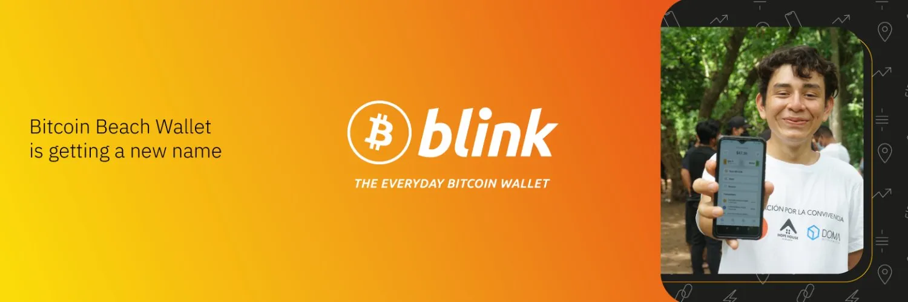

Bitcoin Beach Wallet đang được đổi tên và bổ sung nhiều tính năng mới
BBW là một ví Lightning giữ hộ (custodial) mã nguồn mở, ra đời tại Bitcoin Beach và được thiết kế để xây dựng cộng đồng. Sắp tới, nó sẽ được gọi là Blink.

## Video hướng dẫn

## Hướng dẫn viết

Chưa có hướng dẫn nào cho đến nay, hãy giúp đỡ bằng cách tạo ra nó :D
