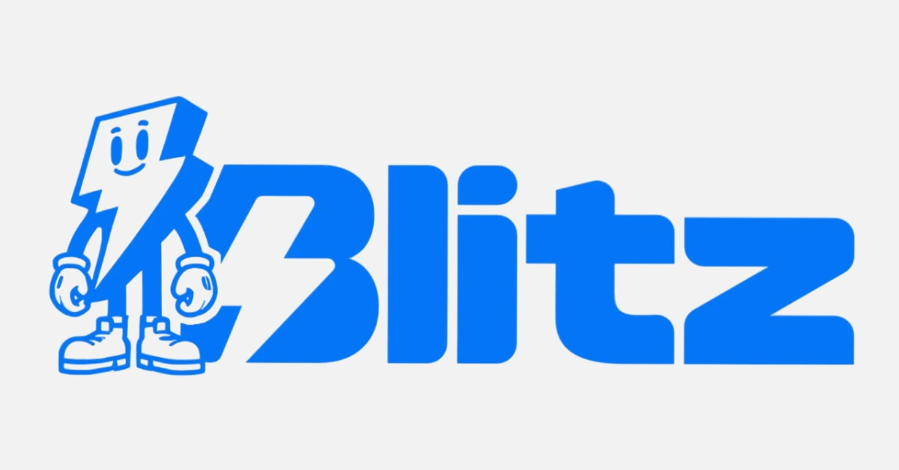

Pengalaman pengguna adalah salah satu faktor yang menentukan ketika memulai menggunakan Wallet. Dalam tutorial ini, aku akan memperkenalkan kamu pada Wallet yang menjadikan pengalaman penggunanya sebagai faktor penentu: Blitz Wallet menawarkan dompet Bitcoin yang paling sederhana sekaligus salah satu dompet Bitcoin terlengkap yang bisa kamu temukan.

## Apa itu Blitz Wallet?

Blitz Wallet adalah dompet Bitcoin self-custody yang kode sumbernya tersedia (Open Source), berfokus pada kedaulatan kamu dan pengalaman pengguna yang membuatnya mudah dipahami.

[Blitz Wallet](https://blitz-Wallet.com/) adalah Wallet seluler yang tersedia di Android (Play Store) dan iOS (App Store).

⚠️**PENTING**: Mengunduh Bitcoin Wallet di platform resmi penting untuk memverifikasi keaslian aplikasi dan, lebih jauh lagi, memperkuat keamanan dana kamu.

Dalam tutorial ini, kita akan mendasarkan diri pada versi Android Blitz Wallet, tetapi semua proses yang disajikan di bawah ini, juga berlaku pada iOS.

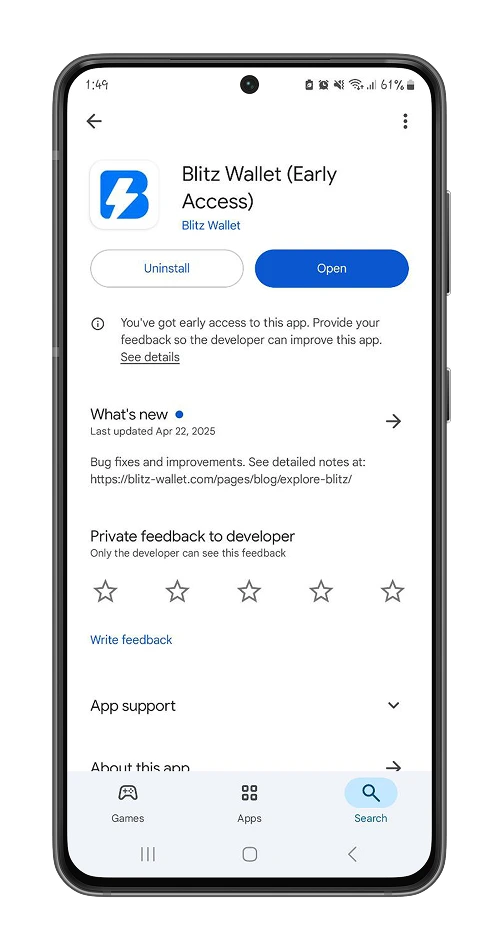

Karena Blitz Wallet adalah portofolio mandiri Bitcoin, kamu dapat memilih untuk membuat portofolio baru atau mengimpor seedphrase 12/24 dari portofolio yang sudah kamu miliki.

Di sini, kita mulai dengan pembuatan portofolio baru. Lihat di bawah ini untuk rekomendasi kami tentang cara mencadangkan seedphrase kamu.

https://planb.academy/tutorials/wallet/backup/backup-mnemonic-22c0ddfa-fb9f-4e3a-96f9-46e2a7954270

❗**PENTING**: Kata-kata pemulihan 12/24 ini sangat penting untuk mengakses bitcoin kamu. Jika kamu kehilangannya, kamu tidak akan lagi diizinkan untuk membelanjakan bitcoin kamu.

Bukan kunci kamu, bukan bitcoin kamu.

Kemudian buat kode PIN untuk mengautentikasi akses ke Wallet kamu.

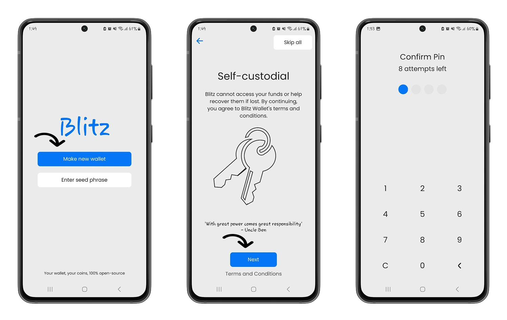

## Memulai dengan Blitz

Trading dengan Blitz lebih intuitif daripada kebanyakan dompet Bitcoin lainnya.

Pada menu Wallet, kamu memiliki Interface minimalis yang hanya berfokus pada aksi utama:

### Menerima bitcoin

Untuk menerima bitcoin di Blitz Wallet, klik ikon "Panah Bawah", masukkan jumlah satoshi yang ingin kamu terima dan Wallet akan membuat Invoice untuk Akamu bagikan kepada pengirim.

⚠️ **CATATAN**: Satoshi (atau "sat") mewakili unit terkecil dari Bitcoin: 1 Bitcoin = 100.000.000 satoshi

Salah satu fitur khusus Blitz Wallet adalah mendukung jaringan dan saluran yang berbeda dari ekosistem Bitcoin:

- **Lightning Network**: Salah satu overlay Bitcoin yang memungkinkan kamu melakukan transaksi mikro secara instan.

- **Bitcoin Mainnet**: Rantai utama protokol Bitcoin, cocok untuk transaksi bernilai besar.

- **Liquid Network**: Rantai paralel untuk Bitcoin Mainnet yang dikembangkan oleh BlockStream yang menggunakan Bitcoin Liquid untuk melakukan pengiriman cepat, Confidential Transactions.

https://planb.academy/tutorials/wallet/mobile/blockstream-app-liquid-b3e4fb82-902e-4782-ad2b-a61ab05a543a

Secara default, semua transaksi kamu akan menggunakan Liquid Network, tetapi Blitz memungkinkan untuk menentukan jaringan tempat kamu ingin menerima satoshi dengan mengeklik tombol **Pilih format**.

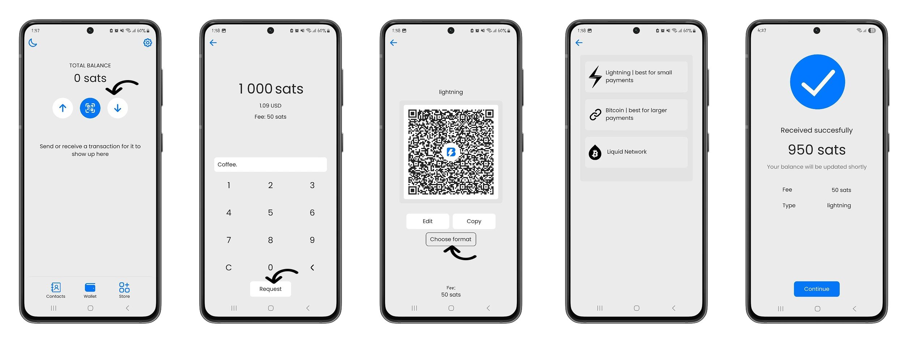

### Membuat kontak dengan Blitz

Blitz Wallet memudahkan kamu untuk mengirim bitcoin dari Wallet.

Di menu **Kontak**, kamu dapat mendaftarkan nama pengguna Blitz atau URL Lightning yang paling sering kamu gunakan untuk berinteraksi.

Ini berarti, kamu bisa mengirim satoshi ke alamat-alamat ini dengan mudah, melewati pemindaian dan tahap entri Address secara manual.

### Kirim bitcoin

Selain metode klasik untuk mengirim Bitcoin (kode QR, entri manual), dengan menggunakan kontak yang sudah didaftarkan sebelumnya di Wallet, kamu dapat mengirim Satss ke penerima hanya dalam tiga klik.

Pada menu **Wallet**, klik tombol "Panah Atas", pilih metode pengiriman bitcoin, lalu masukkan jumlah yang akan dikirim dan lanjutkan dengan konfirmasi.

Jumlah minimum untuk mengirim Bitcoin dalam Blitz Wallet saat ini adalah 1.000 satoshi.

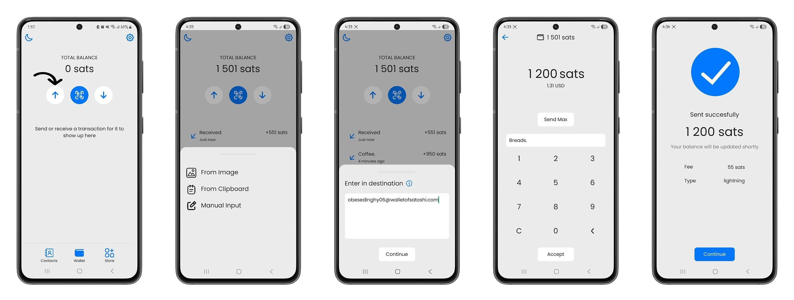

## Toko Blitz

Selain operasi transfer Bitcoin, Blitz Wallet menawarkan sebuah toko di mana kamu bisa menggunakan bitcoin untuk membayar layanan digital.

- **Mengakses layanan kecerdasan buatan**: Gunakan model kecerdasan buatan generatif seperti: Claude 3-5 soneta, gpt-4o, gpt-4o-mini gemini-flash-1.5 dan membayar langsung dalam bitcoin.

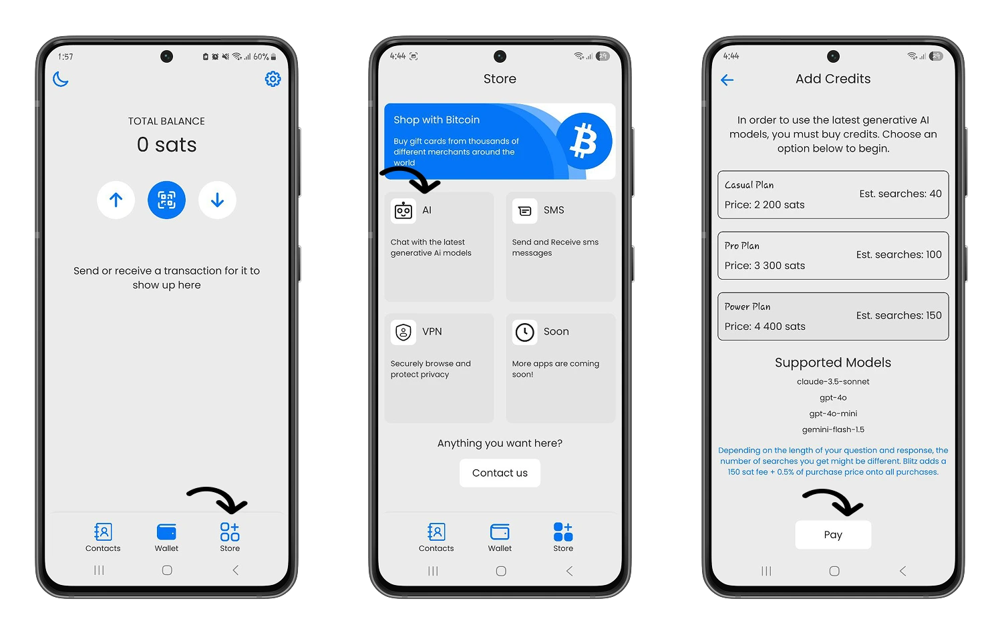

- **Kirim pesan teks ke mana saja di seluruh dunia**: Di toko Blitz, kamu memiliki akses ke layanan GSM yang memungkinkan kamu mengirim pesan teks secara anonim ke mana saja di seluruh dunia, dengan penagihan langsung di Bitcoin.

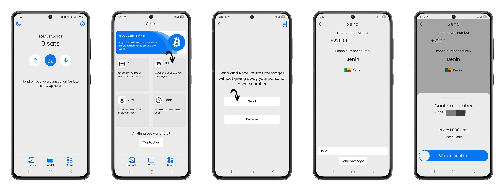

- **Berselancar dalam kerahasiaan total**: Bayar langganan VPN (Virtual Private Network) WireGuard di toko Wallet Blitz dengan bitcoin Anda.

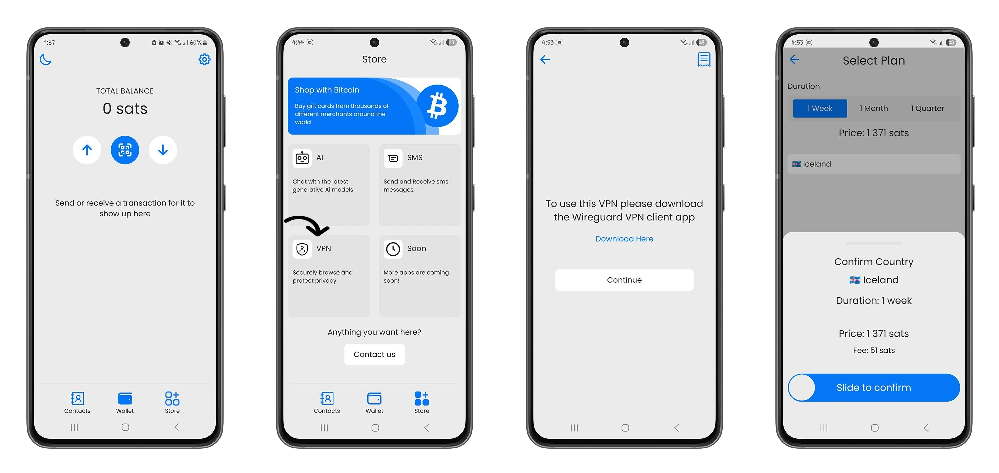

https://planb.academy/tutorials/exchange/centralized/bitrefill-8c588412-1bfc-465b-9bca-e647a647fbc1

https://planb.academy/tutorials/wallet/mobile/speed-wallet-8715e454-1720-4a7f-8c1d-3da02cf67312

## Wallet Blitz di balik layar: Melangkah lebih jauh

Di balik kesederhanaan pengoperasian Blitz Wallet, terdapat banyak sekali kekuatan dan penyesuaian.

Seperti yang telah kami tunjukkan sebelumnya, semua bitcoin yang kamu terima akan menjadi Liquid Network.

Blitz menggunakan microexchanges Liquid Network untuk menampilkan saldo kamu di Satoshi ketika kamu memiliki saldo kurang dari 500.000 satoshi.

Pendekatan ini dibenarkan oleh keinginan untuk memfasilitasi pengalaman awal dan membantu pengguna baru untuk melakukan transaksi di Lightning Network dengan jumlah kecil sesederhana mungkin.

https://planb.academy/tutorials/wallet/mobile/aqua-8e6d7dd3-8c03-45cc-90dd-fe3899a7d125

Kamu dapat melihat rincian saldo di menu **Pengaturan>Info Saldo**.

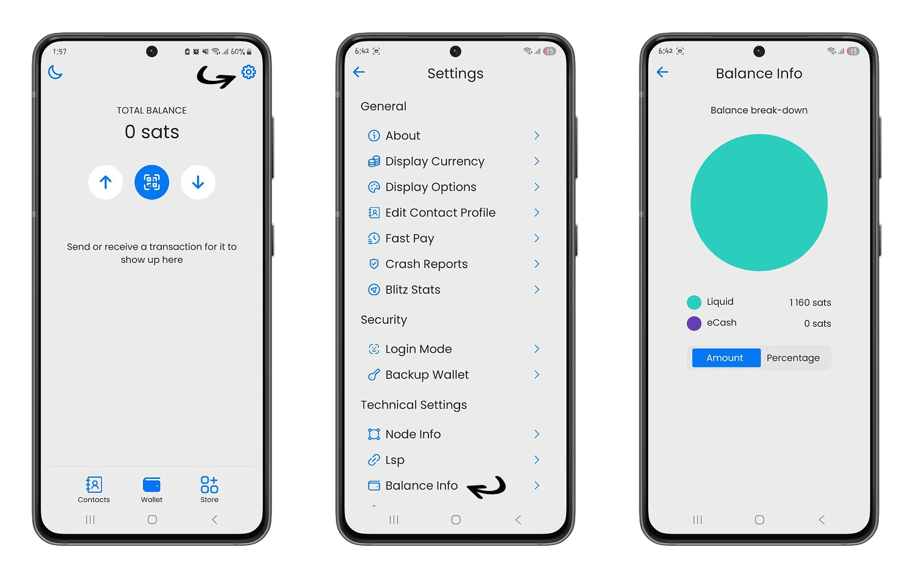

Namun, Blitz Wallet memberi kamu fleksibilitas untuk mengaktifkan mode Lightning, yang secara otomatis akan membuka saluran pembayaran untuk kamu setelah kamu mencapai saldo 500.000 satoshi.

Untuk mengaktifkan mode Lightning, buka **Pengaturan**, lalu di bagian **Pengaturan Teknis**, klik opsi **Info Node**.

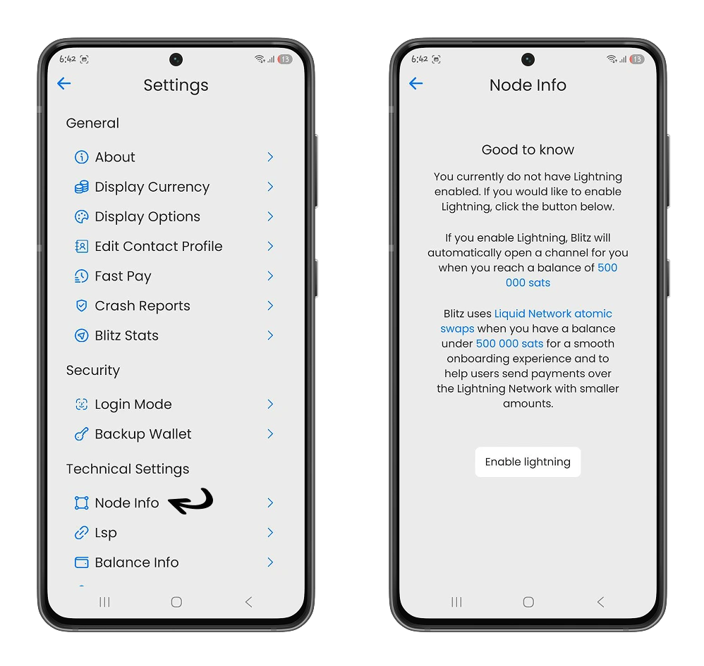

Dengan mengaktifkan mode Lightning, setelah syarat utama terpenuhi (saldo 500.000 satoshi atau 0,005 Bitcoin), kamu akan dapat melakukan transaksi di Lightning Network dan tidak perlu lagi melalui Liquid Network BlockStream.

- **Terima Bitcoin di toko Anda**:

Integrasi pembayaran Bitcoin di toko-toko masih dalam tahap percobaan dengan Blitz Wallet. Kami sarankan kamu menggunakannya dengan hemat.

Di menu **Pengaturan>Poin-of-sale**, kamu dapat mengatur pengenal unik yang terkait dengan toko kamu dan mata uang fiat lokal yang kamu inginkan untuk menerima pembayaran.

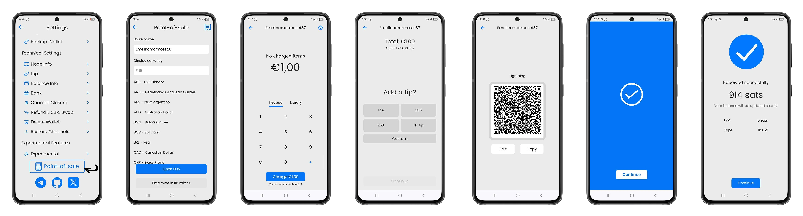

Jika tutorial ini membantu kamu memahami Blitz, aku yakin kamu akan menikmati tutorial Muun Wallet. Temukan Muun, dompet sederhana yang sama kuatnya dengan Bitcoin.

https://planb.academy/tutorials/wallet/mobile/muun-111b56b0-4872-4130-ad2e-e58f8363451d
