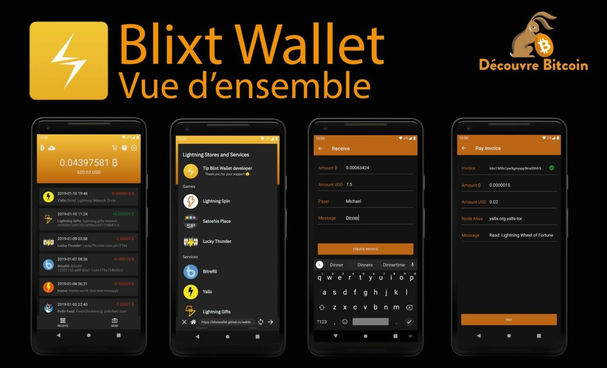

# Blixt BTC ⚡️ LN Wallet/Node

## A powerful BTC/Lightning node in your pocket, wherever you are

I would like to introduce you to an interesting and powerful new BTC/LN mobile node and wallet – Blixt. The name comes from Swedish and means "lightning".

## How did I discover this gem?

I have an Umbrel LND node and I wanted to have a backup plan to quickly restore my node in case of SHTF1. So I found this mobile wallet that allows me to restore the entire funds of the node from SCB backups. Then, I started testing it in more detail and discovered that IT IS A COMPLETE NODE IN YOUR OWN POCKET.

Remember that because it's very important!

> At the end of this article, you will find some simple and quick tutorials on how to use it and how to connect to other nodes.

This is an amazing application on Android and iOS that allows you to run a BTC-LND node, in your own pocket. Incredible, right?! In your own phone, you can have a BTC LN node up and running in less than 10 minutes, with rich features for experienced users but also for new users or those who are not so tech-savvy because the usage is simple and seamless.

Blixt Wallet is an open-source project under the MIT license and it focuses on a niche of users who want to get started with BTC/LN but don't have the means to run a full machine or simply want to run a mobile node.

Links

Here are some links about this new node/wallet application:

> Official website – with a lovely interactive demo as well
>
> GitHub repository – check the development stage and/or download the source code
>
> Telegram support group – where you can ask questions directly to the developer and the community
>
> Download Blixt Android application
>
> Download Testflight application for iOS
>
> Twitter feed with demos

# Key features available

## Neutrino Node

Blixt connects by default to Blixt's server to synchronize blocks and index with Neutrino (SPV mode for Simplified Payment Verification), but the user can also connect to their own node. It is surprising to see that synchronizing an SPV node takes less than 5 minutes, in my case on Android 11, to be ready to use the full node wallet (on-chain and LN).
'Complete Non-Custodial Node

The user can manage their own channels with an easy-to-use interface and with enough displayed information to have a good experience. In the top left drawer menu, you can go to the Lightning channels to start opening with other nodes, as you wish. Don't forget to enable Tor in the settings. It's much better for privacy and also because as a mobile node, if you change your internet connection / clearnet IP frequently, your peers may be disrupted. With the Tor node URI, you will always have the same private identifier regardless of your location / IP.

## Backup/Restore an LND Node

A powerful, easy-to-manage, and useful feature is restoring other dead LND nodes, with just the 24-word seed list and the channels.backup file.

> Here is a guide on how to restore dead Umbrel nodes in Blixt in case of SHTF.

The user also has the option to save the Blixt channel backup to Google Drive and/or local storage on their own mobile device (to later move it to a safe place, away from your phone).

The restoration process is quite simple: insert the 24-word seed, add the backup file (previously copied to the mobile memory), and click restore. It will take some time to synchronize and scan all the blocks for your past transactions. The channels will be automatically closed and the funds returned to your on-chain wallet (see the top left drawer menu - on-chain).

> If you previously had open channels with your old node behind Tor, you must first enable the Tor option (and restart the application) from the menu settings. This way, the closing procedure will not fail and/or the forced closing option will not be used.

Remember to backup your LN channels after opening and/or closing channels. It only takes a few seconds to be safe. Later, you can move the backup file to a safe place away from your mobile device.
To test your seed in a restoration scenario, before adding funds, simply use the same 24-word seed (aezeed) in BlueWallet. If the generated BTC address is the same in Blixt, you are good to go. No need to use BlueWallet after that, you can simply delete the tested wallet for restoration.
Built-in Tor'
Once you have activated it, the application will restart behind the Tor network. From this point on, you can see in the menu settings your node ID with an onion address, so that other nodes can open channels to your small Blixt mobile node. Or let's say you have your own node at home and you want to have small channels with your Blixt mobile node. A perfect combination.

## Dunder LSP - Liquidity Service Provider

A simple and fantastic feature that offers new users the ability to start accepting BTC on the Lightning Network immediately, without the need to deposit funds on-chain and then open LN channels.

For new users, this is great news because they are supposed to be able to start from scratch, directly on LN. To do this, simply create an LN invoice from the main screen on the "receive" button, enter the amount, description, etc., and pay from another wallet. Blixt will open a channel of up to 500k sats per transaction received. You can open multiple channels if necessary.

An interesting and useful case is as follows: let's say your first received amount is 200k. Blixt will open a 500k sats channel with already 200k (minus opening fees) on your side, but since you still have 300k "space" available, you can receive more. So the next payment, let's say 100k, will arrive directly through this channel, without additional fees, and you still have 200k space to receive more.

But if you choose to receive, let's say, 300k for the third payment, it will create another new 500k channel and push these 300k to your side.

If there are too many requests, the Blixt node can adjust the channel capacity during opening.

## Automatic Channel Opening

In the settings, the user can activate this option and have an automated service that opens channels with the best nodes and routes based on the available balance in the on-chain wallet of the Blixt application. This is a beneficial feature for new users who are not sure which node to open a channel with and/or how to open an LN channel. It's like an autopilot for LN.

> Remember: this option is used only once, when you create your new Blixt wallet, and is enabled by default. So if the new user scans the on-chain QR code on the main screen and deposits their first sats to that address, Blixt will automatically open a channel with those sats, with the Blixt public node.

## Incoming Liquidity Services

Feature dedicated to merchants who need more INCOMING liquidity, easy to use. To do this, simply select one of the liquidity providers from the list, pay the amount you want for the channel, and provide your node ID, and from there, a channel will open to your Blixt node.

## Contact Lists

Useful feature if you want to have a durable list of recipients with whom you trade most of the time. This list can consist of LNURLs, Lightning addresses, or future static payment information/invoices. For now, this list cannot be saved outside the application, but there are plans to have an option to export it.

## Send to a Lightning address

You can send to any LN address if it is not in your contact list. Soon, perhaps an option to have your own LN address of the @blixtwallet.com type.

LNURL support

You can scan/pay/connect with LNURL, but for now, it does not work if the LNURL is behind Tor.

## Keysend

A very powerful feature that few mobile wallets have. You can send/push funds directly through a channel or pointed to another node, adding a message if necessary. This feature is very useful for displaying messages on the Amboss.space billboard (here is a guide on this Amboss billboard).

## Message signing

Very useful tool for signing messages with your Blixt node's private key, authentication messages, and so on. Very few mobile wallets have this feature, almost none.

## Multi-Channel Payments - Multi-Path Payments (MPP)

Useful feature for LN payments, allowing you to split an LN payment into multiple parts, across multiple channels. It's a good way to balance liquidity on the network and improve privacy.

## Lightning Browser

A series of third-party services with LN, organized within a simple, accessible, and user-friendly browser. It's also a good way to promote businesses that accept BTC on LN. This is a feature that will be further developed in the future. For now, it does not work behind Tor, so browsing these applications will be in clear (clearnet).

## Log Explorers

This is a powerful tool to check LND logs and the status of your node in general. There is an option to save the log file. It is very useful to have these logs at hand in case you need developer assistance in identifying certain issues.

## Security

You can set in the application settings, for greater security of your wallet/node, the possibility to start the application with a PIN code and/or fingerprint.

## On-chain Wallet

This feature is a bit hidden, in the drawer menu in the top left. Since it is not often used by an LN user, it is not visible on the main screen. But that's okay, you can have it on a separate wallet where you can manage addresses and view the transaction log, by importing your seed on Sparrow for example. Maybe in the future, Blixt wallet will also include a feature to manage UTxOs. But for now, ONLY use this on-chain wallet to open or close channels on LN.

"Easter Eggs"

Yes, in the Blixt application, there are some hidden features, little things that make the application charming, activating fun/interesting actions and responses.
Hint: try clicking twice on the Blixt logo in the drawer 🙂 I'll let you discover the rest.

# Mini guide for typical use cases with Blixt

A. Opening channels to your Blixt mini-node from your Umbrel node

## For Android users:

1. Go to Blixt settings - enable Tor - restart the application (force close it if it doesn't restart automatically).

2. Wait for Blixt to open behind Tor and synchronize the latest blocks.

3. Go to settings - click on "Show Tor onion service", copy it, this is the URI of your Blixt node.

4a. Go to your Umbrel application RideTheLightning or ThunderHub (I prefer the latter) - add a peer and paste the onion address, the Blixt URI.

4b. Go to your Umbrel or RTL/TH node dashboard - open a channel, and select a known peer from the list by searching for your Blixt node ID.

5. Set the amount of sats for the channel, click open.

6. Wait for 3 confirmations to have a new channel with your "mini node" Blixt.

## For iOS users:

1. Go to Blixt settings - enable Tor - restart the application.

2. Wait for Blixt to open behind Tor and synchronize the latest blocks.

3. Go to your Umbrel node, copy the Tor URI or show the QR code.

4. On Blixt Wallet, go to Settings - Show Lightning Peers - Add peer and scan or paste the URI of your Umbrel node. It will be added as a known peer.

- Return to the Umbrel Thunderhub application, open the channel menu and select a peer from the drop-down list of existing peers.
- Fill in all the other details to open the channel, then click Open.
- Wait for 3 confirmations that you've opened this channel and that's it, you now have more incoming liquidity in your Blixt side.

## B. Opening channels to an Umbrel node

This time, we're going to open a channel FROM your Blixt node, to your own Umbrel node (for example), to test the connection and use of Tor. Later, once open, you can balance this channel by pushing half or the desired amount to the Umbrel side. This can also be used as an "escape valve" when your main Umbrel node needs more liquidity.

1. Go to your Umbrel node and copy the URI of your node, or simply display the QR code for the URI of the onion address.
2. Go to Blixt - Settings - Lightning peers - add new peer.
3. Scan the QR code of your Umbrel node or paste the onion URI and your Umbrel node will be added as a peer.
4. Return to the main screen - top left drawer - Lightning channels.
5. Click on the "+" sign to open a new channel and paste the URI or scan the QR code of your Umbrel node. Add the number of sats for the channel, the fees and click on open.
6. That's it! The channel will take 3 confirmations to open and ... Happy Lightning with your own Umbrel knot.

C. Receive funds directly into the LN portfolio

It's such a simple and pleasant experience to receive funds directly into your freshly opened Blixt node portfolio, without having to first deposit funds and manually open channels with specific nodes.

1. Once you have created the portfolio and saved the seed, go to settings and activate the Dunder LSP feature.
2. Go back to the main screen - click on receive, put in the amount, I tested with 200k sats.
3. It will create an LN invoice to be paid from another LN wallet.
4. Le service LSP Dunder créera un canal de max 500k sats et poussera les fonds que vous avez envoyés (200k dans notre cas) sur le côté de votre canal. Ainsi, vous aurez un joli canal prêt à envoyer et recevoir.
5. If you want to receive more, the next payments will be received through the same channel, until the maximum of 500k is reached. If there is no more "room" to receive through the same channel, Dunder LSP will create a new channel, following the same procedure.
6. Make a backup of your newly opened channels. Always do this after opening or closing a new channel. It's very easy and quick and can save you a lot of trouble.

This is a perfect use case for new small merchants who want to start accepting BTC.

Important notes

> Before starting to use your channels behind Tor and if the Blixt application has been closed/not synchronized for a long time, wait for the synchronization icon at the top of the screen to disappear and check that all your channels are active. If everything is good, go ahead and make your transactions.
>
> If the channels are still not active, add the public key (URI) of your peers again, in the Blixt options - Show peers. You can also try refreshing this list, if the gossip under Tor finds your peers, the channels will be active again. If not, add them again, which will push the gossip to communicate.
>
> But remember: do not blindly make a transaction immediately after opening the Blixt application. It takes a few moments to check if your channels are active, and it helps to prevent errors in the payment route or a lack of liquidity on the route.
>
> Opening LN channels with Blixt has a cost, like any other LN node opening channels. This has a name: "commit_fees" (or commitment fees) which are like a reserve to close the channels, in order to be able to pay the miners' fees. So be aware that when you deposit into your Blixt on-chain wallet and open channels (regardless of whether you use the Dunder LSP, automatic channel opening, or manually) the available amount will be slightly less than the total amount with which you opened the channel. That's why it is NOT RECOMMENDED to open very small channels like 20-50-100k sats.
>
> In addition, each LN transaction has small fees for the network. These are not fees for Blixt, it is a cost that makes your transactions safe and secure through the network. But they are very small, sometimes even in milli-sats, often less than 0.5% of the amount of your transaction.
>
> As an LN node, it is strongly advised not to use the same seed on two different devices. This procedure can only be done if you are in a recovery process. When the on-chain wallet generates from the seed, it will start synchronizing previous transactions and balances. If you don't have the LN.backup of your channels, it will not start the full restoration process. So yes, you will see the same on-chain wallet on both devices but NOT the LN balance. And most importantly, DO NOT try to restore the same LN channels on both devices, as you would lose all your LN funds!

Keep in mind that closing channels takes time until the funds are released. This is how LN works (to learn more, go here). So, in general, if you have a cooperative closure (normal), it will take at least 40 blocks until the funds are released in your on-chain wallet. For forcefully closed channels, this lock is 144 blocks or even more sometimes. So be patient, and don't worry, the funds are safe.

## Conclusion

Well, these are some of the main features (for a mobile wallet, that's a lot, isn't it?) among many others, and soon there will be even more.

The experience with this LN wallet/node application is very pleasant and easy to use, a very responsive application, no major issues, just small things that need to be added (but not that important). It's still a young application and it needs a lot of testing in real conditions. So don't hesitate to try it out and inform the developer of any issues that can be fixed or improved.

Let's not forget that this is an open-source project and its maintenance is done by a single developer, who does all the work! So please, help him with tests and feedback, and most importantly, be patient and report any problems or suggestions for further improvements with a lot of details.

I hope you enjoy using it. Personally, I love it and it's very useful to me (see here a use case where this wallet is a great tool).

May ₿ITCOIN be with you!
