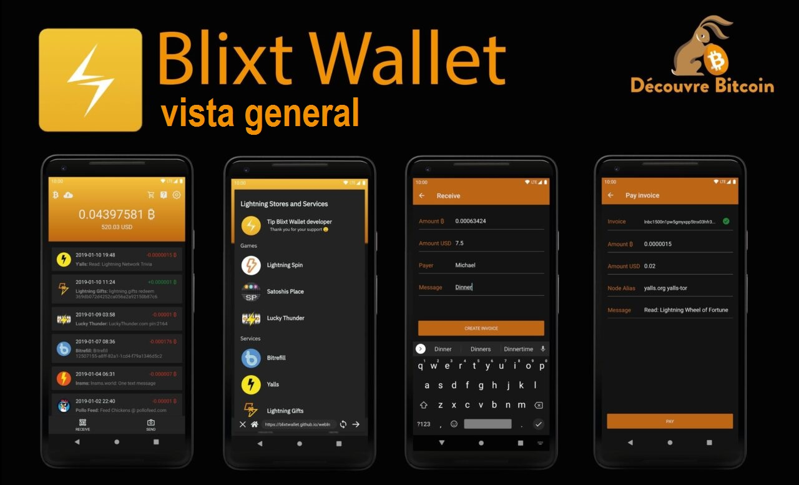

## Un potente nodo BTC/Lightning en su bolsillo, donde sea que esté

Me gustaría presentarles un nuevo y poderoso nodo y billetera móvil BTC/LN: Blixt. El nombre proviene de sueco y significa "rayo" (lightning).
Si nunca usó Bitcoin Lightning Network, antes de comenzar, lea [esta simple analogía de explicación sobre Lightning Network (LN)](https://darthcoin.substack.com/p/lightning-network-y-la-analogia-del).

## ASPECTOS IMPORTANTES:

### 1. ¡Blixt es un nodo privado, no un nodo de enrutamiento! Mantenlo en mente.

Eso significa que todos los canales LN en Blixt no se anunciarán al gráfico LN (llamados canales privados). Eso significa que este nodo no realizará el enrutamiento de otros pagos a través del nodo Blixt. [Lea más sobre canales privados y públicos aquí](https://voltage.cloud/blog/lightning-network-faq/what-are-the-differences-between-public-and-private-channels/).

El nodo móvil Blixt no es para enrutamiento, repito. Es principalmente para poder administrar sus propios canales LN y realizar sus pagos LN en privado, cuando lo necesite.

El nodo móvil Blixt es necesario estar en línea y sincronizar solo antes de que haga sus transacciones. Es por eso que verá un ícono en la parte superior que indique el estado de sincronización. Solo se necesitan unos momentos, dependiendo de cuánto tiempo lo mantuviera fuera de línea y vuelva a sincronizar el gráfico LN.

### 2. Blixt está usando LND (Aezeed) como billetera Backend, así que no intente importar otros tipos de billeteras de bitcoin.

[Aquí esta explicado los tipos de billeteras](https://coldbit.com/what-types-of-mnemonic-seeds-are-used-in-bitcoin/). Entonces, si anteriormente tenía un nodo LND, puede importar la semilla y la copia de seguridad, [Como se explica en esta guía](https://darthcoin.substack.com/p/recuperar-fondos-de-un-nodo-umbrel).

### 3. Blixt enlaces importantes (por favor marquelos):

- [Blixt Github repository](https://github.com/hsjoberg/blixt-wallet) | [Github Releases](https://github.com/hsjoberg/blixt-wallet/releases) (Descargue el archivo APK directamente)
- [Blixt Página de características](https://blixtwallet.github.io/features_es) - explicando uno por uno cada característica y funcionalidad.
- [Blixt Página FAQ](https://blixtwallet.github.io/faq_es) - Lista de preguntas y respuestas y solución de problemas de Blixt
- [Blixt Página de guías](https://blixtwallet.github.io/guides_es) - demostraciones, video tutoriales, guías adicionales y casos de uso para Blixt
- [Folleto imprimible A4](https://github.com/BlixtWallet/blixtwallet.github.io/tree/master/assets/flyer) con los primeros pasos usando Blixt, en varios idiomas.
- Blixt también ofrece una demostración funcional completa en [su sitio web](https://blixtwallet.com) o en una [versión web dedicada](https://blixt-wallet-git-master-hsjoberg.vercel.app/), tener una prueba de experiencia completa, antes de comenzar a usar Blixt en el mundo real.
- [Geyser crowdfunding page](https://geyser.fund/project/blixt) - Done sats como desea apoyar el proyecto
- [Telegram support group](https://t.me/blixtwallet)

# Características clave disponibles

## Nodo Neutrino

Blixt se conecta de forma predeterminada al servidor de Blixt para sincronizar los bloques e índice con Neutrino (modo SPV para verificación de pago simplificada), pero el usuario también puede conectarse a su propio nodo. Es sorprendente ver que sincronizar un nodo SPV tarda menos de 5 minutos, en mi caso en Android 11, para estar listo para usar la billetera de nodo completa (en la cadena y LN).

## Nodo no custodial completo

El usuario puede administrar sus propios canales con una interfaz fácil de usar y con suficiente información mostrada para tener una buena experiencia. En el menú de cajón superior izquierdo, puede ir a los canales Lightning para comenzar a abrir con otros nodos, como lo desee. No olvide habilitar Tor en la configuración. Es mucho mejor para la privacidad y también porque como nodo móvil, si cambia su conexión a Internet / Clearnet IP con frecuencia, sus pares pueden verse interrumpidos. Con el URI del nodo Tor, siempre tendrá el mismo identificador privado independientemente de su ubicación / IP.

## Copia de seguridad/restauración de un nodo LND

Una característica poderosa, fácil de administrar y útil es restaurar otros nodos LND muertos, con solo la lista de semillas de 24 palabras y el archivo Channels.Backup.

> [Aquí hay una guía sobre cómo restaurar los nodos LND muertos en Blixt en el caso de SHTF.](https://darthcoin.substack.com/p/recuperar-fondos-de-un-nodo-umbrel)

El usuario también tiene la opción de guardar la copia de seguridad del canal Blixt en Google Drive y/o almacenamiento local en su propio dispositivo móvil (para luego moverlo a un lugar seguro, fuera de su teléfono).

El proceso de restauración es bastante simple: inserte la semilla de 24 palabras, agregue el archivo de copia de seguridad (anteriormente copiado a la memoria móvil) y haga clic en Restaurar. Tomará algún tiempo sincronizar y escanear todos los bloques para sus transacciones pasadas. Los canales se cerrarán automáticamente y los fondos regresarán a su billetera en la cadena (consulte el menú de cajón superior izquierdo - en la cadena).

> Si anteriormente tenía canales abiertos con su nodo antiguo detrás de Tor, primero debe habilitar la opción Tor (y reiniciar la aplicación) desde la configuración del menú. De esta manera, el procedimiento de cierre no fallará y/o la opción de cierre forzada no se utilizará.

Recuerde hacer una copia de seguridad de sus canales LN después de abrir y/o cerrar los canales. Solo se tarda unos segundos en estar seguro. Más tarde, puede mover el archivo de copia de seguridad a un lugar seguro lejos de su dispositivo móvil.
Para probar su semilla en un escenario de restauración, antes de agregar fondos, simplemente use la misma semilla de 24 palabras (Aezeed) en Bluewallet. Si la dirección BTC generada es la misma en Blixt, está listo para comenzar. No es necesario usar BlueWallet después de eso, simplemente puede eliminar la billetera probada para su restauración.

## Tor incorporado

Una vez que lo haya activado, la aplicación se reiniciará detrás de la red Tor. A partir de este momento, puede ver en la configuración del menú su ID de nodo con una dirección onion, para que otros nodos puedan abrir canales a su pequeño nodo móvil Blixt. O supongamos que tiene su propio nodo en casa y desea tener pequeños canales con su nodo móvil Blixt. Una combinación perfecta.

## Dunder LSP - Proveedor de servicios de liquidez

Una característica simple y fantástica que ofrece a los nuevos usuarios la capacidad de comenzar a aceptar BTC en la red Lightning de inmediato, sin la necesidad de depositar fondos en la cadena y luego abrir canales LN.

Para los nuevos usuarios, esta es una gran noticia porque se supone que pueden comenzar desde cero, directamente en LN. Para hacer esto, simplemente cree una factura de LN desde la pantalla principal en el botón "Recibir", ingrese la cantidad, descripción, etc. y pague desde otra billetera. Blixt abrirá un canal de hasta 400k sats por transacción recibida. Puede abrir varios canales si es necesario.

Un caso interesante y útil es el siguiente: digamos que su primer monto recibido es de 200k. Blixt abrirá un canal de 400k sats con ya 200k sats (menos tarifas de apertura) a su lado, pero dado que todavía tiene 200k "espacio" disponible, puede recibir más. Entonces, el próximo pago, digamos 100k, llegará directamente a través de este canal, sin tarifas adicionales, y aún tiene 100k espacio para recibir más.

Pero si elige recibir, digamos, 300k para el tercer pago, creará otro nuevo canal de 400k y empujará estos 300k a su lado.

Si hay demasiadas solicitudes, el nodo Blixt puede ajustar la capacidad del canal durante la apertura.

## Apertura automática de canales

En la configuración, el usuario puede activar esta opción y tener un servicio automatizado que abre canales con los mejores nodos y rutas en función del saldo disponible en la billetera en la cadena de la aplicación Blixt. Esta es una característica beneficiosa para los nuevos usuarios que no están seguros de qué nodo abrir un canal y/o cómo abrir un canal LN. Es como un piloto automático para LN.

> Recuerde: esta opción se usa solo una vez, cuando crea su nueva billetera Blixt, y está habilitado de forma predeterminada. Entonces, si el nuevo usuario escanea el código QR en la cadena en la pantalla principal y deposita en sus primeros SAT a esa dirección, Blixt abrirá automáticamente un canal con esos sats, con el nodo público Blixt.

## Servicios de liquidez entrantes

Característica dedicada a los comerciantes que necesitan más liquidez entrante, fácil de usar. Para hacer esto, simplemente seleccione uno de los proveedores de liquidez de la lista, pague el monto que desea para el canal y proporcione su ID de nodo, y a partir de ahí, un canal se abrirá a su nodo Blixt.

## Listas de contactos

Característica útil si desea tener una lista duradera de destinatarios con los que comercia la mayor parte del tiempo. Esta lista puede consistir en lnurls, direcciones Lightning o información/facturas de pago estático futuro. Por ahora, esta lista no se puede guardar fuera de la aplicación, pero hay planes de tener una opción para exportarla.

## LNURL y Lightning Address

Soporte completo de LNURL. Puede pagar LNURL, LN-Auth, LN-chan con LNURL.
Puede enviar a cualquier dirección LN y también agregarla a su lista de contactos.
También comenzando con Vers. 0.6.9 está disponible para recibir su propia dirección LN tipo *@blixtwallet.com*, a través de la característica [Blixt Lightning Box](https://github.com/hsjoberg/lightning-box).

## Keysend

Una característica muy poderosa que tienen pocas billeteras móviles. Puede enviar/empujar fondos directamente a través de un canal o señalar a otro nodo, agregando un mensaje si es necesario. Es como si fuera un chat secreto atraves de LN. Esta característica es muy útil para mostrar mensajes en la cartelera Amboss.space ([aquí hay una guía en esta cartelera Amboss](https://darthcoin.substack.com/p/amboss-billboard-herramienta-increible)).

## Firma de mensajes

Herramienta muy útil para firmar mensajes con la clave privada de su nodo Blixt, mensajes de autenticación, etc. Muy pocas billeteras móviles tienen esta característica, casi ninguna.

## Pagos Multi-Channel - Multi-Path Payments (MPP)

Característica útil para pagos LN, lo que le permite dividir un pago de LN en varias piezas, en múltiples canales. Es una buena manera de equilibrar la liquidez en la red y mejorar la privacidad.

## Lightning Browser

Una serie de servicios de terceros con LN, organizados dentro de un navegador simple, accesible y fácil de usar. También es una buena manera de promover empresas que acepten BTC en LN. Esta es una característica que se desarrollará aún más en el futuro. Por ahora, no funciona detrás de Tor, por lo que navegar estas aplicaciones estará en ClearNet.

## Exploradores de registros

Esta es una herramienta poderosa para verificar los registros LND y el estado de su nodo en general. Hay una opción para guardar el archivo de registro. Es muy útil tener estos registros a mano en caso de que necesite asistencia para desarrolladores para identificar ciertos problemas.

## Seguridad

Puede configurar la configuración de la aplicación, para una mayor seguridad de su billetera/nodo, la posibilidad de iniciar la aplicación con un código PIN y/o huella digital.

## Billetera onchain

Esta característica está un poco oculta, en el menú del cajón en la parte superior izquierda. Dado que un usuario de LN no lo usa a menudo, no es visible en la pantalla principal. Pero está bien, puede tenerlo en una billetera separada donde puede administrar direcciones y ver el registro de transacciones, importando su semilla en Sparrow, por ejemplo. Tal vez en el futuro, Blixt Wallet también incluirá una característica para administrar UTXOS. Pero por ahora, solo use esta billetera en cadena para abrir o cerrar canales en LN.

## Características especiales

- Con el vers. 0.6.9 se introdujo el "modo persistente" que permite al usuario ejecutar a Blixt como un nodo LN siempre en línea, manteniendo vivos los servicios LND y la billetera LN para recibir/enviar cualquier momento en cualquier momento.
- Simple Taproot Channels - Permitir abrir canales de taproot para obtener más privacidad y características avanzadas
- Canales de confirmación cero con Blixt Dunder LSP
- Speedloader ("LN channel sync") - Esto significa que todos los canales se sincronizarán rápidamente en el inicio, para una mejor búsqueda de rutas. Si bien es un poco molesto que tenga que ver la pantalla de sincronización al principio, asegurará que la billetera conozca todos los canales y los pagos sean más rápidos y confiables.
- ¡Traducido en más de 25 idiomas!

## "Huevos de Pascua"

Sí, en la aplicación Blixt, hay algunas características ocultas, pequeñas cosas que hacen que la aplicación sea encantadora, activando acciones y respuestas interesantes.
Sugerencia: intente hacer clic dos veces en el logotipo de Blixt en el cajón | Te dejaré descubrir el resto.

---

# Comineza con Blixt - Guía paso a paso

> Como nuevo usuario de LN, si comienza a usar el nodo Blixt LN, primero necesitará saber qué es Lightning Network y cómo funciona, al menos a nivel básico. [Aquí organizamos una lista simple de recursos sobre Lightning Network](https://blixtwallet.github.io/faq_es#que-es-ln). Por favor léelos primero.”

Ejecutar un nodo LN completo en un dispositivo móvil no es una tarea fácil y podría tomar algo de espacio (mínimo de 600 MB) y memoria. Recomendamos tener un buen dispositivo móvil, actualizado y usar al menos Android 11 como sistema operativo.

Una vez que abra Blixt, la pantalla "Bienvenido" le dará algunas opciones:

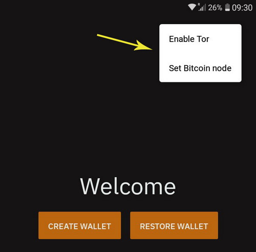

En la esquina superior derecha, verá 3 puntos que activan un menú con:

- "Habilitar tor" - El usuario puede comenzar con Tor Network, en especial si se desea restaurar un nodo LND antiguo que se estaba ejecutando con solo pares.

- "Establecer el nodo Bitcoin": si el usuario desea conectarse a su propio nodo directamente, para sincronizar los bloques a través de Neutrino, puede hacerlo de inmediato de la pantalla de bienvenida. Esta opción también es buena en caso de que su conexión a Internet o Tor no sea tan estable para conectarse al nodo Bitcoin predeterminado (node.blixtwallet.com).

## Primer paso - crear una nueva billetera

Si elige "crear una nueva billetera", será redirigido directamente a la pantalla principal de la billetera Blixt.

Esta es su "cabina" y también es la "billetera LN principal", así que tenga en cuenta que solo le mostrará el saldo de su billetera LN. La billetera Onchain se muestra por separado (ver C).

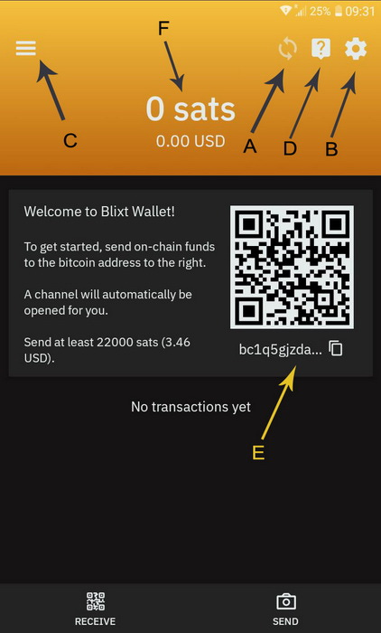

A - Icono del indicador de sincronización de bloques. Esto es lo más importante para un nodo LN: que se sincronice con la red. Si ese icono todavía está funcionando, significa que su nodo no está listo! Así que ten paciencia, en especial para la primera sincronización inicial. Podría tomar hasta 6-8 minutos, dependiendo de su dispositivo y conexión a Internet.

Puede hacer clic en él y ver el estado de la sincronización:

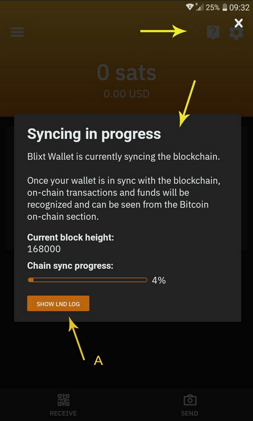

También puede hacer clic en el botón "Mostrar registro LND" (A) si desea ver y leer más detalles técnicos del registro LND, en tiempo real. Es muy útil para depurar y aprender más cómo funciona LN.

B - Aquí puede acceder a todas las configuraciones de Blixt, ¡y son muchas! Blixt ofrece muchas características y opciones ricas para administrar su nodo LN como un Pro. Todas esas opciones se explican en detalles en la ["Página de características de Blixt - Menú de opciones"](https://blixtwallet.github.io/features_es#blixt-opciones).

C - Aquí tienes el menú "Magic Cajón", también explicado en detalles aquí. Aquí está la "billetera onchain" (B), canales Lightning (C), contactos, icono de estado de canales (A), Keysend (D).

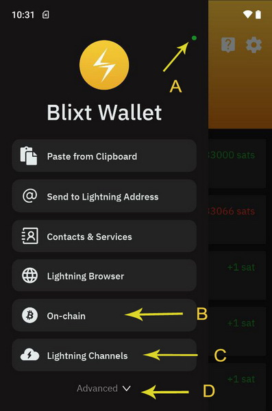

D - Es el menú de ayuda, con enlaces a la página de preguntas frecuentes / guías, desarrollador de contacto, página de GitHub y grupo de soporte de telegrama.

E - Indica su primera dirección BTC, donde puede depositar sus primeros sats de pruebas. ¡Esto es opcional! Si deposita directamente en esa dirección, está abriendo un canal LN hacia el nodo Blixt. Eso significa que verá sus sats depositados, entrando en otra transacción (TX) onchain , para abrir ese canal LN. Puede verificar eso en la billetera Blixt Onchain (consulte el punto C), haciendo clic en el menú TX superior derecha.

Como puede ver en el registro de transacciones de OnChain, los pasos son muy detallados que indican a dónde van los sats (depositar, abrir, canal cerrado).

> Recomendación: después de probar varias situaciones, llegamos a la conclusión que es mucho mejor eficiente para abrir canales entre 1 y 5M sats. Los canales más pequeños tienden a agotarse rápidamente y pagar un mayor % de las tarifas comparativas con los canales más grandes.

F - Indique el equilibrio de su billetera principal. Este no es su equilibrio total de billetera Blixt, representa solo los sats que tiene en los canales de rayos, disponibles para enviar. Como se indicó anteriormente, la billetera de la cadena está separada. Tenga en cuenta este aspecto. La billetera Onchain está separada por una razón importante: se usa principalmente para abrir/cerrar los canales LN.

Ok, ahora depositó algunos sats en esa dirección en la cadena que se muestra en la pantalla principal. Se recomienda que cuando haga eso, para mantener su aplicación Blixt en línea y activa durante un tiempo, hasta que los mineros tomen el BTC TX en el primer bloque.

Después de eso, podría tomar hasta 20-30 minutos hasta que esté completamente confirmado y el canal esté abierto y lo verá en el cajón mágico, los canales Lightning como activos. Además, el pequeño punto de color en la parte superior del cajón, si es verde, indicará que su canal LN está en línea y está listo para usarse para enviar sats a través de LN.

La dirección y el mensaje de bienvenida que se muestra desaparecerá. No es más necesario para abrir un canal automático ahora. También puede desactivar la opción en el menú Configuración.

Es el momento de seguir adelante, probando otras características y opciones para abrir canales LN.

Ahora, abramos otro canal con otro par del nodo. Blixt Community reunió [una lista de buenos nodos para comenzar a usar con Blixt.](https://github.com/hsjoberg/blixt-wallet/issues/1033)

### Procedimiento para abrir un canal LN (privado) normal no anunciado en su nodo móvil Blixt

Esto es muy simple, solo tome algunos pasos y un poco de paciencia:
- Ve a la [Blixt Community list](https://github.com/hsjoberg/blixt-wallet/issues/1033) de buenos pares.
- Seleccione un nodo y haga clic en su enlace de título de nombre, abrirá su página Amboss.
- Haga clic para mostrar el código QR para la dirección URI de nodo

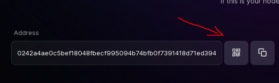

Ahora, abra Blixt y vaya al cajón superior: canales Lightning y haga clic en el botón "+"

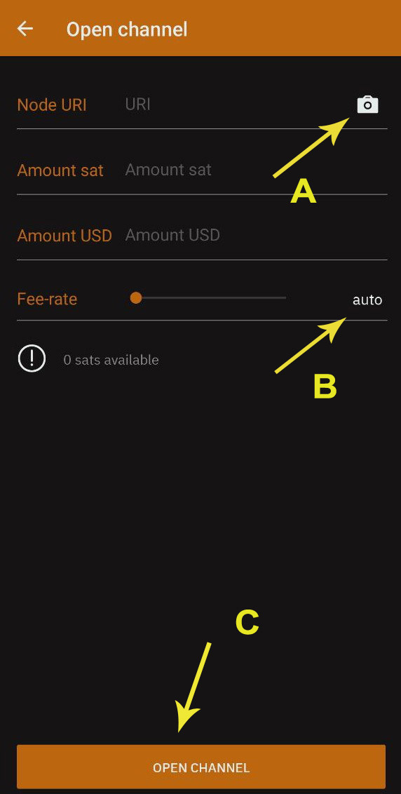

Ahora, haga clic en (A) cámara para escanear el código QR desde la página Amboss y se completarán los detalles del nodo. Agregue la cantidad de los sats para el canal que desea y luego seleccione la tasa de tarifas para el TX. Puede dejarlo automático (B) para una confirmación más rápida o ajustarla manualmente deslizando el botón. También puede presionar durante mas tiempo el número y editarlo como desee.

¡No pongas menos de 1 sat/vbyte! Por lo general, es mejor [consultar las tarifas de Mempool](https://mempool.space/) antes de abrir un canal y seleccionar una tarifa conveniente.

Hecho, ahora simplemente haga clic en el botón "Abrir canal" y espere 3 confirmaciones, que generalmente tardan 30 minutos (1 bloque de aprox cada 10 minutos).

Una vez confirmado, verá el canal activo en su sección "Canales Lightning".

## Segundo paso: obtener más liquidez entrante

Ok, ahora tenemos un canal LN con solo liquidez de salida. Eso significa que solo podemos enviar, todavía no podemos recibir sats sobre LN. ¿Por qué? ¿Leíste las guías indicadas al principio? ¿No? Vuelve y léalos. Es muy importante comprender cómo funcionan los canales LN.

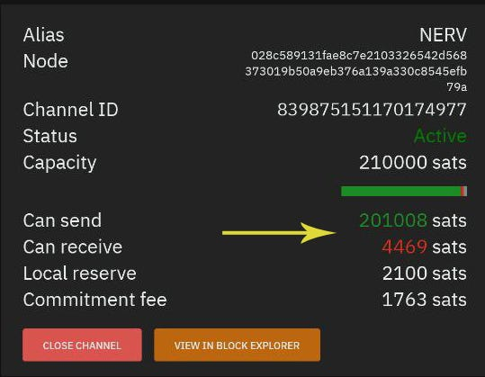

Como puede ver en este ejemplo, el canal se abre con el primer depósito, no tiene demasiada liquidez entrante ("puede recibir") pero tiene mucha liquidez saliente ("puede enviar").

Entonces, ¿qué opciones tiene, si desea recibir más SATS sobre LN?
- Gasta algunos sats del canal existente. Sí, LN es una red de pagos de Bitcoin, que se usa principalmente para gastar sus sats más rápido, más barato, privado y fácil. LN no es una forma de ahorar, porque tienes la billetera en la cadena para esto.
- Extrae algunos sats, vuelva a su billetera en la cadena, utilizando un servicio de intercambio submarino (swap). De esta manera, no está gastando sus sats, sino devolviéndolo a su propia billetera en la cadena. Aquí puede ver en detalles algunos métodos, en la página [Guías Blixt] (https://blixtwallet.github.io/guides_es).
- Abra un canal entrante desde cualquier proveedor de LSP. Aquí hay una demostración de video sobre [Cómo usar LNBIG LSP para abrir un canal entrante](https://blixtwallet.github.io/assets/images/blixt-lnbig.mp4). Eso significa que pagará una pequeña tarifa por un canal vacío (de su lado) y podrá recibir más sats en ese canal. Si es un comerciante que recibe más que gasta, esa es una buena opción. Además, si está comprando sats sobre LN, usando Robosats o cualquier otro exchange de LN.
- Abra un canal Dunder, con el nodo Blixt o cualquier otro proveedor de Dunder LSP. Un canal Dunder es una forma simple de obtener una liquidez entrante, pero al mismo tiempo deposita algunos sats en ese canal. También es bueno porque abrirá el canal con un [UTXO](https://en.bitcoin.it/wiki/utxo) que no es de su billetera Blixt. Que agregan algo de privacidad.
También es bueno porque, si no tienes sats en una billetera en la cadena, para abrir un canal LN normal, pero los tienes en otra billetera LN, puedes pagar de esa billetera a través de la abertura y el depósito (en tu depósito (en tu lado) de ese canal Dunder. [Más detalles cómo funciona Dunder y cómo ejecutar su propio servidor aquí.](Https://github.com/hsjoberg/dunder-lsp)

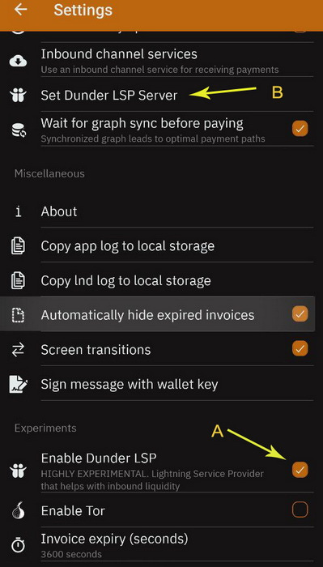

Aquí están los pasos sobre cómo activar la apertura de un canal Dunder:
- Vaya a Configuración, en la sección "Experimentos" active el cuadro para "Habilitar Dunder LSP".
- Una vez que haya hecho eso, vuelva a la sección "Red Lightning" y verá que apareció la opción "Establecer el servidor Dunder LSP". Allí, por defecto, se establece "https://dunder.blixtwallet.com", pero puede cambiarlo con cualquier otra dirección del proveedor Dunder LSP. [Aquí hay una lista de la comunidad de Blixt](https://github.com/hsjoberg/blixect-wallet/issues/1033) con nodos que pueden proporcionar canales LSP Dudner para su Blixt.
- Ahora puede ir a la pantalla principal y hacer clic en el botón "Recibir". Luego siga este procedimiento explicado [en esta guía](https://blixtwallet.github.io/guides_es#guia-lsp).

OK, entonces, después de confirmar el canal Dunder (tomará unos minutos), terminará con 2 canales LN: uno abierto inicialmente con piloto automático (canal A) y otro con más liquidez entrante, abierta con Dunder (canal B).

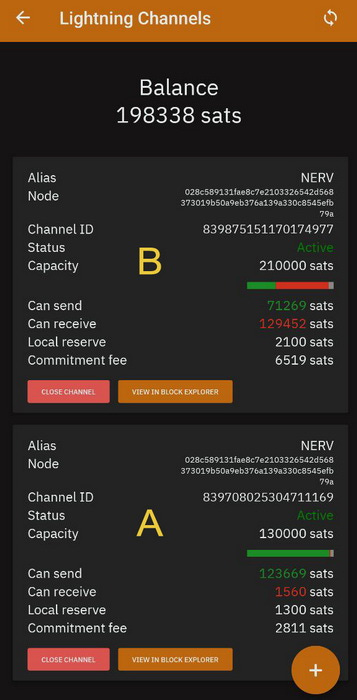

¡Bien, ahora está listo para enviar y recibir suficientes sats sobre LN!

## Tercer paso - El procedimiento de restauración de nodo

Así que ahora discutamos sobre cómo restaurar una billetera Blixt o cualquier otro nodo bloqueado. Esto es un poco más técnico, pero preste atención. No es tan difícil.

> Recordatorio: en el pasado escribí una guía dedicada con múltiples opciones [cómo restaurar un nodo LND bloqueado](https://darthcoin.substack.com/p/recuperar-fondos-de-un-nodo-umbrel), donde mencioné También el método de usar Blixt como proceso de restauración rápida, utilizando la semilla y el archivo Channel.Backup desde su nodo LND muerto. También escribí una guía sobre cómo restaurar su nodo Blixt o migrar su Blixt a otro dispositivo, [aquí](https://blixtwallet.github.io/faq_es#blixt-restaurar).

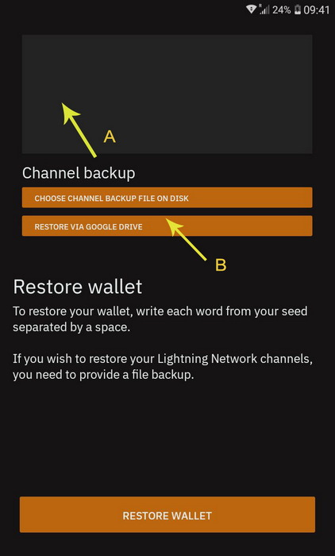

Pero explicemos en simples pasos este proceso. Como puede ver en la imagen de arriba, hay 2 cosas que debe hacer para restaurar su nodo Blixt / LND anterior:
- El cuadro superior es donde tienes que llenar con las 24 palabras de tu semilla (nodo viejo / muerto)
- La parte inferior hay dos opciones de botones para insertar / cargar el archivo Channel.Backup, previamente guardado en su antiguo nodo Blixt / LND. Puede ser de un archivo local (lo cargue en su dispositivo anteriormente) o puede ser desde una ubicación remota de Google Drive / iCloud. Blixt tiene esta opción para guardar la copia de seguridad de sus canales directamente en una unidad de Google / iCloud. Consulte más detalles en la [página de características Blixt](https://blixtwallet.github.io/features_es#blixt-opciones).

Sin embargo, para mencionar, si anteriormente no tenía ningún canal LN abierto, no es necesario cargar ningún archivo de canales.backup. Simplemente inserte las 24 palabras semilla y presione el botón Restaurar.

No olvides activar Tor, desde el menú de 3 puntos principales, como explicamos en el capítulo "Primer paso" de esta guía. Ese es el caso cuando solo tenía pares Tor y no se pudo contactar a través de ClearNet (dominio/IP). De lo contrario no es necesario.

Otra característica útil es establecer un nodo bitcoin específico en ese menú superior. Por defecto, la sincronización de bloques desde node.blixtwallet.com (modo de neutrino) pero puede configurar cualquier otro nodo de bitcoin que proporcione sincronización de neutrinos.

Entonces, una vez que llene esas opciones y presione el botón de restauración, Blixt comenzará primero para sincronizar los bloques a través del neutrino como explicamos en el capítulo "Primer paso" de esta guía. Por lo tanto, tenga paciencia y observe el proceso de restauración en la pantalla principal, haciendo clic en el icono de sincronización.

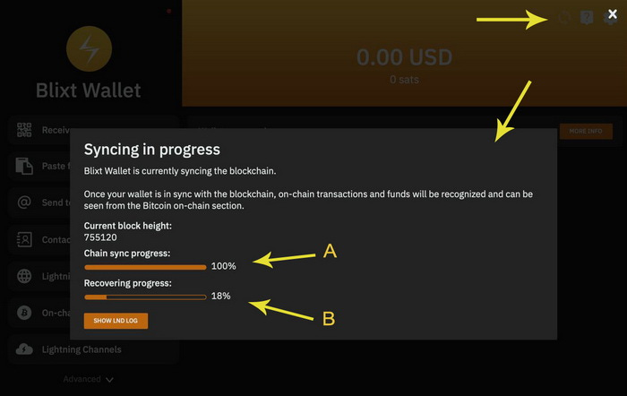

Como puede ver en este ejemplo, muestra que los bloques de bitcoin están 100% sincronizados (A) y el proceso de recuperación está en curso (B). Eso significa que los canales LN que tenía anteriormente, se cerrará y los fondos restaurados en su billetera Blixt Onchain.

¡Este proceso lleva tiempo! Así que por favor, tenga paciencia e intente mantener su Blixt activo y en línea. La sincronización inicial podría tardar hasta 6-8 minutos y los canales de cierre podrían tomar hasta 10-15 minutos. Por lo tanto, es mejor que tenga bien cargado el dispositivo.

Una vez que este proceso comenzó, puede verificar el cajón mágico: los canales Lightning, el estado de cada uno de sus canales anteriores, que muestra que están en estado "pendiente de cierre". Una vez que cada canal está cerrado, puede ver el TX de cierre en la billetera Onchain (ver cajón mágico - Onchain) y abrir el registro del menú TX.

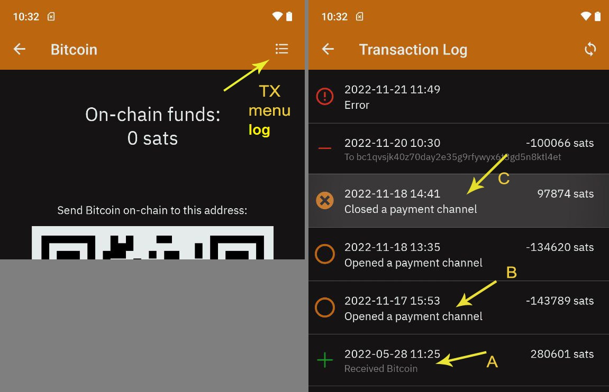

También será bueno verificar y agregar si no están allí, sus pares anteriormente que tenía en su antiguo nodo LN. Así que vaya al menú Configuración, hacia abajo a "Lightning Network" y ingrese a la opción "Mostrar pares de Lightning".

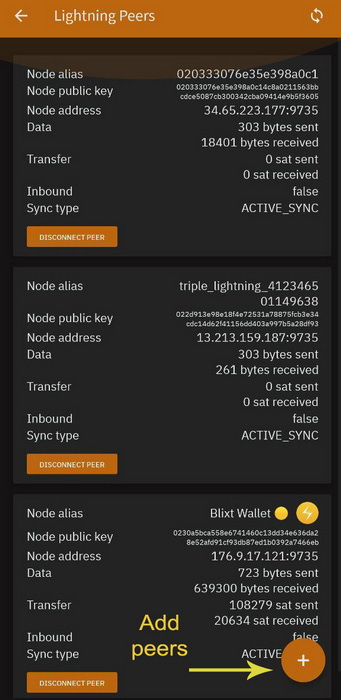

Dentro de la sección, verá los pares en los que está conectado en ese momento y podría agregar más, mejor agregar los que tenía canales antes. Simplemente vaya a la página Amboss, busque sus nodos de pares alias o nodeID y escanee su URI de nodo.

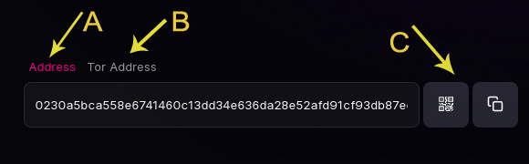

Como puede en la imagen de arriba, hay 3 aspectos:

A - Representa el URI de la dirección del nodo ClearNet (dominio/IP)

B - Representa la dirección del nodo de la Tor URI (.onion)

C - Es el código QR para escanear con su cámara Blixt o el botón Copiar

Esta dirección de nodo URI debe agregarlo a su lista de pares. Por lo tanto, tenga en cuenta que no es suficiente solo el nombre del alias de nodo o el nodoid.

Ahora puede ir al cajón mágico (menú superior a la izquierda): canales Lightning, y puede ver a qué altura del bloque de madurez se devolverán los fondos a su dirección de Onchain.

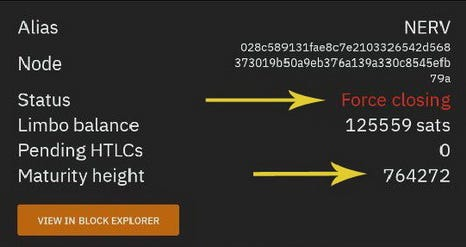

Ese número de bloque 764272 es cuando los fondos se pueden usar en su dirección de bitcoin onchain. Y podría tomar hasta 144 bloques desde el primer bloque de confirmación hasta que se libere. Así que verifique eso en [MEMPOOL](https://mempool.space/).

Y eso es. Solo espere con paciencia hasta que todos los canales estén cerrados y los fondan en su billetera en la cadena.

## Cuarto paso - Personalización

Este capítulo trata sobre la personalización y conocer mejor el nodo Blixt. No describiré todas las características disponibles, son demasiadas y ya se explicaron en la [página de características de Blixt](https://blixtwallet.github.io/features_es).

Pero señalaré algunos de los necesarios para seguir adelante usando su Blixt y tendré una gran experiencia.

### A - Nombre (NameDesc)

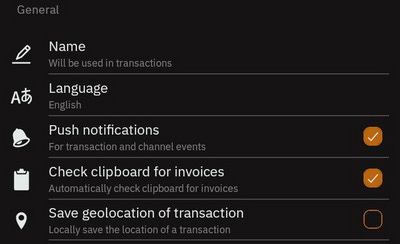

[The NameDesc](https://github.com/lightning/blips/blob/master/blip-0011.md) es un estándar para transmitir el "nombre del receptor" en las facturas de Bolt11.

Esto podría ser cualquier nombre y se puede cambiar en cualquier momento.

Esta opción es realmente útil en varios casos, cuando desea enviar un nombre junto con la descripción de la factura, para que el receptor pueda tener una pista de quién recibió esos sats. Esto es completamente opcional y también en la pantalla de pago, el usuario debe marcar la casilla que indica enviar el nombre de alias.

Aquí hay un ejemplo de cómo aparecería cuando usa [chat.blixtwallet.com](https://chat.blixtwallet.com/)

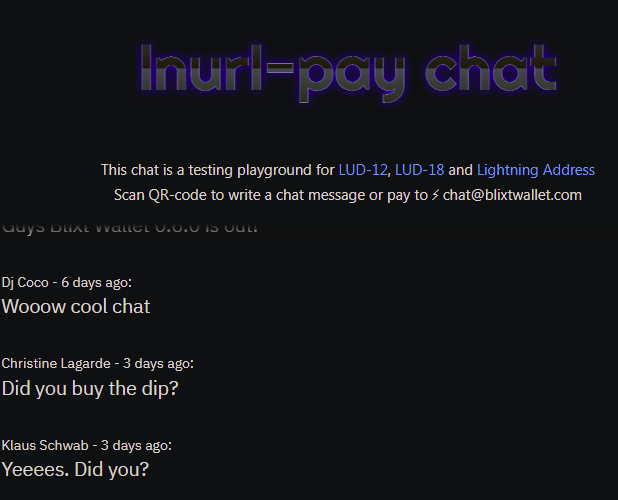

Este es otro ejemplo que envía a otra aplicación de billetera que admite nameDesc:

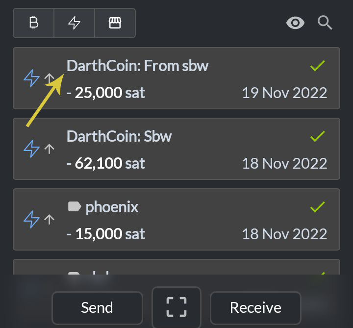

### B - Copia de seguridad de canales LN y palabras de semillas

¡Esta es una característica muy importante!

Después de abrir o cerrar un canal LN, debe hacer una copia de seguridad. Se puede hacer manualmente guardando un archivo pequeño en el dispositivo local (la carpeta de descarga generalmente) o usar una unidad de Google o una cuenta iCloud.

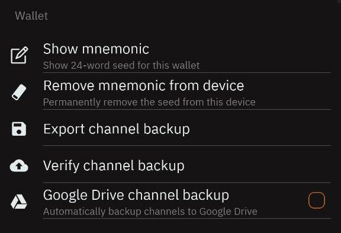

Vaya a la configuración de Blixt - Sección de billetera. Allí tiene las opciones para guardar todos los datos importantes para su billetera Blixt:
- "Show Mnemonic" - mostrará la semilla de 24 palabras para escribirlas
- "Eliminar mnemónico del dispositivo" - Esto es opcional y úselo solo si realmente desea eliminar las palabras de semilla de su dispositivo. Esto no te borrará la billetera, solo la semilla. ¡Pero ten en cuenta! No hay forma de recuperarlos si no los escribiste primero.
- "Exportar copia de seguridad del canal": esta opción guardará un archivo pequeño en su dispositivo local, generalmente en la carpeta "Descargas", desde donde puede llevarlo y moverlo fuera de su dispositivo, para mantenerse segura.
- "Verificar la copia de seguridad del canal" - Esta es una buena opción si usa Google Drive o iCloud para verificar la integridad de la copia de seguridad realizada de forma remota.
- "Copia de seguridad del canal de Google Drive" - guardará el archivo de copia de seguridad en su unidad de Google personal. El archivo está encriptado y se almacena en un repositorio separado que sus archivos de Google habituales. Por lo tanto, no hay preocupaciones que nadie pueda leer. De todos modos, ese archivo es totalmente inútil sin las palabras de semillas, por lo que nadie puede tomar sus fondos de ese archivo solamente.

Recomendaría para esta sección lo siguiente:
- Use un Administrador de contraseñas para almacenar de forma segura su archivo de semilla y copia de seguridad. [Keepass](https://keepass.info/) o Bitwarden son muy buenos para eso y se puede usar en multiplataforma y auto -alojada o fuera de línea.
- Haga la copia de seguridad cada vez que abre o cierre un canal. Ese archivo se actualiza con la información de los canales. No hay necesidad de hacerlo después de cada transacción que haya realizado en LN. La copia de seguridad del canal no almacena esa información, está almacenando solo el estado del canal.

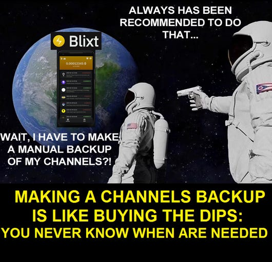

---
## Conclusión

Ok, hay muchas otras características increíbles que ofrece Blixt, te dejaré descubrirlas una por una y divertirte.

Esta aplicación está realmente subestimada, principalmente porque no está respaldada por ningún financiamiento de VCS, está impulsada por la comunidad, la construcción con amor y pasión por Bitcoin y Lightning Network.

Este nodo LN móvil, Blixt es una herramienta muy poderosa en manos de muchos usuarios, si saben cómo usarlo bien. Solo imagina, estás caminando por el mundo con un nodo LN en tu propio bolsillo y nadie lo sabrá.

Y no hablar de todas las demás características ricas que vienen, que muy pocas o ninguna otra aplicación de billetera podrían ofrecer.

Espero que disfrutes usarlo. Personalmente, me encanta y es muy útil para mí (vea aquí un caso de uso donde esta billetera es una gran herramienta).

¡Feliz Bitcoin Lightning!

¡Que el ₿itcoin esté contigo!

> Descargo de responsabilidad: los desarrolladores de esta aplicación no me paga ni me apoyan de ninguna manera. Escribí esta guía porque vi que el interés en esta aplicación de billetera está aumentando y los nuevos usuarios aún no entienden cómo comenzar con ella. También para ayudar a Hampus (el desarrollador principal) con documentación sobre el uso de esta billetera de nodo. No tengo ningún otro interés en promover esta aplicación LN, aparte de impulsar la adopción de Bitcoin y LN. ¡Esta es la única manera!
