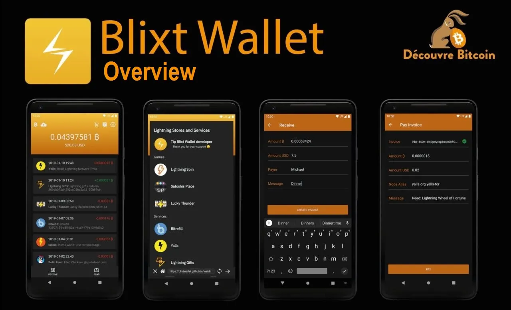
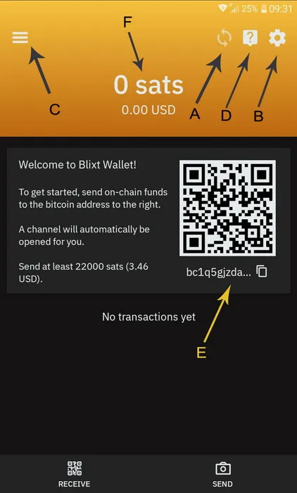
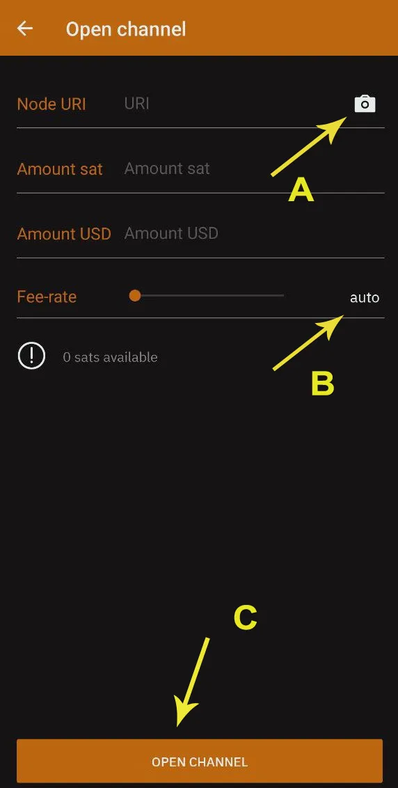
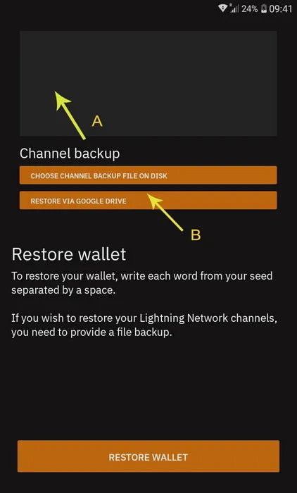
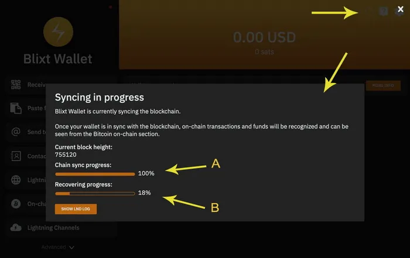
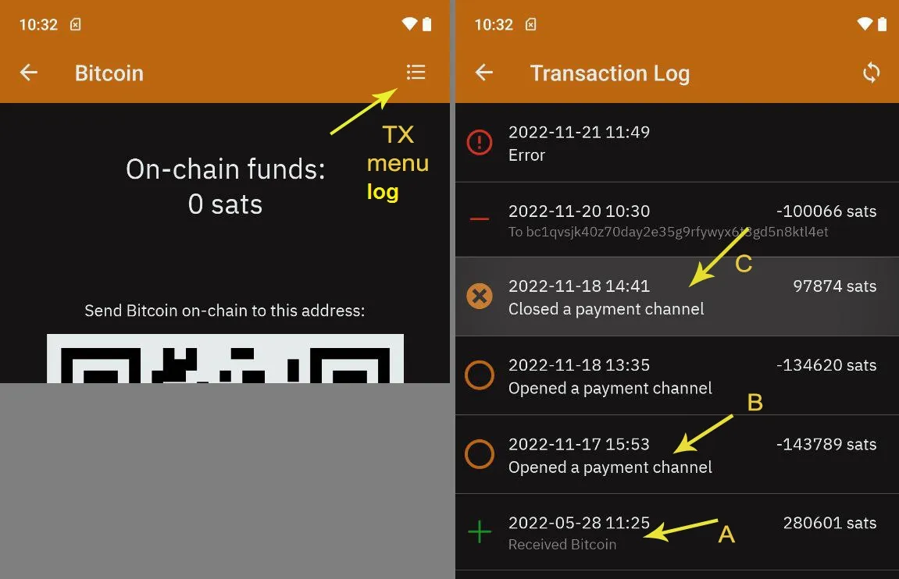
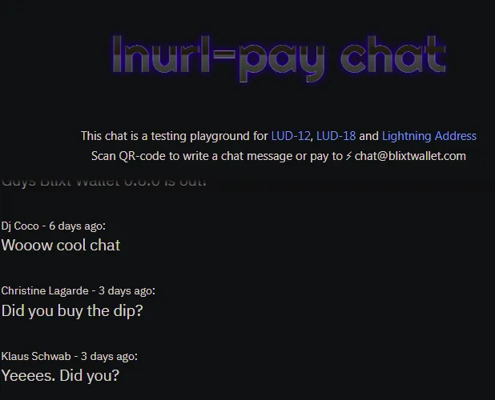
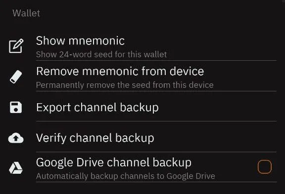
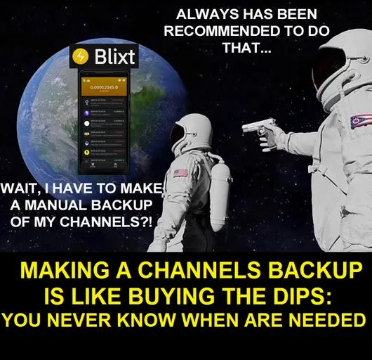

## Võimas BTC/Lightning node teie taskus, kus iganes te ka poleks

Sooviksin tutvustada teile huvitavat ja võimsat uut BTC/LN mobiilset node'i ja rahakotti – Blixt. Nimi pärineb rootsi keelest ja tähendab "välk".
Kui te pole kunagi varem kasutanud Bitcoin Lightning Networki, enne alustamist palun lugege [seda lihtsat selgitavat analoogiat Lightning Networki (LN) kohta](https://darthcoin.substack.com/p/the-lightning-network-and-the-airport).

## OLULISED ASPEKTID:

### 1. Blixt on privaatne node, MITTE marsruutimisnode! Pidage seda meeles.

See tähendab, et kõik LN kanalid Blixtis on LN graafikule teatamata (nn privaatsed kanalid). See tähendab, ET SEE NODE EI TEE TEISTE MAKSETE MARSUUTIMIST läbi Blixt node. [Lugege rohkem privaatsete ja avalike kanalite kohta siit](https://voltage.cloud/blog/lightning-network-faq/what-are-the-differences-between-public-and-private-channels/).

Blixti mobiilne node EI OLE marsruutimiseks, kordan. Peamiselt on see mõeldud selleks, et saaksite hallata oma LN kanaleid ja teha oma LN makseid privaatselt, millal iganes vajate.

Blixti mobiilne node, on vajalik olla online ja sünkroonis AINULT ENNE, kui kavatsete teha oma tehinguid. Seetõttu näete ülaosas ikooni, mis näitab sünkroonimise olekut. See võtab vaid mõne hetke, sõltuvalt sellest, kui kaua te seda offline režiimis hoidsit ja LN graafikut uuesti sünkroonisit.

### 2. Blixt kasutab rahakoti tagaotsana LND-d (aezeed), seega ärge üritage sinna importida teist tüüpi bitcoin'i rahakotte.

[Siin on selgitatud rahakottide tüüpe](https://coldbit.com/what-types-of-mnemonic-seeds-are-used-in-bitcoin/). Seega, kui teil oli varem LND node, saate importida seemne ja backup.channels Blixti, [nagu on selgitatud selles juhendis](https://darthcoin.substack.com/p/umbrel-btcln-node-shtf-scenario).

### 3. Blixti olulised lingid (palun lisage järjehoidjatesse):

- [Blixti Githubi repositoorium](https://github.com/hsjoberg/blixt-wallet) | [Githubi väljalasked](https://github.com/hsjoberg/blixt-wallet/releases) (laadige apk fail otse alla)
- [Blixti funktsioonide leht](https://blixtwallet.github.io/features) - selgitab ükshaaval iga funktsiooni ja funktsionaalsust.
- [Blixti KKK leht](https://blixtwallet.github.io/faq) - Blixti KKK ja tõrkeotsingu loend
- [Blixti juhendite leht](https://blixtwallet.github.io/guides) - demod, videoõpetused, lisajuhendid ja kasutusjuhtumid Blixti jaoks
- [Prinditav A4 flaijer](https://github.com/BlixtWallet/blixtwallet.github.io/tree/master/assets/flyer) Blixti kasutamise esimeste sammudega, erinevates keeltes.
- Blixt pakub ka täielikult funktsionaalset demot otse [oma veebisaidil](https://blixtwallet.com) või pühendatud [veebiversioonis](https://blixt-wallet-git-master-hsjoberg.vercel.app/), et saada täielik kogemus testimisest, enne Blixti reaalses maailmas kasutamist.
- [Geyseri rahastamise leht](https://geyser.fund/project/blixt) - annetage satse, nagu soovite, projekti toetamiseks
- [Telegrammi toe grupp](https://t.me/blixtwallet)
# Saadaolevad põhifunktsioonid

## Neutrino Node

Blixt ühendub vaikimisi Blixti serveriga, et sünkroniseerida blokke ja indekseid Neutrino abil (SPV režiim lihtsustatud maksete kinnitamiseks), kuid kasutaja saab ühenduda ka oma sõlmega. On üllatav näha, et SPV sõlme sünkroniseerimine võtab vähem kui 5 minutit, minu juhul Android 11 peal, et olla valmis kasutama täielikku sõlme rahakotti (on-chain ja LN).

## Täielikult Hoiustamata Sõlm

Kasutaja saab oma kanaleid hallata lihtsasti kasutatava liidesega ja piisavalt kuvatava teabega, et kogemus oleks hea. Ülemises vasakus sahtlimenüüs saate minna Lightning kanalite juurde, et alustada avamist teiste sõlmedega, nagu soovite. Ärge unustage seadetes Tori lubamist. See on palju parem privaatsuse jaoks ja ka seetõttu, et kui mobiilsõlmena muudate sageli oma internetiühendust / clearnet IP-d, võivad teie partnerid häiritud olla. Tori sõlme URI-ga on teil alati sama privaatne identifikaator olenemata teie asukohast / IP-st.

## Varunda/Taasta LND Sõlm

Võimas, lihtsasti hallatav ja kasulik funktsioon on teiste surnud LND sõlmede taastamine, kasutades ainult 24-sõnalist seemnelisti ja channels.backup faili.

> [Siin on juhend, kuidas taastada surnud Umbreli sõlmi Blixtis, kui juhtub SHTF.](https://darthcoin.substack.com/p/umbrel-btcln-node-shtf-scenario)

Kasutajal on ka võimalus salvestada Blixti kanali varukoopia Google Drive'i ja/või oma mobiilseadme kohalikku salvestusruumi (et hiljem see turvalisse kohta, eemal oma telefonist, viia).

Taastamisprotsess on üsna lihtne: sisestage 24-sõnaline seeme, lisage varukoopi fail (eelnevalt mobiilimällu kopeeritud) ja klõpsake taasta. Sünkroniseerimiseks ja kõigi teie varasemate tehingute plokkide skaneerimiseks kulub natuke aega. Kanalid suletakse automaatselt ja vahendid tagastatakse teie on-chain rahakotti (vaadake ülemist vasakut sahtlimenüüd - on-chain).

> Kui teil oli varem avatud kanaleid oma vana sõlmega Tori taga, peate kõigepealt lubama Tori valiku (ja taaskäivitama rakenduse) menüü seadetest. Nii ei ebaõnnestu sulgemisprotseduur ja/või ei kasutata sunnitud sulgemise valikut.

Pidage meeles, et varundate oma LN kanaleid pärast kanalite avamist ja/või sulgemist. Turvalisuse tagamiseks kulub vaid mõni sekund. Hiljem saate varukoopi faili viia turvalisse kohta, eemal oma mobiilseadmest.
Oma seemne testimiseks taastamissituatsioonis, enne vahendite lisamist, kasutage lihtsalt sama 24-sõnalist seemet (aezeed) BlueWalletis. Kui Blixtis genereeritud BTC aadress on sama, olete valmis alustama. Pärast seda pole vaja BlueWalletit kasutada, võite testitud rahakoti taastamiseks lihtsalt kustutada.

## Sisseehitatud Tor

Kui olete selle aktiveerinud, taaskäivitub rakendus Tori võrgu taga. Alates sellest hetkest näete menüü seadetes oma sõlme ID-d koos sibulaadressiga, nii et teised sõlmed saavad avada kanaleid teie väikese Blixti mobiilsõlmega. Või öelgem, et teil on oma sõlm kodus ja soovite oma Blixti mobiilsõlmega avada väikesi kanaleid. Täiuslik kombinatsioon.

## Dunder LSP - Likviidsusteenuse Pakkuja

Lihtne ja fantastiline funktsioon, mis pakub uutele kasutajatele võimalust hakata kohe BTC-d Lightning Networkis vastu võtma, ilma et oleks vaja teha on-chain sissemakseid ja seejärel avada LN kanaleid.
Uutele kasutajatele on see suurepärane uudis, kuna neil on võimalus alustada nullist, otse LN-is. Selleks lihtsalt looge LN arve peamenüü "vasta" nupust, sisestage summa, kirjeldus jne ja makske teisest rahakotist. Blixt avab kuni 400k satsi kanali iga vastuvõetud tehingu kohta. Vajadusel saate avada mitu kanalit.
Huvitav ja kasulik näide on järgmine: öelgem, et teie esimene vastuvõetud summa on 200k. Blixt avab 400k satsi kanali, kus juba on 200k (miinus avamistasud) teie poolel, kuid kuna teil on veel 200k "ruumi" saadaval, saate rohkem vastu võtta. Nii et järgmine makse, öelgem 100k, saabub otse selle kanali kaudu, ilma lisatasudeta, ja teil on endiselt 100k ruumi rohkem vastu võtta.

Kuid kui otsustate vastu võtta, öelgem, 300k kolmanda makse jaoks, loob see teise uue 400k kanali ja lükkab need 300k teie poolele.

Kui taotlusi on liiga palju, saab Blixti sõlm kanali mahtu avamise ajal kohandada.

## Automaatne Kanali Avamine

Seadetes saab kasutaja selle võimaluse aktiveerida ja omada automatiseeritud teenust, mis avab kanaleid parimate sõlmede ja marsruutidega, lähtudes Blixti rakenduse on-chain rahakoti saadaolevast saldost. See on kasulik funktsioon uutele kasutajatele, kes ei ole kindlad, millise sõlmega kanali avada ja/või kuidas avada LN kanalit. See on nagu autopiloot LN-is.

> Pea meeles: seda võimalust kasutatakse ainult üks kord, kui loote oma uue Blixti rahakoti, ja see on vaikimisi lubatud. Nii et kui uus kasutaja skannib peamenüüs on-chain QR-koodi ja kannab oma esimesed satsid sellele aadressile, avab Blixt automaatselt kanali nende satsidega, Blixti avaliku sõlmega.

## Sissetuleva Likviidsuse Teenused

Funktsioon on pühendatud kaupmeestele, kes vajavad rohkem SISSETULEVAT likviidsust, lihtne kasutada. Selleks valige lihtsalt nimekirjast üks likviidsuse pakkujatest, makske kanali jaoks soovitud summa ja esitage oma sõlme ID, ja sealt avatakse kanal teie Blixti sõlmele.

## Kontaktide Nimekirjad

Kasulik funktsioon, kui soovite omada püsivat nimekirja saajatest, kellega enamasti kauplete. See nimekiri võib koosneda LNURL-idest, Lightningi aadressidest või tulevastest staatilistest makseteabe/arvete andmetest. Praegu ei saa seda nimekirja rakendusest välja salvestada, kuid on plaanis võimalus see eksportida.

## LNURL ja Lightningi Aadress

Täielik LNURL-i tugi. Saate maksta LNURL-ile, LN-auth, LN-chan taotlusele LNURL-i kaudu.
Saate saata mis tahes LN aadressile ja lisada selle ka oma kontaktide nimekirja.
Alates versioonist 0.6.9 on võimalik vastu võtta omaenda LN Aadressile *@blixtwallet.com* tüüpi, läbi [Blixt Lightning Box](https://github.com/hsjoberg/lightning-box) funktsiooni.

## Keysend

Väga võimas funktsioon, mida vähestel mobiilirahakottidel on. Saate saata/vajutada vahendeid otse kanali kaudu või suunata teisele sõlmele, lisades vajadusel sõnumi. See on nagu salajane vestlus üle LN. See funktsioon on väga kasulik sõnumite kuvamiseks Amboss.space reklaamtahvlil ([siin on juhend selle Amboss reklaamtahvli kohta](https://darthcoin.substack.com/p/amboss-billboard-amazing-tool)).

## Sõnumi Allkirjastamine
Väga kasulik tööriist sõnumite allkirjastamiseks oma Blixt sõlme privaatvõtmega, autentimissõnumid ja nii edasi. Väga vähestel mobiilirahakottidel on see funktsioon, peaaegu ükski.

## Mitme-Kanali Maksed - Mitme-Teekonna Maksed (MPP)

Kasulik funktsioon LN maksete jaoks, mis võimaldab teil jagada LN makse mitmeks osaks, läbi mitme kanali. See on hea viis võrgu likviidsuse tasakaalustamiseks ja privaatsuse parandamiseks.

## Lightning Brauser

Rida kolmanda osapoole teenuseid LN-iga, korraldatud lihtsas, kättesaadavas ja kasutajasõbralikus brauseris. See on samuti hea viis ettevõtetele, kes aktsepteerivad BTC-d LN-is, reklaamimiseks. See on funktsioon, mida tulevikus veel arendatakse. Praegu ei tööta see Tori taga, seega nende rakenduste sirvimine toimub selgelt (clearnet).

## Logi Uurijad

See on võimas tööriist LND logide kontrollimiseks ja üldiselt oma sõlme seisundi vaatamiseks. On võimalus salvestada logifail. On väga kasulik omada neid logisid käepärast, juhul kui vajate arendaja abi teatud probleemide tuvastamisel.

## Turvalisus

Saate rakenduse seadetes seada, suurema turvalisuse tagamiseks oma rahakoti/sõlme jaoks, võimaluse alustada rakendust PIN-koodi ja/või sõrmejäljega.

## On-chain Rahakott

See funktsioon on veidi peidetud, sahtlimenüüs üleval vasakul. Kuna seda ei kasutata sageli LN kasutaja poolt, ei ole see peamenüüs nähtav. Kuid see on okei, saate selle omada eraldi rahakotis, kus saate hallata aadresse ja vaadata tehingulogi, importides näiteks oma seemne Sparrow'sse. Võib-olla tulevikus lisab Blixt rahakott ka funktsiooni UTxOde haldamiseks. Kuid praegu KASUTAGE seda on-chain rahakotti AINULT kanalite avamiseks või sulgemiseks LN-is.

## Eriomadused

- Versiooniga 0.6.9 tutvustati "püsivat režiimi", mis võimaldab kasutajal käitada Blixti kui alati online LN sõlme, hoides LND teenused elus ja LN rahakoti valmis vastu võtma/saatma igal ajal.
- Lihtsad Taproot Kanalid - võimaldavad avada Taproot kanaleid rohkem privaatsuse ja täiustatud funktsioonide jaoks
- Null-kinnitusega kanalid Blixt Dunder LSP-ga
- Speedloader ("LN kanali sünk") - See tähendab, et kõik kanalid sünkroniseeritakse kiiresti käivitamisel, parema teeotsingu jaoks. Kuigi alguses sünkroonimisekraani nägemine võib olla veidi tüütu, tagab see, et rahakott teab kõikidest kanalitest ja maksed on kiiremad ja usaldusväärsemad.
- Tõlgitud 25+ keelde!

## "Lihavõttemunad"

Jah, Blixt rakenduses on mõned peidetud funktsioonid, väikesed asjad, mis muudavad rakenduse võluvaks, aktiveerides lõbusaid/huvitavaid tegevusi ja vastuseid.
Vihje: proovige topeltklõpsata Blixti logol sahtlis 🙂 Ma lasen teil ülejäänud ise avastada.

# Blixti Alustamise Samm-sammult Juhend

> Kui olete uus LN kasutaja ja alustate Blixt LN Sõlme kasutamist, peate esmalt teadma, mis on Lightning Network ja kuidas see töötab, vähemalt algajate tasemel. [Siin oleme kokku pannud lihtsa ressursside nimekirja Lightning Networki kohta](https://blixtwallet.github.io/faq#what-is-ln). Palun lugege neid esmalt.”

Täieliku LN sõlme käitamine mobiilseadmes ei ole lihtne ülesanne ja võib võtta ruumi (min 600MB) ja mälu. Soovitame omada head mobiilseadet, uuendatud ja kasutades vähemalt Android 11 operatsioonisüsteemi.

Kui avate Blixti, annab “Tere tulemast” ekraan teile mõned valikud:

Paremas ülanurgas näete kolme punkti, mis aktiveerivad menüü, kus on:
- "enable Tor" - kasutaja saab alustada Tor võrguga, eriti kui soovitakse taastada vana LND sõlmpunkti, mis töötas ainult Tor eakaaslastega.

- "Set Bitcoin node" - kui kasutaja soovib otse ühenduda omaenda sõlmpunktiga, et sünkroniseerida blokke läbi Neutrino, saab seda teha otse tervitusekraanilt. See valik on hea ka juhul, kui teie internetiühendus või Tor ei ole piisavalt stabiilne, et ühenduda vaikimisi bitcoin sõlmpunktiga (node.blixtwallet.com).

## Esimene samm - Loo uus rahakott

Kui valite "loo uus rahakott", suunatakse teid otse Blixt Walleti peamisele ekraanile.

See on teie "juhtpaneel" ja samuti on see "Peamine LN Rahakott", seega olge teadlikud, et see näitab teile ainult teie LN rahakoti jääki. Onchain rahakott kuvatakse eraldi (vt C).

A - Blixti blokkide sünkroniseerimise indikaatori ikoon. See on kõige olulisem asi LN sõlmpunkti jaoks: olla sünkroniseeritud võrguga. Kui see ikoon on seal töötamas, tähendab see, et teie sõlmpunkt EI OLE VALMIS! Seega olge kannatlikud, eriti esimese algse sünkroniseerimise ajal. See võib võtta kuni 6-8 minutit, sõltuvalt teie seadmest ja internetiühendusest.

Võite seda klõpsata ja näha sünkroniseerimise olekut:

Samuti võite klõpsata nupul "Show LND Log" (A), kui soovite näha ja lugeda rohkem tehnilisi üksikasju LND logist reaalajas. See on väga kasulik vigade tuvastamiseks ja LN toimimise paremaks mõistmiseks.

B - Siit pääsete ligi kõigile Blixti seadetele, ja neid on palju! Blixt pakub palju rikkalikke funktsioone ja võimalusi oma LN sõlmpunkti professionaalselt hallata. Kõik need valikud on üksikasjalikult selgitatud [“Blixti funktsioonide lehel - Valikute menüü”](https://blixtwallet.github.io/features#blixt-options).

C - Siin on teil "Magic Drawer" menüü, samuti üksikasjalikult selgitatud siin. Siin on "Onchain Rahakott" (B), Lightning Kanalid (C), Kontaktid, Kanalite oleku ikoon (A), Keysend (D).

D - On abi menüü, linkidega KKK / juhendite lehele, arendajaga ühenduse võtmiseks, Githubi lehele ja Telegrami tugigrupile.

E - Näitab teie esimest BTC aadressi, kuhu saate hoiustada oma esimesed test-satid. SEE ON VALIKULINE! Kui hoiustate otse sellesse aadressi, avatakse LN kanal Blixti sõlmpunkti suunas. See tähendab, et näete oma hoiustatud satide liikumist teisele onchain tehingule (tx), et avada see LN kanal. Saate seda kontrollida Blixti onchain rahakotis (vt punkt C), klõpsates paremal üleval TX menüül.

Nagu näete Onchain Tehingu Logis, on sammud väga üksikasjalikult näidatud, näidates, kuhu satid lähevad (hoiustamine, avamine, kanali sulgemine)

> SOOVITUS: Pärast mitmete olukordade testimist jõudsime järeldusele, et kanaleid on palju tõhusam avada vahemikus 1 kuni 5 M sati. Väiksemad kanalid kipuvad kiiresti tühjenema ja suuremate kanalitega võrreldes tuleb maksta suuremat % tasusid.
F - Näita oma peamist Lightning rahakoti jääki. See EI ole sinu kogu Blixt rahakoti jääk, see esindab ainult satse, mis sul on Lightning kanalites, saadetavaks. Nagu varem mainitud, on Onchain rahakott eraldi. Pea seda aspekti meeles. Onchain rahakott on eraldi olulisel põhjusel: seda kasutatakse peamiselt LN kanalite avamiseks/sulgemiseks.
Nii et nüüd sa deponeerisid mõned satsid sellesse onchain aadressile, mis on kuvatud peamisel ekraanil. On soovitatav, et kui sa seda teed, hoia oma Blixt rakendus mõnda aega online ja aktiivsena, kuni BTC tehing on kaevurite poolt esimesse plokki võetud.

Pärast seda võib kuluda kuni 20-30 minutit, kuni see on täielikult kinnitatud ja kanal on avatud ning näed seda Magic Drawer - Lightning Channels kui aktiivset. Samuti väike värviline täpp sahtli ülaosas, kui see on roheline, näitab, et sinu LN kanal on online ja valmis saatma satse üle LN.

Aadress ja tervitussõnum kaovad. Pole enam vajalik automaatkanalit nüüd avada. Sa võid ka selle valiku Seadetes menüüs deaktiveerida.

On aeg edasi liikuda, testides muid funktsioone ja võimalusi LN kanalite avamiseks.

Nüüd, avame teise kanali teise sõlmepartneriga. Blixt kogukond pani kokku [nimekirja headest sõlmedest, mida Blixtiga kasutamiseks alustada.](https://github.com/hsjoberg/blixt-wallet/issues/1033)

### Protseduur tavalise teatamata (privaatse) LN kanali avamiseks sinu Blixt mobiilsõlmes

See on väga lihtne, vaja on vaid mõnda sammu ja natuke kannatlikkust:
- Mine [Blixt kogukonna nimekirja](https://github.com/hsjoberg/blixt-wallet/issues/1033) headest partneritest
- Vali sõlm ja klõpsa selle nime pealkirjal, see avab selle Amboss lehe
- Klõpsa, et kuvada QR-kood sõlme URI aadressile

Nüüd ava Blixt ja mine ülemisse sahtlisse - Lightning Channels ja klõpsa "+" nupul

Nüüd klõpsa (A) kaameral, et skaneerida QR-kood Amboss lehelt ja sõlme detailid täidetakse. Lisa kanali jaoks soovitud satside hulk ja seejärel vali tehingu tasu määr. Sa võid jätta selle automaatseks (B) kiiremaks kinnitamiseks või kohandada seda käsitsi nuppu liigutades. Sa võid ka pikalt vajutada numbril ja seda muuta, nagu soovid.

Ära pane vähem kui 1 sat/vbyte! Tavaliselt on parem [konsulteerida mempool tasudega](https://mempool.space/) enne kanali avamist ja valida sobiv tasu.

Valmis, nüüd lihtsalt klõpsa nupul "ava kanal" ja oota 3 kinnitust, mis tavaliselt võtab 30 min (umbes 1 plokk iga 10min järel).

Kui see on kinnitatud, näed oma jaotises "Lightning Channels" aktiivset kanalit.

## Teine samm - Hankige rohkem sissetulevat likviidsust

Nii et nüüd meil on LN kanal ainult VÄLJAMINEVA likviidsusega. See tähendab, et me saame ainult SAATA, me ei saa veel VASTU VÕTTA satse üle LN. Miks? Kas lugesid alguses näidatud juhendeid? Ei? Mine tagasi ja loe neid. On väga oluline mõista, kuidas LN kanalid töötavad.

Nagu näete selles näites, kanal, mis avatakse esimese sissemaksega, ei oma palju SISSEVOOLU likviidsust ("Võib vastu võtta"), kuid omab palju VÄLJAVOOLU likviidsust ("Võib saata").
Niisiis, millised on teie võimalused, kui soovite LN-i kaudu rohkem satse vastu võtta?
- Kulutage mõned satsid olemasolevast kanalist. Jah, LN on Bitcoini maksevõrk, mida kasutatakse peamiselt oma satside kiiremaks, odavamaks, privaatsemaks ja lihtsamaks kulutamiseks. LN EI ole hoidmise viis, selleks on teil onchain rahakott.
- Vahetage mõned satsid tagasi oma onchain rahakotti, kasutades allveelaeva vahetusteenust. Sel viisil te ei kuluta oma satse, vaid annate need tagasi oma enda onchain rahakotti. Siin saate üksikasjalikult näha mõningaid meetodeid [Blixti juhendite lehel](https://blixtwallet.github.io/guides).
- Avage SISSEVOOLU kanal mõnelt LSP pakkujalt. Siin on video demo selle kohta, [kuidas kasutada LNBig LSP-d sissevoolukanali avamiseks](https://blixtwallet.github.io/assets/images/blixt-lnbig.mp4). See tähendab, et maksate väikese tasu TÜHJA kanali eest (teie poolel) ja saate sellesse kanalisse rohkem satse vastu võtta. Kui olete kaupmees, kes saab rohkem kui kulutab, on see hea võimalus. Samuti, kui ostate satse LN-i kaudu, kasutades Robosatsi või mõnda muud LN vahetust.
- Avage Dunderi kanal, Blixti sõlmega või mõne muu Dunderi LSP pakkujaga. Dunderi kanal on lihtne viis saada mõningast SISSEVOOLU likviidsust, kuid samal ajal deponeerite mõned satsid sellesse kanalisse. See on hea ka seetõttu, et kanal avatakse [UTXO-ga](https://en.bitcoin.it/wiki/UTXO), mis ei ole teie Blixti rahakotist. See lisab privaatsust.
See on hea ka seetõttu, et kui teil ei ole satse onchain rahakotis, et avada tavaline LN kanal, kuid teil on neid teises LN rahakotis, saate lihtsalt maksta selle teise rahakoti kaudu LN-i kaudu avamise ja deposiidi (teie poolel) selle Dunderi kanali jaoks. [Siin on rohkem üksikasju, kuidas Dunder töötab ja kuidas oma serverit käitada.](https://github.com/hsjoberg/dunder-lsp)

Siin on sammud, kuidas aktiveerida Dunderi kanali avamine:
- Minge Seadedesse, jaotises "Eksperimendid" aktiveerige ruut "Enable Dunder LSP".
- Kui olete seda teinud, minge tagasi üles jaotisse "Lightning Network" ja näete, et ilmus võimalus "Set Dunder LSP Server". Seal on vaikimisi määratud "https://dunder.blixtwallet.com", kuid võite selle muuta mis tahes muu Dunderi LSP pakkuja aadressiga. [Siin on Blixti kogukonna nimekiri](https://github.com/hsjoberg/blixt-wallet/issues/1033) sõlmedest, mis võivad teie Blixtile pakkuda Dudneri LSP kanaleid.
- Nüüd võite minna peamenüüsse ja klõpsata nupul "Receive". Seejärel järgige seda protseduuri, mis on selgitatud [selles juhendis](https://blixtwallet.github.io/guides#guide-lsp).

OK, nii et pärast Dunderi kanali kinnitamist (võtab mõned minutid) lõpetate kahe LN kanaliga: üks avati algselt autopiloodiga (kanal A) ja teine rohkema sissevoolu likviidsusega, avatud Dunderiga (kanal B).

Väga hea, nüüd olete valmis saatma ja vastu võtma piisavalt satse üle LN!

## Kolmas samm - Sõlme taastamise protseduur

Nüüd räägime, kuidas taastada Blixti rahakotti või mõnda muud kokku jooksnud LND sõlme. See on veidi tehnilisem, kuid palun pöörake tähelepanu. See pole nii raske.

> MEELDETULETUS: Minevikus kirjutasin pühendatud juhendi mitme võimalusega [kuidas taastada kokku jooksnud LND sõlme](https://darthcoin.substack.com/p/umbrel-btcln-node-shtf-scenario), kus mainisin ka meetodit, kasutades Blixti kiire taastamise protsessina, kasutades seemnet + channel.backup faili teie surnud LND sõlmest. Kirjutasin ka juhendi, kuidas taastada oma Blixti sõlme või migreerida oma Blixti teise seadmesse, [siin](https://blixtwallet.github.io/faq#blixt-restore).

Kuid selgitame seda protsessi lihtsate sammudena. Nagu ülaloleval pildil näha, on kaks asja, mida peate tegema, et taastada oma eelmine Blixt/LND sõlm:
- ülemises kastis peate sisestama kõik 24 sõna oma seemnest (vana / surnud sõlm)
- alumises osas on kaks nuppu, et sisestada / üles laadida channel.backup fail, mis on eelnevalt salvestatud teie vanast Blixt/LND sõlmest. See võib olla kohalikust failist (laadisite selle oma seadmesse eelnevalt) või võib olla Google Drive'i / iCloudi kaugkohast. Blixtil on see võimalus salvestada teie kanalite varukoopia otse Google'i / iCloudi draivi. Vaadake lisateavet [Blixti funktsioonide lehel](https://blixtwallet.github.io/features#blixt-options).

Mainimata ei saa jätta, kui teil varem polnud avatud LN kanaleid, pole vaja üles laadida ühtegi channels.backup faili. Lihtsalt sisestage 24 sõna seeme ja vajutage taastamisnuppu.

Ärge unustage aktiveerida Tori, ülemisest kolme punkti menüüst, nagu selgitasime juhendi "Esimene samm" peatükis. See on juhul, kui teil olid AINULT Tori eakaaslased ja ei saanud üle selgevõrgu (domeen/IP) kontakti. Muidu pole see vajalik.

Teine kasulik funktsioon on määrata konkreetne Bitcoin sõlm sellest ülemisest menüüst. Vaikimisi sünkroonib see blokke node.blixtwallet.com'ist (neutriino režiimis), kuid võite määrata mis tahes muu Bitcoin sõlme, mis pakub neutriino sünkrooni.

Niisiis, kui olete need valikud täitnud ja vajutanud taastamisnuppu, hakkab Blixt esmalt sünkroonima blokke neutriino kaudu, nagu selgitasime juhendi "Esimene samm" peatükis. Seega olge kannatlik ja jälgige taastamisprotsessi peamenüüs, klõpsates sünkroonimise ikoonil.

Nagu näete sellel näitel, näitab see, et bitcoinide blokid on 100% sünkroonitud (A) ja taastamisprotsess on käimas (B). See tähendab, et teie eelnevad LN kanalid suletakse ja vahendid taastatakse teie Blixti onchain rahakotti.

See protsess võtab aega! Seega palun olge kannatlik ja proovige hoida oma Blixti aktiivsena ja võrgus. Esialgne sünkroonimine võib võtta kuni 6-8 minutit ja kanalite sulgemine võib võtta kuni 10-15 minutit. Seega on parem, kui seade on hästi laetud.
Kui see protsess on käivitatud, saate kontrollida Magic Drawer - Lightning Channels sektsioonis iga oma eelmise kanali olekut, näidates, et need on "pending to close" olekus. Kui iga kanal on suletud, näete sulgemise tehingut onchain rahakotis (vt Magic Drawer - Onchain) ja avate tehingu menüü logi.

Samuti oleks hea kontrollida ja lisada, kui need puuduvad, teie eelmised partnerid, kellega teie vanas LN sõlmes olite. Seega minge seadete menüüsse, alla "Lightning Network" ja sisenege valikusse "Show Lightning Peers".

Selle jaotise sees näete sel hetkel ühendatud partnereid ja saate lisada rohkem, parem on lisada need, kellega teil varem kanalid olid. Lihtsalt minge Amboss lehele, otsige oma partnerite sõlmede aliaseid või nodeID-d ja skannige nende sõlme URI.

Nagu ülaltoodud pildil näha, on 3 aspekti:

A - esindab clearnet sõlme aadressi URI (domeen/IP)

B - esindab Tor onion sõlme aadressi URI (.onion)

C - on QR-kood, mida skannida oma Blixt kaameraga või kopeerimisnupp.

See sõlme aadressi URI peate lisama oma partnerite nimekirja. Seega pidage meeles, et ainult sõlme aliase nimi või nodeID ei ole piisav.

Nüüd saate minna Magic Drawer (ülemine vasak menüü) - Lightning Channels, ja näete, millises küpsusbloki kõrguses vahendid tagastatakse teie onchain aadressile.

See blokinumber 764272 on aeg, mil vahendid muutuvad kasutatavaks teie bitcoin onchain aadressil. Ja see võib võtta kuni 144 blokki alates esimesest kinnitusblokist, kuni need vabastatakse. Seega kontrollige seda [mempoolis](https://mempool.space/).

Ja see ongi kõik. Oodake lihtsalt kannatlikult, kuni kõik kanalid on suletud ja vahendid tagasi teie onchain rahakotis.

## Neljas samm - Kohandamine

See peatükk räägib kohandamisest ja teie Blixt Node paremast tundmaõppimisest. Ma ei kirjelda kõiki saadaolevaid funktsioone, neid on liiga palju ja need on juba selgitatud [Blixti funktsioonide lehel](https://blixtwallet.github.io/features).

Kuid ma toon välja mõned neist, mis on vajalikud edasi liikumiseks, kasutades oma Blixti ja saades suurepärase kogemuse.

### A - Nimi (NameDesc)

[The NameDesc](https://github.com/lightning/blips/blob/master/blip-0011.md) on standard "saaja nime" edastamiseks BOLT11 arvetes.

See võib olla ükskõik milline nimi ja seda saab igal ajal muuta.

See valik on tõesti kasulik mitmesugustel juhtudel, kui soovite saata nime koos arve kirjeldusega, nii et saaja saaks vihje, kellelt need satid sai. See on täiesti valikuline ja ka maksete ekraanil peab kasutaja märkima ruudu, näidates, et soovib saata aliase nime.

Siin on näide, kuidas see ilmub, kui kasutate [chat.blixtwallet.com](https://chat.blixtwallet.com/)

See on teine näide, saates teisele rahakotirakendusele, mis toetab NameDesc:

### B - Varunda LN kanalid ja seemnesõnad

See on väga oluline funktsioon!
Pärast LN kanali avamist või sulgemist peaksite tegema varukoopia. Seda saab teha käsitsi, salvestades väikese faili kohalikule seadmele (tavaliselt allalaadimiste kausta) või kasutades Google Drive'i või iCloudi kontot.

Minge Blixti seadetesse - rahakoti jaotis. Seal on teil võimalused salvestada kõik olulised andmed teie Blixti rahakoti jaoks:
- “Show mnemonic” - kuvab 24 sõna seemne, et saaksite need üles kirjutada
- “Remove mnemonic from device” - see on valikuline ja kasutage seda ainult siis, kui soovite tõesti seemnesõnad seadmest eemaldada. See EI kustuta teie rahakotti, ainult seemet. Kuid olge ettevaatlik! Kui te neid esmalt üles ei kirjutanud, ei ole võimalik neid taastada.
- “Export channel backup” - see valik salvestab väikese faili teie kohalikule seadmele, tavaliselt “allalaadimiste” kausta, kust saate selle võtta ja viia väljapoole oma seadet, ohutuks hoidmiseks.
- “Verify channel backup” - see on hea valik, kui kasutate Google Drive'i või iCloudi, et kontrollida kaugelt tehtud varukoopia terviklikkust.
- “Google drive channel backup” - salvestab varukoopiate faili teie isiklikku Google Drive'i. Fail on krüpteeritud ja hoitakse eraldi teie tavalistest Google'i failidest. Seega pole muret, et seda saaks keegi lugeda. Igatahes on see fail ilma seemnesõnadeta täiesti kasutu, nii et keegi ei saa ainult selle faili abil teie vahendeid võtta.

Selle jaotise jaoks soovitaksin järgmist:
- kasutage paroolihaldurit, et hoida teie seeme ja varukoopiate fail turvaliselt. [KeePass](https://keepass.info/) või Bitwarden on selleks väga head ja neid saab kasutada mitmel platvormil ning ise majutatuna või võrguühenduseta.
- TEHKE VARUKOOPIA IGA KORD, kui avate või sulgete kanali. See fail uuendatakse kanalite infoga. Pärast iga LN-is tehtud tehingut pole seda vaja teha. Kanali varukoopia ei talleta seda infot, see salvestab ainult kanali oleku.

## Järeldus

OK, Blixt pakub palju muid hämmastavaid funktsioone, ma lasen teil need ükshaaval avastada ja lõbutseda.

See rakendus on tõesti alahinnatud, peamiselt seetõttu, et seda ei toeta ükski VC rahastus, see on kogukonna juhitud, ehitatud armastuse ja kirguga Bitcoin'i ja Lightning Network'i vastu.

See mobiilne LN sõlm, Blixt, on paljude kasutajate käes väga võimas tööriist, kui nad teavad, kuidas seda hästi kasutada. Kujutage ette, te kõnnite ümber maailma LN sõlmega oma taskus ja keegi ei tea seda.

Rääkimata kõigist teistest rikkalikest funktsioonidest, mida see pakub, mida väga vähesed või ükski teine rahakoti rakendus ei suuda pakkuda.

Loodan, et naudite selle kasutamist. Isiklikult armastan ma seda ja see on mulle väga kasulik (vaadake siin kasutusjuhtumit, kus see rahakott on suurepärane tööriist).

HÄID BITCOIN LIGHTNINGU!

Olgu ₿ITCOIN Sinuga!

> VASTUTUSEST LOOBUMINE: Ma ei saa selle rakenduse arendajatelt mingit tasu ega toetust. Kirjutasin selle juhendi, kuna nägin, et huvi selle rahakoti rakenduse vastu suureneb ja uued kasutajad ei mõista ikka veel, kuidas sellega alustada. Samuti, et aidata Hampust (peamine arendaja) selle sõlme rahakoti kasutamise dokumentatsiooniga. Mul ei ole muud huvi seda LN rakendust edendada, kui ainult edendada Bitcoin'i ja LN-i omaksvõttu. See on ainus tee!