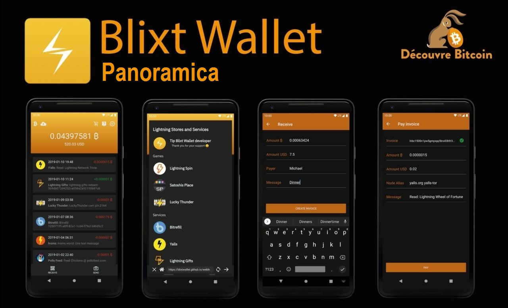

## Un potente nodo BTC/Lightning in tasca, ovunque tu sia

Vorrei presentarti un nuovo e potente nodo mobile BTC/LN e portafoglio - Blixt. Il nome deriva dallo svedese e significa "lampo" (Lightning).
Se non hai mai usato Bitcoin Lightning Network, prima di iniziare, leggi [questa semplice spiegazione dell'analogia su Lightning Network (LN)](https://darthcoin.substack.com/p/the-lightning-network-and-the-airport).

## ASPETTI IMPORTANTI:

### 1. Blixt è un nodo privato, non un nodo di routing! Tienilo a mente.

Ciò significa che tutti i canali LN in BLIXT saranno senza preavviso nel grafico LN (i cosiddetti canali privati). Ciò significa che questo nodo non eseguirà il routing di altri pagamenti attraverso il nodo BLIXT. [Leggi di più sui canali privati e pubblici qui](https://voltage.cloud/blog/lightning-network-faq/what-are-the-phersferences-between-public-and-private-channels/).

Il nodo mobile BLIXT non è per il routing, ripeto. È principalmente in grado di gestire i tuoi canali LN e effettuare i pagamenti LN in privato, ogni volta che ne hai bisogno.

Il nodo mobile BLIXT è necessario per essere online e sincronizzato solo prima di eseguire le transazioni. Ecco perché vedrai un'icona in cima che indica lo stato di sincronizzazione. Ci vogliono solo pochi momenti, a seconda di quanto tempo lo hai mantenuto offline e rivelando il grafico LN.

### 2. Blixt sta usando LND (Aezeed) come backend del portafoglio, quindi non provare a importare altri tipi di portafogli Bitcoin.

[Qui hai spiegato i tipi di portafogli](https://coldbit.com/what-types-of-mnemonic-seeds-are-used-in-bitcoin/). Quindi, se avevi precedentemente un nodo LND, è possibile importare il seme e il backup.channels in Blixt, [come è spiegato in questa guida](https://darthcoin.substack.com/p/umbrel-btcln-node-shtf-scenario).

### 3. Blixt Link importanti (si prega di aggiungere un segnalibro):

- [BLIXT GitHub Repository](https://github.com/hsjoberg/blixt-wallet) | [Github Release](https://github.com/hsjoberg/blixt-wallet/releases) (Scarica direttamente il file APK)
- [Pagina di caratteristiche Blixt](https://blixtwallet.github.io/features) - Spiegando uno per uno per ciascuna funzionalità e funzionalità.
- [Pagina FAQ Blixt](https://blixtwallet.github.io/faq) - Elenco di domande e risposte e risoluzione dei problemi di Blixt
- [Blixt Pagina Guides](https://blixtwallet.github.io/guides) - demo, tutorial video, guide extra e casi d'uso per Blixt
- [Flyer A4 stampabile](https://github.com/blixtwallet/blixtwallet.github.io/tree/master/essets/flyer) con i primi passi che usano Blixt, in varie lingue.
- Blixt offre anche una demo completa funzionale direttamente su [il suo sito Web](https://blixtwallet.com) o su una [versione web dedicata](https://blixt-wallet-git-mater-hsjoberg.vercel.app/), per avere un test completo di esperienza, prima di iniziare a usare Blixt nel mondo reale.
- [Geyser Crowdfunding Page](https://geyser.fund/project/blixt) - Dona i sats mentre desideri supportare il progetto
- [Telegram Support Group](https://t.me/blixtwallet)

# Caratteristiche chiave disponibili

## Nodo Neutrino

Blixt si collega per impostazione predefinita al server di Blixt per sincronizzare i blocchi e indicizzare con neutrino (modalità SPV per una verifica di pagamento semplificata), ma l'utente può anche connettersi al proprio nodo. È sorprendente vedere che la sincronizzazione di un nodo SPV richiede meno di 5 minuti, nel mio caso su Android 11, per essere pronto a utilizzare il portafoglio completo del nodo (on-chain e LN).

## Nodo completo non affidatario

L'utente può gestire i propri canali con un'interfaccia facile da usare e con abbastanza informazioni visualizzate per avere una buona esperienza. Nel menu del cassetto in alto a sinistra, puoi andare sui canali Lightning per iniziare ad aprire con altri nodi, come desideri. Non dimenticare di abilitare Tor nelle impostazioni. È molto meglio per la privacy e anche perché, come nodo mobile, se si modifica la connessione Internet / ClearNet IP frequentemente, i colleghi potrebbero essere interrotti. Con l'URI Tor Node, avrai sempre lo stesso identificatore privato indipendentemente dalla tua posizione / IP.

## Backup / ripristina un nodo LND

Una funzione potente, facile da gestire e utile è il ripristino di altri nodi LND morti, con solo l'elenco dei semi di 24 parole e il file di canali.backup.

> [Ecco una guida su come ripristinare i nodi ombrel morti in Blixt in caso di SHTF.](https://darthcoin.substack.com/p/umbrel-btcln-node-shtf-scenario)

L'utente ha anche la possibilità di salvare il backup del canale Blixt su Google Drive e/o l'archiviazione locale sul proprio dispositivo mobile (per spostarlo successivamente in un luogo sicuro, lontano dal telefono).

Il processo di restauro è abbastanza semplice: inserire il seme a 24 parole, aggiungere il file di backup (precedentemente copiato nella memoria mobile) e fare clic su Restore. Ci vorrà del tempo per sincronizzare e scansionare tutti i blocchi per le tue transazioni passate. I canali verranno automaticamente chiusi e i fondi restituiti al portafoglio on-Chain (vedere il menu del cassetto sinistro in alto-su catena).

> Se in precedenza avevi canali aperti con il vecchio nodo dietro Tor, è necessario prima abilitare l'opzione Tor (e riavviare l'applicazione) dalle impostazioni del menu. In questo modo, la procedura di chiusura non fallirà e/o l'opzione di chiusura forzata non verrà utilizzata.

Ricorda di eseguire il backup dei canali LN dopo l'apertura e/o la chiusura dei canali. Ci vogliono solo pochi secondi per essere al sicuro. Successivamente, puoi spostare il file di backup in un luogo sicuro dal tuo dispositivo mobile.
Per testare il tuo seme in uno scenario di restauro, prima di aggiungere fondi, usa semplicemente lo stesso seme a 24 parole (Aezeed) in Bluewallet. Se l'indirizzo BTC generato è lo stesso in Blist, sei a posto. Non c'è bisogno di usare Bluewallet successivamente, puoi semplicemente eliminare il portafoglio testato per il restauro.

## Tor incorporato

Una volta attivato, l'applicazione si riavvierà dietro la rete Tor. Da questo punto in poi, puoi vedere nelle impostazioni del menu l'ID nodo con un indirizzo di cipolla, in modo che altri nodi possano aprire canali al tuo piccolo nodo mobile Blixt. Oppure supponiamo che tu abbia il tuo nodo a casa e vuoi avere piccoli canali con il tuo nodo mobile Blixt. Una combinazione perfetta.

## Dunder LSP - fornitore di servizi di liquidità

Una caratteristica semplice e fantastica che offre ai nuovi utenti la possibilità di iniziare ad accettare immediatamente BTC sulla rete Lightning, senza la necessità di depositare fondi on-chain e quindi aprire i canali LN.

Per i nuovi utenti, questa è un'ottima notizia perché dovrebbero essere in grado di iniziare da zero, direttamente su LN. Per fare ciò, è sufficiente creare una fattura LN dalla schermata principale sul pulsante "Ricevi", immettere l'importo, la descrizione, ecc. E pagare da un altro portafoglio. Blixt aprirà un canale fino a 400k sats per transazione ricevuta. È possibile aprire più canali se necessario.

Un caso interessante e utile è il seguente: supponiamo che il tuo primo importo ricevuto sia 200k. Blixt aprirà un canale da 400k sats con già 200k (meno commissioni di apertura) dalla tua parte, ma poiché hai ancora una "spazio" di 200k "disponibile, puoi ricevere di più. Quindi il prossimo pagamento, diciamo 100k, arriverà direttamente attraverso questo canale, senza costi aggiuntivi, e hai ancora 100k spazio per ricevere di più.

Ma se scegli di ricevere, diciamo, 300k per il terzo pagamento, creerà un altro nuovo canale da 400k e spingerà questi 300k al tuo fianco.

Se ci sono troppe richieste, il nodo Blixt può regolare la capacità del canale durante l'apertura.

## apertura del canale automatico

Nelle impostazioni, l'utente può attivare questa opzione e avere un servizio automatizzato che apre canali con i migliori nodi e percorsi in base al saldo disponibile nel portafoglio su catena dell'applicazione Blixt. Questa è una funzionalità benefica per i nuovi utenti che non sono sicuri di quale nodo aprire un canale con e/o come aprire un canale LN. È come un pilota automatico per LN.

> Ricorda: questa opzione viene utilizzata una sola volta, quando si crea il tuo nuovo portafoglio Blixt ed è abilitata per impostazione predefinita. Quindi, se il nuovo utente scansiona il codice QR on-Chain sulla schermata principale e deposita i loro primi SAT a quell'indirizzo, Blixt aprirà automaticamente un canale con quei SAT, con il nodo pubblico Blixt.

## Servizi di liquidità in arrivo

Funzionalità dedicata ai commercianti che necessitano di più liquidità in arrivo, facile da usare. Per fare ciò, seleziona semplicemente uno dei fornitori di liquidità dall'elenco, paga l'importo desiderato per il canale e fornisci l'ID nodo e, da lì, un canale si aprirà al tuo nodo Blixt.

## Elenchi di contatti

Funzionalità utile se si desidera avere un elenco durevole di destinatari con cui commerci per la maggior parte del tempo. Questo elenco può consistere in LNURL, indirizzi di fulmini o future informazioni/fatture di pagamento statico. Per ora, questo elenco non può essere salvato al di fuori dell'applicazione, ma ci sono piani per avere un'opzione per esportarla.

## LNURL e Lightning Address

Supporto LNURL completo. Puoi pagare a Lnurl, ln-auth, richiesta LN-chan con Lnurl.
Puoi inviare a qualsiasi indirizzo LN e anche aggiungerlo nell'elenco dei contatti.
Anche a partire da vers. 0.6.9 è disponibile per ricevere al tuo indirizzo LN tipo *@blixtwallet.com*, tramite [BLixt Lightning Box](https://github.com/hsjoberg/lightning-box).

## Keysend

Una caratteristica molto potente che hanno pochi portafogli mobili. È possibile inviare/spingere i fondi direttamente tramite un canale o indicare un altro nodo, aggiungendo un messaggio se necessario. È come una chat segreta su LN. Questa funzione è molto utile per la visualizzazione di messaggi su Amboss.space Billboard ([ecco una guida su questo cartellone Amboss](https://darthcoin.substack.com/p/amboss-billboard-amazing-tool)).

## Firma del messaggio

Strumento molto utile per firmare messaggi con la chiave privata del nodo BLIXT, i messaggi di autenticazione e così via. Pochissimi portafogli mobili hanno questa funzione, quasi nessuna.

## Multi-Channel Payments - Multi-Path Payments (MPP)

Funzionalità utile per i pagamenti LN, che consente di dividere un pagamento LN in più parti, su più canali. È un buon modo per bilanciare la liquidità sulla rete e migliorare la privacy.

## Browser Lightning

Una serie di servizi di terze parti con LN, organizzati all'interno di un browser semplice, accessibile e intuitivo. È anche un buon modo per promuovere aziende che accettano BTC su LN. Questa è una caratteristica che sarà ulteriormente sviluppata in futuro. Per ora, non funziona dietro TOR, quindi la navigazione di queste applicazioni sarà in chiaro (ClearNet).

## Esploratori Logs

Questo è uno strumento potente per controllare i registri LND e lo stato del nodo in generale. Esiste un'opzione per salvare il file di registro. È molto utile avere questi registri a portata di mano nel caso in cui hai bisogno di assistenza per gli sviluppatori per identificare determinati problemi.

## Sicurezza

È possibile impostare le impostazioni dell'applicazione, per una maggiore sicurezza del tuo portafoglio/nodo, la possibilità di avviare l'applicazione con un codice PIN e/o un'impronta digitale.

## Portafoglio on-chain

Questa funzione è un po 'nascosta, nel menu del cassetto in alto a sinistra. Poiché non viene spesso utilizzato da un utente LN, non è visibile sulla schermata principale. Ma va bene, puoi averlo su un portafoglio separato in cui è possibile gestire gli indirizzi e visualizzare il registro delle transazioni, importando ad esempio il tuo seme su Sparrow. Forse in futuro, il portafoglio BLixt includerà anche una funzione per gestire UTXOS. Ma per ora, usa solo questo portafoglio in catena per aprire o chiudere i canali su LN.

## Caratteristiche speciali

- con il Vers. 0.6.9 è stata introdotta la "modalità persistente" che consente all'utente di eseguire Blixt come nodo LN sempre online, mantenendo in vita i servizi LND e il portafoglio LN pronto a ricevere/inviare in qualsiasi momento.
- Simple Taproot Channels: consentire l'apertura dei canali TapRoot per maggiori funzionalità di privacy e avanzate
- Canali zero-Confirmation con Blixt Dunder LSP
- Speedloader ("Sync LN Channel") - Ciò significa che tutti i canali saranno sincronizzati rapidamente all'avvio, per un migliore percorso. Mentre è un po 'fastidioso che devi vedere la schermata di sincronizzazione all'inizio, garantirà che il portafoglio conosca tutti i canali e i pagamenti saranno più veloci e affidabili.
- Tradotto in oltre 25 lingue!

## "Uova di Pasqua"

Sì, nell'applicazione Blixt, ci sono alcune caratteristiche nascoste, piccole cose che rendono l'applicazione affascinante, attivando azioni e risposte divertenti/interessanti.
Suggerimento: prova a fare clic due volte sul logo Blixt nel cassetto 🙂 Ti lascerò scoprire il resto.

# Blixt Guida passo-passo per iniziare

> Come nuovo utente LN, se inizi a utilizzare il nodo LN Blixt, avrai bisogno di prima per sapere cos'è la rete Lightning e come funziona, almeno a livello di base. [Qui abbiamo messo insieme un semplice elenco di risorse su Lightning Network](https://blixtwallet.github.io/faq#what-is-ln). Si prega di leggerli prima. "

L'esecuzione di un nodo LN completo su un dispositivo mobile non è un compito facile e potrebbe assumere un po 'di spazio (min 600 MB) e memoria. Si consiglia di avere un buon dispositivo mobile, aggiornato e utilizzando almeno Android 11 come sistema operativo.

Una volta aperto Blixt, la schermata "Welcome" ti darà alcune opzioni:

In alto a destra, vedrai 3 punti che attivano un menu con:

- "Abilita Tor" - L'utente può iniziare con la rete Tor, in particolare se voleva ripristinare un vecchio nodo LND che era in esecuzione con solo i peer.

- "Imposta nodo Bitcoin" - Se l'utente desidera connettersi direttamente al proprio nodo, per sincronizzare i blocchi tramite neutrino, può farlo immediatamente dalla schermata di benvenuto. Questa opzione è buona anche nel caso in cui la connessione Internet o TOR non sia così stabile per connettersi al nodo Bitcoin predefinito (node.blixtwallet.com).

## Primo passo - Crea un nuovo portafoglio

Se scegli di "creare un nuovo portafoglio", verrai reindirizzato direttamente alla schermata principale del portafoglio Blixt.

Questo è il tuo "cockpit" ed è anche il "portafoglio LN principale", quindi sii consapevole, ti mostrerà solo l'equilibrio del tuo portafoglio LN. Il portafoglio Onchain viene visualizzato separatamente (vedi C).

A - Blixt icona dell'indicatore di sincronizzazione di blocchi. Questa è la cosa più importante per un nodo LN: essere sincronizzato con la rete. Se quell'icona è ancora lì a lavorare, significa che il tuo nodo non è pronto! Quindi abbi pazienza, in speciale per la prima sincronizzazione iniziale. Potrebbero essere necessari fino a 6-8 minuti, a seconda del dispositivo e della connessione Internet.

Puoi fare clic su di esso e vedere lo stato della sincronizzazione:

Inoltre, è possibile fare clic sul pulsante "Mostra registro LND" (a) se si desidera vedere e leggere più dettagli tecnici del registro LND, in tempo reale. È molto utile per il debug e apprendere di più come funziona LN.

B - Qui puoi accedere a tutte le impostazioni BLIXT e sono molto! Blixt offre molte funzionalità e opzioni ricche per gestire il tuo nodo LN come un professionista. Tutte queste opzioni sono spiegate nei dettagli nella [pagina delle funzionalità "BLixt - Menu Opzioni"](https://blixtwallet.github.io/features#blixt-options).

C - Qui hai il menu "Magic Drewer", anche in dettaglio qui. Ecco il "portafoglio onchain" (b), canali Lightning (C), contatti, Icona di stato dei canali (A), Keysend (D).

D - è il menu di aiuto, con collegamenti alla pagina FAQ / Guides, Contact Developer, GitHub Page e Telegram Support Group.

E - Indica il tuo primo indirizzo BTC, in cui è possibile depositare i tuoi primi sats di test. Questo è facoltativo! Se depositi direttamente in quell'indirizzo, sta aprendo un canale LN verso il nodo Blixt. Ciò significa che vedrai i tuoi SAT depositati, entrando in un'altra transazione Onchain (TX), per aprire quel canale LN. Puoi verificarlo nel portafoglio Blixt OnChain (vedere il punto C), facendo clic sul menu TX in alto a destra.

Come puoi vedere nel registro delle transazioni OnChain, i passaggi sono molto dettagliati indicando dove stanno andando i sats (deposito, aperto, canale vicino)

> Raccomandazione: dopo aver testato diverse situazioni, siamo giunti alla conclusione che è molto più efficiente per aprire canali tra 1 e 5M sats. I canali più piccoli tendono a essere esauriti rapidamente e pagando un numero maggiore di commissioni comparative con canali più grandi.

F - Indica il tuo principale equilibrio del portafoglio di fulmini. Questo non è il tuo equilibrio del portafoglio Blixt totale, rappresenta solo i SAT che hai nei canali Lightning, disponibili per l'invio. Come indicato in precedenza, il portafoglio Onchain è separato. Tieni presente questo aspetto. Il portafoglio Onchain è separato per un motivo importante: viene utilizzato principalmente per l'apertura/chiusura dei canali LN.

OK, quindi ora hai depositato alcuni sats in quell'indirizzo onchain visualizzato nella schermata principale. Si consiglia che quando lo fai, per mantenere la tua app Blixt online e attiva per un po ', fino a quando il BTC TX non viene portato dai minatori nel primo blocco.

Successivamente potrebbe richiedere fino a 20-30 minuti fino a quando non è completamente confermato e il canale è aperto e lo vedrai nel cassetto magico: i canali Lightning come attivi. Anche il piccolo punto colorato sopra il cassetto, se è verde indicherà che il tuo canale LN è online e pronto per essere utilizzato per inviare SAT su LN.

L'indirizzo e il messaggio di benvenuto visualizzato scompariranno. Non è più necessario per aprire un canale automatico ora. Puoi anche disattivare l'opzione nel menu Impostazioni.

È il momento di andare avanti, testare altre funzionalità e opzioni per aprire i canali LN.

Ora, apriamo un altro canale con un altro peer di nodo. Community Blixt ha messo insieme [un elenco di buoni nodi per iniziare a utilizzare con Blixt.](Https://github.com/hsjoberg/blixt-wallet/issues/1033)

### Procedura per aprire un canale LN normale (privato) senza preavviso nel nodo mobile Blixt

Questo è molto semplice, fare solo pochi passi e un po 'di pazienza:
- Vai all'elenco [BLixt Community](https://github.com/hsjoberg/blixt-wallet/issues/1033) di buoni peer
- Seleziona un nodo e fai clic sul collegamento Titolo Nome, aprirà la sua pagina Amboss
- Fare clic per visualizzare il codice QR per l'indirizzo URI nodo

Ora, apri Blixt e vai al cassetto superiore - Canali Lightning e fai clic sul pulsante "+"

Ora, fai clic su (A) la fotocamera per scansionare il codice QR dalla pagina Amboss e i dettagli del nodo verranno compilati. Aggiungi l'importo dei sats per il canale desiderato e quindi seleziona il tasso di commissione per il TX. È possibile lasciarlo automatico (b) per una conferma più rapida o regolare il pulsante facendo scorrere manualmente il pulsante. Puoi anche premere a lungo il numero e modificarlo come preferisci.

Non mettere meno di 1 SAT/VBYTE! Di solito è meglio [consultare le commissioni di Mempol](https://mempool.space/) prima di aprire un canale e selezionare una comoda tassa.

Fatto, ora fai clic sul pulsante "Apri canale" e attendi 3 conferme, che di solito richiede 30 minuti (1 blocco aprox ogni 10 minuti).

Una volta confermato, vedrai il canale attivo nella sezione "Canali Lightning".

## Secondo passaggio - Ottenere più liquidità in entrata

Ok, quindi ora abbiamo un canale LN con solo liquidità in uscita. Ciò significa che possiamo solo inviare, non possiamo ancora ricevere sats su LN. Perché? Hai letto le guide indicate all'inizio? NO? Torna indietro e leggili. È molto importante capire come funziona i canali LN.

Come puoi vedere in questo esempio, il canale aperto con il primo deposito, non ha troppa liquidità in entrata ("può ricevere") ma ha molta liquidità in uscita ("può inviare").

Allora quali opzioni hai, se vuoi ricevere più sats su LN?
- Spendi alcuni sats dal canale esistente. Sì, LN è una rete di pagamento di Bitcoin, utilizzata principalmente per spendere i tuoi sats più velocemente, più economici, privati e facili. LN non è un modo strillo, per questo hai il portafoglio Onchain.
- Scambia alcuni sats, di nuovo nel portafoglio onchain, usando un servizio di scambio sottomarino. In questo modo non spendi i tuoi SAT, ma lo restituisci al tuo portafoglio Onchain. Qui puoi vedere in dettaglio alcuni metodi, nella pagina [Blixt Guides](https://blixtwallet.github.io/guides).
- Apri un canale in entrata da qualsiasi provider LSP. Ecco una demo video su [come utilizzare lnbig lsp per l'apertura di un canale in entrata](https://blixtwallet.github.io/assets/images/blixt-lnbig.mp4). Ciò significa che pagherai una piccola tassa per un canale vuoto (dalla tua parte) e sarai in grado di ricevere più SAT in quel canale. Se sei un commerciante che riceve più che spendere, questa è una buona opzione. Inoltre, se stai acquistando sats su LN, usando Robosats o qualsiasi altro scambio LN.
- Apri un canale Dunder, con nodo Blixt o qualsiasi altro provider Dunder LSP. Un canale Dunder è un modo semplice per ottenere un po 'di liquidità in entrata, ma allo stesso tempo depositi alcuni sats in quel canale. È anche buono perché aprirà il canale con un [UTXO](https://en.bitcoin.it/wiki/utxo) che non proviene dal tuo portafoglio Blixt. Che aggiungono un po 'di privacy.
È anche buono perché, se non hai SAT in un portafoglio onchain, per aprire un normale canale LN, ma li hai in un altro portafoglio LN, puoi semplicemente pagare da un altro portafoglio attraverso LN l'apertura e il deposito (sul tuo lato) di quel canale Dunder. [Maggiori dettagli come funziona Dunder e come eseguire il tuo server qui.](Https://github.com/hsjoberg/dunder-lsp)

Ecco i passaggi come attivare l'apertura di un canale Dunder:
- Vai alle impostazioni, nella sezione "Esperimenti" attiva la casella per "Abilita Dunder LSP".
- Una volta fatto, torna alla sezione "Lightning Network" e vedrai che è apparsa l'opzione "Imposta Dunder LSP Server". Lì, per impostazione predefinita, è impostato "https://dunder.blixtwallet.com", ma è possibile modificarlo con qualsiasi altro indirizzo Dunder LSP Provider. [Ecco un elenco di comunità Blixt](https://github.com/hsjoberg/blixt-wallet/issues/1033) con nodi che possono fornire canali LSP Dudner per il tuo Blixt.
- Ora puoi andare alla schermata principale e fare clic sul pulsante "Ricevi". Quindi seguire questa procedura spiegata [in questa guida](https://blixtwallet.github.io/guides#guide-lsp).

OK, quindi dopo la conferma del canale Dunder (richiederà pochi minuti), finirai con 2 canali LN: uno aperto inizialmente con il pilota automatico (canale A) e uno con più liquidità in entrata, aperta con Dunder (canale B).

Bene, ora sei a posto, per inviare e ricevere abbastanza sabato su LN!

## Terzo passaggio - Ripristina la procedura del nodo

Quindi ora discutiamo di come ripristinare un portafoglio Blixt o qualsiasi altro nodo schiantato. Questo è un po 'più tecnico, ma per favore presta attenzione. Non è così difficile.

> Promemoria: in passato ho scritto una guida dedicata con più opzioni [come ripristinare un nodo LND schiantato](https://darthcoin.substack.com/p/umbrel-btcln-node-shtf-scenario), dove ho menzionato Anche il metodo di utilizzo di BLIXT come processo di ripristino rapido, utilizzando il file seed + canale.backup dal nodo LND morto. Ho anche scritto una guida su come ripristinare il tuo nodo BLixt o migrare il tuo BLIXT su un altro dispositivo, [qui](https://blixtwallet.github.io/faq#blixt-restore).

Ma spieghiamo in semplici passaggi questo processo. Come puoi vedere nell'immagine sopra, ci sono 2 cose che dovresti fare per ripristinare il tuo precedente nodo Blixt/LND:
- Top Box è dove devi riempire con tutte le 24 parole dal tuo seme (nodo vecchio / morto)
- In basso sono le opzioni di due pulsanti per inserire / caricare il file Channel.backup, precedentemente salvato dal vecchio nodo Blixt / LND. Può provenire da un file locale (lo caricalo in precedenza nel dispositivo) o può provenire da una posizione di Google Drive / ICloud Remote. Blixt ha questa opzione per salvare il backup dei tuoi canali direttamente in un'unità Google / Icloud. Vedi maggiori dettagli nella pagina [Funzionalità Blixt](https://blixtwallet.github.io/features#blixt-options).

Tuttavia, menzionare, se in precedenza non avevi canali LN aperti, non è necessario caricare alcun file di canali.backup. Inserisci semplicemente il seme di 24 parole e premi il pulsante di ripristino.

Non dimenticare di attivare Tor, dal menu dei 3 punti migliori, come abbiamo spiegato nel capitolo "Primo passo" di questa guida. Questo è il caso in cui hai avuto solo peer Tor e non è stato possibile contattare su ClearNet (dominio/IP). Altrimenti non è necessario.

Un'altra caratteristica utile è impostare un nodo Bitcoin specifico da quel menu in alto. Per impostazione predefinita, i blocchi di sincronizzazione da node.blixtwallet.com (modalità neutrino) ma è possibile impostare qualsiasi altro nodo Bitcoin che fornisce la sincronizzazione di Neutrino.

Quindi, una volta riempite quelle opzioni e premi il pulsante Restore, BLixt inizierà prima per sincronizzare i blocchi attraverso il neutrino, come abbiamo spiegato nel capitolo "Primo passo" di questa guida. Quindi sii paziente e osserva il processo di ripristino nella schermata principale, facendo clic sull'icona di sincronizzazione.

Come puoi vedere in questo esempio, mostra che i blocchi Bitcoin sono sincronizzati al 100% (A) e il processo di recupero è nel corso (B). Ciò significa che i canali LN che avevi in precedenza, saranno chiusi e i fondi ripristinati nel portafoglio Blixt Onchain.

Questo processo richiede tempo! Quindi, per favore, sii paziente e cerca di mantenere il tuo Blixt attivo e online. La sincronizzazione iniziale potrebbe richiedere fino a 6-8 minuti e i canali di chiusura potrebbero richiedere fino a 10-15 minuti. Quindi è meglio che il dispositivo abbia caricato bene.

Una volta iniziato questo processo, è possibile controllare il cassetto magico: i canali di fulmini, lo stato di ciascuno dei tuoi canali precedenti, mostrando che sono in "pendente per chiudere". Una volta che ogni canale è chiuso, è possibile vedere il TX di chiusura nel portafoglio Onchain (vedi cassetto magico - onchain) e aprire il registro del menu TX.

Sarà inoltre bene a controllare e aggiungere se non ci sono, i tuoi colleghi precedentemente avevi nel tuo vecchio nodo LN. Quindi vai al menu Impostazioni, fino a "Lightning Network" e inserisci l'opzione "Show Lightning Peers".

All'interno della sezione vedrai i coetanei che sei connesso in quel momento e potresti aggiungere altro, meglio aggiungere quelli che avevi prima. Basta andare alla pagina Amboss, cercare alias o nodeid dei nodi peer e scansionare l'URI del nodo.

Come puoi nell'immagine sopra, sono 3 aspetti:

A - Rappresenta l'indirizzo del nodo ClearNet URI (dominio/IP)

B - Rappresenta l'indirizzo del nodo Tor Onion Uri (.onion)

C - È il codice QR da scansionare con la fotocamera Blixt o il pulsante Copia.

Questo indirizzo nodo URI devi aggiungerlo nella tua lista di pari. Quindi essere consapevoli non è sufficiente solo il nome alias del nodo o il nodeid.

Ora puoi andare al cassetto magico (menu in alto a sinistra) - canali di fulmini e puoi vedere in quale altezza del blocco di maturità i fondi verranno restituiti nel tuo indirizzo onchain.

Quel blocco numero 764272 è quando i fondi saranno utilizzabili nel tuo indirizzo Bitcoin OnChain. E potrebbero essere necessari fino a 144 blocchi dal primo blocco di conferma fino a quando non vengono rilasciati. Quindi controllalo in [Mempool](https://mempool.space/).

E questo è tutto. Aspetta pazientemente fino a quando tutti i canali non saranno chiusi e fondi nel portafoglio Onchain.

## Quarto passaggio - Personalizzazione

Questo capitolo riguarda la personalizzazione e conosci meglio il tuo nodo BLixt. Non descriverò tutte le funzionalità disponibili, sono troppe e sono già state spiegate nella [pagina delle funzionalità Blixt](https://blixtwallet.github.io/features).

Ma indicherò alcuni di quelli necessari per andare avanti usando il tuo Blixt e avere una grande esperienza.

### A - Nome (NameDesc)

[NameDesc](https://github.com/lightning/blips/blob/master/blip-0011.md) è uno standard per il trasporto di "nome del ricevitore" nelle fatture Bolt11.

Questo potrebbe essere qualsiasi nome e può essere modificato in qualsiasi momento.

Questa opzione è davvero utile in vari casi, quando si desidera inviare un nome insieme alla descrizione della fattura, in modo che il ricevitore possa avere un suggerimento da chi ha ricevuto quei sats. Questo è completamente facoltativo e anche nella schermata di pagamento, l'utente deve spuntare la casella che indica di inviare il nome alias.

Ecco un esempio di come apparirebbe quando usi [chat.blixtwallet.com](https://chat.blixtwallet.com/)

Questo è un altro esempio che invia a un'altra app di portafoglio che supportano denominata:

### B - Backup di Canali LN e parole di semi

Questa è una caratteristica molto importante!

Dopo l'apertura o la chiusura di un canale LN, è necessario eseguire un backup. Può essere eseguito manualmente salvare un piccolo file sul dispositivo locale (cartella di download di solito) o utilizzando un account Google Drive o iCloud.

Vai alle impostazioni Blixt - Sezione del portafoglio. Lì hai le opzioni per salvare tutti i dati importanti per il tuo portafoglio Blixt:
- "Show mnemonic" - Visualirà il seme di 24 parole per scriverli
- "Rimuovi Mnemonic dal dispositivo" - Questo è facoltativo e usalo solo se si desidera davvero rimuovere le parole del seme dal dispositivo. Questo non cancellerà il tuo portafoglio, solo il seme. Ma sii consapevole! Non c'è modo di recuperarli se non li hai scritti prima.
- "Export Channel Backup" - Questa opzione salverà un piccolo file sul tuo dispositivo locale, di solito nella cartella "Download", da dove puoi prenderlo e spostarlo fuori dal dispositivo, per una manutenzione sicura.
- "Verifica il backup del canale" - Questa è una buona opzione se si utilizza Google Drive o iCloud per verificare l'integrità del backup fatto in remoto.
- "Google Drive Channel Backup" - Salverà il file di backup nel tuo Drive Google personale. Il file è crittografato ed è archiviato in un repository separato rispetto ai soliti file di Google. Quindi non ci sono preoccupazioni che possono essere lette da nessuno. Comunque quel file è totalmente inutile senza le parole del seme, quindi nessuno può prendere i tuoi fondi solo da quel file.

Consiglierei per questa sezione quanto segue:
- Utilizzare un gestore password per archiviare in modo sicuro il file di semi e backup. [KeepAss](https://eparass.info/) o bitwarden sono molto buoni per questo e possono essere utilizzati su multipiattaforma e autosullati o offline.
- Fai il backup ogni volta che apri o chiudi un canale. Quel file viene aggiornato con le informazioni sui canali. Non è necessario farlo dopo ogni transazione che hai fatto su LN. Il backup del canale non sta archiviando tali informazioni, sta archiviando solo lo stato del canale.

## Conclusione

Ok, ci sono molte altre incredibili funzionalità che Blixt offre, ti permetterò di scoprirle uno per uno e divertirti.

Questa app è davvero sottovalutata, principalmente perché non è supportata da alcun finanziamento VCS, è guidata dalla comunità, costruisce con amore e passione per Bitcoin e Lightning Network.

Questo nodo LN mobile, Blixt è uno strumento molto potente nelle mani di molti utenti, se sanno come usarlo bene. Immagina, stai camminando per il mondo con un nodo LN in tasca e nessuno lo saprà.

E non parlare di tutte le altre funzionalità ricche che provengono, che pochissime o nessuna app di portafoglio potrebbero offrire.

Spero che ti piaccia usarlo. Personalmente, lo adoro ed è molto utile per me (vedi qui un caso d'uso in cui questo portafoglio è un ottimo strumento).

Felice Bitcoin Lightning!

Possa il ₿itcoin essere con te!

> Disclaimer: non sono pagato o supportato in alcun modo dagli sviluppatori di questa app. Ho scritto questa guida perché ho visto che l'interesse per questa app di portafoglio è in aumento e i nuovi utenti non capiscono ancora come iniziare. Anche per aiutare Hampus (il Dev principale) con la documentazione sull'uso di questo portafoglio nodo. Non ho nessun altro interesse a promuovere questa app LN, oltre a far avanzare l'adozione di Bitcoin e LN. Questa è l'unica strada!
