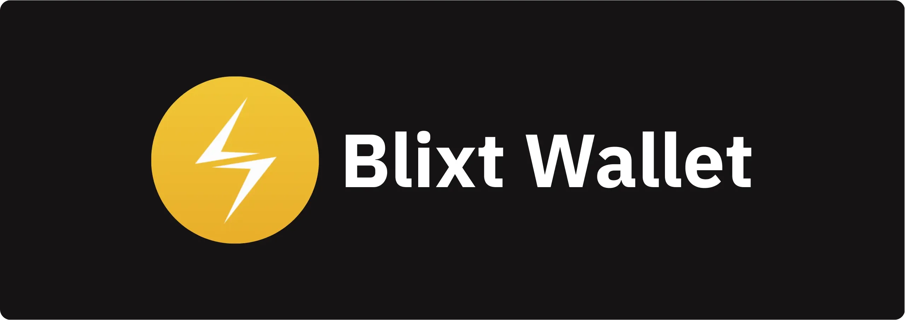


本指南面向所有希望以免费开放源码、完全非公用方式开始使用比特币闪电网络 (Lightning Network，简称 LN) 的新用户。


使用 [Blixt Wallet](https://blixtwallet.com/)，无论您身在何处，您的移动设备上都有一个完整的闪电节点。


如果您从未使用过比特币闪电网络，开始之前，[请阅读这篇关于闪电网络的简单解释类比](https://darth-coin.github.io/beginner/LN-airport-analogy-en.html)。


## 重要方面：


- Blixt 是一个私有节点，而非路由节点！请记住：这意味着 Blixt 中的所有 LN 通道都不会向 LN 图表公布（即所谓的私人通道）。这意味着，该节点不会通过 Blixt 节点路由他人付款。这个 Blixt 节点不是用来路由的，我重复一遍。主要是为了能够管理您自己的 LN 通道，并在需要时随时私下进行 LN 付款。只有在您进行交易之前，Blixt 节点才必须在线并同步。这就是为什么您会看到顶部有一个图标显示同步状态。同步只需片刻时间，取决于您保持离线状态的时间长短。


- Blixt 使用 LND (aezeed) 作为钱包后端，因此不要尝试将其他类型的比特币钱包导入其中。[这里您会查看所有钱包的种子助记词类型](https://coldbit.com/what-types-of-Mnemonic-seeds-are-used-in-Bitcoin/)。这里是 [所有类型钱包的更广泛列表](https://walletsrecovery.org/)。因此，如果您以前有一个 LND 节点，您可以将种子和 backup.channels 导入 Blixt，[如本指南中所述](https://darth-coin.github.io/nodes/shtf-restore-LND-node-en.html)。


- 在本指南的末尾，您将看到一个包含 ["提示和技巧"](https://darth-coin.github.io/wallets/getting-started-blixt-Wallet-en.html#tips) 的特别章节。


- 重要链接 - 请参阅本指南末尾的链接，并将其添加到书签中。


---

## Blixt - 初次接触


Darth 的妈妈决定开始使用 LN 和 Blixt。决定很难，但是明智。Blixt 只适合聪明人和那些真正想深入学习和使用 LN 的人。


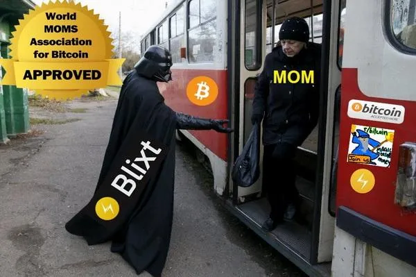


达斯警告他妈妈


**妈妈，如果您开始使用 Blixt LN 节点，您首先需要了解闪电网络，以及它是如何工作的，至少是在基本层面上。[我在这里整理了一份关于闪电网络的简单资源清单](https://blixtwallet.github.io/faq#what-is-LN)。请先阅读。**


Darth 的妈妈阅读了这些资源，并迈出了第一步：在她全新的安卓设备上安装 Blixt。Blixt 也适用于 iOS 和 macOS（桌面）。尽管如此，还是建议使用较新版本的安卓系统，至少是 9 或 10，以获得更好的兼容性和体验。在移动设备上运行全闪电节点并非易事，可能会占用一些空间（最小 600MB）和内存。


打开 Blixt 后，"Welcome" 屏幕会显示一些选项：


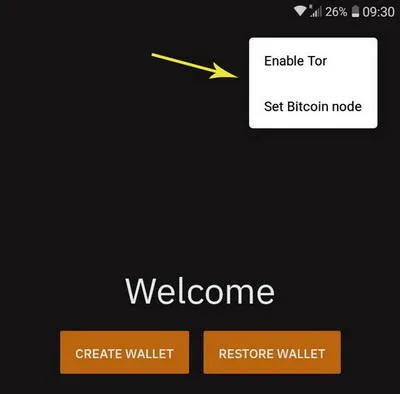


在右上角，您会看到 3 个小点，它们会激活一个选单：

- "Enable Tor"（启动 Tor）--用户可以启动 Tor 网络，特别是如果想恢复仅与 Tor 对等运行的旧 LND 节点。
- "Set Bitcoin node"（设置比特币节点）--如果用户想直接连接到自己的节点，通过 Neutrino 同步区块，可以直接在欢迎界面进行操作。如果您的网络连接或 Tor 不太稳定，无法连接到默认的比特币节点（node.blixtwallet.com），也可以使用该选项。
- 不久后，我们将在这里添加语言，这样用户就可以直接使用自己的语言。如果您想为这个开源项目贡献其他语言的翻译，[请在此加入](https://explore.transifex.com/blixt-Wallet/blixt-Wallet/)。


### 方案 A - 创建新的钱包


如果您选择 "Create a New Wallet"，则会直接跳转到 Blixt Wallet 的主界面。


这是您的 "驾驶舱"，也是 "主 LN 钱包"，因此请注意，它只会显示您的 LN 钱包的余额。链上钱包将单独显示（见 C）。


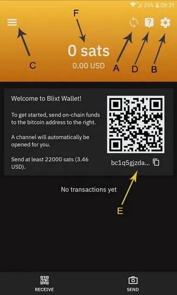


A - Blixt 区块同步指示图标。这是 LN 节点最重要的部分：与网络同步。如果该图标仍在运作，则表示您的节点尚未准备就绪！所以请耐心等待，特别是在第一次初始同步的时候。这可能需要 6-8 分钟，取决于您的设备和网络连接。您可以点击它查看同步状态：

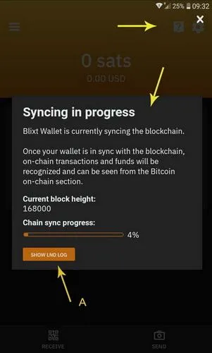


如果您想实时查看和阅读 LND 日志的更多技术细节，也可以点击 "Show LND Log"（A）按钮。这对调试和了解 LN 如何工作非常有用。


B - 在这里您可以访问所有的 Blixt 设置，而且非常多！Blixt 提供了许多丰富的功能和选项，让您像专家一样管理 LN 节点。所有这些选项在"[Blixt 功能页面](https://blixtwallet.github.io/features#blixt-options) - 选项选单"中有详细说明。


C - 这里是 "魔术抽屉" 选单，[此处也有详细说明](https://blixtwallet.github.io/features#blixt-drawer)。这里有 "Onchain Wallet（链上钱包）"（B）、闪电通道（C）、联系人、通道状态图标（A）、Keysend（D）。


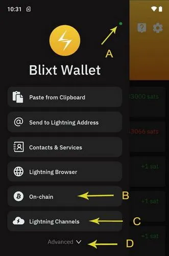


D - 帮助选单，包含常见问题/指南页面、联系开发者、Github 页面和 Telegram 支持小组的链接。


E - 显示您的第一个比特币地址，您可以在此存入您的第一笔测试 “聪”。这是可选项！如果您直接存入该地址，则会向 Blixt Node 开通一个 LN 通道。这意味着您将看到您存入的聪进入另一个链上交易（tx），用于打开 LN 通道。您可以点击右上角的 TX 选单，在 Blixt 链上钱包中查看（见 C 点）。


正如您在链上交易日志中看到的，步骤非常详细，显示了聪的去向（存款、打开、关闭通道）。


建议：


测试了几种情况后，我们得出结论，开通 100 到 500 万之间的通道效率更高。较小的渠道往往很快就会耗尽，与较大的渠道相比，支付的费用百分比更高。


F - 表示您的主要闪电钱包余额。这不是您的 Blixt Wallet 总余额，它只代表您在 "闪电通道" 中可用来发送的比特币/聪。如前所述，链上钱包是独立的。请记住这一点。链上钱包独立的一个重要原因是：它主要用于打开/关闭 LN 通道。


好了，现在 Darth 的妈妈将一些聪存入了主屏幕上显示的链上地址。建议您这样做时，将 Blixt 应用程序保持在线并激活一段时间，直到矿工将比特币交易存入第一个区块。


之后可能需要长达 20-30 分钟的时间，直到通道完全确认并打开，您就可以在 "魔法抽屉"--"闪电通道"中看到它已处于激活状态。此外，抽屉顶部的彩色小点，如果显示为绿色，则表示您的闪电通道已上线，可以用于通过闪电网络发送聪。


地址和显示的欢迎信息将消失。现在无需再打开自动通道。您也可以在设置选单中停用该选项。


现在，我们将继续前进，测试其他功能和选项以打开 LN 通道了。


现在，让我们与另一个节点同行打开另一个通道。Blixt 社区汇集了[开始使用 Blixt 的节点列表](https://github.com/hsjoberg/blixt-Wallet/issues/1033)。


**在 Blixt 中打开 LN 通道的程序**


这一过程非常简单，只需几个步骤和耐心：

- 进入 [Blixt 社区](https://github.com/hsjoberg/blixt-Wallet/issues/1033) 节点名单
- 选择节点并点击其名称标题链接，将打开其 Amboss 页面
- 单击以显示节点 URI 地址的二维码


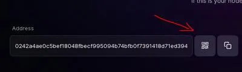


打开 Blixt，进入顶部抽屉--"Lightning Channels"，点击 "+" 按钮


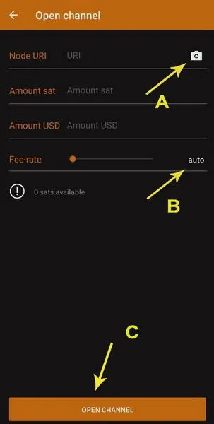


现在，点击 (A) 相机扫描 Amboss 页面上的二维码，节点详细信息将被填写。为所需通道添加聪的金额，然后选择交易的费率。您可以选择 auto（自动，B）以加快确认速度，也可以滑动按钮手动调整。您也可以长按数字，随意编辑。


不要将其设定为低于 1 sat/vbyte！通常最好在打开通道前查看 [Mempool 手续费](https://Mempool.space/)，选择方便的费用。


完成后，现在只需点击 "open channel" 按钮，然后等待 3 次确认，这通常需要 30 分钟（大约每 10 分钟 1 个区块）。


确认后，您将在 "Lightning Channels" 部分中看到该通道已激活。


---

## Blixt - 第二个接触


好了，现在我们的 LN 通道只有支付额度。这意味着我们只能发送，而不能通过 LN 接收聪。


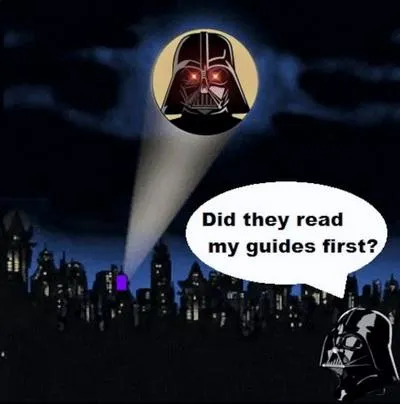


为什么？你读过开头提到的那些指南吗？没有？回去读一下。了解LN通道的工作原理非常重要。

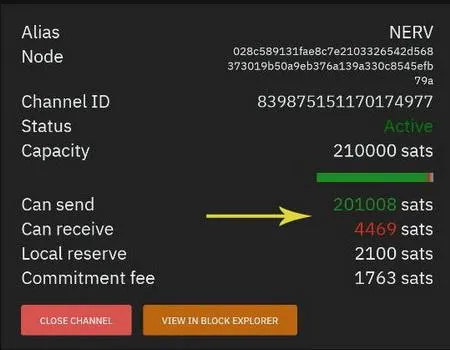


正如您在此示例中所见，首次充值后开通的通道，其收款额度（“可接收”）并不充裕，但出支付额度（“可发送”）却非常充足。


那么，如果您想通过闪电网络 (LN) 接收更多聪，有哪些选择呢？


- 从现有通道中花费一些聪。是的，LN 是一个比特币支付网络，主要用于更快、更便宜、更私密、更便捷地花费您的聪。LN 并非持有聪的方式，持有聪需要使用链上钱包。


- 使用 Subsub 交换服务将一些聪兑换回您的链上钱包。这样，您并非花费 sats，而是将其兑换回您自己的链上钱包。您可以在 [Blixt Guides Page](https://blixtwallet.github.io/guides) 中看到一些详细的方法。


- 从任何闪电提供商处开通入站通道。这里有一个关于如何使用 LNBig LSP 开通收款额度通道的视频演示。这意味着，您需要支付少量费用才能创建一个没有支付额度的闪电通道，之后您就可以向该通道接收更多聪。如果您是收款大于支出的商家，这是一个不错的选择。如果您通过闪电网络购买聪，例如使用 Robosats 或任何其他闪电网络交易所，这也是一个不错的选择。


- 使用 Blixt 节点或任何其他 Dunder LSP 提供商开设 Dunder 通道。Dunder 通道是一种获得收款额度的简单方法，同时您还可以将一些聪存入该通道。这个做法也很好，因为它会用一个 [UTXO](https://en.Bitcoin.it/wiki/UTXO) 打开通道，而这个 [UTXO](https://en.Bitcoin.it/wiki/UTXO) 并非来自您的 Blixt Wallet。这将增加一些隐私。如果您手上没有链上资金、无法开普通闪电通道，但在其他闪电钱包中有聪，也可以直接用那个钱包通过 LN 支付，来完成 Dunder 通道的开通与充值。[更多关于 Dunder 工作原理和如何运行自己的服务器的详细信息，请点击此处](https://github.com/hsjoberg/dunder-lsp)。


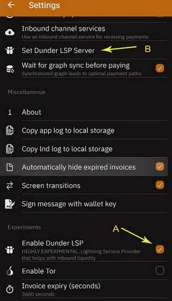


以下是激活开通 Dunder 通道的步骤：

- 进入 "Settings"，在 "Experiments" 部分激活 "Enable Dunder LSP "复选框。
- 完成后，回到 "Lightning Network" 部分，您会看到出现了 "Set Dunder LSP Server" 选项。默认设置为 [https://dunder.blixtwallet.com](https://dunder.blixtwallet.com)，但您可以用任何其他 Dunder LSP 地址进行更改。[这里有一个 Blixt 社区列表](https://github.com/hsjoberg/blixt-Wallet/issues/1033)，其中的节点可以为您的 Blixt 提供 Dudner LSP 通道。
- 现在您可以进入主屏幕，点击 "RECEIVE" 按钮。然后按照本指南[说明](https://blixtwallet.github.io/guides#guide-lsp)进行操作。


好了，在 Dunder 通道确认后（需要几分钟时间），您将拥有 2 个 LN 通道：一个是最初用自动驾驶仪模式打开的（通道 A），另一个是用 Dunder 打开的、有更多收款额度的（通道 B）。


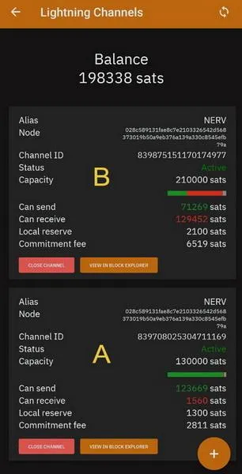


很好，现在您可以通过 LN 发送和接收足够的聪！


比特币闪电网络使用愉快！

---

## Blixt - 第三个接触


请记住，在第一章 "初次接触" 中，欢迎屏幕上有两个选项：


- [方案 A](https://darth-coin.github.io/wallets/getting-started-blixt-Wallet-en.html#option-a) - 创建新的钱包
- 方案 B - 恢复钱包


现在我们来讨论一下如何恢复 Blixt Wallet 或其他 LND 出故障的节点。这部分内容稍微有点技术性，但请仔细听。其实并不难。

### 方案 B - 恢复钱包


过去我写过一篇关于[如何恢复出故障的 Umbrel 节点]的专门指南(https://darth-coin.github.io/nodes/shtf-restore-LND-node-en.html)，其中也提到了使用 Blixt 作为快速恢复程序的方法，使用 Umbrel 的种子 + channel.backup 文件。


我还撰写了如何恢复 Blixt 节点或将 Blixt 迁移到其他设备的指南，[此处](https://blixtwallet.github.io/faq#blixt-restore)。


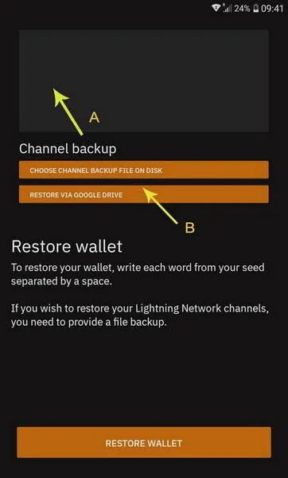


让我们用简单的步骤来解释一下这个过程。如上图所示，要恢复之前的 Blixt/LND 节点，您需要做两件事：


- 顶部方框是您必须填写种子（旧节点/死节点）中所有 24 个单词的地方
- 底部有两个按钮选项，用于插入/上传之前从旧版 Blixt/LND 节点中保存的 channel.backup 文件。它可能是本地文件（您之前将其上传到设备中），也可以是 Google Drive/iCloud 远程位置的文件。Blixt 可将通道备份直接保存到 Google drive/iCloud drive 中。详情请参阅 [Blixt 功能页面](https://blixtwallet.github.io/features#blixt-options)。


值得一提的是，如果您之前没有打开过任何 LN 通道，则无需上传任何通道备份文件。只需插入 24 个字的种子并点击还原按钮即可。


别忘记按照我们在 "方案 A" 部分的说明，从顶部 3 点选单激活 Tor。这适用于只有 Tor 对等网络，且无法通过 clearnet（域名/IP）与之联系的情况。否则没有必要。


另一个有用的功能是从顶部菜单设置特定的比特币节点。默认情况下，它会从 node.blixtwallet.com（Neutrino 模式）同步块，但您也可以设置任何其他提供 Neutrino 同步的比特币节点。


填好这些选项并点击还原按钮后，Blixt 将首先通过 Neutrino 同步区块，正如我们在 "初次接触" 一章中所述。所以请耐心点击同步图标，在主屏幕上观看恢复过程。


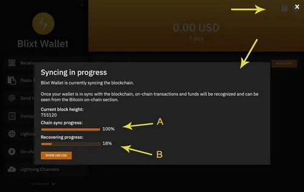


正如您在本例中看到的，比特币区块已 100% 同步（A），恢复过程正在进行（B）。这意味着您之前拥有的 LN 通道将被关闭，资金将恢复到您的 Blixt 链上钱包。


这个过程需要时间！因此，请耐心等待，尽量让您的 Blixt 保持在线状态。初始同步可能需要 6-8 分钟，关闭通道可能需要 10-15 分钟。所以您最好给设备充好电。


启动此过程后，您可以在 Magic Drawer - Lightning Channels 中查看之前每个通道的状态，其中显示处于 "待关闭" 状态。每个通道关闭后，您就可以在链上钱包中看到关闭的交易（请参阅 Magic Drawer - Onchain），并打开交易选单日志。


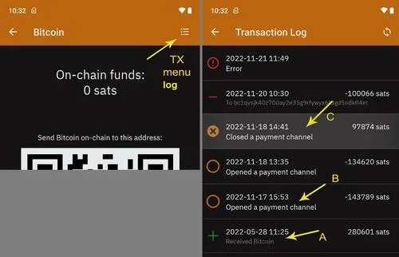


如果没有，还可以检查并添加以前在旧 LN 节点中的对等节点。因此，请进入 "Settings" 选单，下拉至 "Lightning Network"，然后输入 "显示闪电对等网络" 选项。


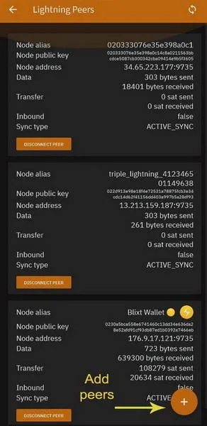


在该部分中，您将看到您当时连接的对等节点，您还可以添加更多对等节点，但最好是添加那些您之前有通道的对等节点。只需访问 [Amboss 页面](https://amboss.space/)，搜索您的对等节点别名或节点 ID，然后扫描它们的节点 URI。


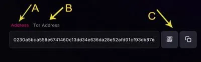


如上图所示，共有三个方面：


A - 代表信息网络节点 Address URI（域/IP）


B - 表示 Tor URI 地址 (.onion)


C - 用 Blixt 相机扫描的二维码或复制按钮。


您必须将该节点 URI 地址添加到您的对等节点列表中。所以请注意，仅有节点别名或节点 ID 是不够的。


现在，您可以进入 Magic Drawer（左上角选单）- Lightning Channels，查看资金将在哪个到期区块高度返还到您的链上 Address。


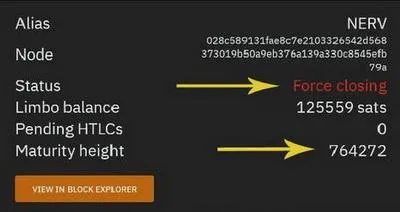


区块编号为 764272 的资金将在您的比特币上链地址中使用。从第 1 个确认区块到资金被释放可能需要 144 个区块。[请在 Mempool 中查看](https://Mempool.space/)。


就这样。只需耐心等待，直到所有通道关闭，且资金回到您的链上钱包中。


👉 **秘密恢复方法：**


还有一种方法可以在不关闭通道的情况下恢复你的 Blixt LND 节点。不过，这个方法对一般新手用户是隐藏的，只适合清楚自己在做什么的高级用户使用


如果需要在不关闭现有 LN 通道的情况下，将现有（运行中）Blixt 节点迁移到另一个新设备上，则必须执行以下步骤：


- 我们假设您已经保存了 Blixt 钱包的助记词（24 个单词 aezeed）。
- 在旧设备上，前往 "Settings" - “Debug section” - "Compact LND database"。此步骤为可选步骤，但如果您希望 channel.db 文件更小，建议执行。通常情况下，该文件会比较大，具体取决于您的节点活动。此操作将重启 Blixt 并压缩数据库文件的大小。
- 重启后，前往 “Settings”，并将您的常用别名更改为 “Hampus”。这将激活仅供高级用户使用的隐藏选项
- 向下滚动至“调试”部分，您会看到一个新选项 “Export channel.db file”。警告！执行此导出操作后，旧设备上现有的 Blixt LN 节点将被禁用，并且整个节点数据库 (channel.db) 将被导出，以便导入到新设备。
- 此数据库文件将保存到旧设备上的指定文件夹（文档或下载）中，您需要将其原封不动地移动到新设备。例如，您可以使用 [LocalSend FOSS app](https://github.com/localsend/localsend) 直接在设备之间传输文件。
- 此时，您的旧 Blixt 设备必须保持关闭状态。切勿再次打开它！
- 将 channel.db 文件传输到新设备后，启动 Blixt 的新安装，并在第一个屏幕上选择 “Restore Wallet”。
- 长按（不要单击！）“Select SCB file”按钮，然后您将看到选择 channel.db 文件的选项，将其保存到新设备的本地。如果您只是单击该按钮，它将默认使用一个包含已关闭通道的 SCB 文件，它不适用于包含完整备份的实时通道。
- 输入 24 个助记词单词，然后单击 “Restore”。
- 您将看到 Blixt 开始与 Neutrino 同步。您还可以查看同步日志。
- 请注意！在此阶段，请尽量保持 Blixt 始终处于打开状态！不要让它进入睡眠模式或关闭应用程序屏幕。这可能会中断初始同步，您需要重新进行同步。请耐心等待，只需几分钟。
- 初始区块同步完成后，系统会快速扫描您之前的钱包地址，然后您的通道就会恢复在线，一切正常。
- 遗憾的是，之前的支付记录和对等点目前还无法恢复。不过，这并不重要。


完成！现在您成功恢复了 Blixt LN 节点。如果您之前正确保存了 channel.db 文件，它还可以与其他 LND 备份（Umbrel、Raspiblitz 等）一起使用。因此，Blixt 可以保存任何 LND 死节点。


---

## Blixt - 第四次接触


本章主要介绍自定义和更好地了解 Blixt 节点。我不会介绍所有可用的功能，因为这些功能太多，而且在 [Blixt 功能页面](https://blixtwallet.github.io/features) 中已有说明。


不过，我还是要指出其中的一些必要条件，以便您在使用 Blixt 的过程中获得良好的体验。


### A - 名称（NameDesc）


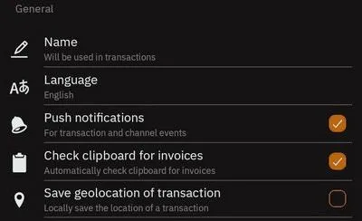


[NamDesc](https://github.com/lightning/blips/blob/master/blip-0011.md)是 BOLT11 发票中传达 "接收者名称" 的标准。


您可以使用任何名字，也可以随时更改。


该选项在各种情况下都非常有用，当您想在发送发票说明的同时发送一个名字时，接收者就可以知道是谁收到了这些聪。这完全是可选的，而且在付款界面，用户必须勾选是否发送别名。


下面是使用 [chat.blixtwallet.com](https://chat.blixtwallet.com/) 时出现的示例


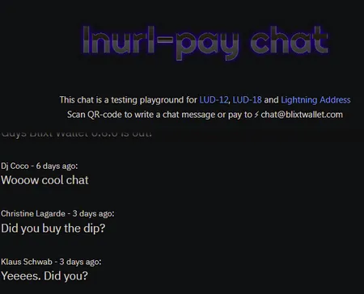


这是向另一个支持 NameDesc 的钱包应用程序发送的另一个示例：


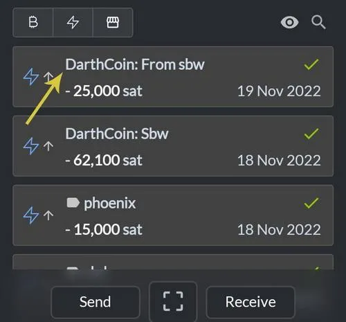


### B - 闪电盒（Lightning Box）


从新的 v0.6.9-420 [最近发布](https://github.com/hsjoberg/blixt-Wallet/releases/tag/v0.6.9-420)开始，Blixt 为 Blixt 中的闪电地址引入了一项新的强大功能。


这项新功能是可选的，默认情况下不开启！


目前，默认的 LN Box 由 Blixt 服务器运行，并提供 @blixtwallet.com LN 地址。但任何拥有 LND 公共节点的人都可以运行 LN Box 服务器，并为自己的域提供 LN 地址，实现自我托管。


目前，Blixt 服务器只将发送到 LN 地址 @blixtwallet.com 的付款转发给设置了 LN 地址的 Blixt 用户。用户必须将其 Blixt 节点钱包设置为 "持久模式"，才能接收到发送到 @blixtwallet.com LN 地址的付款。


请参阅发布说明中的视频演示，了解如何在 Blixt 中设置 LN 地址。


在 Blixt Wallet 应用程序中实现的 LN Address 就像通过 LN 聊天一样，即时而有趣，还支持 [LUD-18](https://github.com/lnurl/luds/blob/luds/18.md)（为付款添加别名）。您可以在联系人列表中添加所有常用的 LN 地址，以便随时聊天。现在，Blixt 可以说是一个完整的 LN 聊天应用程序了😂😂。


另一个有用的功能是全面支持 LUD-18（[Stacker.News](https://stacker.news/r/DarthCoin) 和其他软件也支持该功能）。


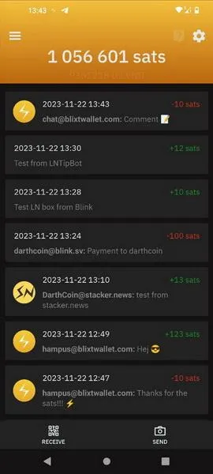


从上面的截图中可以看到，从 Stacker News 账户发送时，徽标 + LN 地址 + 消息显示得很好。同样的方法也适用于从 Blixt 发送，您可以附加您的 Blixt LN 地址或简单地添加别名（先前在 Blixt 设置中设置），甚至两者兼而有之。


LUD-18 中的这一选项对于订阅服务也很有用，用户可以发送一个特定的别名（不是您的节点别名或您的真名！），根据该别名，您可以注册或收到特定的消息或其他信息。将别名（[LUD-18](https://github.com/lnurl/luds/blob/luds/18.md)）+ 注释（[LUD-12](https://github.com/lnurl/luds/blob/luds/12.md)）附加到 LN 付款可以有多种用途！


下面是 [Lightning Box](https://github.com/hsjoberg/lightning-box)的代码，如果您为自己、为家人和朋友在自己的节点上运行它。


如果您有一个良好的公共 LN 节点（仅适用于 LND），您还可以在这里为 Blixt 移动节点运行 [LSP Dunder 服务器](https://github.com/hsjoberg/dunder-lsp)，并为 Blixt 用户提供流动性。


### C - 备份 LN 通道和种子助记词


这是一个非常重要的功能！


打开或关闭 LN 通道后，应进行备份。可以手动在本地设备（通常是下载文件夹）或使用 Google Drive 或 iCloud 账户保存一个小文件。


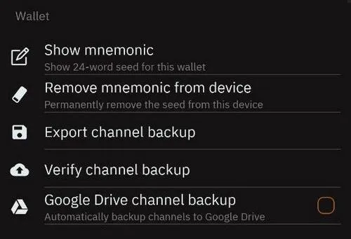


进入 Blixt 设置 - Wallet 部分。在这里，您可以选择保存 Blixt Wallet 的所有重要数据：


- "Show Mnemonic"（显示助记词）--将显示 24 个单词的助记词，以便将其写下来
- "Remove Mnemonic from Device"（从设备中删除助记词）--这是可选的，只有当您真的想从设备中删除助记词时才使用。这不会清除钱包，只会清除助记词。但请注意！如果您没有先写下它们，则无法恢复它们。
- "Export channel backup"（导出通道备份）--该选项会在本地设备上保存一个小文件，通常放在 "downloads" 文件夹中。
- "Verify channel backup"（验证通道备份）--如果使用 Google Drive 或 iCloud 来检查远程备份的完整性，这是一个不错的选项。
- "Google drive channel backup"（Google drive 通道备份）- 将备份文件保存到您的个人 Google  Drive 中。该文件经过加密，并存储在一个独立的存储库中，而不是您常用的谷歌文件。因此不会有任何人读取的问题。总之，如果没有助记词，该文件将毫无用处，因此任何人都无法从该文件中获取您的资金。


在这一部分，我的建议如下：


- 使用密码管理器安全存储助记词和备份文件。KeePass 或 Bitwarden 在这方面非常出色，可用于多平台、自助托管或离线。
- 每次打开或关闭通道时都要进行备份。该文件会根据通道信息进行更新。您在 LN 上完成每次交易后都无需备份。通道备份不会存储这些信息，只会存储通道的状态。


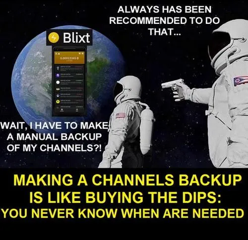


---

## Blixt - 提示和技巧


### 1. 同步问题


"_我的 Blixt 同步有问题...我的 Blixt 不显示余额...我的 Blixt 无法打开通道...我试着在另一个设备上还原它......等等_"


所有这些问题的起因都是因为您的设备无法正常同步。请理解这一点：Blixt 是一个移动的 LND 节点，使用 Neutrino 同步/读取区块。


- 以下是 [Bitcoin Magazine](https://bitcoinmagazine.com/technical/why-Bitcoin-wallets-need-block-filters) 提供的浅显版说明
- 以下是 [Bitcoin Optech](https://bitcoinops.org/en/topics/compact-block-filters/) 提供的更多技术资源
- 以下是如何在自己的主节点上激活 Neutrino 并为移动节点提供区块过滤器，摘自 [Docs Lightning Engineering](https://docs.lightning.engineering/lightning-network-tools/LND/enable-neutrino-mode-in-Bitcoin-core)


提醒：通过 clearnet 使用 Neutrino 是完全安全的，您的 IP 或 xpub 不会泄露。您只是通过中微子从远程节点读取区块。仅此而已。其余所有操作均在本地设备上完成。


因此，没有必要与 Tor 一起使用。Tor 会在同步过程中增加大量延迟，并使 Blixt 非常不稳定。如果您真的想在 Tor 上使用，请确保你在做什么，并有良好的连接和耐心。使用 VPN 也是一样。请注意 VPN 为您提供的延迟。


您可以在电脑或手机上直接 ping Neutrino 服务器，来测试它的延迟。


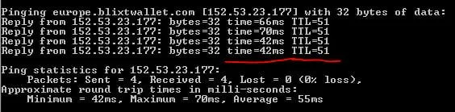


这是与 Neutrino 服务器 europe.blixtwallet.com 的普通 ping，显示连接非常良好，响应时间平均为 50 毫秒，TTL 为 51。响应时间会有变化，但不会太大。TTL 必须保持稳定。


如果这些值高于 100-150ms，那么同步过程就会停滞，甚至更糟，可能会导致对等点关闭通道！请不要忽视这一点。


如果没有正确的同步，您也无法看到正确的平衡，否则您的 LN 通道将无法上线运行。无论您的下载速度有多高，这都无关紧要。重要的是时间响应和 TTL（直播时间）。


这就像是拉丁美洲用户的普遍情况。我不知道那里发生了什么，但你们的连接非常糟糕，ping 超过 200 毫秒，可能会中断任何同步。


那么，这些用户该如何解决呢？


- 停止使用带有 Tor 的 Blixt。它们完全没用。
- 您可以使用 VPN，但要明智选择，并随时监控 ping。使用离您的地理位置更近的 VPN。请记住，距离意味着更久的响应时间。
- 请明智选择您的 Neutrino 服务器对等点，以下是知名的公共中微子服务器列表：


```txt
For US region
btcd1.lnolymp.us | btcd2.lnolymp.us
btcd-mainnet.lightning.computer
swest.blixtwallet.com (Seattle)
node.eldamar.icu
noad.sathoarder.com
bb1.breez.technology | bb2.breez.technology
neutrino.shock.network
For EU region
europe.blixtwallet.com (Germany)
For Asia region
sg.lnolymp.us
asia.blixtwallet.com
```


另一种方法是从公布 "紧凑过滤器"（BIP157 / neutrino）的节点列表中选择一个 - [Bitnodes Page Neutrino filter](https://bitnodes.io/nodes/?q=NODE_COMPACT_FILTERS)。选择一个离您的地理位置较近的节点。


另一种方法（最好的方法）是连接到本地社区节点，该节点由您认识的朋友或团体运行，并提供 neutrino 连接。[这里有操作说明。](https://docs.lightning.engineering/lightning-network-tools/LND/enable-neutrino-mode-in-Bitcoin-core) 他们的节点不会受到任何影响，他们只需要一个稳定的公共连接。


拉丁美洲和加勒比地区需要更多的 Neutrino 服务器，以实现更好更快的同步。因此，请与当地的比特币社区一起组织起来，决定谁在哪里运行 Bitcoin Core 和 Neutrino 服务器供自己使用。只要有一个公共 IP 就足够了。如果您无法访问公共 IP，可以使用 VPS IP 并通过 wireguard 隧道连接到您家里的节点。这样，您就可以将所有流量重定向到本地 VPS IP，而不会泄露家庭节点的任何私人信息。


### 2. 节点无法完成同步


"_我的 Blixt 与 Neutrino 服务器连接良好，但同步过程卡住了。_"


#### 时间服务器


有时，人们会使用各种旧设备，或者没有正确连接到时间服务器。Neutrino 在到达与实际本地时间不符的实际区块之前，同步是正常的。您会在 Blixt LND 日志中看到 "区块时间戳与未来时间相差甚远" 或 "报头未通过合理性检查" 的错误信息。


快速解决方法：为设备设置正确的时间和日期，然后重启 Blixt。


#### 设备空间不足


有时，使用空间较小的旧设备，可能会达到阈值限制而卡住。事实上，使用 LND 移动节点越多，neutrino 文件和 channel.db 文件就越大。


快速修复：前往 Blixt Options - Debug section - 选择 "stop LND and delete neutrino files。它将重启应用程序并开始重新同步。有时这种快速修复方法也能修复损坏的数据。请记住，完全重新同步需要一些时间，1 到 3 分钟。它不会删除现有资金或通道，但重新同步后可能会触发对比特币地址的重新扫描，这可能需要更多时间。


下一步是检查还有多少数据被占用。您可以在 Android App info - Data 中查看。如果仍然大于 400-500MB，可以压缩 LND 文件。前往 Blixt Options - Debug section - Select "Compact DB LND"。如果没有自动执行，请重启 Blixt 应用程序。压缩会在启动时进行，而且只进行一次。现在您将看到 Blixt 数据的占用率降低了。


#### 持久模式（Persistent Mode）


有时，人们很长时间都不会打开 Blixt，因此同步时间过长。但他们希望一打开就能立即同步。


请耐心等待，并查看顶部的旋转轮。您可以选择 "Options"-"See Node Info"，查看同步到链和同步到图表是否标记为 "true"。如果没有标记为 "true"，您就无法正确使用 Blixt，无法正确查看余额，无法在线查看 LN 通道，也无法进行支付。


快速修复：有一个功能强大的选项可以让您的 Blixt 节点 "保持活跃"。前往 Options - Experiments - Select "Activate Persistent Mode"。这将重启您的 Blixt，并将 LND 服务置于持久模式，也就是说，即使您切换到其他应用程序或直接关闭 Blixt（不是强制关闭或杀死任务），它也会始终处于激活状态，并保持在线同步。如果连接稳定且需要多次使用 Blixt，您可以整天保持这种状态。这样不会消耗太多电池。


### 3. 我想迁移到另一个设备


关于这种情况，我在[常见问题页面](https://blixtwallet.github.io/faq#blixt-restore)上写了详尽的指南：有两个选项，快速（迁移前合作关闭通道）和慢速（因旧设备已死而强制关闭通道）。


但我想在这里重申一些重要方面，并增加一个新的 "秘密" 程序。


提醒：

- 每次打开或关闭通道后，请务必备份通道状态 (SCB)。只需几秒钟即可完成。
- 不要保留旧的 SCB 文件，以免混淆和恢复它们。这些文件完全无用，而且如果您使用它们，可能会触发处罚程序。如果要恢复，请始终使用最后一个版本的 SCB 文件。
- 将 SCB 文件（扩展名为 .bin 的加密文本）从设备中保存到安全的地方。您可以使用 [LocalSend](https://github.com/localsend/localsend) 将该文件移动到 PC 或其他设备上。
- 同时将 Blixt Wallet 的种子助记词保存在安全的地方，例如离线密码管理器/加密 USB。


秘密方法：如何在不关闭现有通道的情况下迁移 Blixt 节点。为此，您需要仔细阅读本指南中关于恢复钱包的前一节 "第三次接触"。


这个程序不适合新手，只适合高级用户！因此，我建议只有在 Blixt 开发者或我的支持人员的协助下才能完成。请不要忽视这一建议。


### 4. 与哪些对等点打开通道？


正如我在 [Blixt guides page](https://blixtwallet.github.io/guides) 中写到，很多方法可以用这个移动 LND 节点打开通道。但我想在这里提醒大家一些重要的方面：


- 与知名 LSP 节点和社区担保对等点开放。[参见此列表](https://github.com/hsjoberg/blixt-Wallet/issues/1033)
- 不要使用随机的 Tor 节点。这些节点毫无价值，您只会遇到无法付款的问题。无论您的朋友 "节点运行者" 在丛林中的 Tor 节点有多好，它都不会为你提供移动私人节点的最佳路线。您不能因为某人是您的朋友就与他建立联系。这里不是 Facebook！您打开通道的目的是：路线好、费用低、可用性高。
- 没必要开一大堆小通道，2-3 个或最多 4 个，但要有大量的聪。不要开小型通道，它们完全没用。对于移动电话来说，小于 20 万的通道没什么用途。
- 请记住提供收款额度 JIT（及时）通道的 LSP。这些通道非常有用，因为您不需要使用任何 UTXO，您可以用其他LN 钱包中已有的资金支付开通的渠道，为开通更大的通道堆叠和准备资金。您应该使用这些对您有利的 JIT 通道。[我在本指南中已经解释过](https://darth-coin.github.io/nodes/managing-lightning-node-liquidity-en.html) 像 Blixt 这样的私有节点的同行有更多选择。另外，[在本指南中，我在 SN 上发布了](https://stacker.news/items/679242/r/DarthCoin) 我解释了如何管理私有移动节点的流动性。


---

## 结论


好了，Blixt 还提供了许多其他令人惊叹的功能，我会让您逐一发现它们，尽情享受其中的乐趣。


这款应用程序确实被低估了，主要原因是它没有任何风险投资的资金支持，是由社区驱动的，是带着对比特币和闪电网络的热爱和激情开发的。


Blixt 这个移动 LN 节点是许多用户手中非常强大的工具，只要他们知道如何使用它。试想一下，您口袋里装着一个 LN 节点，走遍全世界也不会有人知道。


此外，钱包还具有其他丰富的功能，而这些功能是其他钱包应用程序很少或根本无法提供的。


同时，这里有关于这个奇妙的比特币闪电节点的所有链接：


- [Blixt 官方网页](https://blixtwallet.com/)
- [Blixt Github 页面](https://github.com/hsjoberg/blixt-Wallet/)
- [Blix t功能页面](https://blixtwallet.github.io/features) - 逐一解释每个特性和功能。
- [Blixt 常见问题页面](https://blixtwallet.github.io/faq) - Blixt 的问答和故障排除列表
- [Blixt 指南页面](https://blixtwallet.github.io/guides) - Blixt 的演示、视频教程、额外指南和使用案例
- 下载平台：[Android Play Store](https://play.google.com/store/apps/details?id=com.blixtwallet) | [iOS](https://testflight.apple.com/join/EXvGhRzS) | [APK 直接下载](https://github.com/hsjoberg/blixt-Wallet/releases)
- [直接支持的 Telegram 群组](https://t.me/blixtwallet)
- [Twitter](https://twitter.com/BlixtWallet)
- [Geyser 众筹页面](https://geyser.fund/project/blixt) - 随心所欲地捐赠聪以支持该项目
- [LNURL Chat Blixt](https://chat.blixtwallet.com/) - 匿名 LN 聊天
- [Blixt presentation - promo video](https://lightning.video/06fdf68f99e246a6ec6ba1470677b9e632faaad4aa0ca9773c38714b682a4ac1)
- [Blixt Girls Calendar](https://lightning.video/eeb744202ad3f14c18bf6d719970ebd9c53f0f13b79c94d299c6be623fba64b6) - 宣传视频（您可以测试第一次使用 LN 的情况）
- [可打印的 A4 传单，介绍使用 Blixt 的第一步，有多种语言版本](https://github.com/BlixtWallet/blixtwallet.github.io/tree/master/assets/flyer)。
- [Blixt 还提供功能齐全的演示版](https://blixt-Wallet-git-master-hsjoberg.vercel.app/)，可直接在其网站或专用版网页上观看，以便在实际使用前进行全面的体验测试。


---
**免责声明：**


*我没有得到此应用程序开发者的任何报酬或支持。我写这本指南是因为我看到人们对钱包应用程序的兴趣越来越大，而新用户仍然不了解如何开始使用它。同时也是为了帮助 Hampus（主要开发者）提供有关使用 Wallet.* 节点的文档。


*除了推动比特币和闪电网络的采用，我对推广这个 LN 应用程序没有任何其他兴趣。这是唯一的办法！*


---
