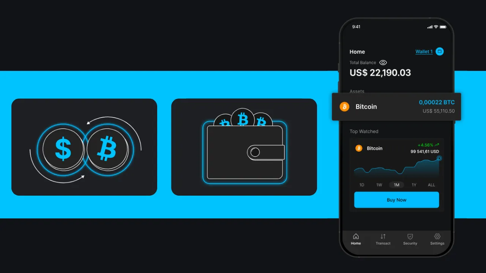
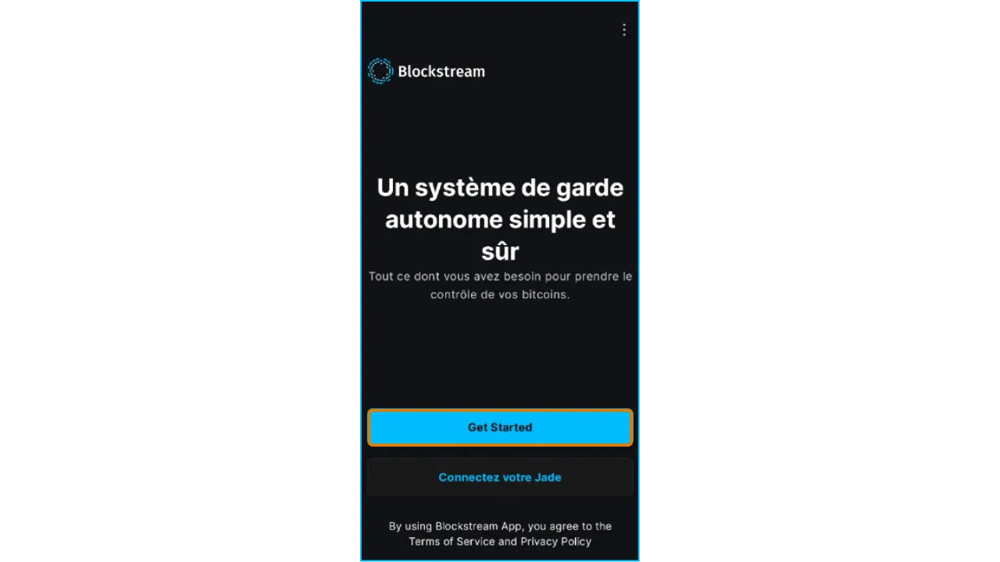
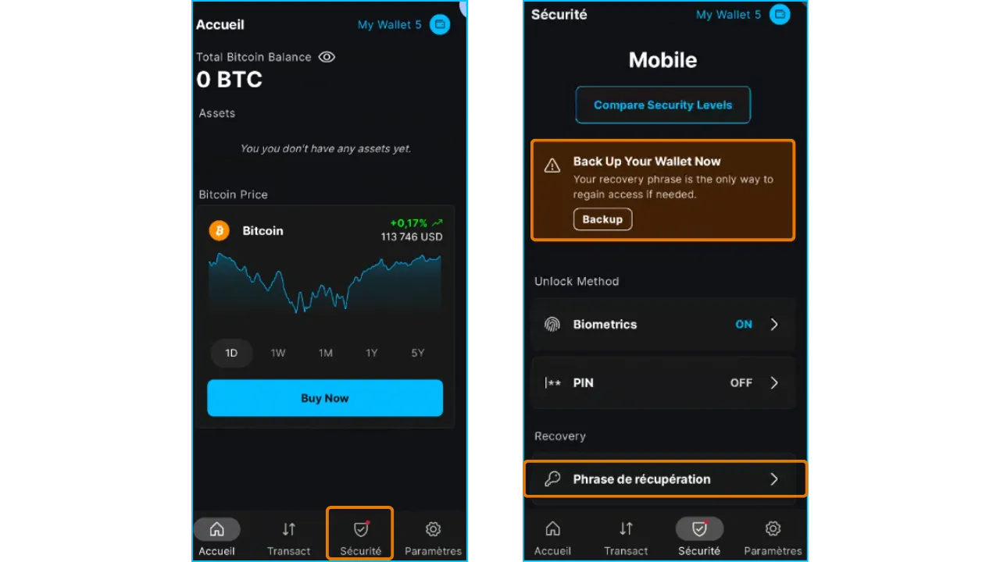
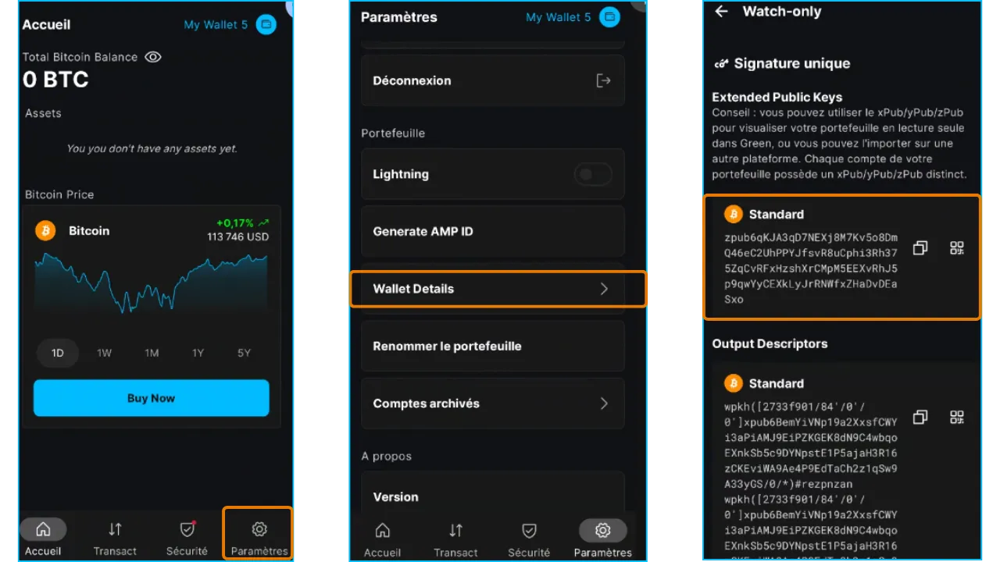
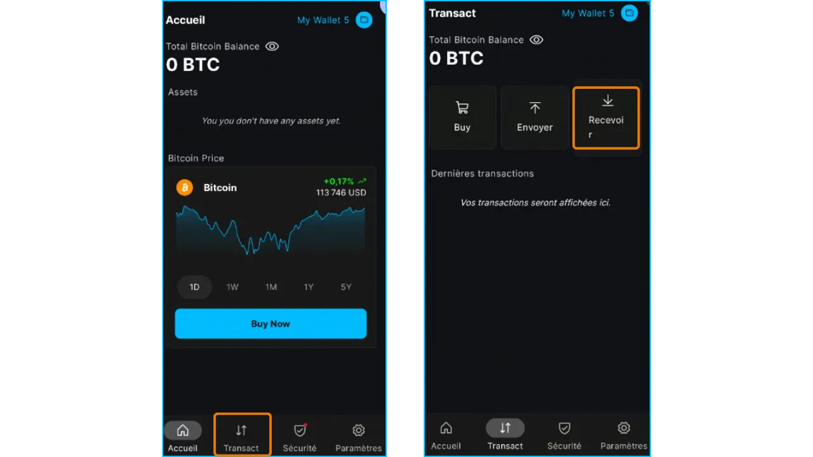
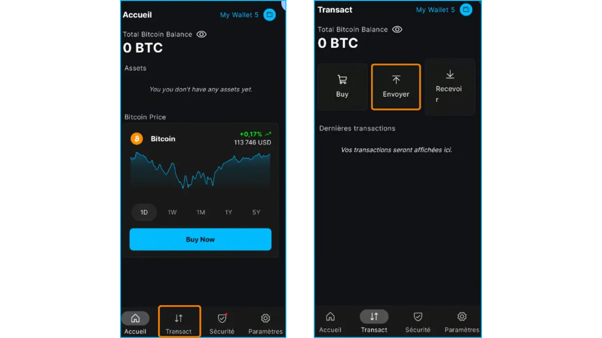
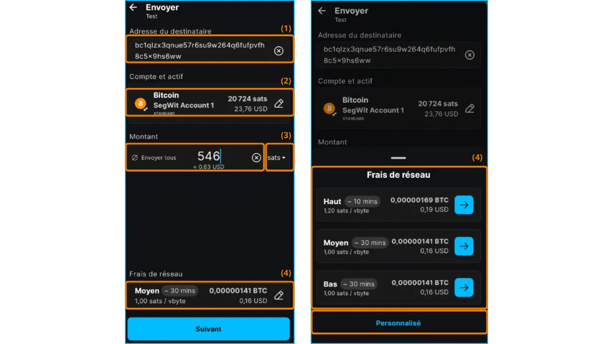
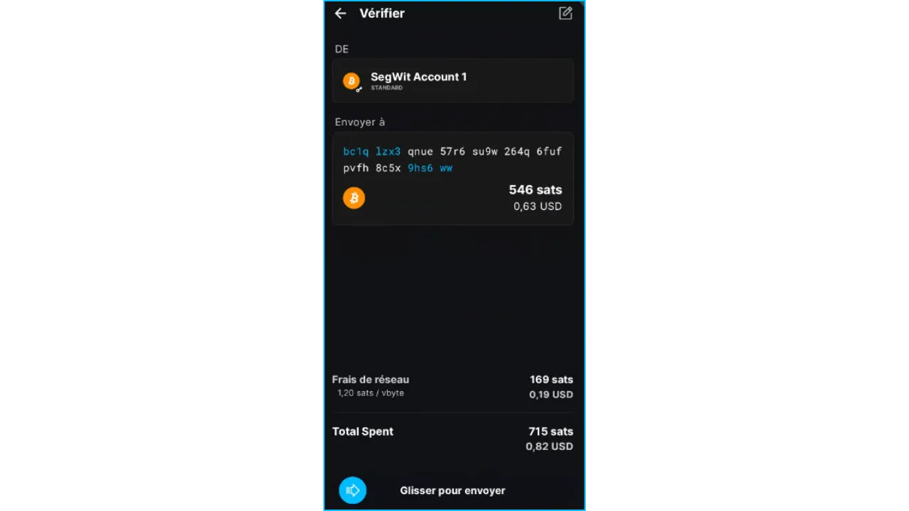
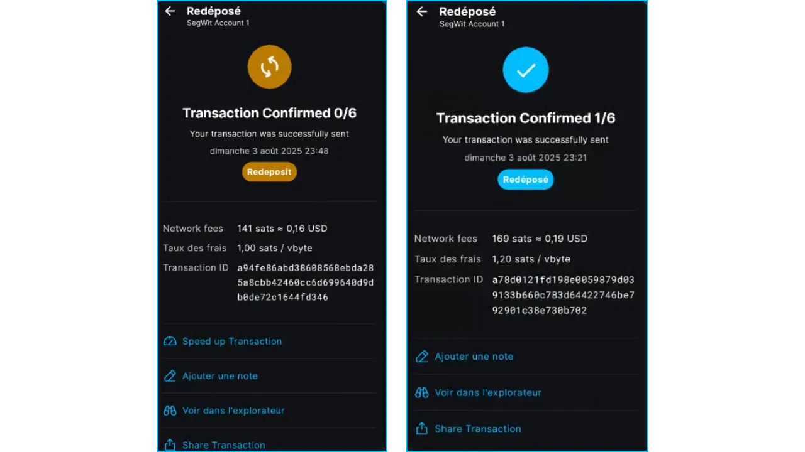
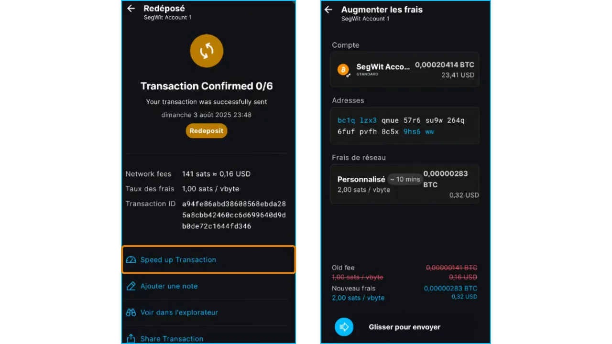

## 1.导言

### 1.1. 教程目标

- 本教程介绍如何使用 **Blockstream App** 移动应用程序管理比特币链上钱包，即直接在主比特币区块链上记录的交易。
- 内容包括安装、初始配置、创建软件钱包以及接收和发送比特币的操作。
- 注意：附录中的其他教程涵盖 Liquid、仅观看和桌面版。

### 1.2. 目标受众

- **初学者**：希望使用直观移动应用程序管理比特币的用户。
- **中级用户**：希望了解链上功能和隐私选项（如 Tor 或 SPV）的用户。

### 1.3. 关于热钱包的提醒

- **热钱包**、**软件钱包**、**移动钱包**：都是安装在智能手机、电脑或任何联网设备上的应用程序名称，用于管理和保护比特币钱包的私钥。
- 与**硬件钱包**（也称为**冷钱包**）不同的是，软件钱包是在联网环境中运行的，因此更容易受到网络攻击。

- **建议用途**：
    - 非常适合管理中等数量的比特币，尤其是日常交易。
    - 适合初学者或资产有限的用户，对他们来说，他们可能不需要硬件钱包。

- 限制：对于存储大额资金或长期储蓄而言，安全性较低。在这种情况下，请选择使用**硬件钱包**。

## 2. Blockstream 应用程序介绍

- **Blockstream App** 是一款移动（iOS、Android）和桌面应用程序，用于管理比特币钱包和 Liquid Network 上的资产。2016 年被 Blockstream 收购，原名为 *GreenAddress*，后更名为*Blockstream Green*（2019 年），现名为 *Blockstream app*（2025 年）。
- **主要特点**：
- 比特币区块链上的链上**交易**。
    - **Liquid**网络上的交易（用于快速、保密的交换的侧链）。
- 仅观察**的**钱包，用于在无法获得密钥的情况下监控基金。
    - 隐私选项：通过**Tor**连接，通过 Electrum 与**个人节点**连接，或通过**SPV**验证，以减少对第三方节点的依赖。
    - **Replace-by-fee (RBF，即手续费替换)**功能，可加快未确认交易的速度。
- **兼容性**：集成硬件钱包，如 **Blockstream Jade**。
- **界面**：为初学者提供直观操作，为专家提供高级选项。
- 注意**：本指南侧重于链上使用。附录中的其他教程涵盖 Liquid、Watch-Only（仅观察）和桌面版。

## 3. 安装和配置 Blockstream App

### 3.1. 下载

- **安卓**：
    - 从 Google Play Store 下载 [Blockstream App](https://play.google.com/store/apps/details?id=com.greenaddress.greenbits_android_wallet)。
    - 替代方案：通过 [Blockstream 官方 GitHub](https://github.com/Blockstream/green_android) 上提供的 APK 文件进行安装。
- **iOS**：
    - 从 App Store 下载 [Blockstream App](https://apps.apple.com/us/app/Green-Bitcoin-Wallet/id1402243590)。
- **注意**：请务必从官方平台下载，以避免欺诈性应用。

3.2. 初始配置

- **主屏幕**：首次打开时，应用程序会显示一个没有配置钱包的屏幕。创建或导入的钱包稍后会出现在这里。

- 自定义设置：点击 "Application settings"，调整以下选项，点击 "Save"，重新启动应用程序并创建您的作品集。

#### 3.2.1. 增强隐私保护（仅限于安卓系统）

- **功能**：禁用屏幕截图，隐藏任务管理器中的应用程序预览，并在锁定手机时锁定访问权限。
- **为什么？** 为了保护您的数据，防止未经授权的物理访问或屏幕捕获恶意软件。

#### 3.2.2. 通过 Tor 连接

- **功能**：通过**Tor**路由网络流量，这是一个对连接进行加密的匿名网络。
- **为什么？** 隐藏您的 IP 地址并保护您的隐私，如果您不信任您的网络（例如公共 Wi-Fi），它是您的理想选择。
- **缺点**：由于存在加密，可能会降低应用程序的运行速度。
- **建议**：如果保密性优先，请启用 Tor，但要测试连接速度。

#### 3.2.3. 连接到个人节点

- **功能**：通过 **Electrum** 服务器将应用程序连接到自己的**比特币全节点**。
- **为什么？** 提供对区块链数据的全面控制，消除对 Blockstream 服务器的依赖。
- **前提条件**：已配置的比特币节点。
- **建议**：适合想要最大主权的高级用户。

#### 3.2.4. SPV 核查

- **功能**：使用**简单支付验证（SPV）**直接验证某些区块链数据，而无需下载整个区块链。
- **为什么？** 减少对 Blockstream 默认节点的依赖，同时保持移动设备的轻量级。
- **缺点**：安全性低于全节点，因为它依赖第三方节点提供某些信息。
- **建议**：如果您无法使用个人节点，但又希望使用**全节点**以获得最佳安全性，请激活 **SPV**。

## 4.创建链上比特币钱包

### 4.1.开始创建钱包

- **注意**：在没有摄像头或旁观者的私密环境中设置您的钱包。
- 从主屏幕点击 "Get Started"：

- 如果您想管理**冷钱包**（离线钱包）：点击 **"Connect Jade"**，使用 Blockstream Jade 硬件钱包或其他兼容的冷钱包。

- 下一个屏幕界面如下：

- (1) **"Setup Mobile Wallet"** ：创建新的热钱包。
- (2) **"Restore from Backup"**：使用助记词（12 或 24 个单词）导入现有钱包。警告：请勿从冷钱包导入助记词，因为它会在连接的设备上暴露，从而使其安全性失效。
- (3) **"Watch-Only"**：导入现有的仅观察钱包，以查看余额（例如您的冷钱包的余额），而不暴露助记词。请参阅附录中的 "仅观察" 教程。

**在本教程中**：点击 **"Setup Mobile Wallet"**，创建热钱包。

您的钱包将自动创建，并显示钱包主页（此处称为 "My Wallet 5"）：

**重要提示**：Blockstream App 简化了钱包的创建过程，不会自动显示 12 个字的助记词。 *尽管现在只需简单的过程即可创建钱包，但如果您不保存助记词*，则有可能无法使用您的资金。

## 4.2.保存种子助记词

- 在钱包主屏幕上单击 "Security" 选项卡，然后单击 "Back Up" 提示或 "Recovery Phrase" 选单：

将显示 12 个单词的助记词供您保存。

- 谨慎写下您的助记词。写在纸上或金属上，并将其保存在安全的地方（安全的离线位置）。该助记词是您在丢失设备或删除应用程序时访问比特币的唯一途径。
- 还需要注意的是，任何人都可以用该助记词盗取您所有的比特币。千万不要以数字形式存储：
 - 不要截图
 - 不要使用云、电子邮件或信息备份
 - 不要复制/粘贴（保存到剪贴板的风险）

**!这一点至关重要**。以下是关于备份的更多信息：

https://planb.academy/tutorials/wallet/backup/backup-mnemonic-22c0ddfa-fb9f-4e3a-96f9-46e2a7954270

https://planb.academy/courses/46b0ced2-9028-4a61-8fbc-3b005ee8d70f

### 4.3. 检查助记词

向与该助记词相关的比特币地址发送资金之前，您必须测试该 12 个单词的备份。

为此，我们将写下一个引用，删除钱包，用备份恢复它，然后检查引用是否不变。

- 在钱包主页屏幕上，点击 "Settings" 选项卡，然后点击 "Wallet Details"，复制 zPub（[扩展公开密钥](https://planb.academy/courses/46b0ced2-9028-4a61-8fbc-3b005ee8d70f/8dcffce1-31bd-5e0b-965b-735f5f9e4602)）：

注意：zpub 地址可导入 Blockstream 应用程序，用于 "仅观看" 功能（见附录）。

- 删除应用程序，然后通过输入助记词，使用 "Restore from Backup” 功能恢复钱包，并检查 zpub 是否未更改。如果未更改，则说明备份正确，您可以向钱包发送资金。

- 如果您想要了解关于如何执行恢复测试的更多信息，请参阅以下专门教程：

https://planb.academy/tutorials/wallet/backup/recovery-test-5a75db51-a6a1-4338-a02a-164a8d91b895

### 4.4.确保应用程序的访问安全

使用强大的 PIN 码锁定应用程序的访问权限：

- 从钱包主屏幕前往 **"Security"**，然后点击 **"PIN"**。
- 输入并确认 **一个随机的 6 位数 PIN 码**。

**生物识别选项**：可提供更多便利，但安全性低于强大的 PIN 码（存在未经授权访问的风险，例如睡眠时的指纹或面部扫描）。

**注意**：密码可确保设备安全，但只有 seed 短语可用于恢复资金。

## 5.使用链上钱包

### 5.1.接收比特币

- 在钱包主屏幕上，点击 "**Transact**"，然后点击 **"Receive"**。

- 应用程序会显示**空白的接收地址**（SegWit v0 格式，以 `bc1q...` 开头）。每次接收比特币时使用新的地址可以提高保密性。

- **选项**：
    - (1) "Bitcoin"：点击选择链上或 Liquid 交易，并选择资产。
    - (2) 点击箭头，选择与该助记词相关联的另一个新地址。
    - (3) 您也可以点击右上角的三个点，然后点击 "List of Addresses"，从已使用/显示的地址中选择一个地址。
    - (4) 如需输入特定金额，请单击右上方的三个点，选择 "Request amount"，然后输入所需金额。二维码将被更新，地址将被比特币付款 URI 取代。

- 点击 "**Share**"、复制文本或扫描二维码，分享地址/URI。
- **验证**：尽可能检查与收件人共享的地址，以避免错误或攻击（如恶意软件修改剪贴板）。

### 5.2. 发送比特币

- 在投资组合主屏幕上，点击 "**Transact**"，然后点击 **"Send"**：

- **输入详细信息**：
    - (1) 通过粘贴或扫描二维码，输入**接收者的地址**。
    - (2) 检查资产和资金汇出账户。
- (3) 输入要发送的**金额**。您可以选择单位：BTC、Satoshis、USD。

2025 年 8 月 3 日的最低金额（粉尘限额）为 546 聪。

- (4) 选择 **Transaction Fees** ：
        - 根据紧急程度从建议选项（如快速、中速、慢速）中选择，并显示大致的传输时间。
        - 如需自定义手续费，请手动调整 satoshi/vbyte 数量（有关市场费率，请参阅 [Mempool.space](https://Mempool.space/)）。

- **检查** ：
    - 检查屏幕上的地址、金额和手续费。
    - 地址错误可能导致无法挽回的资金损失。谨防修改剪贴板的恶意软件。

- **确认**：滑动 "Send" 按钮，以签名并分发交易。
- **后续操作**：在钱包的 "Transact" 选项卡中，交易显示为 "pending"，直至确认（1 至 6 次确认）：

- 只要交易尚未确认，"Replace by fee（RBF，即手续费替换）" 功能（见附录）就可以通过增加交易费用来加快交易处理速度：

## 附录

### A1.其他 Blockstream 教程

使用 Liquid Network

https://planb.academy/tutorials/wallet/mobile/blockstream-app-liquid-b3e4fb82-902e-4782-ad2b-a61ab05a543a

导入仅观察钱包并将它用来跟踪您的比特币：

https://planb.academy/tutorials/wallet/mobile/blockstream-app-watch-only-66c3bc5a-5fa1-40ef-9998-6d6f7f2810fb

桌面版

https://planb.academy/tutorials/wallet/desktop/blockstream-app-desktop-c1503adf-1404-4328-b814-aa97fcf0d5da

### A2.Replace-by-fee (RBF，即手续费替换) 说明

**定义**：Replace-by-fee (RBF) 是比特币网络的一项功能，允许发送者通过增加费用来加快链上交易的确认。

**限制** ：

- RBF 不适用于 Liquid 或 闪电交易。
- 初始交易必须标记为与 RBF 兼容，Blockstream App 会自动进行标记。

**更多信息：**

- [术语表](https://planb.academy/fr/resources/glossary/rbf-replacebyfee)

### A3.最佳做法

要安全高效地使用**Blockstream App**，请遵循以下建议。它们将帮助您在**Bitcoin（onchain）**、**Liquid**和**Lightning**网络上保护您的资金、优化您的交易并维护您的机密性。

- 确保您的助记词**安全**：
 - 教程：保存您的助记词

https://planb.academy/tutorials/wallet/backup/backup-mnemonic-22c0ddfa-fb9f-4e3a-96f9-46e2a7954270

https://planb.academy/courses/46b0ced2-9028-4a61-8fbc-3b005ee8d70f

- 使用**安全验证**：
 - 启动**PIN 码**或**生物认证**（指纹或面部识别），以保护对应用程序的访问。
 - 切勿共享您的 PIN 码或生物识别数据。

- **保护您的隐私**：
 - 为每次链上 /Liquid 交易生成一个新的接收地址以限制区块链上的跟踪。
 - 开启 "Enhanced Privacy"、"Tor" 和 "SPV" 功能。
 - 为了最大限度地保密，请通过 Electrum 服务器将钱包连接到您自己的比特币节点，而不要使用公共节点

- 选择最适合您需求的**网络**：
- **链上**：长期托管或大额交易的首选（费用与金额相比可忽略不计）。
- **Liquid**：用于快速、低成本的传输，保密性更强。
- **闪电**：选择即时、低成本的小额转账。

- **请务必检查地址**：

 - 发送比特币前，请仔细检查地址。发送到错误的地址的资金将永远丢失。使用复制/粘贴或二维码扫描，切勿手工复制/修改地址。

- **优化成本**：
 - 对于链上交易，根据紧急程度和网络拥塞情况选择适当的收费（慢、中、快）。
 - 使用 Liquid 或 闪电网路进行小额支付

- 随时更新应用程序

### A4.额外资源

- 官方链接：
- [官方网站](https://blockstream.com/)
- [Blockstream 移动应用程序支持](https://help.blockstream.com/hc/en-us/categories/900000056183-Blockstream-Green/)：文档和聊天
- [GitHub](https://github.com/Blockstream/green_android)

- 区块浏览器：
 - 链上： **[Mempool.space](https://Mempool.space/)**
 - Liquid： **[Blockstream Info](https://blockstream.info/Liquid)**
 - **闪电网路**[1ML (闪电网络)](https://1ml.com/)**

- 学习和教程：**[Plan ₿ Academy](https://planb.academy/)**：
 - 保护您的助记词

https://planb.academy/tutorials/wallet/backup/backup-mnemonic-22c0ddfa-fb9f-4e3a-96f9-46e2a7954270

https://planb.academy/courses/46b0ced2-9028-4a61-8fbc-3b005ee8d70f

- **Liquid Network**：
- [术语表](https://planb.academy/fr/resources/glossary/liquid-network)

https://planb.academy/courses/6d26bcff-51a3-405f-bcdd-9af8297ce727

- **闪电网络**：
- [术语表](https://planb.academy/fr/resources/glossary/lightning-network)

https://planb.academy/courses/34bd43ef-6683-4a5c-b239-7cb1e40a4aeb
