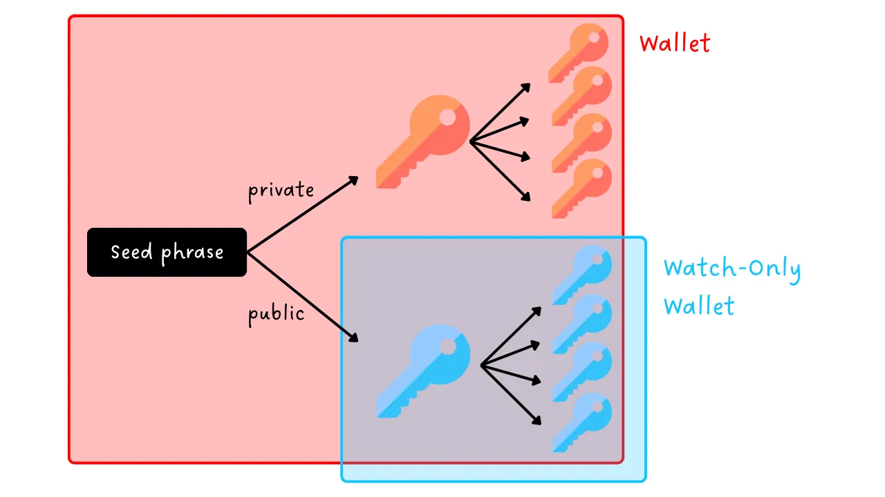
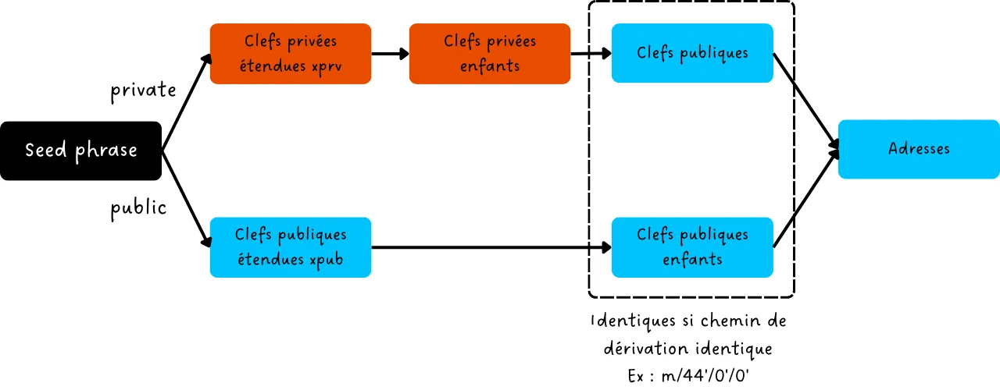
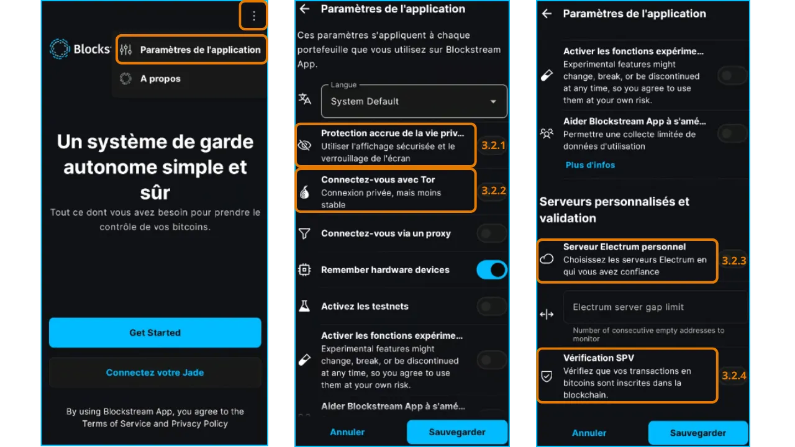
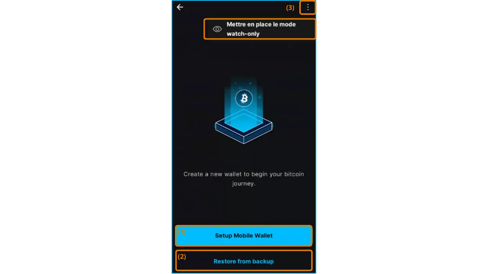
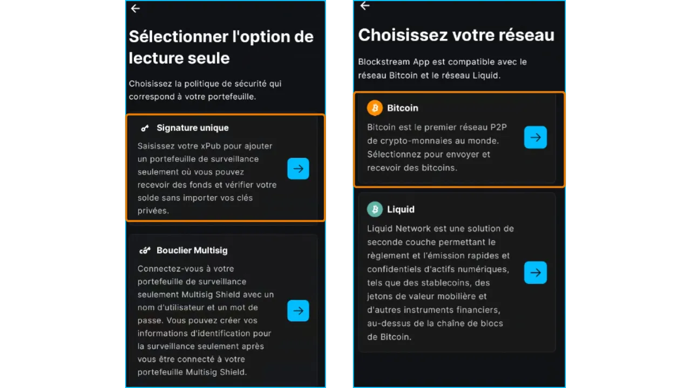
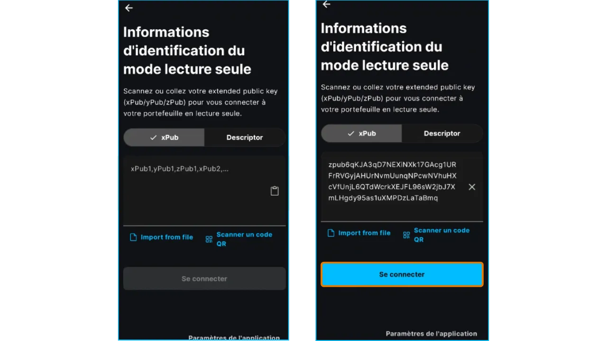
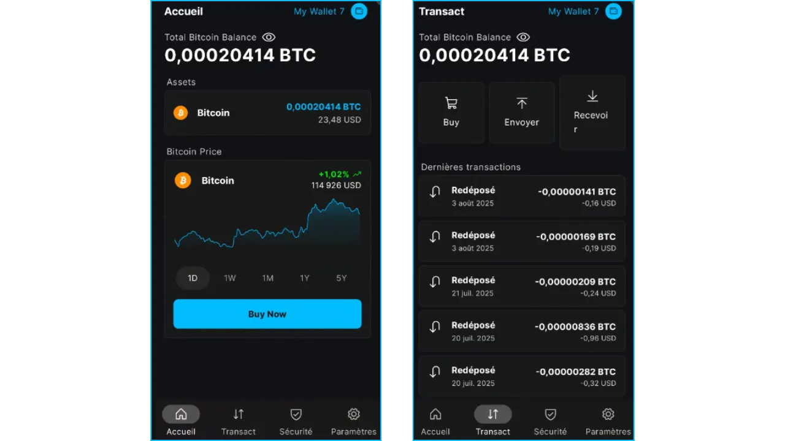
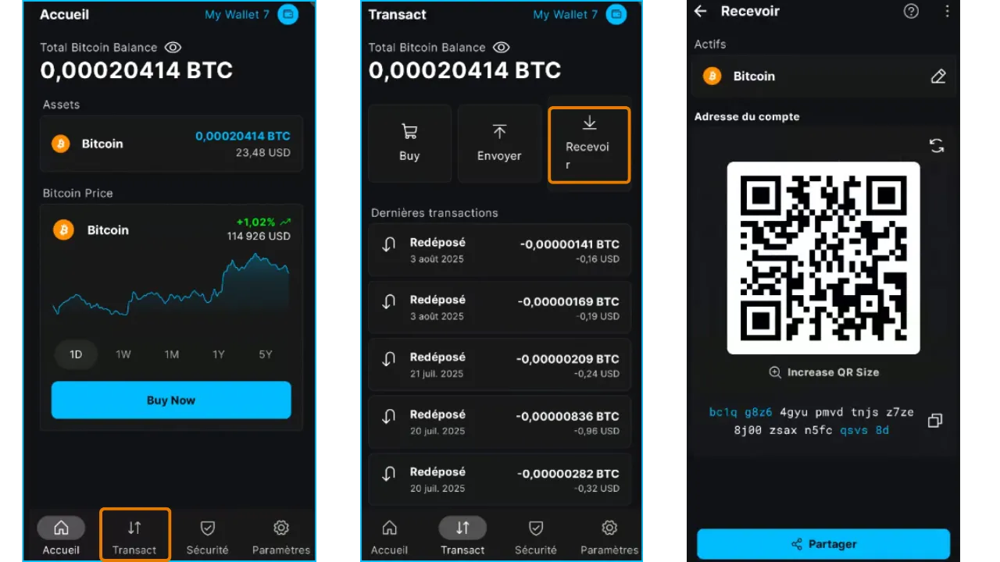
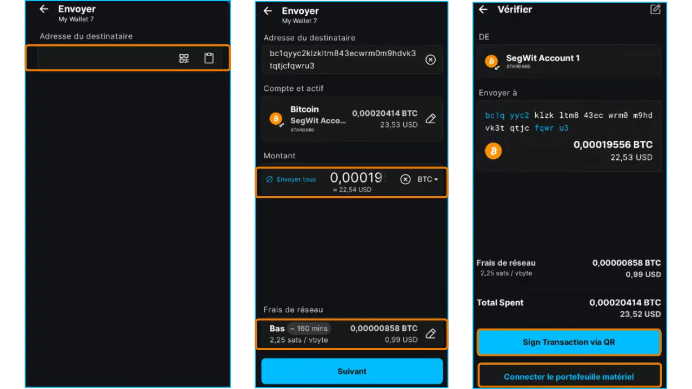

## 1.导言

### 1.1. 本教程的目的

- 本教程介绍如何设置和使用**Blockstream App** 移动应用程序的**仅观察（Watch-Only）** 功能，在不访问私钥的情况下监控比特币钱包。
- 内容包括安装、初始配置、导入扩展公钥，以及使用它跟踪余额和生成接收地址。
- 注：附录中提供的其他教程涵盖 Onchain、Liquid 和桌面版。

### 1.2. 目标受众

- **初学者**：希望通过直观的移动应用程序监控比特币钱包（通常与硬件钱包相关联）的用户。
- **中级用户**：希望使用 Tor 或 SPV 等隐私选项管理只读钱包的用户。
- **硬件钱包用户**：无需连接设备即可查看余额和生成地址。
- **企业和商店**：
 - 在不暴露私人密钥的情况下，为会计目的跟踪交易。
 - 验证在线支付系统中未输入私钥的交易。
 - 让员工无需获取私钥即可使用新接收地址。
- **管理和众筹**：向捐助者透明地显示余额，但不允许获取资金。

### 1.3. 介绍 "仅观察" 功能

仅观察钱包允许您监控比特币钱包的交易和余额，而无需访问私钥。与传统的钱包不同，它只存储公共数据，如**扩展公钥**（由此出现了 "xpub"、"zpub"、"ypub" 等），这使它能够获取接收地址并跟踪比特币区块链上的交易历史。没有私钥就无法从应用程序中支付资金，从而保证了更高的安全性。

**为什么要使用仅观察钱包？**

- **安全性**：是监控由**硬件钱包**保护的钱包的理想选择，同时不会暴露连接设备上的私钥。
- **方便**：无需连接硬件钱包，即可查看余额和生成新接收地址。
- **保密性**：与 **Tor** 或 **SPV** 等选项兼容，以限制对第三方服务器的依赖。
- **使用案例**：追踪移动中的资金、生成收款地址或验证交易，而无需冒私钥风险。

### 1.4. 扩展公钥（Extended Public Key）

**扩展公钥**（xpub、ypub、zpub 等）**是由比特币钱包生成的数据，可生成所有子公钥及其相关的接收地址，但不提供私钥。

- **工作原理**：扩展公开密钥通过确定性过程 (BIP-32) 从助记词生成。它创建了一个子公钥层次树，每个子公钥都可转换为接收地址。仅观察钱包使用与被观察钱包相同的派生路径（如 `m/44'/0'/0'`），生成相同的地址，从而可以跟踪资金并创建新的接收地址。

- 扩展公钥类型
- **xpub**：用于传统组合（地址以 "1" 为开头，BIP-44）和 Taproot 钱包（地址以 "bc1p" 为开头，BIP-86）。
- **ypub**：专为兼容的 SegWit 钱包（地址以 "3" 为开头，BIP-49）设计。
- **zpub**：与本地 SegWit 钱包相关（地址以 "bc1q" 开头，BIP-84）。
- 其他（tpub、upub、vpub 等）：用于替代网络（如 Testnet）或特定标准。例如，tpub 用于 Testnet 网络。

- **区别**：xpub、ypub 或 zpub 之间的选择取决于地址类型（传统、SegWit、Taproot或嵌套式 SegWit）和钱包使用的 BIP 标准。请检查您的源组合所需的格式，以确保与 Blockstream App 兼容。

- **安全性和保密性**：扩展公钥在安全性方面并不敏感，因为它不允许使用资金（无法访问私人密钥）。但是，它在保密性方面是敏感的，因为它会显示所有公共地址和相关的交易历史。

**建议**：将扩展公钥作为敏感信息加以保护。

https://planb.academy/courses/46b0ced2-9028-4a61-8fbc-3b005ee8d70f

### 1.5. 关于热钱包的提示

- **热钱包**、**软件钱包**、**移动钱包**：都是安装在智能手机、电脑或任何连接到互联网的设备上的应用程序名称，可管理和保护来自比特币钱包的私人密钥。
- 与**硬件钱包**（也称为**冷钱包**）不同，软件钱包在联网环境中运行，离线隔离密钥，因此更容易受到网络攻击。

- **建议用途**：
    - 非常适合管理中等数量的比特币，尤其是日常交易。
    - 适合初学者或资产有限的用户，对他们来说，硬件钱包可能显得多余。

- 限制：对于存储大额资金或长期储蓄而言，安全性较低。在这种情况下，请选择**硬件钱包**。

## 2.Blockstream 应用程序介绍

- **Blockstream App** 是一款移动（iOS、Android）和桌面应用程序，用于管理比特币钱包和 Liquid Network 上的资产。2016 年被 Blockstream 收购，原名为 *GreenAddress*，后更名为*Blockstream Green*（2019 年），现名为 *Blockstream app*（2025 年）。
- **主要特点**：
- 比特币区块链上的链上**交易**。
    - **Liquid**网络上的交易（用于快速、保密的交换的侧链）。
- 仅观察**的**钱包，用于在无法获得密钥的情况下监控基金。
    - 隐私选项：通过**Tor**连接，通过 Electrum 与**个人节点**连接，或通过**SPV**验证，以减少对第三方节点的依赖。
    - **Replace-by-fee (RBF，即手续费替换)**功能，可加快未确认交易的速度。
- **兼容性**：集成硬件钱包，如 **Blockstream Jade**。
- **界面**：为初学者提供直观操作，为专家提供高级选项。
- **注意**：本指南侧重于在桌面版硬件钱包上的链上方面。作为附录提供的其他教程涵盖了在移动应用程序上使用链上、Liquid 和仅观察功能。

### 3.1. 下载

- 安卓：
    - 从 Google Play 商店下载 [Blockstream App](https://play.google.com/store/apps/details?id=com.greenaddress.greenbits_android_wallet)。
    - 替代方案：通过 [Blockstream 官方 GitHub](https://github.com/Blockstream/green_android) 上提供的 APK 文件进行安装。
- **iOS**：
    - 从 App Store 下载 [Blockstream App](https://apps.apple.com/us/app/Green-Bitcoin-Wallet/id1402243590)。
- **注意**：请务必从官方渠道下载，以避免欺诈性应用。**

### 3.2. 初始配置

- **主屏幕**：首次打开时，应用程序会显示一个没有配置钱包的屏幕。创建或导入的钱包稍后将出现在这里。

- **自定义设置**：点击 "Application settings"，调整以下选项，点击 "Save"，重新启动应用程序并创建您的钱包。

#### 3.2.1.增强隐私保护（仅限安卓系统）

- **功能**：禁用屏幕截图，隐藏任务管理器中的应用程序预览，并在锁定手机时锁定访问权限。
- **为什么？** 为了保护您的数据，防止未经授权的物理访问或屏幕捕获恶意软件。

#### 3.2.2.通过 Tor 连接

- **功能**：通过**Tor**路由网络流量，这是一个对连接进行加密的匿名网络。
- **为什么？** 为了隐藏您的 IP 地址并保护您的隐私，如果您不信任您的网络（例如公共 Wi-Fi），它是您的理想选择。
- **缺点**：由于加密，可能会降低应用程序的运行速度。
- **建议**：如果保密性优先，请激活 Tor，但要测试连接速度。

#### 3.2.3.连接个人节点

- **功能**：通过 **Electrum 服务器**将应用程序连接到自己的**比特币全节点**。
- **为什么？** 为了提供对区块链数据的全面控制，消除对 Blockstream 服务器的依赖。
- **前提条件**：已配置 Bitcoin 节点。
- **建议**：希望获得最大主权的高级用户。

#### 3.2.4.SPV（简单支付验证）验证

- **功能**：使用**简单支付验证（SPV）**，下载区块头并通过包含证明（Merkle）验证您的交易，无需存储完整的区块链。
- **为什么？** 减少对 Blockstream 默认节点的依赖，同时使设备保持轻量。
- **缺点**：安全性低于全节点，因为它的某些信息依赖于第三方节点。
- **建议**：如果您无法使用个人节点，但又希望使用全节点以获得最佳安全性，请激活 SPV。

## 4.创建比特币仅观察钱包

### 4.1.恢复扩展公钥

为了设置仅观察钱包，必须首先获取要监控的钱包的扩展公钥（xpub、ypub、zpub 等）。该信息通常可在软件或硬件钱包的设置或 "Wallet Information "部分找到。

- 使用 Blockstream 应用程序的示例：从钱包主屏幕进入 "Settings"，然后进入 "Wallet Details"，复制 zpub ：

- 替代方案 1：生成包含扩展公钥的二维码，供下一步扫描。
- 替代方案 2：如果钱包提供，则使用输出描述符。

### 4.导入仅观察钱包

- **注意**：请在没有摄像头或旁观者的私密环境中设置您的钱包。
- 在主屏幕上点击 "Set up a new wallet"，然后点击 "Get Started"：

- 下一个屏幕如下：

- (1) **"Setup Mobile Wallet"** ：创建新的热钱包。
- (2) **"Restore from Backup"**：使用助记词（12 或 24 个单词）导入现有钱包。警告：请勿从冷钱包导入助记词，因为它会在连接的设备上暴露，从而使其安全性失效。
- (3) **"Watch-Only"**：导入现有的仅观察钱包，以查看余额（例如您的冷钱包的余额），而不暴露助记词。请参阅附录中的 "仅观察" 教程。

- 然后选择 "**Single signature**" 和 "**Bitcoin**" 网络：

- 粘贴扩展公钥（xpub、ypub、zpub 等）、扫描相应的二维码或输入输出描述符。即使应用程序指定的是 "xpub"，也可以授权使用 ypub、zpub 等密钥。然后点击 "连接"：

### 4.3.使用仅观察钱包

导入后，仅观察钱包会显示扩展公钥派生地址的总余额和交易历史。只有链上交易可见（Liquid 交易被忽略）。要监控 Liquid Wallet，请在上一步中选择 "Liquid"，重复导入。

- 查看余额和历史：从主屏幕查看总余额和链上交易历史：

- **生成一个接收地址**：点击 "Transact"，然后点击 "Receive"，以创建一个新的链上地址。通过二维码或复制分享，即可接收资金：

- **发送比特币**：点击 **"Transact"**，然后点击 **"Send"**。您可以输入：
 - 接收者的地址。
 - 交易金额。
 - 手续费。

但是，由于仅观察钱包不持有私钥，因此不能直接发送资金。为了签名交易，请通过扫描二维码连接硬件钱包或 PSBT（例如 Coldcard Q 上的一个选项）。

- **注意**：请务必检查接收地址和交易详情，以免出错。发送到错误的地址的资金无法收回。

## 附录

### A1. 其他 Blockstream App 教程

- 使用链上网络：

https://planb.academy/tutorials/wallet/mobile/blockstream-app-onchain-e84edaa9-fb65-48c1-a357-8a5f27996143

- 使用 Liquid Network：

https://planb.academy/tutorials/wallet/mobile/blockstream-app-liquid-b3e4fb82-902e-4782-ad2b-a61ab05a543a

- 桌面版 ：

https://planb.academy/tutorials/wallet/desktop/blockstream-app-desktop-c1503adf-1404-4328-b814-aa97fcf0d5da

### A2. 扩展公开密钥

- 术语表 ：
 - [扩展公钥](https://planb.academy/fr/resources/glossary/extended-key)
 - [xpub](https://planb.academy/fr/resources/glossary/xpub)
 - [ypub](https://planb.academy/fr/resources/glossary/ypub)
 - [zpub](https://planb.academy/fr/resources/glossary/zpub)
- 课程 ：
 - [扩展公钥](https://planb.academy/courses/46b0ced2-9028-4a61-8fbc-3b005ee8d70f)

### A3.最佳做法

为了安全高效地使用 **Blockstream App**，请遵循以下建议。它们将帮助您在**Bitcoin（链上）**、**Liquid** 和 **闪电网路**上保护您的资金、优化您的交易并维护您的机密性。

- 确保您的助记词**安全**：
 - 教程：保存您的助记词

https://planb.academy/tutorials/wallet/backup/backup-mnemonic-22c0ddfa-fb9f-4e3a-96f9-46e2a7954270

https://planb.academy/courses/46b0ced2-9028-4a61-8fbc-3b005ee8d70f

- 使用**安全验证**：
 - 激活**强密码**或**生物识别认证**（指纹或面部识别），以保护对应用程序的访问。
 - 切勿共享您的 PIN 码或生物识别数据。

- **保护您的隐私**：
 - 为每次链上 /Liquid 交易生成一个新的接收地址以限制区块链上的跟踪。
 - 开启 "Enhanced Privacy"、"Tor" 和 "SPV" 功能。
 - 为了最大限度地保密，请通过 Electrum 服务器将钱包连接到您自己的比特币节点，而不要使用公共节点

- 选择最适合您需求的**网络**：
- **链上**：长期托管或大额交易的首选（费用与金额相比可忽略不计）。
- **Liquid**：用于快速、低成本的传输，保密性更强。
- **闪电**：选择即时、低成本的小额转账。

- **请务必检查地址**：

 - 发送比特币前，请仔细检查地址。发送到错误的地址的资金将永远丢失。使用复制/粘贴或二维码扫描，切勿手工复制/修改地址。

- **优化成本**：
 - 对于链上交易，根据紧急程度和网络拥塞情况选择适当的收费（慢、中、快）。
 - 使用 Liquid 或 闪电网路进行小额支付

- 不断更新应用程序

### A4.额外资源

- 官方链接：
- [官方网站](https://blockstream.com/)
- [Blockstream 移动应用程序支持](https://help.blockstream.com/hc/en-us/categories/900000056183-Blockstream-Green/)：文档和聊天
- [GitHub](https://github.com/Blockstream/green_android)

- 区块浏览器：
 - **链上：**[Mempool.space](https://Mempool.space/)**
 - **Liquid：**[Blockstream Info](https://blockstream.info/Liquid)**
 - **闪电：**[1ML(Lightning Network)](https://1ml.com/)**

- **学习和教程：** [Plan ₿ Academy](https://planb.academy/)**：
 - 保护您的助记词

https://planb.academy/tutorials/wallet/backup/backup-mnemonic-22c0ddfa-fb9f-4e3a-96f9-46e2a7954270

https://planb.academy/courses/46b0ced2-9028-4a61-8fbc-3b005ee8d70f

- **Liquid Network**：
- [术语表](https://planb.academy/fr/resources/glossary/liquid-network)

https://planb.academy/courses/6d26bcff-51a3-405f-bcdd-9af8297ce727

- **闪电网络**：
- [术语表](https://planb.academy/fr/resources/glossary/lightning-network)

https://planb.academy/courses/34bd43ef-6683-4a5c-b239-7cb1e40a4aeb
