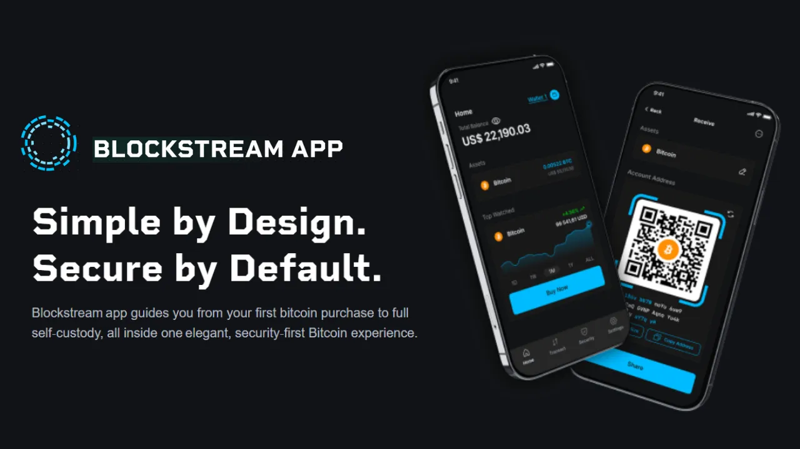
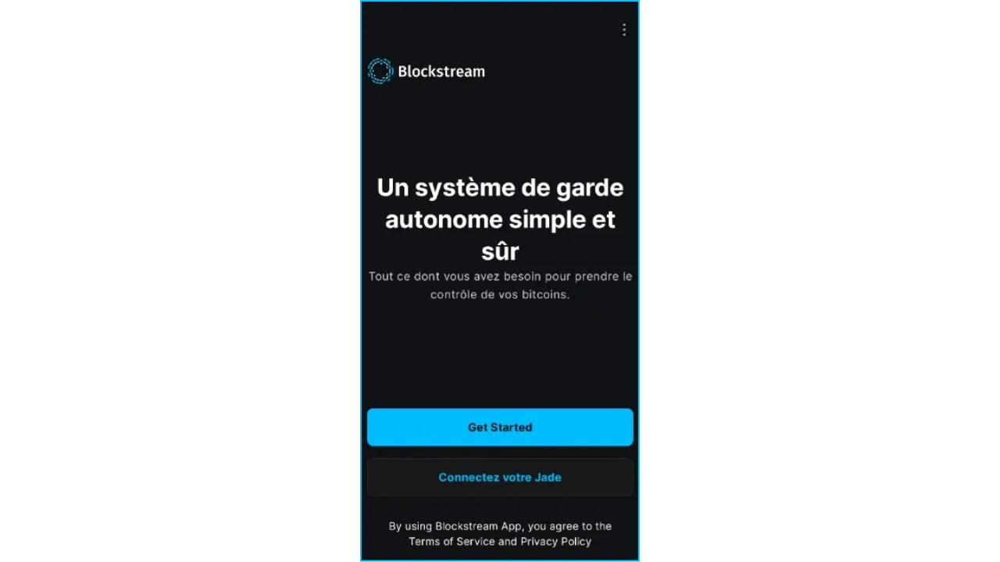
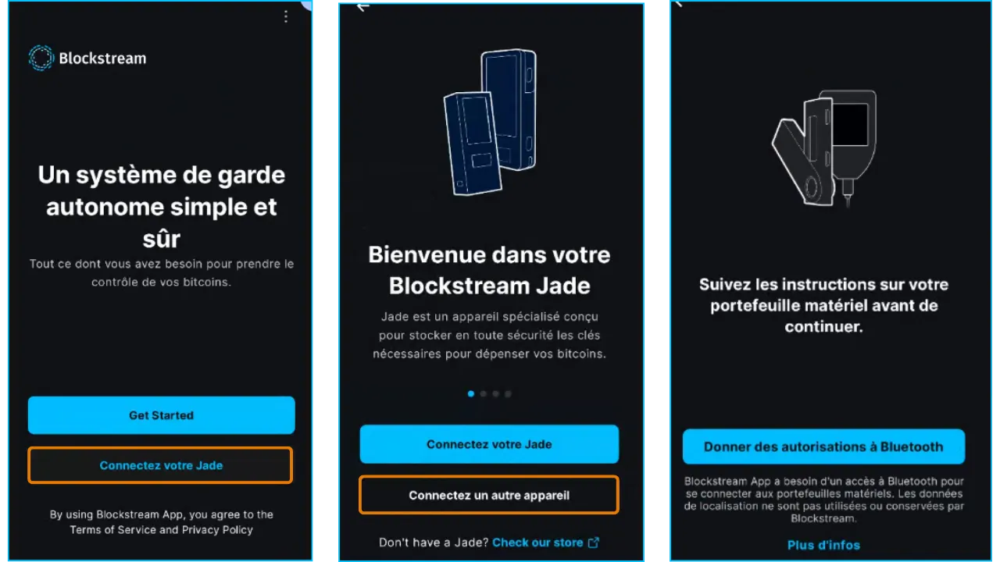
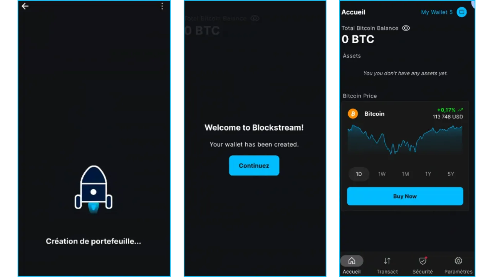
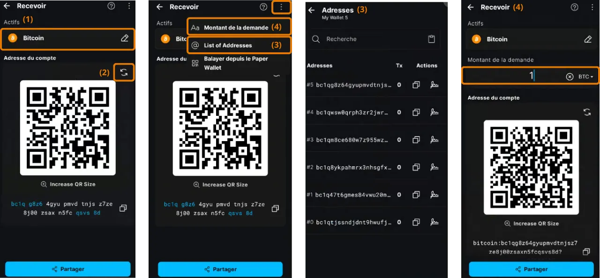

## 1. Introduction
### 1.1 Objectif du tutoriel

- Ce tutoriel explique comment utiliser l'application mobile **Blockstream App** pour gérer un portefeuille Bitcoin **onchain**, c'est-à-dire des transactions directement enregistrées sur la blockchain Bitcoin principale.
- Il couvre les étapes d'installation, de configuration initiale, de création d'un portefeuille logiciel, et les opérations de réception et d'envoi de bitcoins.
- Note : D'autres tutoriels fournis en Annexes couvrent les fonctionnalités Liquid, Watch-Only, XXXXXXXXXXX multisig, et la version desktop.

### 1.2 Public cible

- **Débutants** : Utilisateurs souhaitant gérer leurs bitcoins avec une application mobile intuitive.
- **Utilisateurs intermédiaires** : Personnes cherchant à comprendre les fonctionnalités onchain et les options de confidentialité comme Tor ou SPV.

### 1.3. Rappels sur les hot wallet

- **Hot wallet**, **software wallet**, **wallet mobile**, **portefeuille logiciel** : autant d'appellations pour une application installée sur un smartphone, un ordinateur ou tout appareil connecté à Internet, permettant de gérer et sécuriser les clés privées d’un portefeuille Bitcoin.
- Contrairement aux **hardware wallets** appelés aussi **cold wallets**, qui isolent les clés hors ligne, les portefeuilles logiciels opèrent dans un environnement connecté, ce qui les expose davantage aux cyberattaques.

- **Utilisation recommandée** :
    - Idéal pour gérer des montants modérés de bitcoins, notamment pour les transactions quotidiennes.
    - Convient aux débutants ou aux utilisateurs avec un patrimoine limité, pour qui un hardware wallet peut sembler superflu.

- **Limites** : Moins sécurisés pour stocker des fonds importants ou une épargne à long terme. Dans ce cas, privilégiez un hardware wallet.

## 2. Présentation de Blockstream App

- **Blockstream App** est une application mobile (iOS, Android) et desktop pour gérer des portefeuilles Bitcoin et des actifs sur le réseau Liquid. Acquise par [Blockstream](https://blockstream.com/) en 2016, elle s'est précédemment appelée Green Adress puis Blockstream Green.
- **Fonctionnalités principales** :
    - Transactions **onchain** sur la blockchain Bitcoin.
    - Transactions sur le réseau **Liquid** (sidechain pour des échanges rapides et confidentiels).
    - Portefeuilles **watch-only** pour surveiller des fonds sans accès aux clés.
    - **2FA multisig** : XXXXXXXXXXX Portefeuille sécurisé par deux signatures avec un timelock pour récupérer les fonds sans Blockstream si nécessaire.
    - Options de confidentialité : connexion via **Tor**, connexion à un **nœud personnel** via Electrum, ou vérification **SPV** pour réduire la dépendance aux nœuds tiers.
    - Fonctions avancées : **Replace-by-Fee (RBF)**, étiquetage des transactions, et contrôle des pièces (UTXO).
- **Compatibilité** : Intègre des hardware wallets comme **Blockstream Jade**, **Ledger Nano S/X**, et **Trezor**.
- **Interface** : Intuitive pour les débutants, avec des options avancées pour les experts.
- **Note** : Ce guide se concentre sur l'utilisation onchain. D'autres tutoriels fournis en Annexes couvrent les fonctionnalités Liquid, Watch-Only, XXXXXXXXXXX multisig, et la version desktop.

## 3. Installer et paramétrer l'application Blockstream App

### 3.1. Téléchargement

- **Pour Android** :
    - Téléchargez [Blockstream App](https://play.google.com/store/apps/details?id=com.greenaddress.greenbits_android_wallet) depuis le Google Play Store.
    - Alternative : Installez via le fichier APK disponible sur le [GitHub officiel de Blockstream](github.com/Blockstream/green_android).
- **Pour iOS** :
    - Téléchargez [Blockstream App](https://apps.apple.com/us/app/green-bitcoin-wallet/id1402243590) depuis l'App Store.
- **Note** : Assurez-vous de télécharger depuis des sources officielles pour éviter les applications frauduleuses.

### 3.2. Configuration initiale

- **Écran d'accueil** : À la première ouverture, l'application affiche un écran sans portefeuille configuré. Les portefeuilles créés ou importés apparaîtront ici par la suite.

- **Personnalisation des paramètres** : Cliquez sur "Paramètres de l'application", ajustez les options décrites ci-dessous selon vos besoins, cliquez sur "Sauvegarder", redémarrez l’application pour appliquer les changements, puis créez votre portefeuille.

#### 3.2.1. Confidentialité renforcée (Android uniquement)

- **Fonction** : Désactive les captures d'écran, masque les aperçus d'application dans le gestionnaire de tâches, et verrouille l’accès dès que le téléphone est verrouillé.
- **Pourquoi ?** : Protège vos données contre les accès physiques non autorisés ou les malwares capturant l’écran.
#### 3.2.2. Connexion via Tor

- **Fonction** : Route le trafic réseau via **Tor**, un réseau anonyme qui chiffre vos connexions.
- **Pourquoi ?** : Masque votre adresse IP et protège votre vie privée, idéal si vous ne faites pas confiance à votre réseau (Wi-Fi public, par exemple).
- **Inconvénient** : Peut ralentir l’application en raison du chiffrement.
- **Recommandation** : Activez Tor si la confidentialité est une priorité, mais testez la vitesse de connexion.
#### 3.2.3. Connexion à un nœud personnel

- **Fonction** : Connecte l’application à votre propre **nœud Bitcoin complet** via un serveur **Electrum**.
- **Pourquoi ?** : Offre un contrôle total sur les données blockchain, éliminant la dépendance aux serveurs de Blockstream.
- **Prérequis** : Un nœud Bitcoin configuré.
- **Recommandation** : Utilisateurs avancés souhaitant une souveraineté maximale.

#### 3.2.4. Vérification SPV

- **Fonction** : Utilise la **Simplified Payment Verification (SPV)** pour vérifier directement certaines données blockchain sans télécharger l’intégralité de la chaîne.
- **Pourquoi ?** : Réduit la dépendance au nœud par défaut de Blockstream, tout en restant léger pour les appareils mobiles.
- **Inconvénient** : Moins sécurisé qu’un nœud complet, car il repose sur des nœuds tiers pour certaines informations.
- **Recommandation** : Activez SPV si vous ne pouvez pas utiliser un nœud personnel, mais préférez un nœud complet pour une sécurité optimale.

## 4. Créer un portefeuille Bitcoin onchain

### 4.1. Lancer la création

- **Précaution** : Configurez votre portefeuille dans un environnement privé, sans caméras ni observateurs.
- Depuis l’écran d’accueil, cliquez sur "Get Started" :

- Si vous voulez gérer un **cold wallet** (portefeuille hors ligne) : cliquez sur **"Connect Jade"** pour utiliser le hardware wallet Blockstream Jade ou d’autres cold wallets compatibles Bluetooth (Ledger, Trezor, ...). 

- Vous arrivez à l'écran suivant : 

	- (1) **"Setup Mobile Wallet"** : Créer un nouveau portefeuille chaud (hot wallet).
	- (2) **"Restore from Backup"** : Importer un portefeuille existant via une phrase mnémonique (12 ou 24 mots).
	  Attention : N’importez pas la phrase d’un cold wallet, car elle serait exposée sur un appareil connecté, annulant sa sécurité.
	- (3) **"Watch-Only"** : Importer un portefeuille existant en lecture seule, afin de consulter le solde (par exemple de votre cold wallet) sans exposer la phrase mnémonique. Voir en annexe le tutoriel Watch Only.

**Dans ce tutoriel** : Cliquez sur **"Setup Mobile Wallet"** pour créer un hot wallet. 
Votre wallet est automatiquement créé et la page d'accueil du wallet, ici appelé "My Wallet 5", s'affiche : 

**Important** : Blockstream App a simplifié la création d'un wallet en n’affichant pas automatiquement la phrase mnémonique. Même si le porte-feuille est créé en un clic, vous devez faire l'effort de la sauvegarder manuellement avant d’envoyer des fonds, sinon vous risquez de perdre l’accès à vos bitcoins.

### 4.2. Sauvegarder la phrase mnémonique

- Sur l'écran d'accueil du wallet, cliquez sur l'onglet "Sécurité", puis sur l'invitation "Back Up" ou le menu "Phrase de récupération" : 

La seed phrase sera affichée pour que vous la sauvegardiez.

- Notez votre phrase de récupération avec le plus grand soin. Inscrivez-la sur du papier ou du métal et conservez-la dans un endroit sûr (coffre-fort, lieu hors ligne). Cette phrase est votre seul moyen pour accéder à vos bitcoins en cas de perte de votre appareil ou suppression de l'application.
- Il est important de noter également que toute personne possédant cette phrase peut voler tous vos bitcoins. Ne la stockez jamais numériquement :
	- Pas de capture d’écran
	- Pas de sauvegarde dans le cloud, email ou messagerie
	- Pas de copier/coller (risque d’enregistrement dans le presse-papiers)

**! Ce point est critique**. Pour plus d’informations sur la sauvegarde :

https://planb.network/tutorials/wallet/backup/backup-mnemonic-22c0ddfa-fb9f-4e3a-96f9-46e2a7954270

https://planb.network/courses/46b0ced2-9028-4a61-8fbc-3b005ee8d70f

### 4.4. Confirmer la phrase mnémonique

Avant d'envoyer des fonds sur une adresse associée à cette seed phrase, vous devez impérativement tester la sauvegarde de vos 12 mots. 
Pour cela nous allons noter une référence, supprimer le wallet, le restaurer avec la sauvegarde, et vérifier que la référence est inchangée.

- Sur l'écran d'accueil du wallet, cliquez sur l'onglet "Paramètres", puis sur "Wallet Details", et copiez la zPub (clé publique étendue) :

Nota : une adresse zpub peut être importée dans votre application Blockstream pour la fonction "Watch Only" (voir en Annexe).

- Supprimez l’application, puis restaurez le portefeuille via **"Restore from Backup"** en saisissant la phrase mnémonique, et vérifiez que la zpub est inchangée. Si oui, alors votre sauvegarde est correcte, et vous pouvez envoyer des fonds sur le wallet.

- Pour en savoir plus sur comment effectuer un test de récupération, voici un tutoriel dédié :

https://planb.network/tutorials/wallet/backup/recovery-test-5a75db51-a6a1-4338-a02a-164a8d91b895

### 4.5. Sécuriser l'accès à l'application

Il est fortement conseillé de verrouiller l'accès à l'application par un code PIN robuste
- Depuis l’écran d’accueil du wallet, allez dans **"Sécurité"** > **"PIN"**
- Saisissez et confirmez **un code PIN à 6 chiffres aléatoire**
   
**Option biométrique** : Disponible pour plus de commodité, mais moins sécurisée (risque d’accès non autorisé, ex. : empreinte ou visage scanné pendant le sommeil). Préférez un PIN robuste.
 
**Note** : Le PIN sécurise l’appareil, mais seule la phrase mnémonique permet de récupérer les fonds.

## 5. Utiliser le portefeuille onchain

### 5.1. Recevoir des bitcoins

- Depuis l’écran d’accueil du portefeuille, cliquez sur '"**Transact**" puis **"Recevoir"**.  

- L’application affiche une **adresse de réception vierge** (format SegWit v0, commençant par `bc1q...`). Recevoir des bitcoins systématiquement sur une nouvelle adresse améliore la confidentialité de votre vie privée.
- **Options** :
    - (1) "Bitcoin" : cliquez pour sélectionner un envoi via Liquid.
    - (2) Cliquez sur les flèches pour choisir une autre nouvelle adresse liée à cette seed phrase. 
    - (3) Vous pouvez aussi choisir une adresse parmi celles déjà utilisées / affichées, en cliquant sur les trois points en haut à droite puis sur "List of Adresses"
    - (4) Pour demander un montant spécifique, cliquez sur les trois points en haut à droite, sélectionnez "Montant de la demande", et saisissez le montant souhaité. Le QR sera mis à jour, et l'adresse sera remplacée par un URI de paiement Bitcoin. 
- Partagez l’adresse/l'URI en cliquant sur "Partager", en copiant le texte ou en scannant le QR code.

---
---
---

- **Vérification** : Vérifiez l’adresse sur l’écran de l’application avant de la partager pour éviter les erreurs ou attaques (ex. : malwares modifiant le presse-papiers).

- **Confirmation** :
    - Une fois la transaction diffusée sur le réseau Bitcoin, elle apparaît dans votre portefeuille comme "en attente".
    - Attendez **1 à 6 confirmations** (10 à 60 minutes environ) pour considérer la transaction comme définitive.  
        
