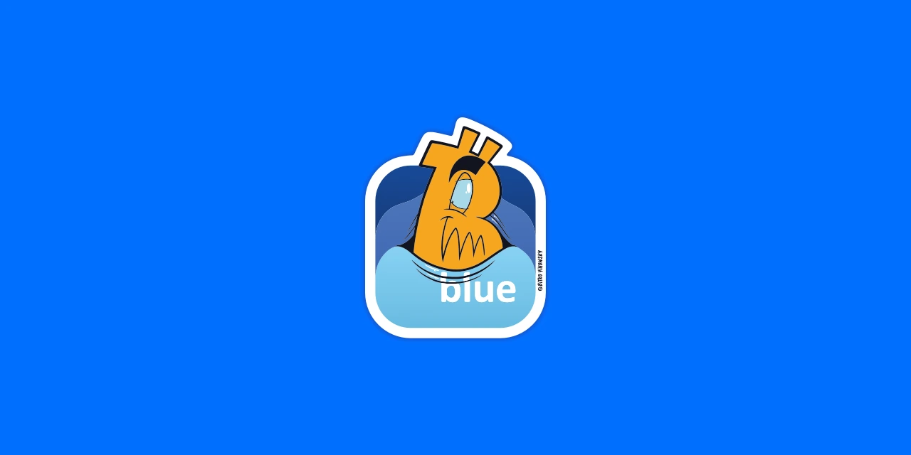

Memulai dengan Bitcoin bisa terasa menantang bagi orang-orang yang skeptis soal kemudahannya. Karena itu, menemukan alat yang tepat untuk memastikan pengalaman yang sederhana menjadi sangat penting agar Bitcoin bisa lebih mudah diadopsi sebagai media pertukaran, bukan hanya sebagai penyimpan nilai.

Dalam tutorial ini kita akan melihat Blue Wallet, Bitcoin Wallet yang sederhana namun sangat efektif yang memungkinkanmu untuk mengelola bitcoin kamu secara pribadi dan juga untuk membuat koperasi manajemen berdasarkan [Multisig](https://planb.academy/resources/glossary/multisig) (jangan khawatir, kita akan kembali ke sana).

## Memulai dengan Blue Wallet

Blue Wallet adalah wallet Bitcoin self-custody sumber terbuka yang memungkinkan kamu mengendalikan bitcoinmu sendiri. Aplikasi ini tersedia sebagai aplikasi seluler di platform Android dan iOS. Dalam tutorial ini kita akan menggunakan versi Android, tapi semua proses yang dibahas juga berlaku untuk iOS.

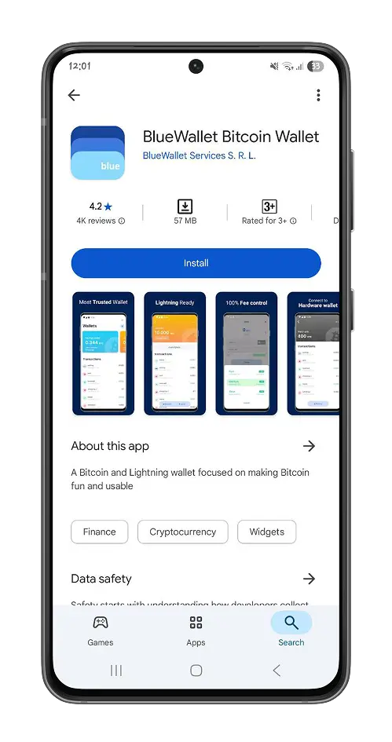

⚠️ Pastikan untuk mengunduh aplikasi Blue Wallet di platform resmi agar keasliannya terjamin dan bitcoinmu terlindungi dari potensi kebocoran atau peretasan.

Setelah terpasang, kamu bisa membuat wallet baru dan menyimpan 12 kata seedphrase, atau mengimpor wallet Bitcoin yang sudah ada. Pelajari cara membuat cadangan seedphrase dengan efektif supaya kamu tidak kehilangan akses ke bitcoinmu.

https://planb.academy/tutorials/wallet/backup/backup-mnemonic-22c0ddfa-fb9f-4e3a-96f9-46e2a7954270

Dengan Blue Wallet, kamu bisa membuat beberapa portofolio Bitcoin yang terpisah dan khusus. Misalnya, kamu bisa punya satu wallet untuk tabungan dan satu lagi untuk pengeluaran harian, semuanya dalam satu aplikasi yang sama.

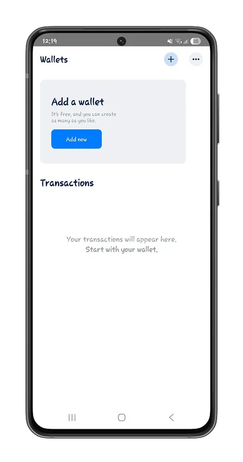

## Jenis portofolio

Dalam Blue Wallet, Anda akan menemukan dua tipe portofolio Bitcoin asli.

### Portofolio Bitcoin

Kalau kamu sudah terbiasa dengan portofolio Bitcoin lain seperti Phoenix atau Aqua, kamu tidak akan merasa asing dengan antarmuka portofolio Bitcoin di Blue Wallet.

https://planb.academy/tutorials/wallet/mobile/phoenix-0f681345-abff-4bdc-819c-4ae800129cdf

https://planb.academy/tutorials/wallet/mobile/aqua-8e6d7dd3-8c03-45cc-90dd-fe3899a7d125

Wallet Bitcoin berwarna biru mewakili wallet standar dalam ekosistem Bitcoin. Kamu bisa membelanjakan bitcoin selama kamu memiliki seedphrase yang bisa memberikan tanda tangan valid di jaringan untuk membuktikan kepemilikan bitcoinmu.

Untuk membuat portofolio Bitcoin, klik tombol **Tambah sekarang**, masukkan nama portofolio, dan pilih tipe Bitcoin.

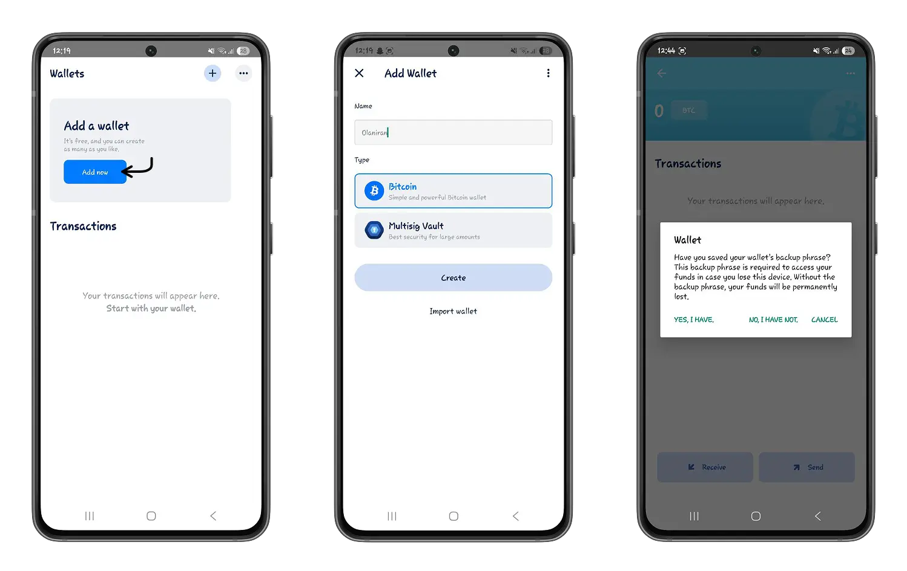

Ketika kamu mengklik pratinjau Bitcoin Wallet, kamu akan dapat melihat riwayat transaksi kamu dan mengirim dan menerima bitcoin.

⚠️ Semua transaksi di Bitcoin Wallet kamu berada di rantai utama protokol Bitcoin (Mainnet).

- Menerima bitcoin dengan Bitcoin Blue Wallet Wallet sangat intuitif. Di bagian bawah layar, klik tombol **Terima**. Bagikan kode QR atau Bitcoin Address kamu kepada pengirim agar mereka dapat mengirimkan bitcoin ke kamu.

Kamu juga dapat mengonfigurasi jumlah yang telah ditentukan untuk menentukan jumlah Bitcoin yang ingin kamu terima.

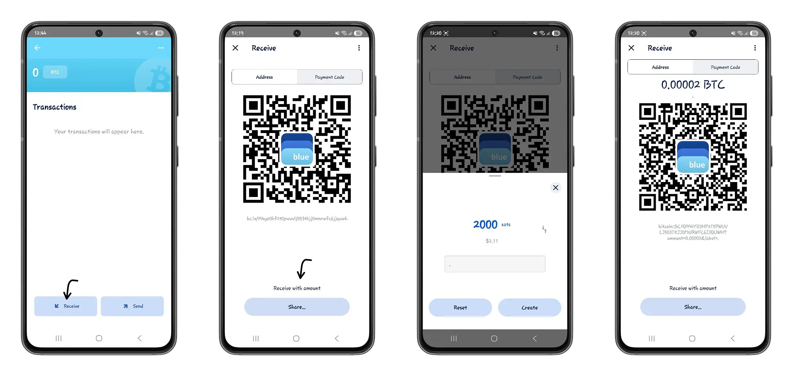

- Pada tombol **Kirim**, kirimkan bitcoin ke Bitcoin Address, atur jumlah yang diinginkan dan validasi transaksi.

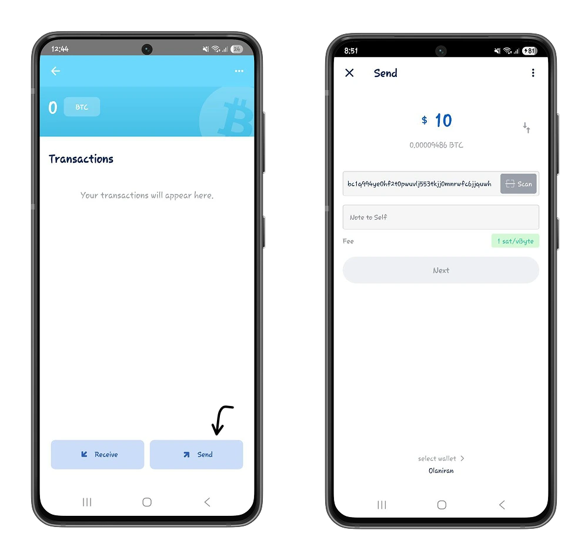

Blue Wallet memungkinkan Anda mengonfigurasi parameter pengiriman Bitcoin sesuai keinginan.

Dengan begitu, kamu bisa memilih rasio biaya transaksi yang sesuai jika ingin transaksi divalidasi cepat di Mempool dan dimasukkan ke dalam blok oleh penambang. Tergantung rasio yang dipilih, penambang akan memprioritaskan transaksi lebih tinggi atau lebih rendah. Pelajari lebih lanjut di tutorial Mempool Space.

https://planb.academy/tutorials/privacy/explorer/mempool-space-f3e468a1-92f1-43ce-b2e4-c3298fa0e02f

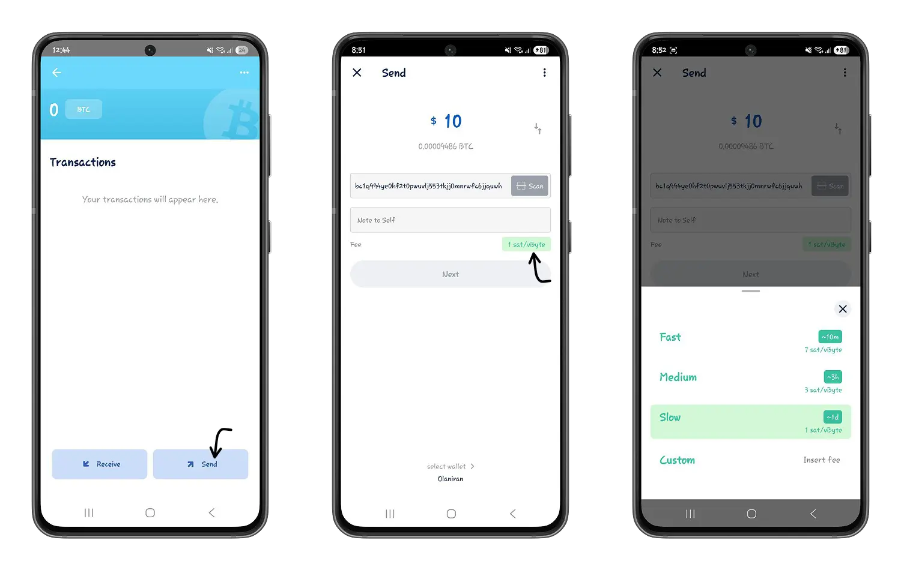

- Dengan Blue Wallet, kamu dapat menambahkan beberapa penerima ke satu pengiriman.

Saat menambahkan Bitcoin Address penerima pertama, klik **Tambahkan Penerima**, masukkan Bitcoin Address, lalu atur jumlah yang ingin dikirim ke penerima tersebut, dan seterusnya. Wallet biru akan mengirim bitcoin ke beberapa penerima hanya dengan satu tindakan dari kamu.

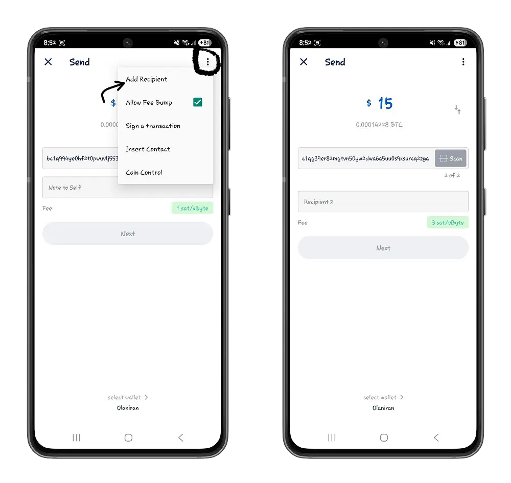

Kamu dapat menghapus satu atau semua penerima dengan mengeklik **Hapus Penerima** dan **Hapus Semua Penerima**.

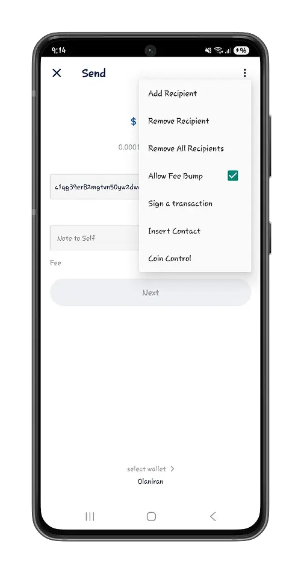

- **Biaya yang membengkak**: Pernahkah kamu melakukan transaksi yang butuh waktu lama untuk dikonfirmasi? Dengan mengaktifkan opsi *fee bump*, kamu bisa menambahkan biaya tambahan ke transaksi yang tertunda supaya konfirmasinya lebih cepat.

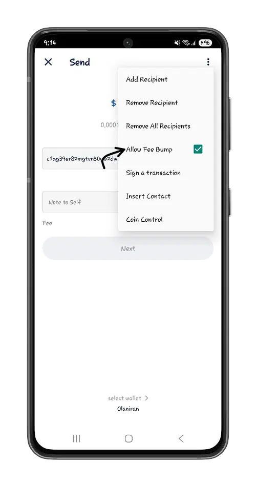

### Portofolio Multisig

Wallet Multisig (multi-tanda tangan) adalah wallet yang dibuat dari gabungan beberapa (minimal 2) wallet Bitcoin. Di jenis wallet ini, tergantung konfigurasi dan metode yang dipilih, membelanjakan bitcoin menjadi tindakan kolektif dan kooperatif.

Di Blue Wallet, kamu bisa membuat portofolio multi-tanda tangan untuk asosiasi, keluarga, atau perusahaanmu. Di bagian ini, kita akan membahas setiap aspek dari jenis portofolio khusus ini.

Tambahkan portofolio baru dan pilih tipe **Multisig Vault** untuk membuat portofolio multi-tanda tangan.

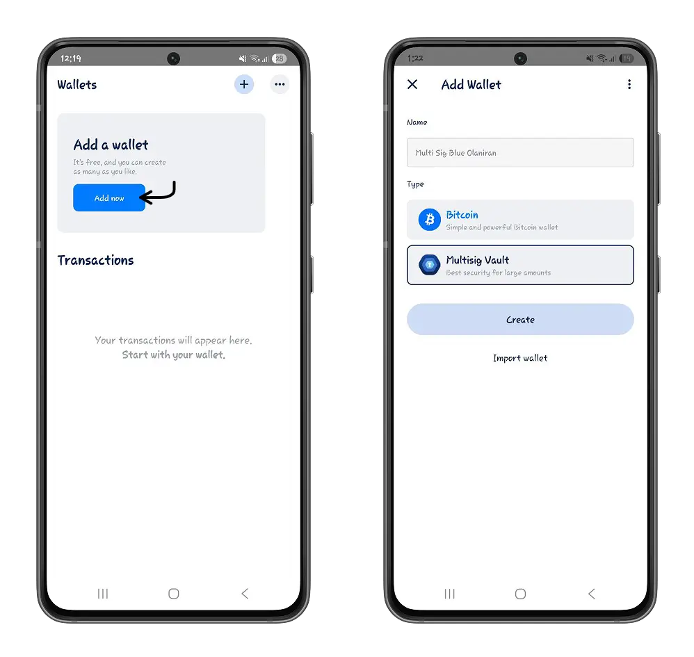

Tentukan konfigurasi m-de-n di organisasi multi-tanda tangan kamu dengan mengklik **Pengaturan Brankas**.

⚠️ Dalam konfigurasi m-of-n, **m** menunjukkan jumlah minimum tanda tangan yang diperlukan untuk menyetujui transaksi dan **n** jumlah portofolio dalam organisasi.

Pastikan untuk menentukan jumlah minimum tanda tangan (m) untuk sebagian besar organisasi kamu. Sebagai contoh, konfigurasi multi-tanda tangan 2-dari-3 membutuhkan dua dompet dalam organisasi kamu untuk menandatangani transaksi sebelum transaksi tersebut dapat dilakukan.

❗Mendefinisikan konfigurasi m-of-n di mana n sama dengan m adalah risiko besar. Ketika seorang anggota kehilangan akses ke Wallet, kamu kehilangan otorisasi untuk membelanjakan bitcoin di Wallet.

Berikut ini beberapa contoh konfigurasi optimal untuk memastikan keamanan dan aksesibilitas ke bitcoin:

- tanda tangan ganda 2-de-3.

- 5-de-7 tanda tangan multi.

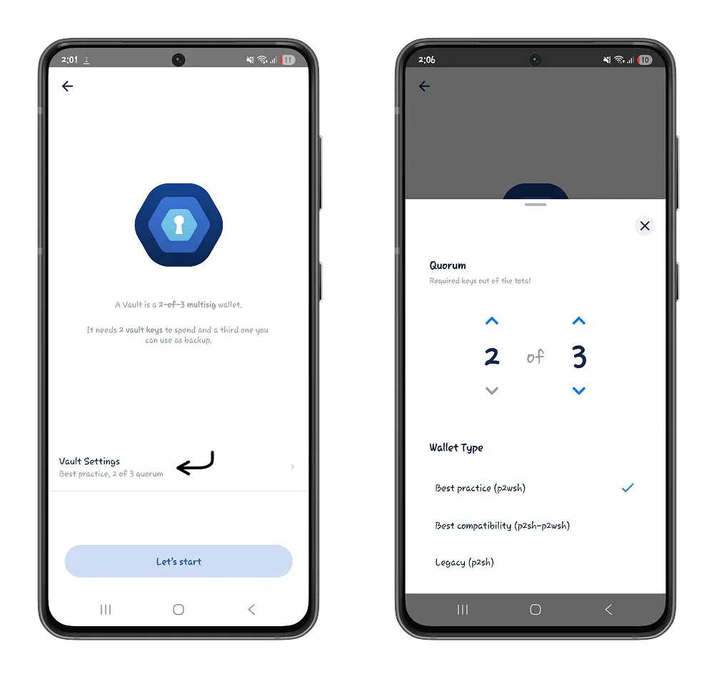

Ikuti praktik terbaik dengan memilih format P2WSH.

❗ **[P2WSH](https://planb.academy/resources/glossary/p2wsh) atau Pay to Witness Script Hash** adalah metode penguncian yang mengunci bitcoin keluar (Output) dari transaksi Anda ke Hash dari skrip khusus yang dibuat oleh Blue Wallet. Keuntungan utama dari jenis penguncian ini adalah mengurangi ukuran data transaksi dan secara implisit memungkinkan kamu untuk membayar biaya transaksi yang lebih rendah.

Buat atau impor setiap portofolio **n** dalam konfigurasi kamu. Dalam tutorial ini, kita akan menggunakan konfigurasi multi-tanda tangan 2 dari 3. Pastikan untuk menyimpan kata pemulihan untuk setiap portofolio satu per satu.

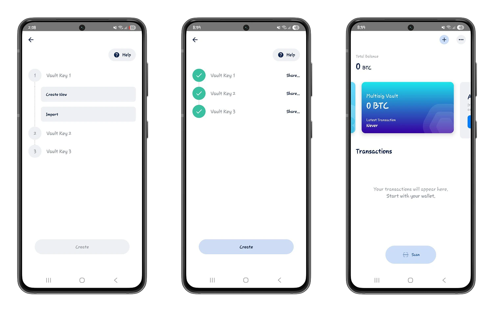

- Menerima bitcoin

Pada halaman Multisig Wallet, kamu akan menemukan riwayat transaksi dan tombol Terima dan Kirim.

Menerima bitcoin dalam Wallet multi-tanda tangan adalah proses yang sama seperti ketika kamu menggunakan Bitcoin Wallet standar.

- Kirim **bitcoin** :

Dengan mengelola wallet multi-tanda tangan, membelanjakan bitcoin menjadi tindakan gabungan, baik dengan orang lain maupun dengan wallet kedua milikmu sendiri. Tanda tangan tunggal dari walletmu tidak lagi cukup. Ini menambah lapisan keamanan pada bitcoinmu, karena orang jahat tidak akan bisa membelanjakannya hanya dengan memiliki salah satu private key-mu.

Seperti portofolio Bitcoin standar di Blue Wallet, kamu bisa menentukan beberapa penerima lewat opsi **Tambahkan penerima**.

Saat memvalidasi transaksi, kamu memerlukan tanda tangan kedua untuk menyetujui pengeluaran bitcoin. Ingat, kita menggunakan konfigurasi multi-tanda tangan 2-de-3.

Penandatangan Wallet kedua, jika dia juga seorang pengguna, dapat menandatangani transaksi meskipun dia tidak terhubung ke Internet (tidak ada Wi-Fi, tidak ada data seluler) dengan memindai kode QR dari [transaksi yang ditandatangani sebagian](https://planb.academy/resources/glossary/psbt) yang baru saja Anda buat.

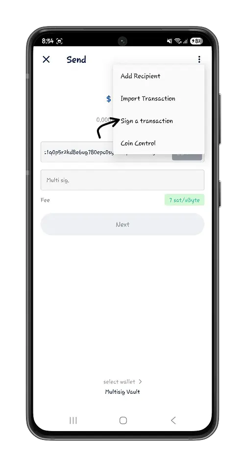

- Melangkah lebih jauh dengan portofolio **Multi signature**:

Pada Interface dari Wallet multi-tanda tangan kamu, klik tombol **Kelola tombol**.

Dengan melupakan salah satu kata pemulihan dari salah satu portofolio penandatangan (**Lupakan seed ini...**), kamu memberi tahu Blue Wallet untuk menghapus cadangan kata-kata ini dari memorinya. Oleh karena itu, kamu akan membuat cadangan eksternal.

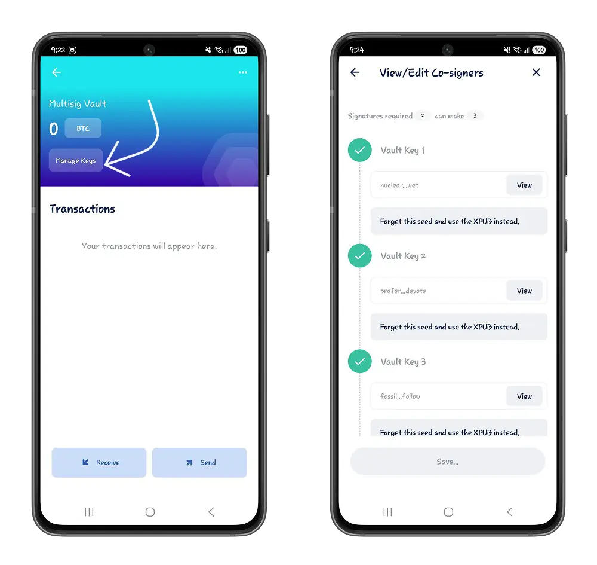

Dengan melakukan tindakan ini, kamu hanya menyimpan kunci publik yang terkait dengan kata pemulihan ini.

⚠️ Dengan hanya menyimpan kunci publik (XPUB), kamu bisa menambahkan lapisan keamanan ekstra pada konfigurasi 2-dari-3 multi-tanda tangan. Menyimpan semua seedphrase di satu tempat saat ponselmu diserang tentu berisiko. Penyerang yang hanya memiliki akses ke satu **VAULT** (seedphrase) yang kamu gunakan untuk menandatangani transaksi tidak akan bisa mencuri bitcoinmu, karena minimal 2 tanda tangan dibutuhkan dan kunci publik tidak bisa digunakan untuk menandatangani transaksi.

## Lebih banyak opsi dengan Blue Wallet

### Meningkatkan keamanan akses portofolio

Dalam Pengaturan, opsi **Keamanan** memungkinkan kamu menentukan penggunaan sidik jari untuk melakukan transaksi, mengekspor, atau menghapus Wallet kamu. Hal ini akan mengautentikasi orang yang menggunakan ponsel cerdas Anda.

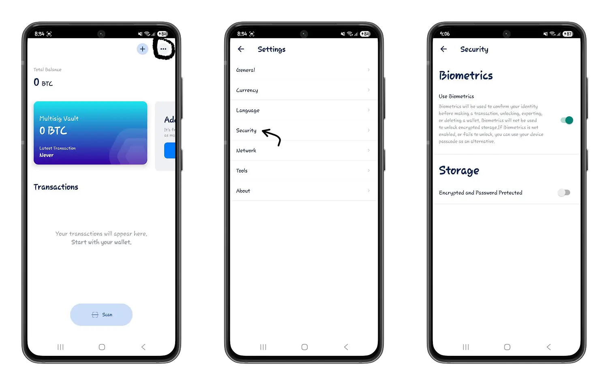

## Aktifkan Lightning Network

Lightning Network tidak lagi didukung secara asli dalam aplikasi Blue Wallet.

Dalam Pengaturan > **Pengaturan Lightning**, kamu dapat secara manual mengaitkan Lightning Wallet Anda ketika menjalankan node Lightning Network Daemon (LND). Instal Hub LND, lalu kaitkan Wallet kamu dengan memasukkan tautan yang dihasilkan oleh Hub.

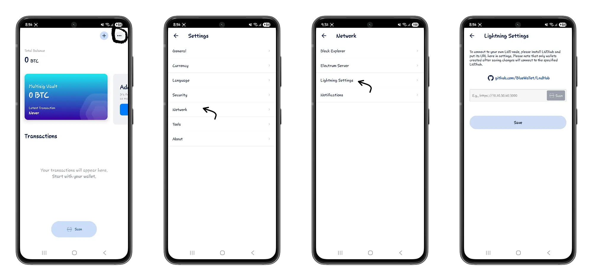

https://planb.academy/tutorials/node/lightning-network/umbrel-lnd-b12e0b5b-12ff-45f1-978e-62f4b4a8ba16

https://planb.academy/tutorials/node/lightning-network/lightning-network-daemon-linux-59d777e9-72c8-4b32-8c50-e86cdae8f2f9

Sekarang kamu telah menyelesaikan tur Blue Wallet dan siap menggunakan Bitcoin dengan semua kesederhanaan dan kekuatannya. Kami menyarankan kamu untuk melangkah lebih jauh dan mempelajari cara menerima pembayaran Bitcoin di tokomu, berkat kekuatan Lightning.

https://planb.academy/tutorials/wallet/mobile/breez-46a6867b-c74b-45e7-869c-10a4e0263c06
