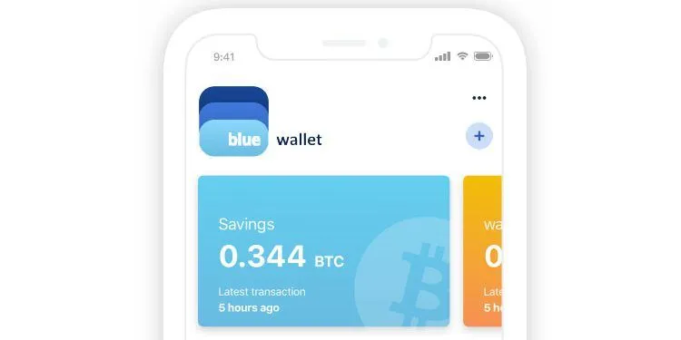
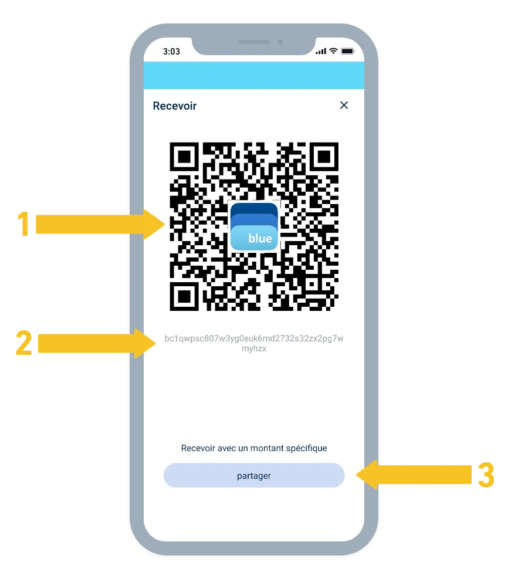
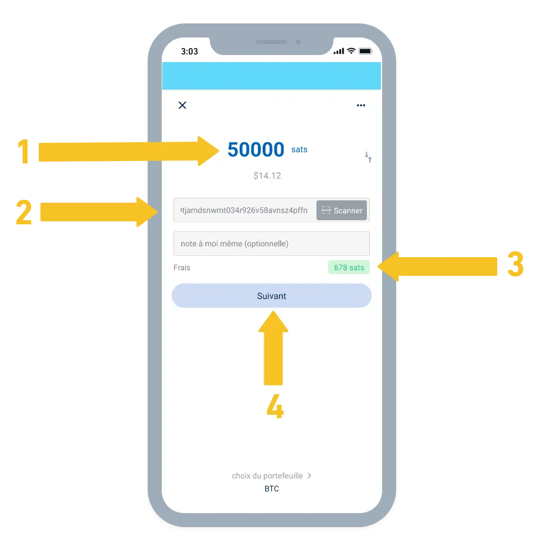

Blue Walletは、非常に使いやすく柔軟性のあるオープンソースのビットコインウォレットです。

- レイヤー1のビットコインウォレットは、非預託方式で無料で利用可能です。
- レイヤー2の使用のために、自分のライトニングノードに接続することが可能です。

## 動画で見る

## BlueWallet: はじめに

モバイル電話（またはタブレット）からビットコインを受け取ったり送ったりするには、お使いのモバイル電話またはタブレットの種類に対応するウェブサイトからBlueWalletをダウンロードしてください：

- iPhone: https://itunes.apple.com/app/bluewallet-bitcoin-wallet/id1376878040
- Android: https://play.google.com/store/apps/details?id=io.bluewallet.bluewallet

アプリケーションをインストールしたら、最初のウォレットを作成します：

1. ウォレット名：My Bitcoin（例）
2. タイプ：Bitcoin
3. 作成

_⚠️ バックアップフレーズ（12語）を紙にメモしてください。電話を紛失したり、BlueWalletアプリを削除したりした場合、これがビットコインを回復する唯一の方法になります！紙の写真を撮ったり、見せたり、誰かと共有したりしないでください！他人の目から遠ざけて安全な場所に保管してください。_

### 初めてのビットコインを受け取る

新しいBlueWalletウォレットから、「受け取る」オプションを使用し、ユニークな支払いアドレス（bc1...で始まる）を生成します。

1. QRコードを直接スキャンして受信アドレスを取得する；
2. または、ビットコインアドレスをコピー＆ペーストする；
3. または、お使いのデバイスで利用可能な他の方法を使用してこのアドレスを共有する。

### 初めてのビットコインを送る

新しいBlueWalletウォレットから、「送る」オプションを使用し、送信する金額を選択し、受信者のビットコインアドレス（通常はbc1...で始まる）をスキャンまたは貼り付けます。

1. 送信する金額を入力する；
2. 受信者のQRコードをスキャンするか、直接ビットコインアドレスを貼り付ける；
3. より速い確認のために、ネットワークトランザクション手数料を高額に設定して調整する；
4. 次のステップに進んで、トランザクションを確認して送信する！

🥇 この紹介は始まりに過ぎません！自分自身で試して、友達と一緒に... BlueWalletは、自分のペースで探索できるより強力な機能を提供しています。