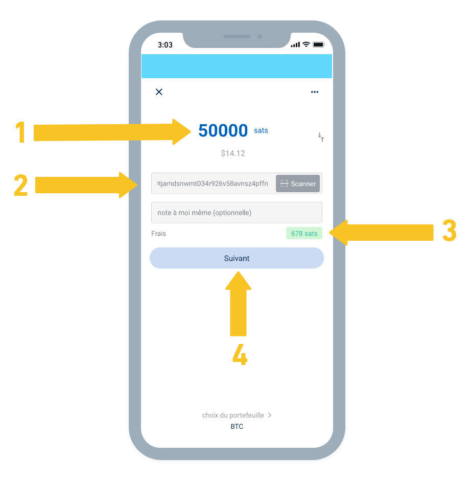

# Blue Wallet - Carteira Bitcoin Radicalmente Simples e Poderosa.

A Blue Wallet é uma carteira de código aberto para Bitcoin que é extremamente fácil de usar, mas ainda assim flexível.

- Uma carteira Bitcoin de camada 1 está disponível gratuitamente de forma não custodial.
- A possibilidade de se conectar à sua própria node lightning está disponível para uso na camada 2.

## Em vídeo

## BlueWallet: uma introdução

Para poder receber ou enviar Bitcoin do seu celular (ou tablet), baixe a BlueWallet do site correspondente ao seu tipo de celular ou tablet:

- iPhone: https://itunes.apple.com/app/bluewallet-bitcoin-wallet/id1376878040
- Android: https://play.google.com/store/apps/details?id=io.bluewallet.bluewallet

Depois de instalar o aplicativo, crie sua primeira carteira:

1. nome da carteira: meus Bitcoin (por exemplo)
2. tipo: Bitcoin
3. Criar

_⚠️ Anote em um papel a frase de backup (12 palavras). Se você perder seu telefone ou apagar o aplicativo BlueWallet, essa será a única maneira de recuperar seus Bitcoins! Verifique, verifique novamente e NUNCA tire fotos do papel, não o mostre ou compartilhe com ninguém! Guarde-o em um local seguro e longe de olhares indiscretos._

### Recebendo seus primeiros Bitcoins

A partir da sua nova carteira BlueWallet, use a opção "Receber", que irá gerar um endereço de pagamento único (começando com bc1...)

1. Escaneie diretamente o seu endereço de recebimento usando o código QR;
2. OU copie/cole o endereço Bitcoin;
3. OU ainda, compartilhe esse endereço usando outros métodos disponíveis no seu dispositivo.

### Enviando seus primeiros Bitcoins

A partir da sua nova carteira BlueWallet, use a opção "Enviar", que permitirá que você escolha o valor a ser enviado e escaneie ou cole o endereço Bitcoin do destinatário (normalmente começando com bc1...).

1. Insira o valor a ser enviado;
2. Escaneie o código QR do destinatário ou cole o endereço Bitcoin diretamente;
3. Altere as taxas de transação da rede, colocando um valor mais alto para uma confirmação mais rápida;
4. Prossiga para a próxima etapa para confirmar e enviar sua transação!

🥇 Esta introdução é apenas o começo! Experimente por si mesmo e com amigos... A BlueWallet oferece recursos mais poderosos que você pode descobrir no seu próprio ritmo.
