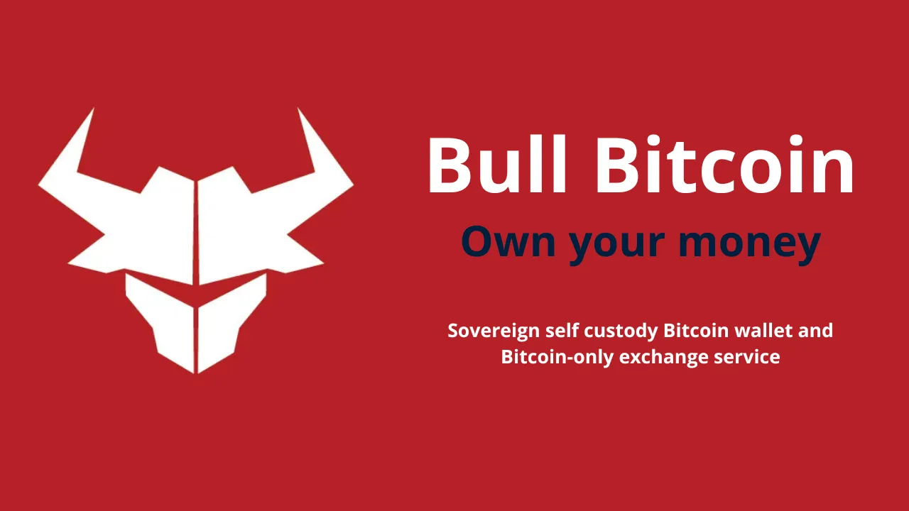


*Video tutorial dari BTC Sessions ini memandumu melalui proses pengaturan dan penggunaan Bull Bitcoin Wallet!


Panduan ini akan memandu kamu melalui instalasi, konfigurasi, dan penggunaan Bull Bitcoin Wallet. Kamu akan belajar cara mengirim dan menerima dana di jaringan Bitcoin On-Chain, Liquid, dan Lightning, serta cara memindahkan Bitcoin di antara jaringan-jaringan tersebut. Fitur wallet yang lengkap menjadikannya alat yang kuat dan menyeluruh untuk mengelola Bitcoin kamu. Mari kita mulai.


## Pendahuluan


Bull Bitcoin Wallet, yang dikembangkan oleh [Bull Bitcoin](https://www.bullbitcoin.com/), adalah sebuah **self-custodial** Bitcoin wallet, yang berarti kamu memiliki kontrol penuh atas private key kamu dan juga dana kamu, tanpa bergantung pada pihak ketiga. Wallet ini bersifat open-source dan berakar pada filosofi Cypherpunk, serta menggabungkan kesederhanaan, privasi, dan fitur-fitur canggih seperti pertukaran lintas jaringan dan dukungan PayJoin. Ini memungkinkan kamu mengelola bitcoin kamu di tiga jaringan: **Bitcoin onchain**, **Liquid**, dan **Lightning**, masing-masing disesuaikan untuk penggunaan tertentu. Di [BullBitcoin GitHub](https://github.com/orgs/SatoshiPortal/projects/49), Kamu dapat melihat topik terkini dan perkembangan yang akan datang. Karena proyek ini 100% open-source dan "dibangun untuk umum", kamu juga bisa mengirimkan saran serta bug yang kamu temui. Meskipun beberapa wallet saat ini sudah mendukung banyak jaringan, Bull Bitcoin Wallet menonjol dengan integrasi fitur privasi yang mendalam di semua jaringan, menjadikannya alat yang ampuh untuk mengelola bitcoin kamu di seluruh jaringan utama.


## 1️⃣ Prasyarat


Sebelum kamu mulai menggunakan **Bull Bitcoin Wallet**, pastikan kamu memiliki item berikut ini:


- **Smartphone yang kompatibel**: Perangkat **iOS** (iPhone atau iPad) atau **Android**
- Koneksi internet
- **Media cadangan yang aman**: Tuliskan **seedphrase** (12 kata) di atas kertas atau logam dan simpan di tempat yang aman.
- **Pengetahuan dasar**: Pemahaman minimum tentang konsep Bitcoin (alamat, transaksi, biaya) akan sangat membantu, meskipun tutorial ini menjelaskan setiap langkah untuk pemula.


## 2️⃣ Instalasi


Kamu dapat menginstal aplikasi melalui:


- [Apple App Store](https://apps.apple.com/app/bull-bitcoin/id6743380972)[ ](https://apps.apple.com/us/app/bitchat-mesh/id6748219622) (untuk perangkat iOS)
- [Google Play Store](https://play.google.com/store/apps/details?id=com.bullbitcoin.mobile&hl=en) (untuk perangkat Android)


Pengguna Android juga memiliki opsi alternatif:


- Unduh APK langsung dari halaman [Rilis GitHub](https://github.com/SatoshiPortal/bullbitcoin-mobile/releases) atau
- Instal melalui [Zapstore] yang kompatibel dengan Nostr (https://zapstore.dev/apps/naddr1qvzqqqr7pvpzq7xwd748yfjrsu5yuerm56fcn9tntmyv04w95etn0e23xrczvvraqqtxxmmd9e382mrvvf5hgcm0d9hzumt0vf5kcegnah0ap)


Setelah menginstal aplikasi, ikuti layar selamat datang untuk mengonfigurasi akun kamu.


## 3️⃣ Konfigurasi awal


Pada saat membuka, kamu akan diminta untuk memilih opsi berikut ini:


- `Create New Wallet`
- `Pulihkan Wallet` dan
- 'Opsi Lanjutan'


Mari kita mulai dengan mengetuk `Pilihan Lanjutan`.


Di sini, kita dapat mengonfigurasi pengaturan lanjutan sebelum membuat atau memulihkan wallet:


1. Aktifkan `Tor proxy` untuk merutekan lalu lintas melalui jaringan Tor.

1. [Aplikasi Orbot](https://orbot.app/en/) perlu diinstal dan dijalankan sebelum mengaktifkan

2. Tor Proxy hanya berlaku untuk Bitcoin (bukan Liquid) dan dapat mengakibatkan koneksi yang lebih lambat.

2. Menyiapkan `Custom Electrum Server`, atau

3. Sesuaikan pengaturan `Pulihkan Banteng`. Kita akan mempelajari lebih lanjut mengenai [Recover Bull](https://recoverbull.com/) nanti.


Setelah melakukan semua penyesuaian opsional, ketuk `Selesai`. Jika Anda ingin menggunakan kembali Wallet yang sudah ada, klik `Pulihkan Wallet` dan isi 12 kata frasa pemulihan kamu.


Jika tidak, klik `Buat Wallet Baru`.


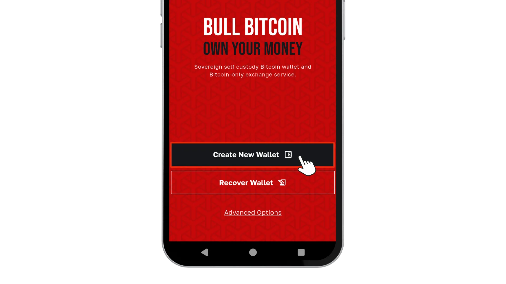


## 4️⃣ Layar Utama


Sebelum kita menyelam lebih dalam, mari kita lihat `Layar Utama` untuk mendapatkan orientasi:


- 'ikhtisar transaksi' dan 'menu pengaturan' terletak di bagian atas.
- `Saldo yang Tersedia` memiliki opsi privasi yang dapat `diaktifkan atau dinonaktifkan`.
- Akses `Bitcoin Bull Exchange` untuk `Beli, Jual, atau Bayar` (ini tergantung pada yurisdiksi dan mungkin memerlukan KYC).
- 'Transfer' dana antar dompet
- `Secure Bitcoin` sama dengan Onchain Bitcoin Wallet
- Pembayaran instan melalui Lightning- / Liquid Network *(Catatan: Bull Bitcoin Wallet memungkinkan pembayaran dilakukan dan diterima melalui Lightning. Dana yang diterima melalui Lightning disimpan di jaringan [*Liquid](https://liquid.net/) (dalam Pembayaran Instan Wallet) berkat pertukaran otomatis melalui [*pertukaran Boltz](https://boltz.exchange/). Hal ini memberikan kamu kemampuan untuk berinteraksi dengan Lightning tanpa harus mengelola saluran likuiditas, namun tetap berada dalam penyimpanan sendiri)
- `Kirim` dan `Terima` dana


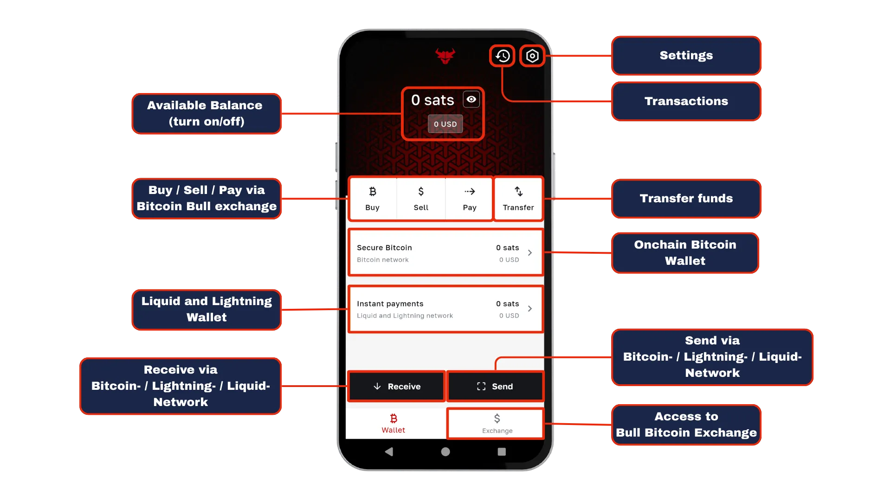


Pertama, mari kita buat beberapa konfigurasi penting dan mulai dengan `Backup`.


## 5️⃣ Cadangan


Untuk memulai proses pencadangan, ketuk `ikon roda gigi (⚙)` di sudut kanan atas aplikasi dan pilih `Cadangan Wallet`. kamu akan dihadapkan pada dua metode untuk mengamankan wallet: `Bankur Terenkripsi` dan `Cadangan Fisik`. Mari kita jelajahi masing-masing.


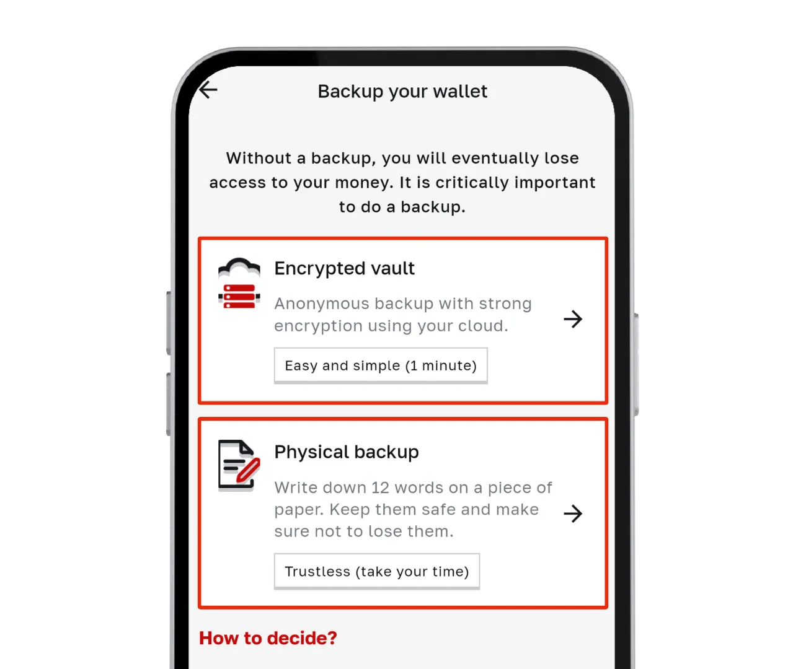


### Cadangan Fisik


Sentuh `Cadangan Fisik` untuk melihat daftar 12 kata yang mewakili pemulihan atau frasa seed Anda. Harap pertimbangkan yang berikut ini:


- Tuliskan **seedphrase** kamu dengan sangat hati-hati. Tulis di atas kertas atau logam dan simpan di tempat yang aman (brankas, lokasi offline). Seedphrase ini adalah satu-satunya cara untuk mengakses bitcoin kamu jika perangkat hilang atau aplikasi dihapus.
- Penting juga untuk dipahami bahwa siapa pun yang memiliki seedphrase ini dapat mencuri seluruh bitcoin kamu. Jangan pernah menyimpannya secara digital:
  - Tidak ada tangkapan layar
  - Tidak ada cadangan cloud, email, atau pesan
  - Tidak ada salin/tempel (berisiko tersimpan di clipboard)


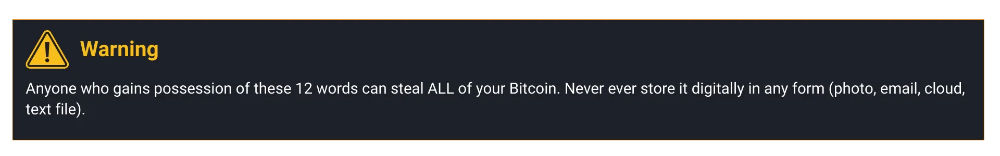


Layar berikutnya akan meminta kamu menyusun kata-kata dalam urutan yang benar untuk memastikan bahwa kamu mencatat seedphrase dengan tepat. Kamu akan mendapatkan konfirmasi setelah tes ini selesai dan berhasil.


! **Poin ini sangat penting**. Untuk bantuan lebih lanjut:


https://planb.academy/tutorials/wallet/backup/backup-mnemonic-22c0ddfa-fb9f-4e3a-96f9-46e2a7954270

https://planb.academy/courses/46b0ced2-9028-4a61-8fbc-3b005ee8d70f

### Brankas terenkripsi


Ada juga opsi pencadangan awan yang terenkripsi dan anonim. Tapi bukankah di paragraf sebelumnya sudah disebutkan bahwa cadangan awan berisiko dan sebaiknya dihindari? Tim Bull Bitcoin menyadari hal ini dan telah mengembangkan pendekatan yang cerdas untuk membuat proses tersebut tetap aman. Berikut cara kerjanya:

`Recoverbull` adalah protokol pencadangan yang menyederhanakan pengamanan Bitcoin wallet kamu dengan membagi cadangan menjadi dua bagian. Pertama, file cadangan wallet kamu dienkripsi langsung di perangkat menggunakan kunci enkripsi yang kuat. File terenkripsi ini bisa kamu simpan di mana saja, seperti Google Drive atau di perangkat kamu sendiri. Kedua, kunci enkripsi yang diperlukan untuk membuka file tersebut disimpan oleh Server Kunci Recoverbull. Untuk memulihkan wallet, kamu memerlukan file cadangan terenkripsi dan kunci, yang diakses menggunakan PIN atau kata sandi kamu. Desain ini memastikan bahwa cadangan awan saja tidak berguna, dan server kunci saja juga tidak berguna tanpa file cadangan khusus milik kamu. Dengan cara ini, dana kamu tetap aman meskipun salah satu bagiannya terganggu.

Anggap saja ini seperti brankas. File cadangan terenkripsi adalah *kotak*, yang bisa kamu simpan di mana saja (misalnya Google Drive). PIN Pemulihan kamu adalah *kunci*, yang disimpan secara terpisah oleh Server Kunci Recoverbull. Seorang pencuri harus mendapatkan kotak khusus kamu dan kunci khusus kamu untuk bisa membukanya. Desain ini memastikan bahwa meskipun seseorang mendapatkan file cadangan kamu, file tersebut tidak ada gunanya tanpa kunci dari server, dan kunci server juga tidak berguna tanpa file cadangan unik milik ka


Pelajari lebih lanjut tentang protokol cadangan `Recoverbull` wallet [di sini](https://recoverbull.com/).


Ketuk `Bank terenkripsi` lalu `Lanjutkan` untuk mengonfirmasi penggunaan Server Default. Sambungan akan dialihkan melalui Jaringan `Tor` untuk memastikan privasi dan anonimitas.


**Memahami PIN**


- pIN Buka Kunci Aplikasi`**:** PIN opsional yang ditetapkan di `Pengaturan > PIN Keamanan` untuk mengunci aplikasi pada ponsel kamu.
- pIN Pemulihan: ** PIN wajib yang dibuat selama proses pencadangan `Encrypted Vault`, yang digunakan untuk mendekripsi file cadangan selama pemulihan.


Ini adalah dua PIN yang terpisah. Jangan lupa PIN Pemulihan kamu, karena PIN ini sangat penting untuk memulihkan wallet."


**Pengaturan PIN Pemulihan:**


- Kamu harus membuat PIN atau Kata Sandi untuk memulihkan akses ke wallet.
- PIN / Kata Sandi harus terdiri dari minimal 6 digit (misalnya, hindari urutan sederhana seperti 123456, yang tidak diterima).
- Tanpa PIN ini, pemulihan wallet tidak mungkin dilakukan.


Selanjutnya, pilih penyedia brankas:


- `Google Drive` atau
- 'lokasi khusus' (misalnya perangkat Anda)


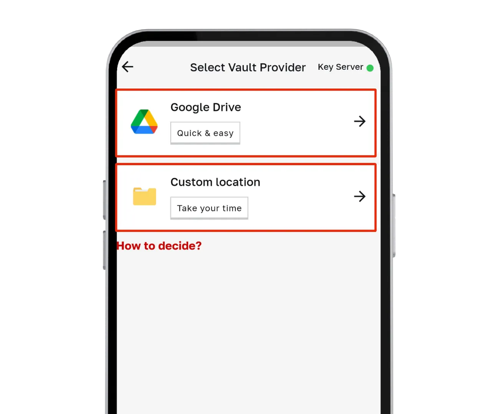


Sekarang, simpan `file cadangan`. Selanjutnya, ketuk `Test Recovery`, pilih file cadangan atau vault yang disimpan, lalu ketuk `Decrypt Vault`. Masukkan `PIN` atau `Kata Sandi` Anda. Jika semuanya berhasil, layar `Test selesai dengan sukses` akan muncul.


### Label Impor / Ekspor


Sekarang setelah kita membuat cadangan, mari kita lihat `Label`. Bull Bitcoin Wallet meningkatkan privasi dan pengaturan dengan memungkinkan kamu membuat label khusus untuk alamat penerima dan transaksi. Label-label ini membantu kamu mengkategorikan dana, karena transaksi yang dikirim ke alamat berlabel akan mewarisi label tersebut, dan kamu juga bisa memberi label pada transaksi keluar untuk melacak perubahannya. Wallet ini sepenuhnya mendukung standar [BIP-329](https://bip329.org/), yang berarti kamu dapat mengekspor semua label ke dalam sebuah file dan mengimpornya ke wallet lain. Fitur ini memastikan kamu dapat mencadangkan riwayat transaksi dan kategorisasi dengan lancar, atau memigrasikannya di antara berbagai instance wallet, tanpa kehilangan struktur organisasi yang sudah kamu sesuaikan.


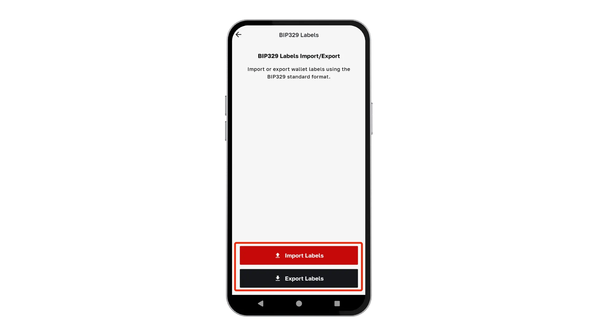


## 6️⃣ Pengaturan


Setelah cadangan utama aman, mari jelajahi fitur-fitur lain yang tersedia dalam pengaturan.


### A - Mengamankan akses


Untuk mengamankan aplikasi, buka `Pengaturan` dan pilih `Kode PIN Keamanan` untuk memilih Kode PIN. Buat PIN yang kuat untuk mengunci akses ke wallet kamu. Meskipun langkah ini bersifat opsional, namun sangat disarankan untuk mencegah akses yang tidak sah jika ada orang lain yang menggunakan telepon kamu.


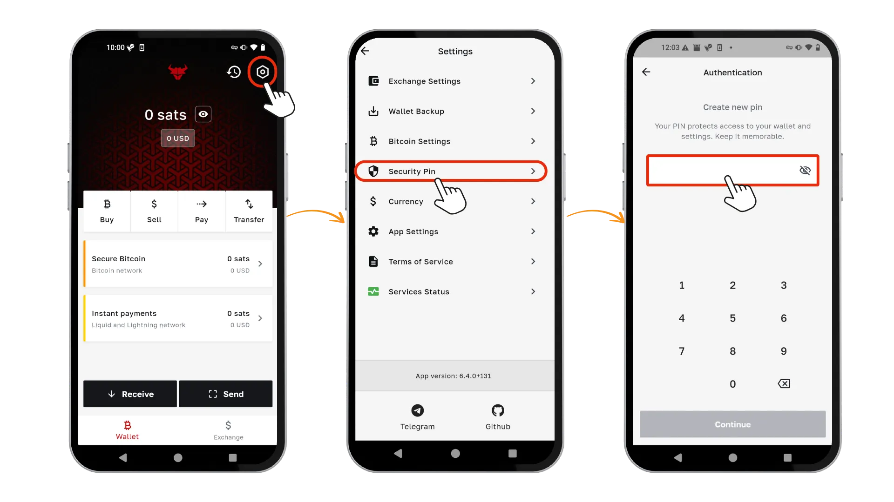


### B - Koneksi ke node pribadi (opsional)


Bull Bitcoin Wallet terhubung ke server Electrum secara default: server utama dikelola oleh Bull Bitcoin dan server sekunder oleh Blockstream, yang keduanya dianggap tidak menyimpan log, sehingga mengurangi risiko pelacakan.

Untuk privasi yang lebih baik, kamu bisa menyambungkan aplikasi ke node Bitcoin milik kamu sendiri melalui server Electrum. Untuk melakukannya, ketuk `Pengaturan` > `Pengaturan Bitcoin` > `Pengaturan Electrum Server`, lalu ketuk `+ Tambah Server Khusus` untuk memasukkan alamat dan kredensial server kamu.


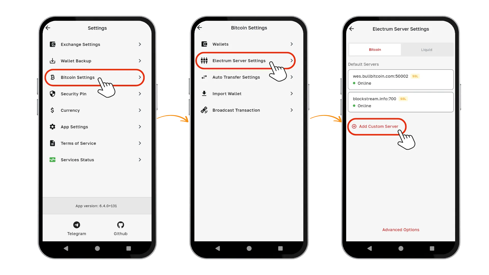


### C - Mata Uang


Saldo yang tersedia ditampilkan di layar utama dalam `sats` dan `USD`. Untuk mengubahnya, buka `Pengaturan` > `Mata Uang`. Di sana, kamu dapat beralih antara `sats/BTC` dan memilih `mata uang fiat default`.


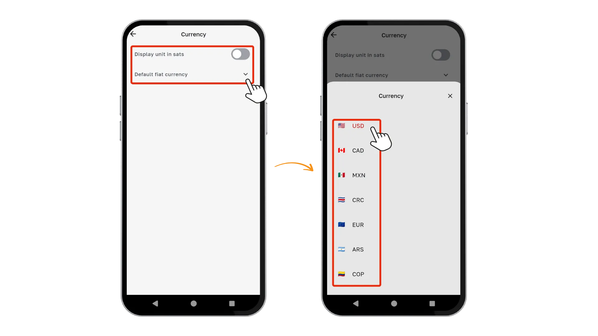


### D - Pengaturan Bitcoin


Menu `Pengaturan Bitcoin` menawarkan akses mendalam ke pengaturan dan data inti wallet. Di sini, kamu dapat memeriksa detail mendasar dari `Secure Bitcoin` dan `Dompet pembayaran instan`, memberikanmu transparansi dan kontrol penuh. Fitur-fitur utama dalam menu ini meliputi:


- **Detail Wallet:** Buka wallet Secure Bitcoin atau Pembayaran Instan kamu untuk melihat informasi spesifik.
- **Sidik Jari Wallet:** Pengenal unik untuk wallet kamu.
- **Kunci Publik (Pubkey):** Kunci yang digunakan untuk menghasilkan alamat penerima Bitcoin kamu.
- **Descriptor:** Ringkasan teknis dari struktur wallet kamu.
- **Jalur Turunan:** Jalur khusus yang digunakan untuk menghasilkan semua alamat dari private key utama kamu.
- **Lihat Alamat:** Mengakses daftar alamat penerima yang belum terpakai dan alamat kembalian (segera hadir)

Selain itu, kamu juga memiliki opsi untuk:


- pengaturan `Aktifkan Transfer Otomatis` untuk mengatur saldo wallet instan maksimum, yang kemudian akan ditransfer secara otomatis ke bitcoin wallet yang aman.
- Impor dompet Generik melalui Frasa `Mnemonic` atau impor `hanya untuk jam tangan`
- Hubungkan `Dompet perangkat keras`: perangkat yang didukung saat ini adalah ColdcardQ, SeedSigner, Spectre, Krux, Blockstream Jade, dan Foundation Passport


## 7️⃣ Bull Bitcoin Exchange


Langsung dari wallet, kamu memiliki akses ke [Bull Bitcoin exchange](https://www.bullbitcoin.com/), sehingga kamu dapat membeli, menjual, dan membayar Bitcoin tanpa harus meninggalkan aplikasi. Integrasi ini memberikan solusi yang nyaman untuk mengelola kebutuhan Bitcoin Akamu. Perlu diketahui bahwa akses ke bursa dan layanannya mungkin dibatasi berdasarkan yurisdiksi kamu, dan menyelesaikan verifikasi Kenali Pelanggan kamu (KYC) mungkin diperlukan untuk mematuhi standar peraturan dan menggunakan fitur lengkap platform.


Untuk memulai, ketuk `Exchange` di sudut kanan bawah, lalu `Daftar` atau `Masuk` ke akun Anda.


Pertukaran ini menawarkan [fitur] berikut ini (https://www.bullbitcoin.com/):


- Beli Bitcoin dengan penitipan mandiri dari rekening bank
- Non-kustodian
- Individu atau perusahaan
- Penarikan instan
- Tidak ada biaya tersembunyi
- Lightning Network tersedia
- Tidak ada batasan transaksi
- Opsi beli berulang


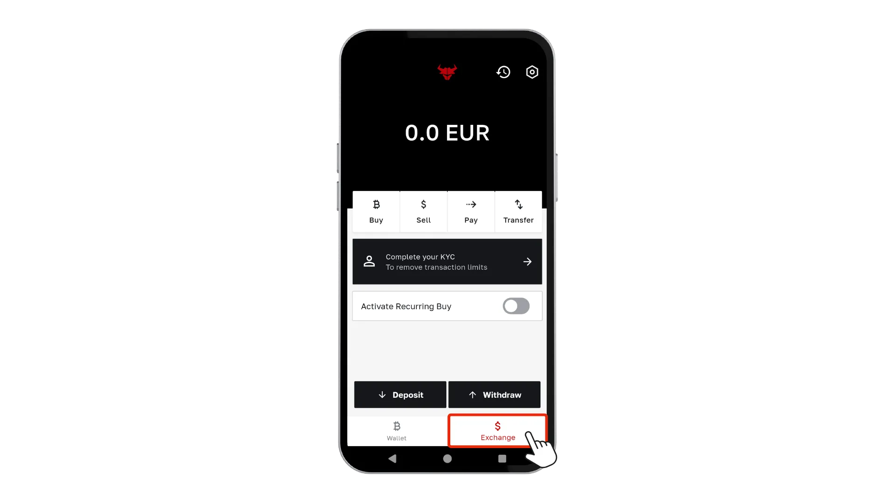


Untuk mempelajari lebih lanjut, silakan kunjungi tutorial ini:


https://planb.academy/en/tutorials/exchange/centralized/bull-bitcoin-europe-0ccf713e-efcd-44ec-8205-211f49ac7d53

## 8️⃣ Menerima dana


Menerima dana dengan **Bull Bitcoin Wallet** sangat mudah dan fleksibel, mendukung tiga jaringan berbeda yang disesuaikan untuk berbagai kasus penggunaan:


- Jaringan `Bitcoin (onchain)` untuk penyimpanan jangka panjang yang aman.
- Jaringan `Liquid` untuk transaksi yang cepat dan lebih rahasia.
- Jaringan `Lightning` untuk pembayaran instan dan berbiaya rendah.


Aplikasi ini secara otomatis membuat alamat atau invoice yang sesuai berdasarkan jaringan yang kamu pilih. Berikut ini adalah cara melanjutkan untuk setiap jaringan.


### Menerima melalui Onchain (jaringan Bitcoin)


Untuk menerima dana on-chain, kamu dapat memilih `Secure Bitcoin Wallet` dari layar Utama dan ketuk `Terima`, atau ketuk tombol `Terima` utama lalu pilih `Jaringan Bitcoin`.


Anda memiliki dua mode utama untuk menghasilkan alamat penerimaan:


**Mode Default (URI dengan parameter masukan tambahan)


Secara default, wallet menghasilkan [BIP21 URI](https://bips.dev/21/). Ini adalah format standar yang mengemas lebih banyak informasi daripada alamat sederhana, termasuk jumlah, catatan pribadi, dan parameter PayJoin untuk meningkatkan privasi. URI komprehensif ini dikodekan ke dalam kode QR dan tersedia untuk disalin. Formatnya terlihat seperti ini: `bitcoin:<alamat>?<parameter1>=<nilai1>&<parameter2>=<nilai2>`.


- Parameter Masukan Tambahan:**
    - Jumlah:** Tentukan jumlah yang diminta dalam BTC, sats, atau mata uang fiat.
    - Pesan:** Tambahkan catatan pribadi yang akan terlihat oleh pengirim.
    - PayJoin:** Aktifkan opsi ini untuk meningkatkan privasi dengan menggabungkan input dari pengirim dan penerima dalam transaksi.


Contoh URI:


```
bitcoin:bc1q0vv86t2sj7daduvdc50njms6u6jzh2y54xxxxx?amount=0.0005&message=Tip+for+tutorial&pj=HTTPS%3A%2F%2FPAYJO.IN%2F78UH9WZUP8KKJ%23RK1Q2H30FASCU9WW09DQY2LK0K8P2DPRJ99V72CA78ACQAEL675QYTMQ+OH1QYP87E2AVMDKXDTU6R25WCPQ5ZUF02XHNPA65JMD8ZA2W4YRQN6UUWG+EX1L0LYV6G
```


*Catatan Penting: Harap jangan mengirimkan dana ke alamat yang tertera dalam tutorial ini, karena wallet akan dihapus*


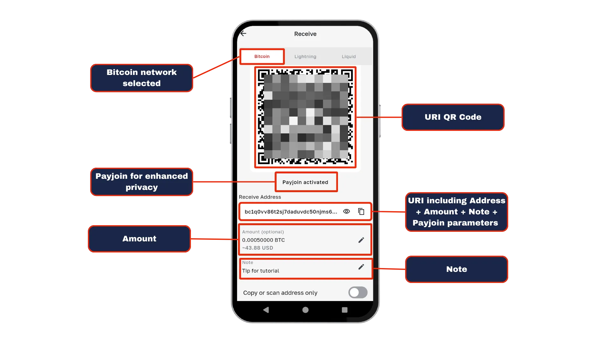


** Opsi Salin atau pindai Address saja yang diaktifkan


Dengan opsi `Salin atau pindai Address saja` yang diaktifkan, aplikasi ini menghasilkan alamat Bitcoin sederhana dalam format SegWit (bech32).


Contoh:


```javascript
bc1q0vv86t2sj7daduvdc50njms6u6jzh2y54x3g56
```


Meskipun kamu memasukkan jumlah atau catatan, keduanya tidak akan disertakan dalam kode QR atau alamat yang disalin.


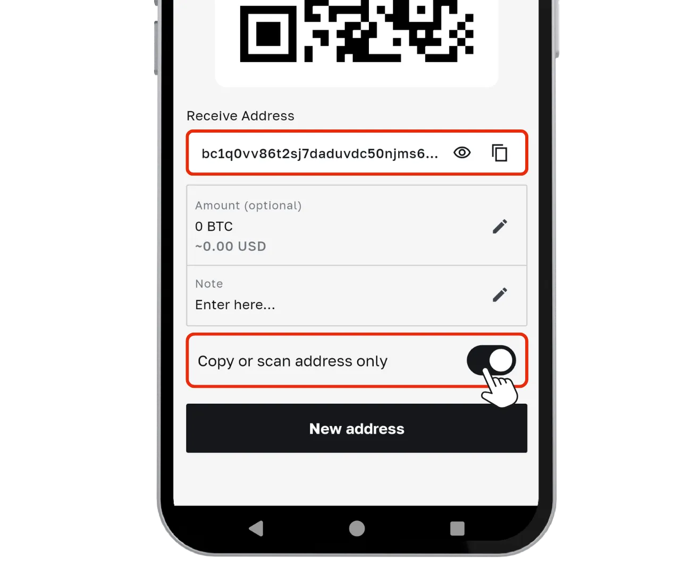


### Menerima melalui Liquid Network


Kamu dapat menerima pembayaran di Liquid Network. Setelah berada di layar `Terima`, kamu memiliki dua opsi yang sama untuk membuat permintaan pembayaran:

**1. Address sederhana:** Salin `alamat Liquid` standar. Ini adalah pengenal unik untuk wallet kamu di jaringan Liquid dan tidak menyertakan jumlah atau pesan tertentu.


Contoh Address:


```javascript
lq1qq05k3vmnvbullbitcoinjujn6h04z9jtw53xuyktqf9mam2zpfz05j2fe2x8xhejgkga3nvmp4yyp35qynkcw2xqmy7xxxxxxx
```


**2. Permintaan Pembayaran Terperinci (URI):** Untuk permintaan yang lebih terstruktur, kamu bisa menentukan jumlah dan catatan pribadi. Informasi ini akan otomatis dikodekan ke dalam URI yang dapat dibagikan beserta kode QR yang sesuai.


- **Jumlah:** Kamu dapat mengatur jumlah dalam Bitcoin (BTC), satoshi (sats), atau mata uang fiat.
- **Catatan:** Tambahkan pesan pribadi untuk membantu mengidentifikasi transaksi.


**Contoh URI:**


```javascript
liquidnetwork:lq1qqdhgs7w537nun55a5sdy4gxkd08pclk3d7v4qz36sy4xp0cq6gvl52fcfv7kdgkgzmfycrud0zsygqgyjclycckpasxxxxxx?amount=0.00001&message=Test&assetid=6f0279e9ed041c3d710a9f57d0c02928416460c4b722ae3457a11eec381c526d
```


Untuk menyelesaikan transaksi, berikan pengirim `alamat` atau `URI`. Kamu dapat melakukan ini dengan menyalinnya ke clipboard atau dengan meminta mereka memindai kode QR langsung dari layar kamu.


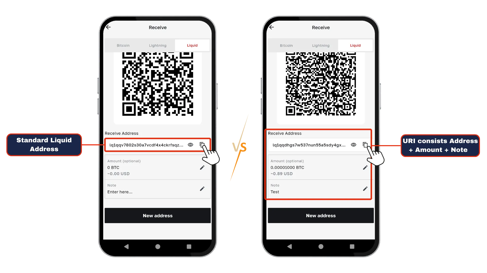


### Menerima melalui Lightning


Bull Bitcoin Wallet juga memungkinkan kamu mengirim dan menerima pembayaran melalui Lightning Network. Fitur utamanya adalah dana yang diterima melalui Lightning akan secara otomatis ditukar dan disimpan di `Liquid Network` dalam `Pembayaran Instan Wallet`. Layanan ini didukung oleh `Boltz`. Desain ini memungkinkan kamu menikmati kecepatan tinggi dan biaya rendah Lightning tanpa kerumitan mengelola saluran likuiditas, sambil tetap mempertahankan kontrol penuh atas dana kamu. Namun, meskipun pendekatan hibrida ini tetap bersifat self-custodial dan menghindari kompleksitas pengelolaan saluran, pendekatan ini memperkenalkan layanan pihak ketiga yaitu Boltz, biaya swap yang kecil, serta ketergantungan pada federasi fungsionaris Liquid Network sebagai pemegang kunci. Hal ini berbeda dengan Lightning wallet non-kustodian tradisional, di mana kamu mengelola saluran Lightning kamu sendiri. Kamu dapat mempelajari lebih lanjut tentang Liquid dan model tata kelolanya di sini:


https://planb.academy/en/courses/e17ee350-41d4-49fa-b270-29e4d26d22f8/overview-of-liquid-architecture-and-governance-model-17650c4b-cd1f-4bc6-b490-708f92dc9306


- Batasan:** Batas
    - Jumlah Minimum:** Diperlukan jumlah faktur minimum. Silakan periksa aplikasi untuk mengetahui batas saat ini
    - Biaya:** kamu, sebagai penerima, bertanggung jawab atas biaya penukaran yang kecil. Biaya ini dipotong dari jumlah yang ditransfer pengirim dan dapat berubah sewaktu-waktu
- Manfaat:** Manfaat
    - Kustodian Mandiri:** Dana Anda selalu berada di bawah kendali kamu, diamankan di jaringan Liquid.
    - Hindari Biaya On-Chain yang Tinggi:** Dengan menggunakan Lightning dan menyimpan di Liquid, Anda melewati biaya on-chain yang terkait dengan pembukaan saluran Lightning tradisional. Kamu dapat memilih untuk memindahkan dana ke saluran on-chain nanti, ketika jumlah yang terakumulasi sesuai dengan biaya.
    - Tip:** Untuk transaksi yang paling hemat biaya antara dua pengguna Bull Bitcoin, gunakan **jaringan Liquid secara langsung** untuk menghindari biaya swap Lightning sepenuhnya.


Untuk menerima pembayaran, Anda harus generate sebuah `Faktur Kilat`:


1. `Masukkan Jumlah`:** Tentukan jumlah yang ingin kamu terima dalam Bitcoin (BTC), Satoshi (Sats), atau mata uang fiat.

2. `Tambahkan Catatan` **(Opsional):** Sertakan memo atau catatan. Catatan ini akan disematkan pada faktur dan ditampilkan dalam riwayat transaksi Anda setelah pembayaran selesai, sehingga lebih mudah diidentifikasi.

3. `Validitas Invoice`:** Faktur Lightning sensitif terhadap waktu dan akan kedaluwarsa setelah **12 jam**. Jika tidak dibayar dalam jangka waktu tersebut, faktur tersebut menjadi tidak berlaku, dan kamu harus membuat generate yang baru.


Berikan faktur kepada pengirim dengan menyalinnya ke papan klip Anda atau dengan membiarkan mereka memindai kode QR yang ditampilkan di layar Anda.


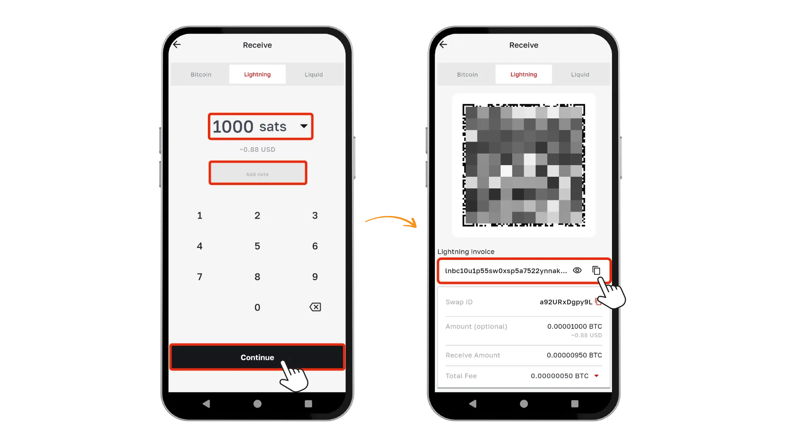


## 9️⃣ Mengirim dana


Kamu dapat mengakses layar kirim langsung dari halaman beranda atau dari dalam wallet kamu. Bull Bitcoin Wallet menyederhanakan proses dengan secara otomatis mendeteksi jaringan tujuan `Bitcoin`, `Liquid`, atau `Lightning` berdasarkan alamat atau invoice yang kamu masukkan, baik dengan menempelkan teks maupun memindainya melalui kode QR.


### Transmisi On-Chain melalui Jaringan Bitcoin


Mengirim dana on-chain berarti transaksi kamu dicatat langsung di blockchain Bitcoin. Metode ini paling cocok untuk transfer dalam jumlah besar atau transaksi yang tidak sensitif terhadap waktu. Untuk memulai, kamu bisa mengetuk `Tombol Kirim` di kanan bawah, lalu memindai atau memasukkan `alamat Bitcoin standar`.


Jika alamat yang kamu masukkan tidak menyertakan jumlah tertentu, kamu akan diminta melengkapi detailnya di layar kirim. Kamu dapat menentukan jumlah dalam unit yang diinginkan, seperti BTC, satoshi, atau nilai setara dalam mata uang fiat. Kamu juga bisa menambahkan catatan pribadi, yang berfungsi sebagai memo internal untuk membantu mengidentifikasi transaksi di kemudian hari. Catatan ini tidak akan dibagikan kepada penerima.


Sebaliknya, jika permintaan pembayaran yang kamu pindai atau tempelkan sudah berisi semua detail yang diperlukan, seperti URI BIP21 dengan jumlah yang telah ditentukan, wallet akan melewati layar pengisian data dan langsung membawa kamu ke layar konfirmasi untuk menyetujui pembayaran.


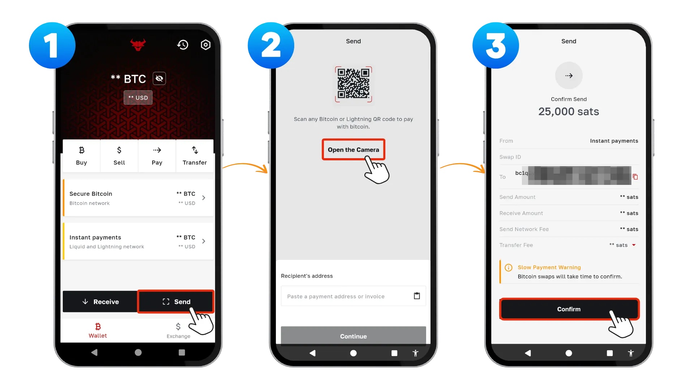


Sebelum transaksi kamu disiarkan, kamu akan melihat layar konfirmasi. Sangat penting untuk meluangkan waktu sejenak dan meninjau setiap parameter dengan cermat, terutama alamat penerima, jumlah yang dikirim, dan biaya jaringan. Layar ini juga menyediakan alat bantu yang berguna untuk menyesuaikan transaksi kamu.


Kamu dapat mengontrol biaya dengan dua cara utama. Metode pertama adalah memilih kecepatan transaksi yang diinginkan, seperti rendah, sedang, atau tinggi, dan wallet akan secara otomatis menghitung biaya yang sesuai. Metode kedua memberikan kontrol yang lebih presisi dengan memungkinkan kamu menetapkan biaya tertentu, baik sebagai total absolut dalam satoshi maupun sebagai tarif relatif per byte, yang kemudian disertai estimasi waktu konfirmasi.


Untuk pengguna tingkat lanjut, wallet ini menawarkan beberapa pengaturan tambahan untuk menyempurnakan transaksi. `Replace-by-Fee` (RBF) diaktifkan secara default, sebuah fitur penting yang memungkinkan kamu mempercepat transaksi yang tertahan di mempool dengan menyiarkannya ulang menggunakan biaya yang lebih tinggi. Kamu juga dapat memilih secara manual `Unspent Transaction Outputs` (UTXO) mana yang akan dibelanjakan. Ini adalah alat yang sangat berguna untuk konsolidasi UTXO, yaitu strategi menggabungkan beberapa input kecil menjadi satu input yang lebih besar. Meskipun langkah ini dapat meningkatkan biaya transaksi saat ini, konsolidasi UTXO dapat secara signifikan menurunkan biaya transaksi di masa depan, terutama jika biaya jaringan diperkirakan akan meningkat.


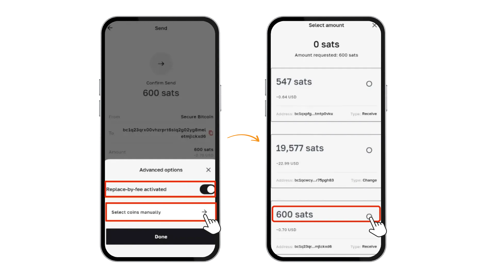


PayJoin akan otomatis dicoba saat kamu memindai permintaan pembayaran dari penerima berupa URI BIP21 yang menyertakan parameter `pj=`. Jika kamu hanya menempelkan alamat standar tanpa parameter tambahan, fitur ini tidak akan diaktifkan. Metode kolaboratif ini meningkatkan privasi dengan menggabungkan input dari pengirim dan penerima, sehingga mematahkan heuristik kepemilikan input yang umum digunakan, sekaligus memungkinkan penskalaan yang lebih baik dan penghematan biaya dalam beberapa situasi.


### Mengirim ke Liquid Network


Liquid Network dirancang untuk transaksi yang cepat dan privat dengan biaya yang sangat rendah. Saat kamu mengirim dana melalui Liquid, dana tersebut akan diambil dari `Pembayaran Instan Wallet`. Prosesnya sederhana: kamu cukup memasukkan atau memindai `alamat Liquid` milik penerima.


Jika alamat tidak menyertakan jumlah, kamu akan diminta untuk mengisinya di layar kirim. Kamu bisa memasukkan jumlah dalam BTC, satoshi, atau mata uang fiat. Salah satu keunggulan utama Liquid adalah ambang batas minimum yang rendah. Sama seperti transaksi on-chain, kamu juga bisa menambahkan catatan pribadi opsional untuk referensi kamu sendiri. Jika permintaan pembayaran sudah mencantumkan jumlah, wallet akan langsung membawa kamu ke layar konfirmasi.


Di layar konfirmasi transaksi Liquid, kamu akan meninjau detail transaksi. Biayanya sangat rendah dan dihitung berdasarkan kompleksitas transaksi. Biasanya sekitar 0,1 sat/vB, yang untuk transaksi sederhana hanya berkisar 20 hingga 40 satoshi (misalnya 26 satoshi pada 21 Desember 2025).


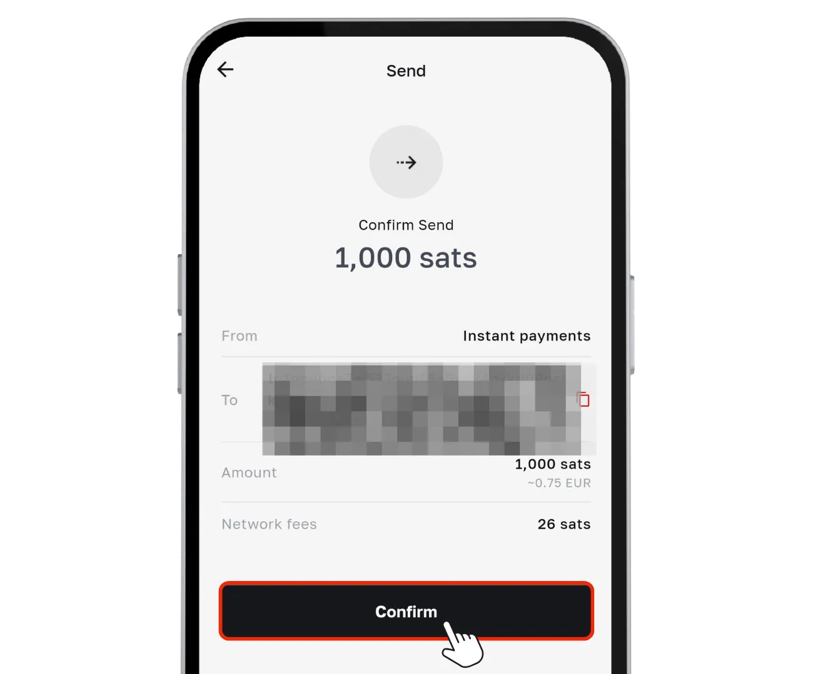


### Mengirim ke Lightning Network


Kamu dapat memindai Lightning Address (misalnya `runningbitcoin@rizful.com`) yang memungkinkan kamu mengatur jumlah dan catatan opsional untuk penerima, atau memindai invoice dengan jumlah yang sudah ditentukan sebelumnya, yang akan langsung membawa kamu ke layar konfirmasi.


*Harap diperhatikan bahwa jumlah minimum dan biaya tetap berlaku.*


Bull Bitcoin Wallet mengirim pembayaran Lightning dengan menarik dana dari `Pembayaran Instan Wallet` (di Liquid) dan menukarkannya melalui `Boltz`. Pendekatan hibrida ini sepenuhnya bersifat self-custodial dan menghindari biaya on-chain yang tinggi untuk mengelola saluran Lightning khusus, tetapi tetap memerlukan pembayaran `biaya pertukaran`. Untuk biaya paling rendah, kirim langsung ke alamat Liquid penerima jika mereka juga menggunakan Bull Bitcoin Wallet.


## 🔟 Mentransfer Dana Antar Dompet Anda


Bull Bitcoin memungkinkan kamu memindahkan bitcoin antara `Bitcoin Aman` wallet dan `Pembayaran Instan Wallet` di Liquid Network, atau ke `Wallet eksternal`. Untuk melakukan transfer, cukup buka bagian `Transfer`, pilih wallet sumber dan tujuan, masukkan jumlah yang ingin kamu pindahkan, lalu konfirmasikan transaksi.


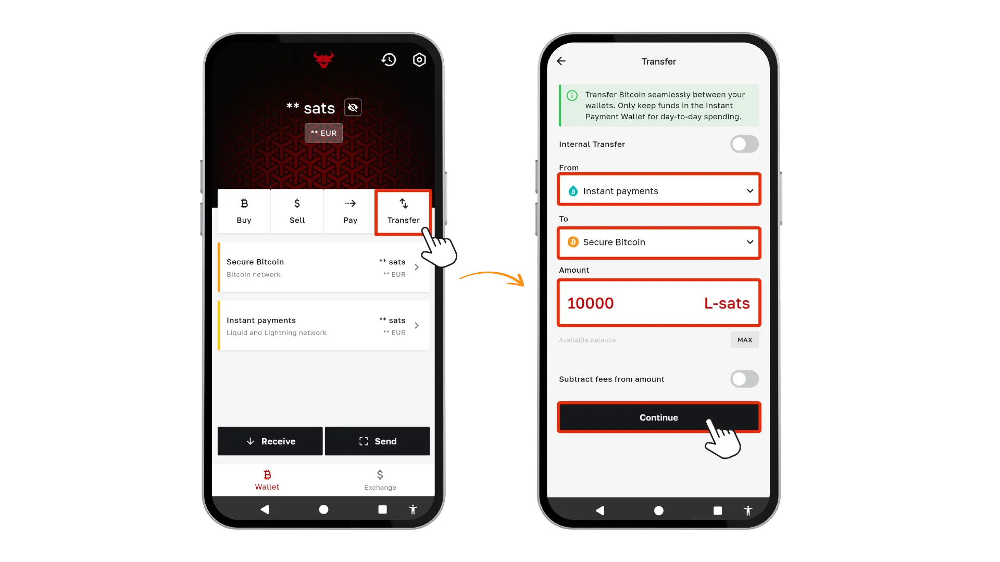


## 1️⃣1️⃣ Memulihkan Bull Bitcoin Wallet kamu


Bagian ini menjelaskan cara mendapatkan kembali akses ke dana Bull Bitcoin Wallet kamu jika perangkat hilang, aplikasi terhapus, atau kamu perlu berpindah ke perangkat baru. Seperti yang sudah dijelaskan sebelumnya, ada dua metode utama untuk pemulihan: menggunakan metode unik `Recoverbull` dan menggunakan `BIP39 seedphrase` standar.


### Metode 1: Recoverbull


Rekap: Cadangan Wallet dienkripsi secara lokal. File yang dienkripsi dapat disimpan di penyimpanan cloud, atau di perangkat lain. Kunci enkripsi disimpan oleh Server Kunci Recoverbull. Keduanya disimpan terpisah dan harus digabungkan untuk memulihkan wallet.


Untuk memulai, aku akan menghapus Wallet dengan semua dana di dalamnya dan menginstal ulang wallet. Kita akan mendarat di `Layar Selamat Datang` lagi. Kali ini, pilih opsi `Pulihkan Wallet`. Kemudian, navigasikan ke metode `Vault Terenkripsi`, konfirmasikan menggunakan `Server Kunci Default`, dan pilih lokasi atau `Penyedia Vault` di mana kamu menyimpan file cadangan.


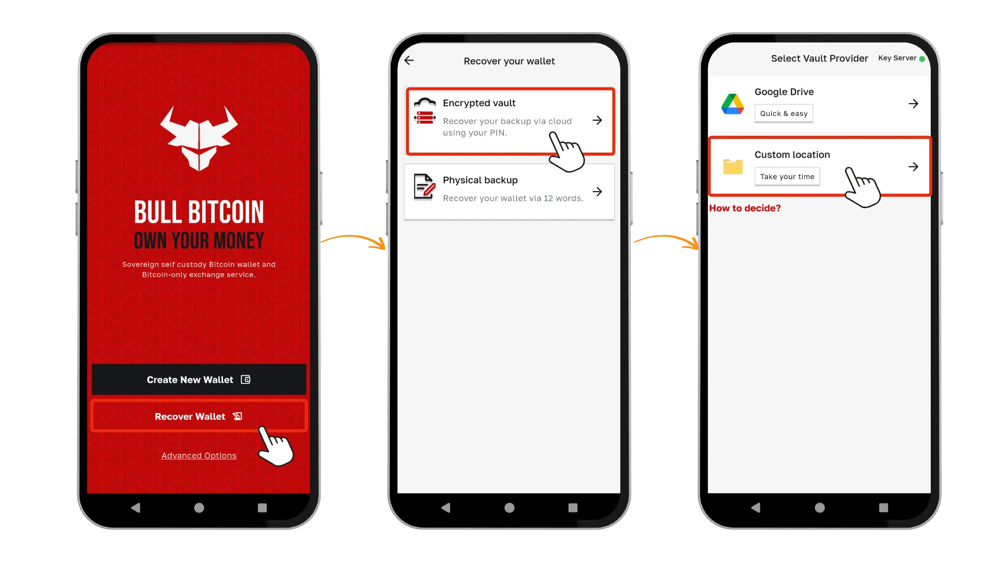


Ini menyatakan bahwa vault berhasil diimpor. Tekan tombol `Dekripsi Brankas` dan masukkan `PIN`. Layar berikutnya akan menampilkan `saldo` dan `jumlah transaksi` kamu yang telah dipulihkan.


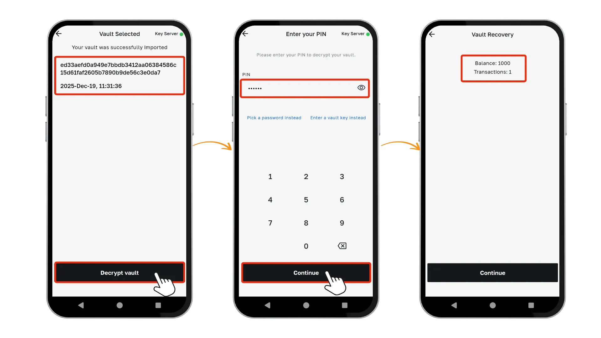


### Metode 2: Seed Phrase


Metode ini menggunakan seedphrase utama wallet kamu, yaitu daftar standar 12 kata yang berfungsi sebagai cadangan utama dana kamu. Ini adalah cara paling universal untuk memulihkan Bitcoin wallet, karena tidak bergantung pada layanan atau server tertentu. Selama kamu memiliki seedphrase ini, kamu dapat memulihkan wallet di perangkat apa pun yang kompatibel, bahkan tanpa akses ke Server Kunci Bull Bitcoin.


Dari layar Selamat Datang, pilih `Pulihkan Wallet`. Kali ini, pilih metode `Physical backup`. Aplikasi akan menampilkan kisi kata. Pilih dengan sangat hati-hati setiap kata dari seedphrase 12 kata dalam urutan yang benar. Pastikan semuanya tepat, karena satu kesalahan saja akan menghasilkan wallet yang berbeda.


## 1️⃣2️⃣ Menghubungkan Hardware Wallet


Untuk tingkat keamanan tertinggi, banyak pengguna Bitcoin memilih menyimpan dana mereka dalam `cold storage`. Ini berarti menyimpan `private key` yang mengontrol bitcoin kamu di perangkat yang tidak pernah terhubung ke internet. Sebuah `hardware wallet` (atau perangkat penandatangan) adalah perangkat fisik khusus yang dirancang untuk tujuan ini. Perangkat ini berfungsi seperti brankas digital untuk kunci kamu, memastikan private key tersebut tidak pernah terekspos ke potensi ancaman dari komputer atau ponsel pintar yang terhubung ke internet.


Dengan menghubungkan hardware wallet ke aplikasi Bull Bitcoin, kamu mendapatkan yang terbaik dari dua dunia: keamanan maksimal dari cold storage untuk private key kamu, dipadukan dengan fitur-fitur yang kuat serta antarmuka Bull Bitcoin Wallet yang mudah digunakan untuk melihat saldo dan mengelola transaksi. Pada bab terakhir ini, kami akan menunjukkan cara menghubungkan hardware wallet, seperti [Coldcard Q](https://coldcard.com/q), ke Bull Bitcoin wallet kamu. Tutorial ini tidak akan membahas pengaturan Coldcard Q secara mendalam; Kamu dapat mempelajarinya di sini:


https://planb.academy/en/tutorials/wallet/hardware/coldcard-q-73e86d1a-6fe6-4d8b-bb15-8690298020e3

https://planb.academy/en/tutorials/wallet/hardware/coldcard-q-advanced-b8cc3f29-eea9-48fe-a953-b003d5b115e0

### Mengimpor Wallet


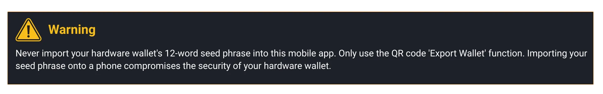


Pertama, dari menu utama pada Coldcard Q kamu, pilih `Export Wallet`, lalu pilih `Bull Wallet`. Coldcard akan menghasilkan kode QR generate.


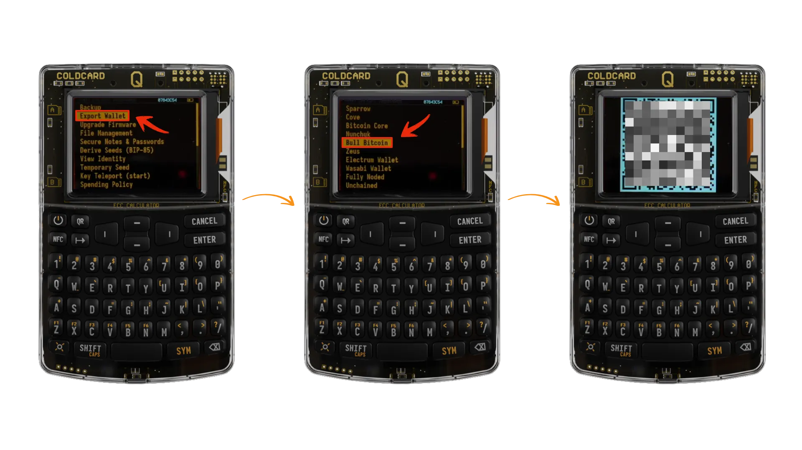


Buka Bull Bitcoin Wallet dan navigasikan ke `Pengaturan` > `Pengaturan Bitcoin` > `Import wallet` dan pilih `Coldcard Q` pada ponsel dan ketuk `Buka kamera` untuk memindai kode QR untuk mengimpor kunci publik perangkat keras wallet.


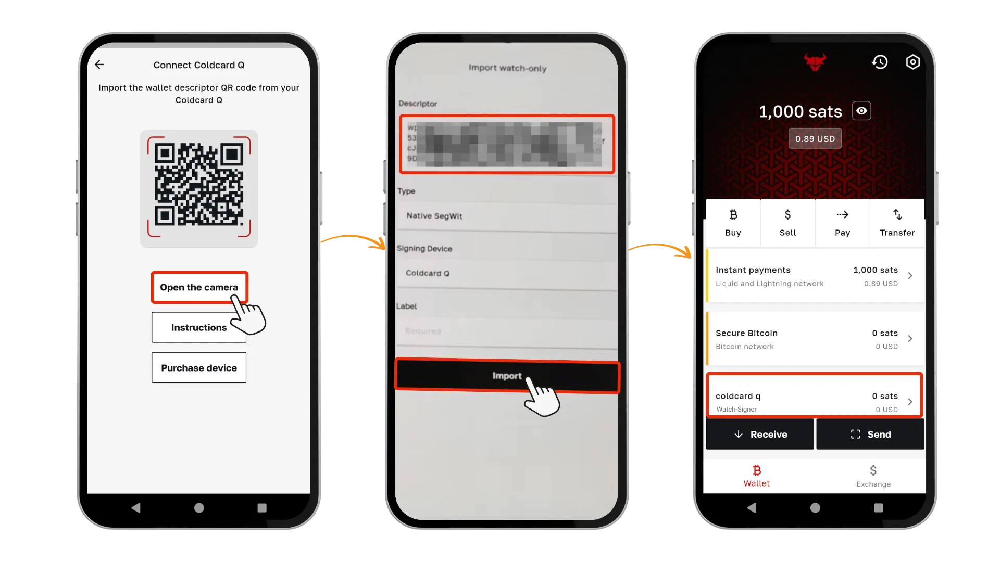


### Menerima dengan Coldcard Q


Untuk menerima Bitcoin menggunakan Coldcard Q yang terhubung, kamu tidak perlu menyambungkan perangkat secara fisik ke ponsel. Bull Bitcoin Wallet telah mengimpor kunci publik yang diperlukan, sehingga wallet dapat menghasilkan alamat penerima secara mandiri.


1. Ketuk perangkat penandatanganan Coldcard Q yang diimpor dan pilih `Terima`.

2. Aplikasi akan secara otomatis menampilkan alamat Bitcoin yang baru dari wallet Coldcard kamu.

3. Gunakan alamat ini untuk menerima dana. Bitcoin akan diamankan secara langsung ke kunci perangkat keras wallet, meskipun perangkat sedang offline selama proses berlangsung.


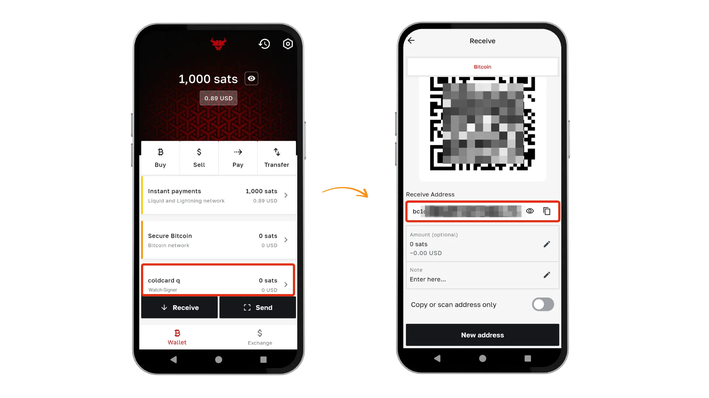


### Mengirim dengan Coldcard Q


Mengirim Bitcoin dengan Coldcard Q kamu memerlukan konfirmasi fisik untuk mengesahkan setiap transaksi. Meskipun aplikasi Bull Bitcoin Wallet digunakan untuk membuat transaksi, tanda tangan akhir hanya dapat dilakukan langsung di hardware wallet itu sendiri.


Untuk memulai, buka wallet `Coldcard Q` kamu dan ketuk `Kirim`. Lalu, `buka kamera` untuk memindai kode QR alamat penerima. Setelah alamat dipindai, masukkan `jumlah` yang ingin kamu kirim dan sesuaikan `prioritas biaya` sesuai kebutuhan.


Untuk pengaturan tambahan, kamu bisa membuka bagian Pengaturan Lanjutan. Di sini tersedia opsi `Replace-by-Fee` (RBF), yang aktif secara default dan memungkinkan kamu mempercepat transaksi yang tertahan di mempool. Kamu juga dapat menggunakan opsi `Coin Control`, yang memungkinkan kamu memilih secara manual UTXO tertentu yang ingin dibelanjakan.


Setelah semua detail ditinjau dan sudah sesuai, ketuk `Tampilkan PSBT` untuk menyiapkan transaksi.

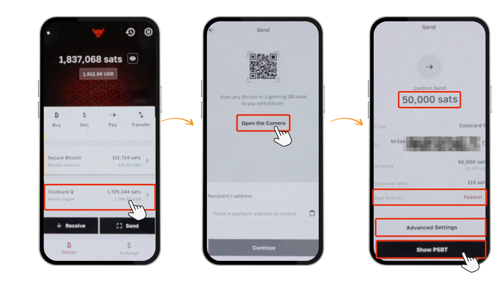


Tekan tombol `Pindai` pada Coldcard Q kamu dan gunakan kameranya untuk memindai kode QR yang ditampilkan di ponsel. Layar Coldcard kemudian akan menampilkan semua detail transaksi. Verifikasi jumlah, alamat penerima, dan alamat kembalian dengan cermat. Jika semuanya sudah benar, tekan tombol `Enter` pada Coldcard Q untuk menandatangani transaksi. Setelah itu, kode QR berisi transaksi yang sudah ditandatangani akan ditampilkan di layar.


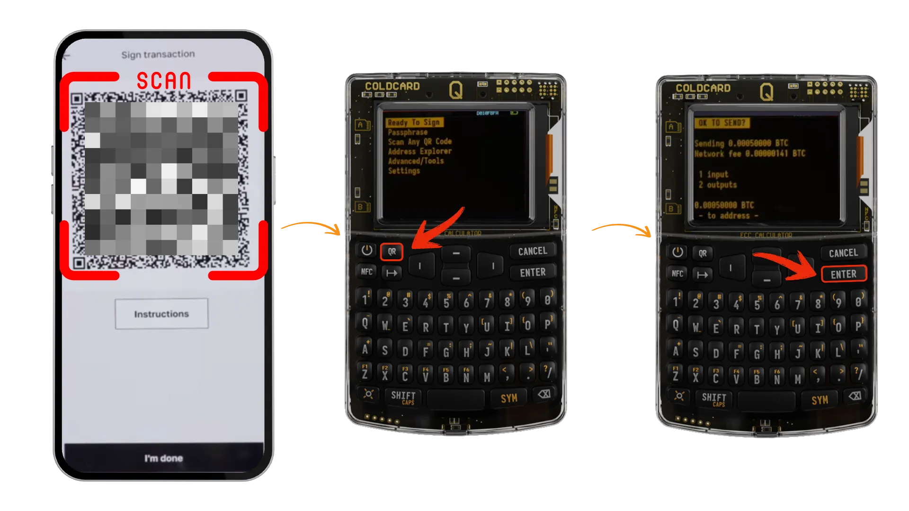


Pada Bull wallet, ketuk `Selesai`, lalu ketuk tombol `Kamera` untuk memindai kode QR dari `transaksi yang ditandatangani` dari Coldcard Q. Bull Wallet sekarang akan menampilkan layar ringkasan transaksi yang ditandatangani. Tinjau untuk terakhir kalinya, lalu ketuk `Siarkan` Transaksi. Ini akan menyelesaikan proses dengan mengirimkan transaksi ke jaringan Bitcoin, dan dana Anda akan segera dikirim.


## 🎯 Kesimpulan


Sekarang kamu telah menyelesaikan perjalanan kamu mengenal Bull Bitcoin Wallet. Aplikasi ini menghadirkan alat privasi dan keamanan yang kuat langsung di genggaman kamu, sehingga fitur-fitur tingkat lanjut tetap mudah digunakan. Bull Bitcoin Wallet membantu kamu menjaga privasi dengan fitur seperti `PayJoin`, yang membantu menyamarkan transaksi kamu di blockchain, serta `Integrasi Tor`, yang menyembunyikan aktivitas jaringan kamu dari pihak yang mengintip. Bagi kamu yang menginginkan kontrol penuh, kamu bisa terhubung ke `node Bitcoin pribadi kamu` agar tidak bergantung pada server pihak ketiga, serta menggunakan `hardware wallet` untuk memastikan private key kamu tetap sepenuhnya offline dan aman. Dengan opsi pencadangan yang cerdas serta dukungan penuh untuk Bitcoin, Liquid, dan Lightning, Bull Bitcoin Wallet menjadi pilihan yang kuat dan lengkap bagi siapa pun yang serius menjaga dana mereka tetap privat, aman, dan sepenuhnya berada di bawah kendali mereka sendiri.


## 📚 Sumber Daya Bull Wallet


[Github](https://github.com/SatoshiPortal/bullbitcoin-mobile) | [Situs web](https://www.bullbitcoin.com/) | [Recoverbull](https://recoverbull.com/)
