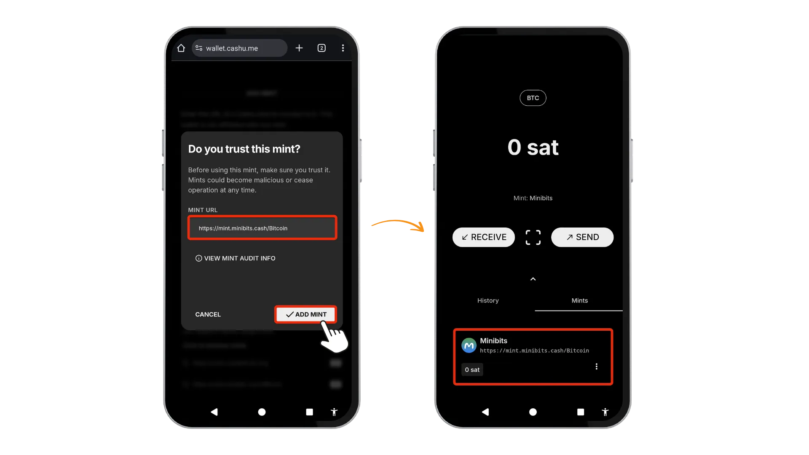
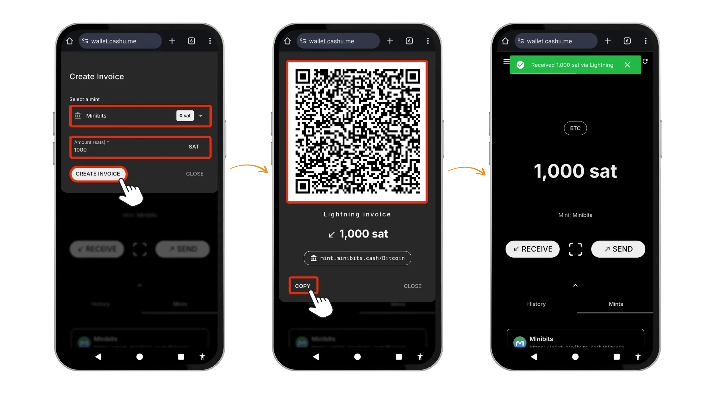
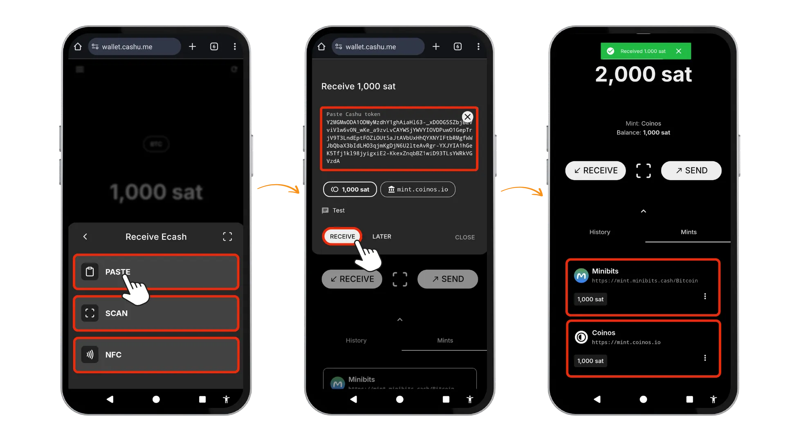
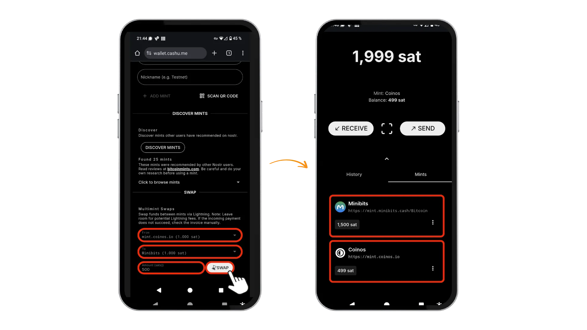
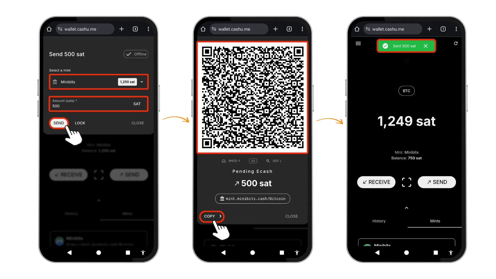
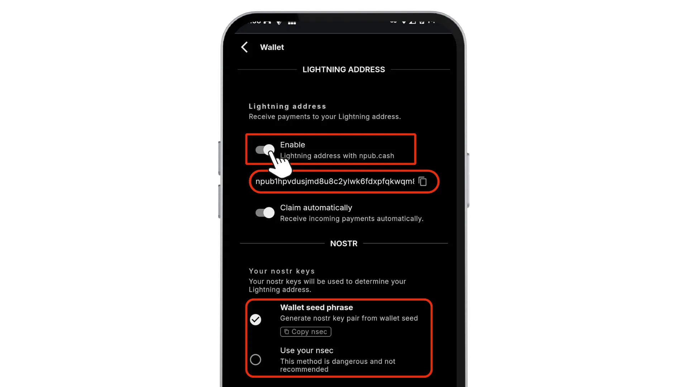

*下面是来自 BTC Sessions 的视频教程，该视频指导您如何设置和使用 Cashu.me 比特币钱包，它可以让您访问简单、廉价和私密的比特币交易 - 无需应用程序商店！* *。

在本教程中，我们将探索 Cashu.me，这是一个基于浏览器的钱包，使用 Chaumian ecash 进行私人比特币支付。在开始之前，我们先来简单了解一下 ecash 及其工作原理。

## ecash 简介

假设一下，您口袋里的数字现金就像实体钞票一样--私密、即时、点对点使用，无需中介。这就是 ecash 所能实现的：一种将实物现金的私密性带回数字世界的数字支付方式。与链上比特币（onchain-Bitcoin）不同，后者会将每笔交易记录在任何人都可以查看的公共账本上，而电子现金则创建代表真实比特币价值的私有代币，同时确保您的消费习惯不被泄露

您可以将电子现金 (ecash) 理解为存储在您设备上的数字不记名凭证——持有它们，您就拥有它们，就像持有实体现金一样。这些代币由名为 Mints（铸币厂）的受信任服务发行，这些服务持有底层比特币储备。使用电子现金时，您的交易不会广播到整个网络。相反，您是直接与他人交换私有代币，这种支付体验更像是直接给别人现金，而不是进行传统的数字支付。

Cashu 是一个基于 Chaum 的免费开源电子现金协议，专为比特币而构建。该技术基于 David Chaum 在 20 世纪 80 年代开创性的密码学研究，采用盲签名来确保隐私。当您收到电子现金代币时，铸币厂会在不知道代币后续用途的情况下对其进行签名——这一关键特性有效防止了交易追踪。重要的是，电子现金并非取代比特币，而是通过解决比特币架构中存在的一些关键问题来对其进行补充。它提供了实体现金所具备的隐私性（这是比特币透明账本所缺乏的），并支持即时小额交易，无需支付区块链手续费或经历确认延迟。

电子现金与闪电网络无缝集成。您可以使用 "闪电网络" 将比特币存入铸币厂（将您的比特币价值转换为生态现金代币），然后再提取（将代币转换回可消费的 "闪电" 余额）。它们共同组成了一个强大的组合：比特币提供了安全结算层面，闪电实现了快速交易和网络互操作性，ecash 增加了隐私保护层面，使数字支付重新变得真正私密。

## Cashu.me

Cashu.me 是一个 "渐进式网络应用程序（PWA）"，它实现了 Cashu 协议--一种专为比特币设计的 Chaumian ecash 的特定实现。作为一个 PWA，它可以直接在浏览器中运行，无需从应用程序商店进行安装，但您可以将其 "安装" 到您的设备上，以便更方便地访问。这种基于网络的方法可确保跨操作系统的广泛兼容性，同时通过加密协议而非平台限制来维护安全性。

## 🎉 主要功能

让我们深入了解卡舒.me 的功能，探索它能提供什么：

- **Chaumian 闪电网络电子现金**：采用盲签名技术，因此铸币厂无法追踪用户余额或交易记录
- **代币自主托管**：您可以使用助记词在本地控制电子现金代币
- **助记词备份**：提供 12 个单词的恢复短语，用于钱包恢复
- **独立铸币厂**：支持多个独立铸币厂，您无需绑定任何一家服务商
- **即时免费交易**：在同一铸币厂内，支付可在数秒内完成，且无需任何手续费
- **隐私保护架构**：铸币厂无法查看交易双方的信息
- **离线电子现金**：无需网络连接，即可通过本地传输协议（例如 NFC、二维码、蓝牙等）发送/接收代币
- **通过 Nostr 发现电子现金铸币厂**：通过 Nostr 协议查找并验证可信的铸币厂
- **在不同铸币厂之间兑换电子现金**：所有铸币厂均支持闪电网络这意味着您可以在它们之间转移价值。
- **使用 Nostr Wallet Connect (NWC) 远程控制您的钱包**：连接到其他应用程序（例如 Nostr Client），然后通过 NWC 开始转账。

关键的权衡在于 "信任"：虽然您可以控制代币本身，但您必须信任铸币厂来保管基础比特币储备。正如 Cashu 的文档所述

> ...铸币厂负责运行闪电网络基础设施，并为铸币厂的电子现金用户保管聪（比特币）。用户必须信任铸币厂，才能在想要兑换成闪电网络时赎回他们的电子现金。

- Cashu 文档，[一般安全和隐私问题](https://docs.cashu.space/faq#general-safety-and-privacy-questions)

这使得 ecash 成为比特币本身的托管解决方案，但您仍可完全控制代币。

## 1️⃣初始设置

① 首先在浏览器中访问 [Wallet.cashu.me](https://Wallet.cashu.me)。由于 Cashu.me 是一个 "PWA"，您无需从应用程序商店下载，只需直接在浏览器中打开网站即可。为了方便访问，您可以选择将其安装到设备的主屏幕上。

安装 PWA 时，请点击浏览器中 “⋮” 选单按钮并选择 "添加到主屏幕"（Add to Home Screen）。安装完成后，关闭浏览器标签，从设备的主屏幕启动 Cashu.me。在欢迎界面，点击 `Next` 以继续。

③ 安全至关重要。将您的助记词安全地保存在密码管理器中，或者最好写在纸上。如果您无法使用本设备，这 12 个单词的恢复助记词是您恢复资金的唯一方法。点击 👁️ 图标以显示您的助记词，按顺序认真写下所有 12 个单词，然后勾选 `I have written it down`。点击 "下一步 `Next` 继续，并在下一屏幕的 `Terms` 复选框中打勾确认接受 "条款"。

完成设置后，您需要连接到 "铸币厂"。点击 `ΑDD MINT`，然后点击 `DISCOVER MINTS`，查看 Nostr 社区推荐的铸币厂。为了进一步验证，您可以在 [bitcoinmints.com](bitcoinmints.com) 查看铸币厂评级。

然后点击 `Click to browse mints`，以查看完整列表。复制铸币厂的 URL，将其粘贴到 URL 字段中，并给它起一个好记的名字，以此来选择铸币厂。在本例中，我们将使用：

URL：`https://mint.minibits.cash/Bitcoin`

名称：Minibits

点击 `ADD MINT` 完成此过程。在确认屏幕上，确认您信任该铸币厂的操作员，然后再次轻点 `ADD MINT`。Minibits 铸币厂现在将出现在您的主屏幕上。钱包设置完成后，您需要在进行交易前为其注资。

## 2️⃣ 给您的钱包发送比特币

Cashu.me 为您的钱包提供两种不同的汇款方式。当您点击主屏幕上的 `Receive` 时，您将看到通过 `ECASH` 或 `LIGHTNING`（闪电网络）接收资金的选项。

### 通过 LIGHTNING（闪电网络）接收资金

第一个选项是通过闪电发票为钱包发送资金。如果您添加了不同的铸币厂，请选择一个铸币厂，并确定您希望收到的 "金额 (Sats)"。然后点击 `CREATE INVOICE`，您就会得到一个二维码，您可以用另一个闪电钱包扫描，或者您也可以直接复制发票，然后粘贴到另一个钱包中，为您的 cashu.me 钱包支付和注资。

### 接收 ecash

使用 ecash 方式，您可以直接从其他 ecash 钱包接收代币。首先，点击 `Receive` 按钮，然后选择 `ECASH` 选项。您可以 “粘贴”、“扫描” 或使用 “NFC” 从其他钱包提交 Cashu 代币。如果您选择粘贴，请输入您从其他钱包复制的代币字符串，“金额” 和 “铸造厂” 将自动显示。点击 `RECEIVE` 以完成交易，比特币将出现在您的钱包中。请注意，您的余额现在分布在多个铸造厂中。例如，您的 Minibits 铸造厂中可能有 1,000 聪，而 Coinos 铸造厂中可能还有另外 1,000 聪。这种跨不同铸造厂的分配是 Cashu 架构的一个重要方面。

### 铸造厂之间的交换

如果您不再信任您所添加的某个铸造厂，cashu.me提供了铸造厂之间的 "资金交换" 功能。前往 “Mints” 选项卡，向下滚动直到看到 `Multimint Swaps`。从下拉选单中选择 `FROM` 和 `TO` 铸造厂，然后输入您要转移的金额。点击 `SWAP` 即可在不同币种间转移代币。此操作将通过闪电网络交易执行，因此您需要预留一定的闪电网络交易手续费。在我的示例中，1 聪就足够了。

## 3️⃣ 发送资金

Cashu.me 提供两种发送 sats 的方式：通过 “电子现金” 或 “闪电网络”。让我们来看一下这两种方式。

### 通过闪电网络发送

如需通过闪电网络发送，请按照以下步骤操作：

1. 在主屏幕上点击 `SEND`，然后选择 `Lightning`。

2. 应用会提示您输入 `Lightning invoice` 或 `-address`。您可以直接粘贴发票/地址，也可以使用扫描二维码功能进行扫描，然后点击 `ENTER`。

3. 使用下拉选单选择您要付款铸币厂，然后点击 `PAY` 进行确认。**注意**：您还可以在 `Settings` -> `Experimental` 功能下使用 `Multinut` 选项，一次性支付多个铸币厂的发票。

4. 支付成功后，您将看到付款确认信息以及从您的余额中扣除的金额。

### 通过 ecash 发送

发送电子现金同样简单。

1. 点击 `SEND`，这次选择 `ECASH` 选项。

2. 选择铸币厂，输入您要发送的金额，然后点击 `SEND` 以确认。

3. 这会生成一个 `Animated QR Code`，您可以调整并自定义速度和大小参数。任何人都可以扫描此二维码立即兑换聪，或者您可以点击 `COPY`，通过蓝牙、NFC 或标准短信等其他渠道将代币字符串发送给其他人。

4. 我要打开另一个钱包。从剪贴板粘贴内容，然后在另一个钱包中选择 `Receive ecash`。

## 4️⃣ 附加功能

除了核心的收发功能外，Cashu.me 还提供强大的附加功能，以增强您在 Nostr 生态系统中的比特币体验。

### Nostr Wallet 连接

Nostr Wallet Connect (`NWC`) 通过在钱包和社交应用程序之间建立无缝连接，改变了您与 Nostr 应用程序的交互方式。该协议允许 [Damus](https://damus.io/) 或 [Primal](https://primal.net/home) 等应用程序直接通过 Nostr 中继请求付款，而无需离开应用程序。

在 Cashu.me 中设置 "NWC" 步骤如下：

1. 点击左上角汉堡选单，然后选择 `Settings`

2. 滚动到 `NOSTR WALLET CONNECT` 部分并点击 `Enable` 按钮

3. 接下来，您需要设置一个限额，以限制应用程序可以从您的钱包中消费的最大金额。

4. 配置完成后，您可以复制连接字符串并将其粘贴到任何支持 `NWC` 的 Nostr 客户端中，从而启用即时转账和打赏功能。

### Lightning Address via npub.cash

Cashu.me 与 [npub.cash](https://npub.cash/)整合，为您提供与 Nostr 协议无缝对接的闪电地址。在这里，您可以注册并通过提供您的 Nostr `nsec` 申请您的用户名，费用为 5,000 聪并支持 npub.cash 项目，您也可以使用任何 Nostr 公钥 (`npub`) 而无需注册。

首先，前往 `Settings` 并点击 `Enable` 使用 npub.cash 的闪电地址。这将生成一个 npub.cash 地址，默认使用从您的钱包种子导出的 `npub` 字符串。

或者，访问[此网站](https://npub.cash/username)，使用您自己的 Nostr `nsec` 申请自定义用户名，这样您就可以获得像 username@npub.cash 的个性化闪电地址。

## 🎯 结论

Cashu.me 提供私密的比特币支付服务，其功能如同实体现金——即时到账，点对点交易，且不会泄露您的交易记录。我个人非常欣赏其 PWA 架构，因为它不受应用商店的限制。该钱包融合了比特币的安全性、闪电网络的快速以及电子现金的隐私性，其应用场景有望促进比特币的日常普及。

虽然您可以完全掌控自己的电子现金代币（通过自主托管），但请记住，铸币厂作为受信任的第三方，持有底层比特币储备。您可以灵活地使用多个铸币厂并进行代币互换，从而在保障隐私的同时，提供更大的灵活性。

凭借 NWC 和 npub.cash 地址等功能，Cashu.me 对于那些重视隐私和自主权、而非受制于大型科技公司政策限制的社交用户来说，是一个极具吸引力的钱包选择。

## 资源

[https://github.com/cashubtc/cashu.me](https://github.com/cashubtc/cashu.me)

[https://github.com/cashubtc](https://github.com/cashubtc)

[https://github.com/cashubtc/awesome-cashu](https://github.com/cashubtc/awesome-cashu)

[https://cashu.space/](https://cashu.space/)
