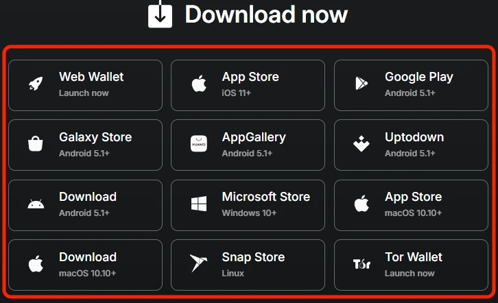
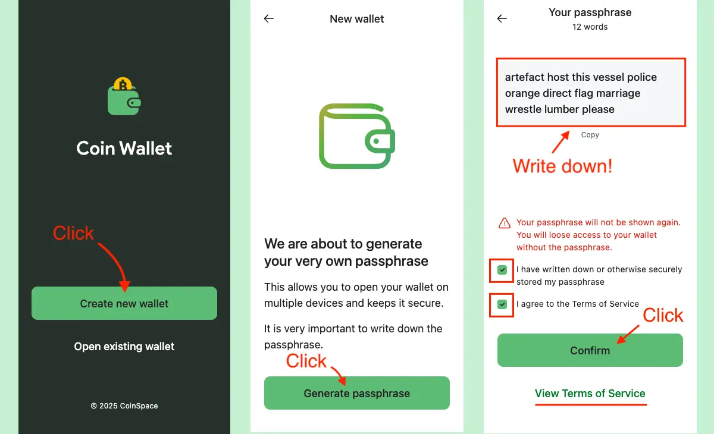
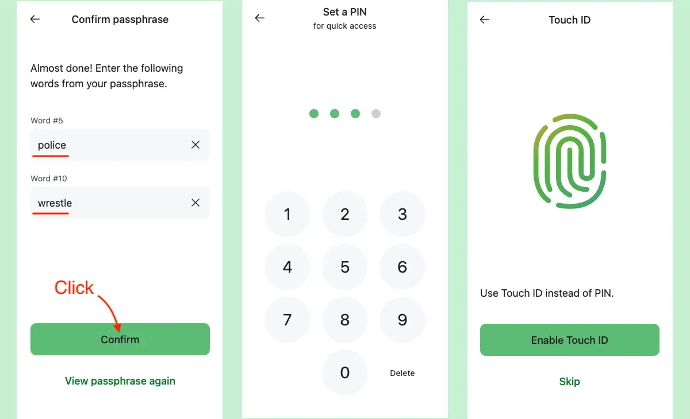
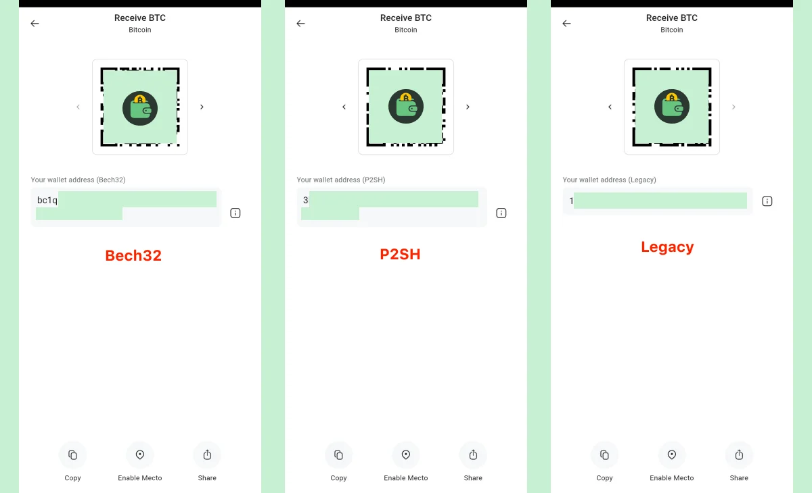
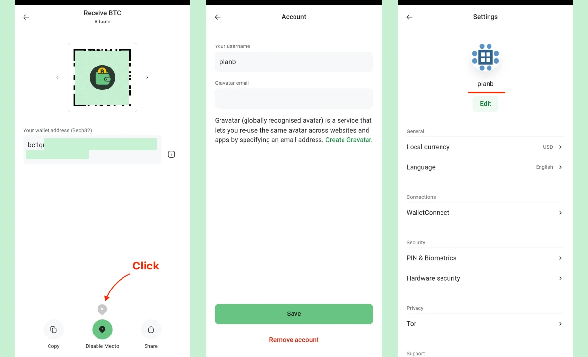
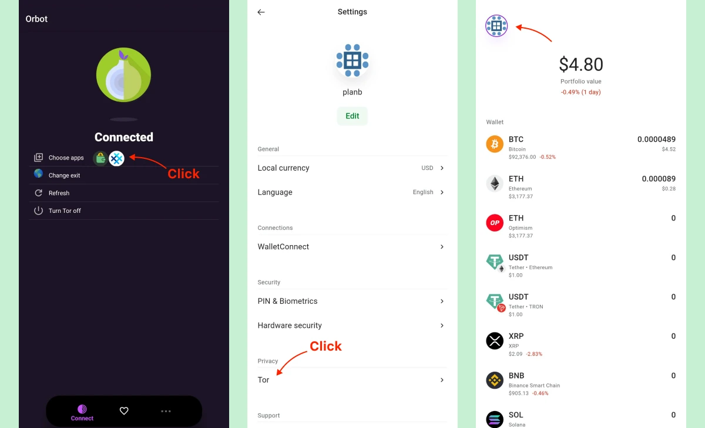

本教程介绍[Coin Wallet](https://coin.space/)--一种用于移动设备的自加密钱包，以及如何在使用移动钱包应用程序时提高安全性和隐私性。

## 关于 Coin Wallet 的介绍

**Coin Wallet** 是由比特币爱好者团队于 2015 年创建的一款自托管/非托管、开源钱包。它最初是一个网络应用程序，2017 年推出 iOS 应用程序，2020 年推出安卓应用程序--可在 Google Play、三星 Galaxy Store 和华为 AppGallery 上下载。

主要优势

- 自托管架构
- 完全[开放源代码](https://github.com/CoinSpace/CoinSpace/blob/master/LICENSE)
- 简洁明了的设计
- 专注于核心目标——安全存储加密货币，摒弃不必要的功能
- 跨平台支持：移动设备（iOS 和 Android）、桌面设备和网页
- 支持 RBF（手续费替换）——随时加速卡住的交易
- 使用 [YubiKey](https://www.yubico.com/works-with-yubikey/catalog/coin-wallet/) 或 FIDO2 密钥的硬件 2FA
- 内置 Tor 支持 - 通过 Tor 网络传输所有流量，最大限度地保护隐私

## 1️⃣ 安装 Coin Wallet

Coin Wallet 可在所有主要平台上使用。

- [iOS应用商店](https://apps.apple.com/app/coin-wallet-bitcoin-crypto/id980719434)

- [Android Google Play](https://play.google.com/store/apps/details?id=com.coinspace.app)

- [安卓（Galaxy Store）](https://galaxystore.samsung.com/detail/com.coinspace.app)

- [安卓（Huawei AppGallery）](https://appgallery.huawei.com/app/C112183767)

- [安卓（Uptodown）](https://coin-wallet.en.uptodown.com/android)

- [Android APK](https://coin.space/api/v3/download/android-apk/any)

- [所有发布链接](https://github.com/CoinSpace/CoinSpace/releases)

还可用于桌面（Windows、Linux、macOS）、网络应用程序和 Tor。

## 2️⃣ 创建钱包和设置 PIN 码

钱包是使用助记词（在此钱包应用程序成为 Passphrase）创建的，密语是从[2048 个单词的列表](https://github.com/paulmillr/scure-bip39/blob/main/src/wordlists/english.ts) 中生成的一个由 12 个空格分隔的单词组成的随机序列。

Coin Wallet 支持从其他钱包导入 12、15、18、21 或 24 个单词的助记词。

助记词是主私人密钥的人可读形式。必须安全保存。助记词是访问或恢复钱包所需的全部信息。如果助记词丢失，钱包和所有资金将永久丢失。绝不要共享助记词。Coin Wallet 不会在任何服务器或数据库中存储密钥。

**12 个单词的助记词足够安全吗？**

整个助记词的每个单词都可以从 2048 个可能的选项中选择，因此总共有 2048¹² ≈ 10³⁹ 种组合——提供约 128 位的安全性，与比特币私钥相当。这样的安全等级被普遍认为已经足够。

写下助记词并确认后，应用程序会要求设置一个**4 位数的 PIN 码**，以便日常访问。为了更加方便，您可以启用生物识别身份验证（指纹或人脸识别）来代替使用 PIN 码。

没有账户，没有密钥恢复，没有助记词重置，也没有交易逆转。安全性完全由用户负责保存。

以下是关于保存助记词的详细最佳实践：

https://planb.academy/tutorials/wallet/backup/backup-mnemonic-22c0ddfa-fb9f-4e3a-96f9-46e2a7954270

## 3️⃣ 助记词 + PIN 码。使用时间和方式

**您什么时候需要助记词？

只有在这种罕见的情况下使用：

- 在新设备上设置钱包
- 重新安装 Coin Wallet 应用程序
- 清除应用程序/浏览器数据（本地存储）
- 从账户中删除硬件匙
- 输入三次错误的 PIN 码（应用程序会锁定以确保安全）

在日常使用中，4 位密码足以解锁您的钱包。

**助记词 + PIN：如何使用？**

助记词是真正的主私钥，可在任何设备上使用。

Coin Wallet 使用 4 位数字的 PIN 码，每次输入 12-24 个单词都很不方便，因此可以在当前设备上实现快速、日常访问。

仅使用简单的 PIN 码不足以直接保护主密钥，因此它从不用于加密。而是：

- PIN 码被发送到服务器，并被交换为一个长加密令牌。
- 该令牌用于解密仅存储在设备上的加密主密钥。

如果密码输入错误三次，服务器将永久删除令牌。本地存储的密钥将无法使用，恢复钱包的唯一方法是输入原始助记词。

这种设计既方便又能提供强大的后备保护。

## 4️⃣ 接收比特币 - 地址类型和隐私

Coin Wallet 支持所有三种比特币地址格式：

- **原生 SegWit (Bech32)** - 以 **bc1q** 开头 - 费用最低，推荐使用
- **嵌套式的 SegWit (P2SH)** - 以 **3** 为开头
- **传统地址（P2PKH）** - 以 **1** 为开头

**为什么每次接收后地址都会改变？

这是有意为之，目的是保护隐私。每次收到比特币时，Coin Wallet 都会自动生成一个新的未使用地址。如果重用同一个地址（例如，月薪地址），任何人都可以在区块链浏览器上轻松汇总所有收到的交易，并知道总收入。

旧地址仍然有效--您仍然可以向它们收件--但建议每次都使用一个新地址，这是隐私保护的最佳做法。

**如何接收比特币：**

1. 打开 Coin Wallet

2.点击**Receive**

3. 选择所需的地址类型（最好是 **bc1q** - `Native SegWit`）。

4. 显示二维码或复制地址并发送给发送者

**可选 - Mecto（用于当面支付）：**

在同一个接收页面上有一个 `Mecto` 按钮。

打开时：

- 您将被要求输入一个**昵称**（gravatar）。
- 您的当前位置和接收地址将暂时与其他已启用 Mecto 功能的 Coin Wallet 用户共享。
- 他们可以通过小型地图找到您，无需输入或扫描即可发送加密货币。

数据只对其他 Mecto 用户可见，并在 1 小时后自动删除（或在关闭时立即删除）。

Mecto 完全是可选项，如果您希望最大限度地保护隐私，请不要使用。

## 5️⃣ 发送比特币

发送 Bitcoin：

1. 打开 Coin Wallet → 点击 **Send**

2. 粘贴地址或扫描二维码

3. 输入金额（或点击 **Max**）

4. 选择交易速度：

| 速度              | 预计确认时间   | 手续费等级 |
| --------------- | -------- | ----- |
| **Slow（慢速）**    | 约 120 分钟 | 最低    |
| **Default（默认）** | 约 60 分钟  | 中等    |
| **Fast（快速）**    | 约 20 分钟  | 较高    |

5. 使用 4 位数密码确认 → 交易将被广播

### 如何加速待处理的比特币交易的确认速度 (RBF，即手续费替换)

如果您因选择了慢速手续费而交易仍然处于待处理状态：

1. 前往 **History** 选项卡

2. 点击待处理交易

3. 点选 **Accelerate**（RBF）

4. 确认 → 交易将以更高的费用重新广播

目前支持 RBF 加速的网络包括：

Bitcoin - Avalanche - Binance Smart Chain - Ethereum - Ethereum Classic - Polygon

有关 Replace-by-fee (RBF) 的更多信息： https://bitcoinops.org/en/topics/replace-by-fee/

## 6️⃣ 导出私钥

**何时需要私钥？**

(99 % 的用户从不这样做--12 个单词的助记词就足够了）

| 情况                    | 您为何需要私钥                |
| --------------------- | ---------------------- |
| 清空旧纸钱包                | 将资金转移到您当前的钱包           |
| 导入到硬件签名器（例如 Coldcard） | 用于离线签名                 |
| 紧急恢复（助记词丢失但应用仍然打开）    | 在应用消失或被重装前恢复比特币          |
| 使用不接受助记词的工具           | 某些仅观察或签名工具不支持助记词，需要直接私钥 |

### 如何在 Coin Wallet 中导出私钥

1. 打开 **Bitcoin (BTC)**

2. 滚动到页面底部 - 点击 **Export private keys**

3. 该应用程序会以 **WIF** 格式（以 5、K 或 L 为开头）显示每个地址的余额及其私钥和二维码。

仅显示非空地址。

**WIF 密钥例子**

`L2v1eK4i9j3k3j4k3j4k3j4k3j4k3j4k3j4k3j4k3j4k3j4k3j4k3j4k`

**下一步操作（推荐）**

- 打开 Electrum、Sparrow、BlueWallet 或任何硬件钱包
- 导入/清除私钥
- 所有资金将立即转移到您当前助记词下的新安全地址。

切勿以纯文本方式存储私钥。扫描后，可以安全删除。

有关私钥和派生路径的完整指南：[How to Work with Private Keys: The Ultimate Guide《如何使用私钥：终极指南》](https://coin.space/how-to-work-with-private-keys-the-ultimate-guide/)

## 7️⃣ 技术细节 - BIP39、BIP32 和派生路径

Coin Wallet 严格遵循官方的比特币标准，几乎所有正规钱包都采用该标准。

`BIP39` - 助记词如何作为主私钥

- 默认字数：12
- 可选密语/密码：无 ("")
- 初始熵：128 位（12 个单词）→ 256 位（24 个单词）
- 开源实施：https://github.com/paulmillr/scure-bip39
- 单词表：包含 2048 个单词的标准英语单词表
- 支持从任何其他 BIP39 钱包导入 12、15、18、21 和 24 个单词的助记词

`BIP32 + BIP44/BIP49/BIP84` - 所有地址的确定性生成

钱包可以使用一个主密钥，按照严格定义的顺序生成数十亿个地址。这就是为什么在 Electrum、Sparrow、Trezor、Ledger、BlueWallet 等钱包中输入相同的 12 个单词，会显示完全相同的地址和余额。

**Coin Wallet 中用于比特币的派生路径**

| 地址类型              | 标准    | 推导路径          | 开头字符  | 说明          |
| ----------------- | ----- | ------------- | ----- | ----------- |
| 原生 SegWit（Bech32） | BIP84 | `m/84'/0'/0'` | bc1q… | 现代格式，手续费最低  |
| 嵌套 SegWit（P2SH）   | BIP49 | `m/49'/0'/0'` | 3…    | 为旧服务提供兼容封装  |
| 传统地址（P2PKH）       | BIP44 | `m/44'/0'/0'` | 1…    | 最早期格式，手续费最高 |

每个派生路径的信息：

- `/0` — 外部链（用于接收付款的地址）
- `/1` — 内部链（钱包自身使用的找零地址）

由于 Coin Wallet 遵循这些公共标准且没有任何更改，即使在 10-20-30 年后，您的资金仍然可以在任何其他兼容的钱包中恢复。

## 8️⃣ 使用 Tor 增强匿名性

**为什么要在 Coin Wallet 中使用 Tor？**

Tor 会隐藏您的真实 IP 地址，使其不被比特币节点、交易所和观察者看到。

所有流量（余额、交易、兑换）都通过 Tor 网络传输——没有直接连接，不会泄露 IP 地址。

此功能已直接在应用程序的源代码中实现（请参阅[.env 配置](https://github.com/CoinSpace/CoinSpace/blob/master/web/.env#L31)）。

Coin Wallet 有一个隐藏的 .onion 地址，自 6.6.3 版（2024 年 12 月）起，**直接在移动应用程序中内置 Tor 支持**。

### 如何在安卓和 iOS 上启用 Tor

1. **安装 Orbot** - Tor 项目官方应用程序（免费）

   - 安卓 → [Google Play](https://play.google.com/store/apps/details?id=org.torproject.android) / [F-Droid](https://orbot.app/en/)
   - iPhone / iPad → [App Store](https://apps.apple.com/us/app/orbot/id1609461599)

2. **打开 Orbot → 点击 Start**

从列表中选择 **Coin Wallet**，以便只有钱包使用 Tor（可选，但建议使用）

等待直至显示 **"Connected"**（10-30 秒）。

3. **打开 Coin Wallet → Settings → Network**

打开 **Use Tor**

4. **检查状态**

顶部栏出现一个**紫色 Tor 洋葱图标** → 所有流量现在都通过 Tor 路由。

就这样，您的手机 Coin Wallet 就完全匿名了。

享受私密的加密货币管理！

## 📝 结论

[Coin Wallet]（https://coin.space/）--真正的比特币钱包先驱之一，拥有十年发展历史。

它秉持简洁至上的理念，始终专注于其核心使命：安全存储您的加密货币。

没有广告、没有新闻推送、无需订阅、没有社交功能、没有干扰——只有一款简洁、快速、自主托管的钱包，完美实现其应有的功能。

Coin Wallet 始终将简洁性和安全性放在首位。

## 📖 资源

https://coin.space/

https://support.coin.space/hc/en-us

https://en.bitcoin.it/wiki/Wallet

https://bitcoinops.org/

https://github.com/CoinSpace/CoinSpace/

https://www.yubico.com/works-with-yubikey/catalog/coin-wallet/

https://github.com/paulmillr/scure-bip39/blob/main/src/wordlists/english.ts

https://github.com/paulmillr/scure-bip39
