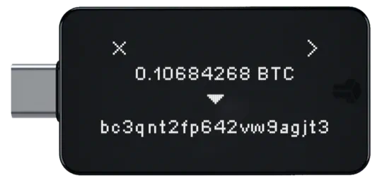

# bitbox02

Le BitBox02 est un portefeuille matériel suisse spécialement conçu pour sécuriser vos Bitcoins. Voici quelques-unes de ses principales caractéristiques :

- Sauvegarde et restauration faciles avec une carte microSD.
  Design minimaliste et discret.
  Prise en charge complète de Bitcoin.
  Sécurité de pointe conçue par des experts, avec une conception à double puce incluant une puce sécurisée.
  Code source entièrement audité par des chercheurs en sécurité et entièrement open source.
  Application BitBoxApp simple mais puissante, offrant une gestion sécurisée de vos Bitcoins.
  Prise en charge du plein nœud pour Bitcoin.
  Communication chiffrée de bout en bout entre l'application et le dispositif.

Fabriqué en Suisse, avec une réputation positive auprès des utilisateurs.

Le BitBox02 est le choix idéal pour sécuriser vos Bitcoins en toute confiance.

    Specifications

      - Connectivity: USB-C
      - Compatibility: Windows 7 and later, macOS 10.13 and later, Linux, Android
      - Input: Capacitive touch sensors
      - Microcontroller: ATSAMD51J20A; 120 Mhz 32-bit Cortex-M4F; True random number generator
      - Secure chip: ATECC608B; True random number generator (NIST SP 800-90A/B/C)
      - Display: 128 x 64 px white OLED
      - Material: Polycarbonate
      - Size: 54.5 x 25.4 x 9.6 mm including USB-C plug
      - Weight: Device 12g; with packaging and accessories 160g

      Download data sheets on their website https://bitbox.swiss/bitbox02/

## Tutoriel video

## Guide ecrie

d
