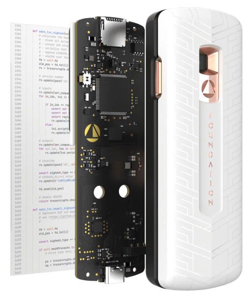

# Fondation

Key Specs

- Supported Cryptocurrencies Bitcoin via PSBTs (partially signed Bitcoin transactions); best-in-class multisig experience.
- Supported Software Wallets Bitcoin Core, BlueWallet, BTCPay, Casa, Electrum, Nunchuk, Simple Bitcoin Wallet, Sparrow, Specter, Wasabi, and other wallets supporting PSBTs via microSD or QR codes.
- Key Components STM processor, Microchip secure element, Omnivision Cameracube.
- Communication Camera and microSD port. No USB data, no Bluetooth, no wireless communications of any kind.
- Power User-removable 1200 mAh Lithium ion battery in Nokia BL-5C form factor (included with purchase).
- Security Features Airgapped, easy passphrase entry, security lights, anti-phishing words, security validation.

# tutoriel video

