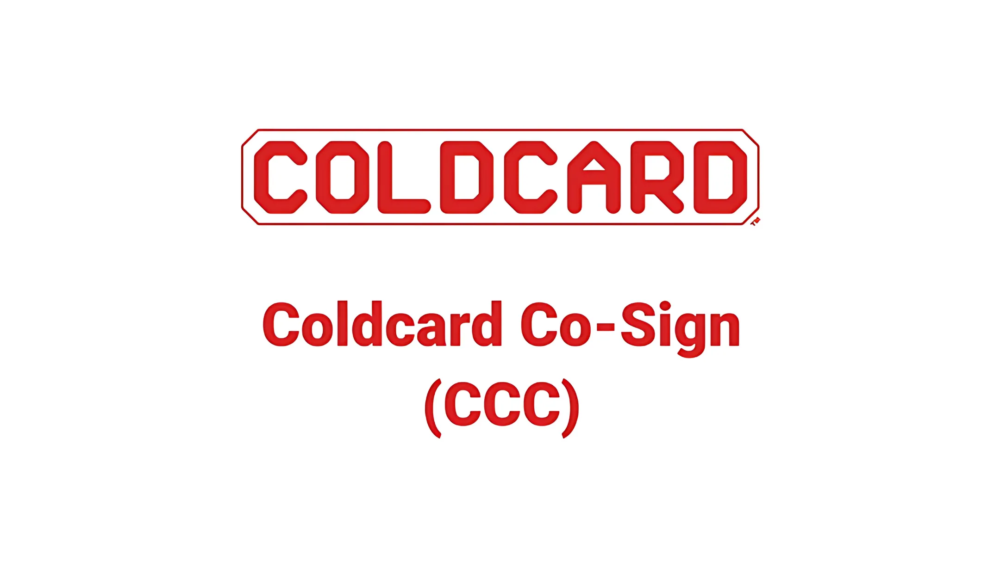

*注意：本教程针对已经对多重签名钱包、Coinkite 设备以及 Sparrow Wallet 或 Nunchuk.* 等软件有一定经验的用户。

**为什么要使用 Coldcard Co-Sign？**

该功能可让您以硬件安全模块（HSM）的方式在 ColdCard（Q 或 Mk4）设备上添加**支出条件**，以保护您的资金，同时保留相当大的灵活性和控制权。

例如，花费条件：

- **金额限制**：对单次交易中可花费的比特币金额设置上限。
- **交易速度限制：** 限制单位时间内（每小时、每天、每周等）可进行的交易数量，并要求每笔交易之间至少间隔一定数量的区块。
- **预授权地址：** 仅允许将比特币发送到预授权地址。
- **双因素认证：** 需要第三方 2FA 移动应用程序（TOTP [RFC 6238](https://www.rfc-editor.org/rfc/rfc6238)）在可上网的 NFC 智能手机/平板电脑上进行确认。

**工作原理**

通过在您的 ColdCard Mk4 或 Q 设备中添加第二个种子，称为 “Spending Policy Key”（在本教程中我们简称其为 “C Key”）。

除了这个额外密钥外，您还需要输入至少一个额外的密钥 (XPUB)，我们称之为 "Backup Key"，以便创建一个 2-of-N 密钥的多签名钱包。

简而言之，我们将创建一个多重签名钱包，您的 ColdCard 设备将包含两个用于支出资金的私钥：设备的种子主密钥和“消费策略密钥”。

每次请求 “C Key” 进行签名时，都会应用指定的消费条件，ColdCard 仅在交易符合这些条件时才会进行签名。

如果您希望免除这些消费条件，您可以：

- 使用其中一个备份密钥和种子密钥进行签名，或者根据您的多重签名钱包的大小使用两个备份密钥。
- 通过在 “Co-Sign” 选单中输入 “Spending Policy Key” 或 “C Key” 进行设置。后者无法直接在设备上查看，否则任何人都可以取消已配置的消费条件。

## 配置 Coldcard Co-Sign

### 1 - 激活功能

首先，确保您的设备至少有最新的固件版本：

- Mk4: v5.4.2
- Q：V1.3.2Q

在 Mk4 或 ColdCardQ 上，前往 *Advanced Tools > ColdCard Co-Signing*。

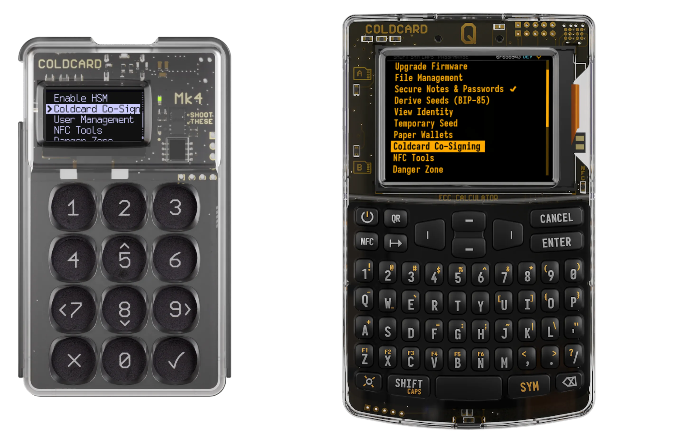

*在下面的教程中，为方便起见，将使用 ColdCardQ 进行截图，但 Mk4 和 Q* 的操作步骤和选单完全相同。

显示功能摘要。

在我们即将创建的 2-of-3 多重签名钱包中，我们将再次使用指定密钥的术语：

Key A = Coldcard 主种子

Key B = 备份密钥

Key C = 消费条件密钥

点击 **"ENTER"**。

下一步是决定哪个私钥作为 "Spending Policy Key" 或 "Key C"。

我们可以看到，我们有几种选择：

- 或按 **"ENTER"** 键，生成一个新的 12 个单词的主种子。

- 点击 **"(1)"** 导入现有的 12 个单词的种子，或选择 **"(2)"** 导入现有的 24 个单词的种子。

- 或按 **"(6)"**，从设备的保险库中导入种子。

在本教程中，我们决定按 **"(1)"** 键导入一个现有的 12 个单词种子。这可以是您已经拥有的任何 BIP39 种子，而且您显然有备份。

使用键盘输入助记词的 12 个单词。在本例中，我们选择有效的助记词短语 “beef x 12”。然后按 **"ENTER "**。

*注意：如果您没有备份该助记词，您将无法修改设备上的 "Co-Sign"设置，以更改您的消费条件*。

现在设备上的 "Co-Sign" 功能已激活。接下来，我们需要选择消费条件，然后完成多重签名钱包的创建。

### 2- 选择支出条件或 "*spending policies（支出政策）*"

在这里，我们指定了 **"C Key"** 或 **"Spending Policy Key**"签名交易时必须满足的支出条件。

在 **"Co-Signing"** 选单中，点击 **"Spending Policy"**。

然后，您可以选择最大值，即单笔交易可花费的最大聪（satoshi）数量。

在本例中，我们将选择最大幅值为 **21212** 聪。点击 **ENTER** 以确认。

然后，我们选择设置最大速度，即设备在单位时间内能够签名的交易数量。在本教程中，我们将选择无限速度，即不限制交易数量。

### 3- 创建 2-of-N 多签名钱包

除了设备的**主密钥**（Key A）和 **"Spending Policy Key"** （Key C）外，我们还需要为 多签名钱包选择第三个密钥，即 **"Backup Key"**（Key B）。

我们的 "Key B" 必须通过 SD 卡或 ColdCard Q 的二维码导入。

为此，我们需要第二个 ColdCard Mk4 或 Q 设备，在该设备上使用我们的 "Key B"。

在装有 **"Backup Key"**（例如 ColdCard Mk4）的第二个设备上，从主选单前往 **"Settings"**，然后前往 **"Multisig Wallet"** ，最后前往 **"Export Xpub"**。

(如果您的第二台设备是 ColdCard Q，您当然可以选择通过二维码导出 Xpub）。

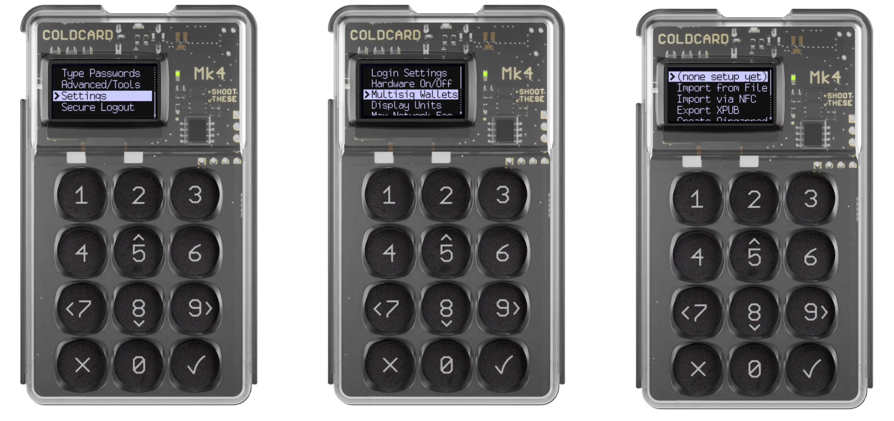

在下一个屏幕中，插入 SD 卡并点击右下角的 **"validate"** 按钮。然后点击 **"(1)"**，将文件保存到 SD 卡中。

文件名中将包含公钥指纹 (*fingerprint*)，格式为 `ccxp-0F056943.json`。

然后将 SD 卡插入 "初始" ColdCard Q，导入我们的 "Backup Key"（Key B）。

在 "ColdCard Co-Signing" 选单中选择 "Build 2-of-N"，然后在下一个屏幕中点击 **"ENTER"**，再点击 **"ENTER"**，从 SD 卡中导入 "Backup Key"。

在下一个屏幕上，将 "Account Number" 留空（（除非您非常清楚自己在做什么），然后再次点击 “ENTER”。

我们终于可以使用新的 2-of-3 多签名钱包，其组成如下：

Key A = Coldcard Q 主种子

Key B = 备份密钥（刚从第二个 Coldcard 设备导入）

Key C = 消费条件密钥（如果用于签名，则施加预定义的支出条件）

## 使用 Sparrow Wallet 进行 co-sign

如有必要，请参阅下面的教程以熟悉 Sparrow wallet 软件：

https://planb.academy/tutorials/wallet/desktop/sparrow-c674e2ac-d46f-4c82-92a7-7d1b0e262f5d

https://planb.academy/tutorials/wallet/desktop/sparrow-multisig-5860333b-6dd8-4aaa-8ab6-89ebc6276f1f

### 1- 导出 2-of-3 多签名钱包到 Sparrow Wallet 中

现在，我们需要将多签名钱包导出到 Sparrow，以便在那里发送第一笔比特币。

在 ColdCardQ 的主选单中选择 **"Settings"**，然后选择 **"Multisig Wallets"**。

现在将显示 ColdCard 已知的多签名钱包集，这里涉及的密钥数量为 "2/3"（2-of-3）。选择我们刚刚创建的多签名 **"ColdCard Co-Sign"**，然后点击 **"ColdCard Export"**。

最后，选择将钱包导出到 Sparrow Wallet 的方法。在本例中，我们选择 SD 卡，将 SD 卡插入设备的插槽 A 后，点击 **"(1)"**。

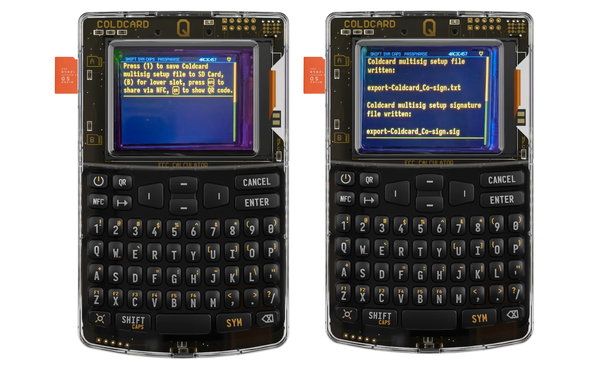

然后在 Sparrow wallet 中选择 "Import Wallet"。

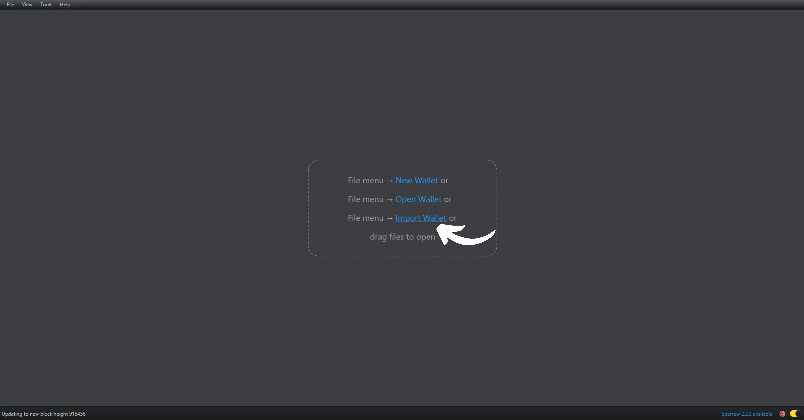

然后点击 **"Import File"**。然后选择 SD 卡上的文件 **"export-Coldcard_Co-sign.txt"**。

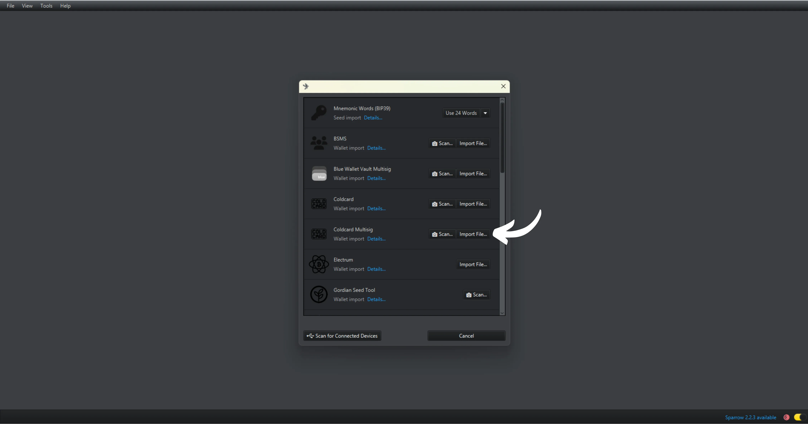

为您的钱包起一个在 Sparrow 上的显示名，并选择一个密码来加密您的钱包（可选）。

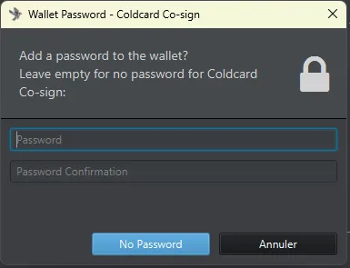

我们现在已经准备好接收第一笔比特币，并测试我们应用于钱包的支出条件。

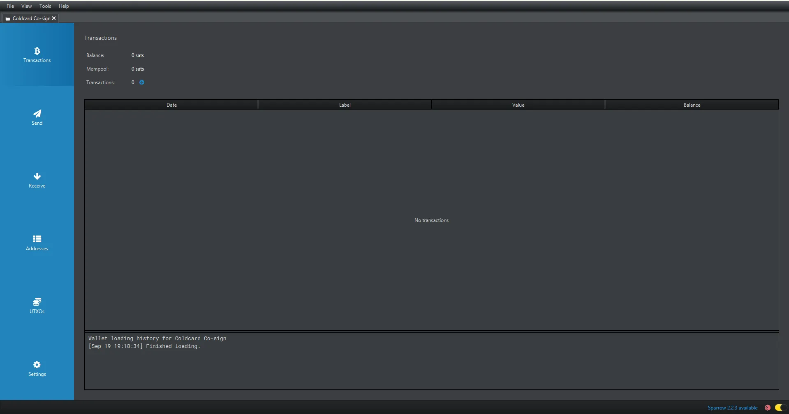

### 2- 测试预定义的支出条件

需要提醒的是，我们已经为多签名钱包确定了 21212 聪的最大值。这意味着，每次消费政策密钥（密钥 C）签署交易时，只有当消费金额小于或等于 21212 聪时，后者才有效。

让我们来测试一下。

首先，让我们点击 Sparrow 中的 "Receive" 选项卡，在 Wallet 中发送聪，我们将在本教程中一直使用它。

然后，让我们通过模拟 50,000 聪的交易，尝试花费超过 21212 聪。

使用 ColdCardQ 扫描代表未签名交易的二维码导入交易后，屏幕上会显示以下内容。一条警告信息提示我们消费条件未满足。如果我们仍然对交易进行签名，则只有两个密钥中的一个（设备上的种子主密钥，但不是 “Key C”）会进行签名。

在这里，将交易导入 Sparrow 后，我们可以看到只有一个签名应用到了交易中。

现在，让我们重复这个实验，但交易量为 21 000 聪，即小于我们为这个钱包设定的最大聪（21212 Sats）。

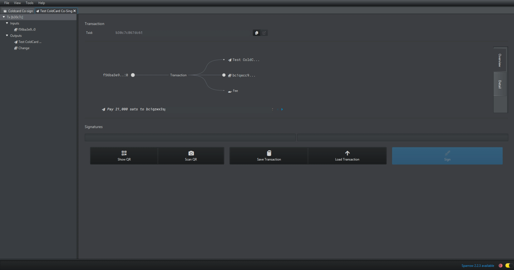

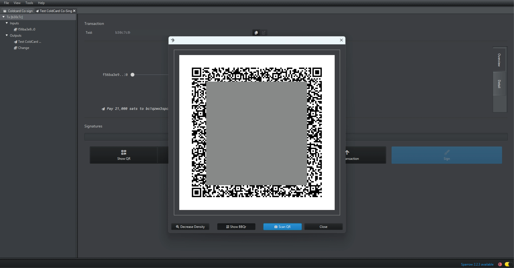

让我们试着用 ColdCardQ 签名这笔交易。

这次没有问题，没有出现任何警告信息，而且当我们将已签名的交易导入 Sparrow wallet 时，这次已经应用了 2 个签名，使交易有效并可以分发。

## 使用 Nunchuk 进行 Co-Sign

https://planb.academy/tutorials/wallet/mobile/nunchuk-6cbcb406-ec84-478f-afac-bb4da366a6fa

### 1- 网络 2FA 和白名单地址

在本段中，我们将使用 Nunchuk 与多签名钱包 Co-Sign，并借此机会应用新的消费条件，看看效果如何。

前往 *Advanced Tools > ColdCard Co-Signing*。

我们需要输入 "Spending Policy Key"，以便进入选单更改消费条件。在本例中，我们输入 12 x "beef"。

出于本教程的实际考虑，我们决定将聪数量级设置为 21212 聪，并设定最大“速度限制”。另一方面，我们将使用 “Whitelist Addresses” 选单来指定资金可以用于哪些地址

扫描您希望添加到白名单的地址（我们选择 2 个）的相关二维码，然后点击 **"ENTER"**。连续按 **"ENTER"** 键验证地址后，我们可以看到额度和收款地址的限制已生效。

最后，为了全面了解 “Co-Sign” 提供的各种可能性，让我们激活 “Web 2FA” 选项。

此功能可让您使用符合 TOTP RFC-6238 标准的应用程序，如 Google Authenticator / Ente Auth / Proton Authenticator / Authy 2FA / Aegis Authenticator，以增加额外的安全层面。

https://planb.academy/tutorials/computer-security/authentication/ente-auth-1928e65a-3b43-40f3-9efd-457ee2d79bb9

https://planb.academy/tutorials/computer-security/authentication/proton-authenticator-047ca2eb-a922-4e0e-8f75-1b89d23951ae

https://planb.academy/tutorials/computer-security/authentication/aegis-authenticator-22cc4d35-fb46-4e54-8833-bc4b411518bc

具体来说，在签名交易之前，您需要将您的 NFC 上网设备靠近您的 Coldcard。这将自动带您进入一个coldcard.com 网页，要求您输入您申请的 6 位数代码。如果您输入了正确的代码，网页上会显示一个二维码，您可以扫描以获取 ColdCardQ，或者在您的 Mk4 上输入一个 8 位数代码，授权您的设备签名。

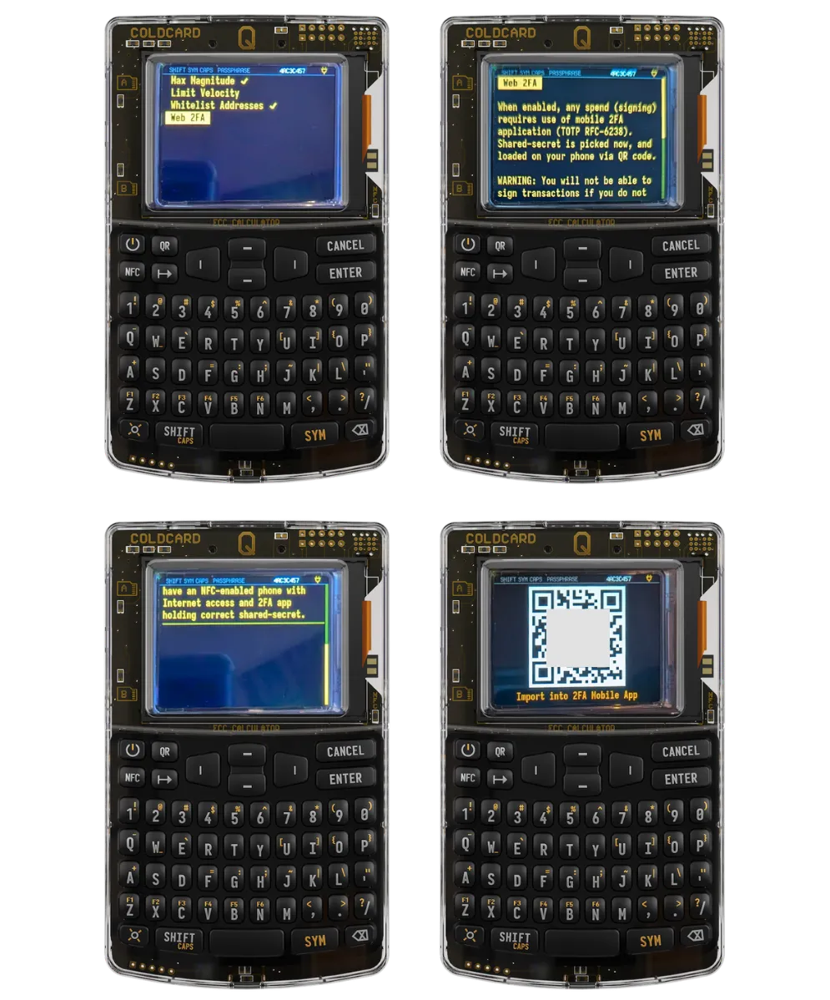

扫描双重认证应用程序中显示的二维码并添加 ColdCard Co-Sign (CCC) 账户后，系统会要求您输入 2FA 代码以验证一切正常。

在 NFC 设备背面输入您的 ColdCard。

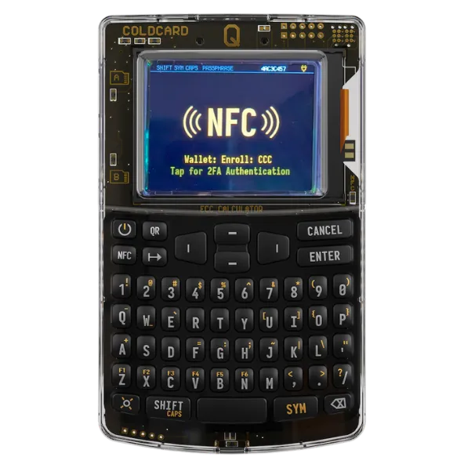

在打开的网页上，输入您最喜欢的应用程序的 2FA 代码。然后扫描 ColdCardQ 显示的 二维码（或输入 Mk4 显示的 8 位数代码）。

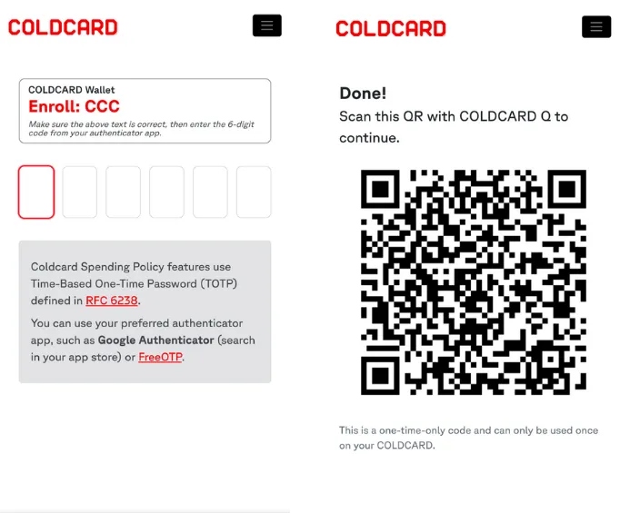

目前，我们已将额度规模设置为 21212 聪、并已设置好目标地址和双因素验证验证。

### 2- 将 2-of-3 多签名钱包导出到 Nunchuk

这次让我们把 2-of-3 多签名钱包输出到 Nunchuk 中，就像前面输出 Sparrow 步骤一样。

前往 *Settings > Multisig Wallets > 2/3: ColdCard Co-sign > ColdCard Export.*。

这一次，点击同名的 ColdcardQ 按钮 **"NFC"**，选择 NFC 导出选项。

在 Nunchuk 中，如果您是第一次打开应用程序，请点击 **"Recover existing wallet"**。

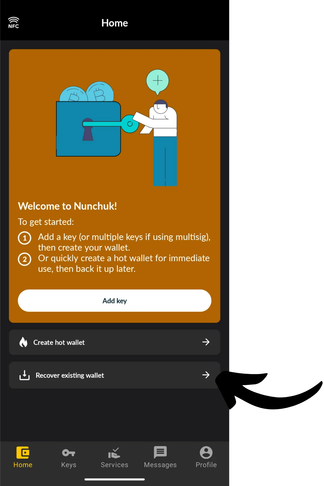

如果应用程序中已有钱包，请点击右上角的 **"+"** 按钮，然后点击 **"Recover existing wallet"**。

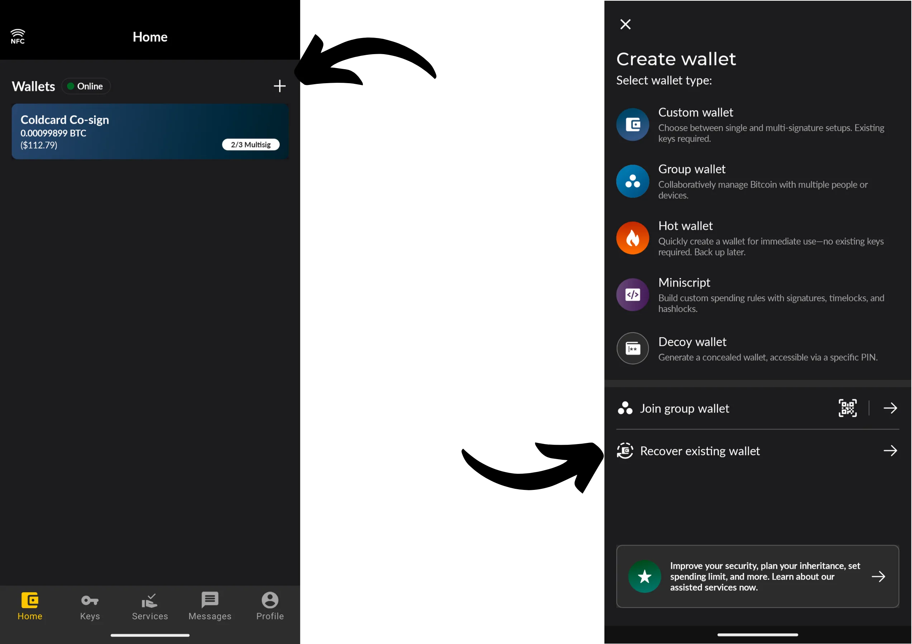

然后选择 **"Recover Wallet from COLDCARD"**，再选择 **"Multisig wallet"**。

最后，将智能手机背面轻触 ColdCardQ 的屏幕，即可通过 NFC 导入钱包。

我们的账户和之前通过 Sparrow Wallet 存入的聪（比特币）又回来了。

### 3- 测试预定义的支出条件

现在我们来尝试进行一笔违反我们设定的两个消费条件的交易。我们将尝试向一个未经批准的地址花费超过 21212 聪的金额。我们再尝试向一个随机地址发送 22222 聪。

创建交易后，点击右上角的 3 个小圆点，将其导出到您的 ColdCard 中。

然后选择 **"Export via BBQR"**，并扫描 ColdCardQ 显示的二维码。

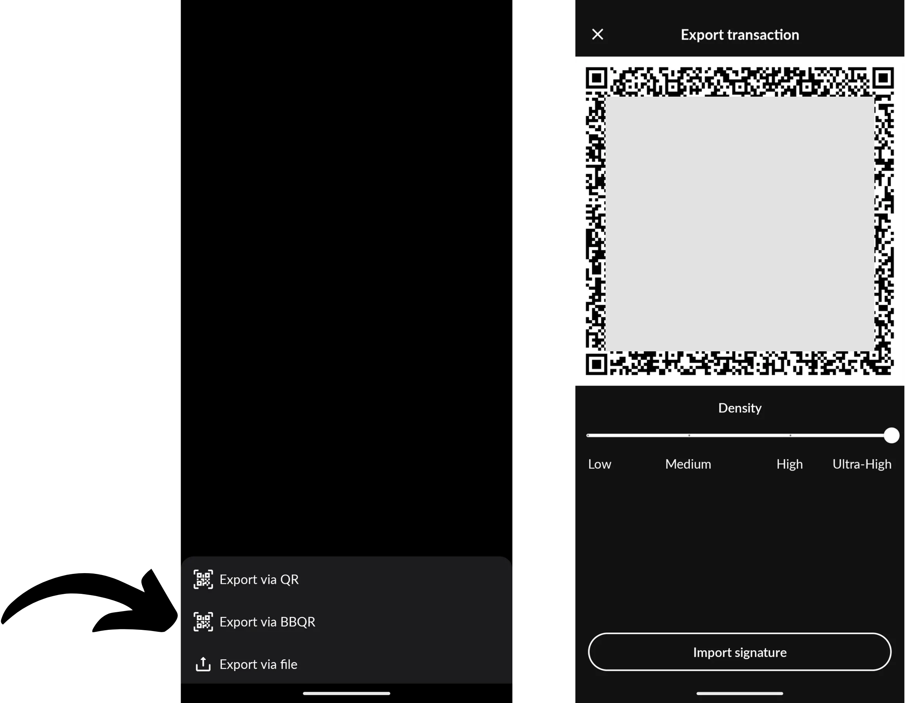

然后，ColdcardQ 会显示一个警告，当你滚动到屏幕底部时，就会发现这笔交易违反了消费条件。

**请注意，该设备不会告诉我们涉及哪些消费条件，以防止潜在的攻击者试图绕过限制。**

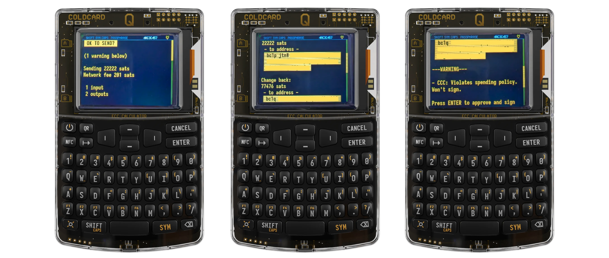

如果您按 **"ENTER"** 键进行验证，则会出现代表已签名交易的二维码。如果在 Nunchuk 上导入，可以看到只应用了一个签名。

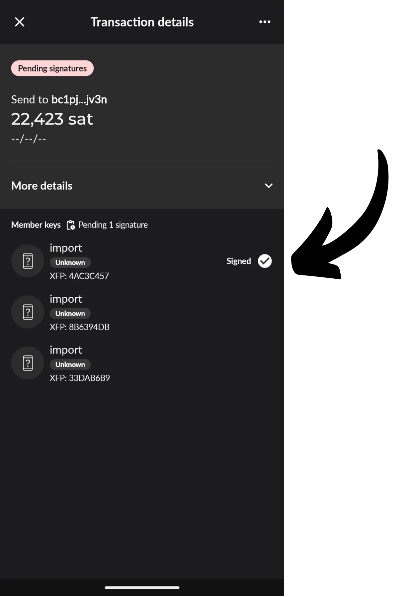

让我们执行完全相同的操作，但这次交易要遵守量级限制（21212 聪），并将聪发送到我们预先配置的 2 个地址之一。

我们在 Nunchuk 上将 12121 聪发送到我们的 2 个地址之一。然后，我们按照之前的方法将交易导出到 ColdCard。

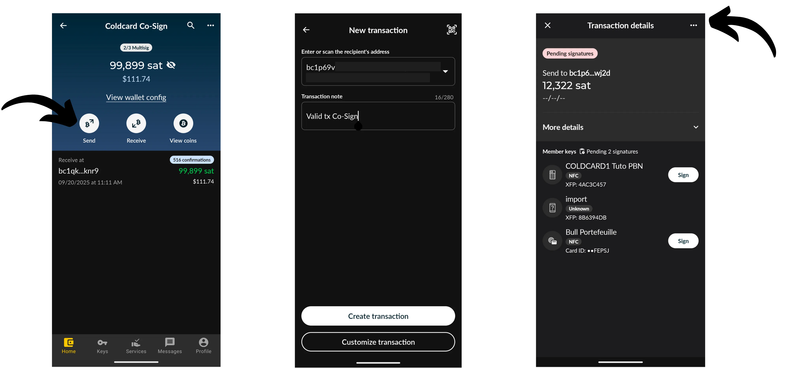

将未签名交易导入 ColdCardQ 后，让我们看看这次会显示什么。

警告信息始终存在，但这次，滚动到屏幕底部，我们发现需要通过双因素身份验证 (2FA) 来验证交易。设备要求我们将 ColdcardQ 靠近已连接互联网的 NFC 终端（智能手机或平板电脑），我们照做了。

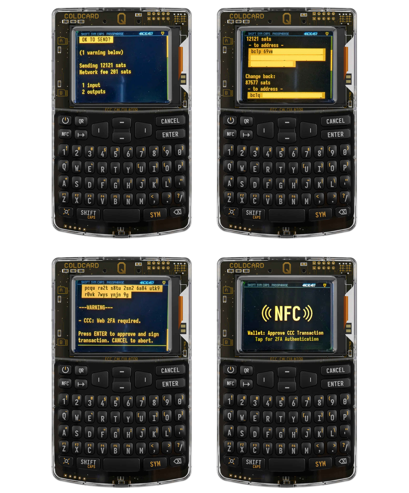

智能手机上会打开一个网页，要求我们输入 2FA 验证码，多亏了 Proton Authenticator，我们输入了验证码。

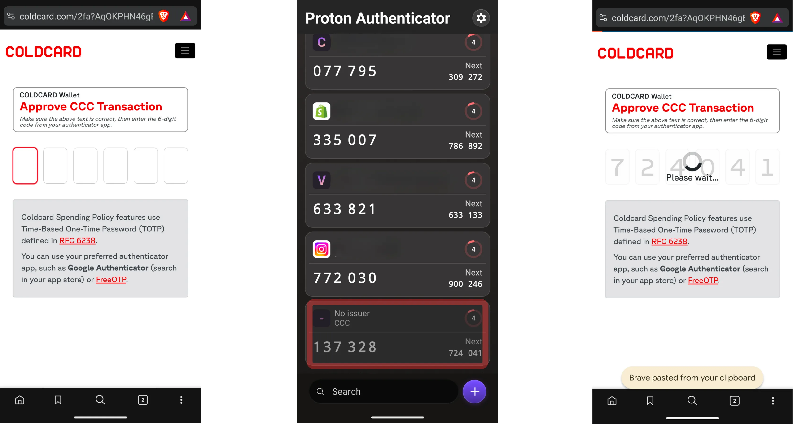

然后扫描网页上出现的二维码，授权 ColdCard 签名交易。

现在，交易已由两个密钥签名，因此有效。

如果 ColdCardQ 启用了 "Push Tx" 功能，您只需在智能手机背面轻轻一点，就可以直接向网络广播交易。

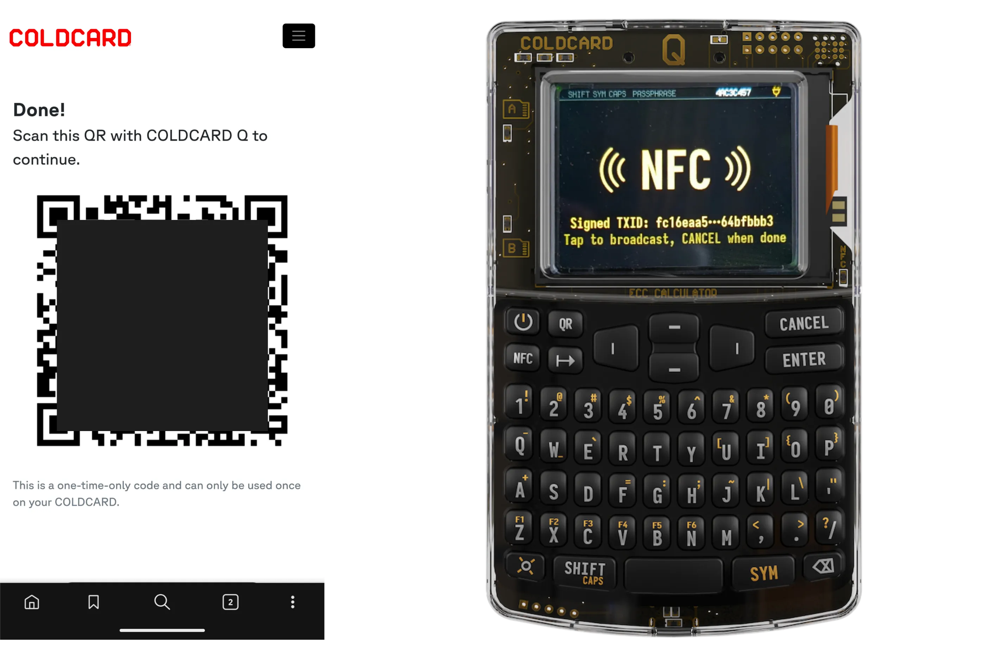

如果您没有激活 "Push tx"，请按下 ColdCardQ 上的 "QR" 按钮，将已签署的交易显示为二维码，然后将其导入 Nunchuk，方法与上例相同。

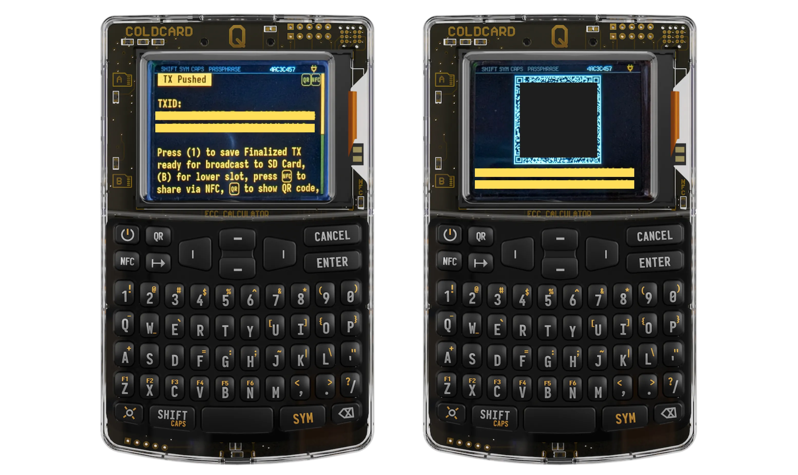

这次我们注意到已经应用了 2 个签名，因此该交易已准备好在比特币网络上广播。

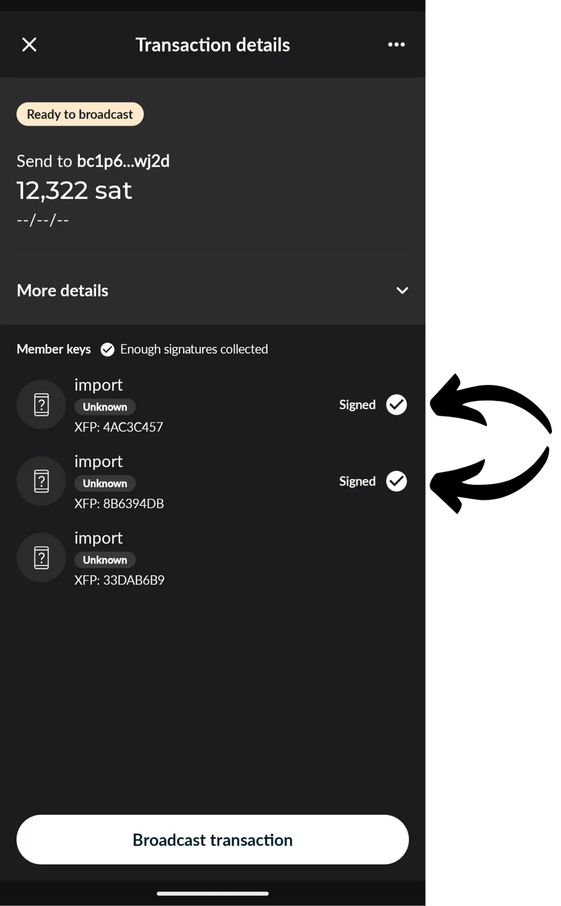

本教程到此结束，它将为您概述 Coinkite 的 ColdCardQ 和 Mk4 设备中集成的 Co-Sign 功能所提供的各种可能性，以及如何通过 Sparrow 和 Nunchuk 等钱包使用该功能。
