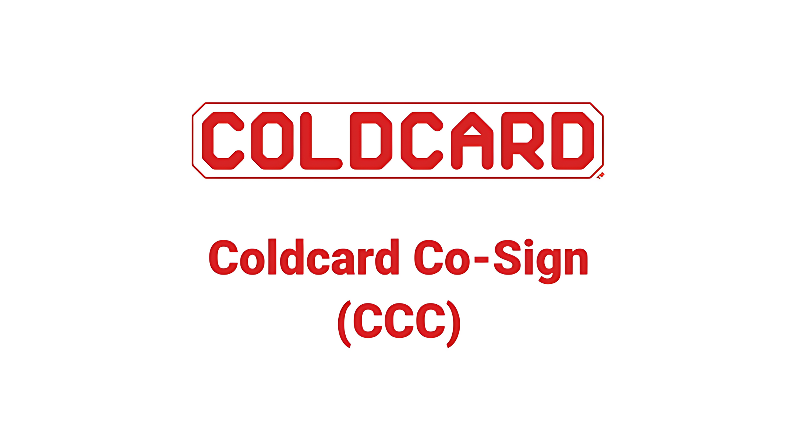

https://youtu.be/MjMPDUWWegw

A quoi sert ColdCard Co-Sign ?

Cette fonctionnalité permet d'ajouter des **conditions de dépenses** à votre appareil à la manière d'un Hardware Security Module (HSM), pour protéger vos fonds tout en gardant une bonne flexibilité et un contrôle appréciable sur ceux-ci.

Les conditions de dépenses peuvent être par exemple:

- **Des limites sur la magnitude**: plafonnez la quantité de Bitcoin que vous pouvez dépenser en une seule transaction.
- **Des limites de vélocité:** décidez le nombre de transactions que vous pouvez réaliser par unité de temps (par heure /jour/semaine etc...), en exigeant un nombre minimal de blocs entre elles.
- **Des adresses pré-autorisées:** Ne permettez d'envoyer vos Bitcoins que vers des adresses préalablement approuvées.
- **Authentification à deux facteur:** Demande une confirmation de la part d'une application mobile tierce 2FA (TOTP [RFC 6238](https://www.rfc-editor.org/rfc/rfc6238))  sur une téléphone NFC avec accès internet.

Comment cela fonctionne ?

En ajoutant une seconde seed à votre appareil ColdCard Mk4 ou Q, appelée "Spending Policy Key", que nous nommerons tout au long de ce tutoriel "Clé C".
En plus de cette seed additionnelle, il vous sera demandé de fournir au moins une clé additionnelle (XPUB) que nous appellerons "Clé de backup" ou **"backup key"**, afin de créer au final un wallet multisig  2-sur-N.

En synthèse nous allons créer un wallet multisig, et votre appareil ColdCard contiendra 2 des clées privées nécessaires pour dépenser les fonds, la master seed de l'appareil et la "Spending Policy Key".
Comme la "Clé C" est sollicitée à chaque fois pour signer, alors les conditions de dépenses spécifiées s'appliqueront, et le ColdCard ne signera que si la transaction les respecte.

Si vous souhaitez vous affranchir de ces conditions de dépense, vous pouvez le faire:
- en signant avec l'une des clés de backup et la main seed, ou 2 clés de backups suivant la taille de votre multisig.
- en renseignant la "Spending Policy Key" ou "Clé C". **Cette dernière n'est donc pas consultable directement sur l'appareil, autrement n'importe qui pourrait annuler les conditions de dépenses configurées.**

## Configurer ColdCard Co-Sign

https://youtu.be/MjMPDUWWegw

### Activer la fonctionnalité

Premièrement veillez à ce que le firmware de votre appareil soit au moins en version:
- Mk4: v 5.4.2
- Q: 1.3.2Q

Sur votre Mk4 ou votre ColdCardQ, allez dans *Avanced Tools > ColdCard Co-Signing*.

Dans le tutoriel qui va suivre les captures d'écran seront réalisées sur un ColdCardQ pour plus de praticité, mais les étapes et menus sont identiques entre le Mk4 et le Q.

Un récapitulatif de la fonctionnalité vous est proposé.
La terminologie permettant de désigner les clés, que nous reprendrons est dans le cadre du wallet multi-signature 2-sur-3 que nous nous apprêtons à créer est:

A= Coldcard master seed
B= Backup Key
C= Spending Policy Key

Cliquez sur **"ENTER"**.

L'étape suivante consistera à décider quelle clé privée fera office de "Spending Policy Key" ou "Clé C".
On peut voir que plusieurs options s'offrent à nous.
Soit presser **"ENTER"** pour générer une nouvelle seed phrase de 12 mots.
Soit cliquer sur **"(1)"** pour importer une seed de 12 mots existantes, soit choisir **"(2)"** pour importer une seed de 24 mots existante.
Ou encore en appuyant sur **"(6)"** d'importer une seed présente dans le vault de votre appareil.

En ce qui nous concerne, on décide pour ce tutoriel d'importer une seed de 12 mots existante en pressant **"(1)"**. Cela peut-être n'importe quelle seed BIP39 que vous avez déjà en votre possession et pour laquelle vous posséder évidemment un backup.

Utilisez votre clavier pour entrer les 12 mots de votre seed. Nous choisissons pour cet exemple la seed phrase valide beef x 12. Puis on appuie sur **"ENTER"**.
*NB: si vous n'avez pas le backup de cette seed, vous ne serez plus en mesure de modifier les paramètres "Co-Sign" de votre appareil, afin de modifier vos conditions de dépenses.*

La fonctionnalité "Co-Sign" est désormais activée sur l'appareil. Il va nous falloir ensuite choisir nos conditions de dépense, puis compléter la création du wallet multisignature.

### Choisir les conditions de dépenses ou "spending policies"

Ici nous allons spécifier les conditions de dépense qui devront être respectées lorsque la **"Clé C"** ou **"Spending Policy Key**" signera une transaction.
Dans le menu **"Co-Signing"** cliquez sur **"Spending Policy**". 
Vous pouvez alors choisir la magnitude maximale, c'est à dire le nombre de satoshis maximum qui pourront être dépensés en une transactions.

Nous choisirons ici pour cet exemple une magnitude maximale de **21212** satoshis. On valide le tout en cliquant sur **"ENTER"**.

Nous choisissons ensuite de régler la vélocité maximale, c'est à dire le nombre de transactions que l'appareil sera en mesure de signer par unité de temps. Ici pour ce tutoriel on choisira une vélocité illimitée, donc sans limite sur le nombre de transactions.

### Créer le wallet multisig 2-sur-N

Il nous reste à choisir la troisième clé de notre wallet multisig c'est à dire la **"backup Key"** (Clé B), en plus de la **master seed** de l'appareil (Clé A) et de la **"Spending Policy Key"** (Clé C).

Notre "Clé B" devra être importée soit via carte SD soit via QR code dans le cas du ColdCardQ.
Pour ce faire nous aurons besoin d'un second appareil ColdCard Mk4 ou Q, sur lequel notre "Clé B" est utilisée. 

Sur ce second appareil contenant votre **"backup key"**, disons un ColdCard Mk4 pour cet exemple, allez depuis le menu principal dans **"Settings"**, puis, **"Multisig Wallet"**, et enfin **"Export Xpub"**.
(Si votre second appareil est un ColdCardQ vous aurez la possibilié de choisir d'exporter votre Xpub via QR code évidemment).

Sur l'écran suivant insérez une carde SD et cliquez sur le bouton **"valider"** en bas à droite. Puis sur **"(1)"** pour sauvegarder le fichier sur la carte SD.
Le fichier contiendra l'empreinte digitale la clé publique (fingerprint) dans son nom, et sera de la forme `ccxp-0F056943.json`.

Insérez ensuite la carte SD dans le ColdCardQ "initial" afin d'y importer notre "backup key" (clé B).
Dans le menu "ColdCard Co-Signing" choisissez "Build 2-of-N", puis sur l'écran suivant cliquer sur **"ENTER"**, puis de nouveau **"ENTER"** pour importer la "backup key" depuis la carte SD.

Sur l'écran suivant, ne renseignez pas de "Account Number" (à moins que vous sachiez exactement ce que vous faites) et cliquez là encore sur **"ENTER"**.

Enfin nous voilà parés pour utiliser notre nouveau wallet multisig 2-sur-3 composé pour rappel de:

Clé A= Coldcard Q master seed
CléB= Backup Key (qu'on vient d'importer depuis un second appareil Coldcard)
Clé C= Spending Policy Key (qui si elle est utilisée pour signer, impose les conditions de dépense prédéfinie)

### Exporter le wallet multisig 2-sur-3 vers Sparrow Wallet 

Il nous faut maintenant exporter notre wallet multisig vers Sparrow afin de pouvoir y déposer nos premiers satoshis.

Pour cela
