https://youtu.be/MjMPDUWWegw

*Ce tutoriel s'adresse à des personnes ayant déjà un peu d'expérience avec les wallet multisignatures et des logiciels comme Sparrow Wallet ou Nunchuk.*

**A quoi sert ColdCard Co-Sign ?**

Cette fonctionnalité permet d'ajouter des **conditions de dépenses** à votre appareil à la manière d'un Hardware Security Module (HSM), pour protéger vos fonds tout en gardant une bonne flexibilité et un contrôle appréciable sur ceux-ci.

Les conditions de dépenses peuvent être par exemple:

- **Des limites sur la magnitude**: plafonnez la quantité de Bitcoin que vous pouvez dépenser en une seule transaction.
- **Des limites de vélocité:** décidez le nombre de transactions que vous pouvez réaliser par unité de temps (par heure /jour/semaine etc...), en exigeant un nombre minimal de blocs entre elles.
- **Des adresses pré-autorisées:** Ne permettez d'envoyer vos Bitcoins que vers des adresses préalablement approuvées.
- **Authentification à deux facteur:** Demande une confirmation de la part d'une application mobile tierce 2FA (TOTP [RFC 6238](https://www.rfc-editor.org/rfc/rfc6238))  sur une téléphone NFC avec accès internet.

Comment cela fonctionne ?

En ajoutant une seconde seed à votre appareil ColdCard Mk4 ou Q, appelée "Spending Policy Key", que nous nommerons tout au long de ce tutoriel "Clé C".
En plus de cette seed additionnelle, il vous sera demandé de fournir au moins une clé additionnelle (XPUB) que nous appellerons "Clé de backup" ou **"backup key"**, afin de créer au final un wallet multisig  2-sur-N.

En synthèse nous allons créer un wallet multisig, et votre appareil ColdCard contiendra 2 des clées privées nécessaires pour dépenser les fonds, la master seed de l'appareil et la "Spending Policy Key".
Comme la "Clé C" est sollicitée à chaque fois pour signer, alors les conditions de dépenses spécifiées s'appliqueront, et le ColdCard ne signera que si la transaction les respecte.

Si vous souhaitez vous affranchir de ces conditions de dépense, vous pouvez le faire:
- en signant avec l'une des clés de backup et la main seed, ou 2 clés de backups suivant la taille de votre multisig.
- en renseignant la "Spending Policy Key" ou "Clé C". **Cette dernière n'est donc pas consultable directement sur l'appareil, autrement n'importe qui pourrait annuler les conditions de dépenses configurées.**

## Configurer ColdCard Co-Sign

https://youtu.be/MjMPDUWWegw

### Activer la fonctionnalité

Premièrement veillez à ce que le firmware de votre appareil soit au moins en version:
- Mk4: v 5.4.2
- Q: 1.3.2Q

Sur votre Mk4 ou votre ColdCardQ, allez dans *Avanced Tools > ColdCard Co-Signing*.

Dans le tutoriel qui va suivre les captures d'écran seront réalisées sur un ColdCardQ pour plus de praticité, mais les étapes et menus sont identiques entre le Mk4 et le Q.

Un récapitulatif de la fonctionnalité vous est proposé.
La terminologie permettant de désigner les clés, que nous reprendrons est dans le cadre du wallet multi-signature 2-sur-3 que nous nous apprêtons à créer est:

A= Coldcard master seed
B= Backup Key
C= Spending Policy Key

Cliquez sur **"ENTER"**.

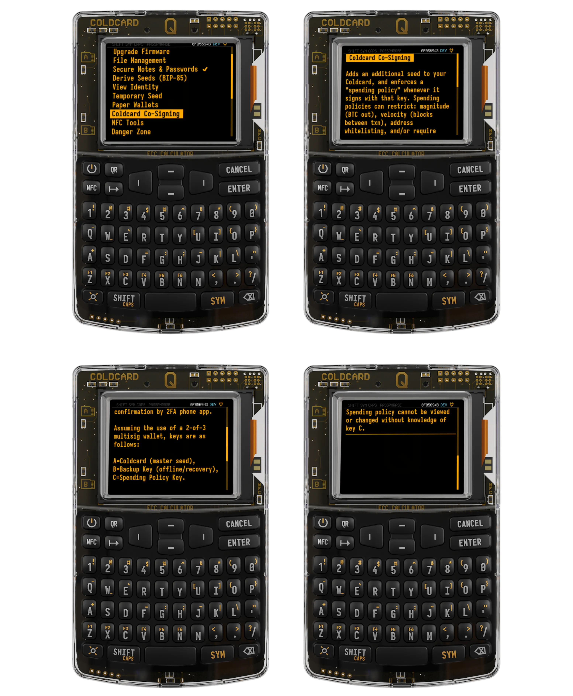

L'étape suivante consistera à décider quelle clé privée fera office de "Spending Policy Key" ou "Clé C".
On peut voir que plusieurs options s'offrent à nous.
Soit presser **"ENTER"** pour générer une nouvelle seed phrase de 12 mots.
Soit cliquer sur **"(1)"** pour importer une seed de 12 mots existantes, soit choisir **"(2)"** pour importer une seed de 24 mots existante.
Ou encore en appuyant sur **"(6)"** d'importer une seed présente dans le vault de votre appareil.

En ce qui nous concerne, on décide pour ce tutoriel d'importer une seed de 12 mots existante en pressant **"(1)"**. Cela peut-être n'importe quelle seed BIP39 que vous avez déjà en votre possession et pour laquelle vous posséder évidemment un backup.

Utilisez votre clavier pour entrer les 12 mots de votre seed. Nous choisissons pour cet exemple la seed phrase valide beef x 12. Puis on appuie sur **"ENTER"**.
*NB: si vous n'avez pas le backup de cette seed, vous ne serez plus en mesure de modifier les paramètres "Co-Sign" de votre appareil, afin de modifier vos conditions de dépenses.*

La fonctionnalité "Co-Sign" est désormais activée sur l'appareil. Il va nous falloir ensuite choisir nos conditions de dépense, puis compléter la création du wallet multisignature.

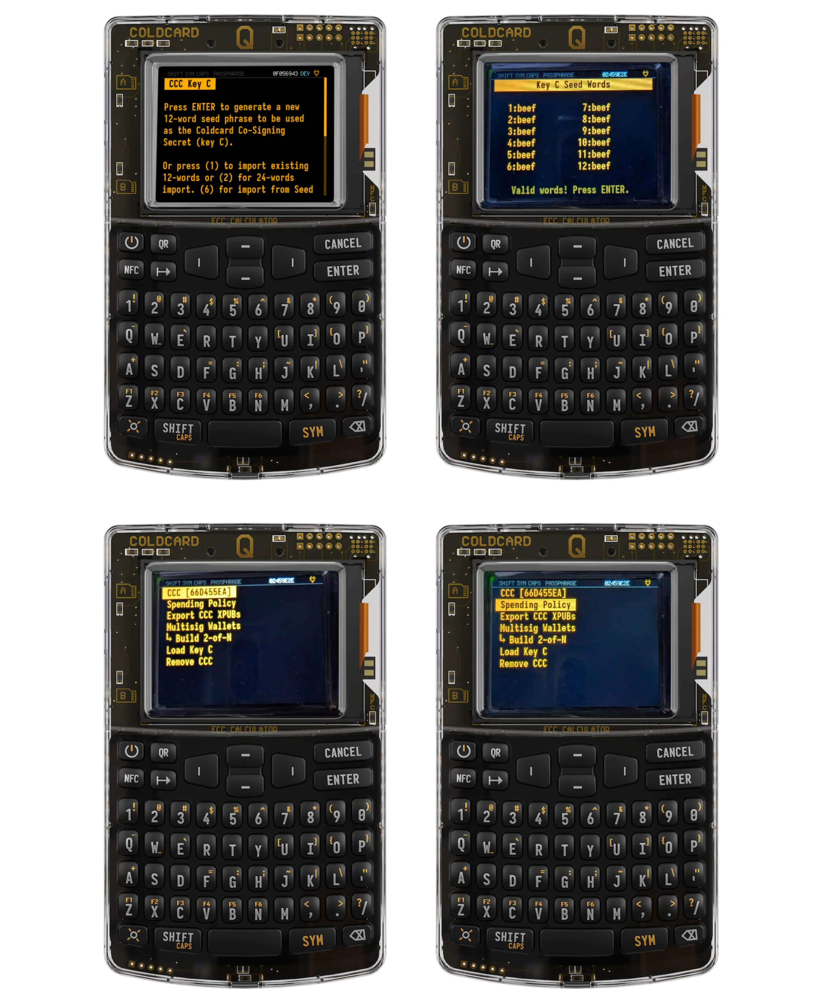

### Choisir les conditions de dépenses ou "spending policies"

Ici nous allons spécifier les conditions de dépense qui devront être respectées lorsque la **"Clé C"** ou **"Spending Policy Key**" signera une transaction.
Dans le menu **"Co-Signing"** cliquez sur **"Spending Policy**". 
Vous pouvez alors choisir la magnitude maximale, c'est à dire le nombre de satoshis maximum qui pourront être dépensés en une transactions.

Nous choisirons ici pour cet exemple une magnitude maximale de **21212** satoshis. On valide le tout en cliquant sur **"ENTER"**.

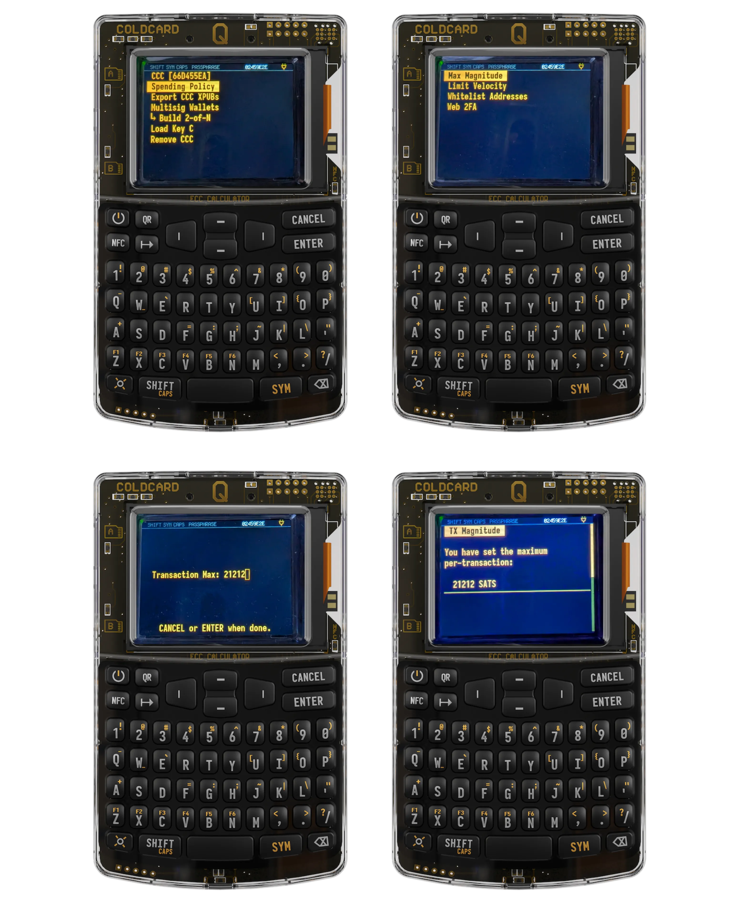

Nous choisissons ensuite de régler la vélocité maximale, c'est à dire le nombre de transactions que l'appareil sera en mesure de signer par unité de temps. Ici pour ce tutoriel on choisira une vélocité illimitée, donc sans limite sur le nombre de transactions.

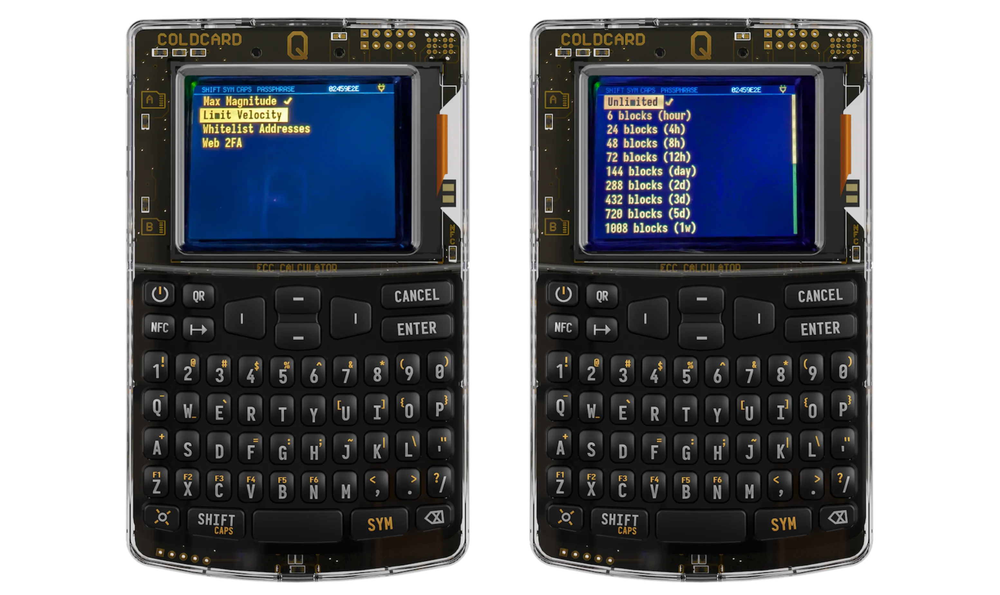

### Créer le wallet multisig 2-sur-N

Il nous reste à choisir la troisième clé de notre wallet multisig c'est à dire la **"backup Key"** (Clé B), en plus de la **master seed** de l'appareil (Clé A) et de la **"Spending Policy Key"** (Clé C).

Notre "Clé B" devra être importée soit via carte SD soit via QR code dans le cas du ColdCardQ.
Pour ce faire nous aurons besoin d'un second appareil ColdCard Mk4 ou Q, sur lequel notre "Clé B" est utilisée. 

Sur ce second appareil contenant votre **"backup key"**, disons un ColdCard Mk4 pour cet exemple, allez depuis le menu principal dans **"Settings"**, puis, **"Multisig Wallet"**, et enfin **"Export Xpub"**.
(Si votre second appareil est un ColdCardQ vous aurez la possibilié de choisir d'exporter votre Xpub via QR code évidemment).

Sur l'écran suivant insérez une carde SD et cliquez sur le bouton **"valider"** en bas à droite. Puis sur **"(1)"** pour sauvegarder le fichier sur la carte SD.
Le fichier contiendra l'empreinte digitale la clé publique (fingerprint) dans son nom, et sera de la forme `ccxp-0F056943.json`.

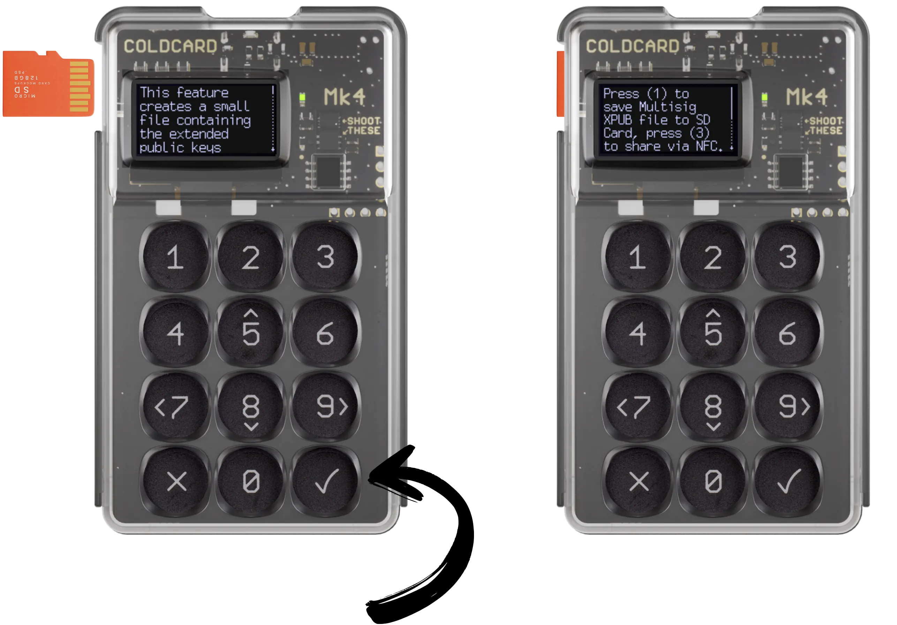

Insérez ensuite la carte SD dans le ColdCardQ "initial" afin d'y importer notre "backup key" (clé B).
Dans le menu "ColdCard Co-Signing" choisissez "Build 2-of-N", puis sur l'écran suivant cliquer sur **"ENTER"**, puis de nouveau **"ENTER"** pour importer la "backup key" depuis la carte SD.

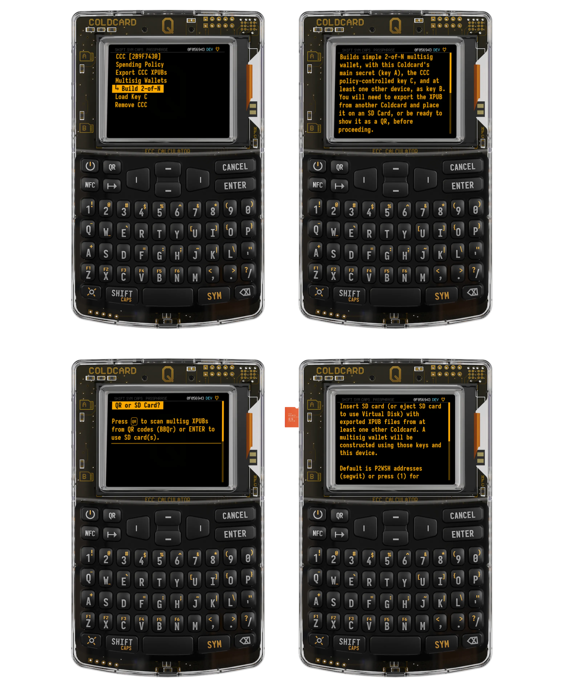

Sur l'écran suivant, ne renseignez pas de "Account Number" (à moins que vous sachiez exactement ce que vous faites) et cliquez là encore sur **"ENTER"**.

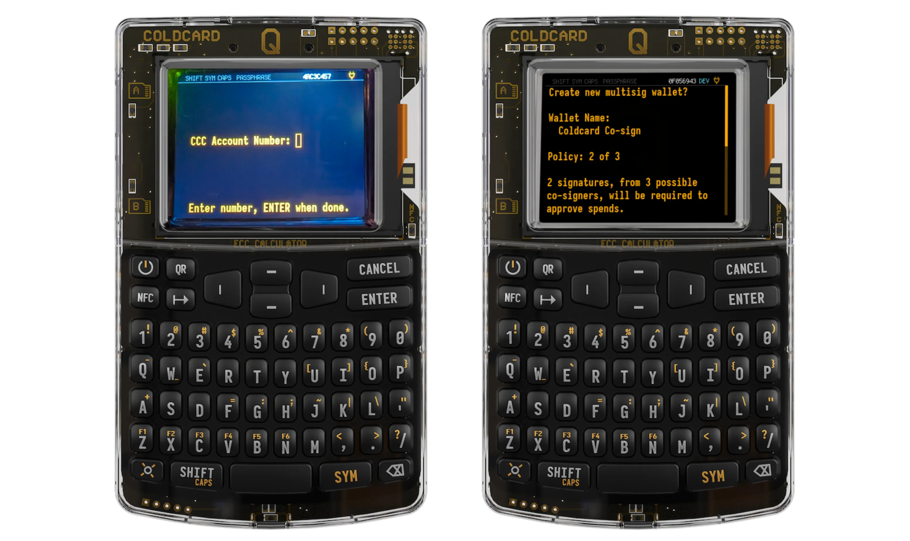

Enfin nous voilà parés pour utiliser notre nouveau wallet multisig 2-sur-3 composé pour rappel de:

Clé A= Coldcard Q master seed
Clé B= Backup Key (qu'on vient d'importer depuis un second appareil Coldcard)
Clé C= Spending Policy Key (qui si elle est utilisée pour signer, impose les conditions de dépense prédéfinie)

## Exporter le wallet multisig 2-sur-3 vers Sparrow Wallet 

Il nous faut maintenant exporter notre wallet multisig vers Sparrow afin de pouvoir y déposer nos premiers satoshis.

Pour cela depuis le menu principal de votre ColdCardQ choisissez **"Settings"**, puis **"Multisig Wallets"**. 
L'ensemble des wallets multisigs connus par votre ColdCard est désormais affiché avec ne nombre de clé impliquées ici "2/3" (2-sur3). Choisissez donc le multisig **"ColdCard Co-Sign"** qu'on vient de créer puis cliquez sur **"ColdCard Export"**.

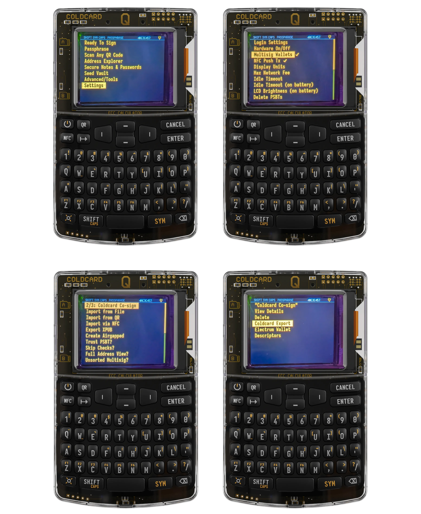

Enfin choisissez la méthode qui vous permettra d'exporter le wallet sur Sparrow. Dans notre cas nous choisirons la carte SD et donc cliquerons sur **"(1)"** après avoir insérer une carte SD dans le slot A de l'appareil.

Ensuite dans Sparrow Wallet, sélectionnez "Import Wallet".

Puis sur **"Import File"**. Choisissez ensuite le fichier **"export-Coldcard_Co-sign.txt"** sur votre carte SD.

Donnez un nom à votre wallet tel qu'il apparaitra dans Sparrow, et choisissez un mot de passe pour chiffrer votre wallet (ou pas).

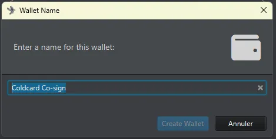

Nous voilà parés pour recevoir nos premiers satoshis et tester les conditions de dépenses que nous avons appliqué à notre wallet.

### Test des conditions de dépenses (spending policies) prédéfinies

Pour rappel nous avions décidé une magnitude maximum de 21212 satoshis pour notre wallet. C'est à dire qu'à chaque fois que la "Spending Policiy Key" (Key C) signerait un transaction  alors cette dernière ne serait valide que si le montant dépensé est inférieur ou égal à 21212.

Allons tester ça. Tout d'abord cliquons sur l'onglet "Receive" dans Sparrow et déposons quelques sats sur le wallet, qui nous serviront tout au long de ce tutoriel.

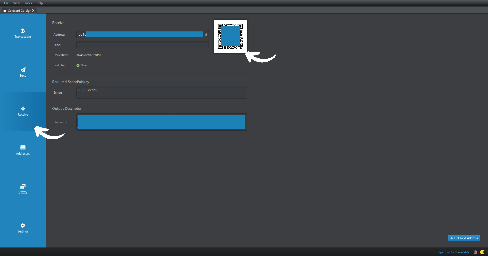

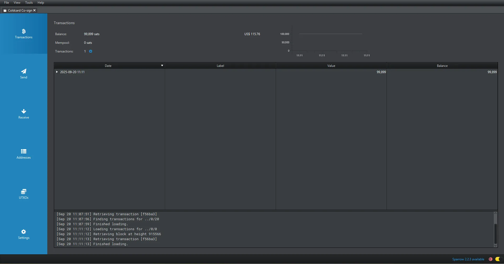

Puis essayons de dépenser davantage que les 21212 satoshis autorisés en simulant une transaction de 50000 sats.

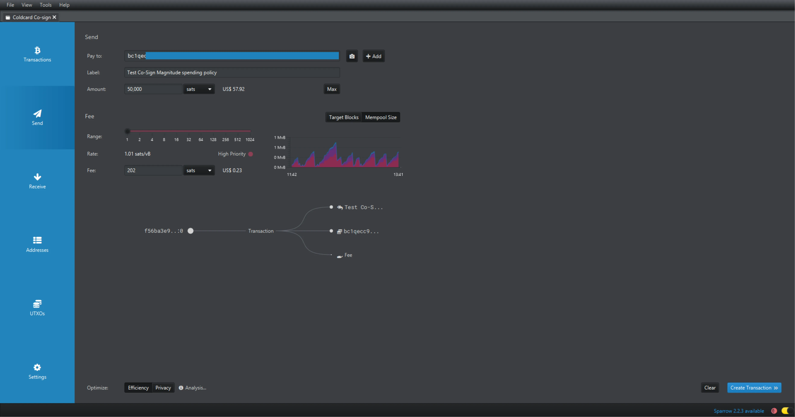

Après avoir scanné le QR code avec notre ColdCardQ pour importer la transaction voilà ce qui nous est indiqué à l'écran. Un message d'avertissement nous indique que les conditions dépenses ne sont pas respectées. Si on signe la transaction quand même, alors seule une des 2 clés (la master seed de l'appareil) signera.

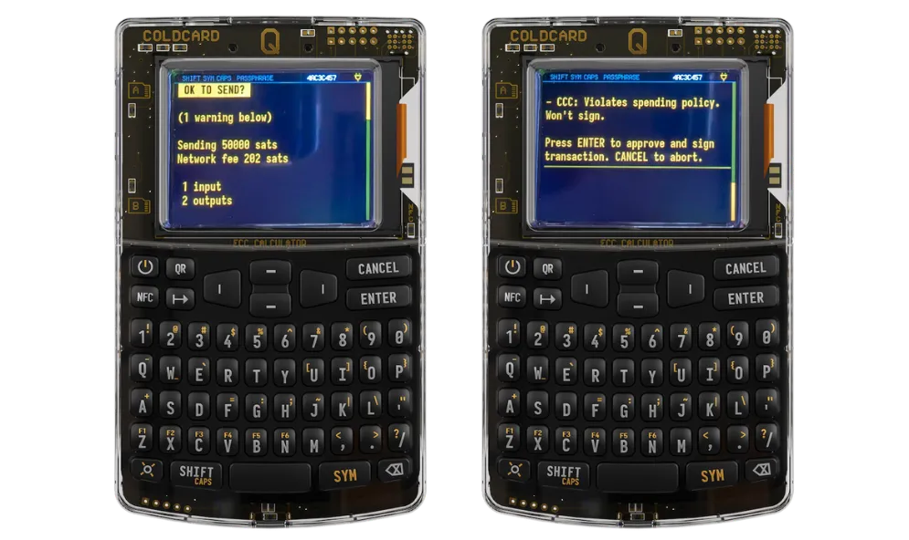

Effectivement on voit ici après avoir importé notre transaction dans Sparrow qu'une seule des signature a été appliquée à la transaction.

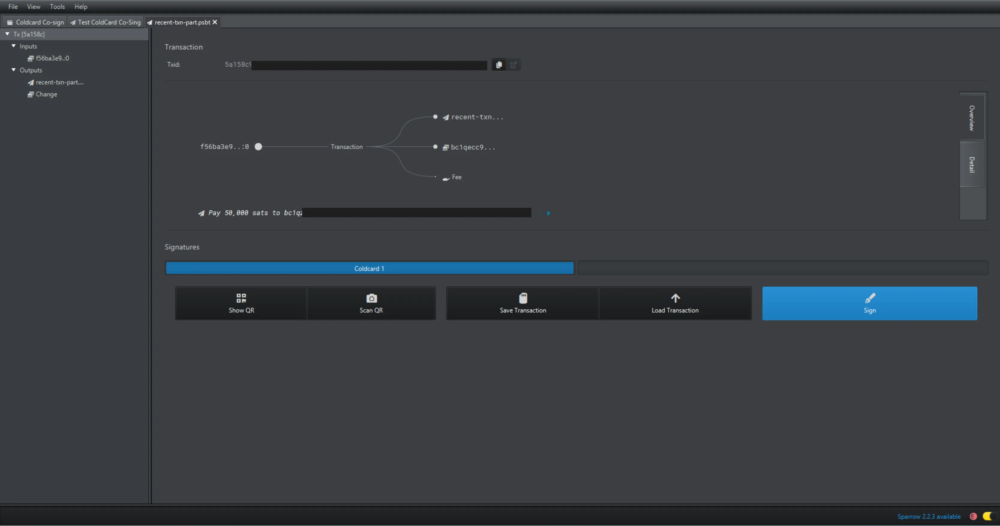

Réitérons désormais l'expérience mais pour une transaction de 21000 satoshis, c'est à dire un montant inférieur à la magnitude maximale (21212 sats) que nous avons réglé pour ce wallet.

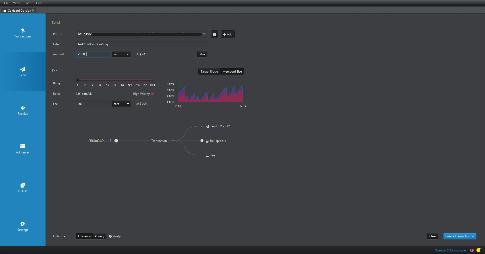

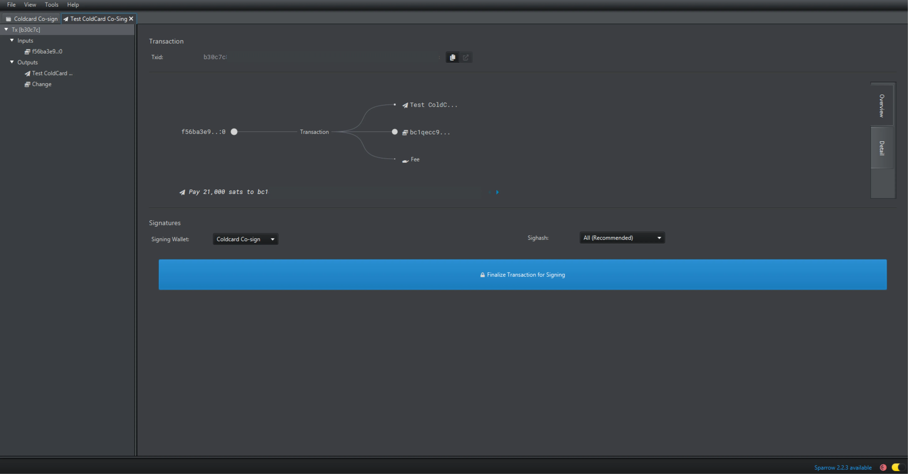

Essayons de signer cette transaction avec notre ColdCardQ.
Pas de problème cette fois, aucun message d'alerte n'apparait et quand on importe la transation signée dans Sparrow Wallet, cette fois les 2 signatures ont bien été appliquée, rendant la transaction valide et prête à être diffusée.

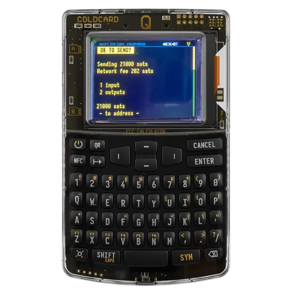

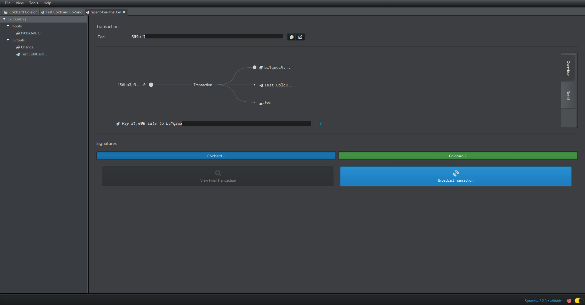

## Exporter le wallet multisig 2-sur-3 vers Nunchuk

[Plan ₿ Network - Nunchuk](https://planb.network/fr/tutorials/wallet/mobile/nunchuk-6cbcb406-ec84-478f-afac-bb4da366a6fa)

Nous allons dans ce paragraphe utiliser notre wallet multisig Co-Sign avec Nunchuk, et en profitez pour appliquer de nouvelles conditions de dépenses pour voir comment cela se passe.

Allons dans *Avanced Tools > ColdCard Co-Signing*.
Là on nous demandera de rentrer notre "Spending Policy Key", afin d'accéder au menu nous permettant de changer les conditions de dépenses. Dans notre cas nous rentrons 12 x "beef".

Nous décidons de garder une "Limit Velocity" maximum pour des raisons pratiques liées à la réalisation de ce tutoriel. Par contre nous allons via le menu **"Whitelist Addresses"** imposer les adresses sur lesquelles pourrons être dépensés nos fonds.

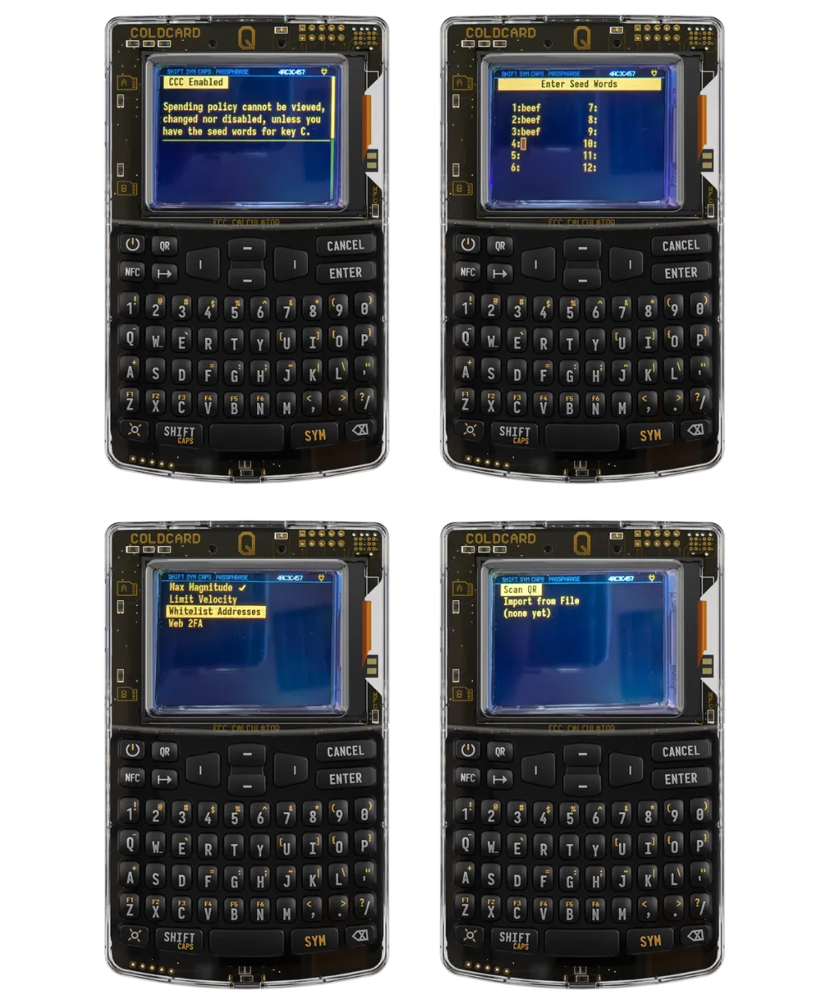

Scannez les QR codes associés aux adresses que vous souhaitez ajouter dans votre liste blanche, puis cliquez sur **"ENTER"**. Après avoir validé vos adresses en appuyant successivement sur **"ENTER"**, nous voyons que des limites sur la Magnitude et les adresses bénéficiaires ont été appliquées.

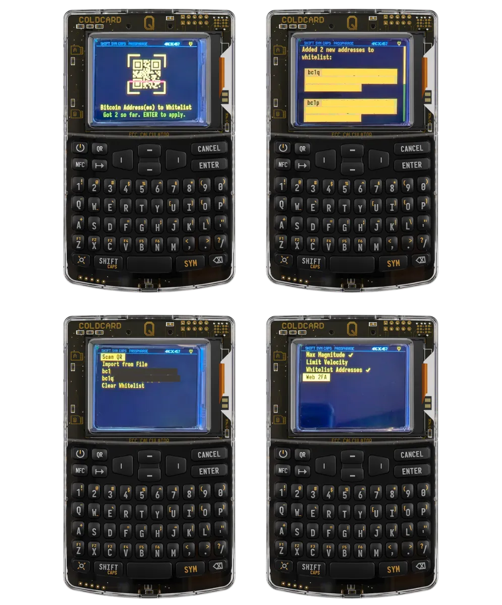

Pour finir et afin d'avoir une vision exhaustive des possibilités offertes par "Co-Sign", activons l'option "Web 2FA".
Cette fonctionnalité vous permet d'utiliser une application compatible TOTP RFC-6238 telle que Google Authenticator / Ente Auth / Proton Authenticator /  Authy 2FA /  ou encore Aegis Authenticator, pour ajouter une couche de sécurité supplémentaire.

[Plan ₿ Network - Ente Auth](https://planb.network/en/tutorials/computer-security/authentication/ente-auth-1928e65a-3b43-40f3-9efd-457ee2d79bb9)

[Plan ₿ Network - Proton Authenticator](https://planb.network/en/tutorials/computer-security/authentication/proton-authenticator-047ca2eb-a922-4e0e-8f75-1b89d23951ae)

[Plan ₿ Network - Authy 2FA](https://planb.network/en/tutorials/computer-security/authentication/authy-a76ab26b-71b0-473c-aa7c-c49153705eb7)

[Plan ₿ Network - Aegis Authenticator](https://planb.network/en/tutorials/computer-security/authentication/aegis-authenticator-22cc4d35-fb46-4e54-8833-bc4b411518bc)

 Concrètement avant de signer une transaction vous devrez taper votre appareils comprenant l'application 2FA à votre Coldcard. Cela vous conduira automatiquement sur une page web sur coldcard.com, où il vous sera demandé d'entrer le code à 6 chiffres de votre application. Si vous entrez le bon code, la page web vous indiquera soit un QR code à scanner pour le ColdCardQ, soit un code à 8 chiffres qu'il faudra entrer sur votre Mk4, afin d'autoriser votre appareil à signer.

Après avoir scanné le QR code affiché et ajouter votre compte ColdCard Co-Sign (CCC) dans votre app préférée, il vous sera classiquement demandé de vérifier que tout est en ordre en renseignant votre code 2FA.

Taper votre ColdCard au dos de votre appareil NFC.

Sur la page web qui s'ouvre, renseigner votre le code 2FA de votre application favorite. Puis scanné le QR code qui s'affiche avec votre ColdCardQ, ou renseignez dans votre Mk4 le code à 8 chiffres qui s'affiche.

Nous avons désormais imposée une limite sur la magnitude, les adresses de destinations, et la double authentification.

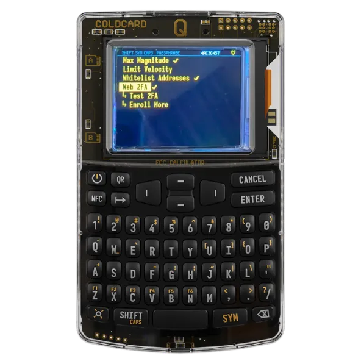

Exportons le wallet multisig 2-sur-3 dans Nunchuk cette fois, comme nous l'avons fait pour Sparrow précédemment.
Allez dans *Settings > Multisig Wallets > 2/3: ColdCard Co-sign > ColdCard Export*.

Cette fois choisissez pour l'export l'option NFC en cliquant sur le bouton du même nom **"NFC"**.

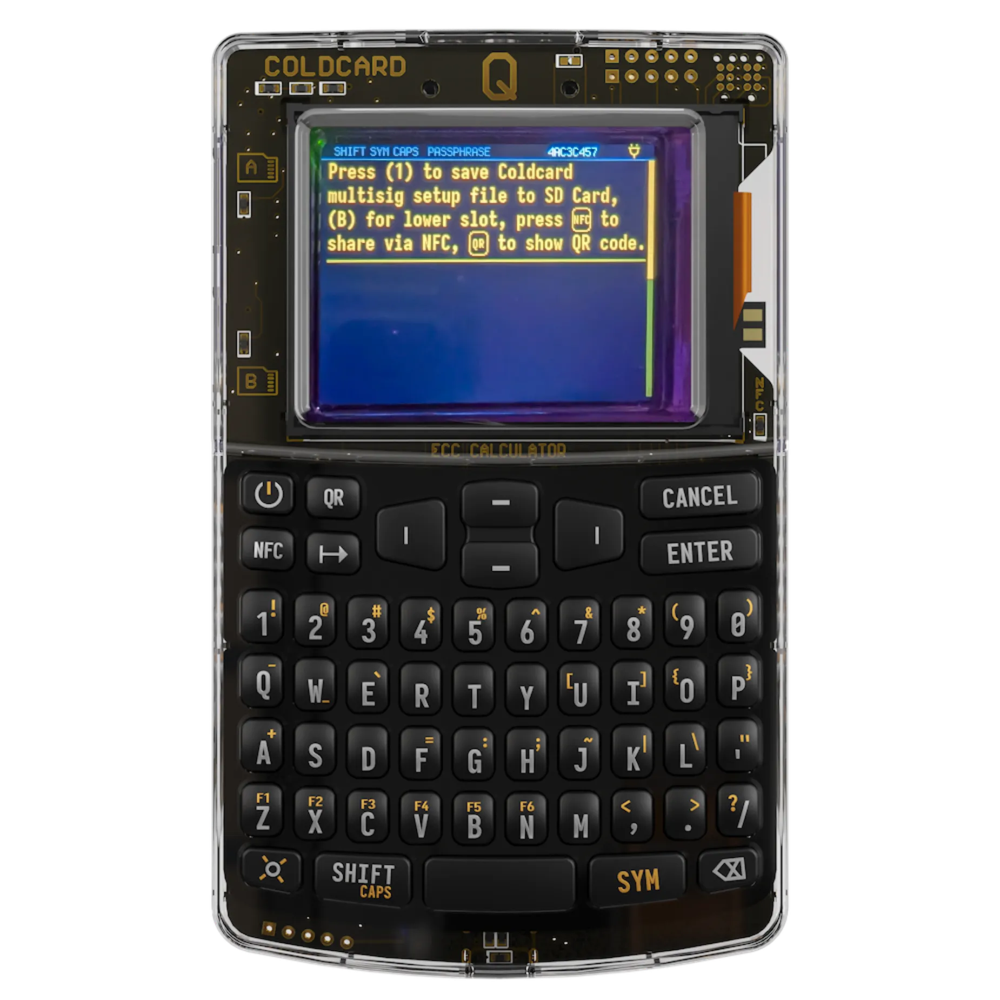

Dans Nunckuck, si vous ouvrez l'application pour la première fois, cliquez sur  **"Recover existing wallet"**

Si vous avez déjà un wallet présent dans l'application, cliquez sur le **"+"** en haut à droite, puis **"Recover existing wallet"**.

Ensuite choisissez **"Recover wallet from COLDCARD"** puis **"Multisig wallet"**.

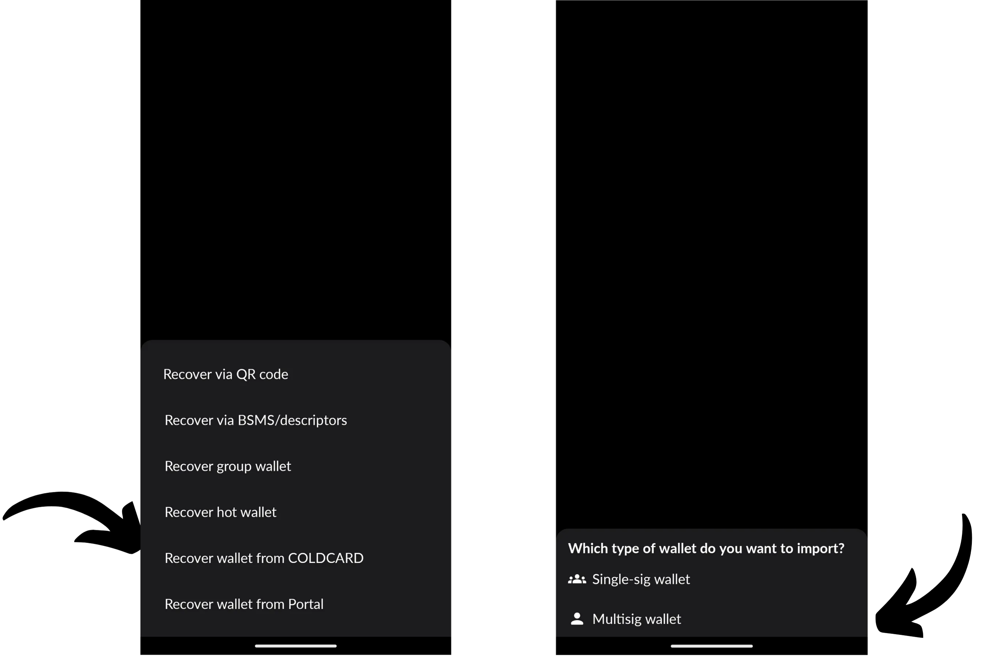

Enfin tapez le dos de votre smartphone à l'écran de votre ColdCardQ pour importer le wallet via NFC.

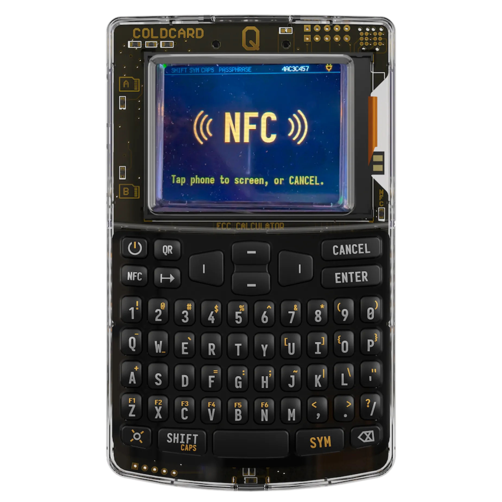

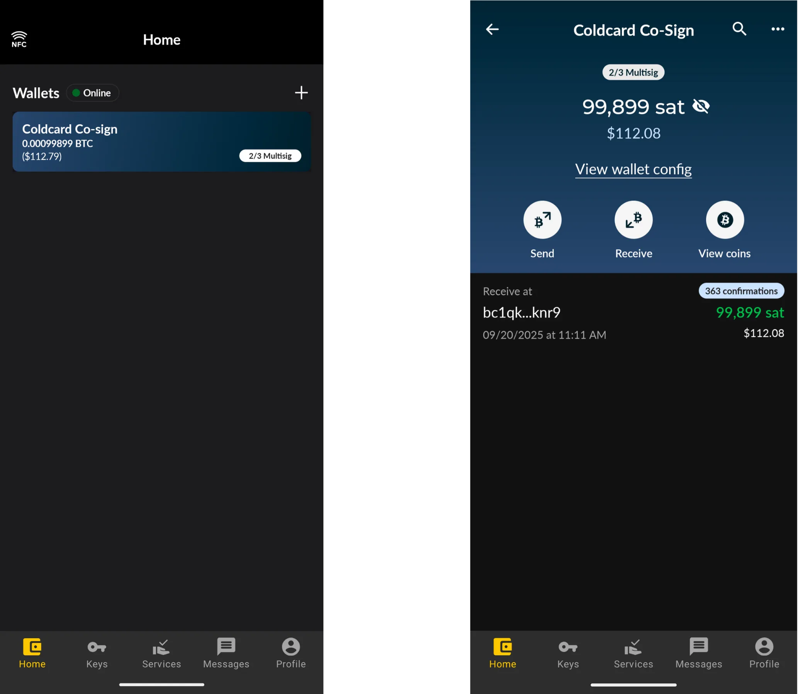

Essayons maintenant de réaliser une transaction qui viole 2 conditions de dépenses que nous avons fixés. Nous allons essayer de dépenser plus de 21212 sats vers une adresse qui n'a pas été approuvée. Essayons d'envoyer 22 222 sats vers une adresse aléatoire.

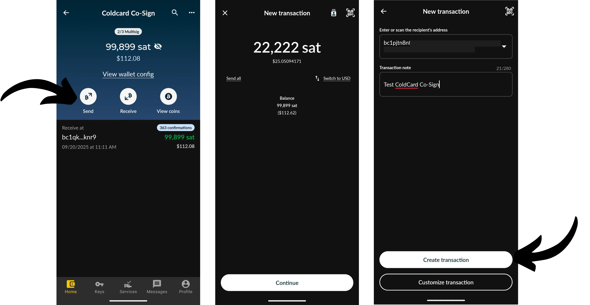

Une fois la transaction créée, cliquez sur les 3 petits points en haut à droite pour l'exporter vers votre ColdCard.

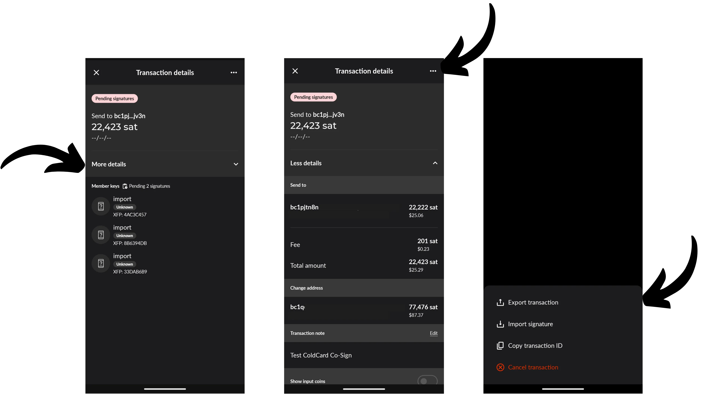

Puis choisissez **"Export via BBQR"**, et scannez le QR code affiché à l'aide de votre ColdCardQ.

Votre ColdcardQ vous affiche un avertissement, qui si on fait défiler l'écran jusqu'en bas, nous indique que notre transaction viole les conditions de dépense comme attendu. On voit par exemple que l'appareil ne nous indique pas le détail des conditions de dépenses non respectées, pour éviter qu'un éventuel attaquant ait accès au détail des transactions de dépenses configurées.

Si on valide quand même en appuyant sur **"ENTER"**  le QR code de la transaction signée apparait. Si on l'importe sur Nunckuk, on voit bien qu'une seule signature a été appliquée. 

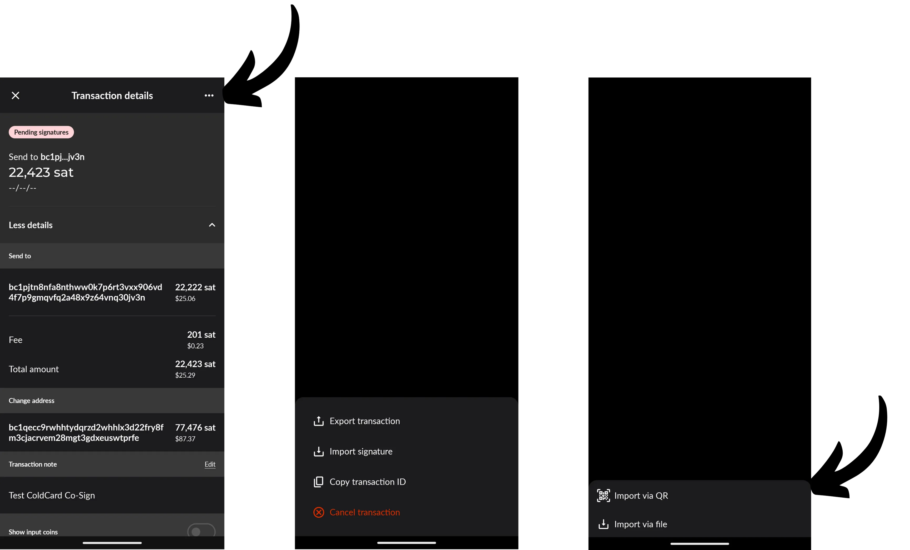

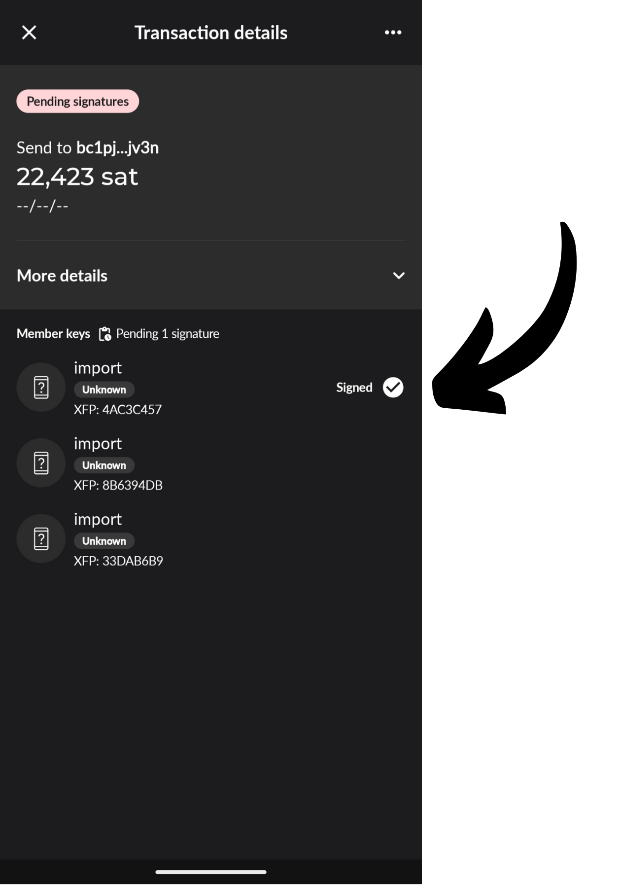

Réalisons exactement la même opération, mais cette fois avec une transaction qui respecte la magnitude limite (21212 sats), et qui dépense les satoshis vers une adresse que l'on a préconfigurée.

On envoie 12121 sats à une une de nos 2 adresses. Puis on exporte la transaction vers notre ColdCard comme déjà fait précédemment.

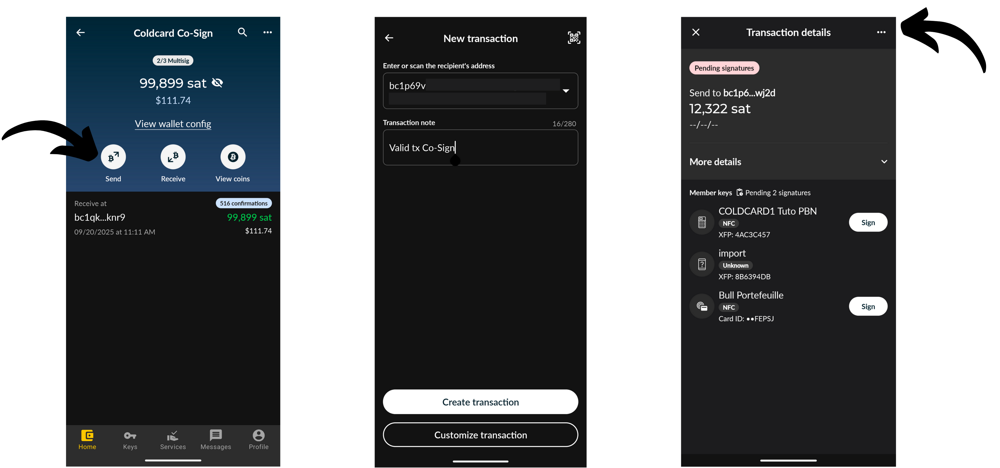

Après avoir importé la transaction sur notre ColdCardQ, voyons voir ce qui nous est indiqué.
On voit qu'un warning est toujours présent mais cette fois si on fait défiler l'écran jusqu'en bas on se rend compte qu'il s'agit ici de valider la transaction via le 2FA. Il nous est demandé de taper notre ColdCardQ à notre appareil NFC connecté à internet, ce que nous faisons.

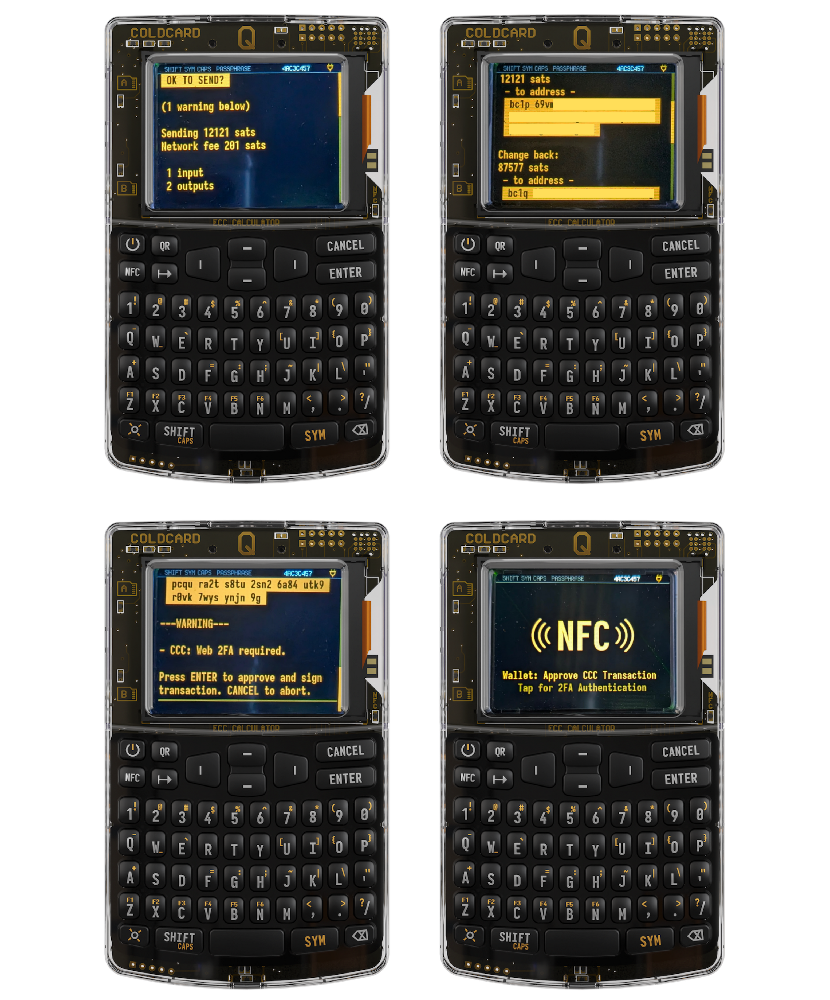

Une page web s'ouvre sur notre smartphone sur laquelle on nous demande de rentrer notre code 2FA ce que nous faisons grâce à Proton Authenticator.

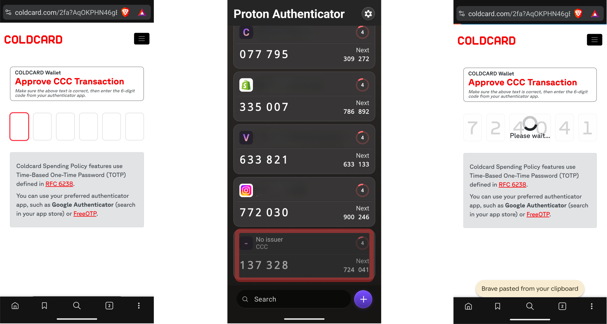

Puis scannez le code QR qui apparait pour signer la transaction. LA trnasaction est désormais siggnée par les 2 clés et donc valide.
Si la fonctionnalité "Push Tx" est activé sur votre ColdCardQ vous broadcaster sur le réseau par un simple tap au dos de votre smartphone. 

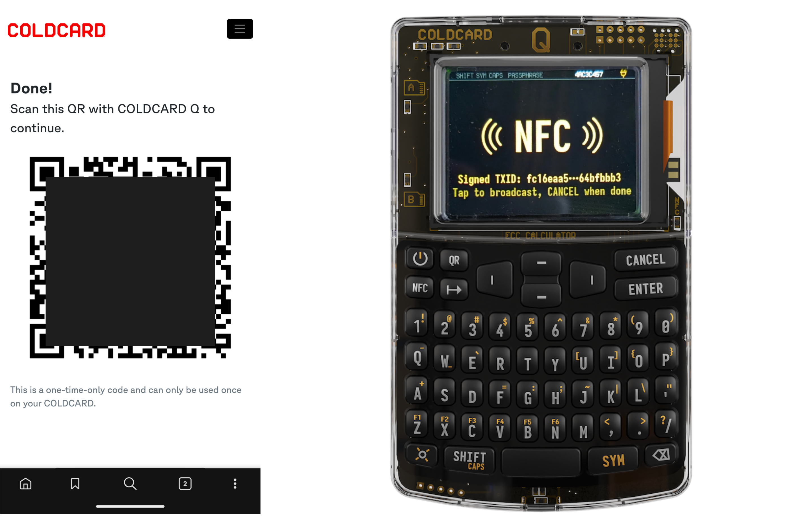

Si vous n'avez pas "Push tx" activé, alors importez la transaction signée sur Nunchuk, de la même manière que dans l'exemple  précédent, en scannant le QR code de votre transaction signée.

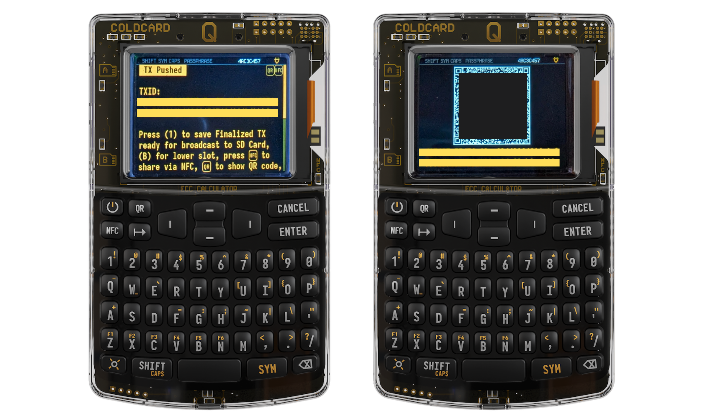