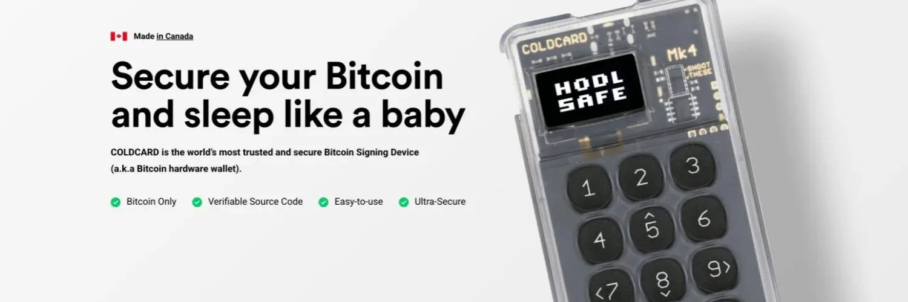

**Hardware wallets** are physical devices made just for storing Bitcoin's private key securely. They store the private keys offline, which means hackers cannot reach them through the internet. Whereas **software wallets** are mainly used for everyday transactions, **hardware wallets** are often used to store larger amounts of bitcoins securely for a long time. When making a Bitcoin transaction using **hardware wallets**, the wallet can sign the transactions inside the device, so the private key is never exposed to internet-connected environments.

In this tutorial, we will explore one of the most popular hardware wallets produced by Coinkite, the Coldcard Mk4. We will take a look on how to set up and use this hardware wallet to perform Bitcoin transactions.

## Coldcard Mk4 Overview

Coldcard Mk4 is a Bitcoin-only hardware wallet manufactured by Coinkite. This device is equipped with a screen, a numeric keypad and a protective sliding cover. In addtion, the device offers several ways to connect and interact, including USB-C, air-gapped operation using a MicroSD card, NFC, and a virtual disk mode. The Mk4 also includes advanced security features such as the BIP39 passphrase and trick PINs, giving users greater control and protection over their Bitcoin.

## Initial Setup: PIN and Anti-Phishing Words

To get started, the Coldcard Mk4 can be purchased directly from [Coinkite's website](https://store.coinkite.com/store). Buyers can also choose to pay using fiat currency or Bitcoin. In addition, you will also need a MicroSD card (4GB is sufficient) and a power source that can be connected via USB-C cable (the Coldcard Mk4 only has a USB-C power input port). Note that since the Mk4 does not have a built-in battery, it must be connected to the power source at all times while being used.

You will receive your Mk4 in a tamper-evident bag. Please ensure that the bag has not been compromised. If you spot something that may be a problem such as damage or tear on the bag, you can inform Coinkite by sending an email to support@coinkite.com. In addition, you can also find a 12-digit number on the tamper-evident bag, which we will refer to as the Mk4's bag number. This bag number will be used later to verify that the device has not been tampered with during shipping and that it comes directly from Coinkite. 

The keypad consists of 10 numeric buttons, an OK (`✓`) button, and a cancel (`✕`) button. Some numeric buttons can also be used for navigation: `5` to navigate up (`^`), `7` to navigate left (`<`), `8` to navigate down `˅`, and `9` to navigate right (`>`).

If there are no problems with the packaging, you may open the bag. The Mk4 will come with a wallet backup card that can be used to store information regarding the device's PIN, anti-phishing words, and seedphrase. Follow the following steps for the initialization: 

1. Connect the Mk4 to a power source (USB-C cable) and insert the MicroSD card. 
2. Once the device is powered up for the first time, the screen will display a message regarding Coldcard's Terms of Sale and Use. Navigate down and press `✓` to continue.
3. Next, a 12-digit number will be displayed on the screen. Check this number against the one on the tamper-evident bag to ensure the device has not been tampered with. If the numbers do not match, contact Coinkite support immediately before proceeding. Otherwise, press `✓` to continue. 
4. Select `Choose PIN Code`.
5. Navigate down as you read the instructions to proceed to the next step.
6. To perform the following steps, prepare a piece of paper and a pen.
7. On the Mk4, create and enter the PIN prefix (must be 2 to 6 characters long) and write it down, then press `✓` to continue.
8. Write down the two words displayed at the screen. These are the anti-phishing words. Press `✓` to continue.
9. Create and enter the PIN suffix (or rest of PIN, must be 2 to 6 characters long) and write it down. Press `✓` to continue.
10. Reenter your PIN prefix. Press `✓` to continue.
11. Check whether the anti-phishing words are the same with the one you wrote on step 8. Press `✓` to continue.
12. Reenter your PIN suffix (or rest of PIN). Press `✓` to continue.
13. Your Mk4's PIN and anti-phishing words are now successfully created and stored by the device.

Note that Mk4 will always ask you to input your PIN each time you switch your device on. Without this PIN, you are not able to access your Coldcard Mk4. So make sure that you create sufficient backup for the PIN and anti-phishing words.

## Setting up your Wallet

The next step is to set up your wallet. There are three ways for you to do this:
- Creating a new wallet (standard)
- Creating a new wallet with dice rolls
- Importing a wallet

### Creating a new wallet (standard)

To create a new wallet, simply do the following steps.

1. Select `New Wallet` (or `New Seed Words`).
2. Select `12 Word` or `24 Word (default)` depending on your preference.
3. The device will generate 12 or 24 words as your seedphrase based on your choice. Navigate down as you carefully write down each word in the correct order. Then, press `✓` to continue. 
4. The device will ask you to verify your seedphrase by asking the in a random order (for example, `Word 1 is?`, then `Word 5 is?`, then `Word 12 is?`, and so on) and there will be three word choices for each question. Refer to the note from Step 3 and choose the words correctly (by pressing `1`, `2` or `3`, whichever corresponds to the correct word) to complete the wallet creation.
5. Mk4 will then ask whether you want to Enable NFC/Tap or not. For now, select `✕` for this option. This can be changed in the settings in the future.
6. Finally, Mk4 will also if you want to disable the USB Port. For now, select `✓` for this option. This can be changed in the settings in the future.
7. The screen will now display the main menu with `Ready to Sign` at the top. This marks the completion of the wallet creation process.

### Creating a new wallet with dice roll

Alternatively, you can also choose to generate the new seedphrase with entropy. This is done if you do not trust Mk4's freshly generated seedphrase. The procedure is as follows:

1. Select `New Wallet` (or `New Seed Words`).
2. Select `12 Word Dice Roll` or `24 Word Dice Roll` depending on your preference.
3. You will be asked to enter the results of your dice rolls. Each dice roll adds randomness to the wallet creation process, ensuring that your seed phrase is generated in a fully secure and unpredictable way. The minimum number of roll is 99. Press `✓` after you have input at least 99 dice roll values.
4. The device will generate 12 or 24 words as your seedphrase based on your choice. Navigate down as you carefully write down each word in the correct order. Then, press `✓` to continue. 
5. The device will ask you to verify your seedphrase by asking the in a random order (for example, `Word 1 is?`, then `Word 5 is?`, then `Word 12 is?`, and so on) and there will be three word choices for each question. Refer to the note from Step 3 and choose the words correctly (by pressing `1`, `2` or `3`, whichever corresponds to the correct word) to complete the wallet creation.
6. Mk4 will then ask whether you want to Enable NFC/Tap or not. For now, select `✕` for this option. This can be changed in the settings in the future.
7. Finally, Mk4 will also if you want to disable the USB Port. For now, select `✓` for this option. This can be changed in the settings in the future.
8. The screen will now display the main menu with `Ready to Sign` at the top. This marks the completion of the wallet creation process.

### Importing a wallet

The final option is for you to import a wallet. You can do this if you want to recover a wallet from a seedphrase that you already have. You can follow these steps:

1. Select `Import Existing`.
2. Select `24 Words`, `18 Words` or `12 Words`, depending on your seedphrase's word count.
3. Coldcard Mk4 will then ask you what each word is in consecutive order. For each word, navigate down or up until you find the write prefix for each word. The device will narrow down the possibilities until you can find the correct word. Do this for the rest of the other words.
4. For the final word, Coldcard Mk4 will display only a limited amount of possible words. If there are no matches, you may have input the words incorrectly. Otherwise, select the word that matches the one on your seedphrase.
5. Mk4 will then ask whether you want to Enable NFC/Tap or not. For now, select `✕` for this option. This can be changed in the settings in the future.
6. Finally, Mk4 will also if you want to disable the USB Port. For now, select `✓` for this option. This can be changed in the settings in the future.
7. The screen will now display the main menu with `Ready to Sign` at the top. This marks the completion of the wallet creation process.

Do note that the seedphrase is the only access to recover your wallet. Create a backup of your seedphrase and store it in a secure place. Not your keys, not your coins, whoever has your seedphrase has access to your bitcoins!

## Setting up your passphrase

One of the best practices in Bitcoin is to use a passphrase. The passphrase acts as the 13th or 25th word in addition to the seedphrase. What makes it different is that you are able to choose whatever phrase you want, while the seedphrase is selected from a predetermined list of 2048 words. By default, after setting up your wallet, you will start with a wallet with a blank passphrase. To set up a non-blank passphrase, simply do the following steps:

1. Go to `Passphrase`.
2. Navigate down to read the description about passphrase, then press `✓` to proceed.
3. Select `Edit Phrase`.
4. Input your passphrase:
   - Press `1` (letters), `2` (numbers) or `3` (symbols) to select the character type.
   - Press `4` to swap between lowercase and uppercase letters (can only be used when inputting letters).
   - Navigate using `^` or `˅` to select the character for your passphrase.
   - Navigate using `<` or `>` to move between characters. You can also use `>` to add spaces.
   - Press `✕` to delete the characters.
   - Press `✓` when you have finished editing the passphrase.
5. Additionally, the other options have the following functionalities:
   - The `Add Word` or `Add Numbers` can be used to append letters/numbers to the passphrase you are currently editing.
   - Press `Clear ALL` to reset the passphrase you are currently editing.
   - Press `CANCEL` to go back to the main menu.
6. Write down your passphrase as a backup.
7. Press `APPLY` to access the wallet with the passphrase you have just set.
8. Mk4 will then display a 8-character long master key fingerprint. This can be regarded as the "ID" of the wallet. Write down this fingerprint and press `✓` to proceed.
9. Now, the wallet will display the main menu of the wallet with the passphrase that you have input.
10. It's important to note that a wallet will not tell you that you have input the incorrect passphrase, because each passphrase corresponds to each own wallet with a unique identity (master key fingerprint). Therefore, it’s a good practice to re-enter the same passphrase and check whether it produces the same wallet fingerprint, ensuring that you’ve entered it correctly. To do that, perform Steps 11 to 14.
11. Select `Restore Master`, then press `✓`. You are now back in the main menu of the wallet with the blank passphrase.
12. Go to `Passphrase` again, then press `✓` to proceed.
13. Reinput the passphrase that you have written down on Step 6, then press `APPLY`.
14. Check the 8-character long master key fingerprint against the one you have written down on Step 8. If both fingerprints does not match, you may have typed mismatched characters. You can select a new passphrase instead and repeat the process from Step 1. But if both fingerprints match, it means that you have input the passphrase correctly.
15. The wallet with the passphrase is ready to use.

## Exporting to Sparrow Wallet

## Receiving bitcoin

## Sending bitcoin

## Firmware Upgrade

## Trick PINs

