> **⚠️ PENGUMUMAN KEAMANAN MENDESAK (Juli 2026) — Dompet Coldcard sedang aktif dikuras.** Bug firmware pada pembuatan seed di perangkat Coldcard memungkinkan penyerang menemukan seed phrase Anda tanpa tindakan apa pun dari pihak Anda. **Semua model Coldcard terdampak: Mk3, Mk4, Mk5, dan Q.** Pada 30 Juli 2026, sekitar 594 BTC dicuri dari sekitar 500 dompet, dan serangan masih berlangsung. Hanya dompet yang dibuat dengan metode lempar dadu yang dianggap aman, dan hanya jika Anda melempar setidaknya 50 dadu. Jika Anda tidak tahu, tidak ingat, atau tidak yakin bagaimana seed Anda dibuat, anggaplah seed itu telah dibobol dan **segera pindahkan dana Anda** ke dompet yang seed-nya tidak dibuat di Coldcard. Ikuti pengumuman resmi Coinkite. Lihat tutorial migrasi khusus kami:

https://planb.academy/tutorials/wallet/hardware/coldcard-seed-vulnerability-1348b153-89db-429c-80af-b5d3d8506b9a

Dalam tutorial sebelumnya, kita sudah membahas konfigurasi awal ColdCard Q dan fungsi-fungsi dasarnya untuk pemula. Kalau kamu baru saja menerima ColdCard Q dan belum mengaturnya, aku sarankan kamu memulai dari tutorial tersebut sebelum melanjutkan ke sini:

https://planb.academy/tutorials/wallet/hardware/coldcard-q-73e86d1a-6fe6-4d8b-bb15-8690298020e3

Tutorial kali ini didedikasikan untuk opsi lanjutan ColdCard Q, yang memang dirancang untuk pengguna tingkat lanjut dan paranoid. Faktanya, ColdCard dibedakan dari hardware wallet lainnya karena menawarkan banyak fitur keamanan yang sangat canggih. Tentu saja, kamu tidak wajib menggunakan semua opsi ini. Pilih saja yang paling sesuai dengan strategi keamanan kamu.

**Peringatan**: penggunaan yang tidak tepat dari beberapa opsi lanjutan ini dapat mengakibatkan hilangnya bitcoin kamu atau bahkan merusak perangkat hardware wallet kamu. Karena itu, aku sangat menyarankan kamu membaca dengan saksama penjelasan dan rekomendasi untuk setiap opsi.

Sebelum memulai, pastikan kamu memiliki akses ke cadangan fisik seedphrase 12 atau 24 kata, dan periksa validitasnya melalui menu berikut: `Advanced/Tools > Danger Zone > Seed Functions > View Seed Words`.

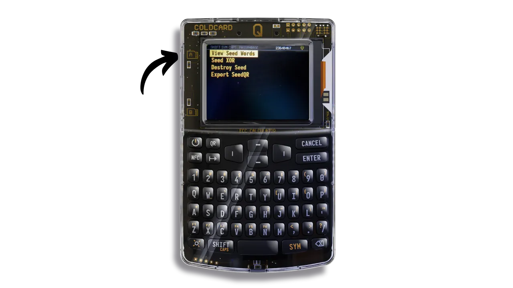

## Kata sandi BIP39

Jika kamu belum tahu apa itu kata sandi BIP39, atau belum benar-benar paham cara kerjanya, aku sangat menyarankan kamu untuk melihat tutorial ini terlebih dahulu. Tutorial tersebut membahas dasar-dasar teori yang diperlukan untuk memahami risiko yang terkait dengan penggunaan kata sandi:

https://planb.academy/tutorials/wallet/backup/passphrase-a26a0220-806c-44b4-af14-bafdeb1adce7

Ingat bahwa setelah kamu membuat kata sandi di wallet kamu, seedphrase saja tidak akan cukup untuk memulihkan akses ke bitcoin kamu. Kamu akan membutuhkan seedphrase dan kata sandi. Selain itu, kamu juga harus memasukkan kata sandi setiap kali membuka kunci ColdCard Q. Ini akan meningkatkan keamanan, karena akses fisik ke ColdCard dan pengetahuan tentang PIN saja tidak akan cukup tanpa kata sandi.

Di ColdCard, kamu memiliki dua opsi untuk mengelola kata sandi:

1. **Entri klasik**: kamu memasukkan kata sandi secara manual setiap kali menggunakan hardware wallet kamu, seperti pada hardware wallet lainnya. ColdCard Q mempermudah proses ini berkat keyboard penuh yang dimilikinya.

2. **Penyimpanan terenkripsi di microSD**: kamu dapat memilih untuk mengenkripsi kata sandi dan menyimpannya di kartu microSD. Dalam hal ini, kamu harus memasukkan microSD ke dalam ColdCard Q setiap kali menggunakannya. Perlu diperhatikan bahwa microSD ini hanya akan berfungsi pada ColdCard Q kamu dan bukan merupakan cadangan. Karena itu, sangat penting untuk tetap menyimpan salinan kata sandi kamu di media fisik seperti kertas atau logam.

Untuk mengatur kata sandi BIP39 kamu, masuk ke menu *"Kata Sandi"*.

Masukkan kata sandi kamu menggunakan keyboard. Pastikan untuk memilih kata sandi yang kuat (panjang dan acak) dan buat cadangan fisik.

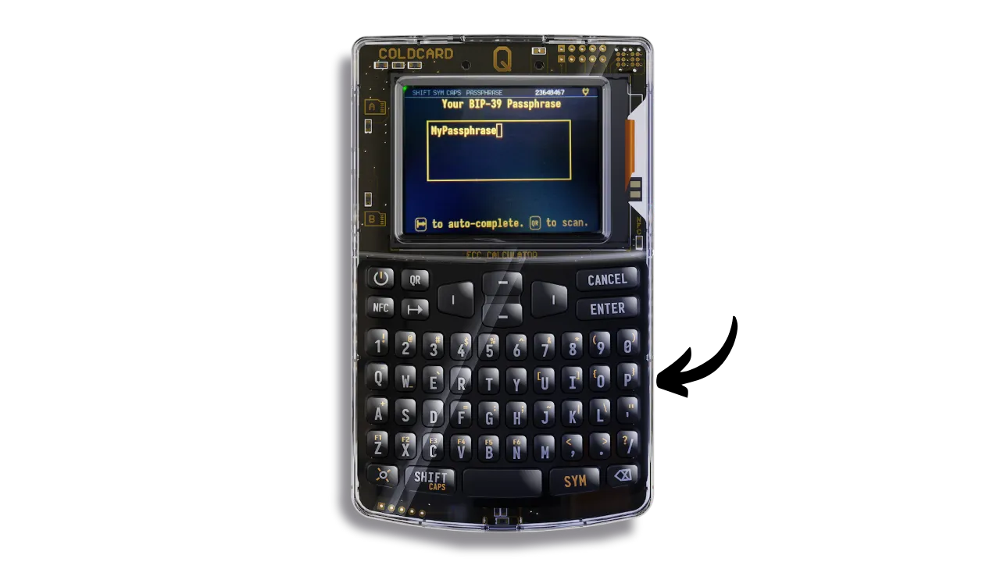

Setelah kamu menetapkan kata sandi, ColdCard Q akan menampilkan sidik jari kunci utama dari wallet baru yang terkait dengan kata sandi tersebut. Pastikan kamu menyimpan sidik jari ini dengan aman. Saat kamu memasukkan kembali kata sandi di kemudian hari ketika menggunakan perangkat, kamu bisa memeriksa apakah sidik jari yang ditampilkan sesuai dengan yang telah kamu simpan. Pemeriksaan ini memastikan bahwa kamu tidak melakukan kesalahan saat memasukkan kata sandi.

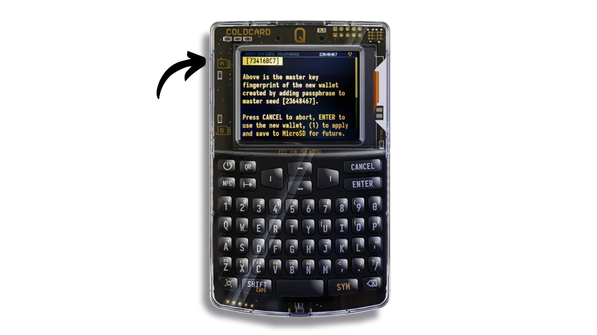

Sekarang kamu dapat menekan *"ENTER"* untuk menerapkan kata sandi ini ke seedphrase kamu dan mengaktifkan wallet yang baru. Jika kamu lebih memilih untuk menyimpan kata sandi ini di microSD, masukkan kartu ke slot yang sesuai lalu tekan *"1"*.

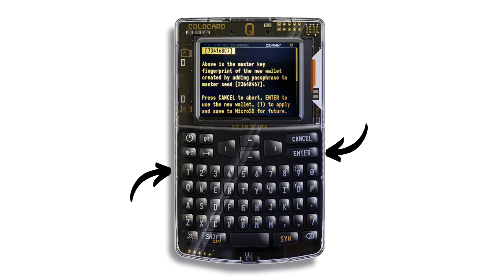

Kata sandi kamu sekarang telah diterapkan. Jejak kunci muncul di layar beranda dan di bagian atas layar.

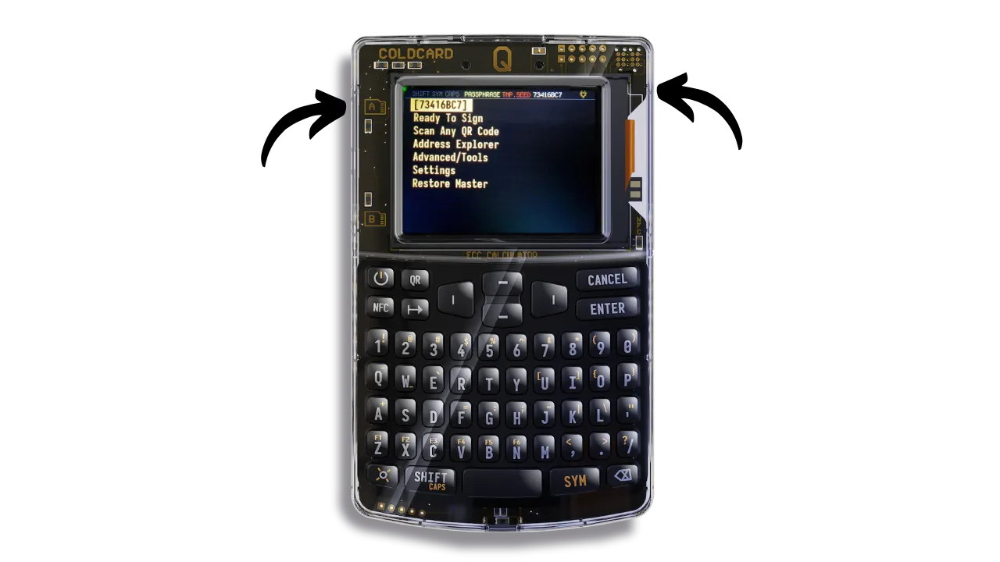

Setiap kali kamu membuka kunci ColdCard Q, kamu harus masuk ke menu *"Passphrase"* dan memasukkan kata sandi dengan cara yang sama seperti sebelumnya, agar kata sandi tersebut diterapkan ke seedphrase yang tersimpan di perangkat dan kamu dapat mengakses wallet Bitcoin yang benar.

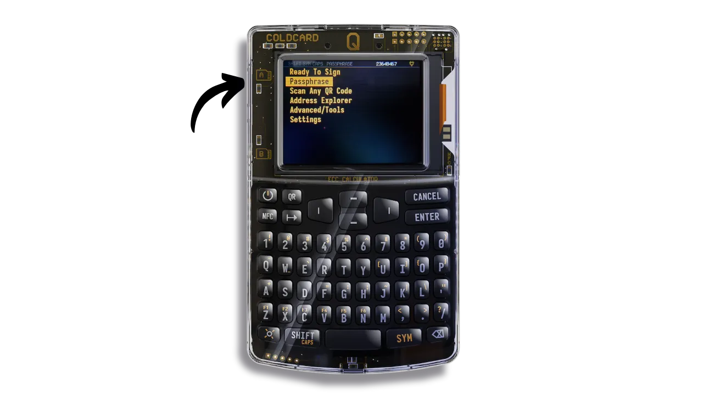

Jika kamu menyimpan kata sandi di kartu microSD, setiap kali menggunakannya, masukkan kartu tersebut ke ColdCard lalu akses menu *"Kata Sandi"*. ColdCard akan memuat kata sandi langsung dari microSD, sehingga kamu tidak perlu memasukkannya secara manual. Pilih *"Kembalikan Tersimpan"*.

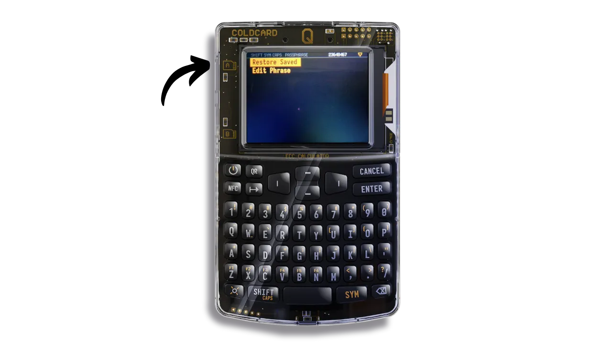

Periksa apakah panjang dan huruf pertama dari kata sandi yang dimuat sudah benar.

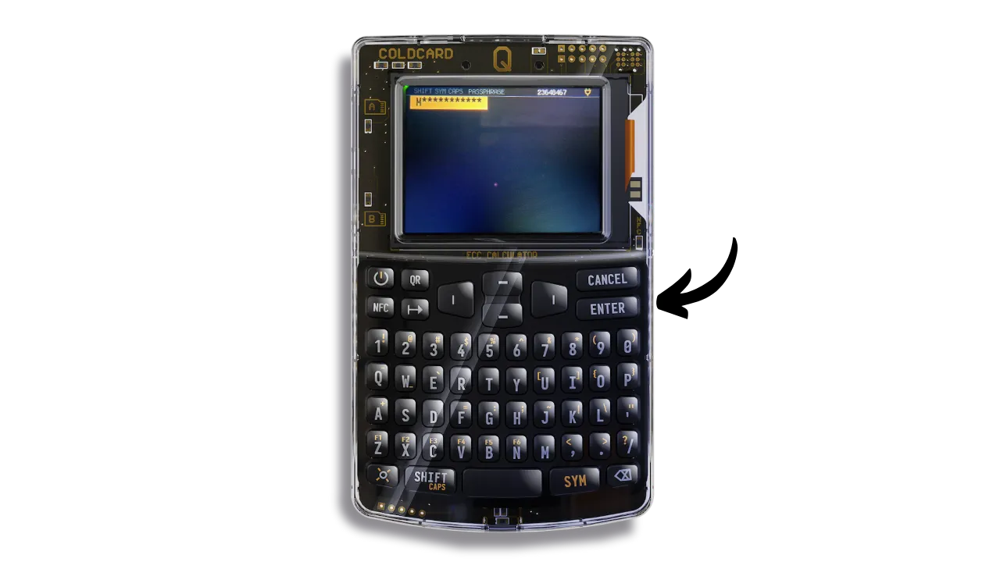

Konfirmasikan bahwa sidik jari yang ditampilkan sesuai dengan sidik jari yang ada di dompet kamu dan klik "*Restore*".

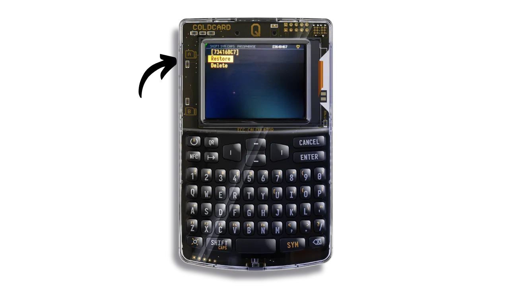

Perlu diingat bahwa menggunakan kata sandi berarti kamu harus mengimpor satu set kunci baru yang berasal dari kombinasi seedphrase dan kata sandi kamu ke dalam perangkat lunak manajemen wallet kamu (seperti Sparrow Wallet). Untuk melakukannya, ikuti langkah *"Konfigurasi wallet baru di Sparrow"* di tutorial lainnya:

https://planb.academy/tutorials/wallet/hardware/coldcard-q-73e86d1a-6fe6-4d8b-bb15-8690298020e3

## Opsi membuka kunci

COLDCARD juga mendapatkan keuntungan dari sejumlah opsi untuk proses membuka kunci perangkat. Mari cari tahu lebih lanjut tentang opsi-opsi tingkat lanjut ini.

### Trik PIN

Trick PIN adalah kode PIN sekunder yang berbeda dari PIN yang ditetapkan saat konfigurasi awal perangkat. Kode ini digunakan untuk memicu tindakan tertentu yang telah dikonfigurasi sebelumnya segera setelah dimasukkan ketika ColdCard dinyalakan. Kamu dapat mengonfigurasi beberapa Trick PIN, masing-masing dikaitkan dengan tindakan yang berbeda. Fitur-fitur ini memungkinkan kamu menyesuaikan ColdCard dengan strategi keamanan pribadi kamu. Fitur ini sangat berguna dalam skenario pemaksaan fisik, seperti saat perampokan, yang di komunitas Bitcoin sering disebut sebagai *“wrench attack”*.

Untuk mengaktifkan Trick PIN dan mengaitkannya dengan suatu tindakan, masuk ke menu `Pengaturan > Pengaturan Login > Trick PIN`.

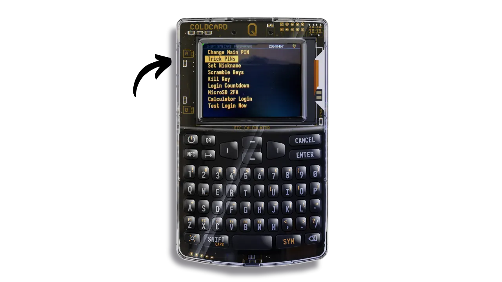

Pilih "*Tambahkan Trik Baru*".

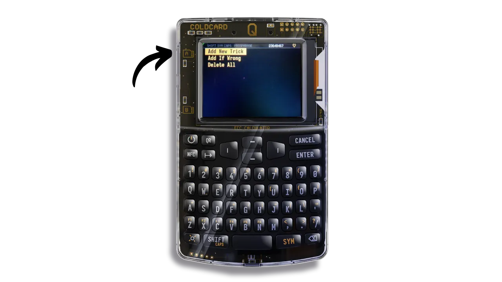

Tetapkan kode PIN yang akan dikaitkan dengan tindakan dan ingatlah untuk menyimpannya.

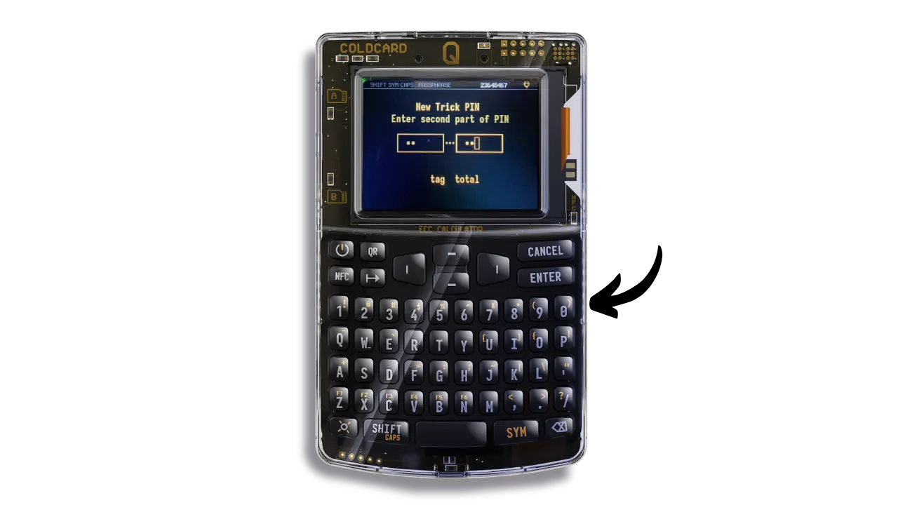

Kemudian pilih tindakan yang akan dijalankan secara otomatis setiap kali kamu memasukkan Trick PIN ini. Berikut adalah daftar tindakan yang tersedia untuk Trick PIN:

- *"Brick Self"*: tindakan ini akan menghancurkan kedua chip ColdCard Q jika Trick PIN dimasukkan, sehingga perangkat menjadi sepenuhnya tidak dapat digunakan. Perangkat tidak akan bisa dijual kembali, digunakan ulang, atau bahkan dikembalikan ke Coinkite. ColdCard akan rusak permanen. Fitur ini dapat digunakan dalam situasi perampokan untuk meyakinkan penyerang bahwa mereka tidak akan pernah bisa mengakses bitcoin kamu. **Harap diperhatikan**: tanpa cadangan fisik seedphrase dan kata sandi kamu, bitcoin kamu akan hilang secara permanen.

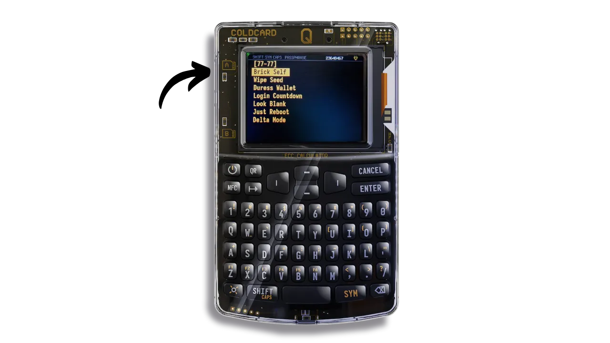

- *"Hapus Seed"*: menu ini menawarkan beberapa tindakan untuk menghapus seedphrase, yaitu mengatur ulang ColdCard tanpa menghancurkannya. Berbeda dengan opsi *"Brick Self"*, opsi ini memungkinkan kamu mengonfigurasi ulang perangkat menggunakan cadangan seedphrase kamu. Namun, tanpa cadangan tersebut, bitcoin kamu akan hilang. Berikut adalah opsi yang tersedia:
  - *"Wipe & Reboot"*: menghapus seedphrase lalu me-reboot ColdCard tanpa menampilkan informasi apa pun di layar.
  - *"Silent Wipe"*: menghapus seedphrase secara diam-diam, lalu membuka ColdCard ke wallet palsu acak seolah-olah tidak terjadi apa-apa.
  - *"Wipe -> Wallet"*: menghapus seedphrase secara diam-diam dan membuka ColdCard ke wallet sekunder yang telah dikonfigurasikan sebelumnya sebagai wallet umpan. Wallet ini bisa berisi sebagian kecil dari tabungan bitcoin kamu untuk memuaskan penyerang.
  - *"Tell Them Wiped, Stop"*: menghapus seedphrase dan menampilkan pesan `Seed wiped, Stop` di layar.

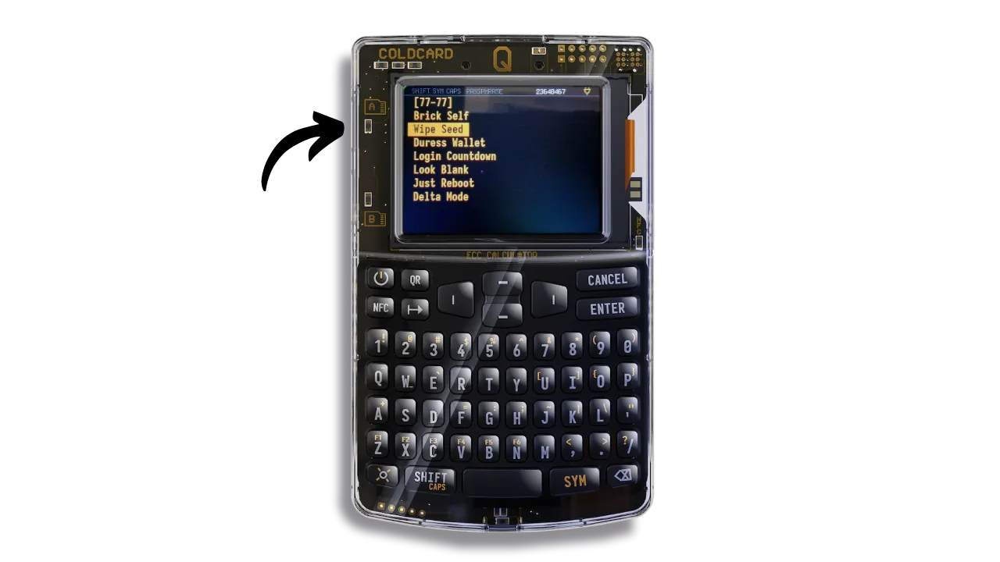

- *"Dompet Paksa"*: dengan tindakan ini, Trick PIN akan membuka wallet yang diturunkan dari **master seed** menggunakan BIP85. Wallet sekunder ini dapat digunakan sebagai umpan untuk memuaskan penyerang. ColdCard akan berperilaku seolah-olah wallet tersebut adalah wallet yang sebenarnya, tetapi tanpa PIN utama yang asli, yang berbeda dari Trick PIN, penyerang tidak akan pernah dapat mengakses wallet utama. Strategi ini dirancang agar orang percaya bahwa wallet yang dibuka dengan Trick PIN adalah satu-satunya wallet yang ada.

- *"Login Countdown"*: menu ini mengelompokkan tindakan yang dijalankan setelah hitungan mundur. **Peringatan**, beberapa di antaranya dapat merusak perangkat kamu atau mengakibatkan hilangnya bitcoin kamu. Berikut sub-tindakan yang tersedia:
- *"Wipe & Countdown"*: menghapus seedphrase dari memori ColdCard, lalu memulai hitungan mundur selama satu jam. Tanpa cadangan seedphrase atau kata sandi, bitcoin kamu akan hilang. Opsi ini dirancang untuk mengelabui penyerang agar mengira perangkat akan terbuka di akhir hitungan mundur, padahal sebenarnya perangkat akan di-reset ke pengaturan pabrik.
- *"Countdown & Brick"*: memulai hitungan mundur selama satu jam, yang pada akhirnya ColdCard akan menghancurkan dua secure chip-nya, sehingga perangkat menjadi tidak dapat digunakan secara permanen. Tanpa cadangan, bitcoin kamu akan hilang. Tindakan ini dirancang untuk menipu penyerang yang mengira sedang menunggu proses membuka kunci, padahal perangkat akan menghancurkan dirinya sendiri.
- *"Countdown Only"*: memicu hitungan mundur satu jam sederhana, setelah itu ColdCard akan melakukan reboot tanpa tindakan lanjutan. Seedphrase tidak dihapus dan perangkat tetap utuh. Hati-hati agar tidak menyamakan tindakan ini dengan opsi *"Login Countdown"* yang akan dibahas pada bagian berikutnya, yang menambahkan hitungan mundur ke PIN utama sambil tetap memberikan akses ke wallet yang sebenarnya.

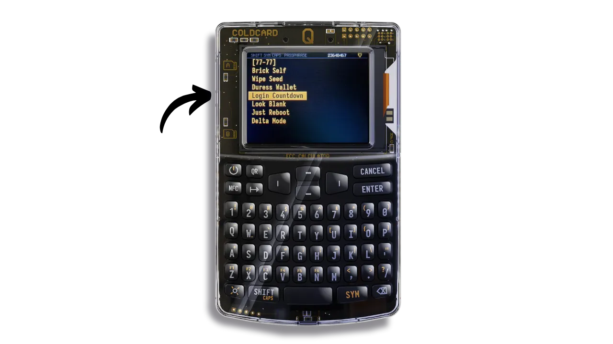

- "*Tampak Kosong*": Tindakan ini membuat COLDCARD terlihat kosong, memberikan kesan bahwa seed telah dihapus. Pada kenyataannya, tidak ada yang terjadi dan seed tetap utuh. Ini mensimulasikan COLDCARD yang tidak terpakai atau direset.

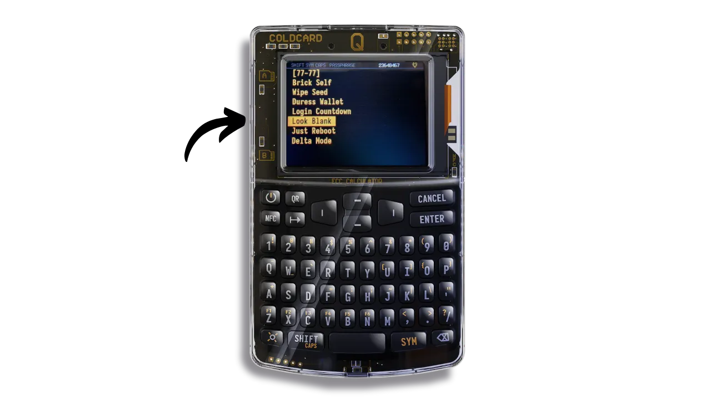

- "*Hanya Reboot*: Ketika PIN Trik digunakan, COLDCARD hanya melakukan boot ulang. Tidak ada tindakan lain yang dilakukan.

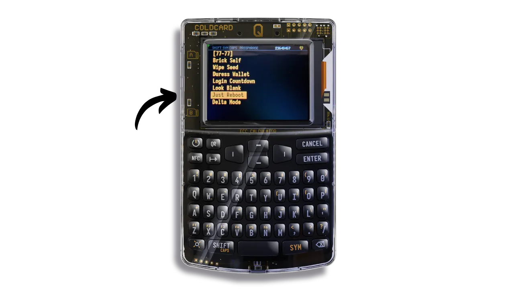

- *"Delta Mode"*: tindakan kompleks ini ditujukan untuk pengguna berpengalaman dan dirancang untuk melawan skenario pemaksaan yang sangat canggih, baik oleh negara maupun pihak dekat yang memiliki informasi sensitif. Saat Delta Mode diaktifkan, ColdCard memberikan akses ke wallet yang sebenarnya, sehingga penyerang dapat menavigasi dan memverifikasi bahwa wallet tersebut memang terlihat valid. Namun, penandatanganan transaksi akan diblokir, sehingga mencegah pengeluaran bitcoin. Selain itu, akses ke seedphrase akan dinonaktifkan, dan setiap upaya untuk menampilkannya akan langsung memicu penghapusan. Untuk meningkatkan kredibilitas, Trick PIN yang digunakan dengan Delta Mode harus memiliki awalan yang sama dengan PIN asli agar kata-kata anti-phishing yang ditampilkan tetap sama, sementara akhiran PIN harus berbeda.

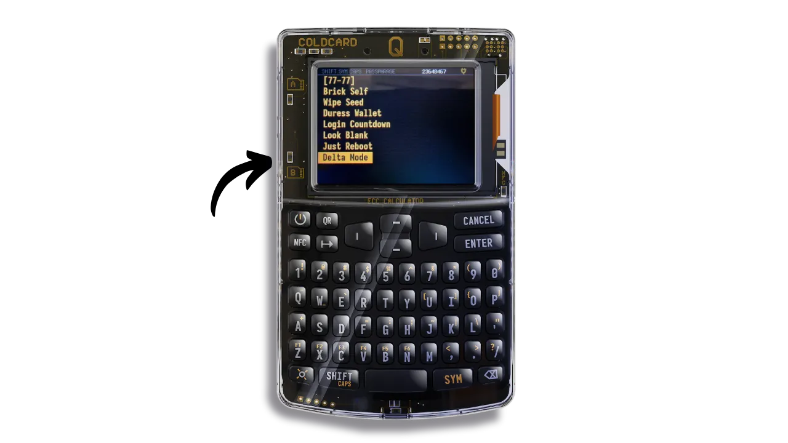

Setelah kamu memilih tindakan, konfirmasikan pilihan.

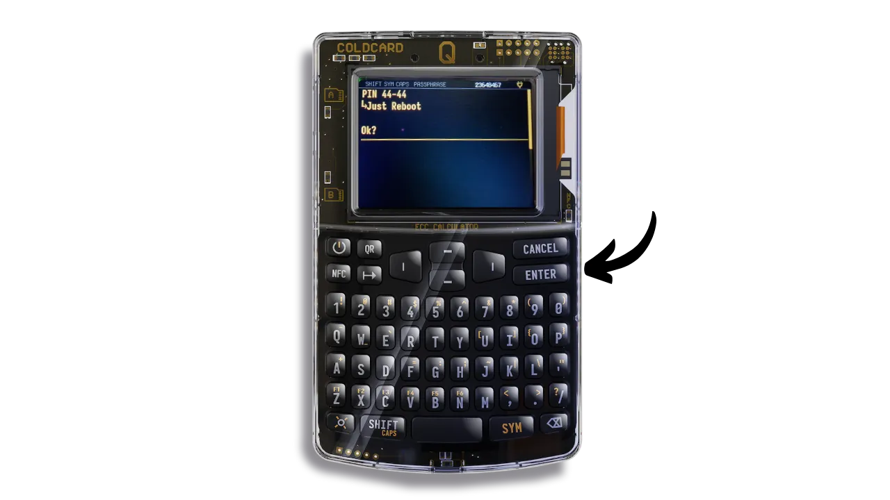

Anda kemudian dapat melihat semua PIN Trik yang dikonfigurasi di menu khusus.

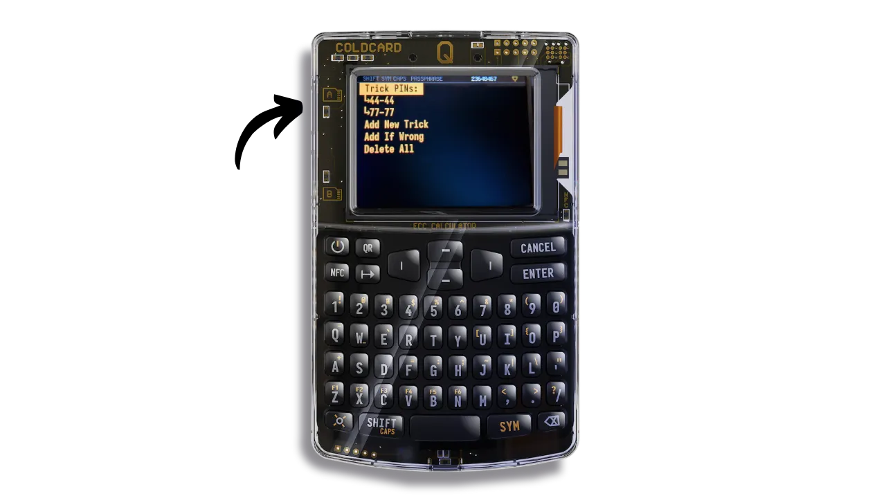

Dengan memilih Trick PIN yang sudah ada, kamu dapat meninjau tindakan yang terkait. Kamu juga bisa menyembunyikannya dengan opsi *"Sembunyikan Trick"*, sehingga tidak ditampilkan di menu Trick PIN. Trick PIN tersebut dapat dihapus melalui opsi *"Hapus Trick"*, atau kode PIN-nya dapat diubah sambil tetap mempertahankan tindakan yang sama dengan memilih *"Ubah PIN"*.

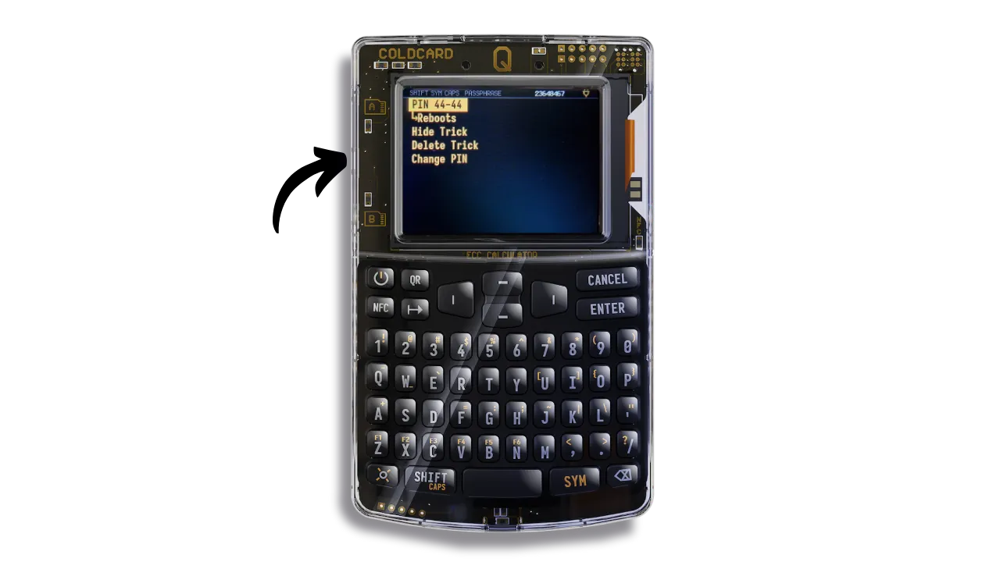

Opsi "*Tambahkan Jika Salah*", tersedia di menu "*Tipu PIN*", memungkinkanmu mengonfigurasi tindakan tertentu yang secara otomatis dipicu setelah sejumlah percobaan yang salah untuk memasukkan kode PIN utama. Jumlah percobaan yang diizinkan dapat diatur selama konfigurasi.

### Tombol Acak

Opsi Tombol Acak memungkinkanmu untuk mengacak angka yang ditampilkan pada tombol keypad saat memasukkan kode PIN. Fitur ini melindungi kerahasiaan kode PIN, bahkan jika terjadi pengawasan oleh orang atau kamera.

Untuk mengaktifkan opsi ini, akses menu `Pengaturan > Pengaturan Login > Tombol Acak`.

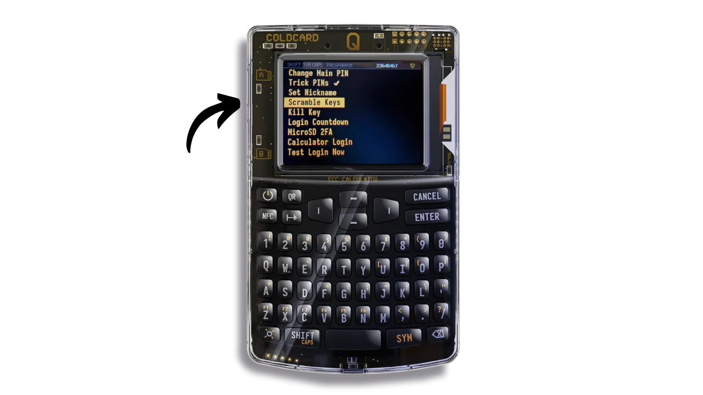

Pilih opsi "*Scramble Keys*".

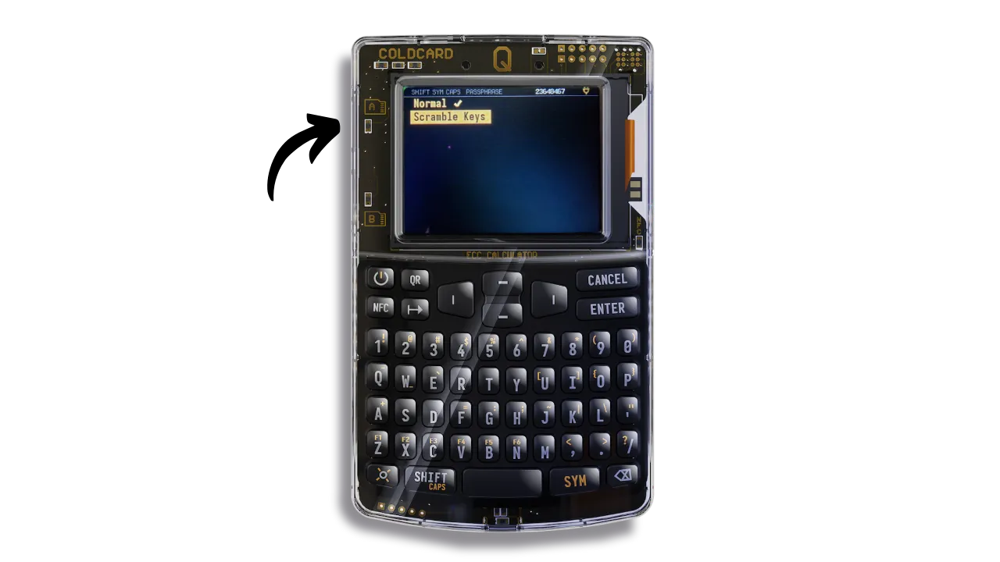

Mulai sekarang, ketika kamu membuka kunci COLDCARD Q, tombol pada keypad akan diberi nomor baru secara acak setiap kali kamu menggunakannya.

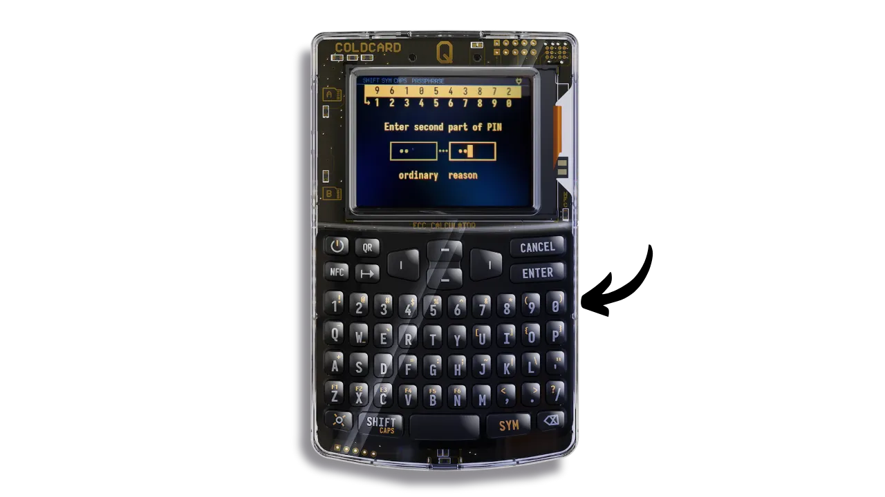

### Hitung Mundur Masuk

Opsi ini memungkinkan kamu menerapkan hitungan mundur sistematis setiap kali mencoba membuka kunci COLDCARD. Fitur ini bisa diintegrasikan ke dalam strategi keamanan, misalnya dengan menunda akses ke perangkat jika terjadi pencurian, atau dengan memberlakukan jeda sebelum menandatangani transaksi untuk melindungi diri dalam situasi perampokan. Namun, hitungan mundur ini berlaku untuk semua penggunaan, termasuk saat kamu menggunakan COLDCARD secara sah, sehingga kamu juga harus bersabar menunggunya. Pastikan tidak tertukar dengan tindakan *"Just Countdown"*, yang hanya dipicu ketika Trick PIN tertentu digunakan.

Untuk mengonfigurasi opsi ini, akses menu `Pengaturan > Pengaturan Login > Hitung Mundur Login`.

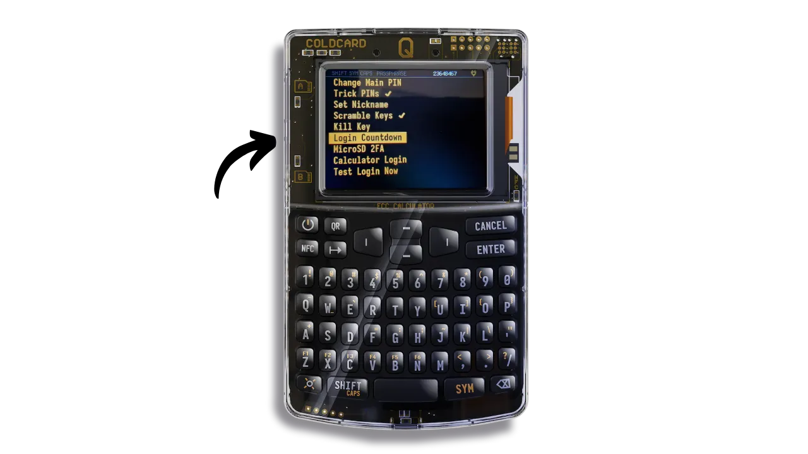

Pilih waktu hitung mundur. Misalnya, jika kamu memilih 1 jam, Anda harus menunggu 1 jam untuk setiap upaya membuka kunci COLDCARD Q.

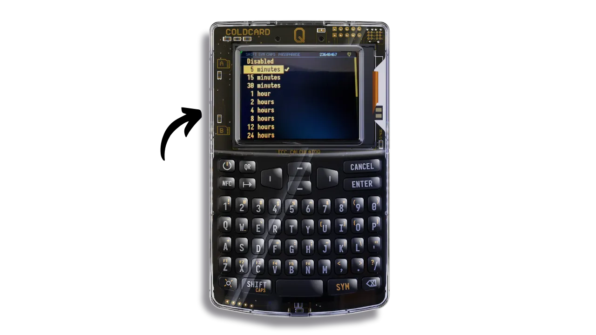

Setiap kali kamu membuka kunci, kamu akan diminta untuk memasukkan kode PIN.

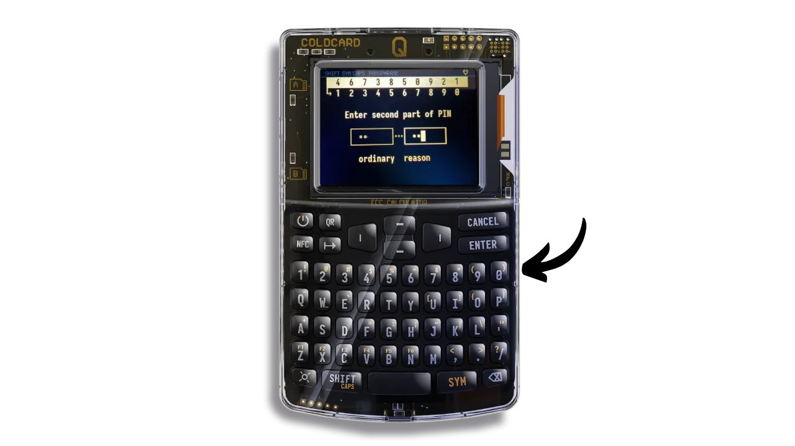

Kemudian, tunggu waktu yang ditetapkan oleh hitungan mundur.

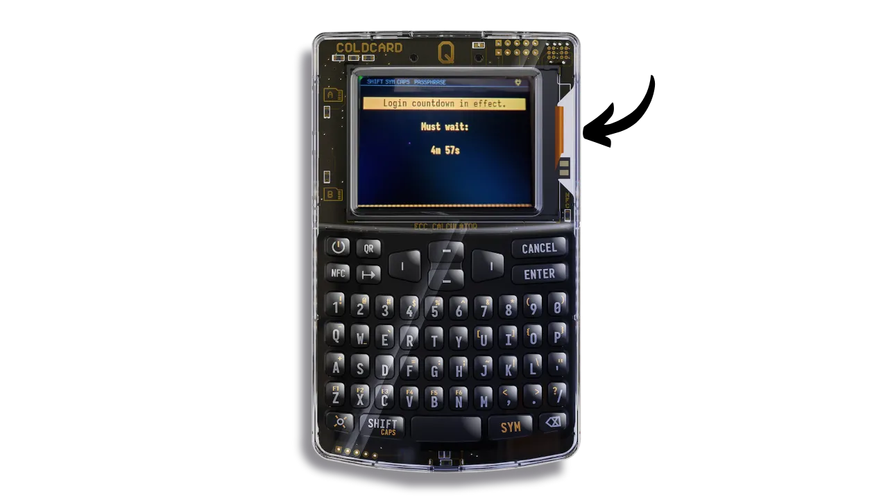

Di akhir hitungan mundur, kamu harus memasukkan PIN lagi untuk mengakses perangkat.

### Masuk Kalkulator

Opsi ini memungkinkan kamu untuk menyamarkan COLDCARD milikmu sebagai kalkulator saat membuka kunci. Untuk mengaktifkan fitur ini, akses menu `Pengaturan > Pengaturan Masuk > Masuk Kalkulator`.

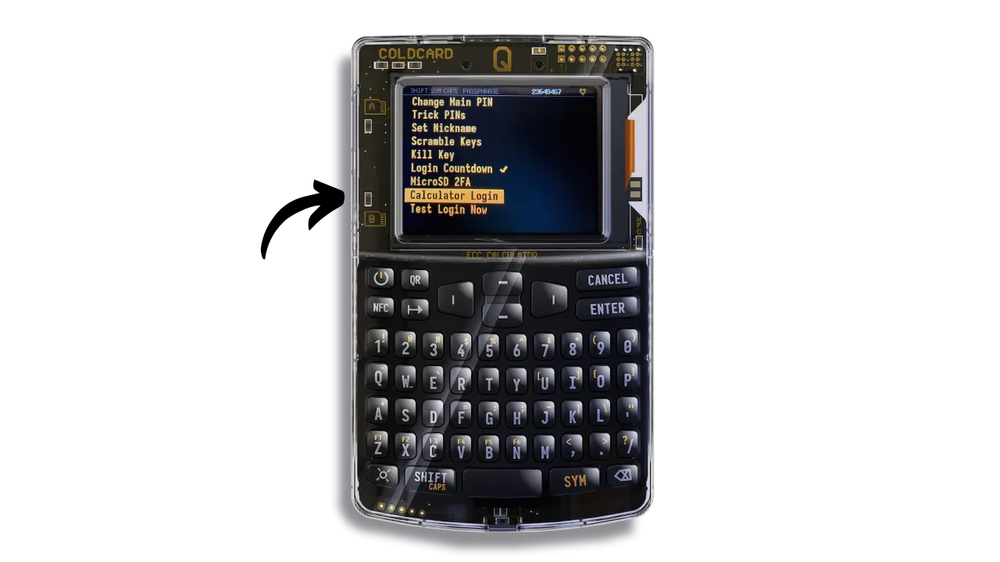

Aktifkan opsi dengan memilihnya.

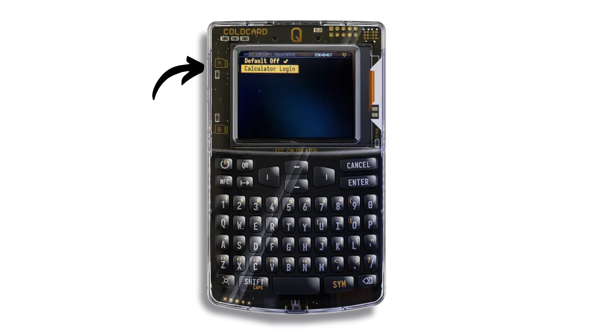

Mulai sekarang, setiap kali perangkat dihidupkan, kalkulator yang berfungsi dengan perintah dasar akan ditampilkan.

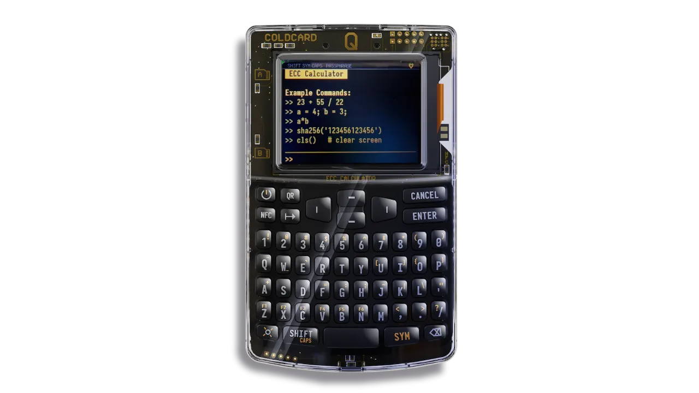

Sebagai contoh, Anda dapat menghitung hash SHA256 dari "*Rencana B Network*".

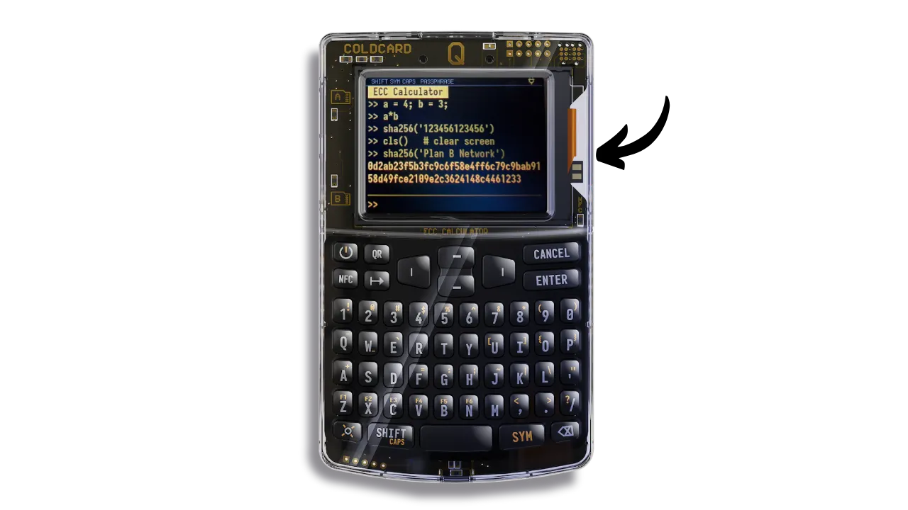

Untuk membuka kunci COLDCARD dari mode kalkulator, mulailah dengan memasukkan awalan PIN kamu lalu diikuti tanda hubung. Sebagai contoh, jika PIN kamu adalah `00-00` (PIN ini sangat lemah dan hanya digunakan sebagai ilustrasi, jadi pastikan memilih PIN yang kuat), cukup ketik `00-`. Setelah itu, COLDCARD akan menampilkan dua kata anti-phishing milikmu.

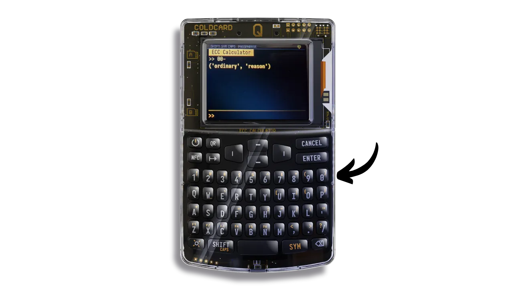

Kemudian masukkan kode PIN lengkap, dipisahkan dengan spasi atau tanda hubung, misalnya: `00 00`.

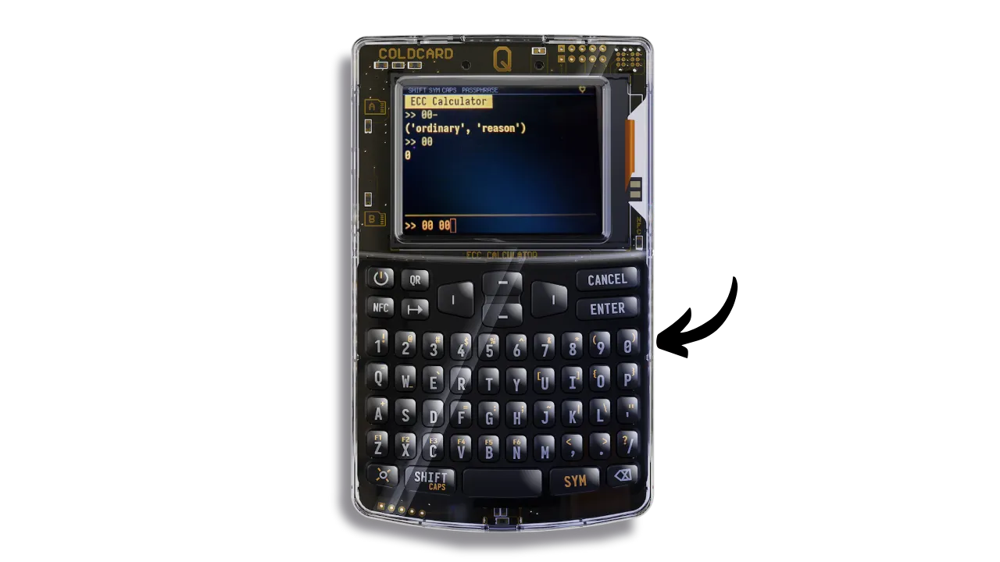

COLDCARD kemudian akan keluar dari mode kalkulator dan membuka kunci secara normal.

## Menghancurkan COLDCARD Anda dengan bersih

Jika kamu berencana membuang COLDCARD Q, misalnya karena sudah beralih ke dompet perangkat keras lain, penting untuk menghancurkan perangkat dengan cara yang benar. Tujuannya adalah memastikan tidak ada informasi apa pun yang terkait dengan dompetmu yang dapat dipulihkan oleh pihak ketiga.

Tersedia tiga tingkat penghancuran informasi, tergantung pada kebutuhanmu. Sebelum melanjutkan, pastikan dompetmu sudah diimpor ke dompet perangkat keras lain, kamu masih memiliki akses ke seluruh dana, dan yang paling penting, kamu memiliki frasa mnemonic serta kata sandi yang valid dan berfungsi. Tanpa cadangan dompet, penghancuran COLDCARD akan mengakibatkan hilangnya bitcoin secara permanen.

Tingkat penghancuran pertama adalah dengan menghapus *seed* saja. Opsi ini menghapus frasa mnemonic dari memori COLDCARD, tetapi perangkat tetap berfungsi normal. Metode ini ideal jika kamu berencana menggunakan COLDCARD Q kembali di masa mendatang. Untuk menghapus seed dari memori, buka menu  `Advanced/Tools > Danger Zone > Seed Functions > Destroy Seed`.

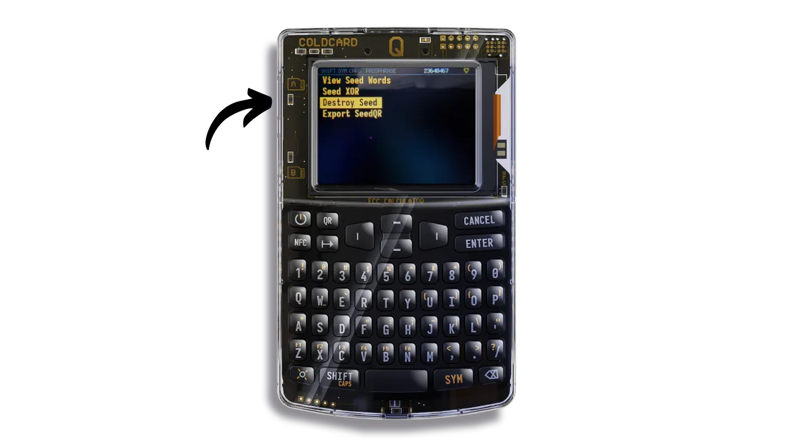

Tingkat penghancuran kedua adalah dengan menonaktifkan secara permanen dua *secure chip* COLDCARD melalui perangkat lunak. Tindakan ini membuat perangkat benar-benar tidak dapat digunakan. Kamu tidak akan bisa menjualnya kembali, menggunakannya lagi, atau mengembalikannya ke Coinkite. Perangkat akan hancur secara permanen. Untuk melakukannya, ikuti langkah-langkah yang dijelaskan pada bagian sebelumnya tentang *"Brick Me"*, lalu **sengaja** masukkan PIN tersebut saat membuka kunci COLDCARD.

Tingkat ketiga melibatkan penghancuran fisik komponen keamanan COLDCARD Q. Seperti tingkat sebelumnya, metode ini juga membuat perangkat tidak dapat digunakan lagi secara permanen. Caranya adalah dengan menggunakan bor untuk membuat lubang pada dua chip aman yang berada di sisi kanan atas perangkat (setelah dibalik), di dekat tulisan *"SHOOT HERE"*.

**Tindakan pencegahan penting**:

- Untuk menghindari risiko sengatan listrik, lepaskan baterai dari perangkat dan cabut semua sambungan daya sebelum menanganinya.
- Tunggu beberapa menit setelah perangkat dimatikan sebelum mulai mengebor.
- Gunakan sarung tangan berinsulasi dan kacamata pelindung untuk memastikan keselamatanmu.

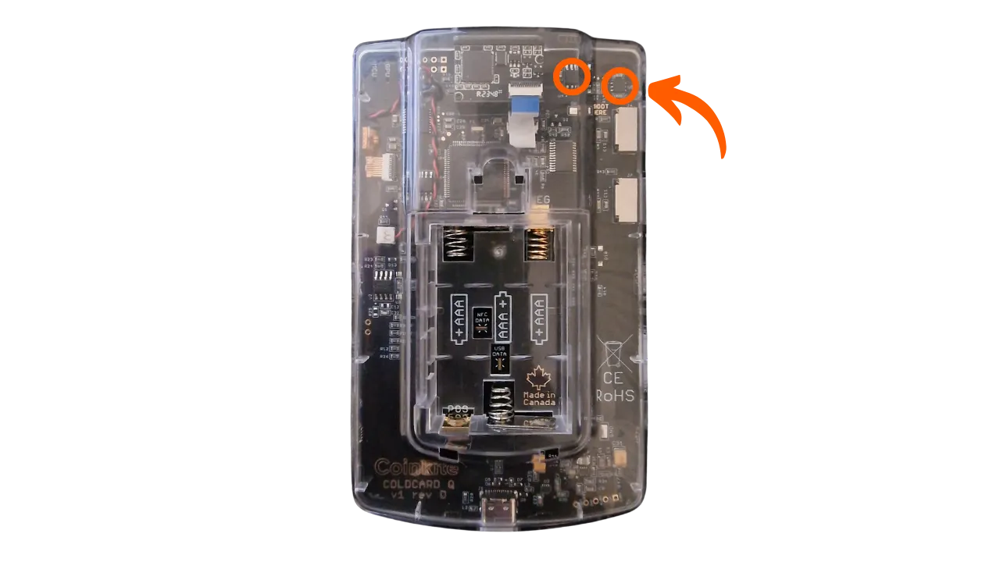

Setelah chip dilubangi, jangan sekali-kali mencoba menyambungkan kembali COLDCARD Q.

Selamat, kamu kini telah menguasai opsi lanjutan COLDCARD Q!

Jika kamu merasa tutorial ini bermanfaat, aku akan sangat berterima kasih jika kamu memberikan jempol hijau di bawah ini. Jangan ragu untuk membagikan tutorial ini di jejaring sosialmu. Terima kasih banyak!

Aku juga merekomendasikan tutorial berikut, yang membahas penggunaan pesaing langsung CCQ, yaitu Ledger Flex:

https://planb.academy/tutorials/wallet/hardware/ledger-flex-3728773e-74d4-4177-b39f-bd923700c76a
