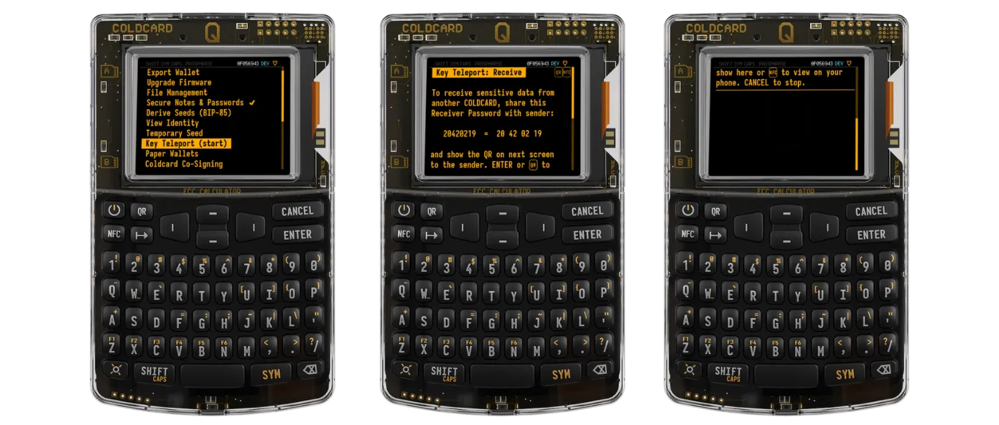
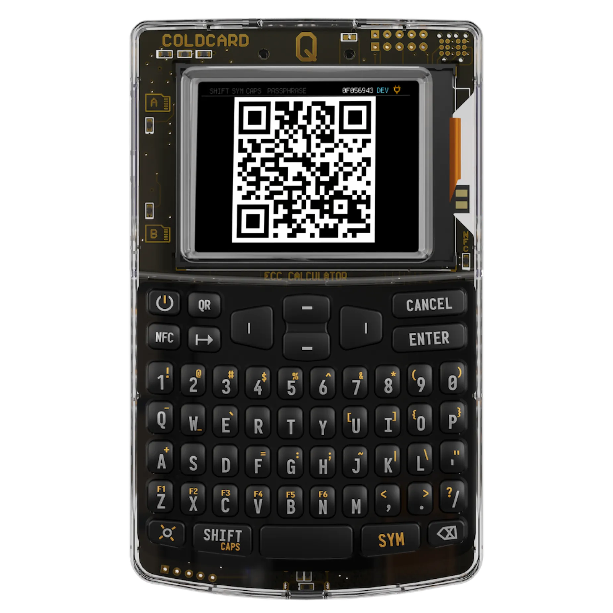
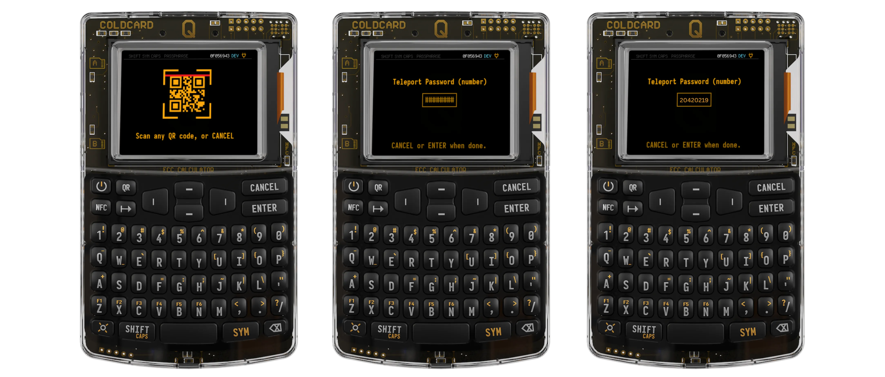
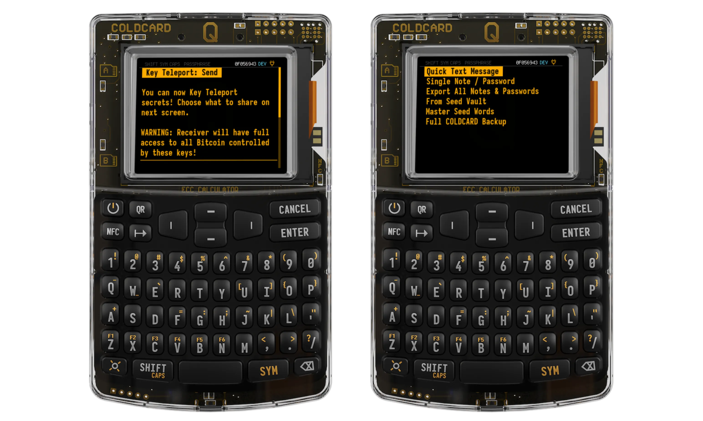
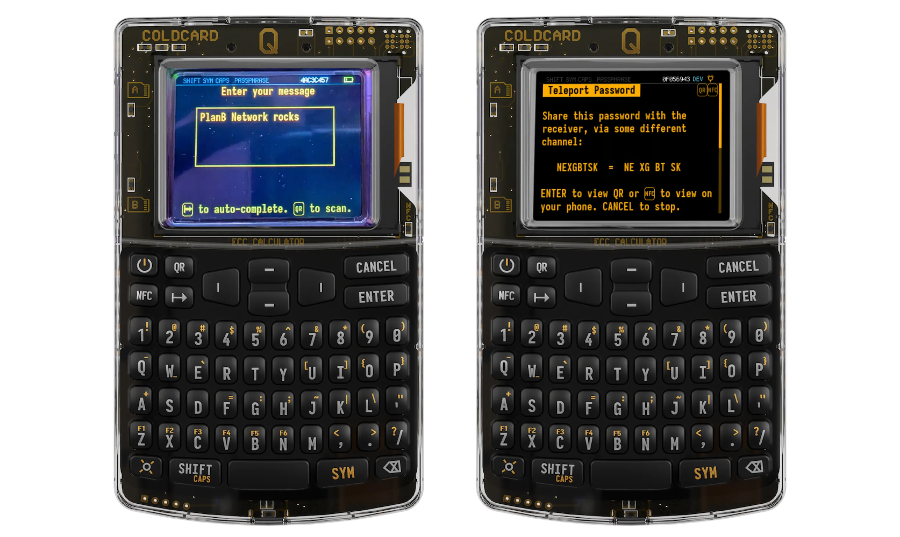
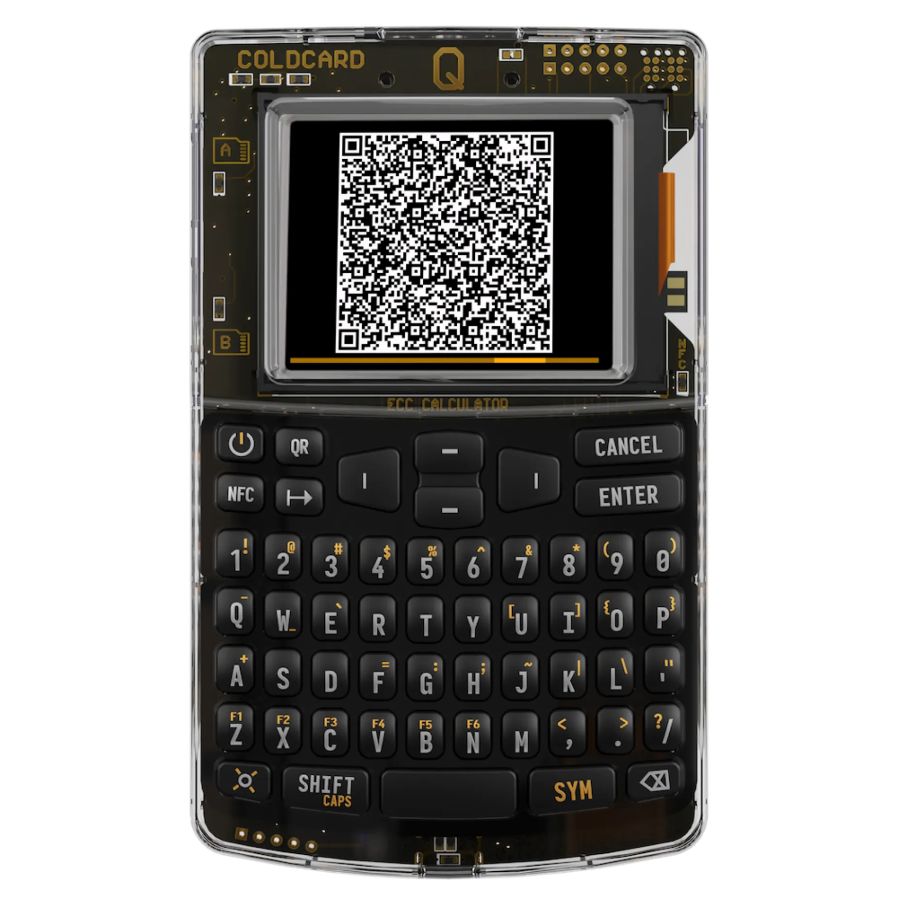
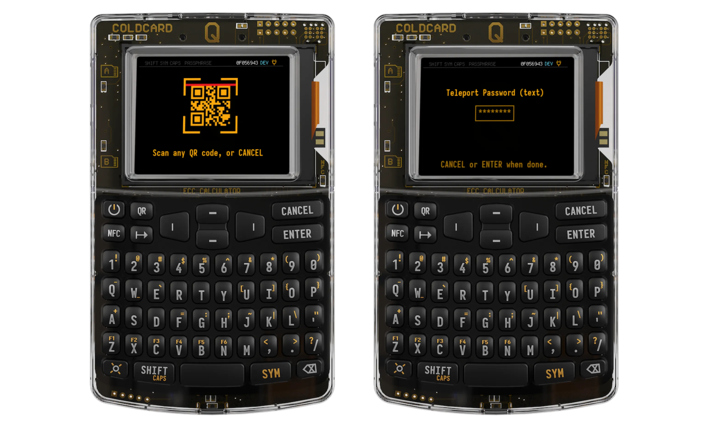
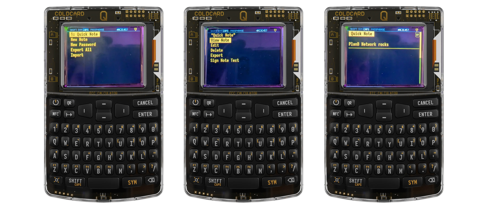

https://www.youtube.com/watch?v=Bg0r0DQVcDg

https://www.youtube.com/watch?v=BRpBiK-F8VU

Qu'est ce que la fonctionnalité Key Teleport proposée par Coinkite grâce à son appareil flagship ColdCardQ ?

Key Teleport permet de transférer de manière sécurisée des données confidentielles entre 2 ColdCardQ. Le canal de transmission n'a même pas besoin d'être chiffré et peut être public.

Cela peut servir à transférer:

- **des seed phrases** (la master seed du ColdCard Q ou les secrets stockés dans le [Seed Vault](https://coldcard.com/docs/temporary-seeds/#seed-vault) du ColdCardQ)
- **des notes confidentielles et des mots de passe**: ça peut-être un secret quelconque ou l'entièreté du répertoire  [Secure Notes & Passwords](https://coldcard.com/docs/secure_notes/) de votre ColdCardQ.
- **un backup de l'entièreté de votre ColdCardQ**: le ColdCardQ qui reçoit ce backup ne doit pas avoir de Master Seed pour que cela fonctionne
- **des PSBT ( Partially Signed Bitcoin Transactions dans le cadre d'un schéma multi signature**)

# Comment utiliser Key Teleport ?

## 1- Pour transférer tout type de données

Ici on s'intéressera au transfert de seed phrases, de notes, de mots de passe, ou d'un transfert entier du backup d'un ColdCardQ. Le cas des transferts de PSBT pour les transactions multi signatures sera abordé dans un second temps.

### Préparer l'appareil qui recevra les secrets

Dans le menu **"Advanced / Tool**" de votre ColdCardQ, sélectionnez **"Key Teleport (start)"**.
Sur l'écran suivant un mot de passe composés de 8 chiffres vous est proposé ici "20420219". il vous faudra communiquer ce mot de passe à l'envoyeur. Utilisez par exemple un sms pour transmettre ce mot de passe, ou votre messagerie sécurisée favorite, ou encore un appel vocal.

Ensuite cliquez sur le bouton "Enter" de votre ColdCardQ pour passer à l'étape suivante.

Un QR code est généré à l'écran. Vous devrez là encore communiquez ce QR code au ColdCardQ "envoyeur". Le plus simple est de le faire via un appel visio. **ATTENTION ! IL NE FAUT SURTOUT PAS COMMUNIQUER CE QR CODE A TRAVERS LE MÊME CANAL DE TRANSMISSION QUI A SERVIT A L'ENVOI DU MOT DE PASSE DE 8 CHIFFRES PRECEDENT**.

*Pour ceux que ça intéresse, essayons de comprendre le mécanisme sous-jacent permettant ce transfert de secrets à travers des canaux non sécurisés.
Nous sommes en fait là entrain d'initier un transfert de secrets via la méthode Diffie-Hellmann, abordée dans le cours BTC204 que je vous mets en dessous.

[Plan ₿ Network - La confidentialité sur Bitcoin - BIP47 et codes de paiements réutilisables](https://planb.network/fr/courses/65c138b0-4161-4958-bbe3-c12916bc959c/bip47-et-codes-de-paiements-reutilisables-ad88e076-a04b-4aec-b3b2-7b4760175504)*

*Nous avons:*
- *généré une paire de clés éphémère (publique/privée respectivement Ka et ka avec Ka=G.ka, G étant le point générateur de ECDH), ainsi qu'un mot de passe à 8 chiffres*
- *utilisé ce mot de passe pour chiffrer la clé publique (Ka) via AES-256-CTR, puis transmis ce mot de passe par un canal de communication A au ColdCardQ "envoyeur".*
- *enfin nous avons transmis le paquet chiffrées à l'envoyeur via le QR code ci-dessus, par un second canal de communication B différent du 1er*

### Préparer l'appareil qui enverra les secrets

Depuis l'appareil envoyeur, cliquer sur le bouton **"QR"** pour scanner le QR code qui vous est transmis par l'appareil receveur, puis entrez le mot de passe à 8 chiffres qui vous a été communiqué à l'étape précédente par un canal séparé. Nous sommes désormais en mesure de commencer l'envoi des données à partir de l'appareil "envoyeur"

**Attention ne vous trompez pas en entrant le mot de passe à 8 chiffres car aucun message d'erreur ne sera affiché et le processus continuera. Cependant le transfert final des donnés échouera et il vous faudra recommencer**

 *Pour les plus curieux d'entre vous intéressons nous là encore à ce que nous sommes entrain de réaliser d'un point de vue cryptographique et de transfert de secrets:*
- *nous avons importé les données chiffrées en scannant le QR code de l'appareil receveur*.
- *puis nous les avons déchiffrées en utilisant le mot de passe à 8 chiffres qui nous avait été transmis par un canal secondaire*
- *nous sommes donc en possession de la clé publique (Ka) générée par le receveur initialement.*
- *Nous générons ensuite sur l'appareil envoyeur une nouvelle paire de clé éphémère (Kb/kb, avec  là encore Kb=G.kb) que nous l'utilisons pour appliquer ECDH sur Ka. On réalise donc l'opération kb.Ka=Ks , où Ks est appelée **"Session Key"**.* 

Il vous est maintenant demandé de choisir la nature des données à transmettre entre les 2 ColdCardQ (notes confidentielles, mot de passe, backup complet, seeds contenues dans votre vault, master seed de l'appareil). Une fois le choix fait, l'appareil génère un nouveau mot de passe aléatoire appelé **"Teleport Password"** dans l'exemple NE XG BT SK.

Ici choisissons de transmettre un message court en choisissant "Quick Text Message". Tapez au clavier votre message puis pressez **"ENTER"**.
L'appareil génère ensuite un nouveau mot de passe aléatoire appelé **"Teleport Password"** , dans l'exemple "NE XG BT SK".

Pressez **"ENTER"** et un nouveau QR code vous sera présenté. Faites le scanner par l'appareil receveur. Et sur un canal de communication différent, transmettez le **"Teleport Password"**.

*Là encore pour les curieux, nous avons lors de cette étape:*
- *après avoir sélectionné les données à transmettre nous générons un nouveau mot de passe aléatoire appelé **"Teleport Password"***
- *nous chiffrons ensuite ces données via AES-256-CTR en utilisant la **"Session Key"** Ks évoquée lors de l'étape précédente.*
- *on accole en préfixe du paquet déjà chiffré par la **"Session Key"** la clé publique Kb, puis nous rajoutons une  couche de chiffrement AES-256-CTR supplémentaire avec le **"Teleport Password"**. Le tout est ensuite encodé sous forme de QR code.*

### Finaliser le transfert de secrets sur l'appareil receveur

Appuyez sur le bouton **"QR"** pour scanner le QR code présenté par l'appareil envoyeur à travers le canal visio. Il vous sera demandé de rentrer votre mot de passe **"Teleport Password"** pour nous "NE XG BT SK" . 

Les données sont ensuite déchiffrées et intelligibles pour l'appareil receveur. C'est terminé.

*Que s'est-il passé concrètement lors de cette dernière étape :
- *nous avons déchiffré les données transmises par l'envoyeur en utilisant le **"Teleport Password"**.*
- *nous sommes donc en possession de la clé publique Kb et du message secret chiffré par la **"Session Key"**,  "Ks". Mais comment faire si en tant que receveur on ne connait pas Ks qui a été créé par l'envoyeur ?*
- *Il nous faut appliquer notre clé privée "ka" de l'étape initiale **"Préparer l'appareil qui recevra les données"** à Kb via ECDH.* 
- *En effet en effectuant le calcul ka.Kb = ka.kb.G=kb.ka.G=kb.Ka=Ks on retrouve Ks. Qu'on utilise enfin pour déchiffrer le message secret.*

## 2- Pour transférer des PSBT pour Multisig (avancé)

Cela présuppose