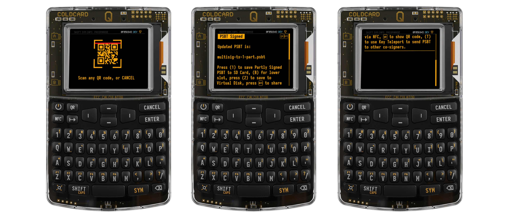
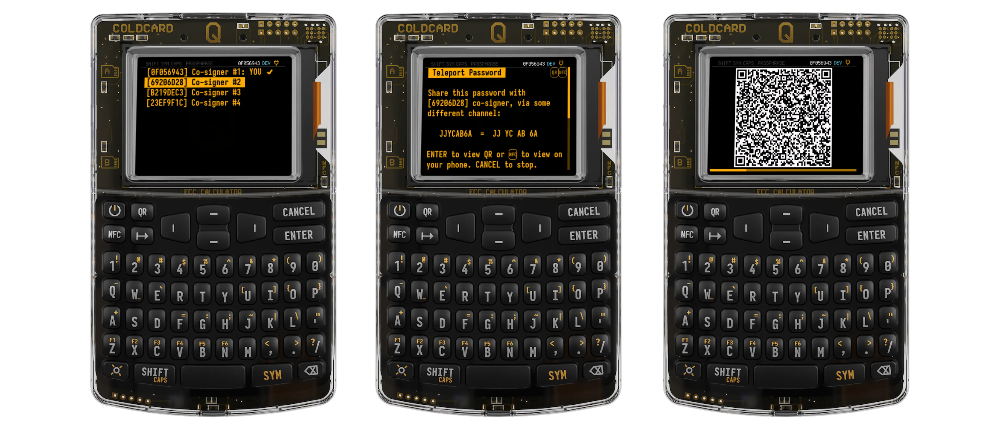
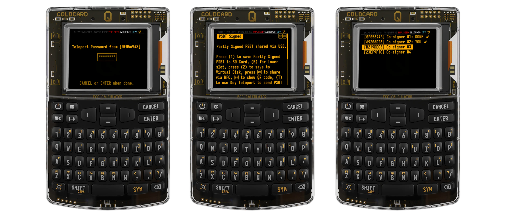
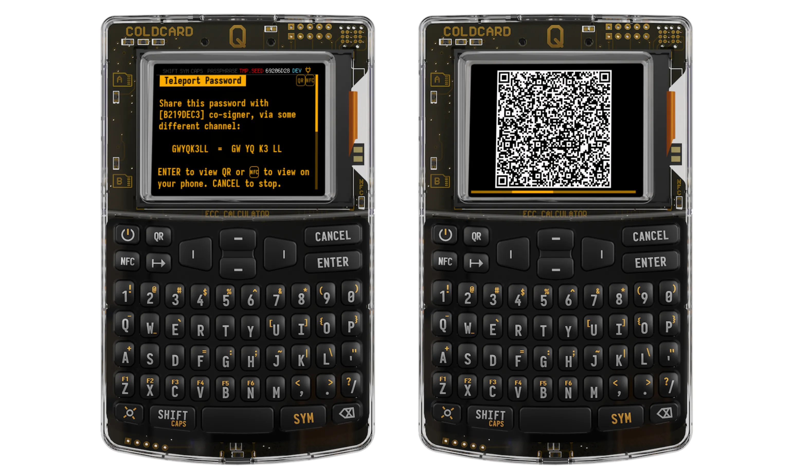
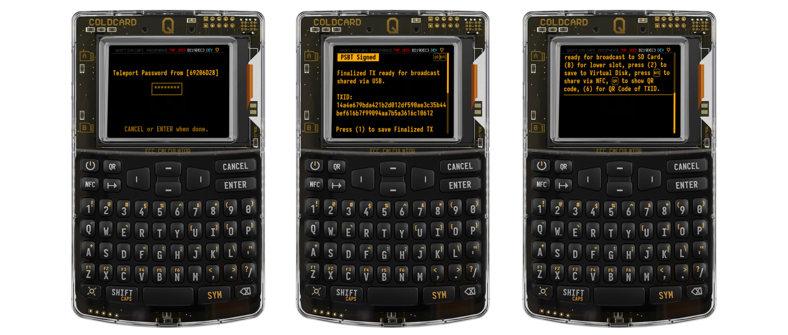
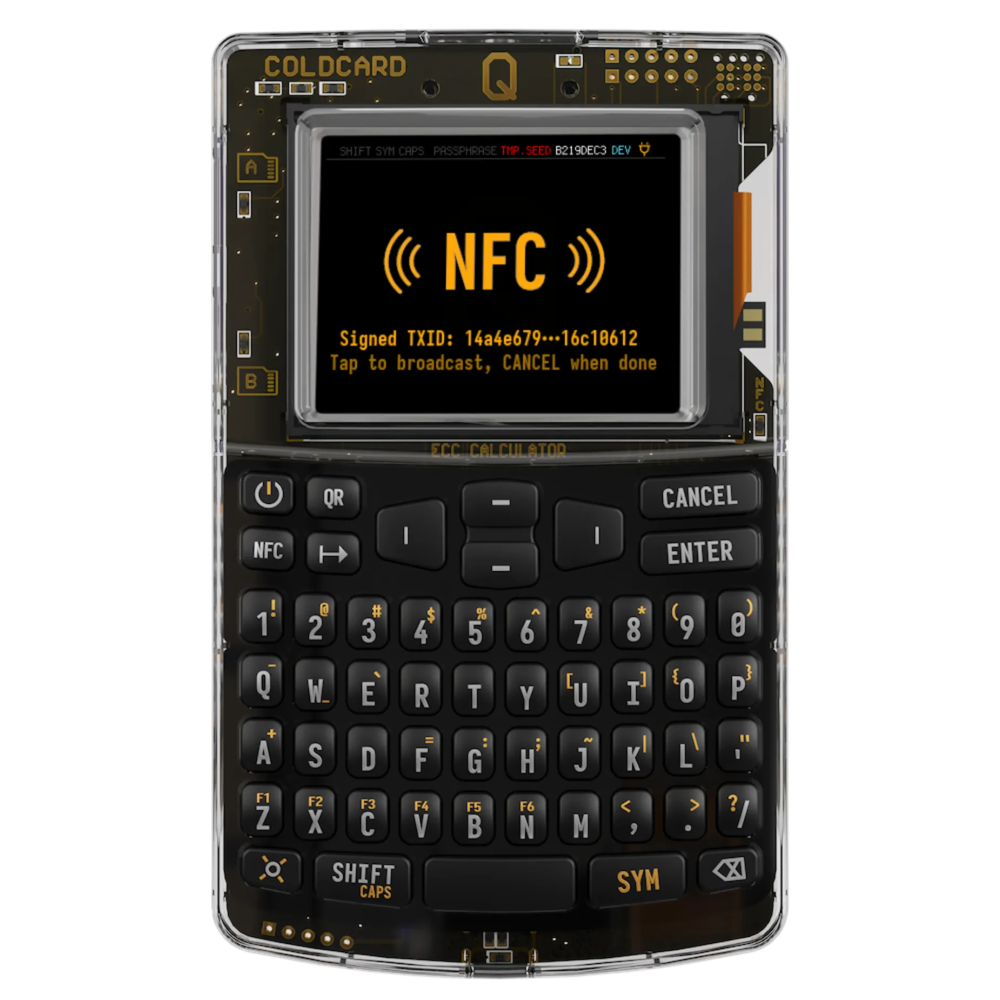
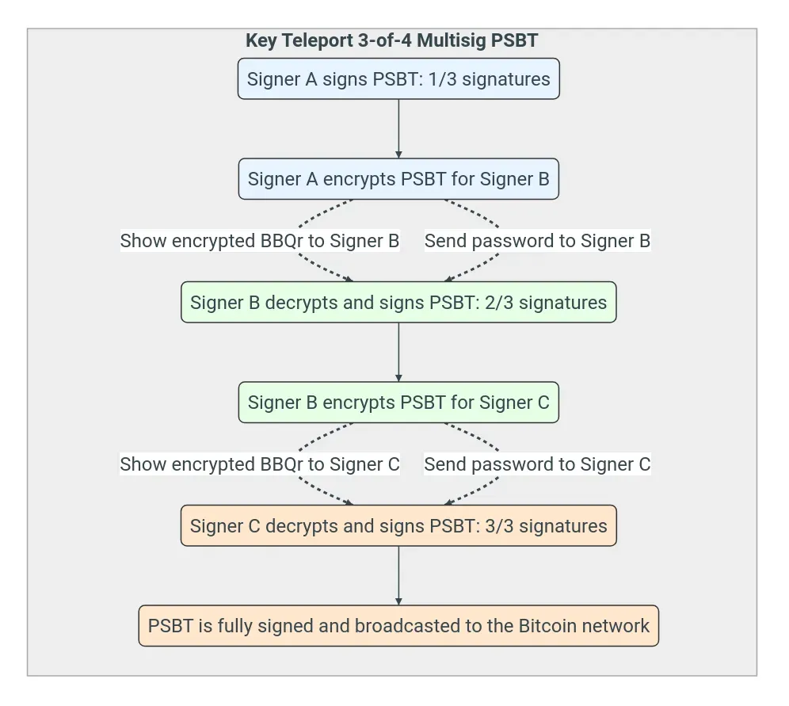

Apa saja fitur **Key Teleport** yang ditawarkan oleh Coinkite dengan perangkat ColdCardQ andalannya?

**Key Teleport** memungkinkanmu mentransfer data rahasia dengan aman di antara 2 ColdCardQ. Saluran transmisi bahkan tidak perlu dienkripsi, dan dapat bersifat publik.

Ini dapat digunakan untuk mentransfer:

- gW-0 **frasa** (Master seed ColdCard Q atau rahasia yang disimpan dalam [seed Vault] ColdCardQ (https://coldcard.com/docs/temporary-seeds/#seed-vault).
- **catatan dan kata sandi rahasia**: ini dapat berupa rahasia apa pun atau seluruh direktori [Catatan dan Kata Sandi Rahasia](https://coldcard.com/docs/secure_notes/) pada ColdCardQ Anda.
- **cadangan seluruh ColdCardQ kamu**: ColdCardQ yang menerima cadangan ini tidak boleh memiliki seed Master agar dapat berfungsi.
- gW-3 (**Transaksi Bitcoin yang Ditandatangani Sebagian**) sebagai bagian dari skema multi-tanda tangan.

Hal ini mengharuskanmu untuk meng-upgrade [firmware perangkat ke versi v1.3.2Q](https://coldcard.com/docs/upgrade/) atau lebih tinggi.

## Bagaimana cara menggunakan Key Teleport?

### 1- Untuk mentransfer semua jenis data

Di sini, kita akan melihat transfer seed kalimat, catatan, kata sandi, atau seluruh transfer cadangan ColdCardQ. Kasus transfer PSBT untuk transaksi multi-tanda tangan akan dibahas nanti.

#### Siapkan perangkat untuk menerima rahasia

Pada menu **"Advanced / Tools**" pada ColdCardQ Anda, pilih **"Key Teleport (start) "**.

Pada layar berikutnya, kata sandi 8 digit diusulkan, di sini "20420219". Kamu harus menyampaikan kata sandi ini kepada pengirim. Gunakan sms, misalnya, untuk mengirim kata sandi ini, atau sistem perpesanan aman favorit kamu, atau bahkan panggilan suara.

Kemudian klik tombol **"Enter**" pada ColdCardQ kamu untuk melanjutkan ke langkah berikutnya.

Kode QR dihasilkan di layar. Sekali lagi, kamu harus mengomunikasikan kode QR ini ke "pengirim" ColdCardQ. Cara termudah untuk melakukannya adalah melalui panggilan video.

**JANGAN MENGIRIM KODE QR INI MELALUI SALURAN TRANSMISI YANG SAMA DENGAN YANG DIGUNAKAN UNTUK MENGIRIM KATA SANDI 8 DIGIT SEBELUMNYA**.

*Bagi kamu yang tertarik, mari kita coba memahami mekanisme yang mendasari yang memungkinkan rahasia ditransfer melalui saluran yang tidak aman*

*Apa yang sebenarnya kita lakukan di sini adalah memulai transfer rahasia melalui metode Diffie-Hellman, yang tercakup dalam kursus BTC204 yang saya sertakan di bawah ini*

https://planb.academy/courses/65c138b0-4161-4958-bbe3-c12916bc959c

*Saat ini kami memiliki:*

- menghasilkan pasangan kunci sementara (publik/privat masing-masing Ka dan ka dengan Ka = G.ka, G adalah titik generator ECDH), dan kata sandi 8 digit.
- menggunakan kata sandi ini untuk mengenkripsi kunci publik (Ka) melalui AES-256-CTR, lalu mengirimkan kata sandi ini melalui saluran komunikasi A ke "pengirim" **ColdCardQ**.
- terakhir, kami mengirimkan paket terenkripsi ke pengirim melalui kode QR di atas, menggunakan saluran komunikasi kedua B yang berbeda dari saluran pertama.

#### Persiapkan perangkat yang akan mengirim rahasia

Dari perangkat pengirim, klik tombol **"QR"** untuk memindai kode QR yang dikirimkan kepadamu oleh perangkat penerima, lalu masukkan kata sandi 8 digit yang sudah dikomunikasikan kepadamu pada langkah sebelumnya melalui saluran terpisah. Kita sekarang siap untuk mulai mengirim data dari perangkat **"pengirim"**.

**Harap jangan salah memasukkan kata sandi 8 digit, karena tidak akan ada pesan kesalahan yang ditampilkan dan proses tetap akan dilanjutkan. Namun, transfer data terakhir akan gagal dan kamu harus memulai ulang dari awal**.

*Bagi kamu yang penasaran, mari kita lihat lagi apa yang kita lakukan dalam hal kriptografi dan transfer rahasia:*

- kita mengimpor data terenkripsi dengan memindai kode QR pada perangkat penerima.
- kemudian kita mendekripsinya menggunakan kata sandi 8 digit yang dikirimkan kepada kita melalui saluran sekunder.
- oleh karena itu, kita memiliki kunci publik (Ka) yang dihasilkan oleh penerima pada awalnya.
- kita kemudian generate pasangan kunci sementara baru (Kb/kb, dengan Kb = G.kb) pada perangkat pengirim, yang kita gunakan untuk menerapkan ECDH ke Ka. Oleh karena itu, kita melakukan operasi kb.Ka = Ks, di mana Ks disebut **"Kunci Sesi"**.

Kamu sekarang diminta untuk memilih sifat rahasia yang akan dikirimkan antara 2 COLDCARD Q (catatan rahasia, kata sandi, cadangan penuh, seedphrase yang ada di brankas kamu, master seed perangkat).

Di sini rahasia kita adalah pesan singkat dengan memilih **"Pesan Teks Cepat "**. Ketik pesan kamu (untuk kita "Plan ₿ Academy rocks") lalu tekan **"ENTER "**.

Perangkat kemudian menghasilkan kata sandi acak baru yang disebut **"Kata Sandi Teleportasi "**, dalam contoh "NE XG BT SK".

Tekan **"MASUK "** dan kamu akan mendapatkan kode QR baru. Pindai kode tersebut oleh perangkat penerima. Dan pada saluran komunikasi yang berbeda, kirimkan **"Teleport Password "** ke perangkat penerima.

*Sekali lagi, bagi kamu yang penasaran, selama tahap ini:*

- setelah memilih rahasia yang akan dikirimkan, kita membuat kata sandi acak baru yang disebut **"Kata Sandi Teleportasi"**.
- kita kemudian mengenkripsi rahasia tersebut menggunakan AES-256-CTR dengan **"Kunci Sesi"**, "Ks", yang dihasilkan pada langkah sebelumnya.
- kita mengawali paket yang sudah dienkripsi dengan **"Kunci Sesi "** menggunakan kunci publik Kb milik kita, lalu menambahkan lapisan enkripsi AES-256-CTR tambahan dengan **"Kata Sandi Teleportasi "**. Seluruhnya kemudian dikodekan sebagai kode QR.

#### Menyelesaikan transfer rahasia ke perangkat penerima

Tekan tombol **"QR "** untuk memindai kode QR yang ditampilkan oleh perangkat pengirim melalui saluran visual. Kamu akan diminta untuk memasukkan **"Kata Sandi Teleportasi "**, untuk kita contohnya "NE XG BT SK".

Data tersebut kemudian didekripsi dan dapat dipahami oleh perangkat penerima. Pesan yang diterima memang "Plan ₿ Academy rocks". Itu saja.

*Apa yang sebenarnya terjadi selama tahap terakhir ini :*?

- kita telah mendekripsi data yang dikirimkan oleh pengirim menggunakan **"Kata Sandi Teleportasi"**.
- oleh karena itu, kita memiliki kunci publik Kb dan pesan rahasia kita masih dienkripsi dengan **"Kunci Sesi "**, "Ks". Namun, bagaimana kita bisa melakukannya karena sebagai penerima kita tidak mengetahui Ks, yang dibuat oleh pengirim?
- kita perlu menerapkan kunci privat "ka" dari langkah awal **"Siapkan perangkat yang akan menerima data"** ke kunci publik Kb.
- faktanya, dengan menghitung ka.Kb = ka.kb.G = kb.ka.G = kb.Ka = Ks, kita menemukan Ks, yang pada akhirnya digunakan untuk menguraikan pesan rahasia tersebut.

### 2- Untuk mentransfer PSBT ke Multisig (lanjutan)

Hal ini mengandaikan bahwa Wallet Multisig Anda telah dibuat dan perangkat ColdCardQ kamu telah diatur untuk dapat melakukan transaksi multi-tanda tangan. Jika tidak demikian, penjelasannya tersedia [di sini](https://coldcard.com/docs/Multisig/) di situs web Coinkite.

Pengingat singkat tentang apa itu Wallet multi-tanda tangan (Multisig).

Biasanya, untuk membelanjakan dana di Wallet kamu, hanya dibutuhkan satu private key untuk membuka kunci UTXO yang terkait dengan alamat kamu.

Dalam kasus Wallet Multisig, hingga 15 private key dan dengan demikian 15 tanda tangan dapat diperlukan untuk membelanjakan dana. Ini dikenal sebagai skema "M dari N", dengan N berada di antara 1 dan 15, dan M adalah jumlah tanda tangan yang dibutuhkan agar dana dapat dibelanjakan. Sebagai contoh, Wallet Multisig 3 dari 5 akan membutuhkan setidaknya 3 tanda tangan dari total 5 kemungkinan tanda tangan.

Tantangannya kemudian adalah bagaimana cara berkoordinasi antar penandatangan untuk menandatangani "PSBT" atau "Partially Signed Bitcoin Transaction" secara bergantian. Dalam konteks ini, **"Key Teleport"** dapat digunakan untuk mengirimkan PSBT di antara para penandatangan dengan cara yang sederhana dan rahasia. Panggilan video sederhana antar penandatangan sudah cukup untuk melakukannya.

Berikut ini cara melakukannya pada skema Multisig 3 dari 4.

**Penandatangan 1:**

Penandatangan 1 mengimpor dan menandatangani PSBT. Terakhir, dia mengklik **"T "** untuk menggunakan **"Key Teleport "** untuk mengirimkan PSBT ke penandatangan 2.

Setelah memilih penandatangan 2 dengan mengeklik **"MASUK "**, "TELEPORT PASSWORD" (di sini JJ YC AB 6A) disediakan, yang harus dikirim ke penandatangan 2 melalui saluran komunikasi lain. Misalnya, SMS atau panggilan suara, tetapi **bukan** panggilan video.

Tekan **"ENTER "** sekali lagi dan kode QR yang mewakili PSBT yang ditandatangani oleh 1 kemudian dienkripsi dengan "TELEPORT PASSWORD" akan muncul.

**Penandatangan 2:**

Penandatangan 2 memindai kode QR yang diberikan oleh penandatangan 1. Kemudian masukkan "TELEPORT PASSWORD" yang dikirimkan melalui saluran komunikasi sekunder untuk mendekripsi data yang dikirimkan.

Penandatangan 2 menandatangani transaksi dan kemudian mengklik **"T "** untuk mengirimkan PSBT ke penandatangan 3 melalui "Key Teleport".

Jelas, 2 tanda tangan telah diterapkan. Yang kurang hanyalah penandatangan 3 agar transaksi menjadi valid. Pilih penandatangan 3 dengan mengklik **"MASUK "**.

Dan "TELEPORT PASSWORD" baru dibuat, diikuti lagi dengan kode QR yang mengkodekan PSBT yang ditandatangani oleh 1 dan 2 dan kemudian dienkripsi oleh "TELEPORT PASSWORD" yang baru ini (GW YQ K3 LL).

**Penandatangan 3:**

Ulangi langkah yang sama seperti di atas.

Penandatangan 3 memindai kode QR yang diberikan kepadanya oleh penandatangan 2. Kemudian masukkan "SANDI TELEPORT" yang dikirimkan oleh saluran komunikasi sekunder.

Penandatangan 3 menandatangani transaksi dan kali ini, karena 3 dari 4 tanda tangan telah diterapkan, transaksi diindikasikan telah selesai, dan siap untuk didistribusikan melalui berbagai media (SD Card, NFC, QR, dll.).

Jika fitur "Push Tx" di COLDCARD Q kamu diaktifkan, cukup tempelkan COLDCARD Q di bagian belakang perangkat yang terhubung ke Internet (smartphone atau tablet) yang mendukung NFC untuk menyiarkan transaksi melalui jaringan Bitcoin.

*Untuk transfer PSBT dari satu penandatangan ke penandatangan lainnya, "Key Teleport" hanya digunakan melalui "Teleport Password" pada setiap tahap, yang mengenkripsi PSBT saat ditransfer dari satu penandatangan ke penandatangan lainnya. Karena data yang ditransmisikan tidak dapat digunakan untuk mencuri dana, maka Diffie-Hellman tidak diperlukan, berbeda dengan saat mengirimkan rahasia yang sangat sensitif (seed, kata sandi, dan lain-lain).*

*Sumber: [Situs web resmi ColdCard](https://coldcard.com/)*
