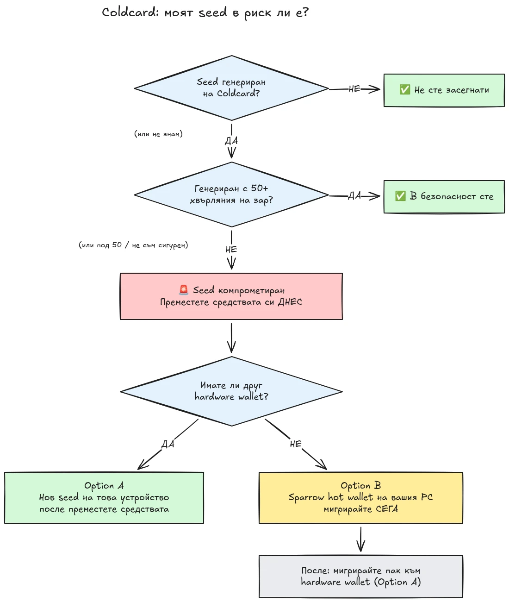

На 30 юли 2026 г. приблизително 594 BTC (около 38 милиона долара) бяха откраднати за по-малко от половин час от около 500 портфейла, чиито сийдове са били генерирани на хардуерни портфейли Coldcard, и атаката все още продължава. Основната причина е дефект във фърмуера при генерирането на сийдове от устройствата Coldcard: вместо да разчитат на достатъчна хардуерно генерирана случайност, засегнатите устройства са смесвали предвидими стойности като вътрешен брояч надолу, серийния номер на устройството и вътрешния часовник. В резултат сийд фразите, генерирани на тези устройства, съдържат много по-малко ентропия от очакваното и могат да бъдат намерени от нападател **без никакво действие от ваша страна**, не са нужни нито злонамерен софтуер, нито фишинг, нито физически достъп. Нападателят просто претърсва намаленото пространство на ключовете и източва всеки портфейл, който намери.

**Всички модели Coldcard са засегнати: Mk3, Mk4, Mk5 и Q.** Единствените сийдове, които се считат за безопасни, са тези, генерирани чрез метода с хвърляне на зарове, и то само ако са използвани поне 50 хвърляния на зарове. Ако не знаете, не помните или не сте сигурни как е генериран вашият сийд: третирайте го като компрометиран и преместете средствата си незабавно.

Този урок обяснява как да прецените своята експозиция и как да мигрирате средствата си към сигурен портфейл, бързо, но без да влошите нещата в процеса.

## В едно каре: простите инструкции

Bitcoin общността по сигурност координира действията си около един фиксиран набор от прости инструкции. Ето го:

1. **Генерирахте ли своя сийд с 50+ физически хвърляния на зарове на Coldcard?** Ако да, в безопасност сте. Ако не, или ако не сте сигурни, приемете, че сийдът е компрометиран.
2. **Подгответе безопасна дестинация**: хардуерен портфейл от друг производител, ако имате такъв под ръка, иначе Sparrow hot wallet, генериран на вашия компютър (подробности в Стъпка 2).
3. **Изпратете всички свои средства там още днес**, с такса, насочена към следващия блок, и изчакайте потвърждение (подробности в Стъпка 3).
4. **Една passphrase ви купува време, не безопасност.** Изглежда нападателите все още не изчисляват passphrase-и масово, мигрирайте, преди да започнат.
5. **Никога не въвеждайте сийд фразата си никъде**, за да я „проверите“. Всеки, който иска вашите думи, е измамник.
6. **Обновяването на фърмуера не поправя съществуващ сийд.** Сийд, генериран от уязвим фърмуер, остава слаб завинаги; само нов сийд и on-chain преместване защитават средствата ви.

Останалата част от този урок разглежда подробно всяка стъпка.

## Засегнат ли съм?

Задайте си един въпрос: **как беше генериран сийдът?**

- Сийд, генериран **от самия Coldcard** (нормалният поток „new wallet“, на който и да е модел, Mk3, Mk4, Mk5 или Q): **третирайте го като компрометиран**. Мигрирайте сега.
- Сийд, генериран с функцията на Coldcard за **хвърляне на зарове**, с **поне 50 физически хвърляния на зарове**, които сте извършили лично: ентропията е дошла от вашите зарове, не от дефектния генератор. Това е единствената конфигурация, която в момента се счита за безопасна.
- Хвърляне на зарове с **по-малко от 50 хвърляния**, или ако сте оставили устройството да „допълни“ ентропията: не е достатъчно, третирайте го като компрометиран.
- Сийд, **импортиран от друго устройство (което не е Coldcard)**: дефектът на Coldcard не се отнася за този сийд, но проверете откъде първоначално е дошъл.
- **Не знаете или не помните**: третирайте го като компрометиран. Цената на ненужна миграция е такса за трансакция; цената на грешно предположение е всичко.

Две често срещани фалшиви успокоения, разгледани изрично:

- **BIP39 passphrase** върху засегнат сийд не прави портфейла безопасен, тя само купува време. Самият сийд може да бъде открит, така че вашата passphrase става единствената бариера, а хората обикновено са лоши в оценяването на ентропията на passphrase-и. Изглежда нападателите все още не атакуват passphrase-и с груба сила; мигрирайте към нов сийд, преди да започнат.
- **Multisig** портфейл, който включва засегнат ключ от Coldcard, не може да бъде източен само чрез този ключ, но засегнатият ключ вече не допринася реална сигурност. Извадете го от кворума без забавяне.

## Стъпка 1: Действайте сега, но не импровизирайте

Портфейли се източват, докато четете това. Правилната позиция е да мигрирате **днес**, използвайки инструменти, които разбирате, а не да избързате с трансакция за пет минути с непозната настройка и да изпратите монетите си в небитието.

Преди всичко друго:

1. Оставете вашия Coldcard и резервното копие на сийда си там, където са. Все още са ви нужни, за да подпишете миграционната трансакция.
2. **Никога не въвеждайте сийд фразата си в компютър, телефон или уебсайт „за да проверите дали е засегната“.** Нито един легитимен инструмент за проверка не изисква вашия сийд. Всеки, който иска вашите 12 или 24 думи, е измамник, който експлоатира този инцидент, а phishing кампаниите надеждно се увеличават след събития като това.
3. Получавайте информация само от официалния блог и каналите за поддръжка на Coinkite, както и от утвърдени Bitcoin новинарски източници.

## Стъпка 2: Подгответе безопасен портфейл дестинация

Нужен ви е портфейл, чийто сийд **не е генериран на Coldcard**. Има два пътя според това какво имате под ръка:

### Вариант A: Имате друг хардуерен портфейл под ръка

Това е най-добрият път. Генерирайте **нов сийд** на хардуерен портфейл от друг производител и мигрирайте средствата си там. Имаме уроци стъпка по стъпка за основните устройства:

https://planb.academy/tutorials/wallet/hardware/jade-7d62bf0c-f460-4e68-9635-af9b731dabc3

https://planb.academy/tutorials/wallet/hardware/bitbox02-6af8940f-e19b-4008-8c83-81017032608c

https://planb.academy/tutorials/wallet/hardware/trezor-safe-3-51d0d669-5d23-47c2-beb6-cc6fa0fb0ea0

https://planb.academy/tutorials/wallet/hardware/ledger-flex-3728773e-74d4-4177-b39f-bd923700c76a

https://planb.academy/tutorials/wallet/hardware/passport-74e53858-3fa2-43f9-b866-573297546236

За максимална увереност генерирайте сийда от **физически хвърляния на зарове (поне 50 хвърляния)** на устройство, което го поддържа, така че ентропията да е проверимо ваша. А за значителни суми използвайте този момент, за да преминете към **multisig с различни производители**, така че дефект в едно устройство никога повече да не може сам да изложи средствата ви на риск.

### Вариант B: Нямате друг хардуерен портфейл: обезопасете средствата СЕГА

Не чакайте дни за доставка на устройство, докато вашият сийд стои в претърсимо пространство на ключовете. Като **временно убежище** създайте hot wallet със сийд, **генериран директно на вашия компютър със Sparrow Wallet**:

https://planb.academy/tutorials/wallet/desktop/sparrow-c674e2ac-d46f-4c82-92a7-7d1b0e262f5d

Или на телефона си, с Blockstream App:

https://planb.academy/tutorials/wallet/mobile/blockstream-app-onchain-e84edaa9-fb65-48c1-a357-8a5f27996143

Да, hot wallet обикновено е крачка надолу спрямо хардуерен портфейл, но сийд на онлайн компютър, който контролирате, в момента е **по-безопасен от сийд на Coldcard, който нападател може да изчисли**. След като новият ви хардуерен портфейл пристигне, направете втора миграция от hot wallet-а към него, следвайки Вариант A.

Настройте портфейла дестинация напълно, преди да докоснете старите си средства: генерирайте сийда, запишете резервното копие и **извършете тест за възстановяване**, възстановете от написаното си резервно копие, за да докажете, че работи. След това генерирайте първи адрес за получаване и го проверете на екрана на устройството.

https://planb.academy/tutorials/wallet/backup/recovery-test-5a75db51-a6a1-4338-a02a-164a8d91b895

Ако времевият натиск ви принуди да пропуснете теста за възстановяване, дръжте сумата на миграцията във вашия *списък за наблюдение* и в рамките на дни направете отново пълна, тествана настройка.

## Стъпка 3: Преместете средствата

Използвайте координатор за портфейл като Sparrow Wallet на настолен компютър, който работи с Coldcard air-gapped чрез microSD или чрез USB.

https://planb.academy/tutorials/wallet/desktop/sparrow-c674e2ac-d46f-4c82-92a7-7d1b0e262f5d

Самата миграция:

1. **Заредете съществуващия си (засегнат) портфейл** в Sparrow като портфейл само за наблюдение, точно както направихте, когато първоначално настройвахте своя Coldcard.
2. **Създайте трансакция**, която изпраща средствата ви към адрес за получаване на новия ви портфейл. Проверете адреса дестинация на екрана на новото подписващо устройство, символ по символ.
3. **Платете сериозна такса.** Това не е моментът да спестявате няколко sats: трансакция, заседнала в mempool-а, удължава експозицията ви, защото нападателят също държи вашия частен ключ и може да опита двойно харчене чрез replace-by-fee на вашата миграция, докато тя е непотвърдена. Използвайте ставка на таксата, насочена към следващия блок или два.
4. **Подпишете с вашия Coldcard** както обикновено, излъчете трансакцията и изчакайте поне едно потвърждение, преди да считате миграцията за завършена. Следете трансакцията, докато се потвърди.
5. Ако държите много UTXO-та, обединяването на всичко в един изход свързва всички тях on-chain. Ако моделът ви за поверителност има значение, разделете миграцията на няколко трансакции, но в тази конкретна ситуация **сигурността е първа, поверителността, втора**. Не позволявайте оптимизацията на поверителността да забави миграцията.

https://planb.academy/tutorials/privacy/on-chain/utxo-labelling-d997f80f-8a96-45b5-8a4e-a3e1b7788c52

6. След като средствата бъдат потвърдени в новия портфейл, **пенсионирайте стария сийд окончателно**. Не го използвайте повторно, не го „пазете за малки суми“ и унищожете физическите резервни копия, така че по-късно да не заблудят вас или вашите наследници.

## Стъпка 4: Последствия

- **Продължете да следите оповестяванията на Coinkite.** Разследването продължава и разбирането за засегнатите конфигурации вече веднъж се разшири; приемете, че може да се разшири отново.
- **Поправен фърмуер вече има, но той не спасява съществуващите сийдове.** Coinkite пусна поправен фърмуер (4.2.0 или по-нова версия за Mk3). Обновете всеки Coldcard, който възнамерявате да продължите да използвате, но разбирайте какво прави и какво не прави обновяването: то поправя *генерирането* на сийдове занапред; сийд, генериран от уязвим фърмуер, остава слаб завинаги. Ако искате да продължите да използвате Coldcard, първо обновете, после генерирайте чисто нов сийд (идеално с 50+ хвърляния на зарове) и преместете средствата си към него on-chain.
- **Извлечете структурния урок.** Този инцидент не означава, че самостоятелното съхранение е счупено, средства, защитени от проверима ентропия чрез хвърляния на зарове или multi-vendor multisig, никога не са били изложени на риск. Той означава, че доверието в генератора на случайни числа на едно-единствено устройство е единична точка на отказ като всяка друга. Проверимата ентропия (хвърляния на зарове), multisig с различни производители и тестваните резервни копия са това, което прави една настройка устойчива на следващия дефект от производител, който и да е той.

https://planb.academy/tutorials/wallet/hardware/coldcard-co-sign-4ed0c269-29f9-4215-957d-e0deba3dcc8f
