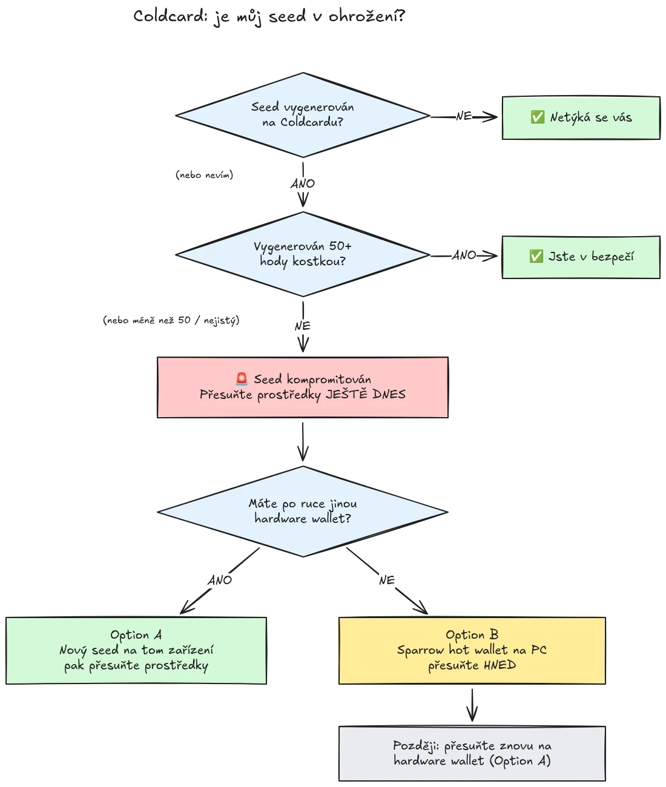

Dne 30. července 2026 bylo za necelou půlhodinu odcizeno zhruba 594 BTC (asi 38 milionů dolarů) z přibližně 500 peněženek, jejichž seedy byly vygenerovány na hardwarových peněženkách Coldcard, a útok stále pokračuje. Základní příčinou je chyba ve firmwaru při generování seedu v zařízeních Coldcard: místo aby se spoléhala na dostatečnou náhodnost generovanou hardwarem, přimíchávala postižená zařízení předvídatelné hodnoty, jako je interní sestupný čítač, sériové číslo zařízení a interní hodiny. Výsledkem je, že seed fráze vygenerované na těchto zařízeních obsahují mnohem méně entropie, než se očekává, a útočník je dokáže najít **bez jakéhokoli vašeho přičinění**, není potřeba žádný malware, žádný phishing, žádný fyzický přístup. Útočník jednoduše prohledá zmenšený prostor klíčů a vybere každou peněženku, kterou najde.

**Postižené jsou všechny modely Coldcard: Mk3, Mk4, Mk5 a Q.** Za bezpečné se považují pouze seedy vygenerované metodou hodů kostkou, a to jen tehdy, pokud bylo použito alespoň 50 hodů. Pokud nevíte, nepamatujete si nebo si nejste jisti, jak byl váš seed vygenerován: považujte jej za kompromitovaný a okamžitě přesuňte své prostředky.

Tento návod vysvětluje, jak vyhodnotit míru svého ohrožení a jak přesunout prostředky do bezpečné peněženky, rychle, ale aniž byste si tím situaci ještě zhoršili.

## V jednom rámečku: jednoduché pokyny

Bitcoinová bezpečnostní komunita se sjednocuje kolem jedné pevně dané sady jednoduchých pokynů. Zde je:

1. **Vygenerovali jste svůj seed pomocí 50 a více fyzických hodů kostkou na Coldcardu?** Pokud ano, jste v bezpečí. Pokud ne, nebo pokud si nejste jisti, považujte seed za kompromitovaný.
2. **Připravte si bezpečný cíl**: hardwarovou peněženku jiného výrobce, pokud nějakou máte po ruce, jinak horkou peněženku Sparrow vygenerovanou na vašem počítači (podrobnosti v kroku 2).
3. **Pošlete tam ještě dnes všechny své prostředky**, s poplatkem cílícím na následující blok, a počkejte na potvrzení (podrobnosti v kroku 3).
4. **Passphrase vám kupuje čas, ne bezpečí.** Nezdá se, že by útočníci zatím prolamovali passphrase, přesuňte prostředky dřív, než s tím začnou.
5. **Nikdy nikam nezadávejte svou seed frázi**, abyste ji "zkontrolovali". Kdokoli vás žádá o vaše slova, je podvodník.
6. **Aktualizace firmwaru neopraví již existující seed.** Seed vygenerovaný zranitelným firmwarem zůstane slabý navždy; vaše prostředky zabezpečí jedině nový seed a on-chain přesun.

Zbytek tohoto návodu prochází každý krok podrobně.

## Týká se to i mě?

Položte si jednu otázku: **jak byl seed vygenerován?**

- Seed vygenerovaný **samotným Coldcardem** (běžný postup "nová peněženka", na kterémkoli modelu, Mk3, Mk4, Mk5 nebo Q): **považujte jej za kompromitovaný**. Migrujte ihned.
- Seed vygenerovaný funkcí **hodů kostkou** na Coldcardu, s **alespoň 50 fyzickými hody kostkou**, které jste provedli sami: entropie pochází z vašich kostek, ne z vadného generátoru. To je jediná konfigurace, která se v současnosti považuje za bezpečnou.
- Hody kostkou s **méně než 50 hody**, nebo jste nechali zařízení entropii "dokončit": to nestačí, považujte seed za kompromitovaný.
- Seed **importovaný z jiného zařízení (ne Coldcard)**: chyba Coldcardu se na takový seed nevztahuje, ale prověřte, odkud původně pochází.
- **Nevíte to nebo si nepamatujete**: považujte jej za kompromitovaný. Cenou zbytečné migrace je transakční poplatek; cenou špatného odhadu je všechno.

Tři obvyklá falešná uklidnění, výslovně vyvrácená:

- **BIP39 passphrase** nad postiženým seedem peněženku bezpečnou neudělá, jen kupuje čas. Samotný seed je zjistitelný, takže vaše passphrase se stává jedinou překážkou, a lidé bývají špatní v odhadování entropie passphrase. Nezdá se, že by útočníci zatím prolamovali passphrase hrubou silou; přejděte na nový seed dřív, než s tím začnou.
- **Multisig** peněženku, jejíž součástí je postižený klíč z Coldcardu, nelze vysát pouze skrze tento klíč, ale postižený klíč už nepřináší žádnou skutečnou bezpečnost. Bez odkladu jej z kvora vyřaďte.
- **Novější hardwarová peněženka se stejným seedem**: mnoho lidí si koupilo novější Coldcard (nebo jiné zařízení) a obnovilo na něm svůj stávající seed. To nic nemění: kompromitovaný je seed, ne zařízení. Pokud byl váš seed vygenerován na postiženém Coldcardu, zůstává slabý, ať jej obnovíte kdekoli. Vygenerujte zcela nový seed a migrujte.

## Krok 1: Jednejte hned, ale neimprovizujte

Zatímco tohle čtete, peněženky se vysávají. Správný postoj je migrovat **ještě dnes**, s nástroji, kterým rozumíte, ne během pěti minut uspěchat transakci s neznámým nastavením a poslat své mince do prázdna.

Ještě předtím než cokoli uděláte:

1. Nechte svůj Coldcard a zálohu seedu tam, kde jsou. Stále je potřebujete k podepsání migrační transakce.
2. **Nikdy nezadávejte svou seed frázi do žádného počítače, telefonu ani na web, "abyste ověřili, zda je postižená".** Žádný legitimní kontrolní nástroj váš seed nepotřebuje. Kdokoli vás žádá o vašich 12 nebo 24 slov, je podvodník zneužívající tento incident, a phishingové kampaně po událostech, jako je tato, spolehlivě sílí.
3. Dávejte pozor, odkud čerpáte informace. Rané komunikace společnosti Coinkite už byly v prvních dnech několikrát vyvráceny, takže neberte výrobce jako svůj jediný zdroj: ověřujte si informace u nezávislých bezpečnostních výzkumníků a zavedených bitcoinových médií.

## Krok 2: Připravte si bezpečnou cílovou peněženku

Potřebujete peněženku, jejíž seed **nebyl vygenerován na Coldcardu**. Dvě cesty, podle toho, co máte po ruce:

### Možnost A: Máte po ruce jinou hardwarovou peněženku

Tohle je nejlepší cesta. Vygenerujte **nový seed** na hardwarové peněžence od jiného výrobce a přesuňte tam své prostředky. Pro hlavní zařízení máme návody krok za krokem:

https://planb.academy/tutorials/wallet/hardware/jade-7d62bf0c-f460-4e68-9635-af9b731dabc3

https://planb.academy/tutorials/wallet/hardware/bitbox02-6af8940f-e19b-4008-8c83-81017032608c

https://planb.academy/tutorials/wallet/hardware/trezor-safe-3-51d0d669-5d23-47c2-beb6-cc6fa0fb0ea0

https://planb.academy/tutorials/wallet/hardware/ledger-flex-3728773e-74d4-4177-b39f-bd923700c76a

https://planb.academy/tutorials/wallet/hardware/passport-74e53858-3fa2-43f9-b866-573297546236

Pro maximální jistotu vygenerujte seed z **fyzických hodů kostkou (alespoň 50 hodů)** na zařízení, které to podporuje, aby byla entropie prokazatelně vaše. A u významných částek využijte této příležitosti k přechodu na **multisig napříč různými výrobci**, aby už nikdy nemohla chyba jediného zařízení sama o sobě ohrozit vaše prostředky.

### Možnost B: Žádná jiná hardwarová peněženka k dispozici: zabezpečte prostředky HNED

Nečekejte dny na doručení zařízení, zatímco váš seed leží v prohledatelném prostoru klíčů. Jako **dočasné útočiště** si vytvořte horkou peněženku se seedem **vygenerovaným přímo na vašem počítači pomocí Sparrow Wallet**:

https://planb.academy/tutorials/wallet/desktop/sparrow-c674e2ac-d46f-4c82-92a7-7d1b0e262f5d

Nebo, na telefonu, pomocí aplikace Blockstream App:

https://planb.academy/tutorials/wallet/mobile/blockstream-app-onchain-e84edaa9-fb65-48c1-a357-8a5f27996143

Ano, horká peněženka je za normálních okolností krok zpět oproti hardwarové peněžence, ale seed na online počítači, který ovládáte, je v současnosti **bezpečnější než seed z Coldcardu, který si útočník dokáže spočítat**. Jakmile dorazí vaše nová hardwarová peněženka, proveďte druhou migraci z horké peněženky na ni podle možnosti A.

Nastavte cílovou peněženku kompletně dřív, než se dotknete svých starých prostředků: vygenerujte seed, zapište si zálohu a **proveďte test obnovy**, tedy obnovte peněženku ze své zapsané zálohy, abyste ověřili, že funguje. Pak vygenerujte první přijímací adresu a ověřte ji na displeji zařízení.

https://planb.academy/tutorials/wallet/backup/recovery-test-5a75db51-a6a1-4338-a02a-164a8d91b895

Pokud vás časový tlak nutí test obnovy vynechat, mějte migrovanou částku ve svém *seznamu sledovaných* a během několika dní zopakujte celé nastavení včetně testu.

## Krok 3: Přesuňte prostředky

Použijte koordinátor peněženky, například Sparrow Wallet na počítači, který s Coldcardem pracuje air-gapped přes microSD nebo přes USB.

https://planb.academy/tutorials/wallet/desktop/sparrow-c674e2ac-d46f-4c82-92a7-7d1b0e262f5d

Samotná migrace:

1. **Načtěte svou stávající (postiženou) peněženku** v Sparrow jako watch-only peněženku, přesně tak, jak jste to udělali při prvním nastavení svého Coldcardu.
2. **Sestavte transakci**, která pošle vaše prostředky na přijímací adresu vaší nové peněženky. Ověřte cílovou adresu na displeji nového podepisovacího zařízení, znak po znaku.
3. **Zaplaťte pořádný poplatek.** Teď není chvíle šetřit pár satoshi: transakce uvízlá v mempoolu prodlužuje vaši expozici, protože útočník má váš soukromý klíč také a může se u vaší migrace pokusit o replace-by-fee dvojí utracení, dokud není potvrzená. Použijte sazbu poplatku cílící na následující blok nebo dva.
4. **Podepište svým Coldcardem** jako obvykle, odešlete transakci do sítě a než budete migraci považovat za hotovou, počkejte alespoň na jedno potvrzení. Sledujte transakci, dokud se nepotvrdí.
5. Pokud držíte mnoho UTXO, přesun všech do jediného výstupu je on-chain vzájemně propojí. Pokud na vašem modelu soukromí záleží, rozdělte migraci do několika transakcí, ale v této konkrétní situaci platí **bezpečnost na prvním místě, soukromí až na druhém**. Nenechte optimalizaci soukromí migraci zdržet.

https://planb.academy/tutorials/privacy/on-chain/utxo-labelling-d997f80f-8a96-45b5-8a4e-a3e1b7788c52

6. Jakmile jsou prostředky v nové peněžence potvrzené, **starý seed natrvalo vyřaďte**. Nepoužívejte jej znovu, nenechávejte si jej "na malé částky" a zničte fyzické zálohy, aby vás nebo vaše dědice později nemohly zmást.

## Krok 4: Následky

- **Sledujte vyšetřování dál, a to z několika zdrojů.** Chápání toho, které konfigurace jsou postižené, se už víc než jednou rozšířilo a prohlášení výrobce byla cestou opravována. Vedle vlastních oznámení společnosti Coinkite sledujte nezávislé výzkumníky a zavedená bitcoinová média a počítejte s tím, že se celkový obrázek může ještě změnit.
- **Opravený firmware je venku, ale existující seedy nezachrání.** Společnost Coinkite vydala opravený firmware (4.2.0 nebo novější pro Mk3). Aktualizujte každý Coldcard, který hodláte dál používat, ale mějte jasno v tom, co aktualizace dělá a co ne: opravuje *generování* seedů do budoucna; seed vygenerovaný zranitelným firmwarem zůstává slabý navždy. Pokud chcete Coldcard používat dál, nejprve aktualizujte, pak vygenerujte zcela nový seed (ideálně s 50 a více hody kostkou) a přesuňte na něj své prostředky on-chain.
- **Vyvoďte si strukturální ponaučení.** Tento incident neznamená, že je self-custody rozbitý koncept, prostředky za ověřitelnou entropií z hodů kostkou nebo za multisigem napříč výrobci nikdy v ohrožení nebyly. Znamená, že důvěřovat generátoru náhodných čísel jediného zařízení je jediný bod selhání jako každý jiný. Ověřitelná entropie (hody kostkou), multisig napříč výrobci a otestované zálohy jsou to, co dělá nastavení odolným vůči příští chybě výrobce, ať už je tím výrobcem kdokoli.
