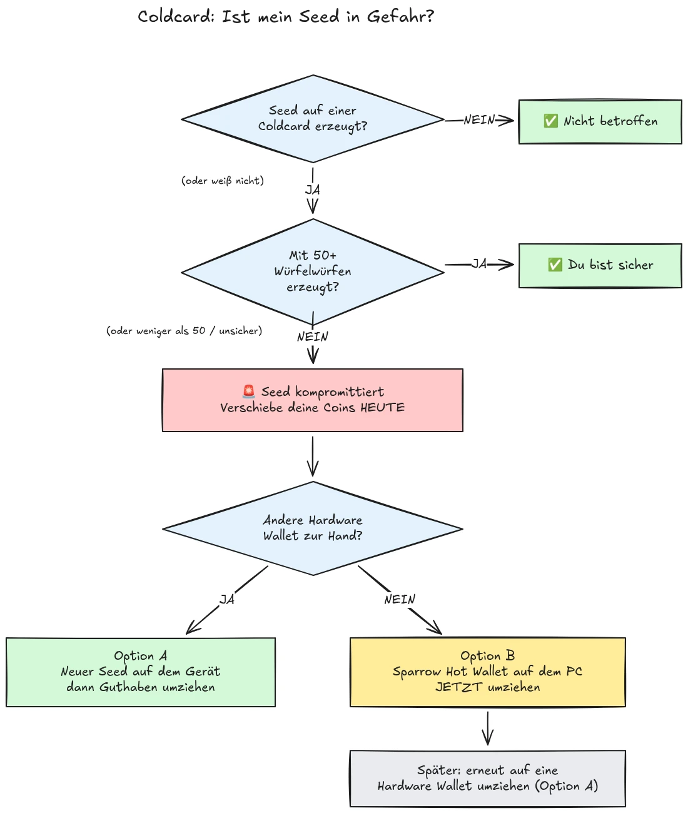

Am 30. Juli 2026 wurden in weniger als einer halben Stunde etwa 594 BTC (rund 38 Millionen US-Dollar) aus ungefähr 500 Wallets gestohlen, deren Seeds auf Coldcard-Hardware-Wallets generiert worden waren, und der Angriff dauert noch an. Die Ursache ist ein Firmware-Fehler in der Seed-Generierung der Coldcard-Geräte: Statt sich auf ausreichende, hardwaregenerierte Zufälligkeit zu verlassen, mischten betroffene Geräte vorhersagbare Werte wie einen internen Countdown-Zähler, die Seriennummer des Geräts und die interne Uhr ein. Dadurch enthalten Seed-Phrasen, die auf diesen Geräten generiert wurden, deutlich weniger Entropie als erwartet und können von einem Angreifer gefunden werden, **ohne dass Sie irgendetwas tun müssen**, keine Malware, kein Phishing, kein physischer Zugriff erforderlich. Der Angreifer durchsucht einfach den reduzierten Schlüsselraum und leert jede Wallet, die er findet.

**Alle Coldcard-Modelle sind betroffen: Mk3, Mk4, Mk5 und Q.** Als sicher gelten nur Seeds, die mit der Würfelwurf-Methode generiert wurden, und auch nur, wenn dabei mindestens 50 Würfelwürfe verwendet wurden. Wenn Sie nicht wissen, sich nicht erinnern oder sich nicht sicher sind, wie Ihr Seed generiert wurde: Behandeln Sie ihn als kompromittiert und bewegen Sie Ihre Gelder sofort.

Dieses Tutorial erklärt, wie Sie Ihre Gefährdung einschätzen und Ihre Gelder schnell, aber ohne die Lage dabei zu verschlimmern, zu einer sicheren Wallet migrieren.

## In einer Box: die einfachen Anweisungen

Die Bitcoin-Sicherheitscommunity koordiniert sich um einen festen Satz einfacher Anweisungen. Hier sind sie:

1. **Haben Sie Ihren Seed mit 50+ physischen Würfelwürfen auf der Coldcard generiert?** Wenn ja, sind Sie sicher. Wenn nein, oder wenn Sie sich nicht sicher sind, gehen Sie davon aus, dass der Seed kompromittiert ist.
2. **Bereiten Sie ein sicheres Ziel vor**: eine Hardware-Wallet eines anderen Herstellers, falls Sie eine zur Hand haben, andernfalls eine auf Ihrem Computer generierte Sparrow-Hot-Wallet (Details in Schritt 2).
3. **Senden Sie noch heute alle Ihre Gelder dorthin**, mit einer Gebühr, die auf den nächsten Block abzielt, und warten Sie auf eine Bestätigung (Details in Schritt 3).
4. **Eine Passphrase verschafft Ihnen Zeit, keine Sicherheit.** Angreifer scheinen bisher keine Passphrasen zu erraten, migrieren Sie, bevor sie damit anfangen.
5. **Geben Sie Ihre Seed-Phrase niemals irgendwo ein**, um sie zu "überprüfen". Jeder, der nach Ihren Wörtern fragt, ist ein Betrüger.
6. **Ein Firmware-Update behebt einen bestehenden Seed nicht.** Ein Seed, der mit verwundbarer Firmware generiert wurde, bleibt für immer schwach; nur ein neuer Seed und eine On-Chain-Bewegung sichern Ihre Gelder.

Der Rest dieses Tutorials geht jeden Schritt im Detail durch.

## Bin ich betroffen?

Stellen Sie sich eine Frage: **Wie wurde der Seed generiert?**

- Seed generiert **von der Coldcard selbst** (der normale "Neue Wallet"-Ablauf, auf jedem Modell, Mk3, Mk4, Mk5 oder Q): **als kompromittiert behandeln**. Jetzt migrieren.
- Seed generiert mit der **Würfelwurf**-Funktion der Coldcard, mit **mindestens 50 physischen Würfelwürfen**, die Sie selbst durchgeführt haben: Die Entropie kam von Ihren Würfeln, nicht vom fehlerhaften Generator. Dies ist die einzige derzeit als sicher geltende Konfiguration.
- Würfelwurf mit **weniger als 50 Würfen**, oder Sie haben das Gerät die Entropie "vervollständigen" lassen: nicht ausreichend, als kompromittiert behandeln.
- Seed **importiert von einem anderen (Nicht-Coldcard-)Gerät**: Der Coldcard-Fehler betrifft diesen Seed nicht, aber prüfen Sie, woher er ursprünglich stammt.
- **Sie wissen es nicht oder erinnern sich nicht**: Behandeln Sie ihn als kompromittiert. Die Kosten einer unnötigen Migration sind eine Transaktionsgebühr; die Kosten einer falschen Annahme sind alles.

Drei häufige falsche Beruhigungen, ausdrücklich angesprochen:

- Eine **BIP39-Passphrase** zusätzlich zu einem betroffenen Seed macht die Wallet nicht sicher, sie verschafft nur Zeit. Der Seed selbst ist auffindbar, sodass Ihre Passphrase die einzige Barriere wird, und Menschen schätzen die Entropie von Passphrasen üblicherweise schlecht ein. Angreifer scheinen bisher keine Passphrasen per Brute-Force zu erraten; migrieren Sie zu einem neuen Seed, bevor sie damit anfangen.
- Eine **Multisig**-Wallet, die einen betroffenen Coldcard-Schlüssel enthält, kann nicht allein über diesen Schlüssel geleert werden, aber der betroffene Schlüssel trägt nicht mehr zur tatsächlichen Sicherheit bei. Ersetzen Sie ihn unverzüglich im Quorum.
- **Eine neuere Hardware-Wallet mit demselben Seed**: Viele Menschen haben eine neuere Coldcard (oder ein anderes Gerät) gekauft und ihren bestehenden Seed darauf wiederhergestellt. Das ändert nichts: Der Seed ist kompromittiert, nicht das Gerät. Wenn Ihr Seed auf einer betroffenen Coldcard generiert wurde, bleibt er schwach, egal wohin Sie ihn wiederherstellen. Generieren Sie einen brandneuen Seed und migrieren Sie.

## Schritt 1: Handeln Sie jetzt, aber improvisieren Sie nicht

Während Sie dies lesen, werden Wallets geleert. Die richtige Haltung ist, **heute** mit Werkzeugen zu migrieren, die Sie verstehen, statt in fünf Minuten mit einem unvertrauten Setup eine Transaktion zu überstürzen und Ihre Coins ins Nichts zu schicken.

Bevor Sie etwas anderes tun:

1. Behalten Sie Ihre Coldcard und Ihr Seed-Backup dort, wo sie sind. Sie brauchen sie noch, um die Migrationstransaktion zu signieren.
2. **Geben Sie Ihre Seed-Phrase niemals in einen Computer, ein Telefon oder eine Website ein, um "zu prüfen, ob sie betroffen ist".** Kein legitimer Prüfdienst benötigt Ihren Seed. Jeder, der nach Ihren 12 oder 24 Wörtern fragt, ist ein Betrüger, der diesen Vorfall ausnutzt, und Phishing-Kampagnen nehmen nach solchen Ereignissen zuverlässig zu.
3. Achten Sie darauf, woher Sie Ihre Informationen beziehen. Coinkites frühe Mitteilungen wurden in den ersten Tagen bereits mehrfach widerlegt, behandeln Sie den Hersteller also nicht als Ihre einzige Quelle: Gleichen Sie Informationen mit unabhängigen Sicherheitsforschern und etablierten Bitcoin-Nachrichtenportalen ab.

## Schritt 2: Bereiten Sie eine sichere Ziel-Wallet vor

Sie benötigen eine Wallet, deren Seed **nicht auf einer Coldcard generiert wurde**. Zwei Wege, je nachdem, was Sie zur Hand haben:

### Option A: Sie haben eine andere Hardware-Wallet zur Hand

Dies ist der beste Weg. Generieren Sie einen **neuen Seed** auf einer Hardware-Wallet eines anderen Herstellers und migrieren Sie Ihre Gelder dorthin. Wir haben Schritt-für-Schritt-Tutorials für die wichtigsten Geräte:

https://planb.academy/tutorials/wallet/hardware/jade-7d62bf0c-f460-4e68-9635-af9b731dabc3

https://planb.academy/tutorials/wallet/hardware/bitbox02-6af8940f-e19b-4008-8c83-81017032608c

https://planb.academy/tutorials/wallet/hardware/trezor-safe-3-51d0d669-5d23-47c2-beb6-cc6fa0fb0ea0

https://planb.academy/tutorials/wallet/hardware/ledger-flex-3728773e-74d4-4177-b39f-bd923700c76a

https://planb.academy/tutorials/wallet/hardware/passport-74e53858-3fa2-43f9-b866-573297546236

Für maximale Sicherheit generieren Sie den Seed aus **physischen Würfelwürfen (mindestens 50 Würfe)** auf einem Gerät, das dies unterstützt, sodass die Entropie nachweislich Ihre eigene ist. Und für bedeutende Beträge nutzen Sie diese Gelegenheit, um zu **Multisig über verschiedene Hersteller hinweg** zu wechseln, sodass kein einzelner Gerätefehler jemals wieder allein Ihre Gelder gefährden kann.

### Option B: Keine andere Hardware-Wallet verfügbar: sichern Sie die Gelder JETZT

Warten Sie nicht tagelang auf die Lieferung eines Geräts, während Ihr Seed in einem durchsuchbaren Schlüsselraum liegt. Erstellen Sie als **vorübergehende Zuflucht** eine Hot-Wallet mit einem Seed, der **direkt auf Ihrem Computer mit Sparrow Wallet generiert** wird:

https://planb.academy/tutorials/wallet/desktop/sparrow-c674e2ac-d46f-4c82-92a7-7d1b0e262f5d

Oder auf Ihrem Telefon mit der Blockstream App:

https://planb.academy/tutorials/wallet/mobile/blockstream-app-onchain-e84edaa9-fb65-48c1-a357-8a5f27996143

Ja, eine Hot-Wallet ist normalerweise ein Rückschritt gegenüber einer Hardware-Wallet, aber ein Seed auf einem Online-Computer, den Sie kontrollieren, ist derzeit **sicherer als ein Coldcard-Seed, den ein Angreifer berechnen kann**. Sobald Ihre neue Hardware-Wallet eintrifft, führen Sie eine zweite Migration von der Hot-Wallet dorthin durch, wie in Option A beschrieben.

Richten Sie die Ziel-Wallet vollständig ein, bevor Sie Ihre alten Gelder anfassen: Generieren Sie den Seed, notieren Sie das Backup und **führen Sie einen Wiederherstellungstest durch**, stellen Sie ihn aus Ihrem notierten Backup wieder her, um zu beweisen, dass er funktioniert. Generieren Sie dann eine erste Empfangsadresse und verifizieren Sie sie auf dem Bildschirm des Geräts.

https://planb.academy/tutorials/wallet/backup/recovery-test-5a75db51-a6a1-4338-a02a-164a8d91b895

Wenn der Zeitdruck Sie zwingt, den Wiederherstellungstest auszulassen, behalten Sie den migrierten Betrag auf Ihrer *Watchlist* und wiederholen Sie ein vollständiges, getestetes Setup innerhalb weniger Tage.

## Schritt 3: Bewegen Sie die Gelder

Verwenden Sie einen Wallet-Koordinator wie Sparrow Wallet auf dem Desktop, der mit der Coldcard air-gapped über microSD oder über USB zusammenarbeitet.

https://planb.academy/tutorials/wallet/desktop/sparrow-c674e2ac-d46f-4c82-92a7-7d1b0e262f5d

Die Migration selbst:

1. **Laden Sie Ihre bestehende (betroffene) Wallet** in Sparrow als Watch-only-Wallet, genau wie Sie es bei der ersten Einrichtung Ihrer Coldcard getan haben.
2. **Erstellen Sie eine Transaktion**, die Ihre Gelder an eine Empfangsadresse Ihrer neuen Wallet sendet. Verifizieren Sie die Zieladresse Zeichen für Zeichen auf dem Bildschirm des neuen Signiergeräts.
3. **Zahlen Sie eine spürbare Gebühr.** Dies ist nicht der Moment, um ein paar Sats zu sparen: Eine im Mempool feststeckende Transaktion verlängert Ihre Gefährdung, weil der Angreifer ebenfalls Ihren privaten Schlüssel besitzt und versuchen kann, Ihre unbestätigte Migration per Replace-by-Fee doppelt auszugeben. Verwenden Sie eine Gebührenrate, die auf den nächsten Block oder die nächsten zwei Blöcke abzielt.
4. **Signieren Sie mit Ihrer Coldcard** wie gewohnt, senden Sie die Transaktion und warten Sie auf mindestens eine Bestätigung, bevor Sie die Migration als abgeschlossen betrachten. Beobachten Sie die Transaktion, bis sie bestätigt ist.
5. Wenn Sie viele UTXOs besitzen, verknüpft das Zusammenführen aller in einen einzigen Output alle davon on-chain. Wenn Ihr Privacy-Modell wichtig ist, teilen Sie die Migration in mehrere Transaktionen auf, aber in dieser speziellen Situation gilt: **Sicherheit zuerst, Privatsphäre zweitrangig**. Lassen Sie eine Privacy-Optimierung die Migration nicht verzögern.

https://planb.academy/tutorials/privacy/on-chain/utxo-labelling-d997f80f-8a96-45b5-8a4e-a3e1b7788c52

6. Sobald die Gelder in der neuen Wallet bestätigt sind, **ziehen Sie den alten Seed endgültig zurück**. Verwenden Sie ihn nicht weiter, "behalten" Sie ihn nicht "für kleine Beträge", und vernichten Sie die physischen Backups, damit sie Sie oder Ihre Erben später nicht in die Irre führen können.

## Schritt 4: Danach

- **Verfolgen Sie die Untersuchung weiter, aus mehreren Quellen.** Das Verständnis der betroffenen Konfigurationen hat sich bereits mehr als einmal erweitert, und Aussagen des Herstellers wurden dabei korrigiert. Verfolgen Sie unabhängige Forscher und etablierte Bitcoin-Medien neben Coinkites eigenen Mitteilungen, und gehen Sie davon aus, dass sich das Bild noch ändern kann.
- **Eine korrigierte Firmware ist verfügbar, rettet aber keine bestehenden Seeds.** Coinkite hat eine gepatchte Firmware veröffentlicht (4.2.0 oder höher für die Mk3). Aktualisieren Sie jede Coldcard, die Sie weiterhin nutzen möchten, aber verstehen Sie, was das Update tut und was nicht: Es behebt die *Generierung* künftiger Seeds; ein mit verwundbarer Firmware generierter Seed bleibt für immer schwach. Wenn Sie eine Coldcard weiter nutzen möchten, aktualisieren Sie zuerst, generieren Sie dann einen brandneuen Seed (idealerweise mit 50+ Würfelwürfen) und bewegen Sie Ihre Gelder on-chain dorthin.
- **Ziehen Sie die strukturelle Lehre daraus.** Dieser Vorfall bedeutet nicht, dass Self-Custody kaputt ist, Gelder hinter nachweisbarer Würfelwurf-Entropie oder herstellerübergreifender Multisig waren nie gefährdet. Er bedeutet, dass das Vertrauen in den Zufallsgenerator eines einzelnen Geräts ein Single Point of Failure wie jeder andere ist. Nachweisbare Entropie (Würfelwürfe), Multisig über Hersteller hinweg und getestete Backups sind es, was ein Setup robust gegen den nächsten Herstellerfehler macht, ganz gleich, welcher Hersteller betroffen ist.
