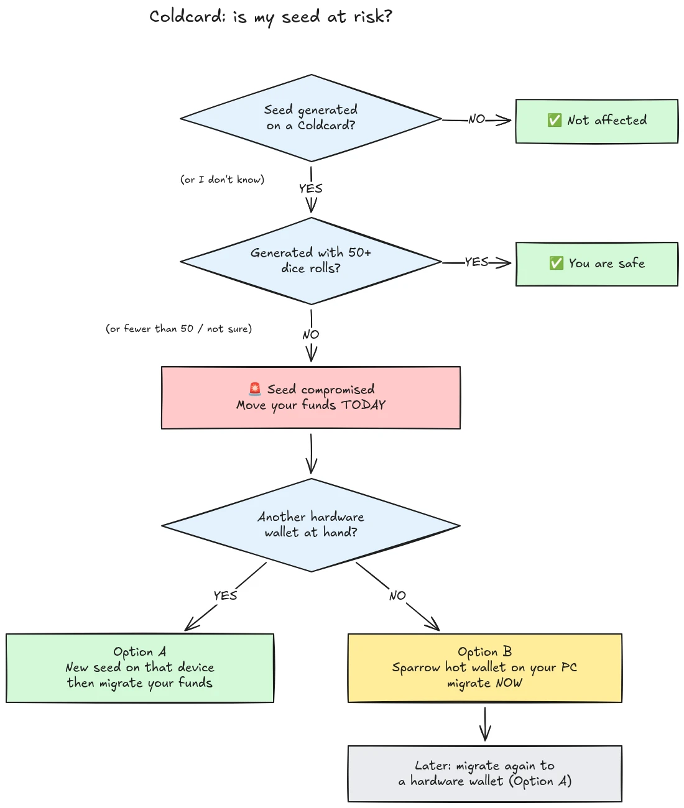

On July 30, 2026, roughly 594 BTC (about $38 million) were stolen in under half an hour from approximately 500 wallets whose seeds had been generated on Coldcard hardware wallets, and the attack is still ongoing. The root cause is a firmware flaw in the seed generation of Coldcard devices: instead of relying on sufficient hardware-generated randomness, affected devices mixed in predictable values such as an internal down-counter, the device's serial number, and the internal clock. As a result, seed phrases generated on these devices contain far less entropy than expected and can be found by an attacker **without any action on your part**, no malware, no phishing, no physical access required. The attacker simply searches the reduced key space and sweeps any wallet they find.

**All Coldcard models are affected: Mk3, Mk4, Mk5, and Q.** The only seeds considered safe are those generated with the dice roll method, and only if at least 50 dice rolls were used. If you don't know, don't remember, or aren't sure how your seed was generated: treat it as compromised and move your funds immediately.

This tutorial explains how to assess your exposure and how to migrate your funds to a secure wallet, quickly, but without making things worse in the process.

## In one box: the simple instructions

The Bitcoin security community is coordinating around one fixed set of simple instructions. Here it is:

1. **Did you generate your seed with 50+ physical dice rolls on the Coldcard?** If yes, you are safe. If no, or if you're not sure, assume the seed is compromised.
2. **Prepare a safe destination**: another vendor's hardware wallet if you have one at hand, otherwise a Sparrow hot wallet generated on your computer (details in Step 2).
3. **Send all your funds there today**, with a fee targeting the next block, and wait for a confirmation (details in Step 3).
4. **A passphrase buys you time, not safety.** Attackers don't appear to be grinding passphrases yet, migrate before they start.
5. **Never type your seed phrase anywhere** to "check" it. Anyone asking for your words is a scammer.
6. **Updating the firmware does not fix an existing seed.** A seed generated by vulnerable firmware stays weak forever; only a new seed and an on-chain move secure your funds.

The rest of this tutorial walks through each step in detail.

## Am I affected?

Ask yourself one question: **how was the seed generated?**

- Seed generated **by the Coldcard itself** (the normal "new wallet" flow, on any model, Mk3, Mk4, Mk5, or Q): **treat it as compromised**. Migrate now.
- Seed generated with Coldcard's **dice roll** feature, with **at least 50 physical dice rolls** that you performed yourself: the entropy came from your dice, not from the flawed generator. This is the only configuration currently considered safe.
- Dice roll with **fewer than 50 rolls**, or you let the device "complete" the entropy: not enough, treat it as compromised.
- Seed **imported from another (non-Coldcard) device**: the Coldcard flaw does not apply to that seed, but audit where it originally came from.
- **You don't know or don't remember**: treat it as compromised. The cost of an unnecessary migration is a transaction fee; the cost of a wrong guess is everything.

Three common false reassurances, addressed explicitly:

- A **BIP39 passphrase** on top of an affected seed does not make the wallet safe, it only buys time. The seed itself is discoverable, so your passphrase becomes the only barrier, and people are usually bad at estimating passphrase entropy. Attackers do not appear to be brute-forcing passphrases yet; migrate to a new seed before they start.
- A **multisig** wallet that includes an affected Coldcard key cannot be drained through that key alone, but the affected key contributes no real security anymore. Rotate it out of the quorum without delay.
- **A newer hardware wallet with the same seed**: many people bought a newer Coldcard (or another device) and restored their existing seed onto it. That changes nothing: the seed is what is compromised, not the device. If your seed was generated on an affected Coldcard, it stays weak wherever you restore it. Generate a brand-new seed and migrate.

## Step 1: Act now, but don't improvise

Wallets are being drained as you read this. The correct posture is to migrate **today**, using tools you understand, not to rush a transaction in five minutes with an unfamiliar setup and send your coins into the void.

Before anything else:

1. Keep your Coldcard and your seed backup where they are. You still need them to sign the migration transaction.
2. **Never type your seed phrase into any computer, phone, or website "to check if it is affected".** No legitimate checker requires your seed. Anyone asking for your 12 or 24 words is a scammer exploiting this incident, and phishing campaigns reliably surge after events like this one.
3. Be careful where you get your information. Coinkite's early communications have already been contradicted several times in the first days, so do not treat the vendor as your only source: cross-check with independent security researchers and established Bitcoin news outlets.

## Step 2: Prepare a safe destination wallet

You need a wallet whose seed was **not generated on a Coldcard**. Two paths, depending on what you have at hand:

### Option A: You have another hardware wallet at hand

This is the best path. Generate a **new seed** on a hardware wallet from another vendor and migrate your funds there. We have step-by-step tutorials for the main devices:

https://planb.academy/tutorials/wallet/hardware/jade-7d62bf0c-f460-4e68-9635-af9b731dabc3

https://planb.academy/tutorials/wallet/hardware/bitbox02-6af8940f-e19b-4008-8c83-81017032608c

https://planb.academy/tutorials/wallet/hardware/trezor-safe-3-51d0d669-5d23-47c2-beb6-cc6fa0fb0ea0

https://planb.academy/tutorials/wallet/hardware/ledger-flex-3728773e-74d4-4177-b39f-bd923700c76a

https://planb.academy/tutorials/wallet/hardware/passport-74e53858-3fa2-43f9-b866-573297546236

For maximum assurance, generate the seed from **physical dice rolls (at least 50 rolls)** on a device that supports it, so the entropy is verifiably yours. And for significant amounts, take this opportunity to move to **multisig across different vendors**, so that no single device flaw can ever again put your funds at risk on its own.

### Option B: No other hardware wallet available: secure the funds NOW

Do not wait days for a device to be delivered while your seed sits in a searchable key space. As a **temporary refuge**, create a hot wallet with a seed **generated directly on your computer with Sparrow Wallet**:

https://planb.academy/tutorials/wallet/desktop/sparrow-c674e2ac-d46f-4c82-92a7-7d1b0e262f5d

Or, on your phone, with the Blockstream App:

https://planb.academy/tutorials/wallet/mobile/blockstream-app-onchain-e84edaa9-fb65-48c1-a357-8a5f27996143

Yes, a hot wallet is normally a step down from a hardware wallet, but a seed on an online computer you control is currently **safer than a Coldcard seed an attacker can compute**. Once your new hardware wallet arrives, do a second migration from the hot wallet to it, following Option A.

Set up the destination wallet completely before touching your old funds: generate the seed, write down the backup, and **perform a recovery test**, restore from your written backup to prove it works. Then generate a first receiving address and verify it on the device screen.

https://planb.academy/tutorials/wallet/backup/recovery-test-5a75db51-a6a1-4338-a02a-164a8d91b895

If time pressure forces you to skip the recovery test, keep the migration amount in your *watch list* and redo a full, tested setup within days.

## Step 3: Move the funds

Use a wallet coordinator such as Sparrow Wallet on desktop, which works with the Coldcard air-gapped via microSD or via USB.

https://planb.academy/tutorials/wallet/desktop/sparrow-c674e2ac-d46f-4c82-92a7-7d1b0e262f5d

The migration itself:

1. **Load your existing (affected) wallet** in Sparrow as a watch-only wallet, exactly as you did when you first set up your Coldcard.
2. **Build a transaction** sending your funds to a receiving address of your new wallet. Verify the destination address on the screen of the new signing device, character by character.
3. **Pay a serious fee.** This is not the moment to save a few sats: a transaction stuck in the mempool prolongs your exposure, because the attacker holds your private key too and can attempt a replace-by-fee double spend of your migration while it is unconfirmed. Use a fee rate targeting the next block or two.
4. **Sign with your Coldcard** as usual, broadcast, and wait for at least one confirmation before considering the migration done. Watch the transaction until it confirms.
5. If you hold many UTXOs, sweeping everything into a single output links all of them on-chain. If your privacy model matters, split the migration into several transactions, but in this specific situation, **security first, privacy second**. Do not let privacy optimization delay the migration.

https://planb.academy/tutorials/privacy/on-chain/utxo-labelling-d997f80f-8a96-45b5-8a4e-a3e1b7788c52

6. Once the funds are confirmed at the new wallet, **retire the old seed permanently**. Do not reuse it, do not "keep it for small amounts", and destroy the physical backups so they cannot mislead you or your heirs later.

## Step 4: Aftermath

- **Keep following the investigation, from several sources.** The understanding of affected configurations has already widened more than once, and vendor statements have been corrected along the way. Track independent researchers and established Bitcoin media alongside Coinkite's own disclosures, and assume the picture may still change.
- **Fixed firmware is out, but it does not rescue existing seeds.** Coinkite has released patched firmware (4.2.0 or later for the Mk3). Update any Coldcard you intend to keep using, but understand what the update does and does not do: it fixes seed *generation* going forward; a seed generated by vulnerable firmware remains weak forever. If you want to keep using a Coldcard, update first, then generate a brand-new seed (ideally with 50+ dice rolls) and move your funds to it on-chain.
- **Draw the structural lesson.** This incident does not mean self-custody is broken, funds behind verifiable dice-roll entropy or multi-vendor multisig were never at risk. It means that trusting a single device's random number generator is a single point of failure like any other. Verifiable entropy (dice rolls), multisig across vendors, and tested backups are what make a setup robust to the next vendor bug, whoever the vendor is.
