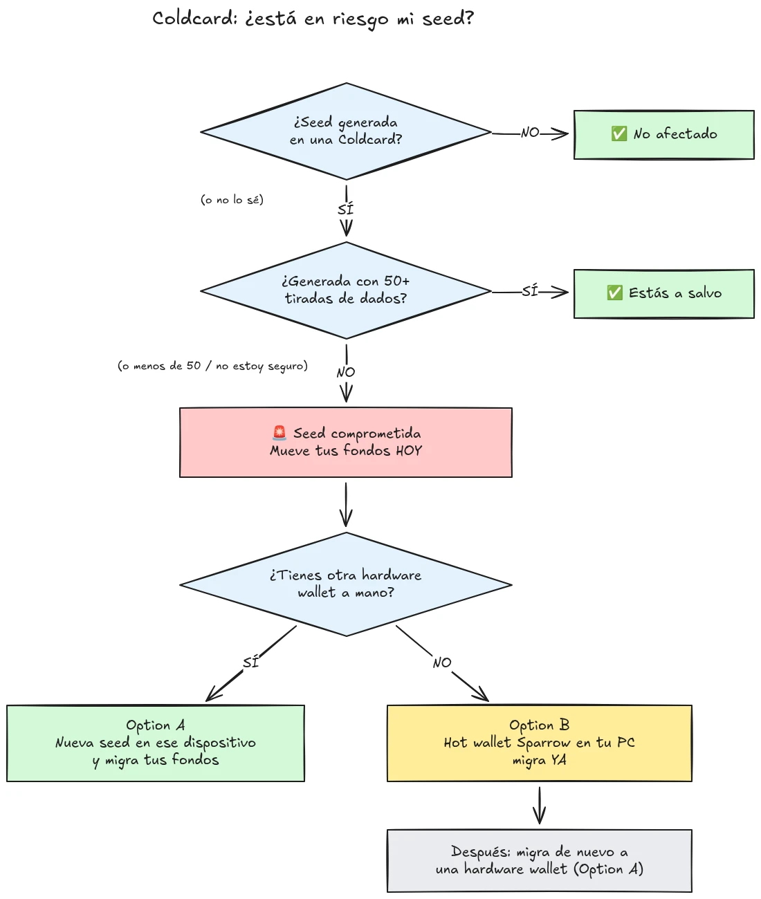

El 30 de julio de 2026, aproximadamente 594 BTC (unos 38 millones de dólares) fueron robados en menos de media hora de alrededor de 500 carteras cuyas semillas habían sido generadas en carteras hardware Coldcard, y el ataque sigue en curso. La causa raíz es un fallo de firmware en la generación de semillas de los dispositivos Coldcard: en lugar de basarse en aleatoriedad generada por hardware suficiente, los dispositivos afectados mezclaban valores predecibles como un contador descendente interno, el número de serie del dispositivo y el reloj interno. Como resultado, las frases semilla generadas en estos dispositivos contienen mucha menos entropía de la esperada y pueden ser encontradas por un atacante **sin ninguna acción por tu parte**, sin malware, sin phishing, sin necesidad de acceso físico. El atacante simplemente busca en el espacio de claves reducido y vacía cualquier cartera que encuentra.

**Todos los modelos de Coldcard están afectados: Mk3, Mk4, Mk5 y Q.** Las únicas semillas consideradas seguras son las generadas con el método de tirada de dados, y solo si se usaron al menos 50 tiradas de dados. Si no sabes, no recuerdas o no estás seguro de cómo se generó tu semilla: trátala como comprometida y mueve tus fondos de inmediato.

Este tutorial explica cómo evaluar tu exposición y cómo migrar tus fondos a una cartera segura, rápidamente, pero sin empeorar las cosas en el proceso.

## En una caja: las instrucciones simples

La comunidad de seguridad de Bitcoin se está coordinando en torno a un conjunto fijo de instrucciones simples. Aquí están:

1. **¿Generaste tu semilla con 50+ tiradas de dados físicos en la Coldcard?** Si sí, estás a salvo. Si no, o si no estás seguro, asume que la semilla está comprometida.
2. **Prepara un destino seguro**: una cartera hardware de otro fabricante si tienes una a mano, o si no, una cartera caliente de Sparrow generada en tu ordenador (detalles en el Paso 2).
3. **Envía todos tus fondos allí hoy mismo**, con una comisión que apunte al próximo bloque, y espera una confirmación (detalles en el Paso 3).
4. **Una passphrase te compra tiempo, no seguridad.** Los atacantes no parecen estar forzando passphrases todavía, migra antes de que empiecen.
5. **Nunca escribas tu frase semilla en ningún sitio** para "comprobarla". Cualquiera que pida tus palabras es un estafador.
6. **Actualizar el firmware no arregla una semilla existente.** Una semilla generada por firmware vulnerable permanece débil para siempre; solo una nueva semilla y un movimiento en cadena aseguran tus fondos.

El resto de este tutorial recorre cada paso en detalle.

## ¿Estoy afectado?

Hazte una pregunta: **¿cómo se generó la semilla?**

- Semilla generada **por la propia Coldcard** (el flujo normal de "nueva cartera", en cualquier modelo, Mk3, Mk4, Mk5 o Q): **trátala como comprometida**. Migra ahora.
- Semilla generada con la función de **tirada de dados** de Coldcard, con **al menos 50 tiradas de dados físicos** que realizaste tú mismo: la entropía provino de tus dados, no del generador defectuoso. Esta es la única configuración considerada segura actualmente.
- Tirada de dados con **menos de 50 tiradas**, o dejaste que el dispositivo "completara" la entropía: no es suficiente, trátala como comprometida.
- Semilla **importada de otro dispositivo (no Coldcard)**: el fallo de Coldcard no aplica a esa semilla, pero audita de dónde provino originalmente.
- **No sabes o no recuerdas**: trátala como comprometida. El coste de una migración innecesaria es una comisión de transacción; el coste de una suposición equivocada es todo.

Tres falsas garantías comunes, abordadas explícitamente:

- Una **passphrase BIP39** encima de una semilla afectada no hace que la cartera sea segura, solo compra tiempo. La semilla en sí es descubrible, así que tu passphrase se convierte en la única barrera, y la gente suele ser mala estimando la entropía de una passphrase. Los atacantes no parecen estar forzando passphrases por fuerza bruta todavía; migra a una nueva semilla antes de que empiecen.
- Una cartera **multisig** que incluye una clave Coldcard afectada no puede ser vaciada solo a través de esa clave, pero la clave afectada ya no aporta seguridad real. Rótala fuera del quórum sin demora.
- **Una cartera hardware más nueva con la misma semilla**: mucha gente compró una Coldcard más nueva (u otro dispositivo) y restauró su semilla existente en ella. Eso no cambia nada: lo que está comprometido es la semilla, no el dispositivo. Si tu semilla se generó en una Coldcard afectada, permanece débil dondequiera que la restaures. Genera una semilla completamente nueva y migra.

## Paso 1: Actúa ahora, pero no improvises

Se están vaciando carteras mientras lees esto. La postura correcta es migrar **hoy**, usando herramientas que entiendes, no precipitar una transacción en cinco minutos con una configuración desconocida y enviar tus monedas al vacío.

Antes que nada:

1. Mantén tu Coldcard y tu respaldo de semilla donde están. Aún los necesitas para firmar la transacción de migración.
2. **Nunca escribas tu frase semilla en ningún ordenador, teléfono o sitio web "para comprobar si está afectada".** Ningún verificador legítimo requiere tu semilla. Cualquiera que pida tus 12 o 24 palabras es un estafador aprovechando este incidente, y las campañas de phishing suelen repuntar de forma fiable tras eventos como este.
3. Ten cuidado de dónde obtienes tu información. Las primeras comunicaciones de Coinkite ya han sido contradichas varias veces en los primeros días, así que no trates al fabricante como tu única fuente: contrasta con investigadores de seguridad independientes y medios de noticias de Bitcoin establecidos.

## Paso 2: Prepara una cartera de destino segura

Necesitas una cartera cuya semilla **no fue generada en una Coldcard**. Dos caminos, según lo que tengas a mano:

### Opción A: Tienes otra cartera hardware a mano

Este es el mejor camino. Genera una **nueva semilla** en una cartera hardware de otro fabricante y migra tus fondos allí. Tenemos tutoriales paso a paso para los principales dispositivos:

https://planb.academy/tutorials/wallet/hardware/jade-7d62bf0c-f460-4e68-9635-af9b731dabc3

https://planb.academy/tutorials/wallet/hardware/bitbox02-6af8940f-e19b-4008-8c83-81017032608c

https://planb.academy/tutorials/wallet/hardware/trezor-safe-3-51d0d669-5d23-47c2-beb6-cc6fa0fb0ea0

https://planb.academy/tutorials/wallet/hardware/ledger-flex-3728773e-74d4-4177-b39f-bd923700c76a

https://planb.academy/tutorials/wallet/hardware/passport-74e53858-3fa2-43f9-b866-573297546236

Para máxima garantía, genera la semilla a partir de **tiradas de dados físicos (al menos 50 tiradas)** en un dispositivo que lo admita, de modo que la entropía sea verificablemente tuya. Y para cantidades significativas, aprovecha esta oportunidad para pasar a **multisig entre distintos fabricantes**, de modo que ningún fallo de un solo dispositivo pueda volver a poner en riesgo tus fondos por sí solo.

### Opción B: No hay otra cartera hardware disponible: asegura los fondos AHORA

No esperes días a que se entregue un dispositivo mientras tu semilla permanece en un espacio de claves buscable. Como **refugio temporal**, crea una cartera caliente con una semilla **generada directamente en tu ordenador con Sparrow Wallet**:

https://planb.academy/tutorials/wallet/desktop/sparrow-c674e2ac-d46f-4c82-92a7-7d1b0e262f5d

O, en tu teléfono, con la app Blockstream:

https://planb.academy/tutorials/wallet/mobile/blockstream-app-onchain-e84edaa9-fb65-48c1-a357-8a5f27996143

Sí, una cartera caliente normalmente es un paso atrás respecto a una cartera hardware, pero una semilla en un ordenador en línea que controlas es actualmente **más segura que una semilla de Coldcard que un atacante puede calcular**. Una vez que llegue tu nueva cartera hardware, haz una segunda migración de la cartera caliente a ella, siguiendo la Opción A.

Configura la cartera de destino por completo antes de tocar tus fondos antiguos: genera la semilla, anota el respaldo, y **realiza una prueba de recuperación**, restaura desde tu respaldo escrito para comprobar que funciona. Luego genera una primera dirección de recepción y verifícala en la pantalla del dispositivo.

https://planb.academy/tutorials/wallet/backup/recovery-test-5a75db51-a6a1-4338-a02a-164a8d91b895

Si la presión del tiempo te obliga a saltarte la prueba de recuperación, mantén el monto migrado en tu *lista de vigilancia* y rehaz una configuración completa y probada en unos días.

## Paso 3: Mueve los fondos

Usa un coordinador de carteras como Sparrow Wallet en escritorio, que funciona con la Coldcard de forma air-gapped vía microSD o vía USB.

https://planb.academy/tutorials/wallet/desktop/sparrow-c674e2ac-d46f-4c82-92a7-7d1b0e262f5d

La migración en sí:

1. **Carga tu cartera existente (afectada)** en Sparrow como una cartera de solo lectura, exactamente como hiciste cuando configuraste tu Coldcard por primera vez.
2. **Construye una transacción** enviando tus fondos a una dirección de recepción de tu nueva cartera. Verifica la dirección de destino en la pantalla del nuevo dispositivo firmante, carácter por carácter.
3. **Paga una comisión seria.** Este no es el momento de ahorrar unos pocos sats: una transacción atascada en la mempool prolonga tu exposición, porque el atacante también tiene tu clave privada y puede intentar un doble gasto por replace-by-fee de tu migración mientras esté sin confirmar. Usa una tasa de comisión que apunte al próximo bloque o dos.
4. **Firma con tu Coldcard** como de costumbre, difunde la transacción, y espera al menos una confirmación antes de considerar la migración terminada. Vigila la transacción hasta que se confirme.
5. Si tienes muchos UTXOs, barrer todo en una sola salida los vincula a todos en cadena. Si tu modelo de privacidad importa, divide la migración en varias transacciones, pero en esta situación específica, **seguridad primero, privacidad segundo**. No dejes que la optimización de privacidad retrase la migración.

https://planb.academy/tutorials/privacy/on-chain/utxo-labelling-d997f80f-8a96-45b5-8a4e-a3e1b7788c52

6. Una vez que los fondos estén confirmados en la nueva cartera, **retira la semilla antigua permanentemente**. No la reutilices, no la "guardes para pequeñas cantidades", y destruye los respaldos físicos para que no puedan confundirte a ti o a tus herederos más adelante.

## Paso 4: Después del incidente

- **Sigue de cerca la investigación, desde varias fuentes.** El entendimiento de las configuraciones afectadas ya se ha ampliado más de una vez, y las declaraciones del fabricante se han corregido en el camino. Sigue a investigadores independientes y a medios de Bitcoin establecidos junto a las propias divulgaciones de Coinkite, y asume que el panorama aún puede cambiar.
- **Ya hay firmware corregido, pero no rescata las semillas existentes.** Coinkite ha publicado firmware parcheado (4.2.0 o posterior para la Mk3). Actualiza cualquier Coldcard que planees seguir usando, pero entiende qué hace y qué no hace la actualización: corrige la *generación* de semillas de ahora en adelante; una semilla generada por firmware vulnerable permanece débil para siempre. Si quieres seguir usando una Coldcard, actualiza primero, luego genera una semilla completamente nueva (idealmente con 50+ tiradas de dados) y mueve tus fondos a ella en cadena.
- **Extrae la lección estructural.** Este incidente no significa que la autocustodia esté rota, los fondos protegidos por entropía verificable de tiradas de dados o multisig entre varios fabricantes nunca estuvieron en riesgo. Significa que confiar en el generador de números aleatorios de un solo dispositivo es un punto único de fallo como cualquier otro. La entropía verificable (tiradas de dados), el multisig entre fabricantes y los respaldos probados son lo que hace que una configuración sea robusta ante el próximo fallo de un fabricante, sea cual sea.
