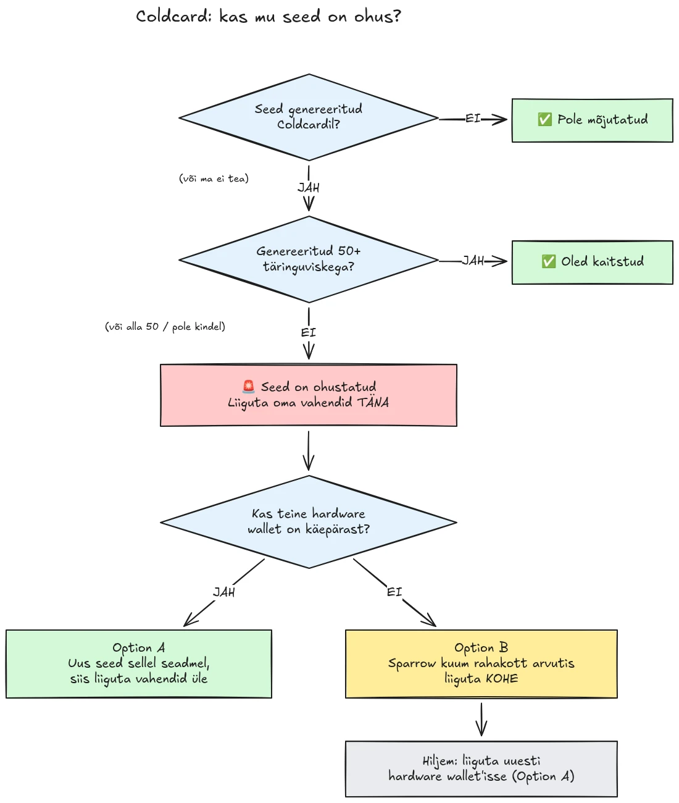

30. juulil 2026 varastati vähem kui poole tunniga ligikaudu 594 BTC (umbes 38 miljonit dollarit) umbes 500 rahakotist, mille seemned olid genereeritud Coldcardi riistvaralistes rahakottides, ja rünnak kestab endiselt. Algpõhjus on Coldcardi seadmete seemne genereerimise püsivaraviga: piisavale riistvaraliselt loodud juhuslikkusele tuginemise asemel segasid mõjutatud seadmed sisse etteaimatavaid väärtusi, näiteks sisemise kahaneva loenduri, seadme seerianumbri ja sisemise kella. Selle tulemusena sisaldavad nendes seadmetes genereeritud seemnefraasid oodatust palju vähem entroopiat ja ründaja võib need leida **ilma teiepoolse tegevuseta**, ilma pahavarata, ilma andmepüügita, ilma füüsilise juurdepääsuta. Ründaja lihtsalt otsib läbi vähenenud võtmeruumi ja tühjendab iga rahakoti, mille ta leiab.

**Mõjutatud on kõik Coldcardi mudelid: Mk3, Mk4, Mk5 ja Q.** Turvaliseks peetakse ainult neid seemneid, mis on loodud täringuviske meetodil, ja sedagi vaid juhul, kui kasutati vähemalt 50 täringuviset. Kui te ei tea, ei mäleta või pole kindel, kuidas teie seeme genereeriti: käsitlege seda kompromiteerituna ja viige oma vahendid kohe üle.

See õpetus selgitab, kuidas hinnata oma riskipositsiooni ja kuidas viia oma vahendid üle turvalisse rahakotti, kiiresti, aga nii, et te ei tee olukorda seejuures hullemaks.

## Ühes kastis: lihtsad juhised

Bitcoini turvakogukond koordineerib tegevust ühe kindla lihtsate juhiste komplekti ümber. Siin see on:

1. **Kas genereerisite oma seemne Coldcardil 50+ füüsilise täringuviskega?** Kui jah, olete kaitstud. Kui ei või kui te pole kindel, eeldage, et seeme on kompromiteeritud.
2. **Valmistage ette turvaline sihtkoht**: teise tootja riistvaraline rahakott, kui teil on selline käepärast, vastasel juhul teie arvutis genereeritud Sparrow kuum rahakott (üksikasjad 2. sammus).
3. **Saatke kõik oma vahendid sinna juba täna**, tasuga, mis sihib järgmist plokki, ja oodake kinnitust (üksikasjad 3. sammus).
4. **Passphrase ostab teile aega, mitte turvalisust.** Näib, et ründajad ei ründa passphrase'e veel toorjõuga, migreeruge enne, kui nad alustavad.
5. **Ärge kunagi sisestage oma seemnefraasi kuhugi**, et seda "kontrollida". Igaüks, kes teie sõnu küsib, on petis.
6. **Püsivara uuendamine ei paranda olemasolevat seemet.** Haavatava püsivaraga genereeritud seeme jääb igaveseks nõrgaks; teie vahendid muudab turvaliseks ainult uus seeme ja ahelasisene ülekanne.

Selle õpetuse ülejäänud osa käib iga sammu üksikasjalikult läbi.

## Kas mind on mõjutatud?

Küsige endalt üks küsimus: **kuidas seeme genereeriti?**

- Seeme, mille genereeris **Coldcard ise** (tavaline "uue rahakoti" protsess, ükskõik millisel mudelil, Mk3, Mk4, Mk5 või Q): **käsitlege seda kompromiteerituna**. Migreeruge kohe.
- Seeme, mis on genereeritud Coldcardi **täringuviske** funktsiooniga, **vähemalt 50 füüsilise täringuviskega**, mille tegite ise: entroopia tuli teie täringutest, mitte vigasest generaatorist. See on ainus konfiguratsioon, mida praegu turvaliseks peetakse.
- Täringuvise **vähem kui 50 viskega** või te lasksite seadmel entroopia "ära täita": sellest ei piisa, käsitlege seda kompromiteerituna.
- Seeme, mis on **imporditud teisest (mitte-Coldcardi) seadmest**: Coldcardi viga seda seemet ei puuduta, kuid kontrollige üle, kust see algselt pärines.
- **Te ei tea või ei mäleta**: käsitlege seda kompromiteerituna. Tarbetu migratsiooni hind on üks tehingutasu; vale oletuse hind on kõik.

Kolm levinud petlikku rahustust, mille käsitleme otsesõnu:

- **BIP39 passphrase** mõjutatud seemne peal ei muuda rahakotti turvaliseks, see üksnes ostab aega. Seeme ise on leitav, seega jääb teie passphrase ainsaks barjääriks, ja inimesed hindavad passphrase'i entroopiat tavaliselt halvasti. Näib, et ründajad ei ründa passphrase'e veel toorjõuga; migreeruge uuele seemnele enne, kui nad alustavad.
- **Multisig**-rahakotti, mis sisaldab mõjutatud Coldcardi võtit, ei saa ainuüksi selle võtme kaudu tühjaks teha, kuid mõjutatud võti ei anna enam mingit tegelikku turvalisust. Vahetage see viivitamata kvoorumist välja.
- **Uuem riistvaraline rahakott sama seemnega**: paljud inimesed ostsid uuema Coldcardi (või mõne muu seadme) ja taastasid sellele oma olemasoleva seemne. See ei muuda midagi: kompromiteeritud on seeme, mitte seade. Kui teie seeme genereeriti mõjutatud Coldcardil, jääb see nõrgaks kõikjal, kuhu te selle taastate. Genereerige täiesti uus seeme ja migreeruge.

## 1. samm: tegutsege kohe, aga ärge improviseerige

Rahakotte tühjendatakse sel ajal, kui te seda loete. Õige hoiak on migreeruda **täna**, kasutades tööriistu, millest te aru saate, mitte kiirustada viie minutiga tehingu tegemisega tundmatus seadistuses ja saata oma mündid tühjusesse.

Enne kõike muud:

1. Jätke oma Coldcard ja seemne varukoopia sinna, kus need on. Te vajate neid endiselt migratsioonitehingu allkirjastamiseks.
2. **Ärge kunagi sisestage oma seemnefraasi ühessegi arvutisse, telefoni ega veebisaidile, et "kontrollida, kas see on mõjutatud".** Ükski legitiimne kontrollija ei nõua teie seemet. Igaüks, kes küsib teie 12 või 24 sõna, on petis, kes seda intsidenti ära kasutab, ja andmepüügikampaaniad tõusevad pärast selliseid sündmusi alati hüppeliselt.
3. Olge ettevaatlik, kust te oma teavet saate. Coinkite'i varajastele teadetele on esimeste päevade jooksul juba mitu korda vastu räägitud, seega ärge käsitlege tootjat oma ainsa allikana: kontrollige teavet üle sõltumatute turvauurijate ja tunnustatud Bitcoini uudisteväljaannete kaudu.

## 2. samm: valmistage ette turvaline sihtrahakott

Teil on vaja rahakotti, mille seeme **ei ole genereeritud Coldcardil**. Kaks teed, olenevalt sellest, mis teil käepärast on:

### Variant A: teil on käepärast teine riistvaraline rahakott

See on parim tee. Genereerige mõne teise tootja riistvaralises rahakotis **uus seeme** ja viige oma vahendid sinna. Meil on peamiste seadmete kohta samm-sammulised õpetused:

https://planb.academy/tutorials/wallet/hardware/jade-7d62bf0c-f460-4e68-9635-af9b731dabc3

https://planb.academy/tutorials/wallet/hardware/bitbox02-6af8940f-e19b-4008-8c83-81017032608c

https://planb.academy/tutorials/wallet/hardware/trezor-safe-3-51d0d669-5d23-47c2-beb6-cc6fa0fb0ea0

https://planb.academy/tutorials/wallet/hardware/ledger-flex-3728773e-74d4-4177-b39f-bd923700c76a

https://planb.academy/tutorials/wallet/hardware/passport-74e53858-3fa2-43f9-b866-573297546236

Maksimaalse kindluse saavutamiseks genereerige seeme **füüsilistest täringuvisetest (vähemalt 50 viset)** seadmes, mis seda toetab, nii et entroopia on tõendatavalt teie oma. Ja märkimisväärsete summade puhul kasutage seda võimalust, et minna üle **eri tootjate vahel jaotatud multisigile**, nii et ükski üksiku seadme viga ei saaks enam kunagi üksinda teie vahendeid ohtu seada.

### Variant B: muud riistvaralist rahakotti pole saadaval: turvake vahendid KOHE

Ärge oodake päevi seadme kohaletoimetamist, samal ajal kui teie seeme istub läbiotsitavas võtmeruumis. Looge **ajutise varjupaigana** kuum rahakott seemnega, mis on **genereeritud otse teie arvutis Sparrow Walletiga**:

https://planb.academy/tutorials/wallet/desktop/sparrow-c674e2ac-d46f-4c82-92a7-7d1b0e262f5d

Või oma telefonis Blockstream Appiga:

https://planb.academy/tutorials/wallet/mobile/blockstream-app-onchain-e84edaa9-fb65-48c1-a357-8a5f27996143

Jah, kuum rahakott on tavaliselt riistvaralisest rahakotist samm allapoole, kuid seeme teie kontrolli all olevas võrguühendusega arvutis on praegu **turvalisem kui Coldcardi seeme, mille ründaja välja arvutada suudab**. Kui teie uus riistvaraline rahakott kohale jõuab, tehke kuumast rahakotist sinna teine migratsioon, järgides varianti A.

Seadistage sihtrahakott täielikult enne, kui te oma vanu vahendeid puudutate: genereerige seeme, kirjutage varukoopia üles ja **tehke taastamise test**, taastage oma üleskirjutatud varukoopiast, et tõestada, et see töötab. Seejärel genereerige esimene vastuvõtuaadress ja kontrollige seda seadme ekraanil.

https://planb.academy/tutorials/wallet/backup/recovery-test-5a75db51-a6a1-4338-a02a-164a8d91b895

Kui ajasurve sunnib teid taastamise testi vahele jätma, hoidke migreeritud summat oma *jälgimisnimekirjas* ja tehke mõne päeva jooksul täielik, testitud seadistus uuesti.

## 3. samm: viige vahendid üle

Kasutage rahakoti koordinaatorit, näiteks Sparrow Walletit arvutis, mis töötab Coldcardiga õhulõhega microSD kaudu või USB kaudu.

https://planb.academy/tutorials/wallet/desktop/sparrow-c674e2ac-d46f-4c82-92a7-7d1b0e262f5d

Migratsioon ise:

1. **Laadige oma olemasolev (mõjutatud) rahakott** Sparrow'sse ainult jälgimisrežiimis rahakotina, täpselt nii, nagu tegite siis, kui oma Coldcardi esimest korda seadistasite.
2. **Koostage tehing**, mis saadab teie vahendid teie uue rahakoti vastuvõtuaadressile. Kontrollige sihtaadressi uue allkirjastamisseadme ekraanil, märk märgi haaval.
3. **Makske korralikku tasu.** Praegu ei ole hetk paari satsi kokkuhoidmiseks: mempooli kinni jäänud tehing pikendab teie riskiperioodi, sest ka ründaja hoiab teie privaatvõtit ja võib teie migratsiooni suhtes proovida replace-by-fee topeltkulutust, kuni see on kinnitamata. Kasutage tasumäära, mis sihib järgmist plokki või kahte.
4. **Allkirjastage oma Coldcardiga** nagu tavaliselt, levitage tehing võrku ja oodake enne migratsiooni lõpetatuks lugemist vähemalt ühte kinnitust. Jälgige tehingut, kuni see saab kinnituse.
5. Kui teil on palju UTXOsid, seob kõige ühte väljundisse kokkupühkimine need kõik ahelas omavahel. Kui teie privaatsusmudel on oluline, jagage migratsioon mitmeks tehinguks, kuid selles konkreetses olukorras **turvalisus esimesena, privaatsus teisena**. Ärge laske privaatsuse optimeerimisel migratsiooni edasi lükata.

https://planb.academy/tutorials/privacy/on-chain/utxo-labelling-d997f80f-8a96-45b5-8a4e-a3e1b7788c52

6. Kui vahendid on uues rahakotis kinnitatud, **kõrvaldage vana seeme jäädavalt kasutusest**. Ärge kasutage seda uuesti, ärge "hoidke seda väikeste summade jaoks" ja hävitage füüsilised varukoopiad, et need ei saaks hiljem teid ega teie pärijaid eksitada.

## 4. samm: tagajärjed

- **Jälgige uurimise käiku edasi, mitmest allikast.** Arusaam mõjutatud konfiguratsioonidest on juba rohkem kui korra laienenud ja tootja avaldusi on teel parandatud. Jälgige lisaks Coinkite'i enda teadetele ka sõltumatuid uurijaid ja tunnustatud Bitcoini meediat ning eeldage, et pilt võib veel muutuda.
- **Parandatud püsivara on väljas, kuid see ei päästa olemasolevaid seemneid.** Coinkite on avaldanud parandatud püsivara (Mk3 puhul 4.2.0 või uuem). Uuendage iga Coldcardi, mida kavatsete edasi kasutada, kuid saage aru, mida uuendus teeb ja mida mitte: see parandab seemne *genereerimise* edaspidiseks; haavatava püsivaraga genereeritud seeme jääb igaveseks nõrgaks. Kui soovite Coldcardi edasi kasutada, uuendage kõigepealt, seejärel genereerige täiesti uus seeme (ideaalis 50+ täringuviskega) ja viige oma vahendid ahelas sellele üle.
- **Tehke struktuurne järeldus.** See intsident ei tähenda, et self-custody oleks katki, tõendatava täringuviske-entroopia või mitme tootja multisigi taga olevad vahendid ei olnud kunagi ohus. See tähendab, et ühe seadme juhuslike arvude generaatori usaldamine on samasugune üksik rikkepunkt nagu iga teine. Tõendatav entroopia (täringuvisked), eri tootjate vaheline multisig ja testitud varukoopiad on see, mis muudab seadistuse vastupidavaks järgmise tootja vea suhtes, ükskõik kes see tootja on.
