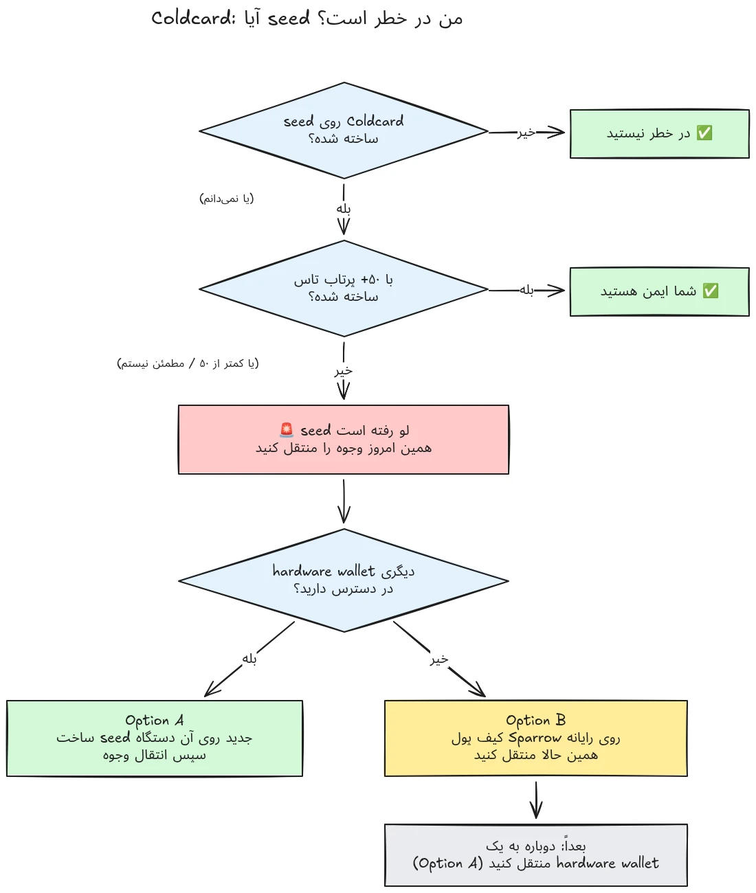

در 30 ژوئیهٔ 2026، حدود 594 BTC (حدود $38 میلیون) در کمتر از نیم ساعت از تقریباً 500 کیف پول دزدیده شد؛ کیف پول‌هایی که بذرهایشان روی کیف پول‌های سخت‌افزاری Coldcard تولید شده بود, و حمله هنوز ادامه دارد. علت ریشه‌ای، نقصی در سفت‌افزار مربوط به تولید بذر در دستگاه‌های Coldcard است: به‌جای تکیه بر تصادفی‌بودن کافیِ تولیدشده توسط سخت‌افزار، دستگاه‌های آسیب‌دیده مقدارهای قابل پیش‌بینی مانند یک شمارندهٔ کاهشی داخلی، شماره سریال دستگاه و ساعت داخلی را با آن ترکیب کرده‌اند. در نتیجه، عبارت‌های بازیابی تولیدشده روی این دستگاه‌ها آنتروپی بسیار کمتری از حد انتظار دارند و یک مهاجم می‌تواند آن‌ها را **بدون هیچ اقدامی از طرف شما** پیدا کند, نه بدافزار لازم است، نه فیشینگ، و نه دسترسی فیزیکی. مهاجم فقط فضای کلید کاهش‌یافته را جست‌وجو می‌کند و هر کیف پولی را که پیدا کند تخلیه می‌کند.

**همهٔ مدل‌های Coldcard تحت تأثیر هستند: Mk3، Mk4، Mk5 و Q.** تنها بذرهایی که امن محسوب می‌شوند آن‌هایی هستند که با روش پرتاب تاس تولید شده‌اند، و فقط اگر دست‌کم 50 پرتاب تاس استفاده شده باشد. اگر نمی‌دانید، به یاد ندارید، یا مطمئن نیستید بذر شما چگونه تولید شده است: آن را به‌عنوان به‌خطر‌افتاده در نظر بگیرید و وجوه خود را فوراً منتقل کنید.

این آموزش توضیح می‌دهد چگونه میزان در معرض‌بودن خود را ارزیابی کنید و چگونه وجوهتان را به یک کیف پول امن منتقل کنید, سریع، اما بدون اینکه در این فرایند اوضاع را بدتر کنید.

## در یک کادر: دستورالعمل‌های ساده

جامعهٔ امنیت Bitcoin حول یک مجموعهٔ ثابت از دستورالعمل‌های ساده هماهنگ شده است. این همان دستورالعمل‌هاست:

1. **آیا بذر خود را با 50+ پرتاب تاس فیزیکی روی Coldcard تولید کرده‌اید؟** اگر بله، شما امن هستید. اگر نه, یا اگر مطمئن نیستید, فرض کنید بذر به خطر افتاده است.
2. **یک مقصد امن آماده کنید**: اگر کیف پول سخت‌افزاری از فروشنده‌ای دیگر در دسترس دارید، همان؛ وگرنه یک کیف پول گرم Sparrow که روی رایانهٔ شما تولید شده باشد (جزئیات در گام 2).
3. **همین امروز همهٔ وجوه خود را به آنجا بفرستید**، با کارمزدی که بلوک بعدی را هدف بگیرد، و منتظر یک تأییدیه بمانید (جزئیات در گام 3).
4. **یک passphrase برای شما زمان می‌خرد، نه ایمنی.** به نظر نمی‌رسد مهاجمان هنوز passphraseها را در مقیاس انبوه آزمایش کنند, پیش از آنکه شروع کنند مهاجرت کنید.
5. **هرگز عبارت بازیابی خود را هیچ‌جا تایپ نکنید** تا آن را «بررسی» کنید. هر کسی که کلمات شما را می‌خواهد کلاهبردار است.
6. **به‌روزرسانی سفت‌افزار یک بذر موجود را اصلاح نمی‌کند.** بذری که با سفت‌افزار آسیب‌پذیر تولید شده باشد برای همیشه ضعیف می‌ماند؛ فقط یک بذر جدید و یک انتقال on-chain وجوه شما را امن می‌کند.

بقیهٔ این آموزش هر مرحله را با جزئیات توضیح می‌دهد.

## آیا من تحت تأثیر هستم؟

از خودتان یک سؤال بپرسید: **بذر چگونه تولید شده است؟**

- بذری که **توسط خود Coldcard** تولید شده باشد (جریان عادی «new wallet»، روی هر مدلی, Mk3، Mk4، Mk5 یا Q): **آن را به‌عنوان به‌خطر‌افتاده در نظر بگیرید**. همین حالا مهاجرت کنید.
- بذری که با قابلیت **پرتاب تاس** Coldcard تولید شده باشد، با **دست‌کم 50 پرتاب تاس فیزیکی** که خودتان انجام داده‌اید: آنتروپی از تاس‌های شما آمده، نه از مولد معیوب. این تنها پیکربندی‌ای است که در حال حاضر امن محسوب می‌شود.
- پرتاب تاس با **کمتر از 50 پرتاب**، یا اینکه اجازه داده‌اید دستگاه آنتروپی را «کامل» کند: کافی نیست, آن را به‌عنوان به‌خطر‌افتاده در نظر بگیرید.
- بذری که **از دستگاه دیگری (غیر از Coldcard) وارد شده است**: نقص Coldcard شامل آن بذر نمی‌شود، اما بررسی کنید در اصل از کجا آمده است.
- **نمی‌دانید یا به یاد ندارید**: آن را به‌عنوان به‌خطر‌افتاده در نظر بگیرید. هزینهٔ یک مهاجرت غیرضروری، کارمزد تراکنش است؛ هزینهٔ یک حدس اشتباه، همه‌چیز است.

دو اطمینان خاطرِ نادرست رایج، به‌صراحت پاسخ داده می‌شوند:

- یک **passphrase BIP39** روی یک بذر آسیب‌دیده کیف پول را امن نمی‌کند, فقط زمان می‌خرد. خود بذر قابل کشف است، بنابراین passphrase شما تنها مانع باقی‌مانده می‌شود، و افراد معمولاً در برآورد آنتروپی passphrase ضعیف عمل می‌کنند. به نظر نمی‌رسد مهاجمان هنوز passphraseها را brute-force کنند؛ پیش از آنکه شروع کنند به یک بذر جدید مهاجرت کنید.
- یک کیف پول **Multisig** که شامل یک کلید Coldcard آسیب‌دیده باشد، فقط از طریق همان کلید به‌تنهایی قابل تخلیه نیست، اما کلید آسیب‌دیده دیگر هیچ امنیت واقعی‌ای اضافه نمی‌کند. بی‌درنگ آن را از حد نصاب امضا خارج و جایگزین کنید.

## گام 1: همین حالا اقدام کنید، اما بداهه‌کاری نکنید

در حالی که این متن را می‌خوانید، کیف پول‌ها در حال تخلیه‌شدن هستند. وضعیت درست این است که **امروز** مهاجرت کنید، با ابزارهایی که می‌فهمید, نه اینکه با یک تنظیمات ناآشنا در پنج دقیقه برای تراکنش عجله کنید و کوین‌های خود را به خلأ بفرستید.

پیش از هر چیز:

1. Coldcard و پشتیبان بذر خود را همان‌جا که هستند نگه دارید. هنوز برای امضای تراکنش مهاجرت به آن‌ها نیاز دارید.
2. **هرگز عبارت بازیابی خود را در هیچ رایانه، تلفن یا وب‌سایتی «برای بررسی اینکه آیا تحت تأثیر است» تایپ نکنید.** هیچ بررسی‌کنندهٔ مشروعی به بذر شما نیاز ندارد. هر کسی که 12 یا 24 کلمهٔ شما را می‌خواهد کلاهبرداری است که از این حادثه سوءاستفاده می‌کند, و کمپین‌های phishing پس از رویدادهایی مانند این، به‌طور قابل اتکا افزایش می‌یابند.
3. اطلاعات خود را فقط از وبلاگ رسمی و کانال‌های پشتیبانی Coinkite و از منابع خبری معتبر Bitcoin بگیرید.

## گام 2: یک کیف پول مقصد امن آماده کنید

به کیف پولی نیاز دارید که بذر آن **روی Coldcard تولید نشده باشد**. دو مسیر، بسته به آنچه در دسترس دارید:

### گزینه A: کیف پول سخت‌افزاری دیگری در دسترس دارید

این بهترین مسیر است. یک **بذر جدید** روی کیف پول سخت‌افزاری از فروشنده‌ای دیگر تولید کنید و وجوه خود را به آنجا منتقل کنید. برای دستگاه‌های اصلی، آموزش‌های مرحله‌به‌مرحله داریم:

https://planb.academy/tutorials/wallet/hardware/jade-7d62bf0c-f460-4e68-9635-af9b731dabc3

https://planb.academy/tutorials/wallet/hardware/bitbox02-6af8940f-e19b-4008-8c83-81017032608c

https://planb.academy/tutorials/wallet/hardware/trezor-safe-3-51d0d669-5d23-47c2-beb6-cc6fa0fb0ea0

https://planb.academy/tutorials/wallet/hardware/ledger-flex-3728773e-74d4-4177-b39f-bd923700c76a

https://planb.academy/tutorials/wallet/hardware/passport-74e53858-3fa2-43f9-b866-573297546236

برای بیشترین اطمینان، بذر را از **پرتاب‌های تاس فیزیکی (دست‌کم 50 پرتاب)** روی دستگاهی که از آن پشتیبانی می‌کند تولید کنید، تا آنتروپی به‌طور قابل راستی‌آزمایی از خود شما باشد. و برای مبالغ قابل توجه، از این فرصت استفاده کنید و به **Multisig میان فروشندگان مختلف** مهاجرت کنید، تا هیچ نقصی در یک دستگاه واحد هرگز دوباره نتواند به‌تنهایی وجوه شما را در معرض خطر قرار دهد.

### گزینه B: کیف پول سخت‌افزاری دیگری در دسترس نیست: وجوه را همین حالا امن کنید

روزها منتظر تحویل یک دستگاه نمانید، در حالی که بذر شما در یک فضای کلید قابل جست‌وجو نشسته است. به‌عنوان یک **پناهگاه موقت**، یک کیف پول گرم با بذری بسازید که **مستقیماً روی رایانهٔ شما با Sparrow Wallet تولید شده باشد**:

https://planb.academy/tutorials/wallet/desktop/sparrow-c674e2ac-d46f-4c82-92a7-7d1b0e262f5d

یا روی تلفن خود، با Blockstream App:

https://planb.academy/tutorials/wallet/mobile/blockstream-app-onchain-e84edaa9-fb65-48c1-a357-8a5f27996143

بله، یک کیف پول گرم معمولاً یک پله پایین‌تر از کیف پول سخت‌افزاری است, اما بذری روی یک رایانهٔ آنلاین که تحت کنترل شماست در حال حاضر **امن‌تر از بذر Coldcardی است که مهاجم می‌تواند محاسبه کند**. وقتی کیف پول سخت‌افزاری جدیدتان رسید، طبق گزینه A یک مهاجرت دوم از کیف پول گرم به آن انجام دهید.

پیش از دست‌زدن به وجوه قدیمی خود، کیف پول مقصد را کامل راه‌اندازی کنید: بذر را تولید کنید، پشتیبان را یادداشت کنید، و **یک آزمون بازیابی انجام دهید**, از روی پشتیبان نوشته‌شدهٔ خود بازیابی کنید تا ثابت شود کار می‌کند. سپس نخستین آدرس دریافت را تولید کنید و آن را روی صفحهٔ دستگاه بررسی کنید.

https://planb.academy/tutorials/wallet/backup/recovery-test-5a75db51-a6a1-4338-a02a-164a8d91b895

اگر فشار زمان شما را مجبور می‌کند آزمون بازیابی را رد کنید، مبلغ مهاجرت را در *فهرست پایش* خود نگه دارید و ظرف چند روز یک راه‌اندازی کامل و آزموده‌شده را دوباره انجام دهید.

## گام 3: وجوه را منتقل کنید

از یک هماهنگ‌کنندهٔ کیف پول مانند Sparrow Wallet روی دسکتاپ استفاده کنید، که با Coldcard به‌صورت air-gapped از طریق microSD یا از طریق USB کار می‌کند.

https://planb.academy/tutorials/wallet/desktop/sparrow-c674e2ac-d46f-4c82-92a7-7d1b0e262f5d

خود مهاجرت:

1. **کیف پول موجود (آسیب‌دیده) خود را بارگذاری کنید** در Sparrow به‌عنوان یک کیف پول فقط-ناظر (watch-only)، دقیقاً همان‌طور که هنگام راه‌اندازی اولیهٔ Coldcard خود انجام دادید.
2. **یک تراکنش بسازید** که وجوه شما را به یک آدرس دریافت در کیف پول جدیدتان بفرستد. آدرس مقصد را روی صفحهٔ دستگاه امضاکنندهٔ جدید، نویسه‌به‌نویسه، بررسی کنید.
3. **کارمزد جدی بپردازید.** اکنون زمان صرفه‌جویی چند sats نیست: تراکنشی که در Mempool گیر کند زمان در معرض‌بودن شما را طولانی‌تر می‌کند، زیرا مهاجم نیز کلید خصوصی شما را دارد و می‌تواند تا زمانی که تراکنش تأیید نشده است، یک دوبارخرجی replace-by-fee برای مهاجرت شما تلاش کند. از نرخ کارمزدی استفاده کنید که یکی دو بلوک بعدی را هدف بگیرد.
4. **با Coldcard خود امضا کنید** مثل همیشه، پخش کنید، و پیش از اینکه مهاجرت را انجام‌شده بدانید، دست‌کم منتظر یک تأییدیه بمانید. تراکنش را تا زمانی که تأیید شود دنبال کنید.
5. اگر UTXOهای زیادی دارید، انتقال همه‌چیز به یک خروجی واحد، همهٔ آن‌ها را on-chain به هم پیوند می‌دهد. اگر مدل حریم خصوصی شما مهم است، مهاجرت را به چند تراکنش تقسیم کنید, اما در این وضعیت خاص، **اول امنیت، بعد حریم خصوصی**. اجازه ندهید بهینه‌سازی حریم خصوصی مهاجرت را به تأخیر بیندازد.

https://planb.academy/tutorials/privacy/on-chain/utxo-labelling-d997f80f-8a96-45b5-8a4e-a3e1b7788c52

6. وقتی وجوه در کیف پول جدید تأیید شدند، **بذر قدیمی را برای همیشه بازنشسته کنید**. از آن دوباره استفاده نکنید، آن را «برای مبالغ کوچک» نگه ندارید، و پشتیبان‌های فیزیکی را نابود کنید تا بعداً شما یا وارثانتان را گمراه نکنند.

## گام 4: پیامدها

- **افشاگری‌های Coinkite را همچنان دنبال کنید.** تحقیق ادامه دارد و درک از پیکربندی‌های تحت تأثیر یک بار همین حالا هم گسترده‌تر شده است؛ فرض کنید ممکن است دوباره گسترده‌تر شود.
- **سفت‌افزار اصلاح‌شده منتشر شده است, اما بذرهای موجود را نجات نمی‌دهد.** Coinkite سفت‌افزار وصله‌شده (4.2.0 یا بالاتر برای Mk3) منتشر کرده است. هر Coldcardی را که قصد دارید به استفاده از آن ادامه دهید به‌روزرسانی کنید، اما بفهمید این به‌روزرسانی چه کاری انجام می‌دهد و چه کاری انجام نمی‌دهد: تولید *بذر* را از این به بعد اصلاح می‌کند؛ بذری که با سفت‌افزار آسیب‌پذیر تولید شده باشد برای همیشه ضعیف می‌ماند. اگر می‌خواهید به استفاده از Coldcard ادامه دهید، ابتدا به‌روزرسانی کنید، سپس یک بذر کاملاً جدید تولید کنید (در حالت ایده‌آل با 50+ پرتاب تاس) و وجوه خود را به‌صورت on-chain به آن منتقل کنید.
- **درس ساختاری را بگیرید.** این حادثه به این معنی نیست که خودحضانتی خراب است, وجوه پشت آنتروپی قابل راستی‌آزماییِ پرتاب تاس یا Multisig چندفروشنده‌ای هرگز در معرض خطر نبودند. معنایش این است که اعتماد به مولد عدد تصادفی یک دستگاه واحد، مثل هر چیز دیگری یک نقطهٔ شکست واحد است. آنتروپی قابل راستی‌آزمایی (پرتاب تاس)، Multisig میان فروشندگان مختلف، و پشتیبان‌های آزموده‌شده چیزهایی هستند که یک راه‌اندازی را در برابر باگ بعدی فروشنده مقاوم می‌کنند، هر فروشنده‌ای که باشد.

https://planb.academy/tutorials/wallet/hardware/coldcard-co-sign-4ed0c269-29f9-4215-957d-e0deba3dcc8f
