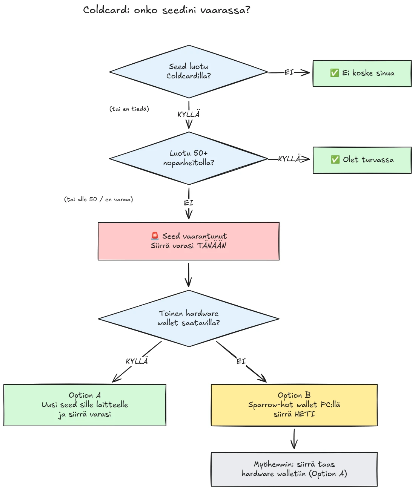

Noin 594 BTC (noin 38 miljoonaa dollaria) varastettiin 30. heinäkuuta 2026 alle puolessa tunnissa noin 500 lompakosta, joiden seedit oli luotu Coldcard-laitteistolompakoilla, ja hyökkäys jatkuu edelleen. Perussyy on Coldcard-laitteiden seedin luonnissa oleva laiteohjelmistovirhe: riittävän laitteistopohjaisen satunnaisuuden sijaan alttiit laitteet sekoittivat mukaan ennustettavia arvoja, kuten sisäisen alaslaskurin, laitteen sarjanumeron ja sisäisen kellon. Tämän seurauksena näillä laitteilla luodut seed-lauseet sisältävät paljon vähemmän entropiaa kuin oletettiin, ja hyökkääjä voi löytää ne **ilman mitään toimia sinun puoleltasi**, ei haittaohjelmia, ei phishingiä, ei fyysistä pääsyä. Hyökkääjä yksinkertaisesti etsii pienentyneestä avainavaruudesta ja tyhjentää jokaisen löytämänsä lompakon.

**Kaikki Coldcard-mallit ovat alttiita: Mk3, Mk4, Mk5 ja Q.** Ainoat turvallisina pidetyt seedit ovat nopanheittomenetelmällä luodut, ja vain jos heittoja käytettiin vähintään 50. Jos et tiedä, et muista tai et ole varma, miten seedisi luotiin: pidä sitä vaarantuneena ja siirrä varasi välittömästi.

Tämä opas kertoo, miten arvioit oman altistumisesi ja miten siirrät varasi turvalliseen lompakkoon nopeasti, mutta pahentamatta tilannetta matkan varrella.

## Yhdessä laatikossa: yksinkertaiset ohjeet

Bitcoinin turvallisuusyhteisö koordinoi toimintaansa yhden kiinteän, yksinkertaisen ohjesarjan ympärillä. Tässä se on:

1. **Loitko seedisi vähintään 50 fyysisellä nopanheitolla Coldcardilla?** Jos kyllä, olet turvassa. Jos et, tai jos et ole varma, oleta seedin olevan vaarantunut.
2. **Valmistele turvallinen kohde**: toisen valmistajan laitteistolompakko, jos sinulla on sellainen käsillä, muuten tietokoneellasi luotu Sparrow-kuumalompakko (yksityiskohdat vaiheessa 2).
3. **Lähetä kaikki varasi sinne tänään**, seuraavaan lohkoon tähtäävällä siirtomaksulla, ja odota vahvistusta (yksityiskohdat vaiheessa 3).
4. **Passphrase ostaa sinulle aikaa, ei turvallisuutta.** Hyökkääjät eivät näytä vielä murtavan passphraseja väsytyshyökkäyksellä, siirrä varasi ennen kuin he aloittavat.
5. **Älä koskaan kirjoita seed-lausettasi mihinkään** sen "tarkistamiseksi". Kuka tahansa, joka pyytää sanojasi, on huijari.
6. **Laiteohjelmiston päivittäminen ei korjaa olemassa olevaa seediä.** Alttiilla laiteohjelmistolla luotu seed pysyy heikkona ikuisesti; vain uusi seed ja siirto lohkoketjussa turvaavat varasi.

Tämän oppaan loppuosa käy jokaisen vaiheen läpi yksityiskohtaisesti.

## Olenko altis?

Kysy itseltäsi yksi kysymys: **miten seed luotiin?**

- Seed, jonka **Coldcard loi itse** (tavallinen "new wallet" -kulku, millä tahansa mallilla, Mk3, Mk4, Mk5 tai Q): **pidä sitä vaarantuneena**. Siirrä varat nyt.
- Seed, joka luotiin Coldcardin **nopanheitto**-toiminnolla **vähintään 50 fyysisellä nopanheitolla**, jotka teit itse: entropia tuli nopistasi, ei viallisesta generaattorista. Tämä on ainoa kokoonpano, jota tällä hetkellä pidetään turvallisena.
- Nopanheitto **alle 50 heitolla**, tai annoit laitteen "täydentää" entropian: ei riitä, pidä sitä vaarantuneena.
- Seed, joka on **tuotu toisesta (ei-Coldcard-) laitteesta**: Coldcardin virhe ei koske kyseistä seediä, mutta selvitä, mistä se alun perin tuli.
- **Et tiedä tai et muista**: pidä sitä vaarantuneena. Tarpeettoman siirron hinta on yksi siirtomaksu; väärän arvauksen hinta on kaikki.

Kolme yleistä väärää rauhoittelua, käsiteltynä suoraan:

- **BIP39-passphrase** alttiin seedin päällä ei tee lompakosta turvallista, se ostaa vain aikaa. Itse seed on löydettävissä, joten passphrasestasi tulee ainoa este, ja ihmiset arvioivat passphrasen entropiaa yleensä huonosti. Hyökkääjät eivät näytä vielä murtavan passphraseja raa'alla voimalla; siirry uuteen seediin ennen kuin he aloittavat.
- **Multisig**-lompakkoa, joka sisältää alttiin Coldcard-avaimen, ei voi tyhjentää pelkästään sen avaimen kautta, mutta altis avain ei enää tuo mitään todellista turvaa. Kierrätä se pois kvorumista viipymättä.
- **Uudempi laitteistolompakko samalla seedillä**: monet ostivat uudemman Coldcardin (tai toisen laitteen) ja palauttivat siihen olemassa olevan seedinsä. Se ei muuta mitään: vaarantunut on seed, ei laite. Jos seedisi luotiin alttiilla Coldcardilla, se pysyy heikkona riippumatta siitä, mihin sen palautat. Luo täysin uusi seed ja siirrä varat.

## Vaihe 1: Toimi nyt, mutta älä improvisoi

Lompakoita tyhjennetään sillä aikaa kun luet tätä. Oikea asenne on siirtää varat **tänään** työkaluilla, jotka ymmärrät, eikä hätäillä transaktiota viidessä minuutissa tuntemattomalla kokoonpanolla ja lähettää kolikkosi tyhjyyteen.

Ennen kaikkea muuta:

1. Pidä Coldcardisi ja seed-varmuuskopiosi siellä missä ne ovat. Tarvitset niitä edelleen siirtotransaktion allekirjoittamiseen.
2. **Älä koskaan kirjoita seed-lausettasi mihinkään tietokoneeseen, puhelimeen tai verkkosivustolle "tarkistaaksesi, onko se altis".** Mikään laillinen tarkistin ei vaadi seediäsi. Kuka tahansa, joka pyytää 12 tai 24 sanaasi, on huijari, joka hyödyntää tätä tapausta, ja phishing-kampanjat lisääntyvät luotettavasti tällaisten tapahtumien jälkeen.
3. Ole tarkkana siitä, mistä hankit tietosi. Coinkiten varhaiset tiedotteet on jo useaan otteeseen kumottu ensimmäisten päivien aikana, joten älä pidä valmistajaa ainoana lähteenäsi: ristiintarkista tiedot riippumattomilta turvallisuustutkijoilta ja vakiintuneilta Bitcoin-uutismedioilta.

## Vaihe 2: Valmistele turvallinen kohdelompakko

Tarvitset lompakon, jonka seediä **ei ole luotu Coldcardilla**. Kaksi polkua sen mukaan, mitä sinulla on käsillä:

### Vaihtoehto A: Sinulla on toinen laitteistolompakko käsillä

Tämä on paras polku. Luo **uusi seed** toisen valmistajan laitteistolompakolla ja siirrä varasi sinne. Meillä on vaiheittaiset oppaat tärkeimmille laitteille:

https://planb.academy/tutorials/wallet/hardware/jade-7d62bf0c-f460-4e68-9635-af9b731dabc3

https://planb.academy/tutorials/wallet/hardware/bitbox02-6af8940f-e19b-4008-8c83-81017032608c

https://planb.academy/tutorials/wallet/hardware/trezor-safe-3-51d0d669-5d23-47c2-beb6-cc6fa0fb0ea0

https://planb.academy/tutorials/wallet/hardware/ledger-flex-3728773e-74d4-4177-b39f-bd923700c76a

https://planb.academy/tutorials/wallet/hardware/passport-74e53858-3fa2-43f9-b866-573297546236

Suurimman varmuuden saat luomalla seedin **fyysisillä nopanheitoilla (vähintään 50 heittoa)** laitteella, joka tukee sitä, jolloin entropia on todistettavasti sinun. Ja merkittävien summien kohdalla käytä tämä tilaisuus siirtyä **eri valmistajien laitteiden väliseen multisigiin**, jottei yhden laitteen virhe voi enää koskaan yksinään vaarantaa varojasi.

### Vaihtoehto B: Muuta laitteistolompakkoa ei ole saatavilla: turvaa varat HETI

Älä odota päiviä laitteen toimitusta samalla kun seedisi lojuu haettavissa olevassa avainavaruudessa. **Väliaikaiseksi turvapaikaksi** luo kuumalompakko, jonka seed **luodaan suoraan tietokoneellasi Sparrow Walletilla**:

https://planb.academy/tutorials/wallet/desktop/sparrow-c674e2ac-d46f-4c82-92a7-7d1b0e262f5d

Tai puhelimellasi Blockstream Appilla:

https://planb.academy/tutorials/wallet/mobile/blockstream-app-onchain-e84edaa9-fb65-48c1-a357-8a5f27996143

Kyllä, kuumalompakko on normaalisti askel taaksepäin laitteistolompakosta, mutta seed hallinnassasi olevalla verkkoon kytketyllä tietokoneella on tällä hetkellä **turvallisempi kuin Coldcard-seed, jonka hyökkääjä voi laskea**. Kun uusi laitteistolompakkosi saapuu, tee toinen siirto kuumalompakosta siihen vaihtoehdon A mukaisesti.

Pystytä kohdelompakko kokonaan valmiiksi ennen kuin kosket vanhoihin varoihisi: luo seed, kirjoita varmuuskopio ylös ja **tee palautustesti**, palauta lompakko kirjoittamastasi varmuuskopiosta todistaaksesi, että se toimii. Luo sitten ensimmäinen vastaanotto-osoite ja varmista se laitteen näytöltä.

https://planb.academy/tutorials/wallet/backup/recovery-test-5a75db51-a6a1-4338-a02a-164a8d91b895

Jos aikapaine pakottaa sinut ohittamaan palautustestin, pidä siirretty summa *seurantalistallasi* ja tee täysi, testattu pystytys uudelleen päivien sisällä.

## Vaihe 3: Siirrä varat

Käytä lompakkokoordinaattoria, kuten Sparrow Walletia työpöydällä, joka toimii Coldcardin kanssa ilmaeristetysti microSD:n välityksellä tai USB:n kautta.

https://planb.academy/tutorials/wallet/desktop/sparrow-c674e2ac-d46f-4c82-92a7-7d1b0e262f5d

Itse siirto:

1. **Lataa olemassa oleva (altis) lompakkosi** Sparrowiin watch-only-lompakkona, täsmälleen kuten teit ottaessasi Coldcardisi ensimmäisen kerran käyttöön.
2. **Rakenna transaktio**, joka lähettää varasi uuden lompakkosi vastaanotto-osoitteeseen. Varmista kohdeosoite uuden allekirjoituslaitteen näytöltä merkki merkiltä.
3. **Maksa kunnollinen siirtomaksu.** Nyt ei ole hetki säästää muutamaa satia: mempooliin jumiin jäänyt transaktio pitkittää altistumistasi, koska hyökkääjällä on myös yksityinen avaimesi ja hän voi yrittää siirrostasi replace-by-fee-kaksoiskulutusta niin kauan kuin se on vahvistamatta. Käytä siirtomaksutasoa, joka tähtää seuraavaan lohkoon tai kahteen.
4. **Allekirjoita Coldcardillasi** tavalliseen tapaan, lähetä transaktio verkkoon ja odota vähintään yhtä vahvistusta ennen kuin pidät siirtoa valmiina. Seuraa transaktiota, kunnes se vahvistuu.
5. Jos hallussasi on monta UTXO:ta, kaiken tyhjentäminen yhteen ulostuloon yhdistää ne kaikki toisiinsa lohkoketjussa. Jos yksityisyysmallisi on tärkeä, jaa siirto useaan transaktioon, mutta tässä nimenomaisessa tilanteessa **turvallisuus ensin, yksityisyys toiseksi**. Älä anna yksityisyyden optimoinnin viivyttää siirtoa.

https://planb.academy/tutorials/privacy/on-chain/utxo-labelling-d997f80f-8a96-45b5-8a4e-a3e1b7788c52

6. Kun varat on vahvistettu uudessa lompakossa, **poista vanha seed pysyvästi käytöstä**. Älä käytä sitä uudelleen, älä "säilytä sitä pieniä summia varten", ja tuhoa fyysiset varmuuskopiot, jotta ne eivät voi myöhemmin johtaa sinua tai perillisiäsi harhaan.

## Vaihe 4: Jälkiseuraukset

- **Seuraa tutkintaa edelleen, useasta lähteestä.** Käsitys alttiista kokoonpanoista on jo laajentunut useammin kuin kerran, ja valmistajan lausuntoja on korjattu matkan varrella. Seuraa riippumattomia tutkijoita ja vakiintunutta Bitcoin-mediaa Coinkiten omien tiedotteiden rinnalla, ja oleta että kuva voi vielä muuttua.
- **Korjattu laiteohjelmisto on julkaistu, mutta se ei pelasta olemassa olevia seedejä.** Coinkite on julkaissut korjatun laiteohjelmiston (4.2.0 tai uudempi Mk3:lle). Päivitä jokainen Coldcard, jota aiot jatkossa käyttää, mutta ymmärrä mitä päivitys tekee ja mitä ei: se korjaa seedin *luonnin* jatkossa; alttiilla laiteohjelmistolla luotu seed pysyy heikkona ikuisesti. Jos haluat jatkaa Coldcardin käyttöä, päivitä ensin, luo sitten täysin uusi seed (mieluiten vähintään 50 nopanheitolla) ja siirrä varasi siihen lohkoketjussa.
- **Ota opiksi rakenteellisella tasolla.** Tämä tapaus ei tarkoita, että self-custody olisi rikki, todistettavissa olevaan nopanheittoentropiaan tai usean valmistajan multisigiin nojaavat varat eivät olleet koskaan vaarassa. Se tarkoittaa, että yhden laitteen satunnaislukugeneraattoriin luottaminen on yksittäinen vikapiste kuten mikä tahansa muu. Todistettavissa oleva entropia (nopanheitot), eri valmistajien välinen multisig ja testatut varmuuskopiot ovat ne asiat, jotka tekevät kokoonpanosta kestävän seuraavaa valmistajan bugia vastaan, kuka valmistaja sitten onkin.
