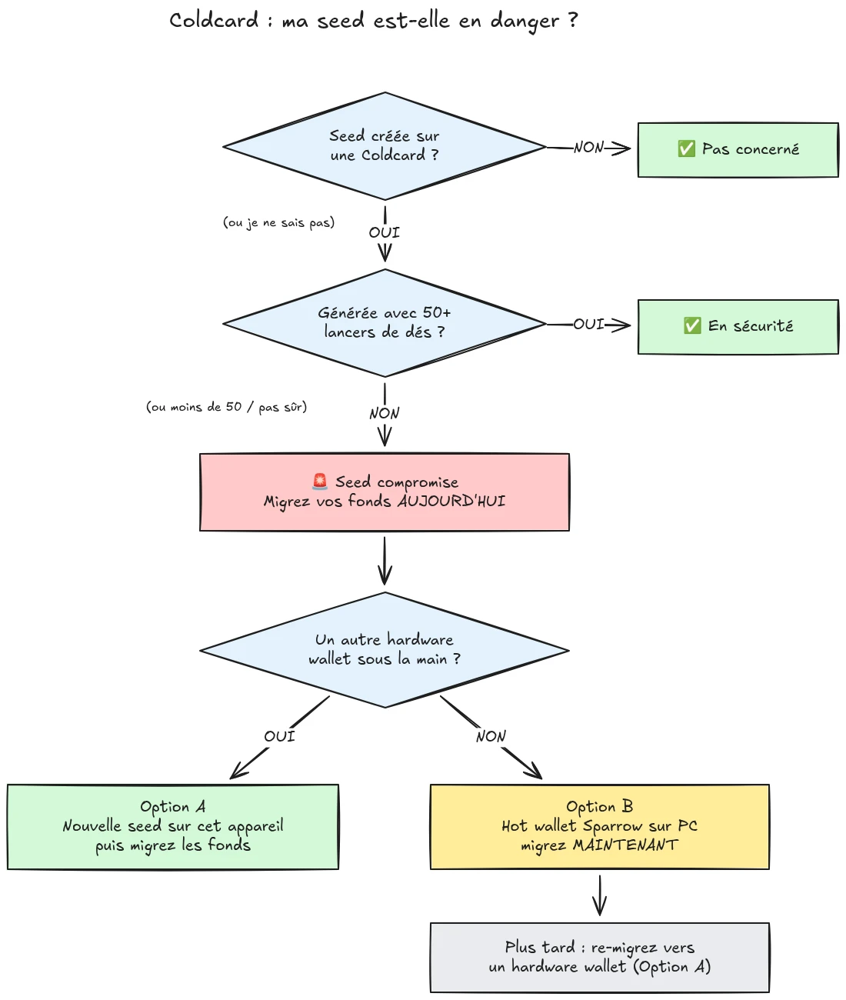

Le 30 juillet 2026, environ 594 BTC (près de 38 millions de dollars) ont été volés en moins d'une demi-heure sur environ 500 portefeuilles dont les phrases de récupération avaient été générées sur des hardware wallets Coldcard, et l'attaque est toujours en cours. La cause racine est une faille du firmware dans la génération de la seed des appareils Coldcard : au lieu de s'appuyer sur un aléa matériel suffisant, les appareils affectés mélangeaient des valeurs prévisibles comme un compteur interne, le numéro de série de l'appareil et l'horloge interne. Résultat : les seeds générées sur ces appareils contiennent beaucoup moins d'entropie que prévu et peuvent être retrouvées par un attaquant **sans aucune action de votre part**, pas de malware, pas de phishing, pas d'accès physique. L'attaquant explore simplement l'espace de clés réduit et vide tous les portefeuilles qu'il trouve.

**Tous les modèles Coldcard sont affectés : Mk3, Mk4, Mk5 et Q.** Les seules seeds considérées comme sûres sont celles générées avec la méthode des lancers de dés, et seulement si au moins 50 lancers ont été utilisés. Si vous ne savez pas, ne vous souvenez plus, ou n'êtes pas certain de la façon dont votre seed a été générée : considérez-la comme compromise et déplacez vos fonds immédiatement.

Ce tutoriel explique comment évaluer votre exposition et comment migrer vos fonds vers un portefeuille sûr, rapidement, mais sans aggraver la situation en chemin.

## En un encadré : les instructions simples

La communauté de la sécurité Bitcoin se coordonne autour d'un jeu unique d'instructions simples. Le voici :

1. **Avez-vous généré votre seed avec plus de 50 lancers de dés physiques sur la Coldcard ?** Si oui, vous êtes en sécurité. Si non, ou si vous n'êtes pas sûr, considérez la seed comme compromise.
2. **Préparez une destination sûre** : un hardware wallet d'un autre fabricant si vous en avez un sous la main, sinon un hot wallet Sparrow généré sur votre ordinateur (détails à l'étape 2).
3. **Envoyez-y tous vos fonds aujourd'hui**, avec des frais visant le prochain bloc, et attendez une confirmation (détails à l'étape 3).
4. **Une passphrase vous achète du temps, pas de la sécurité.** Les attaquants ne semblent pas encore brute-forcer les passphrases, migrez avant qu'ils ne commencent.
5. **Ne tapez jamais votre phrase de récupération où que ce soit** pour la « vérifier ». Quiconque demande vos mots est un escroc.
6. **Mettre à jour le firmware ne répare pas une seed existante.** Une seed générée par un firmware vulnérable reste faible pour toujours ; seuls une nouvelle seed et un transfert on-chain sécurisent vos fonds.

La suite de ce tutoriel détaille chaque étape.

## Suis-je concerné ?

Posez-vous une seule question : **comment la seed a-t-elle été générée ?**

- Seed générée **par la Coldcard elle-même** (le parcours normal « nouveau portefeuille », sur n'importe quel modèle, Mk3, Mk4, Mk5 ou Q) : **considérez-la comme compromise**. Migrez maintenant.
- Seed générée avec la fonction **lancers de dés** de la Coldcard, avec **au moins 50 lancers physiques** effectués par vous-même : l'entropie provient de vos dés, pas du générateur défaillant. C'est la seule configuration actuellement considérée comme sûre.
- Lancers de dés avec **moins de 50 lancers**, ou vous avez laissé l'appareil « compléter » l'entropie : insuffisant, considérez-la comme compromise.
- Seed **importée depuis un autre appareil (non Coldcard)** : la faille Coldcard ne s'applique pas à cette seed, mais vérifiez son origine.
- **Vous ne savez pas ou ne vous souvenez plus** : considérez-la comme compromise. Le coût d'une migration inutile, c'est des frais de transaction ; le coût d'un mauvais pari, c'est tout.

Trois fausses réassurances courantes, traitées explicitement :

- Une **passphrase BIP39** par-dessus une seed affectée ne rend pas le portefeuille sûr, elle ne fait qu'acheter du temps. La seed elle-même est retrouvable, votre passphrase devient donc l'unique barrière, et on surestime presque toujours l'entropie de sa passphrase. Les attaquants ne semblent pas encore brute-forcer les passphrases ; migrez vers une nouvelle seed avant qu'ils ne commencent.
- Un portefeuille **multisig** qui inclut une clé Coldcard affectée ne peut pas être vidé via cette seule clé, mais cette clé n'apporte plus aucune sécurité réelle. Remplacez-la dans le quorum sans attendre.
- **Un hardware wallet plus récent avec la même seed** : beaucoup de gens ont acheté une Coldcard plus récente (ou un autre appareil) et y ont restauré leur seed existante. Ça ne change rien : c'est la seed qui est compromise, pas l'appareil. Une seed générée sur une Coldcard affectée reste faible où que vous la restauriez. Générez une seed toute neuve et migrez.

## Étape 1 : Agissez maintenant, mais n'improvisez pas

Des portefeuilles sont vidés en ce moment même. La bonne posture est de migrer **aujourd'hui**, avec des outils que vous maîtrisez, pas de précipiter une transaction en cinq minutes avec un setup inconnu et d'envoyer vos coins dans le vide.

Avant toute chose :

1. Gardez votre Coldcard et la sauvegarde de votre seed là où elles sont. Vous en avez encore besoin pour signer la transaction de migration.
2. **Ne tapez jamais votre phrase de récupération dans un ordinateur, un téléphone ou un site web « pour vérifier si elle est affectée ».** Aucun vérificateur légitime ne demande votre seed. Quiconque demande vos 12 ou 24 mots est un escroc qui exploite cet incident, et les campagnes de phishing explosent systématiquement après ce genre d'événement.
3. Faites attention à vos sources d'information. Les premières communications de Coinkite ont déjà été contredites plusieurs fois en quelques jours, ne faites donc pas du fabricant votre seule source : recoupez avec des chercheurs en sécurité indépendants et des médias Bitcoin établis.

## Étape 2 : Préparez un portefeuille de destination sûr

Il vous faut un portefeuille dont la seed n'a **pas été générée sur une Coldcard**. Deux chemins, selon ce que vous avez sous la main :

### Option A : Vous avez un autre hardware wallet sous la main

C'est le meilleur chemin. Générez une **nouvelle seed** sur un hardware wallet d'un autre fabricant et migrez vos fonds dessus. Nous avons des tutoriels pas-à-pas pour les principaux appareils :

https://planb.academy/tutorials/wallet/hardware/jade-7d62bf0c-f460-4e68-9635-af9b731dabc3

https://planb.academy/tutorials/wallet/hardware/bitbox02-6af8940f-e19b-4008-8c83-81017032608c

https://planb.academy/tutorials/wallet/hardware/trezor-safe-3-51d0d669-5d23-47c2-beb6-cc6fa0fb0ea0

https://planb.academy/tutorials/wallet/hardware/ledger-flex-3728773e-74d4-4177-b39f-bd923700c76a

https://planb.academy/tutorials/wallet/hardware/passport-74e53858-3fa2-43f9-b866-573297546236

Pour une assurance maximale, générez la seed à partir de **lancers de dés physiques (au moins 50 lancers)** sur un appareil qui le permet, afin que l'entropie soit vérifiable et vienne de vous. Et pour des montants importants, profitez-en pour passer en **multisig multi-fabricants**, afin qu'aucune faille d'un seul appareil ne puisse plus jamais, à elle seule, mettre vos fonds en danger.

### Option B : Pas d'autre hardware wallet disponible : sécurisez les fonds MAINTENANT

N'attendez pas plusieurs jours la livraison d'un appareil pendant que votre seed reste dans un espace de clés explorable. En **refuge temporaire**, créez un hot wallet avec une seed **générée directement sur votre ordinateur avec Sparrow Wallet** :

https://planb.academy/tutorials/wallet/desktop/sparrow-c674e2ac-d46f-4c82-92a7-7d1b0e262f5d

Ou, sur votre téléphone, avec la Blockstream App :

https://planb.academy/tutorials/wallet/mobile/blockstream-app-onchain-e84edaa9-fb65-48c1-a357-8a5f27996143

Oui, un hot wallet est normalement un cran en dessous d'un hardware wallet, mais une seed sur un ordinateur en ligne que vous contrôlez est actuellement **plus sûre qu'une seed Coldcard qu'un attaquant peut calculer**. Une fois votre nouveau hardware wallet reçu, faites une seconde migration du hot wallet vers celui-ci, en suivant l'option A.

Configurez complètement le portefeuille de destination avant de toucher à vos anciens fonds : générez la seed, écrivez la sauvegarde, et **faites un test de récupération**, restaurez depuis votre sauvegarde écrite pour prouver qu'elle fonctionne. Générez ensuite une première adresse de réception et vérifiez-la sur l'écran de l'appareil.

https://planb.academy/tutorials/wallet/backup/recovery-test-5a75db51-a6a1-4338-a02a-164a8d91b895

Si l'urgence vous force à sauter le test de récupération, gardez le montant migré sous surveillance et refaites un setup complet et testé dans les jours qui suivent.

## Étape 3 : Déplacez les fonds

Utilisez un coordinateur de portefeuille comme Sparrow Wallet sur ordinateur, qui fonctionne avec la Coldcard en air-gap via microSD ou via USB.

https://planb.academy/tutorials/wallet/desktop/sparrow-c674e2ac-d46f-4c82-92a7-7d1b0e262f5d

La migration elle-même :

1. **Chargez votre portefeuille existant (affecté)** dans Sparrow en watch-only, exactement comme lors de la configuration initiale de votre Coldcard.
2. **Construisez une transaction** envoyant vos fonds vers une adresse de réception de votre nouveau portefeuille. Vérifiez l'adresse de destination sur l'écran du nouvel appareil de signature, caractère par caractère.
3. **Payez des frais sérieux.** Ce n'est pas le moment d'économiser quelques sats : une transaction coincée dans le mempool prolonge votre exposition, car l'attaquant détient lui aussi votre clé privée et peut tenter un double-spend par replace-by-fee de votre migration tant qu'elle n'est pas confirmée. Visez le prochain bloc ou les deux prochains.
4. **Signez avec votre Coldcard** comme d'habitude, diffusez, et attendez au moins une confirmation avant de considérer la migration terminée. Surveillez la transaction jusqu'à sa confirmation.
5. Si vous détenez de nombreux UTXO, tout regrouper en une seule sortie les lie tous on-chain. Si votre modèle de confidentialité compte, répartissez la migration en plusieurs transactions, mais dans cette situation précise, **la sécurité d'abord, la confidentialité ensuite**. Ne laissez pas l'optimisation de la confidentialité retarder la migration.

https://planb.academy/tutorials/privacy/on-chain/utxo-labelling-d997f80f-8a96-45b5-8a4e-a3e1b7788c52

6. Une fois les fonds confirmés sur le nouveau portefeuille, **retirez définitivement l'ancienne seed du service**. Ne la réutilisez pas, ne la « gardez pas pour de petits montants », et détruisez les sauvegardes physiques pour qu'elles ne puissent pas vous induire en erreur plus tard, vous ou vos héritiers.

## Étape 4 : L'après

- **Suivez l'enquête, via plusieurs sources.** La compréhension des configurations affectées s'est déjà élargie plus d'une fois, et les déclarations du fabricant ont été corrigées en cours de route. Suivez les chercheurs indépendants et les médias Bitcoin établis en plus des annonces de Coinkite, et partez du principe que le tableau peut encore bouger.
- **Un firmware corrigé est sorti, mais il ne sauve pas les seeds existantes.** Coinkite a publié un firmware corrigé (4.2.0 ou ultérieur pour la Mk3). Mettez à jour toute Coldcard que vous comptez continuer à utiliser, mais comprenez bien ce que la mise à jour fait et ne fait pas : elle corrige la *génération* des seeds pour l'avenir ; une seed générée par un firmware vulnérable reste faible pour toujours. Si vous voulez continuer avec une Coldcard, mettez d'abord à jour, puis générez une seed toute neuve (idéalement avec plus de 50 lancers de dés) et déplacez vos fonds dessus on-chain.
- **Tirez la leçon structurelle.** Cet incident ne signifie pas que l'auto-conservation est cassée, les fonds protégés par une entropie vérifiable aux dés ou par un multisig multi-fabricants n'ont jamais été en danger. Il signifie que faire confiance au générateur d'aléa d'un seul appareil est un point de défaillance unique comme un autre. L'entropie vérifiable (lancers de dés), le multisig multi-fabricants et les sauvegardes testées sont ce qui rend un setup robuste au prochain bug de fabricant, quel que soit le fabricant.
